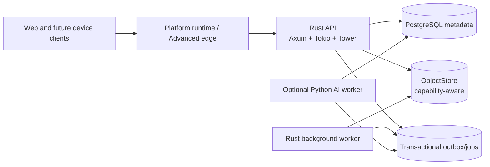

# Synveil

> **Your data. Your devices. Your cloud.**

Synveil is a planned private cloud anyone can self-host for owning, protecting,
synchronizing, organizing, and understanding files, backups, photos, devices,
and development projects. It is designed to feel approachable to non-technical
users while retaining advanced self-hosting control, and to remain useful
without a mandatory hosted Synveil service or AI.

> [!IMPORTANT]
> Synveil is currently in the **foundation stage**. This repository contains a
> validated Rust/API foundation, React/Vite web skeleton, optional isolated AI
> package boundary, and cross-platform CI. It does not yet contain product
> authentication, file, sync, backup, or deployment capabilities. Every
> product capability below remains a blueprint unless explicitly marked
> otherwise.

## Status vocabulary

| Label | Meaning |
|---|---|
| `IMPLEMENTED` | Shipped in this repository and covered by validation. |
| `SKELETON IMPLEMENTED` | A foundation boundary exists, but it is not a product capability. |
| `VALIDATED` | The applicable foundation checks have passed; this does not promote a product feature. |
| `IN PROGRESS` | Actively being built but not a stable product capability. |
| `PLANNED` | Specified in the blueprint; implementation has not been completed. |
| `EXPERIMENTAL` | A future exploration with an unstable contract. |
| `NON-GOAL` | Deliberately outside the stated scope. |

Current repository status: **foundation skeleton implemented and validated**.
No product capability is marked `IMPLEMENTED`.

The initial PostgreSQL canonical schema and explicit SQLx persistence mappings
for the validated domain subset are implemented. Disposable PostgreSQL
integration evidence remains environment-dependent and is reported separately;
Argon2id password hashing, persistent first-admin bootstrap, verifier-only
browser-session persistence, and transport-neutral login/session semantics are
implemented; HTTP login/logout transport, cookies/CSRF, device credentials,
recovery, uploads, journals, sync, and backup remain planned.

## Product direction

Synveil's product north star is:

> **A private cloud anyone can self-host.**

The first-class audience includes technical users, power users, families, home
users, students, creators, developers, small teams, and non-technical users.
The intended experience is `install → choose storage → create account → connect
devices → ready`. The architecture uses **Personal / Home Mode** for guided,
installer-based operation and **Advanced / Server Mode** for Docker Compose,
external PostgreSQL, NAS, S3/MinIO, custom networking, CLI, and detailed
diagnostics. Both modes use the same protocol and data-correctness model.

The product principles are **Easy by default**, **Safe by default**,
**Cross-platform by design**, **Powerful when needed**, and the existing
**correctness before cleverness**. A core user-facing feature should not require
an ordinary user to open a terminal. These are planned product goals, not
implemented capabilities.

Synveil combines several related, but explicitly separated, domains:

- `PLANNED` — authenticated files and folders, streaming transfers, resumable
  uploads, versions, trash, sharing, and integrity checks;
- `PLANNED` — first-class devices and a cursor-based multi-device sync
  protocol that preserves conflicting user data;
- `PLANNED` — backup sets, committed snapshots, retention, and verified
  restore, with deletion behavior distinct from sync;
- `PLANNED` — photo originals, renditions, timeline, albums, and mobile upload;
- `PLANNED` — whole-object deduplication and policy-based Zstandard
  compression;
- `PLANNED` — Forgejo repository inventory and backup through an integration
  boundary rather than a new Git server;
- `PLANNED` — optional asynchronous OCR, tagging, and semantic search using
  local or explicitly configured remote models;
- `PLANNED` — guided/native installation direction for Windows, macOS, Linux
  Desktop, and Linux Server, with storage selection, service lifecycle,
  human-readable health, safe updates, migration, and data-preserving
  uninstall;
- `PLANNED` — simple device pairing and understandable remote-access paths,
  with no mandatory proprietary Synveil relay;
- `PLANNED` (advanced) — files on demand, content-defined chunking, and
  deterministic smart tiering behind later phase gates;
- `EXPERIMENTAL` — repository/model intelligence experiments, anomaly
  detection, and multi-node scale-out.

The canonical feature catalogue and status are in
[docs/en/FEATURES.md](docs/en/FEATURES.md). The Vietnamese edition is in
[docs/vi/FEATURES.md](docs/vi/FEATURES.md).

## Architectural shape

The first production shape is a modular monolith, not a premature collection
of microservices:



Core mutations commit metadata, a per-library change journal entry, audit
information, and durable work in one PostgreSQL transaction. File bytes are
made durable in the object store before metadata can reference them. Optional
consumers run after the core operation succeeds. If AI or Forgejo is offline,
file, sync, backup, and restore operations remain available.

The preferred implementation stack is:

- React, TypeScript, and Vite for the authenticated web application;
- Rust, Axum, Tokio, Tower, Serde, SQLx, and `tracing` for the server and core
  workers;
- PostgreSQL for metadata, journals, jobs, audit state, and—later—`pgvector`;
- an `ObjectStore` abstraction with local filesystem support first and
  S3-compatible/MinIO/NAS-backed adapters later;
- Python for optional, asynchronous ML/OCR/embedding workers;
- Docker Compose and Caddy for Advanced / Server Mode;
- future native installers and OS service adapters for Personal / Home Mode;
- PostgreSQL remains canonical; Personal / Home Mode is intended to manage its
  database dependency without asking ordinary users to administer it.

See [Architecture](docs/en/ARCHITECTURE.md),
[Platform](docs/en/PLATFORM.md),
[Storage](docs/en/STORAGE.md), [Sync](docs/en/SYNC.md), and
[Backup](docs/en/BACKUP.md) for the invariants and failure behavior.

## Blueprint map

| Area | English | Tiếng Việt |
|---|---|---|
| Product and scope | [PRODUCT](docs/en/PRODUCT.md) | [PRODUCT](docs/vi/PRODUCT.md) |
| Platform and accessibility | [PLATFORM](docs/en/PLATFORM.md) | [PLATFORM](docs/vi/PLATFORM.md) |
| System architecture | [ARCHITECTURE](docs/en/ARCHITECTURE.md) | [ARCHITECTURE](docs/vi/ARCHITECTURE.md) |
| Domain and API | [DOMAIN_MODEL](docs/en/DOMAIN_MODEL.md), [API_ARCHITECTURE](docs/en/API_ARCHITECTURE.md), [OpenAPI skeleton](api/openapi.yaml) | [DOMAIN_MODEL](docs/vi/DOMAIN_MODEL.md), [API_ARCHITECTURE](docs/vi/API_ARCHITECTURE.md), [OpenAPI skeleton](api/openapi.yaml) |
| Data safety | [STORAGE](docs/en/STORAGE.md), [UPLOADS](docs/en/UPLOADS.md), [SYNC](docs/en/SYNC.md), [BACKUP](docs/en/BACKUP.md) | [STORAGE](docs/vi/STORAGE.md), [UPLOADS](docs/vi/UPLOADS.md), [SYNC](docs/vi/SYNC.md), [BACKUP](docs/vi/BACKUP.md) |
| Product extensions | [PHOTOS](docs/en/PHOTOS.md), [AI](docs/en/AI.md), [CODE_INTEGRATION](docs/en/CODE_INTEGRATION.md) | [PHOTOS](docs/vi/PHOTOS.md), [AI](docs/vi/AI.md), [CODE_INTEGRATION](docs/vi/CODE_INTEGRATION.md) |
| Delivery | [ROADMAP](docs/en/ROADMAP.md), [TEAM_PLAN](docs/en/TEAM_PLAN.md), [TESTING](docs/en/TESTING.md) | [ROADMAP](docs/vi/ROADMAP.md), [TEAM_PLAN](docs/vi/TEAM_PLAN.md), [TESTING](docs/vi/TESTING.md) |
| Operations and trust | [SECURITY](docs/en/SECURITY.md), [DEPLOYMENT](docs/en/DEPLOYMENT.md) | [SECURITY](docs/vi/SECURITY.md), [DEPLOYMENT](docs/vi/DEPLOYMENT.md) |
| Decision process | [ADRs](docs/adr/README.md), [CONTRIBUTING_ARCHITECTURE](docs/en/CONTRIBUTING_ARCHITECTURE.md) | [ADRs](docs/adr/README.md), [CONTRIBUTING_ARCHITECTURE](docs/vi/CONTRIBUTING_ARCHITECTURE.md) |

Most documents describe intended product contracts, not evidence of product
implementation. The status markers above identify the limited foundation
evidence that has been implemented and validated. The [repository audit](docs/en/REPOSITORY_AUDIT.md)
records the exact starting state.

## Proposed repository shape

Implementation phases are expected to grow the repository deliberately:

```text
apps/web                 React application
crates/                  Rust domain and adapter crates
services/ai              optional Python AI worker
clients/                 future device clients and shared Rust sync core
api/openapi.yaml         reviewed public contract
migrations/              forward database migrations
deploy/                  Compose, Caddy, and operational assets
docs/                    bilingual specifications and ADRs
scripts/                 repeatable developer/operations commands
tests/                   cross-component, recovery, and protocol suites
```

Directories should be introduced by scoped implementation tasks; this
blueprint does not create empty product scaffolding.

## Roadmap and contribution state

The first implementation gate is Phase 0: repository/workspace scaffolding,
CI, configuration boundaries, migration tooling, an OpenAPI skeleton, and a
cross-platform/service abstraction foundation. Compose remains the local
development topology and an Advanced / Server deployment option; it is not the
only eventual user installation path. Storage and sync implementation must not
begin by inventing contracts that conflict with accepted ADRs or platform
boundaries.

Start with [the roadmap](docs/en/ROADMAP.md), including the cross-platform
foundation sub-phase, then use
[the team plan](docs/en/TEAM_PLAN.md) to issue one gated task to an
implementation agent. Architectural changes follow
[the contribution protocol](docs/en/CONTRIBUTING_ARCHITECTURE.md).

External contributions are welcome after the Phase 0 contribution workflow is
implemented. Until then, design proposals should identify the affected ADR,
protocol specification, API surface, migration, tests, and bilingual
documentation.

## Licensing

The repository is currently licensed under the [MIT License](LICENSE). The
blueprint proposes evaluating AGPL-3.0 for the future core/server/web and
Apache-2.0 for selected SDKs, but **no relicensing has occurred**. That choice
requires an explicit owner decision and a contributor-rights review; see
[ADR-011](docs/adr/ADR-011-open-source-licensing.md).
