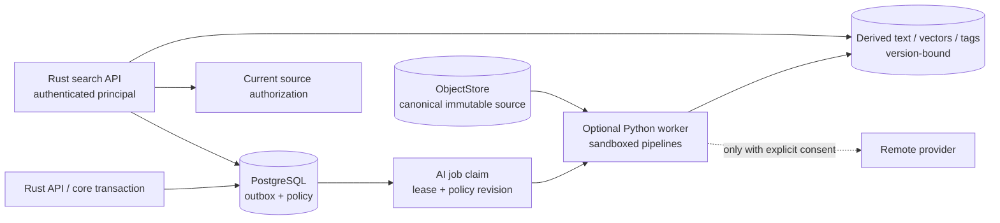

# Optional AI architecture and privacy contract

Status: **PLANNED foundation with explicitly EXPERIMENTAL capabilities**

Synveil AI is a replaceable derived-data subsystem. The Phase 10 foundation—
bounded OCR, version-bound embeddings, semantic search, and editable
AI-proposed tags—is `PLANNED` as an advanced, optional capability. Repository
question answering, autonomous model recommendations, face/image
understanding, and agent-like behavior are `EXPERIMENTAL`.

No AI endpoint, model, worker, index, or provider is implemented by this
blueprint. The accepted architectural decision is
[ADR-008](../adr/ADR-008-ai-outside-critical-path.md): canonical storage commits
before AI work enters the durable outbox. Core upload, download, metadata
search, sync, backup, restore, sharing, and version history remain functional
when AI is disabled, broken, overloaded, or absent.

## Goals and non-goals

### Planned advanced foundation

- OCR for appropriate scans, PDFs, screenshots, and photos;
- safe text/code extraction as input to full-text and semantic indexing;
- versioned embeddings over authorized source chunks;
- semantic search across selected text/code/OCR-derived chunks from documents,
  photos, repositories, code, and projects; vision/image embeddings remain an
  experimental surface;
- editable suggested tags with explicit `AI` provenance;
- local/self-hosted inference as a supported mode;
- explicit remote-provider mode with data-category consent; and
- observable reindex, staleness, deletion, and model provenance.

### Experimental surfaces

- repository/project question answering and generated summaries;
- natural-language answers synthesized across multiple sources;
- image captions, scene/object labels, near-duplicate embeddings, and face
  features;
- model or storage-policy recommendations;
- remote provider adapters before privacy/retention conformance; and
- any model-initiated tool or mutation.

### Non-goals

AI is never:

- canonical truth or the only way to locate a file;
- part of content durability, synchronization conflict, snapshot commit, or
  restore verification;
- allowed to rewrite an original or user tag;
- a hidden route for data to leave the server;
- trusted to authorize a result from an object ID, embedding, or cached ACL;
- a parser sandbox escape route or arbitrary URL fetcher;
- an autonomous deletion, sharing, restore, repository write, or policy engine;
  or
- described as private merely because a model runs “locally”—the self-hosted
  operator and server remain in the trust model.

## Architectural invariants

1. A core mutation first durably verifies the `Object` and transactionally
   commits `Node`/`FileVersion`, `ChangeEvent`, audit fact, and outbox work.
   AI consumes the committed immutable version later.
2. Every AI record is bound to source ID, immutable source version/revision,
   pipeline/configuration version, model/version, inference mode, and current
   owner scope. “Latest filename” alone is never an index identity.
3. Outbox/job delivery is at least once. Job identity makes extraction,
   embedding, tagging, reindex, and deletion idempotent.
4. Derived output is replaceable and separately deletable. It never extends
   canonical retention or substitutes for an original, snapshot, or repository
   backup.
5. Search checks current source authorization. An index-time ACL copy may
   accelerate candidate restriction but can never be the final access
   decision.
6. The most restrictive effective policy wins. `DISABLED` at instance, user,
   library, source, or data-category scope prevents new work at that scope.
7. `REMOTE` inference requires an explicitly configured provider and active,
   versioned consent for each egress data category. No implicit fallback from a
   local failure to a remote provider is permitted.
8. Parser/model/output failures do not mutate or quarantine valid canonical
   bytes merely because an optional derivation failed.
9. Model output, OCR text, captions, tags, summaries, and generated answers are
   untrusted data with provenance, not executable instructions.
10. AI health and readiness are separate from core readiness.

## Inference modes

### `DISABLED`

- `DISABLED` is the default mode for a new installation until an authorized
  operator/user explicitly selects and configures another permitted mode.
- No new extraction, OCR, embedding, captioning, or model query is dispatched
  for the disabled scope.
- Deterministic filename/metadata search continues. Non-AI full-text extraction
  may be configured separately only if the UI and policy clearly distinguish
  it.
- Queued work is cancelled or suppressed before input read. In-flight local or
  remote calls are cancelled where possible; results produced under an old
  policy revision are rejected from publication.
- Existing derived records follow the user's keep-or-delete policy, with
  visible cleanup progress and query-time exclusion immediately.

### `LOCAL`

- Models and inference run in the optional Python runtime on operator-controlled
  infrastructure.
- The worker reads only a scoped immutable source/derivative through internal
  authorization, not public object URLs or raw storage credentials.
- Model downloads, update checks, telemetry, package repositories, and license
  terms are explicit operational egress. “Local inference” does not authorize
  hidden runtime network calls.
- CPU, GPU, memory, temporary disk, wall time, concurrency, and output size are
  bounded by pipeline and deployment profile.

### `REMOTE`

Remote mode is opt-in and provider-specific. Before it can run, the product
shows and records:

- provider and endpoint identity;
- exact data categories allowed: raw bytes, extracted text, image derivative,
  repository/code content, metadata, and query text are separate categories;
- model/service purpose;
- provider retention/training/deletion claims as operator-supplied policy
  metadata, without Synveil guaranteeing an external promise;
- data residency/region when the provider offers one;
- credential owner and secret reference;
- policy/consent revision, grant time, revocation time, and scope; and
- what derived records Synveil stores locally and how to delete/rebuild them.

Requests minimize content, use TLS, have bounded time/body/retry limits, and
emit a redacted egress audit fact. Provider failures never trigger unapproved
fallback, broaden scope, or return raw provider diagnostics to a user.

## Component and trust boundary



The Rust application remains the policy and publication boundary. The Python
worker may run separately because ML dependencies and resource profiles differ,
but it does not become a second metadata authority. It claims a scoped job,
validates effective policy/consent, reads a bounded source, produces a staged
result, and asks the application/database contract to publish only if source
version and policy revision still match.

An initial deployment uses PostgreSQL-backed outbox/jobs. Kafka, RabbitMQ,
NATS, Redis, or a service mesh are not prerequisites. A later broker may fan
out after the same transactional outbox boundary.

## Job contract

The stable AI job identity is conceptually:

```text
job kind
+ owner/source scope
+ immutable source version
+ pipeline/configuration version
+ model/version
+ inference mode
+ consent/policy revision
```

Job state is `QUEUED`, `RUNNING`, `RETRY_WAIT`, `SUCCEEDED`,
`SUPERSEDED`, `CANCELED`, or `DEAD_LETTER`. Each job records bounded attempt
count, next-run time, lease owner/generation/expiry, safe error class, and
resource profile.

- Workers claim with a short PostgreSQL transaction and execute outside it.
- A long job renews a bounded lease; completion compares the lease generation.
- Retry uses exponential backoff with jitter and operation-specific maximum
  attempts/age.
- Authentication, invalid input, permanent unsupported format, policy
  revocation, and resource-limit classes do not retry forever.
- A poison source becomes visible in dead-letter/terminal status and does not
  block other jobs or one queue partition.
- Duplicate success returns or replaces the same generation; it does not append
  duplicate tags or chunks.
- Publication is conditional on the source version and effective policy still
  matching. Otherwise the result is `SUPERSEDED` and staged output is cleaned
  after a grace period.

## Derived data model and provenance

`AIIndexRecord` fields are canonical in
[DOMAIN_MODEL.md](DOMAIN_MODEL.md). Each logical indexed unit additionally
needs a versioned locator appropriate to its modality:

- document page and bounded text span;
- source-code blob/commit plus byte or line span;
- image/video region/frame sampling description;
- photo asset/resource/version;
- repository/project relationship; or
- whole-resource metadata-only unit.

Every result carries:

- extractor/OCR/chunker/pipeline implementation and configuration versions;
- model identity, immutable model artifact digest, provider model identifier,
  and license/usage metadata;
- source fingerprint and immutable source version;
- inference mode and consent/policy revision;
- generated time and freshness state;
- language/modality;
- confidence only where the model meaningfully defines/calibrates it;
- warnings for truncation, unsupported regions, or partial extraction; and
- provenance links suitable for a user to inspect the source.

Derived values do not change the `FileVersion` canonical hash. User-authored
corrections and tags occupy separate provenance records; a reindex may replace
only its own pipeline generation.

## Extraction and OCR

### Input selection

The pipeline receives a server-detected media class and a bounded source
stream. Filename and declared MIME are hints. Eligible scopes are explicit:
ordinary Drive content, photo originals/derivatives, retained backup snapshots,
and repository backups are not all indexed automatically merely because the
same bytes exist.

Indexing a retained backup or historical version is separately enabled because
it changes discoverability, storage cost, deletion behavior, and privacy.
Default search should point at current live authorized content.

### Safe extraction

- Prefer parsers that can stream or impose page/object/decompressed-output
  bounds.
- Run untrusted document, image, OCR, archive, and code parsing with
  least privilege and bounded CPU, memory, time, process count, temporary disk,
  decoded pixels, pages, recursion, and output characters.
- Disable network, external entities, remote fonts/resources, macros,
  executable attachments, filesystem links, shell expansion, and arbitrary
  plugin loading.
- Treat zip/decompression bombs and nested containers as hostile. An archive
  is not recursively indexed beyond an explicit depth/entry/expanded-byte
  policy.
- Never execute repository code, build hooks, notebooks, document scripts, or
  model output to understand content.
- Preserve a safe partial result only if the schema marks the omitted/truncated
  portions. Do not describe it as complete.

OCR output is stored separately with page/region, language, engine/version,
confidence where defined, and source-version provenance. OCR failure does not
make a PDF/photo corrupt. Raw OCR text is sensitive content and receives the
same search, logging, sharing, retention, and remote-egress protections as its
source.

## Chunking and embeddings

Text extraction produces bounded logical chunks using a versioned deterministic
chunker. A chunk records source locator, normalized-text fingerprint, language,
token/character counts, truncation, and adjacency. Chunk boundaries are not a
public permanent ID; changing the algorithm creates a new index generation.

Embedding records contain:

- model/provider identity and vector dimension;
- source and chunk generation;
- vector/index representation version;
- normalization/distance metric configuration;
- owner/authorization scope and sensitivity class; and
- lifecycle/freshness state.

Embeddings can leak information about their inputs. They are private derived
content, not harmless metadata. They are excluded from logs, ordinary exports,
public APIs, cross-user caches, and telemetry. Equal vectors or nearest-neighbor
counts never reveal another user's content.

PostgreSQL remains authoritative for index metadata and lifecycle.
`pgvector` is the preferred first candidate for vector search because it keeps
authorization relationships and transactions close, but ADR-002 treats it as
optional derived-index storage. No vector engine becomes canonical truth or a
Phase 0 dependency.

## Semantic search contract

### Query flow

1. Authenticate the user/share context and resolve allowed libraries,
   repositories, projects, data categories, and search layers.
2. Normalize and bound the query. If semantic mode is disabled, return
   `ai_disabled` for a semantic-only request or use a client-requested
   deterministic layer—never silently egress.
3. Embed the query locally or with the explicitly consented remote provider.
   Query text is its own egress data category.
4. Search only owner/authorization-partitioned candidates where practical.
5. Join candidate source IDs to current source authorization and lifecycle
   state before returning any score, snippet, count, facet, or existence signal.
6. Apply bounded oversampling so removed/inaccessible candidates do not starve
   results, while keeping timing/count behavior from becoming a cross-scope
   oracle.
7. Return source/version, layer `SEMANTIC`, model/index generation, freshness,
   score semantics, safe snippet/caption provenance, and an opaque query-bound
   cursor.

The API never returns raw vectors. A semantic result is a ranking aid, not
proof that a file contains a fact. Filename/metadata search remains available
and can be requested alone.

### Access changes

- Share revocation or policy removal blocks results at query time immediately,
  even before index cleanup.
- Trash may hide results from normal search while retaining derived records
  until trash/retention policy expires; Trash search is an explicit scope.
- Purge schedules deletion of derived records and prevents all normal query
  visibility.
- New file version makes old current-version records `STALE`/non-current and
  schedules a new generation. Historical search is separately scoped.
- Project/album membership never grants broader access than the underlying
  source. The result requires current access to both any container context and
  source when the feature promises that context.
- Backup snapshot expiration schedules derived cleanup only for records whose
  last authoritative source scope expired.

## Automatic tagging

AI tagging from text/code/OCR and reviewed metadata/rules is `PLANNED` as a
suggestion framework. Vision-generated scene, object, face/person, or similar
image-understanding tags remain `EXPERIMENTAL` under [PHOTOS.md](PHOTOS.md); the
shared tag model does not promote their inference capability.

- tag assignments use provenance `AI`, pipeline/model/configuration, confidence
  where meaningful, source version, and review state;
- a user can accept, edit, reject, mute, or delete a suggestion;
- accepted/created `USER` tags become separate user-authored records;
- reindex replaces only unreviewed assignments from its superseded generation;
- a rejected suggestion can retain a minimal suppression fingerprint under
  policy so it does not reappear immediately, without retaining raw source
  content in logs; and
- no tag automatically changes sharing, retention, backup, trash, tiering,
  device policy, or authorization.

Deterministic system tags such as an explicit media type remain `SYSTEM`, not
misrepresented as AI.

## Generated answers and repository understanding

Repository Q&A and synthesized multi-source answers are `EXPERIMENTAL`.

- Retrieval uses the same current-authorization search path and version-bound
  citations.
- Generated text identifies model/mode, index freshness, and source citations;
  it can be incomplete or wrong.
- Content inside files, code comments, issues, README files, EXIF, and OCR is
  untrusted retrieval data. Instructions contained in it are prompt injection,
  not authority over Synveil or the worker.
- The model has no storage, shell, network, database, Git, share, delete,
  restore, credential, or policy tools.
- A future tool-using agent requires a separate ADR, per-action authorization,
  human confirmation for side effects, allow-listed tools, audit, and rollback
  analysis. This blueprint grants no such capability.
- Repository content is never executed. Answers cannot claim build/test/runtime
  truth unless an independently authorized process produced that evidence.

## Privacy, consent, and control

### Policy hierarchy

Effective policy combines:

```text
instance capability/administrator ceiling
  ∩ user consent
  ∩ library/project/source policy
  ∩ provider and data-category grant
  ∩ current resource authorization
```

The intersection is evaluated at job claim, immediately before remote send,
at publication, and at query time where relevant. Policy records are
revisioned. A result generated under a stale revision cannot be published into
the active index.

An administrator may disable a provider or feature globally, but cannot
silently opt a user's sensitive content into remote egress. An owner cannot
override an operator's disabled/egress ceiling.

### User controls

The planned UI/API lets an authorized user:

- choose `DISABLED`, `LOCAL`, or an explicitly configured `REMOTE` provider;
- scope indexing by library/project/source and data type;
- inspect which categories may be sent remotely;
- see queued/running/failed/stale index state and last model generation;
- exclude a source without deleting canonical data;
- request reindex;
- delete derived records by source/scope/model/provider; and
- withdraw remote consent, immediately blocking new dispatch and query use of
  stale-policy results.

Deletion from Synveil cannot guarantee erasure from a remote provider beyond
the provider's actual contract. The UI must disclose this limit and record
provider deletion-request evidence where supported without claiming success it
cannot verify.

### Logging and telemetry

Never log:

- source bytes, extracted text, OCR output, prompts, queries, model responses,
  embeddings, captions, tags, snippets, or file paths/names;
- access/share/device tokens, provider API keys, model registry credentials, or
  signed source capabilities; or
- exact user/library/source IDs in high-cardinality metrics.

Structured logs use job/request IDs, pseudonymous bounded identifiers, pipeline
generation, mode/provider class, safe error, byte/token/resource buckets, and
duration. Debug capture of content requires a separate explicit operator
procedure, redaction, access control, expiry, and audit; it is off by default.

## Model and dependency supply chain

- Pin model artifacts by immutable digest and record origin, license, intended
  use, architecture, tokenizer, size, and compatibility.
- Verify signed checksums/provenance where available. Do not download/execute a
  model on first user query.
- Model activation is an operator-reviewed deployment action with storage and
  memory capacity checks.
- Reject unsafe arbitrary deserialization or model formats that can execute
  code; sandbox any converter.
- Pin Python dependencies with hashes/lock data, scan them, and build
  reproducible images where practical.
- Record model and parser generation in every result so a vulnerable artifact
  can be invalidated and reindexed.
- Review model/data licenses for self-hosted, commercial, and remote use. A
  technically compatible model is not automatically legally distributable.

## Lifecycle and deletion

| Source/policy transition | Derived-data action |
|---|---|
| New immutable source version | Mark prior current generation stale, queue new generation, keep historical records only under explicit history policy. |
| Rename/move only | Update display projection without re-embedding bytes unless path/context is intentionally part of that pipeline. |
| Share grant | Do not copy embeddings into recipient scope; current authorization may make existing authorized source results visible under feature policy. |
| Share revocation | Query-time deny immediately; queue scope/index cleanup and cache invalidation. |
| Trash | Hide from normal current search; retain/delete under declared trash indexing policy. |
| Purge or erasure request | Queue deletion/tombstone, deny immediately, remove vector/text/tag/cache records after all authorized retained-source scopes are evaluated. |
| Backup snapshot retained | Do not index it by default; if explicitly indexed, snapshot retention owns source lifetime. |
| Model/config upgrade | Build a new generation in parallel, validate, atomically select it, then retire old generation after rollback window. |
| Switch LOCAL to REMOTE | Require new provider/data-category consent; never reinterpret old local consent. |
| Withdraw REMOTE consent | Block dispatch immediately, reject stale-policy publication, cancel where possible, queue local derived cleanup per choice, disclose provider deletion limits. |

Derived data may be included in an operational database backup for recovery,
but restore treats it as rebuildable and validates its source/model generation.
Canonical recovery must not depend on restoring embeddings.

## Failure and recovery contract

| Failure | Required behavior |
|---|---|
| AI service is absent at deployment | Core services are ready; AI mode reports `DISABLED`/unavailable and deterministic search works. |
| Worker is offline after file commit | Durable job ages visibly; original file, sync, backup, and restore remain healthy. |
| Worker crashes after remote/provider work but before publication | Lease expires; retry uses job identity. Publication remains one version-bound generation, though external billing may have occurred more than once and must be disclosed/limited. |
| DB commit of derived result fails after object/text staging | No active index points to it; staged output is reconciled after lease/grace. |
| Policy is revoked during inference | Result cannot publish under stale policy revision; new query use is denied and cleanup/cancellation follows. |
| Source is purged during job | Source/version conditional publication fails; job becomes superseded and output is removed. |
| Parser hits bomb/timeout or malformed content | Bounded terminal/retry result; canonical source remains valid and accessible under core policy. |
| Model returns malicious instructions or HTML/script | Store/render as untrusted text with strict escaping; never execute or grant tools. |
| Remote provider returns oversized/malformed/error body | Bound and reject it, map a safe code, redact raw response, apply retry policy without fallback to another provider. |
| Vector index is lost/corrupt | Disable semantic results for affected generation, rebuild from authorized source versions, leave deterministic search/core data intact. |
| Model dimension/config changes | Build distinct generation/index; never mix incompatible vectors in one ranking. |
| Authorization cache/index lags after revoke | Final current-source authorization denies; no result/snippet/count is emitted. |
| Deletion job repeatedly fails | Source is query-denied immediately, terminal lag is alerted/audited, operator retry/remediation exists; UI does not claim physical deletion complete. |

## API and event contracts

The planned public routes are defined in
[API_ARCHITECTURE.md](API_ARCHITECTURE.md):

- `GET/PATCH /api/v1/ai/settings`;
- `POST /api/v1/ai/reindex-operations`;
- `DELETE /api/v1/ai/index-records`;
- `GET /api/v1/ai/status`; and
- `GET /api/v1/search` with an explicit search layer.

Settings mutations use ETag/`If-Match` and audit mode/provider/scope changes
without secrets. Reindex and deletion are idempotent asynchronous operations.
Search cursors bind query, layer, filters, index generation, and authorization
scope.

Internal versioned event/job families are planned as:

- `ai.extract.requested`;
- `ai.ocr.requested`;
- `ai.embed.requested`;
- `ai.tag.requested`;
- `ai.index.remove_requested`;
- `ai.index.generation_changed`; and
- experimental `ai.answer.requested`.

Payloads carry IDs and source-version references, not raw content. Event names
do not imply success; terminal job/index state is authoritative.

## Observability and operations

Separate AI health reports:

- configured/effective mode and provider class;
- queue oldest age, depth by safe pipeline class, attempts, leases, and
  dead-letter counts;
- current/target index and model generations;
- stale/failed/deletion-pending record counts;
- parser/model time, resource-limit termination, input/output size buckets,
  local CPU/GPU memory pressure, and remote latency/status classes;
- remote request/count/byte/token/cost estimates where the provider exposes
  them, scoped privately; and
- privacy control changes and remote egress audit counts.

Metrics avoid user/source names, prompts, query terms, embeddings, exact
coordinates, raw provider responses, and identifiers that create a content
side channel. Core readiness does not fail because AI queue age is high.

Operators can:

- pause claim by pipeline/provider without dropping jobs;
- drain/revoke a provider;
- inspect safe terminal errors;
- pin/roll back a model/index generation;
- requeue only eligible failed jobs;
- delete/rebuild one authorized scope; and
- verify that a disabled mode makes no network egress in conformance tests.

## Verification and promotion gate

Before the AI foundation becomes `IMPLEMENTED`, validation must cover:

- AI absent/disabled while every core flow and metadata search passes;
- commit-before-outbox ordering and lost/duplicated/out-of-order job delivery;
- worker crash before/after source read, remote call, staging, publication, and
  acknowledgement;
- source update/trash/purge/restore, share grant/revoke, project link removal,
  consent change, and model-generation race;
- current-authorization filtering with adversarial stale ACL/index/cache and
  cross-user timing/count/dedup tests;
- parser bombs, malformed PDF/image/archive/code, external entities, symlinks,
  executable content, resource exhaustion, and poison jobs;
- malicious prompt injection, XSS/HTML output, oversized provider bodies,
  timeouts, rate limits, duplicate billing exposure, and secret redaction;
- local mode with network denied; remote mode denied without every required
  consent; no silent provider fallback;
- vector loss/corruption, dimension mismatch, deterministic rebuild, dual-index
  cutover, rollback, and deleted-source exclusion;
- OCR provenance/partial results, AI tag user edits/rejections, and reindex not
  overwriting user data;
- derived deletion progress and honest remote-erasure limitations; and
- model/dependency digest, unsafe deserialization, license inventory, and
  vulnerable-generation invalidation.

Performance methodology records named hardware, model digest, runtime and
quantization, input corpus and sensitivity-safe size/page/token distributions,
concurrency, CPU/GPU/RAM/temp disk, vector count/dimension/index parameters,
warm/cold cache, storage backend, and end-to-end queue latency. Targets follow
measured baselines and resource budgets; this blueprint invents no accuracy or
throughput claims.

Quality evaluation uses versioned, legally usable, privacy-safe datasets and
records precision/recall or task-appropriate measures, abstention/partial
behavior, language coverage (including English and Vietnamese where claimed),
false-positive impact, and model drift. No aggregate metric can override a
privacy or authorization failure.

## Bounded open decisions

OPEN DECISION OD-AI-001: first vector storage and index strategy
Owner: AI / Database / Performance / Operations
Needed by: Phase 10 semantic-search architecture gate
Options: PostgreSQL with pgvector; separate self-hosted vector service; exact/brute-force PostgreSQL vectors for a bounded initial corpus
Recommendation: start with pgvector in PostgreSQL as optional derived-index storage, partitioned/scoped for authorization, and introduce a separate service only after measured scale and operations evidence
Decision evidence: representative corpus benchmark, authorization-query plan review, backup/rebuild test, memory/disk cost, index quality/latency, and upgrade test

OPEN DECISION OD-AI-002: supported local model and runtime profiles
Owner: AI / DevOps / Product / Legal
Needed by: Phase 10 local-inference release gate
Options: CPU-first small model profile; optional GPU profile plus CPU fallback; pluggable operator-supplied models with no bundled default
Recommendation: publish one bounded CPU-capable baseline plus an explicitly optional GPU profile only after quality/resource/license evaluation; never make either a core deployment dependency
Decision evidence: English/Vietnamese quality evaluation, model license/security review, image size, cold-start, CPU/GPU/RAM benchmark, and offline installation test

OPEN DECISION OD-AI-003: remote consent granularity
Owner: Privacy / Security / AI / Product
Needed by: Phase 10 first remote-provider experiment
Options: one account-wide remote switch; per provider and data category; per library/project/source plus provider/category
Recommendation: require provider plus data-category consent with optional narrower library/project/source scope, and keep raw bytes, extracted text, images, code, metadata, and query text separate
Decision evidence: privacy threat model, consent-comprehension study, revocation/deletion test, provider-retention review, and audit review

OPEN DECISION OD-AI-004: text chunking contract
Owner: AI / Search / Clients
Needed by: Phase 10 index-format freeze
Options: structure-aware chunks by document/code type; uniform token windows; hybrid structure-aware chunks with bounded overlap
Recommendation: versioned structure-aware chunks with bounded overlap and a uniform safe fallback; locators must survive reindex provenance without becoming public permanent IDs
Decision evidence: multilingual retrieval evaluation, memory/index-size benchmark, parser-failure fixtures, citation fidelity, and migration/rebuild test

OPEN DECISION OD-AI-005: indexing retained history and backups
Owner: AI / Backup / Versions / Privacy / Product
Needed by: Phase 10 indexing-scope gate
Options: current live versions only; include version history; opt-in retained backup snapshots and repository backups
Recommendation: index current live versions by default; make history and each retained backup domain explicit opt-ins with separate cost, discoverability, retention, and deletion controls
Decision evidence: restore/search user requirements, privacy and erasure analysis, storage/compute benchmark, snapshot-expiry test, and UI comprehension test

OPEN DECISION OD-AI-006: generated-answer availability
Owner: AI / Security / Product / Documentation
Needed by: Phase 12 repository-intelligence experiment
Options: retrieval results only; cited generated answers without tools; tool-using agent under a new architecture
Recommendation: if pursued, begin with cited read-only answers and no tools; any side-effecting agent requires a separate ADR and security review
Decision evidence: prompt-injection red-team, citation/grounding evaluation, authorization tests, harmful-output review, and explicit product need
