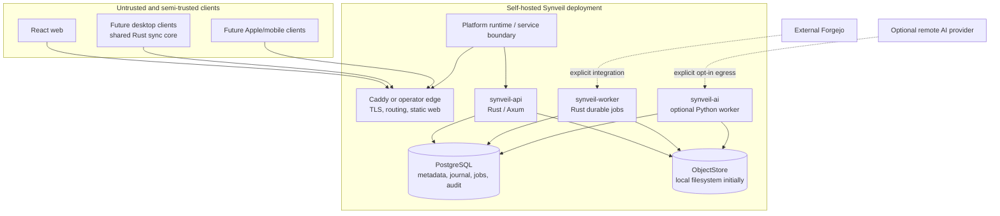
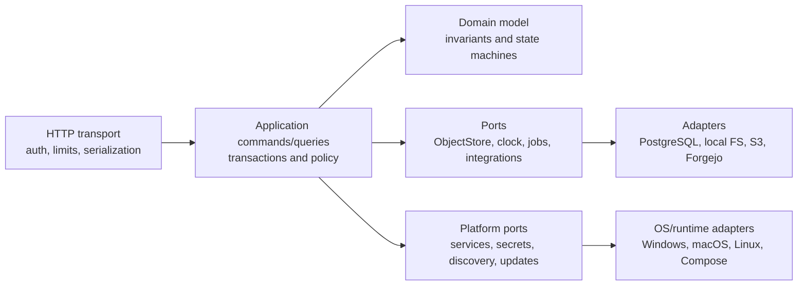

# System architecture

Status: **Normative blueprint**

## Executive architecture

Synveil starts as a modular monolith with explicit domain contracts. One Rust
codebase produces an HTTP API process and a durable background worker process;
both use PostgreSQL and the same object-store adapters. The React web app is a
static authenticated client. A separate Python runtime is optional and limited
to AI/OCR/embedding work. A platform runtime boundary allows the same core to be
packaged as Personal / Home Mode on Windows, macOS, Linux Desktop, and Linux
Server, or operated as Advanced / Server Mode with Docker Compose and custom
infrastructure.

This shape minimizes distributed failure modes while preserving boundaries for
future client SDKs, S3 storage, independent workers, and measured horizontal
scale.



Arrows do not grant trust. Every request is authenticated and authorized at the
resource boundary; workers claim scoped jobs and read originals through
server-side capabilities, not public object URLs.

## Architectural invariants

1. A successful file-version response implies that the canonical object is
   durable and checksum-verified according to the configured backend.
2. Metadata never exposes a temporary or partial object as a committed
   `FileVersion`.
3. Every user-visible mutation and its `ChangeEvent`, audit fact, and required
   outbox jobs commit in the same PostgreSQL transaction.
4. A per-`Library` change sequence reflects commit serialization: a client that
   advances past sequence `n` cannot later miss an event with sequence `≤ n`.
5. Retries use server-persisted idempotency outcomes. A lost response does not
   create a second version, object reference, share, or mutation.
6. File content versions and backup snapshots are immutable. Restoration
   creates a new current state; it does not rewrite history.
7. Sync deletion creates a tombstone/Trash state and propagates. Backup source
   absence only affects a new snapshot manifest and never deletes protected
   history outside retention.
8. IDs and object keys are not authorization. Every lookup is scoped to the
   authenticated owner, membership, device grant, or share capability.
9. AI, OCR, thumbnails, repository indexing, and notifications are eventually
   consistent derivatives. Their outage cannot roll back core data.
10. Garbage collection deletes only objects proven unreferenced across live
    versions, trash retention, backup manifests, renditions, staging leases,
    legal/administrative holds, and active jobs, after a safety grace period.
11. Personal / Home Mode and Advanced / Server Mode share one protocol, domain
    model, metadata authority, storage correctness model, and security model.
    Packaging differences must not create incompatible user data.
12. Platform services, OS credential stores, path semantics, and filesystem
    accelerators enter through explicit ports/capabilities; domain logic never
    depends directly on Windows Service, launchd, systemd, Docker, or a host
    filesystem feature.

## Logical layers



- **Transport** parses bounded input, authenticates, maps stable errors, and
  never embeds SQL or filesystem paths.
- **Application** owns use-case transaction boundaries, authorization calls,
  idempotency, and orchestration.
- **Domain** expresses state transitions without Axum, SQLx, or storage-vendor
  types.
- **Ports/adapters** isolate database, object store, clock, random generation,
  durable jobs, external integrations, platform services, secret stores,
  storage discovery, and update coordination.

Crate boundaries enforce dependency direction, but early crates remain in one
deployment rather than communicating over a network.

## Proposed monorepo

```text
synveil/
├── apps/
│   ├── web/                       # React + TypeScript + Vite
│   └── docs/                      # optional future docs site, not canonical prose
├── crates/
│   ├── domain/                    # IDs, entities, policies, state machines
│   ├── application/               # commands, queries, authorization orchestration
│   ├── api/                       # Axum transport and error mapping
│   ├── auth/                      # credentials, sessions, device grants
│   ├── metadata-postgres/         # SQLx repositories and transaction unit
│   ├── object-store/              # trait, representation and integrity contracts
│   ├── object-store-local/        # safe local filesystem adapter
│   ├── object-store-s3/           # later S3-compatible adapter
│   ├── uploads/                   # resumable session state machine
│   ├── sync/                      # journal, mutations, cursors, conflicts
│   ├── backup/                    # sets, manifests, snapshots, restore plans
│   ├── sharing/                   # ACLs and link capabilities
│   ├── photos/                    # assets, renditions, albums
│   ├── jobs/                      # durable PostgreSQL job/outbox runner
│   ├── integrations/              # connector interfaces
│   └── observability/             # tracing, metrics, health contracts
├── bins/
│   ├── synveil-api/
│   └── synveil-worker/
├── services/ai/                   # optional Python service/worker
├── clients/
│   ├── sync-core/                 # future reusable Rust client state machine
│   ├── ios/                       # future, not Phase 0 scaffolding
│   ├── macos/
│   ├── windows/
│   └── linux/
├── api/openapi.yaml               # reviewed public contract
├── migrations/                    # ordered, forward SQL migrations
├── deploy/                        # Compose, Caddy, image and runbook assets
├── docs/{en,vi,adr}/              # canonical blueprint
├── scripts/                       # repeatable, non-secret operations
└── tests/                         # protocol, E2E, recovery, conformance fixtures
```

Names are proposed contract boundaries, not a requirement to create every
crate on day one. Avoid cyclic dependencies and “common” dumping grounds.

## Core components and boundaries

### Web

The web app consumes only documented HTTP APIs. It does not read the database,
construct object paths, or own sync truth. Downloads may stream through the API
initially; later short-lived signed URLs require the same authorization and
audit semantics.

### Rust API

The API provides authentication, resource authorization, validation, streaming
transfer, conditional mutation, and metadata queries. CPU-heavy hashing or
compression runs with bounded concurrency outside Tokio's async executor hot
path. It does not wait for optional enrichment.

### Rust worker

The worker claims durable PostgreSQL jobs using leases and `FOR UPDATE SKIP
LOCKED`-style coordination. Jobs are at-least-once, idempotent, bounded, and
observable. Initial jobs include staging cleanup, orphan reconciliation,
integrity verification, retention/GC, thumbnails, and integration polling.

API and worker may run from the same image but use distinct commands and
resource limits.

### PostgreSQL

PostgreSQL is authoritative for identities, authorization relationships,
logical nodes, versions, object metadata/references, upload state, ordered
change journals, backup manifests, shares, jobs, and audit events. Large
canonical contents do not become BLOBs. Transactions use explicit isolation,
row/advisory locks, constraints, and retry rules documented per use case.

### ObjectStore

`ObjectStore` exposes streaming staged writes, committed immutable reads with
ranges, metadata/head, abort, and deletion under server control. The local
adapter uses a configured root, generated keys, no user path concatenation,
exclusive temporary creation, atomic rename where supported, and durability
steps. S3 uses completed immutable keys and cannot rely on rename semantics.

The contract describes capabilities so an adapter cannot pretend to provide
atomic rename or strong listing when it does not.

### Python AI worker

The optional AI runtime reads jobs and authorized derivative inputs, produces
version-bound index records, and records failures without changing canonical
objects. Modes are `DISABLED`, `LOCAL`, and explicit `REMOTE`. Remote mode has
provider, data-category, retention, and egress disclosure controls.

### Integrations

Connectors translate external state into Synveil repository metadata and backup
jobs. Forgejo remains responsible for Git protocols, packfiles, refs, issues,
pull requests, and repository permissions. Credential failure makes the
integration stale, not Drive unavailable.

### Platform runtime and service lifecycle

Personal / Home Mode may eventually use a native installer and an OS service
manager. Advanced / Server Mode may use Compose or a native operator package.
Both use a platform-neutral lifecycle contract for installation, configuration,
startup ordering, graceful shutdown, crash recovery, health, logs, updates,
and uninstall. The contract manages the API, worker, managed PostgreSQL (when
selected), storage health, and update coordinator as separate responsibilities.

The platform adapter owns Windows Service, launchd, systemd, user-session
supervision, or Compose details. The application/domain core sees stable
`STARTING`, `READY`, `DEGRADED`, `STOPPING`, `FAILED`, and `MAINTENANCE`
states, plus bounded diagnostic records. It never calls those OS APIs directly.

The canonical database remains PostgreSQL. A future managed PostgreSQL adapter
may provision/configure/start/stop/upgrade/backup/recover a private or system
service for Personal / Home Mode; Advanced / Server Mode continues to support
external operator-managed PostgreSQL. The exact distribution is open in
`PLATFORM.md` and ADR-019.

## Canonical mutation path

Content creation crosses a database/object-store boundary that cannot share a
transaction. Synveil therefore uses an ordered durable-first protocol:

```mermaid
sequenceDiagram
    participant C as Client
    participant A as Rust API
    participant S as ObjectStore
    participant P as PostgreSQL
    participant W as Workers

    C->>A: stage content / complete(idempotency key)
    A->>S: stream, hash, verify, make immutable
    S-->>A: durable object key + representation metadata
    A->>P: transaction: Object + ObjectReplica + FileVersion + Node + ChangeEvent + audit + outbox
    alt transaction commits
        P-->>A: committed result
        A-->>C: success + ETag/version/cursor
        W->>P: claim outbox at least once
    else transaction rolls back
        P-->>A: failure
        A-->>C: stable retryable/non-retryable error
        Note over S,W: durable bytes are unreferenced; reconcile after grace
    end
```

The database never commits a reference to an object that is merely being
uploaded. If object finalization fails, the session remains retryable or fails
without metadata visibility. If DB commit fails after object durability, the
object is an orphan candidate protected by a grace period. If the response is
lost after commit, the same idempotency key returns the persisted result.

For metadata-only operations (rename, move, trash, restore, share mutation),
the domain update, version/ETag update, journal, audit, and outbox share one
database transaction.

## Consistency model

### Strong boundaries

Against the PostgreSQL primary, authorization-relevant metadata, current node
state, file-version creation, move/rename uniqueness, trash/restore, shares,
upload completion, one-library change ordering, backup snapshot commit, and job
publication are transactionally consistent.

After a success response, a canonical object is readable from the selected
backend. If a backend cannot provide this read-after-write property for a key,
its adapter must verify or delay success rather than weakening the API.

### Eventual boundaries

Search extraction, thumbnails, OCR, embeddings, automatic tags, storage-health
rollups, integration inventory, notifications, GC, and physical accounting may
lag. Responses expose freshness or job state where it matters.

### Concurrency

Clients mutate a node with `If-Match`/base version. Mismatch yields a stable
`version_conflict` or a protocol-defined conflict copy for incoming content;
it never means last-writer-wins byte loss. A library clock row is locked late
in the transaction to allocate the next journal sequence and preserves commit
order. Initial throughput trades some per-library mutation serialization for a
correct cursor; sharding the clock requires a later ADR and conformance proof.

### Cursor recovery

Change cursors contain a version, library identity, epoch, and last sequence in
an authenticated opaque encoding. Expired history returns a cursor-expired
error with a snapshot/rebaseline route. Clients never reset to zero and guess.

## Events and jobs

Illustrative domain-event families include file create/update/move/trash/
restore, upload completion, backup completion, photo addition, and repository
update. These phrases are conceptual, not wire-level event names. The owning
protocol specification defines each exact `ChangeEvent` kind or versioned
outbox name and schema; it is registered before consumers depend on it.

The transaction stores both client-facing `ChangeEvent` records and internal
outbox records where applicable. They are different contracts:

- change events are retained ordered synchronization facts with tombstones;
- outbox/jobs are at-least-once work instructions with attempts, leases,
  backoff, next-run time, terminal/dead-letter state, and idempotency identity;
- audit events are append-oriented security/accountability facts with stricter
  access and retention.

The initial durable job registry explicitly covers thumbnail generation, AI
indexing/OCR dispatch, staging and garbage collection, object integrity
verification, backup-retention cleanup, repository backup/polling, and storage
health checks. Each job names its idempotency identity, retryable error classes,
resource limits, freshness target, and terminal operator action before it is
enabled. Optional jobs may be paused without deleting their source events.

No early message broker is required. A later broker can distribute delivery
without becoming the source of truth; PostgreSQL outbox state remains the
handoff boundary during migration.

## Authentication and authorization shape

The bootstrap route is one-time and disabled after the first administrator is
created. Human passwords use a vetted Argon2id implementation with versioned
parameters. Browser sessions use random opaque tokens in `Secure`, `HttpOnly`,
appropriate `SameSite` cookies; only token hashes are stored. State-changing
cookie requests use an explicit CSRF defense. Future device credentials are
random, scoped, rotatable, individually revocable bearer secrets stored hashed
at the server and protected by Keychain/OS credential storage on clients.

Authorization is centralized policy evaluated with principal, resource,
ownership/membership, share grant, device scope, and action. Repository and
object IDs are never sufficient. Public shares are high-entropy capability
tokens whose hashes, expiry, optional password verification, permissions,
rate limits, and revocation state are stored server-side.

The frozen account-recovery baseline is printable one-time recovery codes.
OD-005 must decide whether to add an explicit audited self-hosted administrator
override and/or configured email delivery before public registration; neither
path is assumed implemented by this baseline. MFA/WebAuthn is a later additive
credential method.

## Storage, compression, deduplication, and encryption

The logical chain is:

```text
Node → current FileVersion → immutable Object → ObjectReplica → physical representation
```

Renames and moves change metadata, not multi-gigabyte object locations. An
`Object` has an opaque ID, dedup domain, canonical plaintext size/SHA-256,
aggregate verification/lifecycle state, and lifecycle timestamps. Each
`ObjectReplica` records its backend and opaque storage key, stored size and
stored-representation checksum, codec/encryption metadata, replica state, and
verification evidence. Whole-object reuse is initially limited to one
owner/dedup domain.

Compression policy samples or streams eligible types and may use Zstandard.
The plaintext integrity hash is computed over canonical bytes before
compression; the representation checksum detects corruption of stored bytes.
Already compressed or encrypted content is passed through. Logical quota and
physical accounting are reported separately.

Transport uses TLS. Initial server-side encryption relies on an encrypted
volume/backend or provider encryption. Application-managed encryption, if
added, uses reviewed standard primitives and versioned envelopes. Compression
precedes encryption; encrypted data is not expected to compress. Zero-knowledge
E2EE is a major future product mode because it conflicts with server-side
deduplication, previews, OCR, semantic search, compression, recovery, and link
sharing. It is not implied by this architecture.

## Storage-backend replacement

Backends are registered and health-checked; every `ObjectReplica` records one
backend and key while its `Object` remains backend-neutral. A migration copies
an immutable representation, verifies it against the canonical `Object`,
transactionally adds/switches the selected replica, waits through a rollback
window, then retires the old replica. Bulk migration never rewrites logical
`Node`, `FileVersion`, or `Object` IDs. Mixed backends are valid during a
controlled transition.

Replacing a mounted filesystem path in configuration is not a migration.
Startup detects missing/unexpected storage identity and fails readiness rather
than treating all objects as lost.

## Future clients

The server exposes HTTP streaming, range requests, resumable upload,
conditional mutations, snapshot listing, and cursor changes without relying on
browser-only behavior. Device registration and scopes support:

- desktop selected-folder two-way sync, upload-only backup, download-only
  mirror, cloud-only and pinned policies;
- a shared Rust client core for protocol, journal, retry, conflict, and local
  state while platform shells own filesystem integration;
- Android clients subject to Android background, permission, and battery limits;
- Apple clients that use FileProvider and PhotoKit APIs rather than assuming
  arbitrary filesystem or unlimited background access;
- client capability negotiation for placeholders, case sensitivity, sparse
  files, range reads, background transfer, and live-photo-style groups.

The first protocol remains conservative: unsupported capability states are
explicit, never silently simulated.

## Deployment and scale evolution

### Initial supported topology

One Compose project runs Caddy/static web, API, worker, PostgreSQL, and optional
AI. Persistent database and object volumes are distinct and backed up together
with configuration and master secrets. Multiple API processes are not required
until job and sequence coordination tests prove safe.

This is the Advanced / Server Mode reference topology, not the only eventual
user-facing installation. Personal / Home Mode is planned as an installer- and
platform-runtime-managed topology in which the user selects a durable storage
location, Synveil manages the supported database/service dependencies, and the
same API/domain/storage model is used. See [PLATFORM.md](PLATFORM.md) and
[DEPLOYMENT.md](DEPLOYMENT.md).

### Scale triggers

- Add S3/MinIO when capacity, durability domain, or multi-host access requires
  it—not merely because an adapter exists.
- Add API replicas after shared rate limiting/session assumptions and storage
  read-after-write behavior are tested.
- Add worker replicas using existing database leases when queue latency or CPU
  work requires it.
- Add a broker only when PostgreSQL job polling is measured as a bottleneck or
  independent delivery topology is required.
- Add read replicas only for queries that tolerate replica lag and never for
  authorization immediately following mutation or cursor allocation.
- Consider Kubernetes/multi-node operation only after Compose operations,
  backup, restore, and upgrades are mature.

No early step requires Kafka, RabbitMQ, NATS, Redis Cluster, Elasticsearch,
service mesh, distributed consensus, a custom filesystem, or custom crypto.

## Observability contracts

All processes emit structured logs and traces with request/operation IDs,
redacted principal/device identifiers, stable error codes, duration, byte
counts, and outcome. Metrics cover requests, upload streams, database pools,
job age/attempts, change-feed lag, backend capacity/errors, integrity failures,
backup age, and worker freshness.

Liveness means the process event loop can respond. Readiness means required
configuration is valid and PostgreSQL plus the selected object backend pass
bounded checks. Expensive writable storage probes run periodically and feed a
cached readiness/health report rather than creating a file on every probe.

Never log passwords, raw session/device/share tokens, integration secrets,
remote AI payloads, file contents, full sensitive paths, or database URLs with
credentials.

## Failure matrix

| Failure | Required behavior |
|---|---|
| Disk fills during staging | Stop bounded stream, retain or abort resumable state safely, expose `storage_unavailable`/quota detail, no visible version. |
| Object durable, DB commit fails | No logical reference; record/reconcile as orphan after leases and grace; retry can reuse verified staging through the same session. |
| DB commit succeeds, response lost | Same idempotency/mutation key returns the committed result; no duplicate version/event. |
| Duplicate completion requests | Serialize session completion and return the one stored terminal outcome. |
| Worker/AI offline | Core commit succeeds; durable job becomes late and observable. |
| PostgreSQL unavailable | Reject metadata mutations; never accept untrackable canonical data, though resumable transport may stop/retry safely. |
| Object backend unavailable | Reads fail with stable retryable error; content commits do not publish metadata. Metadata-only operations may be policy-limited if they do not require bytes. |
| Stale sync cursor | Return snapshot/rebaseline instructions; do not silently omit retained events. |
| Forgejo unavailable | Mark integration stale/errored; serve last known metadata where labeled; do not affect core domains. |
| Stored checksum mismatch | Quarantine location, alert, attempt a verified redundant source if one exists, and never return corrupted bytes as valid. |

Detailed state machines live in the storage, upload, sync, and backup specs.

## Architecture decisions still open

The blueprint intentionally defers a bounded set:

- **OD-001, portable name policy:** exact Unicode case-fold/version and whether
  new libraries may choose a case-sensitive profile. Needed before Phase 1
  schema/API freeze; recommendation is an immutable, portable, case-insensitive
  default with preserved display names.
- **OD-002, storage durability profiles:** exact local `fsync` requirements and
  operator-selectable performance trade-offs by filesystem. Needed before the
  local adapter is marked production-ready.
- **OD-003, account isolation model:** single-user/family ownership and future
  tenant boundary terminology. Needed before sharing schema freeze; default is
  explicit owner plus membership and no cross-owner deduplication.
- **OD-004, license:** retain MIT or explicitly relicense/split future modules.
  Owner decision needed before accepting external code under a new policy.
- **OD-005, recovery delivery:** recovery codes are required; optional email
  workflow and self-hosted administrator override need a security/product
  decision before public registration.
- **OD-006, local AI baseline:** supported model/runtime/hardware profiles are
  benchmark-driven Phase 10 choices, not a core deployment requirement.
- **OD-PLAT-001, managed PostgreSQL distribution:** Personal / Home packaging
  may use a bundled/private, system-managed, or packaged PostgreSQL service;
  the canonical authority does not change. See `PLATFORM.md` and ADR-019.
- **OD-PLAT-002, service supervisor:** the platform-neutral lifecycle port and
  least-privilege OS supervisor are required before native service code.
- **OD-PLAT-003, remote access:** LAN/direct/NAT/VPN/optional relay selection,
  metadata visibility, content path, self-hostability, and failure behavior
  remain open under ADR-020.
- **OD-PLAT-004, update automation:** signing, opt-in level, backup gate,
  migration coordination, rollback limits, and air-gapped behavior remain open.
- **OD-PLAT-005, machine migration:** guided transfer versus portable encrypted
  package must be selected after clean-destination, key, and device tests.

All other implementation questions inherit the ADR/spec precedence in
`CONTRIBUTING_ARCHITECTURE.md`.
