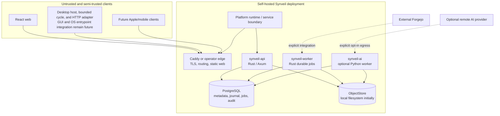
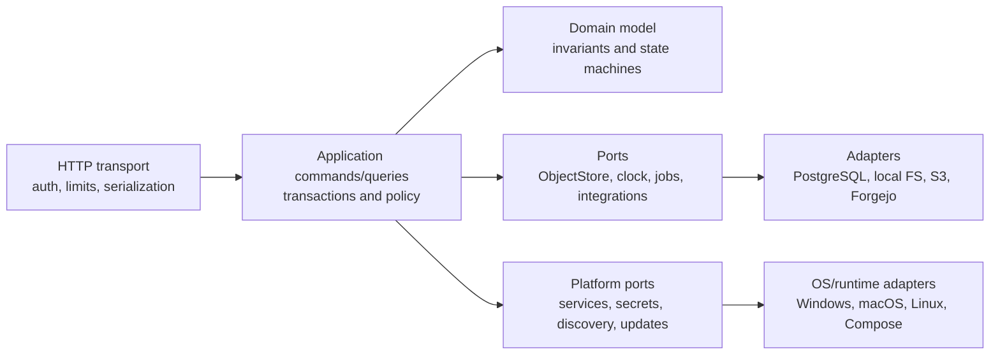

# System architecture

Status: **Normative blueprint**

## Executive architecture

Synveil starts as a modular monolith with explicit domain contracts. One Rust
codebase produces an HTTP API process and a durable background worker process;
both use PostgreSQL and the same object-store adapters. The React web app is a
static authenticated client. A separate Python runtime is optional and limited
to AI/OCR/embedding work. A platform runtime boundary allows the same core to be
packaged as Personal / Home Mode on Windows, macOS, Linux Desktop, and Linux
Server, or operated as Advanced / Server Mode with Docker Compose and custom
infrastructure.

This shape minimizes distributed failure modes while preserving boundaries for
future client SDKs, S3 storage, independent workers, and measured horizontal
scale.



Arrows do not grant trust. Every request is authenticated and authorized at the
resource boundary; workers claim scoped jobs and read originals through
server-side capabilities, not public object URLs.

## Architectural invariants

1. A successful file-version response implies that the canonical object is
   durable and checksum-verified according to the configured backend.
2. Metadata never exposes a temporary or partial object as a committed
   `FileVersion`.
3. Every user-visible mutation and its `ChangeEvent`, audit fact, and required
   outbox jobs commit in the same PostgreSQL transaction.
4. A per-`Library` change sequence reflects commit serialization: a client that
   advances past sequence `n` cannot later miss an event with sequence `≤ n`.
5. Retries use server-persisted idempotency outcomes. A lost response does not
   create a second version, object reference, share, or mutation.
6. File content versions and backup snapshots are immutable. Restoration
   creates a new current state; it does not rewrite history.
7. Sync deletion creates a tombstone/Trash state and propagates. Backup source
   absence only affects a new snapshot manifest and never deletes protected
   history outside retention.
8. IDs and object keys are not authorization. Every lookup is scoped to the
   authenticated owner, membership, device grant, or share capability.
9. AI, OCR, thumbnails, repository indexing, and notifications are eventually
   consistent derivatives. Their outage cannot roll back core data.
10. Garbage collection deletes only objects proven unreferenced across live
    versions, trash retention, backup manifests, renditions, staging leases,
    legal/administrative holds, and active jobs, after a safety grace period.
11. Personal / Home Mode and Advanced / Server Mode share one protocol, domain
    model, metadata authority, storage correctness model, and security model.
    Packaging differences must not create incompatible user data.
12. Platform services, OS credential stores, path semantics, and filesystem
    accelerators enter through explicit ports/capabilities; domain logic never
    depends directly on Windows Service, launchd, systemd, Docker, or a host
    filesystem feature.

## Logical layers



- **Transport** parses bounded input, authenticates, maps stable errors, and
  never embeds SQL or filesystem paths.
- **Application** owns use-case transaction boundaries, authorization calls,
  idempotency, and orchestration.
- **Domain** expresses state transitions without Axum, SQLx, or storage-vendor
  types.
- **Ports/adapters** isolate database, object store, clock, random generation,
  durable jobs, external integrations, platform services, secret stores,
  storage discovery, and update coordination.

Crate boundaries enforce dependency direction, but early crates remain in one
deployment rather than communicating over a network.

## Proposed monorepo

```text
synveil/
├── apps/
│   ├── web/                       # React + TypeScript + Vite
│   └── docs/                      # optional future docs site, not canonical prose
├── crates/
│   ├── domain/                    # IDs, entities, policies, state machines
│   ├── application/               # commands, queries, authorization orchestration
│   ├── api/                       # Axum transport and error mapping
│   ├── auth/                      # credentials, sessions, device grants
│   ├── metadata-postgres/         # SQLx repositories and transaction unit
│   ├── object-store/              # trait, representation and integrity contracts
│   ├── object-store-local/        # safe local filesystem adapter
│   ├── object-store-s3/           # later S3-compatible adapter
│   ├── uploads/                   # resumable session state machine
│   ├── sync/                      # journal, mutations, cursors, conflicts
│   ├── backup/                    # sets, manifests, snapshots, restore plans
│   ├── sharing/                   # ACLs and link capabilities
│   ├── photos/                    # assets, renditions, albums
│   ├── jobs/                      # durable PostgreSQL job/outbox runner
│   ├── integrations/              # connector interfaces
│   └── observability/             # tracing, metrics, health contracts
├── bins/
│   ├── synveil-api/
│   └── synveil-worker/
├── services/ai/                   # optional Python service/worker
├── clients/
│   ├── sync-core/                 # future reusable Rust client state machine
│   ├── ios/                       # future, not Phase 0 scaffolding
│   ├── macos/
│   ├── windows/
│   └── linux/
├── api/openapi.yaml               # reviewed public contract
├── migrations/                    # ordered, forward SQL migrations
├── deploy/                        # Compose, Caddy, image and runbook assets
├── docs/{en,vi,adr}/              # canonical blueprint
├── scripts/                       # repeatable, non-secret operations
└── tests/                         # protocol, E2E, recovery, conformance fixtures
```

Names are proposed contract boundaries, not a requirement to create every
crate on day one. Avoid cyclic dependencies and “common” dumping grounds.

## Core components and boundaries

### Web

The web app consumes only documented HTTP APIs. It does not read the database,
construct object paths, or own sync truth. Downloads may stream through the API
initially; later short-lived signed URLs require the same authorization and
audit semantics.

### Rust API

The API provides authentication, resource authorization, validation, streaming
transfer, conditional mutation, and metadata queries. CPU-heavy hashing or
compression runs with bounded concurrency outside Tokio's async executor hot
path. It does not wait for optional enrichment.

### Rust worker

The worker claims durable PostgreSQL jobs using leases and `FOR UPDATE SKIP
LOCKED`-style coordination. Jobs are at-least-once, idempotent, bounded, and
observable. Initial jobs include staging cleanup, orphan reconciliation,
integrity verification, retention/GC, thumbnails, and integration polling.

API and worker may run from the same image but use distinct commands and
resource limits.

### PostgreSQL

PostgreSQL is authoritative for identities, authorization relationships,
logical nodes, versions, object metadata/references, upload state, ordered
change journals, backup manifests, shares, jobs, and audit events. Large
canonical contents do not become BLOBs. Transactions use explicit isolation,
row/advisory locks, constraints, and retry rules documented per use case.

### ObjectStore

`ObjectStore` exposes streaming staged writes, committed immutable reads with
ranges, metadata/head, abort, and deletion under server control. The local
adapter uses a configured root, generated keys, no user path concatenation,
exclusive temporary creation, atomic rename where supported, and durability
steps. S3 uses completed immutable keys and cannot rely on rename semantics.

The contract describes capabilities so an adapter cannot pretend to provide
atomic rename or strong listing when it does not.

### Python AI worker

The optional AI runtime reads jobs and authorized derivative inputs, produces
version-bound index records, and records failures without changing canonical
objects. Modes are `DISABLED`, `LOCAL`, and explicit `REMOTE`. Remote mode has
provider, data-category, retention, and egress disclosure controls.

### Integrations

Connectors translate external state into Synveil repository metadata and backup
jobs. Forgejo remains responsible for Git protocols, packfiles, refs, issues,
pull requests, and repository permissions. Credential failure makes the
integration stale, not Drive unavailable.

### Platform runtime and service lifecycle

Personal / Home Mode may eventually use a native installer and an OS service
manager. Advanced / Server Mode may use Compose or a native operator package.
Both use a platform-neutral lifecycle contract for installation, configuration,
startup ordering, graceful shutdown, crash recovery, health, logs, updates,
and uninstall. The contract manages the API, worker, managed PostgreSQL (when
selected), storage health, and update coordinator as separate responsibilities.

The platform adapter owns Windows Service, launchd, systemd, user-session
supervision, or Compose details. The application/domain core sees stable
`STARTING`, `READY`, `DEGRADED`, `STOPPING`, `FAILED`, and `MAINTENANCE`
states, plus bounded diagnostic records. It never calls those OS APIs directly.

The canonical database remains PostgreSQL. A future managed PostgreSQL adapter
may provision/configure/start/stop/upgrade/backup/recover a private or system
service for Personal / Home Mode; Advanced / Server Mode continues to support
external operator-managed PostgreSQL. The exact distribution is open in
`PLATFORM.md` and ADR-019.

## Canonical mutation path

Content creation crosses a database/object-store boundary that cannot share a
transaction. Synveil therefore uses an ordered durable-first protocol:

```mermaid
sequenceDiagram
    participant C as Client
    participant A as Rust API
    participant S as ObjectStore
    participant P as PostgreSQL
    participant W as Workers

    C->>A: stage content / complete(idempotency key)
    A->>S: stream, hash, verify, make immutable
    S-->>A: durable object key + representation metadata
    A->>P: transaction: Object + ObjectReplica + FileVersion + Node + ChangeEvent + audit + outbox
    alt transaction commits
        P-->>A: committed result
        A-->>C: success + ETag/version/cursor
        W->>P: claim outbox at least once
    else transaction rolls back
        P-->>A: failure
        A-->>C: stable retryable/non-retryable error
        Note over S,W: durable bytes are unreferenced; reconcile after grace
    end
```

The database never commits a reference to an object that is merely being
uploaded. If object finalization fails, the session remains retryable or fails
without metadata visibility. If DB commit fails after object durability, the
object is an orphan candidate protected by a grace period. If the response is
lost after commit, the same idempotency key returns the persisted result.

For metadata-only operations (rename, move, trash, restore, share mutation),
the domain update, version/ETag update, journal, audit, and outbox share one
database transaction.

## Consistency model

### Strong boundaries

Against the PostgreSQL primary, authorization-relevant metadata, current node
state, file-version creation, move/rename uniqueness, trash/restore, shares,
upload completion, one-library change ordering, backup snapshot commit, and job
publication are transactionally consistent.

After a success response, a canonical object is readable from the selected
backend. If a backend cannot provide this read-after-write property for a key,
its adapter must verify or delay success rather than weakening the API.

### Eventual boundaries

Search extraction, thumbnails, OCR, embeddings, automatic tags, storage-health
rollups, integration inventory, notifications, GC, and physical accounting may
lag. Responses expose freshness or job state where it matters.

### Concurrency

Clients mutate a node with `If-Match`/base version. Mismatch yields a stable
`version_conflict` or a protocol-defined conflict copy for incoming content;
it never means last-writer-wins byte loss. A library clock row is locked late
in the transaction to allocate the next journal sequence and preserves commit
order. Initial throughput trades some per-library mutation serialization for a
correct cursor; sharding the clock requires a later ADR and conformance proof.

### Cursor recovery

Change cursors contain a version, library identity, epoch, and last sequence in
an authenticated opaque encoding. Expired history returns a cursor-expired
error with a snapshot/rebaseline route. Clients never reset to zero and guess.

## Events and jobs

Illustrative domain-event families include file create/update/move/trash/
restore, upload completion, backup completion, photo addition, and repository
update. These phrases are conceptual, not wire-level event names. The owning
protocol specification defines each exact `ChangeEvent` kind or versioned
outbox name and schema; it is registered before consumers depend on it.

The transaction stores both client-facing `ChangeEvent` records and internal
outbox records where applicable. They are different contracts:

- change events are retained ordered synchronization facts with tombstones;
- outbox/jobs are at-least-once work instructions with attempts, leases,
  backoff, next-run time, terminal/dead-letter state, and idempotency identity;
- audit events are append-oriented security/accountability facts with stricter
  access and retention.

The initial durable job registry explicitly covers thumbnail generation, AI
indexing/OCR dispatch, staging and garbage collection, object integrity
verification, backup-retention cleanup, repository backup/polling, and storage
health checks. Each job names its idempotency identity, retryable error classes,
resource limits, freshness target, and terminal operator action before it is
enabled. Optional jobs may be paused without deleting their source events.

No early message broker is required. A later broker can distribute delivery
without becoming the source of truth; PostgreSQL outbox state remains the
handoff boundary during migration.

## Authentication and authorization shape

The bootstrap route is one-time and disabled after the first administrator is
created. Human passwords use a vetted Argon2id implementation with versioned
parameters. Browser sessions use random opaque tokens in `Secure`, `HttpOnly`,
appropriate `SameSite` cookies; only token hashes are stored. State-changing
cookie requests use an explicit CSRF defense. Future device credentials are
random, scoped, rotatable, individually revocable bearer secrets stored hashed
at the server and protected by Keychain/OS credential storage on clients.

Authorization is centralized policy evaluated with principal, resource,
ownership/membership, share grant, device scope, and action. Repository and
object IDs are never sufficient. Public shares are high-entropy capability
tokens whose hashes, expiry, optional password verification, permissions,
rate limits, and revocation state are stored server-side.

The frozen account-recovery baseline is printable one-time recovery codes.
OD-005 must decide whether to add an explicit audited self-hosted administrator
override and/or configured email delivery before public registration; neither
path is assumed implemented by this baseline. MFA/WebAuthn is a later additive
credential method.

## Storage, compression, deduplication, and encryption

The logical chain is:

```text
Node → current FileVersion → immutable Object → ObjectReplica → physical representation
```

Renames and moves change metadata, not multi-gigabyte object locations. An
`Object` has an opaque ID, dedup domain, canonical plaintext size/SHA-256,
aggregate verification/lifecycle state, and lifecycle timestamps. Each
`ObjectReplica` records its backend and opaque storage key, stored size and
stored-representation checksum, codec/encryption metadata, replica state, and
verification evidence. Whole-object reuse is initially limited to one
owner/dedup domain.

Compression policy samples or streams eligible types and may use Zstandard.
The plaintext integrity hash is computed over canonical bytes before
compression; the representation checksum detects corruption of stored bytes.
Already compressed or encrypted content is passed through. Logical quota and
physical accounting are reported separately.

Transport uses TLS. Initial server-side encryption relies on an encrypted
volume/backend or provider encryption. Application-managed encryption, if
added, uses reviewed standard primitives and versioned envelopes. Compression
precedes encryption; encrypted data is not expected to compress. Zero-knowledge
E2EE is a major future product mode because it conflicts with server-side
deduplication, previews, OCR, semantic search, compression, recovery, and link
sharing. It is not implied by this architecture.

## Storage-backend replacement

Backends are registered and health-checked; every `ObjectReplica` records one
backend and key while its `Object` remains backend-neutral. A migration copies
an immutable representation, verifies it against the canonical `Object`,
transactionally adds/switches the selected replica, waits through a rollback
window, then retires the old replica. Bulk migration never rewrites logical
`Node`, `FileVersion`, or `Object` IDs. Mixed backends are valid during a
controlled transition.

Replacing a mounted filesystem path in configuration is not a migration.
Startup detects missing/unexpected storage identity and fails readiness rather
than treating all objects as lost.

## Future clients

The server exposes HTTP streaming, range requests, resumable upload,
conditional mutations, snapshot listing, and cursor changes without relying on
browser-only behavior. Device registration and scopes support:

- desktop selected-folder two-way sync, upload-only backup, download-only
  mirror, cloud-only and pinned policies;
- a shared Rust client core for protocol, journal, retry, conflict, and local
  state while platform shells own filesystem integration;
- Android clients subject to Android background, permission, and battery limits;
- Apple clients that use FileProvider and PhotoKit APIs rather than assuming
  arbitrary filesystem or unlimited background access;
- client capability negotiation for placeholders, case sensitivity, sparse
  files, range reads, background transfer, and live-photo-style groups.

The first protocol remains conservative: unsupported capability states are
explicit, never silently simulated.

## Deployment and scale evolution

### Initial supported topology

One Compose project runs Caddy/static web, API, worker, PostgreSQL, and optional
AI. Persistent database and object volumes are distinct and backed up together
with configuration and master secrets. Multiple API processes are not required
until job and sequence coordination tests prove safe.

This is the Advanced / Server Mode reference topology, not the only eventual
user-facing installation. Personal / Home Mode is planned as an installer- and
platform-runtime-managed topology in which the user selects a durable storage
location, Synveil manages the supported database/service dependencies, and the
same API/domain/storage model is used. See [PLATFORM.md](PLATFORM.md) and
[DEPLOYMENT.md](DEPLOYMENT.md).

### Scale triggers

- Add S3/MinIO when capacity, durability domain, or multi-host access requires
  it—not merely because an adapter exists.
- Add API replicas after shared rate limiting/session assumptions and storage
  read-after-write behavior are tested.
- Add worker replicas using existing database leases when queue latency or CPU
  work requires it.
- Add a broker only when PostgreSQL job polling is measured as a bottleneck or
  independent delivery topology is required.
- Add read replicas only for queries that tolerate replica lag and never for
  authorization immediately following mutation or cursor allocation.
- Consider Kubernetes/multi-node operation only after Compose operations,
  backup, restore, and upgrades are mature.

No early step requires Kafka, RabbitMQ, NATS, Redis Cluster, Elasticsearch,
service mesh, distributed consensus, a custom filesystem, or custom crypto.

## Observability contracts

All processes emit structured logs and traces with request/operation IDs,
redacted principal/device identifiers, stable error codes, duration, byte
counts, and outcome. Metrics cover requests, upload streams, database pools,
job age/attempts, change-feed lag, backend capacity/errors, integrity failures,
backup age, and worker freshness.

Liveness means the process event loop can respond. Readiness means required
configuration is valid and PostgreSQL plus the selected object backend pass
bounded checks. Expensive writable storage probes run periodically and feed a
cached readiness/health report rather than creating a file on every probe.

Never log passwords, raw session/device/share tokens, integration secrets,
remote AI payloads, file contents, full sensitive paths, or database URLs with
credentials.

## Failure matrix

| Failure | Required behavior |
|---|---|
| Disk fills during staging | Stop bounded stream, retain or abort resumable state safely, expose `storage_unavailable`/quota detail, no visible version. |
| Object durable, DB commit fails | No logical reference; record/reconcile as orphan after leases and grace; retry can reuse verified staging through the same session. |
| DB commit succeeds, response lost | Same idempotency/mutation key returns the committed result; no duplicate version/event. |
| Duplicate completion requests | Serialize session completion and return the one stored terminal outcome. |
| Worker/AI offline | Core commit succeeds; durable job becomes late and observable. |
| PostgreSQL unavailable | Reject metadata mutations; never accept untrackable canonical data, though resumable transport may stop/retry safely. |
| Object backend unavailable | Reads fail with stable retryable error; content commits do not publish metadata. Metadata-only operations may be policy-limited if they do not require bytes. |
| Stale sync cursor | Return snapshot/rebaseline instructions; do not silently omit retained events. |
| Forgejo unavailable | Mark integration stale/errored; serve last known metadata where labeled; do not affect core domains. |
| Stored checksum mismatch | Quarantine location, alert, attempt a verified redundant source if one exists, and never return corrupted bytes as valid. |

Detailed state machines live in the storage, upload, sync, and backup specs.

## Architecture decisions still open

The blueprint intentionally defers a bounded set:

- **OD-001, portable name policy:** exact Unicode case-fold/version and whether
  new libraries may choose a case-sensitive profile. Needed before Phase 1
  schema/API freeze; recommendation is an immutable, portable, case-insensitive
  default with preserved display names.
- **OD-002, storage durability profiles:** exact local `fsync` requirements and
  operator-selectable performance trade-offs by filesystem. Needed before the
  local adapter is marked production-ready.
- **OD-003, account isolation model:** single-user/family ownership and future
  tenant boundary terminology. Needed before sharing schema freeze; default is
  explicit owner plus membership and no cross-owner deduplication.
- **OD-004, license:** retain MIT or explicitly relicense/split future modules.
  Owner decision needed before accepting external code under a new policy.
- **OD-005, recovery delivery:** recovery codes are required; optional email
  workflow and self-hosted administrator override need a security/product
  decision before public registration.
- **OD-006, local AI baseline:** supported model/runtime/hardware profiles are
  benchmark-driven Phase 10 choices, not a core deployment requirement.
- **OD-PLAT-001, managed PostgreSQL distribution:** Personal / Home packaging
  may use a bundled/private, system-managed, or packaged PostgreSQL service;
  the canonical authority does not change. See `PLATFORM.md` and ADR-019.
- **OD-PLAT-002, service supervisor:** the platform-neutral lifecycle port and
  least-privilege OS supervisor are required before native service code.
- **OD-PLAT-003, remote access:** LAN/direct/NAT/VPN/optional relay selection,
  metadata visibility, content path, self-hostability, and failure behavior
  remain open under ADR-020.
- **OD-PLAT-004, update automation:** signing, opt-in level, backup gate,
  migration coordination, rollback limits, and air-gapped behavior remain open.
- **OD-PLAT-005, machine migration:** guided transfer versus portable encrypted
  package must be selected after clean-destination, key, and device tests.

All other implementation questions inherit the ADR/spec precedence in
`CONTRIBUTING_ARCHITECTURE.md`.

## Prompt 36 desktop inbound boundary

`crates/client-sync` is a transport-neutral desktop inbound apply core. It is
deliberately split into three explicit ports:

- `SyncRemote` obtains bootstrap pages, change-feed pages, content chunks, and
  performs the two server handoffs (feed acknowledgement and bootstrap
  completion). The core remains transport-neutral; Prompt 37 supplies the
  production HTTP implementation without adding background scheduling.
- `LocalStateStore` owns one single-writer SQLite database per desktop application
  state location. It persists scope, manifest/feed intent, applied and
  acknowledged checkpoints, operation receipts, bootstrap progress, node/path
  projections, and durable local apply issues.
- `LocalReplica` is the only filesystem mutation surface. It binds an explicit
  user-selected root (including an ordinary existing tree when onboarding a
  newly created remote library) to owner/device/library identity, validates each relative path and
  actual ancestor immediately before mutation, stages verified content, and
  exposes only typed directory/file/trash/restore/purge operations.

The engine is intentionally one bounded page or batch at a time. A feed page
is persisted before filesystem work; every event is locally applied and
committed before the page token is acknowledged remotely; the acknowledged
checkpoint advances locally only after the server accepts that token.
Bootstrap pages are durable before reconciliation, the complete manifest is
validated before any terminal apply, materialization runs parent-first,
generation sweep removes only tracked stale nodes, and the completion handoff
occurs only after local state is complete.

The public phase vocabulary is `Uninitialized`, `Bootstrapping`, `Ready`,
`Offline`, `Diverged`, `Paused`, and `NeedsRebaseline`. Prompt 36 implements the
inbound core behind this boundary. Prompt 37 adds the remote connection and
credential boundary below. Prompt 38 adds local filesystem observation and a
durable outbound-intent queue. Prompt 91 adds a transport-neutral bounded
one-shot cycle that may submit one durable outbound unit after safe inbound
convergence. Prompt 94 adds the application-level `DesktopSyncHost`
composition root and platform-neutral lifecycle/network input seams; GUI,
actual desktop entrypoint wiring, automatic conflict resolution, native
packaging, and release-lab platform claims remain outside this component.

## Prompt 37 remote identity and Prompt 38 local observation boundary

The desktop inbound core is **VALIDATED**. Durable server profiles, device
enrollment groundwork, device bearer authentication, secure desktop credential
persistence, and the production HTTP `SyncRemote` are **VALIDATED**. Filesystem
observation, self-generated change suppression, durable outbound intent capture,
rename/move attribution with conservative fallback, watcher overflow/rescan
handling, the Prompt 91 bounded outbound cycle, the Prompt 92 process-local
runtime, and the Prompt 94 host composition root are **IMPLEMENTED**. Automatic
conflict resolution, desktop GUI/pairing UX, actual OS entrypoint integration,
and service/autostart policy are **NOT IMPLEMENTED**.

`OutboundObservationEngine` observes exactly one managed root and owns no remote
transport. `LocalChangeWatcher` emits raw `CREATE_HINT`, `MODIFY_HINT`,
`REMOVE_HINT`, `RENAME_HINT`, `METADATA_HINT`, or `RESCAN_REQUIRED` hints;
classification happens only after managed-root validation and `LocalReplica`
reinspection. SQLite migration `0003_outbound_observation.sql` persists
`outbound_intents`, observation issues, rescan state/progress, local Node
observation overlays, and Prompt 36 operation-attribution suppressions. Overflow,
backend loss, shutdown uncertainty, and startup gaps all force bounded
reconciliation rather than silent completeness claims. The observer excludes
`.synveil/` control data, never follows symlink/reparse paths, hashes file
content by streaming, and records unsupported/colliding/ambiguous facts as local
issues instead of lossy intents.

`ServerProfileId` is a local opaque UUIDv7, not a hostname, LibraryId, or bearer.
`ServerProfile` contains only its immutable canonical origin, display label,
creation time, and last successful connection time. The mature `url` parser
normalizes scheme, host/IDNA, IPv6, and ports. Production construction accepts
HTTPS origin roots only: no userinfo, query, fragment, reverse-proxy subpath,
malformed port, parser repair, or insecure-certificate option. The explicit
test constructor permits HTTP only for numeric loopback IPs. The current
server has no stable installation identity endpoint; verified TLS/origin is the
binding, and no weak hostname-derived installation ID is invented.

There are three independently checked profile bindings:

- SQLite migration `0002_server_profiles.sql` adds non-secret profile and
  owner/Device/credential enrollment metadata. The immutable replica row
  includes `server_profile_id`.
- A production managed root uses `SYNVEIL_MANAGED_ROOT_V2` and records that same
  profile ID alongside its owner, Device, Library, and root binding ID.
- `HttpSyncRemote` owns an immutable profile plus a `LoadedDeviceCredential`
  obtained from that profile's SecretStore entry. Enrollment storage accepts
  only an opaque exchange receipt bound to the profile and exact origin, not a
  raw bearer-import API. Its transport construction rejects
  another profile or Device, and every request checks owner/Device scope.

The engine verifies all three before networking or local apply, including the
currently active credential ID. Local forget or explicit replacement therefore
stops an already constructed stale engine. Existing V1 roots and migrated
unbound replica rows remain available to transport-neutral legacy tests; they
cannot acquire a production profile by inference. A future explicit rebind is
not implemented. A second SQLite database cannot override the profile recorded
in a physical root marker.

The existing `PlatformRuntime::SecretStore` is the only persistent bearer
boundary. Native Linux uses persistent Secret Service with encrypted D-Bus
sessions; Windows uses Credential Manager through explicit `keyring` native
builders. Global keyring mock selection cannot replace those builders. macOS
and generic adapters remain explicitly unsupported in this phase. Locked,
missing, or failed secure storage fails closed with sanitized errors, never a
plaintext SQLite/file fallback. The existing `SecretValue` and shared machine
secret wrappers redact Debug and zeroize their owned storage.

Credential entries use opaque profile ID plus credential ID, never a raw URL.
Inside the secure store, the value is a bounded, versioned envelope containing
the canonical origin, transport policy, profile/owner/Device/credential IDs,
and bearer. Load, overwrite, and cleanup deletion validate that envelope;
copying/reconstructing SQLite with the same IDs and a different origin cannot
load, replace, or delete the original origin's credential. The loaded credential
retains its verified secure-store origin, which HTTP construction also checks
before creating an Authorization header. Raw legacy values or incompatible
envelopes fail closed; there is no permissive credential-import fallback.
The local lifecycle writes a non-secret cleanup intent before storing a new
secret, reads it back, then commits enrollment metadata. Replacement is
explicit and restricted to the same owner/Device; old-key deletion is durable
and retryable. Forget writes a durable disconnected marker before deleting
the secure entry. Failed deletion remains visible and retryable after restart;
it cannot make the engine reload the old credential. Forget preserves local
files, applied/acknowledged sequences, and pending evidence, and is not an
offline promise of server revocation. Already loaded direct transport objects
must be dropped by their caller; engine use additionally checks current local
enrollment before each synchronization call.

Server middleware distinguishes a browser session principal from an
owner/Device/credential principal. Browser state changes retain CSRF. Only a
successfully authenticated bearer may use the inbound-route CSRF exemption;
device credentials do not grant Prompt 34 mutation or Prompt 35 resolution
authority. One-time enrollment is not retried after an ambiguous response;
the recovery contract is explicit owner revocation and a new grant.

The production HTTP adapter disables redirects, cookie storage, ambient
proxies, and transparent compression, validates finite timeout/body budgets,
and streams logical file bytes with bounded length/hash verification. Native
Linux Secret Service persistence is tested with an isolated synthetic vault,
including reading the saved entry from a new process before deletion. Windows
validation includes workspace cross-target compilation and MinGW linking of
client-sync/platform test executables. Those executables have not run on a
native Windows host: Credential Manager, TLS, and filesystem runtime evidence
remains a Prompt 40 checkpoint.

## Prompt 91 bounded bidirectional cycle

`BidirectionalSyncCycleRunner` is the client-side composition seam consumed by
the Prompt 92 runtime and other callers. It is transport-neutral and scoped to one
`ReplicaScope`/Library. Its one-shot operation inspects local state, advances
the existing `RebaselineConvergenceCoordinator` once, then performs a fresh
eligibility check before invoking the existing `OutboundSubmissionEngine` at
most once. The inbound result is authoritative for whether the outbound base
is safe; candidate, handoff, bootstrap, pending page/ack, local issue, and
missing-root state all conservatively suppress outbound work.

The runner has no scheduler, timer, daemon, process-global lock, cycle table,
or new transport. Prompt 87 remains the owner of bounded inbound/rebaseline
recovery, and Prompt 88 remains the owner of durable intent selection,
idempotency, upload/mutation submission, reconciliation, and conflict fencing.
The two existing per-Library guards provide same-Library exclusion while
different Libraries remain independently progressable. Restart behavior is
therefore derived from existing SQLite records and server idempotency facts,
not from ephemeral runner state. Prompt 92 owns recurrence separately through
the narrow runtime scheduler boundary described below.

## Prompt 92 long-running sync runtime

`SyncRuntime` is the process-local lifecycle and scheduling boundary layered on
top of Prompt 91. It registers one already-constructed
`BidirectionalSyncCycleRunner` (or its narrow `SyncCycleExecutor` port) per
Library and invokes only `run_once`. The caller remains responsible for
constructing the authenticated `SyncRemote`, local replica, and runner; the
runtime does not infer adapters or credentials from a SQLite row.

The runtime owns a single supervisor, explicit `start`/`stop`/`join` control,
per-Library lifecycle state, coalesced wake metadata, periodic safety polling,
bounded transient scheduling, and bounded observability events. Startup makes
one initial cycle runnable for each registered Library. `LocalChange`,
`Manual`, `NetworkAvailable`, and `CredentialChanged` wakes can make an idle
Library runnable promptly, while a wake during a cycle is retained as one
follow-up opportunity. `AuthBlocked` suppresses ordinary periodic requests
until a manual or credential wake; rate-limited work honors its validated
fallback delay.

There is at most one Prompt 91 call per Library. A global active-set limit
(default four, validated hard maximum 1,024) bounds concurrent Libraries, and
round-robin tail requeue gives another Library a turn after each bounded
productive cycle. Idle work uses the default 30-second safety poll. Transient
and recovery-blocked outcomes use deterministic exponential backoff capped at
60 seconds; fatal local failures and panics fault only their Library. An
unresolved conflict fences outbound through Prompt 88 but does not stop
inbound polling.

Runtime state is intentionally ephemeral: there is no runtime migration,
schedule table, cycle journal, retry counter, or agent record. Graceful
shutdown stops new starts, lets active Prompt 91 futures finish, drains their
completions, and then makes `join` return. Restart reconstructs the runtime
from explicit registrations and resumes work from Prompt 87/88 durable state.
The component adds no service manager integration, filesystem watcher wiring,
server push, broker, route, frontend persistence, or OS-specific lifecycle.

## Prompt 93 durable-change-first runtime signals

Prompt 93 connects the real local producers to that one process-local runtime
through a narrow `SyncWakeNotifier` boundary. The dependency direction is
producer -> notifier/runtime handle; `LocalStateStore` remains unaware of the
concrete scheduler. The canonical ordering is:

```text
local event or controller input
  -> durable SQLite intent/observation or credential commit
  -> release the per-Library writer/transaction boundary
  -> best-effort runtime wake
  -> Prompt 92 schedules a bounded Prompt 91 cycle
```

`OutboundObservationEngine` attaches the notifier after construction. A
reconciliation batch records all changed durable intents in one in-memory
notification bit and sends at most one `LocalChange` wake for the Library. A
multi-batch overflow/rescan retains that bit until reconciliation completes;
the existing watcher, suppression, rename attribution, and rescan semantics
remain authoritative. Exact semantic duplicates, self-generated suppression,
ignored `.synveil/` paths, and no-op inspections do not wake.

Other durable intent callers use `OutboundIntentProducer`, which returns a
`DurableChangeNotification` containing separate durable and wake results. The
intent write is complete before the writer guard is released and the notifier
is called. A `RuntimeStopped` or `UnknownLibrary` result is observable but does
not undo the intent; startup and the periodic runtime poll remain the recovery
path for a lost signal. Content upload callers must commit any required local
source metadata before using the same post-commit signal boundary.

The credential lifecycle adapter calls the existing secure-store/enrollment
workflow first. Only a successfully verified usable enrollment or replacement
emits `CredentialChanged` for its deduplicated affected Libraries. Failed
validation/persistence and credential removal/logout emit no usable-credential
wake. A future platform network adapter may call `network_available()` as a
hint; it does not bypass authentication, conflict fencing, or Prompt 91
preconditions. A controller calling `sync_now(library_id)` receives scheduling
status only; it never calls Prompt 91 directly or promises full convergence.

Wake statuses are bounded (`Queued`, `Coalesced`,
`AlreadyRunningFollowupRecorded`, `RuntimeStopped`, and `UnknownLibrary`). All
runtime/control/notifier clones point at the same `Arc` supervisor. A wake
racing registration or arriving after unregistration can be unavailable while
durable local work remains intact for re-registration/startup. No persistent
wake queue, scheduler migration, service manager, OS network monitor, new
watcher, route, frontend state, or server push channel is introduced.

## Prompt 94 desktop synchronization host and process lifecycle composition

`DesktopSyncHost` is the application composition root for the accepted
Prompt 91–93 stack. It is deliberately not a fourth synchronization state
machine. The host owns one process/account-scoped `SyncRuntime`, the explicit
library-to-runner registrations, observer lifetimes, the host control handle,
and (when opened through `open` or `from_platform`) the local-state pool
lifetime. `LocalStateStore`, `LocalReplica`, `HttpSyncRemote`, the Prompt 91
engines, Prompt 92 scheduling, and Prompt 93 durable-before-wake ordering keep
their existing ownership and correctness contracts.

The first registered Library establishes the host's owner/Device context.
Every later Library must match it; a mixed-account or mixed-Device registration
is rejected with typed `WrongScope` rather than sharing a credential boundary.
Gen-1 therefore supports one account/Device context per host, not silent
multi-account composition.

The composition graph is:

```text
desktop/client process
  -> DesktopSyncHost
     -> one SyncRuntime + SyncRuntimeHandle + SyncWakeNotifier
     -> one registered library entry per durable local replica
        -> LocalReplica + optional OutboundObservationEngine
        -> Prompt 91 BidirectionalSyncCycleRunner
           -> InboundSyncEngine + RebaselineConvergenceCoordinator
           -> OutboundSubmissionEngine
     -> OutboundIntentProducer / CredentialLifecycleController
     -> DesktopLifecycleAdapter / DesktopNetworkAdapter
```

Construction is side-effect bounded: it validates the existing managed root
and SQLite/profile bindings, composes the lower-level graph, and registers
libraries, but starts no runtime supervisor or watcher. Production HTTP
libraries may be constructed without a usable credential. The host loads that
credential through the existing profile-bound `SecretStore` when a cycle needs
it; an absent enrollment or secret becomes the existing `AuthBlocked` outcome.
Because the current HTTP remote captures an immutable credential, a verified
credential replacement rebuilds only that library's authenticated Prompt 91
graph on the next cycle. No bearer bytes enter host status, scheduler state, or
controller handles.

Startup is deterministic: validate/open local state, resolve the existing
profile and secure-provider boundary, compose each runner, register all
libraries, start the single runtime, and only then start the configured
observers. This ordering closes the observer-startup registration race. A
durable local intent still remains correct if a wake is unavailable; Prompt 92
startup and safety polling recover it. Duplicate library registration is
idempotent. Dynamic registration while the host is running registers the
library with the same runtime before enabling its observer; unregistration
removes only the ephemeral runtime entry and does not delete sync data.

`DesktopSyncHostHandle` exposes only lifecycle, bounded status/events,
`sync_now`, `network_available`, credential-change scheduling, and the narrow
producer/controller adapters. `DesktopLifecycleAdapter` and
`DesktopNetworkAdapter` are identical Linux/Windows semantics: they deliver a
shutdown callback or a positive connectivity hint. There is no OS monitor,
platform retry/conflict logic, direct engine call, checkpoint write, service
manager, autostart, tray, or UI implementation here. A real process entrypoint
can adopt these seams in a later platform phase.

Shutdown marks the host as stopping, cancels observer poll tasks, flushes and
marks observer reconciliation, requests Prompt 92 shutdown, lets active
bounded Prompt 91 calls finish, joins runtime tasks, and closes host-owned
SQLite state. Repeated `shutdown`/`join` calls are safe. A stopped host is
terminal; process restart creates a new host over the same durable state and
re-registers the explicit libraries. `Drop` only requests best-effort
cancellation and is not a substitute for explicit graceful shutdown before
process exit. The locked decision is recorded in
[`ADR-036`](../adr/ADR-036-desktop-sync-host-and-process-lifecycle.md).

## Production desktop process bootstrap and root availability (Prompt 95)

The production foreground boundary is the `synveil-client` package. Its binary
entrypoint is intentionally thin and creates the only Tokio runtime in the
process:

```text
synveil-client/main
  -> current PlatformRuntime
  -> bounded non-secret client.conf
  -> DesktopClientProcess
     -> one DesktopSyncHost
        -> one SyncRuntime
        -> one explicit library registration per configured replica
```

The manifest supplies only a canonical profile ID and explicit library/root
references. The existing local SQLite profile and replica rows, the physical
managed-root marker, and the platform `SecretStore` remain the authority for
the server origin, owner/device scope, root binding, enrollment metadata, and
credential. Bootstrap never creates a configured root or replacement marker.
There is no process lock or second state store: the existing adjacent
`state.sqlite3.writer.lock` rejects a second opener of the same local state.

Linux `SIGINT`/`SIGTERM` and Windows Ctrl-C are translated into the same
`ShutdownRequested` event. The process stops its lifecycle and network adapters
and then delegates to the host's one graceful shutdown path. Native network
integration is a best-effort positive hint only. Linux interface inspection and
the Windows route hint are bounded and non-secret; an initialization/runtime
failure falls back to one bounded periodic hint source. Neither adapter calls
an engine, writes sync state, or bypasses authentication, conflict, recovery,
or root gates. Service managers, autostart, installers, tray, GUI, and daemon
behavior are not part of this boundary.

Root availability is per-library process state, not a durable domain fact:

```text
configured root
  -> Available       (canonical marker and binding validate)
  -> Unavailable     (missing/lost root; observer and cycle fenced)
  -> Recovering      (same binding revalidated; watcher/rescan in progress)
  -> Available       (one watcher restart + bounded canonical rescan complete)
```

Missing roots use a deferred replica that remembers the existing binding ID but
does not create directories, markers, or deletion intents. `RootGatedCycle`
and the observer's pre-drain/pre-intent validation prevent absence from being
interpreted as user deletion. A reappeared root must have the same canonical
path, profile, owner/device/library scope, and managed-root binding. Only then
does the host restart that library's watcher once, reconcile bounded changes
made while it was unavailable, and send one `RootAvailable` scheduling wake.
The lifecycle task and status are isolated per library, so one unavailable
removable volume cannot stop healthy siblings.

Root availability, host/process status, OS signal state, and network hints are
ephemeral application concerns. They add no PostgreSQL row, SQLite column,
migration, journal event, route, OpenAPI operation, frontend state, or server
push channel. Server migration 36 and client schema V6 remain unchanged.

## Secure local desktop control IPC (Prompt 96)

The production process now has one control server around the existing
`DesktopSyncHostHandle`:

```text
future UI / tray / diagnostics
        -> DesktopControlClient
        -> local v1 framed IPC
        -> one synveil-client control server
        -> one DesktopSyncHostHandle
        -> one SyncRuntime
```

Linux uses the canonical platform runtime directory and an opaque,
profile-scoped Unix socket. The generated `synveil` control directory is
owner-only `0700`; the socket is owner-only `0600`; Unix peer credentials must
report the current UID. Windows uses the real profile-scoped named-pipe branch
with remote clients rejected and an owner-only protected security descriptor.
There is no localhost-TCP, HTTP, WebSocket, SSE, public daemon, or insecure
fallback. Secure listener failure is a typed fatal bootstrap error.

Protocol v1 uses a ClientHello/ServerHello handshake, a four-byte big-endian
length prefix, a 64 KiB maximum payload, non-zero request IDs, sequential
per-connection dispatch, and a maximum of 32 active connection tasks. The
server translates existing runtime, root, lifecycle, and process signals into
bounded best-effort events; it does not create a second observer or durable
event journal. Slow, disconnected, and malformed clients are isolated, and
shutdown terminates only bounded IPC tasks before Prompt 95 host shutdown
continues.

`Ping`, process/library status, `SyncNow`, graceful `Shutdown`, and event
subscription are the complete Gen-1 surface. Status contains only safe
categories and stable IDs. It never contains raw roots, URLs, content,
credentials, cookies, authorization headers, or SQLite/sync-engine data.
`SyncNow` routes through the existing Prompt 93/92 scheduling API and reports
acceptance/coalescing only. `ShutdownAccepted` is written before the outer
process lifecycle is woken; the handler never calls `process::exit` or aborts
the synchronization runtime. The locked control decision is recorded in
[`ADR-038`](../adr/ADR-038-secure-local-desktop-control-ipc.md).

## IPC-backed desktop controller core (Prompt 97)

Prompt 97 adds the reusable native controller model/client, not a GUI. The
boundary is intentionally one-way:

```text
future Qt/QML/native UI or tray
             -> DesktopController
                -> DesktopControlClient
                   -> Prompt 96 local IPC
                      -> running synveil-client
                         -> existing DesktopSyncHost / SyncRuntime
```

`DesktopController::new` is side-effect free. `start()` creates one manager
relationship for one profile endpoint, performs a Prompt 96 version-1
handshake on each connection, obtains a complete process/library status set,
and establishes the bounded event subscription. It publishes a `Connected` /
`Fresh` state only after the initial process status, library list, and required
per-library statuses form one coherent local snapshot. The controller resolves
profile endpoints through the Prompt 96/platform resolver on every reconnect;
it does not derive socket or pipe names itself.

The controller's public state is a latest-state watch, not an event journal. A
snapshot contains connection state, safe process status, redacted library
categories, monotonic presentation revision, freshness, the local connection
generation, and safe error categories. It contains no root path, URL, file
content, credential, cookie, authorization header, SQLite handle, or sync
engine object. `Fresh`, `Stale`, and `Unavailable` are presentation semantics;
the server/process remains authoritative for synchronization correctness.

Prompt 96 events are invalidation hints. One atomic pending bit and one event
reader task fold bursts into refresh work. Only one status refresh is in
flight; events received while it runs create at most one follow-up. Disconnect
retains the last safe library list with `Stale` freshness and follows the
bounded 250 ms, 500 ms, 1 s, 2 s, 4 s, 5 s reconnect schedule. Every attempt
has a new generation, and old-generation replies/events are ignored. Endpoint
absence is a normal reconnect condition; endpoint-security failures,
protocol mismatch, and malformed responses are explicit stable states.

`SyncNow` and `RequestShutdown` use one eight-item bounded command admission
channel and route only through Prompt 96. `Accepted`/`Coalesced` means
scheduling, not completion. A disconnected command is not queued indefinitely;
a lost response is `OutcomeUnknown`, and no command is replayed after
reconnect. `DesktopController::stop()` joins controller/event tasks and closes
only controller IPC connections. It never invokes `Shutdown` implicitly, so a
UI/controller exit cannot stop `synveil-client` or alter sync correctness.
Qt/QML, tray, autostart, service, installer, HTTP route, OpenAPI, and database
work remain outside this phase. The locked decision is recorded in
[`ADR-039`](../adr/ADR-039-ipc-backed-desktop-controller-core.md).

## Native Qt 6/QML desktop shell and system tray (Prompt 98)

Prompt 98 adds the first user-visible desktop application as a separate
`synveil-desktop` process. `synveil-client` remains the synchronization
process. The native shell uses one shared Qt 6/QML and Qt Quick codebase for
Linux and Windows, with CXX-Qt as the Rust bridge and embedded QML resources.
Qt 6.4 is the minimum supported baseline; Windows CI pins Qt 6.8.3 and Linux
CI must provision a Qt 6.4-or-newer package:

```text
Qt application / QML / system tray
              -> DesktopUiBridge
                 -> one DesktopController
                    -> Prompt 96 local control IPC
                       -> running synveil-client
                          -> existing DesktopSyncHost / SyncRuntime
```

The bridge owns Qt application lifecycle, QML loading, one controller-owned
async runtime, tray policy, and safe presentation mapping. It does not own
`SyncRuntime`, `DesktopSyncHost`, SQLite state, filesystem observers, raw
Prompt 96 transport, PostgreSQL, credentials, or server metadata. QML cannot
open a Unix socket or Windows named pipe and cannot serialize IPC frames. The
controller's reconnect, freshness, and generation rules remain authoritative.

The shell renders only bounded state: process/connection status, stable library
IDs and labels, root availability, authentication, conflict and runtime
categories, safe scheduling feedback, and bounded counts. Root paths, server
URLs, content, credentials, cookies, authorization headers, secret-store
material, and raw transport errors are absent. A retained library list is
marked `Stale` while reconnecting; a fresh snapshot is applied atomically; a
removed selection is cleared. Each eligible row and the selected detail view
can request `Sync Now` through the controller-only scheduling path; the shell
never displays synchronization completion from an accepted or coalesced
response.

The native tray uses the same bridge/model as the main window and exposes the
bounded Gen-1 actions `Open Synveil`, `Sync Now`, and `Quit Synveil Desktop`.
Tray Quit and window close stop/join only UI-owned controller work; they never
send Prompt 96 `Shutdown` and never stop `synveil-client`. With tray support,
window close hides the shell; without it, the shell exits cleanly. The shell
does not spawn or autostart `synveil-client`; that policy is deferred to Prompt
99 or later. Login, settings, file browsing, uploads, sharing, and other
product surfaces remain outside this phase.

Controller I/O and reconnect work stay off the Qt GUI thread. QML-visible
updates cross the supported Qt boundary and use latest-state coalescing rather
than an unbounded callback queue. Linux CI provisions Qt 6 and runs the
offscreen shell gates; Windows CI compiles the native MSVC Qt branch. macOS,
service-manager behavior, packaging, server routes, OpenAPI, migrations, and
web behavior are unchanged. The locked decision is recorded in
[`ADR-040`](../adr/ADR-040-native-qt-desktop-shell.md).

## Production desktop launch orchestration (Prompt 99)

Prompt 99 adds process-management composition below the Qt bridge and above the
existing Prompt 97 controller. The production topology is:

```text
synveil-desktop
  Qt/QML + tray + DesktopUiBridge
        -> BackgroundClientManager
           -> DesktopController / Prompt 96 local IPC
              -> synveil-client
                 -> DesktopSyncHost / SyncRuntime / Prompt 95 writer lock
```

`BackgroundClientManager` is public through `synveil-client` so the desktop
crate depends on a narrow typed API rather than platform process-manager
details. It owns availability inspection, one bounded start request,
user-autostart status/enable/disable/run/stop, canonical sibling resolution,
and a profile-scoped in-flight/cooldown gate. It does not own sync correctness,
library state, credentials, checkpoints, root observation, sync retries,
`LocalStateStore`, `SyncRuntime`, `DesktopSyncHost`, or raw IPC.

After the controller starts, the manager inspects the endpoint and user
supervisor. Endpoint absence, a stopped client, and an inactive supervisor are
launchable. Endpoint-security, protocol-incompatible, malformed, writer
conflict, and terminal controller states are not launchable. Concurrent calls
share one gate and return `AlreadyStarting`; successful/failed attempts are
bounded so reconnect cannot become one spawn per retry. The controller keeps
ownership of reconnect, generation fencing, coherent fresh snapshots, and
safe QML presentation. QML has no process path or spawn primitive.

Linux uses a user unit at `/usr/lib/systemd/user/synveil-client.service`, never
the system unit directory. The unit runs the actual `/usr/bin/synveil-client`
entrypoint, has bounded `Restart=on-failure`/`RestartSec`/`StartLimit*`, and
prevents restart on source-defined permanent configuration exit 78. User
autostart is explicit and reversible through `systemctl --user`; packaging and
GUI startup never silently enable it. Windows uses a current-user,
least-privilege Task Scheduler definition with exact canonical sibling
`synveil-client.exe`, logon trigger, finite restart policy, and `IgnoreNew`.
Neither platform adds a root/Admin background service.

Launch management deliberately preserves GUI/client independence. GUI close
stops only controller-owned work and never sends Prompt 96 `Shutdown` or stops
the client. A user supervisor can recover the client with the GUI closed; when
the GUI is open, the controller independently reconnects to a new generation.
Prompt 95's writer lock remains the final same-profile duplicate protection.

Prompt 99 extends the package-neutral Linux manifest with the client, desktop,
user unit, desktop entry/icon, and license/notices while retaining the existing
maintenance payload. The Windows packaging path produces a portable ZIP with
the two executables and an audited target Qt/QML/platform/C++ runtime closure;
an installer wizard and package signing remain deferred. No server route,
OpenAPI operation, web feature, schema migration, or synchronization domain
entity is introduced. See [`ADR-041`](../adr/ADR-041-production-desktop-launch-orchestration.md)
and [`DESKTOP_LAUNCH.md`](DESKTOP_LAUNCH.md).

## Secure desktop authentication and credential lifecycle (Prompt 101)

Prompt 101 adds the smallest authentication boundary compatible with the
existing enrollment contract. The production topology is:

```text
QML transient masked field
        -> DesktopUiBridge
           -> DesktopController
              -> Prompt 96 version-1 local IPC
                 -> synveil-client DesktopControlHandle
                    -> DesktopSyncHostHandle
                       -> HttpEnrollmentClient
                          -> existing device-enrollment exchange
                             -> LocalStateStore + SecretStore
                                -> CredentialChanged wake
                                   -> SyncRuntime
```

The operation is a one-time device-enrollment grant exchange, not OAuth,
password login, API-key import, session-cookie login, or a new auth scheme.
`synveil-desktop` owns only transient collection and safe presentation. It has
no HTTP, SQLite, SecretStore, bearer-token, raw response, or credential-ID
surface. `synveil-client` remains the sole owner of the exchange, profile and
device checks, durable credential promotion, and runtime wake.

The QML field is password-masked, bounded to the existing 69-byte encoded
secret limit, and cleared immediately after dispatch. The bridge does not
parse, persist, log, snapshot, clipboard, or tray-display the value. The
controller parses invalid input before IPC and admits only one auth operation
per controller at a time through a bounded command path. Invalid input cannot
create a task or write the SecretStore. The local command extension is
`Authenticate { enrollment_token }` plus `SignOut`; the existing protocol-v1
handshake/capability list remains compatible, and an older peer yields a safe
protocol outcome for the unknown command.

Successful authentication is ordered as exchange, receipt/profile/device
validation, existing durable metadata and SecretStore write/readback/cleanup,
then `CredentialChanged` wake, then runtime reload/status publication, then a
category-only result. A failed durable operation never publishes the success
result or its post-persistence wake. Sign Out uses the existing durable
forgotten marker and SecretStore cleanup before sending the same runtime
credential-change wake; it is independent of GUI close, tray quit, process
restart, and client shutdown.

An admitted command whose IPC response is lost is `OutcomeUnknown`. The
controller refreshes authoritative status and never replays a one-time
enrollment exchange or Sign Out after reconnect. A background-process restart
reloads durable profile state; a GUI restart reconstructs only safe status and
affordances. Profile/device/scope validation prevents one profile's credential
from being promoted or waking another profile's libraries. No new server route,
OpenAPI operation, schema migration, database table, or synchronization domain
entity is introduced. The locked decision is in
[`ADR-042`](../adr/ADR-042-secure-desktop-authentication-and-credential-lifecycle.md).

## Desktop profile onboarding and connection configuration (Prompt 102)

Prompt 102 keeps server/profile onboarding on the same ownership path:

```text
Qt/QML -> DesktopUiBridge -> DesktopController -> Prompt 96 local IPC
        -> synveil-client -> DesktopSyncHost -> canonical profile store
        -> existing rustls HTTP client -> GET /health/ready
```

The first-run manifest creates only the process-owned opaque UUIDv7 profile
identity. A profile row and library rows are not inferred or fabricated; zero
configured libraries is valid. `synveil-client` owns `ServerProfileId`, strict
`CanonicalBaseUrl` parsing, readiness probing, SQLite persistence, and all
credential lifecycle changes. QML receives only bounded URL/label metadata and
typed generic outcomes.

Production onboarding accepts strict HTTPS origin roots only. Hostnames,
IPv4/IPv6 literals, custom valid ports, and one canonical trailing slash are
handled by the existing parser; userinfo, query/fragment, subpaths, malformed
ports, whitespace, unsupported schemes, and redirects fail closed. The
explicit numeric-loopback HTTP constructor remains test-only. The readiness
probe uses the existing anonymous `GET /health/ready` DTO and the existing
rustls, timeout, redirect, proxy, body, and no-retry policy.

Apply probes before the canonical durable write. A new profile is created,
the same configuration is idempotent, and an origin edit preserves the opaque
profile ID. Origin changes fence the prior enrollment and clean its
profile-bound SecretStore value before committing the new origin; the runtime
wake follows durable success. `0007_profile_reconfiguration.sql` narrows the
old URL/identity trigger to profile-ID immutability so this Rust transaction
can perform correction. No server migration is added; the client baseline is
now V7. Validation/apply admission, latest-value snapshots, generation-fenced
reconnect, and `OutcomeUnknown` refresh semantics prevent duplicate or stale
configuration mutation. See [`ADR-043`](../adr/ADR-043-desktop-profile-onboarding-and-connection-configuration.md).

## Desktop library onboarding boundary (Prompt 104)

The authenticated zero-library state is intentional. First-library setup stays
on the established ownership path:

```text
Qt/QML folder picker
  -> DesktopUiBridge -> DesktopController -> Prompt 96 IPC
  -> synveil-client -> authenticated library API + LocalStateStore
  -> DesktopSyncHost -> SyncRuntime
```

The client generates the UUIDv7 library identity, validates and canonicalizes
the local root, reconciles an ambiguous server create with the authoritative
library list, and persists the profiled managed-root/replica binding before
runtime registration or watcher activation. The local path is never sent to
the server or exposed through the safe UI model. Prompt 104 admits ordinary
existing files and directories only when this flow creates the new remote
library; the authoritative remote root is seeded into durable local state
before the bounded observer starts. Unknown entries become normal durable
create intents and are handled by the existing directory-first namespace and
staged-upload pipeline. An existing remote-library attach/import flow remains
unsupported. Root loss remains a fenced/deferred state, never an empty-tree
deletion signal. See [`ADR-044`](../adr/ADR-044-desktop-library-onboarding-and-local-root-binding.md)
and [`ADR-045`](../adr/ADR-045-existing-root-bootstrap-and-initial-upload-admission.md).

## Essential desktop settings and user sync controls (Prompt 105)

Prompt 105 extends the existing composition without moving synchronization
ownership into Qt:

```text
synveil-desktop -> QML settings -> DesktopUiBridge -> DesktopController
                                      -> Prompt 96 IPC
                                      -> synveil-client -> DesktopSyncHost
                                                            -> SyncRuntime
```

Global Pause/Resume is owned by `synveil-client` and persisted as a bounded
non-secret `paused`/`running` file beside the process manifest. The client
writes it atomically before changing the one runtime's `PausedByUser` bit.
Every periodic, inbound/network, local-change, credential, and manual wake
continues through the existing scheduler admission gate, which blocks remote
work while paused and lets an in-flight bounded operation finish. Resume
re-enables existing eligibility and does not broad-rescan or create a second
runtime. Auth, profile, library setup, and local status/control remain
available.

Login startup is still owned by `BackgroundClientManager` and the existing
Linux user-unit/Windows per-user Task Scheduler adapters. Close-to-tray is
owned by the desktop shell's `QSettings` value and only affects window close
behavior when a real tray exists. Neither setting owns credentials, SQLite
sync state, server state, or process shutdown. Controller snapshots contain
only safe category/label/freshness values, and unknown mutation outcomes are
refreshed rather than replayed. No server route, OpenAPI operation, or schema
migration is added; server count is 36 and client schema V7 has 7 migrations.
The locked decision is [`ADR-046`](../adr/ADR-046-essential-desktop-settings-and-user-sync-controls.md).

## Production recovery composition (Prompt 107)

Recovery remains a projection at the desktop boundary, not a new domain
entity. `DesktopController` derives a bounded typed summary from its coherent
process/profile/library snapshot; the Qt bridge maps it to fixed safe labels
and actions. `BackgroundClientManager`, the existing profile/auth/setup paths,
`DesktopSyncHost`, and `SyncRuntime` remain the owners of all meaningful
operations. Freshness and connection generation prevent a stale GUI row from
being treated as current. A missing root is fenced rather than interpreted as
an empty library, and a lost mutation response is refreshed rather than
replayed. Prompt 105 pause and Prompt 106 attention remain orthogonal surfaces.
The locked decision is [`ADR-048`](../adr/ADR-048-production-desktop-recovery-and-resilience-ux.md).
