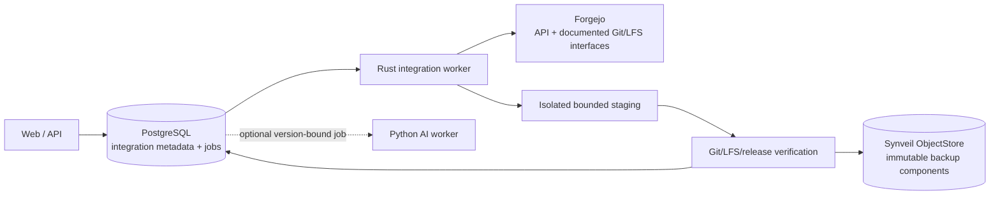
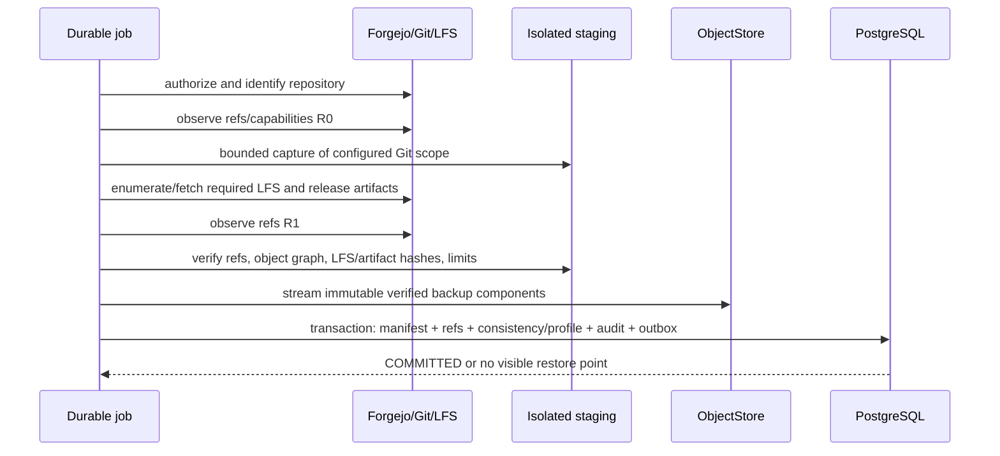

# Git, code, and project integration architecture

Status: **PLANNED Forgejo integration and semantic retrieval; EXPERIMENTAL generated intelligence**

Synveil integrates with a forge; it does not become one. Forgejo is the first
`PLANNED` provider under accepted
[ADR-012](../adr/ADR-012-forgejo-integration.md). Repository inventory,
health, verified backup/restore, storage reporting, and `Project` associations
are planned for Phase 11. Version-bound semantic code indexing/retrieval is an
advanced `PLANNED` Phase 12 capability. Repository question answering and
generated summaries are `EXPERIMENTAL`; GitHub, GitLab, Gitea, and
provider-specific collaboration backup remain future provider work until their
own gates pass.

Nothing in this blueprint implements a connector or claims a repository has
been backed up. Canonical entities are in [DOMAIN_MODEL.md](DOMAIN_MODEL.md);
HTTP routes are planned in [API_ARCHITECTURE.md](API_ARCHITECTURE.md);
device backup semantics remain separately defined in [BACKUP.md](BACKUP.md).

## Responsibility boundary

| Capability | Forgejo owns | Synveil may plan |
|---|---|---|
| Git smart HTTP and SSH | Protocol endpoint, authentication, transport policy | Consume documented Git interfaces as a bounded client |
| Git object database, refs, packfiles | Live repository authority and mutation | Capture a verified restorable representation |
| Repository permissions | Current membership, teams, visibility, branch policy | Recheck current provider authorization; cache only labeled metadata |
| Pull requests, issues, reviews, releases | Collaboration truth and workflows | Show selected summaries; back up only explicitly supported data |
| Git LFS | Live LFS batch/object service and authorization | Capture/verify required LFS objects under backup profile |
| Webhooks | Provider emission and documented signature format | Authenticate as a hint and schedule reconciliation |
| Availability | Forgejo deployment/operator | Mark `Repository` freshness `STALE`, set `GitIntegration.status` to `DEGRADED` when appropriate, and retry independently |
| Projects | Forgejo projects if used | Synveil `Project` links code to files/assets/backups without replacing Forgejo |
| AI/code understanding | No Synveil assumption | Optional read-only derived indexing under [AI.md](AI.md) |

Synveil does not expose custom Git smart HTTP/SSH, implement pull requests or
issues, rewrite packfiles as a live forge, mirror Forgejo permissions into a
competing authority, or require Forgejo for Drive, sync, backup, restore, or
Photos.

## Architectural invariants

1. A Forgejo outage or credential failure never blocks core storage
   operations. Cached `Repository` freshness becomes `STALE`; the associated
   `GitIntegration.status` becomes `DEGRADED` when the integration is unhealthy.
2. A cached `Repository` uses the provider's immutable repository ID. Owner,
   name, URL, default branch, and visibility are mutable observations, not
   identity.
3. Provider credentials are least-privilege, write-only through the API,
   encrypted at rest through a reviewed secret service/envelope, never embedded
   in repository URLs, logs, job payloads, or backup artifacts, and
   independently revocable.
4. Configured base URLs and every redirect/network request pass an
   operator-controlled SSRF/egress policy. A self-hosted private Forgejo is
   supported only through explicit trusted-network configuration, never by
   accepting arbitrary private addresses from untrusted users.
5. Webhooks are authenticated, replay- and size-limited hints. A poll/API/Git
   reconciliation establishes truth before metadata or backup state changes.
6. Repository inventory is not backup. A backup is restorable only when its
   versioned manifest, declared Git refs/objects, required LFS/release
   components, and hashes pass verification.
7. `BUILDING`, `INCOMPLETE`, and `FAILED` repository backups are never offered
   as complete restore points. Only `COMMITTED` satisfies its declared
   consistency/profile.
8. Repository restore defaults to a new, explicit, empty destination. It never
   force-pushes, deletes, or overwrites a live repository by default.
9. A `Project` link does not transfer ownership, broaden permission, alter
   retention, or cascade-delete the repository, node, backup, or device.
10. Repository parsing, backup, AI indexing, and external calls are
    asynchronous, bounded, idempotent jobs delivered at least once from the
    PostgreSQL outbox.

## Component boundary



The Rust worker owns provider communication and backup orchestration. External
commands, if a reviewed implementation uses the Git CLI, run in a
least-privilege sandbox with an argument array—not a shell—and with hooks,
credential persistence, alternates, external helpers, network protocols, and
unsafe configuration disabled except for the one allowed provider transport.

The Python AI worker may index an explicitly selected, immutable repository
backup/source version. It does not poll Forgejo, hold forge credentials, or
participate in backup correctness.

## Connecting Forgejo

### Creation flow

1. An authenticated owner submits provider type `FORGEJO`, base URL, safe
   display label, authentication material, and requested capability scopes.
2. The API canonicalizes the URL and validates scheme, userinfo absence, port,
   hostname, path prefix, configured trust/network zone, and egress policy
   before storing anything.
3. The secret enters a write-only secret boundary. The database stores a secret
   reference and encrypted envelope/ciphertext, never a response-readable
   token.
4. A bounded connection-test job resolves DNS under rebinding defenses,
   validates TLS according to the operator trust policy, revalidates every
   redirect, limits response bytes/time, and calls a documented safe identity
   endpoint.
5. The job records immutable provider installation/account identity, Forgejo
   version/capabilities, granted scopes when discoverable, and safe health.
6. The integration moves from `PENDING` to `ACTIVE` only after identity and
   required least-privilege capabilities are verified.

A failed test retains `PENDING` or becomes `REAUTH_REQUIRED`/`DEGRADED` with a
safe error. It does not expose whether an arbitrary internal host/port exists.

### URL and SSRF policy

Connector URLs are more privileged than arbitrary user content because a
self-hosted forge may legitimately be on a private network. Therefore:

- only an instance administrator or a role explicitly granted integration
  configuration can choose a new origin;
- allowed schemes are HTTPS and an explicitly operator-approved HTTP exception
  for a trusted local network;
- URL userinfo, fragments, ambiguous encodings, wildcard hosts, Unix/file
  schemes, and unregistered protocols are rejected;
- the operator allow-lists public egress and/or named private network zones;
- DNS answers are checked before connection and on redirect/retry; connections
  are pinned to an allowed resolved address for that attempt;
- redirects cannot change to a disallowed origin or downgrade transport;
- proxies and environment variables cannot silently reroute traffic outside
  the connector egress policy; and
- webhook callback URLs and provider-reported clone/LFS/release URLs are not
  trusted merely because Forgejo returned them. They are resolved relative to
  verified provider identity or independently revalidated.

### Credential lifecycle

Credentials carry explicit purpose: `INVENTORY_READ`, `REPOSITORY_BACKUP`,
`LFS_READ`, `RELEASE_READ`, and `RESTORE_WRITE` are separate conceptual
capabilities even if Forgejo combines scopes.

- Inventory/backup should use read-only provider credentials whenever
  possible.
- Restore write capability is requested only for a restore operation or held
  in a separately disclosed integration profile.
- Secret read/decrypt is limited to the executing worker identity and
  operation. A decrypted token is kept only in memory for the bounded call and
  is not passed on a command line or persisted by Git credential helpers.
- Rotation writes a new secret generation, validates it, atomically activates
  it, and retires the old generation after a short auditable overlap.
- Revocation stops new jobs, invalidates queued credential leases, deletes or
  makes the encrypted secret inaccessible, and retains only safe audit facts.
- A provider `401` or otherwise rejected credential sets integration status
  `REAUTH_REQUIRED`. A verified scope reduction/`403` sets status `DEGRADED`
  with safe health reason code `PERMISSION_CHANGED`. The reason code is not a
  `GitIntegration.status`, and automated retry does not brute-force a revoked
  credential.

Backups never include Forgejo API tokens, webhook secrets, SSH private keys,
HTTP authorization headers, credential-helper files, or remote URLs containing
userinfo.

## Repository discovery and inventory

### Identity and reconciliation

Discovery pages through the documented Forgejo API with a bounded page size and
call budget. Each result is upserted by (`GitIntegration`, provider repository
ID), not by name or clone URL.

- Rename/owner transfer updates display metadata and creates an audit/activity
  fact while preserving Synveil `Repository.id`.
- A path reused by a new provider repository ID creates a new Synveil
  repository; it does not inherit old backups automatically.
- A repository absent from one partial/error response is not deleted. Only a
  complete reconciliation can mark it `REMOVED_AT_PROVIDER`, and retained
  backups remain under policy.
- Provider visibility/permission change updates safe cached metadata and may
  immediately hide the repository from users who no longer have current
  access, depending on the selected ownership model.
- Pagination loops, duplicate provider IDs, inconsistent responses, and
  response truncation fail reconciliation visibly rather than deleting cached
  rows.

### Cached metadata

Planned inventory may retain:

- provider repository ID, owner/name/full name, canonical web URL;
- default branch, archive state, visibility as last observed;
- bounded branch/tag summaries and recent commit IDs/authors/times/messages;
- provider updated time and last successful Synveil observation;
- provider-reported storage usage labeled as provider-reported;
- last repository backup state/time/profile and restore-drill state; and
- health/freshness with safe failure class.

Commit messages, author identities, private repository names, branch names, and
release names are sensitive. API list views minimize fields; logs and metrics
exclude them. “Last updated by provider” and “last checked by Synveil” remain
different values.

Synveil does not use cached visibility as the only authorization signal. In an
initial owner-scoped integration, only the integration owner and explicitly
authorized Synveil administrators can view it. Any multi-user mapping to
Forgejo users/teams requires a separate reviewed authorization contract.

## Polling and webhooks

### Polling

Polling is the conservative source of reconciliation:

- jobs are scheduled per integration with jitter, bounded concurrency, and
  exponential backoff;
- conditional provider requests may reduce transfer but a `304` is only as
  trustworthy as the authenticated provider endpoint and cache key;
- one slow or failing repository cannot hold a database transaction or block
  other integrations;
- results stage then commit a complete reconciliation checkpoint;
- freshness state records last attempted and last successful checks; and
- manual refresh enqueues the same idempotent job rather than making the API
  synchronously depend on Forgejo.

### Webhooks

If enabled, a provider-specific webhook endpoint:

- receives only a bounded body and permitted content type;
- finds the integration through a non-secret routing identity;
- validates the documented provider signature/secret in constant-time where
  applicable;
- rejects timestamps/delivery IDs outside replay policy and deduplicates
  accepted deliveries;
- redacts headers/body from logs;
- parses only after authentication and schema/size validation;
- records a minimal hint and enqueues reconciliation; and
- returns quickly without performing a repository backup or trusting the event
  as final state.

A webhook can be delayed, duplicated, reordered, forged, or lost. Polling and
explicit reconciliation remain necessary.

## Repository backup

### Backup profile

A versioned repository backup profile declares required components:

| Component | Initial intent | Completeness rule |
|---|---|---|
| Git object database and selected refs | `PLANNED REQUIRED` | Every recorded ref resolves to a captured object graph; structural verification passes. |
| Git LFS objects reachable from captured scope | `PLANNED REQUIRED when LFS is enabled for profile` | Every manifest pointer has a captured object with verified algorithm/length. |
| Selected release artifacts | `PLANNED configurable` | Every provider-listed required artifact is captured/verified or backup is incomplete. |
| Issues, pull requests, reviews, wiki, packages, actions | `EXPERIMENTAL/FUTURE` | Never implied by “repository backup”; each needs a versioned export/restore contract. |
| Forgejo permissions/settings/hooks/secrets | `NON-GOAL initially` | Restore recreates only explicitly supported safe settings; secrets are never backed up. |

The user sees the profile and component results. A Git-only backup is not
labeled “full Forgejo backup.”

### Capture sequence



Detailed requirements:

1. Reauthorize current integration/repository identity and required scopes.
2. Allocate bounded staging capacity and a lease; never write into a live
   Forgejo repository or canonical object namespace directly.
3. Record provider identity/version, source repository immutable ID, capture
   times, backup-profile version, and initial ref set `R0`.
4. Capture selected refs and the complete reachable Git object graph using a
   documented portable representation. Disable hooks, submodule recursion,
   alternates, replacement objects, external filters, working-tree checkout,
   arbitrary protocols, and credential persistence.
5. Parse LFS pointer content without executing filters; enumerate/fetch the
   configured reachable LFS objects through authenticated validated endpoints.
6. Enumerate and fetch selected release artifacts through bounded validated
   provider URLs. Provider filenames remain untrusted metadata.
7. Observe `R1` and record whether refs remained stable. If they changed, retry
   to the bounded policy or produce a clearly labeled windowed capture only if
   every manifest ref still resolves and the selected profile permits it.
8. Run structural Git verification in the sandbox, prove every captured ref
   resolves, validate component counts/lengths/checksums, and compute a
   versioned manifest root.
9. Stream verified components through the normal Synveil object-store
   durability contract using opaque keys and SHA-256/stored checksums. Git's
   internal object hashes are structural data; they do not replace Synveil
   object integrity.
10. In one PostgreSQL transaction create all authoritative component
    references, per-component results, consistency class, audit/outbox facts,
    retained accounting, and the idempotent terminal state.

If object writes succeed but the transaction fails, no restore point becomes
visible; unreferenced objects remain lease/grace protected for reconciliation.
If commit succeeds but the response/job acknowledgement is lost, the same job
identity returns the one `RepositoryBackup`.

### Consistency classes

A backup states one of:

- `REF_STABLE`: `R0 == R1` and every ref/object/component required by the
  profile verified;
- `REF_WINDOWED`: refs changed during capture, but the manifest freezes an
  explicit captured ref set whose complete object graph verifies; cross-service
  LFS/release observation times are disclosed;
- `PROVIDER_SNAPSHOT`: a future provider-native snapshot/export API gives a
  documented stronger point-in-time guarantee; or
- `INCOMPLETE`: any required component or verification is missing.

Only `REF_STABLE`, a profile-permitted `REF_WINDOWED`, or a reviewed
`PROVIDER_SNAPSHOT` may become `COMMITTED`. No class claims atomicity across
Forgejo's Git, LFS, releases, issues, and database unless the provider
explicitly supplies and Synveil tests that guarantee.

### Retention and accounting

Repository backups have a repository/profile retention policy separate from
live Forgejo deletion and device `BackupSet` retention. Removing an integration
does not silently purge committed backups. Expiration first marks the manifest
unavailable under policy; object GC later proves no file version, backup,
repository backup, derivative, lease, or hold references remain.

Report separately:

- provider-reported live repository usage and freshness;
- backup logical Git/LFS/release bytes;
- retained bytes across recovery points;
- unique physical Synveil bytes within the permitted dedup domain; and
- staging/failed-capture bytes awaiting cleanup.

Cross-user deduplication remains disallowed by default and no saving or timing
reveals another repository's content.

## Restore and export

### Safe restore flow

1. Select one `COMMITTED` recovery point and inspect its profile, consistency
   class, components, source provider identity, and verification age.
2. Reverify manifest root and stored component integrity. A corrupt/missing
   component blocks complete restore and initiates recovery; it is not skipped
   silently.
3. Select an existing `ACTIVE` Forgejo integration and an explicit new
   repository owner/name. Reauthorize current create/write/LFS/release scopes
   and revalidate provider identity/URL.
4. Confirm the destination does not exist or is a newly created empty,
   operation-owned repository. Existing repository overwrite/force-push is not
   an initial path.
5. Reconstruct in isolated staging with hooks, alternates, checkout, submodule
   recursion, and unsafe protocols disabled. Run structural verification.
6. Create the destination and restore refs through documented Git transport;
   restore required LFS objects and supported release artifacts.
7. Read back destination refs/component inventory and compare against the
   manifest.
8. Record per-component `SUCCEEDED`, `SKIPPED_BY_PROFILE`, `CONFLICT`, or
   `FAILED` plus verification. Report `SUCCEEDED` only when the selected
   profile's required components match.

Forgejo changes are external side effects and cannot share a PostgreSQL
transaction. A crash can leave a partially created destination. The durable
operation records its provider repository ID and completed steps so retry
reconciles rather than creating another repository. If safe automatic cleanup
cannot be proven, the operation leaves the destination quarantined/clearly
labeled and gives manual remediation; it never force-deletes it.

Provider permission or visibility defaults are explicitly selected during
restore and re-read afterward. Synveil does not restore secrets, webhooks,
deploy keys, branch protections, collaborators, actions secrets, or issues
unless a future profile defines and verifies each item.

### Portable export

An authorized user can `PLANNED` download a versioned manifest and its
documented portable components without a working source Forgejo. Export is
streamed, checksummed, and does not expose internal storage keys or integration
credentials. It includes a format/version reader guide and verification
command/procedure once the capture representation is accepted.

An export is not automatically a one-file archive; large components may use a
manifest plus independently checksummed streams. A packaging step enforces
entry count, path, expanded size, symlink, and archive safety and cannot load
the repository into memory.

## Projects and workspaces

A `Project` is an optional Synveil metadata container:

```text
Project
├── Repository links
├── Document and asset Node links
├── BackupSet / BackupSnapshot links
├── Device links
└── User-authored metadata and optional derived search scope
```

Rules:

- Creating a link requires current access to the project and target.
- Reading through a project requires current access to each target; a cached
  link never broadens it.
- Removing a link does not delete or alter the target.
- Deleting a project deletes project metadata/links only after normal
  retention/audit behavior; it does not cascade to files, repositories,
  backups, or devices.
- A repository or node can be linked to multiple projects.
- Project title, descriptions, and links are sensitive metadata and inherit
  owner/share policy.
- Search can use a project as an authorization-constrained scope, but project
  membership is not an alternative authorization authority.

Normal storage users never need a `Project` or Forgejo connection.

## Code indexing and AI

Version-bound code indexing and ACL-filtered semantic code retrieval/search are
advanced `PLANNED` Phase 12 capabilities governed by [AI.md](AI.md). Generated
answers such as “where is authentication implemented?”, change summaries, and
repository Q&A remain `EXPERIMENTAL`; they are not required to promote the
retrieval foundation.

- Index only an explicitly selected immutable source: a commit/object snapshot
  or `COMMITTED RepositoryBackup`. “Current repository” without a source
  revision is not reproducible.
- Never execute builds, tests, package managers, hooks, notebooks, macros, or
  repository scripts to index code.
- Treat README/code/comments/issues as untrusted prompt-injection content.
- The AI worker receives no Forgejo write credential and has no Git, shell,
  sharing, deletion, restore, or provider tool.
- Current repository/project/source authorization filters every result and
  citation.
- Remote inference separately consents to code/repository content and query
  text; private source never silently leaves the host.
- Forgejo unavailability may leave cached/indexed data stale but does not
  invalidate a previously verified immutable source. Freshness remains visible.

AI records are derived and deletable. Repository backup and restore never
depend on embeddings, OCR, tags, or generated summaries.

## API and event contract

Planned HTTP groups in [API_ARCHITECTURE.md](API_ARCHITECTURE.md) include:

- `/api/v1/integrations/git` for create/list and safe status;
- `/api/v1/integrations/git/{integration_id}` for conditional update/revoke;
- `:test` and `:refresh` asynchronous commands;
- `/api/v1/repositories` and `/{repository_id}` for inventory;
- `/repositories/{repository_id}/backups` and
  `/repository-backups/{backup_id}:restore`;
- `/api/v1/projects` and conditional typed project links; and
- `/api/v1/operations/{operation_id}` for backup/restore/refresh progress.

Credentials are write-only request fields and never appear in response,
example, error, audit details, idempotency response after issuance, or generated
client debug output. All mutation commands use ETag/base preconditions and/or
persisted idempotency as specified by the API architecture.

Internal versioned event/job families are planned as:

- `integration.git.reconcile_requested`;
- `integration.git.webhook_received` as a hint;
- `repository.discovered`, `repository.updated`, and
  `repository.provider_removed`;
- `repository.backup_requested` and `repository.backup_committed`;
- `repository.restore_requested` and `repository.restore_completed`; and
- optional `repository.index_requested`.

Outbox payloads contain scoped IDs and versions, not credentials, clone URLs
with tokens, commit messages, code, webhook bodies, or release content.
“Requested” and “completed” are different facts; a queued job does not make a
backup healthy.

## Security requirements

### Provider and network

- Apply the connection SSRF policy to API, clone/fetch, LFS, release,
  submodule, redirect, and provider-reported URLs.
- Do not automatically follow submodules or fetch external Git alternates.
- Validate TLS and hostname; custom CA/insecure local exceptions are explicit
  operator trust configuration, narrowly scoped, and prominently reported.
- Bound connection counts, DNS resolution, redirects, response headers/body,
  pages, repositories, refs, artifacts, retries, and total job time.
- Map provider failures to safe codes. Never relay raw response bodies/headers
  that may contain secrets or internal topology.

### Git and artifact processing

- Treat ref names, paths, commit messages, authors, tags, release names,
  archive entries, LFS pointers, and Git config as untrusted.
- Reject or safely encode path traversal, absolute paths, device names,
  alternate separators, NUL/control characters, Unicode ambiguity, and archive
  collisions during any packaging/restore.
- Enforce limits for refs, objects, pack/delta expansion, object sizes,
  history traversal, LFS files, release artifacts, temporary disk, memory,
  process count, CPU, and wall time.
- Run structural verification without checkout. If a later export materializes
  a working tree, it uses a new sandbox and strict symlink/submodule/path rules.
- Disable hooks, smudge/clean filters, credential helpers, external diff,
  upload-pack overrides, protocol ext, replace/graft mechanisms, and arbitrary
  configuration includes.
- Never build or execute repository content.

### Secrets and private metadata

- Encryption keys for integration secrets live outside ordinary database
  backups or are themselves protected by a documented master-key recovery
  process. Losing the master key has an honest reauthentication recovery path.
- Restrict secret decryption by process/role and audit its use without the
  value.
- Redact URL userinfo, query secrets, Authorization/Cookie headers, webhook
  signatures, SSH material, and provider error bodies at ingress.
- Private repository names, branch/tag names, commit metadata, LFS/release
  filenames, project links, and storage usage are access-controlled and
  excluded from metrics/logs.
- A repository may contain credentials or personal data. Backup/index/export
  does not imply secret scanning, and remote AI egress requires explicit code
  consent.

## Failure and recovery contract

| Failure | Required behavior |
|---|---|
| Forgejo is offline/timeouts | Mark `Repository` freshness `STALE` with last success and set `GitIntegration.status` to `DEGRADED` when unhealthy; retry with backoff; Drive and verified stored backups remain available. |
| DNS changes to disallowed/private address | Stop before connection/redirect, record safe SSRF-policy failure, do not reveal host reachability. |
| Credential revoked or scope reduced | Set `REAUTH_REQUIRED` for rejected credentials, or `DEGRADED` with reason `PERMISSION_CHANGED` for reduced scope; suppress unauthorized jobs, never brute-force retry or leak provider body. |
| Webhook duplicated/reordered/forged | Authenticate/deduplicate/replay-limit; at most schedule idempotent reconciliation; never mutate truth directly. |
| Repository renamed/transferred | Reconcile by immutable provider ID, update safe metadata, reauthorize ownership; do not create a duplicate or transfer backup ownership silently. |
| Provider path reused for a new repository ID | Create a distinct repository record; old backups stay attached to old identity. |
| Repository disappears from one page/error | Do not mark removed until a complete reconciliation proves absence. |
| Refs move during capture | Retry within bounds or use an allowed `REF_WINDOWED` manifest that resolves completely; otherwise `INCOMPLETE`, never silent “success.” |
| Git/LFS/release component missing/corrupt | Backup stays `INCOMPLETE`/`FAILED` under profile; preserve safe diagnostics and retry path. |
| Object write succeeds but manifest DB commit fails | No recovery point is visible; objects become grace-protected orphan candidates. |
| Manifest commits but worker acknowledgement is lost | Same job/idempotency identity returns the one `RepositoryBackup`. |
| Disk fills or Git expansion exceeds bounds | Abort/quarantine staging, preserve existing backups, expose resource failure, and clean only leased operation data. |
| Restore crashes after destination creation | Durable step/provider-ID record reconciles same destination; do not create another or force-delete/overwrite. |
| Destination exists/non-empty | Refuse initial restore path with conflict; require a new explicit destination. |
| Restore component read-back differs | Mark partial/failed, retain evidence, do not claim successful recovery. |
| Project link target access is revoked | Hide/disable target immediately under current auth; stale link can be cleaned asynchronously without deleting target. |
| AI indexer fails or is disabled | Repository inventory/backup/restore remain operational; code search/Q&A reports disabled/stale. |

## Observability and operations

Planned metrics include integration last-success age, safe error class,
provider-call latency/status buckets, reconciliation page/repository counts,
webhook accepted/rejected/replay counts, queue age/attempt/dead-letter state,
capture logical bytes/components/duration, staging capacity, verification
failure, restore progress/result, and last successful restore drill.

Labels never include base URLs, IP addresses, tokens, repository/project names,
ref/commit values, paths, release filenames, LFS hashes, or user identifiers.
Structured logs use request/job/integration pseudonymous IDs, provider type,
operation/profile/config generation, safe error, duration, and bounded counts.

Operational controls can pause one integration/provider, rotate credentials,
retest identity/scopes, inspect freshness and safe errors, requeue eligible
jobs, reserve/limit staging, verify a retained backup, perform a restore drill,
export a backup, and revoke/delete integration secrets without deleting
retained backup data.

Integration health is separate from core readiness. A configured integration
failure can alert but does not mark the Synveil API/object store unavailable.

## Verification and promotion gate

Before Forgejo integration becomes `IMPLEMENTED`, validation must cover:

- create/test/rotate/revoke with token redaction, least scopes, lost response,
  expired credential, changed provider identity, and master-key recovery;
- SSRF cases across IPv4/IPv6, DNS rebinding, redirects, userinfo, path
  prefixes, custom ports, proxies, private-network allow-lists, clone/LFS/release
  URLs, and custom CA policy;
- paginated discovery with duplicates, rename/transfer, path reuse,
  disappearing pages, partial responses, provider downgrade, and permission
  changes;
- webhook valid/invalid signature, secret rotation, replay, duplication,
  reordering, oversized/malformed body, and reconciliation after lost events;
- concurrent ref mutation, many refs/objects, shallow/partial provider behavior,
  malicious Git config/hooks/filters/alternates/submodules, pack/delta bombs,
  LFS pointer/object mismatch, release redirect, and disk/memory/time limits;
- capture crash at each stage, object-write/DB-failure, lost job
  acknowledgement, duplicate job, orphan cleanup, retention, and cross-dedup
  privacy;
- structural Git verification and a clean-room restore drill for every declared
  backup profile, including refs, required LFS, release artifacts, read-back,
  partial external side effects, and retry to the same destination;
- portable export verification without source Forgejo;
- project link authorization, removal, deletion non-cascade, permission
  revocation, and cross-project isolation;
- Forgejo offline/slow/malicious while core file integration tests stay green;
  and
- AI disabled, prompt-injection content, remote code consent denied/revoked,
  immutable source provenance, and no execution/tool access.

Performance methodology records Forgejo/Git versions, network topology,
repository shape (refs, object/pack/delta sizes, LFS/releases), source churn,
staging/backend type, cold/warm state, CPU/RAM/temp disk, concurrency, API
limits, and verification/export/restore durations. Release budgets derive from
measured named fixtures and hardware, not invented repository-size or
throughput claims.

## Bounded open decisions

OPEN DECISION OD-CODE-001: initial Forgejo authentication mechanism and scopes
Owner: Integrations / Security / Forgejo Operations
Needed by: Phase 11 connector OpenAPI and threat-model gate
Options: personal access token; dedicated service account token; provider application/OAuth flow if supported and sufficient
Recommendation: use a dedicated least-privilege service identity/token for instance-managed backup and separate restore-write capability; support user OAuth only after multi-user authorization requirements are defined
Decision evidence: targeted Forgejo version capability matrix, scope audit, rotation/revocation test, multi-user product decision, and credential compromise analysis

OPEN DECISION OD-CODE-002: integration secret encryption and master-key recovery
Owner: Security / DevOps / Integrations
Needed by: Phase 11 first persisted credential gate
Options: application envelope encryption with file/secret-mounted master key; external secret manager adapter; operator-supplied per-integration secret at runtime
Recommendation: versioned application envelope encryption with a master key supplied outside PostgreSQL, plus an optional future secret-manager port and an explicit reauthentication path if the key is lost
Decision evidence: container/backup threat model, key rotation and disaster-recovery drill, least-privilege test, and operator UX review

OPEN DECISION OD-CODE-003: portable Git capture representation
Owner: Integrations / Backup / Storage / Git Specialist
Needed by: Phase 11 repository-backup format ADR
Options: Git bundle plus separate component manifest; normalized bare repository pack/ref representation; provider-native export wrapped by a Synveil manifest
Recommendation: use a documented standard Git bundle or normalized bare representation selected through round-trip tests, always wrapped by a versioned Synveil manifest with LFS/releases separate; never make provider-native export the only portable format
Decision evidence: repositories with all ref types, large/delta objects, SHA-1/SHA-256 repository formats where supported, restore across supported Git/Forgejo versions, fsck, streaming/resource benchmark, and migration test

OPEN DECISION OD-CODE-004: first backup consistency policy
Owner: Integrations / Backup / Product
Needed by: Phase 11 repository-backup contract gate
Options: require stable refs and retry otherwise; permit verified ref-windowed capture; use a provider-native maintenance/snapshot API
Recommendation: prefer `REF_STABLE` with bounded retry, permit `REF_WINDOWED` only as a clearly labeled user-selected profile when every recorded ref graph verifies, and adopt provider snapshots only after conformance proof
Decision evidence: high-churn repository tests, provider maintenance/API capability review, LFS/release race tests, restore drill, and user expectation review

OPEN DECISION OD-CODE-005: polling and webhook baseline
Owner: Integrations / DevOps / Security
Needed by: Phase 11 inventory scheduling gate
Options: polling only; webhook hints plus periodic polling; webhook only
Recommendation: ship bounded jittered polling first, then add authenticated webhook hints while retaining periodic reconciliation; never rely on webhook-only truth
Decision evidence: Forgejo webhook signature/version matrix, load measurement, missed/duplicate/reordered event tests, firewall/operator UX, and freshness requirements

OPEN DECISION OD-CODE-006: initial release-artifact coverage
Owner: Integrations / Backup / Product
Needed by: Phase 11 backup-profile freeze
Options: Git and LFS only; include release binary attachments; include release metadata plus attachments
Recommendation: make release artifacts an explicit profile component with per-artifact verification and honest completeness; do not delay a Git/LFS recovery profile if release API consistency is not ready
Decision evidence: Forgejo API/version matrix, artifact size/redirect/auth tests, restore semantics, storage benchmark, and user recovery requirements
