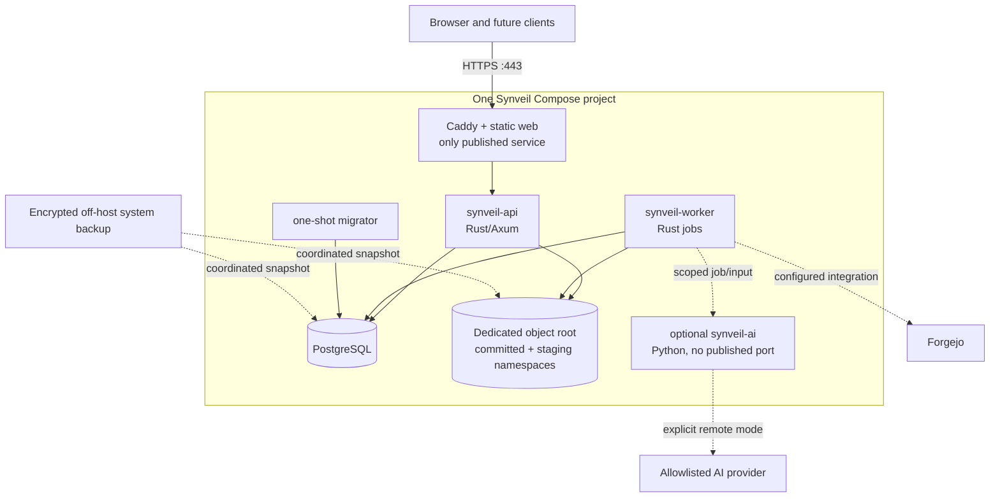

# Synveil deployment and operations architecture

Status: **PLANNED production blueprint**

Docker Compose is a supported Advanced / Server Mode production topology, not
merely a development demo. It is not the only eventual user-facing
installation. Personal / Home Mode is planned around a native/guided installer,
platform service lifecycle, storage selection, and a Synveil-managed personal
PostgreSQL deployment. Both modes use one API/domain/storage correctness model.
Kubernetes, Redis, a message broker, a service mesh and multiple network
microservices are not installation requirements.

This document defines operational contracts. It does not claim that product
deployment images, Compose files, commands, or production support already
exist. The foundation runtime does implement the bounded health routes
documented in the API contract; the deployment topologies and lifecycle below
remain planned.

## Supported deployment profiles

| Profile | Purpose | Required services | Support level target |
|---|---|---|---|
| Developer | Local build/test with disposable data and explicit insecure-local exceptions | PostgreSQL, API, worker; optional Caddy/web/AI | Phase 0 developer support |
| Personal / Home | Guided/native installation for non-technical users, families, desktop users, and small personal servers | Platform runtime, Synveil API, worker, managed/private PostgreSQL, local `ObjectStore`, optional web/AI | Future first-class profile after installer/lifecycle/recovery gates |
| Advanced / Server | Homelab, NAS, sysadmin, VPS, developer, and larger self-hosted deployments | Compose/native service, operator-selected PostgreSQL, local/S3/MinIO `ObjectStore`, optional edge/AI | First advanced production target |
| Single-host local storage | Normal home server, NAS-capable host, PC or VPS with dedicated local/mounted storage | Caddy/static web, API, worker, PostgreSQL, local `ObjectStore` | Advanced / Server reference topology; not Personal / Home parity evidence |
| Single-host S3/MinIO | Metadata on the host, canonical bytes in a conformance-tested remote backend | Same core plus configured S3-compatible backend; MinIO service only if operator chooses | Later adapter promotion, not Phase 0 requirement |
| Optional local AI | Adds self-hosted model/parser runtime without changing core readiness | Core profile plus Python AI/model storage | Phase 10 optional profile |
| Optional remote AI | Uses a configured provider under explicit policy | Core plus AI dispatch/runtime and controlled egress | Phase 10 opt-in only |
| Advanced multi-node | API/worker replicas, possible broker/Kubernetes/read replicas | Only what a measured ADR approves | Future; not general early support |

A NAS-mounted directory uses the local adapter only after its atomicity,
durability, locking, case/name and error behavior pass the same capability
tests as local storage. “Can be mounted” is not evidence of a safe production
backend.

## Initial topology



Caddy is an edge component, not an internal domain dependency. Development and
diagnostic tests may call the API directly on a private/local bind. Product
logic does not assume Caddy-specific authentication or storage behavior.

## Personal / Home Mode lifecycle

The future native/guided flow is:

```text
installer/package
    ↓
discover safe storage candidates and capacity
    ↓
user confirms a durable location
    ↓
provision/configure Synveil-managed services and private PostgreSQL
    ↓
bootstrap account and recovery material
    ↓
start services and run bounded health checks
    ↓
pair devices and choose sync/backup policies
    ↓
ready
```

The installer hides PostgreSQL roles, `DATABASE_URL`, Compose files, reverse
proxy routes, TLS certificate mechanics, filesystem mount flags, and ordinary
environment-variable editing. It must still show the selected data location,
capacity, backup/recovery obligations, network limitations, and data-preserving
uninstall choices. A failed preflight never initializes a new empty storage
root over an existing identity.

Personal / Home Mode uses the same process responsibilities as Advanced /
Server Mode, but a platform adapter owns the service manager. Candidate
managers include Windows Service, launchd, systemd, a narrowly scoped user
service/helper, or a supported runtime supervisor. The domain core does not
know which one is active.

## Advanced / Server Mode lifecycle

Advanced / Server Mode retains the current operator workflow:

```text
choose pinned release and topology
    → configure PostgreSQL/object/secret references
    → validate paths, capabilities, ports, and capacity
    → run one migrator and start API/worker/edge
    → bootstrap and validate health
    → operate with Compose/native/CLI runbooks
```

Docker Compose remains especially important for homelabs, NAS, VPS, developers,
and administrators. It is a supported topology and a useful implementation
foundation, not the product's only conceptual deployment.

## Service lifecycle contract

The future platform/service port must cover:

| Responsibility | Required behavior |
|---|---|
| Synveil API | Start after config/schema/database/storage preflight; graceful drain; restart after bounded failure; expose health state |
| Background jobs | Start after durable job storage; lease/retry; drain without dropping work; recover after crash |
| PostgreSQL | Provision or discover according to profile; initialize least-privilege roles; start/stop/health; never reset data on ordinary failure |
| Storage subsystem | Validate identity/capabilities; reserve capacity; report missing/unavailable/removable storage; never treat a missing root as deletion |
| Update coordinator | Verify signed artifact; coordinate maintenance, backup, migration, and restart; retain failure evidence |
| Health monitor | Separate liveness, readiness, user health, administrator diagnostics, and developer evidence |
| Logs/rotation | Keep bounded local logs, preserve audit/recovery evidence, redact secrets, and rotate without deleting required evidence silently |
| Startup/shutdown | Establish dependency order, handle sleep/reboot/service termination, and resume idempotent jobs/uploads safely |

The abstraction presents stable states and actions. Windows Service, launchd,
systemd, Compose, and shell/CLI details remain adapters. No service manager
API or host process exit code belongs in the domain model.

## Managed PostgreSQL deployment model

PostgreSQL remains the canonical metadata/transaction authority. Personal / Home
Mode must conceptually support a Synveil-managed PostgreSQL lifecycle:

```text
discover/provision
→ initialize private data directory and least-privilege roles
→ apply immutable migrations
→ start and monitor
→ coordinate backup/restore
→ upgrade with compatibility gates
→ recover or enter safe maintenance on failure
```

The user sees “System database” health, not database administration. Advanced /
Server Mode can supply external PostgreSQL, custom backup, TLS, connection pool,
and migration operations. There is no dual SQLite/PostgreSQL product contract.

Remaining feasibility questions include bundled/private distribution, system
PostgreSQL, packaged service dependency, upgrade compatibility, PostgreSQL
backup/restore, Windows/macOS support, data-directory ownership, uninstall,
resource footprint, and security boundaries. These remain `OPEN DECISION` items
in [PLATFORM.md](PLATFORM.md) and ADR-019.

## Service responsibilities and privileges

| Service | Responsibility | Network/volume access | Must not have |
|---|---|---|---|
| `caddy` | TLS termination, canonical host, routing, static hashed web assets, edge time/size/connection limits | Published 80/443; private route to API; Caddy config/certificate state | PostgreSQL/object/AI/Git credentials, Docker socket |
| `synveil-api` | Authentication, authorization, bounded request parsing/streaming, application commands/queries, stable errors | Private PostgreSQL; configured object root/backend; no public bind except through Caddy | Migration privilege, Docker socket, model/runtime admin, unrestricted host filesystem |
| `synveil-worker` | Claim PostgreSQL jobs/outbox, reconciliation, integrity, retention/GC, derivatives and integrations | Private PostgreSQL; object root/backend; optional AI/approved egress | Published port, schema-owner privilege, Caddy/host credentials |
| `migrate` | Validate and apply one ordered migration set under advisory lock | PostgreSQL with migration role; immutable migration files | Long-running service, object root, public port |
| `postgres` | Authoritative metadata, journals, jobs, audit and idempotency | Private core network; dedicated persistent data volume | Internet-published port in production |
| `synveil-ai` | Optional bounded OCR/model/embedding computation and version-bound derived output | Private AI boundary; scoped job/input/output path; explicit provider egress only in remote mode | Public port, broad administrator credential, canonical delete, unrelated database/object access |
| Optional MinIO | Operator-selected S3-compatible backend after adapter conformance | Private storage network and dedicated persistent data | Public administrative console by default, shared root credential in API logs/config |

API and worker may use the same immutable image with distinct commands and
resource limits. This preserves one code/version set without combining process
failure domains.

## Networks, ports and outbound access

### Inbound

- Only Caddy publishes production ports, normally TCP 80 for ACME/redirect and
  443 for HTTPS. Operators may use DNS challenge or an already managed
  certificate where inbound 80 is not available.
- PostgreSQL, API, worker, AI and MinIO/admin endpoints use internal networks or
  loopback-only diagnostic binds. A firewall/host scan verifies they are not
  externally reachable.
- Metrics and detailed health are internal or separately authenticated. A
  public liveness response contains no dependency, version, path or capacity
  detail useful for reconnaissance.

### Internal networks

Use distinct logical networks where Compose/runtime support makes the boundary
meaningful:

- `edge`: Caddy to API;
- `core`: API/worker/migrator to PostgreSQL;
- `ai`: Rust worker/API capability channel to optional AI;
- `storage`: only when a network object store is configured.

Network separation supplements, but does not replace, application
authorization and scoped credentials.

### Outbound

Core local-storage operation requires no vendor control plane or telemetry
egress. Outbound destinations are purpose-specific:

- ACME/DNS provider only when Caddy certificate configuration requires it;
- explicitly configured Forgejo origin;
- explicit remote AI provider only in `REMOTE` mode;
- operator-invoked image/model/update acquisition.

Compose networks alone are not a complete egress firewall. Production guidance
must show how to enforce allowlists with host firewall/proxy controls where the
operator requires them. Redirect/DNS/private-address rules follow
[SECURITY.md](SECURITY.md).

## Persistent state and filesystem layout

Logical volume names are illustrative; packaged deployment may map them to
validated bind paths.

| State | Persistence and backup rule |
|---|---|
| PostgreSQL data | Dedicated volume/path, owned only by PostgreSQL; never share with object bytes. Back up logically or with a reviewed database snapshot method. |
| Object root | Dedicated storage identity containing separate generated `staging/` and immutable committed namespaces on the same durability domain when local atomic promotion is used. No user path mapping. |
| Caddy state | Certificate/account state and configuration; certificate state can often be recreated, but custom CA/DNS credentials are secrets and need operator recovery. |
| Configuration | Versioned non-secret file plus deployment-specific overrides. Back up the effective redacted configuration and schema version. |
| Secrets | Host-protected mounted files or external secret references, separate from source/config; secure off-host recovery is mandatory for master keys. |
| AI models/cache | Optional, bounded and replaceable unless license/download availability requires preservation. Never the only copy of canonical user data. |
| Parser/job temporary data | Bounded writable temp area; disposable after process crash and reconciled by job identity. |
| System backups | Separate failure domain/off-host destination, not another directory on the same disk presented as protection. |

### Local object-root validation

At startup and readiness, the local adapter verifies:

- the configured path is non-empty, absolute, dedicated, expected type and not
  `/`, a home/workspace root, the PostgreSQL directory or an unreviewed link/
  junction;
- ownership/mode permit only intended service users;
- a persistent storage identity marker matches database configuration;
- required staging/committed namespaces are inside the root and not symlinks;
- the accepted durability/capability profile matches the observed filesystem;
- free space and inode/file-count headroom exceed configured safety reserves.

A missing or unexpected root fails readiness. It is never interpreted as “all
objects were deleted,” and changing the path string is never an object-store
migration.

### Staging placement

For the local adapter, upload staging used for atomic promotion must reside on
the same filesystem/durability domain as the committed namespace unless the
application uses a tested copy-and-verify finalization path. A convenient
separate temporary volume must not silently turn rename into a cross-device
copy. Staging has independent accounting/expiry even when it shares the object
root.

## Configuration contract

Configuration is typed, versioned and validated before a process becomes
ready. Precedence is documented and deterministic, for example:

```text
packaged defaults < configuration file < explicitly supported environment
references < command-line maintenance override
```

Secret values are referenced, not printed in effective-config output.

Required production categories include:

- canonical external URL and trusted Caddy/proxy networks;
- PostgreSQL endpoint/pool/timeouts and runtime role secret reference;
- storage backend type, identity, root/bucket/prefix, durability profile,
  capacity reserve and credential reference;
- session/cookie/CSRF and application master-key references;
- request/upload/part/quota/concurrency/deadline limits;
- journal/trash/version/staging/job/audit retention;
- worker lease, retry, dead-letter and concurrency budgets;
- log level/format/redaction, metrics and optional OTLP endpoint;
- bootstrap state/secret reference;
- optional AI mode/provider/model/resource/privacy policy;
- optional Forgejo origins/credential references/webhook policy.

Production startup rejects unknown critical keys, invalid URLs, plaintext secret
values in prohibited fields, insecure cookies under a non-local URL, a schema
that is newer/unsupported, storage identity mismatch and internally
inconsistent limits. A config validation command runs without mutating data.

## Secret management

- Installation generates independent random database, session/token-verifier,
  CSRF/bootstrap, application-master and webhook/provider secrets as needed.
  Do not reuse one secret for multiple purposes.
- Prefer mounted files with restrictive host ownership/mode. Environment
  variables may leak through process inspection, crash/debug output or support
  tooling and are not the preferred long-lived production source.
- Compose `secrets` file mounts are not automatically encrypted at rest; their
  source files and backups remain operator responsibilities.
- No secret is baked into an image, checked into the repository, placed in a
  URL/command line, rendered to the web client or included in logs/diagnostics.
- Rotation is per secret type, supports an explicit short overlap where
  necessary, records audit, and has rollback/recovery instructions.
- The application master key is outside PostgreSQL. A system backup that omits
  it may restore metadata but lose access to encrypted integration/provider
  credentials. Backup and restore validation checks this explicitly.

## Container hardening

Production service definitions should:

- run with stable non-root UID/GID and minimal writable paths;
- set `no-new-privileges`, drop capabilities and avoid `privileged`;
- use a read-only root filesystem where runtime libraries support it;
- mount only the exact data/config/secret paths required, never host `/`, a
  home directory, workspace root or Docker socket;
- set bounded memory/CPU/PID/file-descriptor/temp-space policies appropriate to
  the host, while documenting how resource termination appears and recovers;
- provide an init/reaping strategy for subprocess-running parser/Git containers;
- pin promoted images by immutable version/digest and retain SBOM/checksum/
  provenance evidence;
- define health checks without embedding credentials on the command line.

The API and worker need object storage; Caddy and PostgreSQL do not. Optional AI
should not mount the entire canonical object root when a scoped capability/
stream can provide its one input. If direct backend access is selected, it uses
a separate read-only/scoped credential and cannot delete canonical objects.

## Caddy and HTTP behavior

Caddy supplies edge TLS and routing but does not own application security.
Production configuration must:

- redirect HTTP to HTTPS where applicable and automate or load a valid
  certificate for the canonical host;
- pass only normalized proxy headers and overwrite untrusted client-supplied
  forwarding values;
- preserve request/trace IDs under a documented policy;
- stream upload/download/range responses without buffering complete files;
- set timeouts compatible with resumable part sizes and slow-but-valid clients,
  while applying idle/deadline and connection limits;
- enforce a coarse maximum request/body/header policy, with authoritative
  per-user/session/part/quota validation repeated in the API;
- route `/api/v1/` only to the API and serve content-hashed web assets with
  appropriate cache headers; do not cache authenticated API responses by
  default;
- apply security headers and exact host/origin behavior; never expose internal
  storage paths or dependency errors.

HSTS is enabled only after hostname/certificate recovery is understood. A
development HTTP exception is loopback/isolated and cannot be copied into the
production profile silently.

## Installation and first-run UX

The eventual packaged flow is:

```text
obtain a pinned release/Compose bundle
    ↓
declare and validate persistent database plus pre-authorized object/backup paths
    ↓
generate protected secrets and non-secret configuration
    ↓
start PostgreSQL, run one-shot migrations, start API/worker/Caddy
    ↓
open canonical HTTPS URL with one-time bootstrap secret
    ↓
create first administrator, consume/close bootstrap
    ↓
select/confirm an ObjectStore from the host-authorized candidates
    ↓
run storage/health/system-backup readiness checklist
```

`git clone ... && docker compose up -d` may remain a contributor convenience.
Stable operators receive immutable release assets and exact version pins rather
than the moving default branch.

The install preflight verifies supported architecture, container runtime/
Compose version, port and hostname/TLS prerequisites, directory ownership,
storage identity/capabilities, available capacity/inodes, database connectivity
and config/secret permissions. It does not change an existing deployment until
the operator confirms the resolved paths.

The browser setup can make storage selection understandable without becoming
an arbitrary host-filesystem browser. Compose/the operator first mounts and
allowlists candidate roots or configures named backends; after authentication,
bootstrap selects one candidate, verifies/creates its Synveil storage identity
under an explicit confirmation, and records the non-secret backend reference.
Backend credentials remain mounted secrets and never round-trip to browser
JavaScript. A later backend migration uses the copy/verify/switch procedure,
not a new path string.

First-run bootstrap:

1. is available only while no administrator exists;
2. requires a high-entropy one-time secret delivered through a protected host
   file or explicit installer output, not routine logs;
3. serializes concurrent claims and commits administrator plus bootstrap-close
   atomically;
4. produces one-time recovery codes and prompts an external system backup;
5. closes after success and requires an explicit audited host action to re-arm.

No first-run step requires manual SQL or editing object metadata.

## Schema migration lifecycle

- A distinct one-shot migrator holds a PostgreSQL advisory lock, validates
  released migration checksums and applies ordered forward migrations.
- API/worker do not race to migrate. They remain unready while a supported
  migration is running and refuse an unknown newer schema.
- Transactional DDL is used where supported. Non-transactional operations have
  a resumable state/check and documented interruption behavior.
- Use expand/backfill/contract changes. Large backfills run as restartable,
  rate-bounded jobs with progress metrics, not one unbounded startup lock.
- Released migration files are immutable. Correction is a new migration and an
  upgrade fixture.
- If mixed application versions can run, readers for old/new forms deploy
  before new writers. Initial single-host maintenance upgrades may instead
  deliberately stop all old writers and document downtime.
- Schema/data changes never assume a wipe. A binary downgrade is allowed only
  by the explicit compatibility matrix; otherwise rollback means complete
  pre-upgrade restore.

## Health and readiness

### Endpoint semantics

| Signal | Meaning | Dependency behavior |
|---|---|---|
| `/health/live` | Process runtime/event loop can answer | No expensive dependency probes; failure means restart may be useful. |
| `/health/ready` | Process can safely receive its required traffic | Valid config/schema; bounded PostgreSQL check; selected object backend identity and recent cached probe; required secret availability. |
| Restricted health details | Operator view of DB, object capacity/integrity, workers, jobs, backups, AI/integrations and migrations | Authenticated/admin or internal only; returns safe states, timestamps and stable errors, not credentials/paths. |
| Worker heartbeat | Worker is claiming/completing required job classes | Stored/aggregated with freshness; stale worker degrades jobs but does not make core reads false-live. |

Liveness does not query every dependency. Readiness does not scan all objects or
create a test object on each probe. Periodic storage health jobs perform bounded
write/read/delete probes in a reserved health namespace, cache the result and
feed readiness according to policy.

Core API readiness does not require AI, Forgejo, thumbnails, OCR or semantic
search. Their status is `DISABLED`, `READY`, `DEGRADED`, `STALE` or `FAILED` in
the restricted system view. PostgreSQL or canonical object-backend failure may
make mutations unready while carefully defined metadata reads continue; the
edge should not restart-loop a healthy process because a dependency is down.

### Human-readable health model

Personal / Home Mode presents product states such as:

```text
Storage       Healthy
Database      Healthy
Backups       Healthy
Remote access Connected
Devices       4 connected
```

The user-facing layer translates stable error codes and diagnostics into an
action, for example: “Your Synveil storage is almost full. 182 GB remains.
[Manage storage].” Administrator diagnostics retain `ENOSPC`, migration state,
backend identity, job age, and a correlation ID behind an authenticated view.
Developer diagnostics retain redacted logs/traces. These layers must not
disagree about the underlying health state.

### Automated maintenance

The native/personal service may schedule database maintenance, GC, integrity
scans, backup verification, thumbnail/cache cleanup, certificate renewal,
service recovery, log rotation, storage health checks, retention cleanup, and
update readiness. Each operation is safe, observable, recoverable, and bounded.
Destructive maintenance uses `inspect → plan → validate → execute → verify`,
supports dry-run/report where practical, and never silently deletes the only
recoverable copy.

## Jobs and worker operations

PostgreSQL is the initial durable queue/outbox. Workers claim with short
transactions and lease generations, execute outside the claim transaction,
then conditionally complete. Operations expose:

- queue depth and oldest eligible age by bounded job class;
- attempts, lease expiry/steal, running duration, success/failure and dead
  letters;
- last successful staging/orphan/integrity/retention/GC/storage-health job;
- per-class concurrency, priority and backpressure;
- safe administrative pause/resume/retry/dead-letter inspection with audit.

Worker termination expires a bounded lease and repeats idempotently. Poison
jobs become terminal rather than hot-looping. Optional AI/photo/Git work uses
separate concurrency classes and cannot starve reconciliation, integrity,
retention or backup jobs.

No early deployment needs Kafka, RabbitMQ, NATS or Redis. A broker may later
fan out from the PostgreSQL outbox only after a measured ADR demonstrates
equivalent retry/idempotency and operations behavior.

## Observability

### Structured logs and traces

Rust uses `tracing`. Production JSON records include service/version,
timestamp, severity, request/trace/operation ID, route template, stable error
code, outcome, duration and bounded byte counts. Principal/device identifiers
are redacted/pseudonymous. Worker spans connect outbox/job/source version,
object/backend and retry without recording content or storage keys.

Never log passwords, cookies, bearer/share/recovery tokens, secret/config
values, file contents, full sensitive paths/names, AI payloads, SQL parameters,
authorization headers or credential-bearing URLs. A debug mode does not disable
redaction.

OpenTelemetry export is operator-configured and off by default. A local log is
not automatically sent to Synveil or another hosted service.

### Metrics

Expose a Prometheus-compatible internal endpoint or equivalent bounded exporter
without requiring a bundled Prometheus/Grafana stack. Metrics include:

- HTTP requests/in-flight/duration/errors and streamed bytes by route template,
  method/status class and stable error—not user/file/token;
- active upload sessions/parts, staged bytes, completion/checksum/disk/quota
  failures and stream memory/concurrency;
- DB pool wait/use, transaction retry/deadlock, migration and query-family
  duration;
- object read/write/range latency/errors, capacity/inodes/reserve, missing/
  corrupt/quarantined replicas and reconciliation/GC findings;
- change-feed head/retention/cursor-expiry and device lag/backlog in bounded
  buckets;
- job depth/oldest age/attempt/dead-letter/worker heartbeat by bounded class;
- latest successful backup/snapshot/restore and restore verification failures;
- optional photo/AI/Git queue freshness, provider/connector status and failure
  class without payload/repository names.

High-cardinality labels are prohibited. Audit records, not metrics, answer
user-specific security questions.

### Alerting baseline

Operators need actionable warnings for database/object unavailability, storage
reserve/inode exhaustion, unexpected storage identity, checksum corruption,
orphan/reference drift, stalled required jobs, failed/late system or user
backup, repeated authentication/share abuse, migration failure, certificate
expiry, secret decryption failure and optional provider/connector degradation.

Thresholds are configuration/load-profile decisions measured during phases;
documentation does not invent universal marketing SLOs. Every alert links to a
runbook, distinguishes symptom from destructive action, and avoids automatic
purge/repair on uncertain evidence.

## Capacity and performance operations

Capacity planning distinguishes:

- canonical logical bytes, retained historical/backup bytes and physical bytes;
- committed objects, active staging, orphan grace, derivatives, indexes,
  database/WAL and system-backup space;
- byte capacity and inode/object/row counts;
- CPU/memory/blocking threads/DB connections/network and external-provider
  quotas.

Maintain configurable disk/inode reserves. New staging/content commits stop
before critical exhaustion while reads, purge/recovery and operator diagnostics
retain headroom. An emergency reserve is not counted as user quota.

Benchmark evidence records hardware, filesystem/backend, TLS/proxy, software/
config version, file-size/directory distribution, concurrency, warm/cold cache,
duration, error rate, CPU/memory/disk/network and tail latency. Relative
regression budgets precede product claims. Performance tuning may not weaken
fsync, checksums, authorization, idempotency or restore.

## Synveil system backup

The product's user backup feature does not automatically protect the Synveil
server itself. Operators require a coordinated **system backup** of:

1. PostgreSQL metadata, journals, jobs, audit and idempotency state;
2. every referenced canonical object namespace/backend or an independently
   durable backend snapshot with a precise restore point;
3. effective non-secret configuration, release version, migration checksums and
   storage identity;
4. application master key and other irreplaceable secrets through a separate
   encrypted recovery channel;
5. optional required connector/model license metadata and external-storage
   configuration.

Database-only backup cannot restore file bytes. Object-only backup cannot
reconstruct names, ownership, versions, manifests or authorization. A copy on
the same disk is not protection against disk loss.

### Initial coordinated backup procedure

The safest first supported online model is a documented maintenance window:

1. validate target, capacity, encryption and prior backup status;
2. enter maintenance/drain mode; stop new mutations/uploads and pause workers;
3. wait a bounded time for active database transactions/object finalizations,
   then stop API/worker writers if necessary;
4. record product/schema/config/storage identity and a database consistency
   point; create a reviewed `pg_dump` or supported PostgreSQL snapshot;
5. copy/snapshot the immutable committed object namespaces and required
   backend metadata without concurrent writers;
6. securely capture configuration and irreplaceable key references/material;
7. create a manifest with component versions, counts/sizes/checksums and
   staging policy; encrypt and transfer to a separate failure domain;
8. restart services, run bounded health/invariant checks and record success;
9. periodically restore the set into an isolated clean environment.

Incomplete upload staging may be included to preserve resumability, or excluded
under a documented policy that marks restored open sessions expired/retryable.
The choice is recorded in the backup manifest and never affects committed
objects.

Future online snapshots need an explicit mutation barrier/high-water mark and
backend snapshot guarantees before they replace the maintenance method.

### Backup retention and safety

- Define operator-selected RPO/RTO and retention; do not advertise a universal
  guarantee.
- Keep at least one encrypted off-host/offline or independently administered
  copy where practical. A 3-2-1-style policy is recommended guidance, not a
  Synveil guarantee.
- Never prune the last known-good set immediately after creating an unverified
  new set. Verify manifest, restore metadata, sample/full object reads according
  to policy, and then apply retention.
- Restrict backup credentials from normal API/worker roles. Backup logs do not
  contain master keys, file names or database secret values.

## Disaster restore

A restore uses a clean target and never points an unvalidated process at the
only backup copy.

1. Provision the documented compatible Synveil/PostgreSQL/runtime version and
   empty validated persistent paths.
2. Verify backup manifest, encryption/key availability, release/schema and
   object backend identity before writing.
3. Restore object data to a new namespace/path and verify counts/checksums/
   samples according to the manifest.
4. Restore PostgreSQL with no API/worker writers, apply only the documented
   compatible migration sequence and restore configuration/secret references.
5. Run read-only invariant checks: object references/locations, library roots,
   journal epochs/heads, committed snapshots, jobs/leases and quarantined data.
6. Start API in maintenance/read-only mode, verify authenticated representative
   file/version/range reads and a backup restore to a non-destructive
   destination.
7. Expire/reconcile leases, staging and jobs according to the backup manifest;
   never bulk-delete uncertain objects.
8. Rotate credentials that may have been exposed by the incident, enable
   writers, monitor and record the recovery evidence.

Missing canonical objects remain explicit `MISSING`/corrupt incidents; metadata
is not silently deleted to make the check green. If the master key is missing,
report which encrypted secrets/data cannot be recovered rather than generating
a replacement and pretending continuity.

## Release and upgrade runbook

### Release artifacts

Promoted releases provide immutable image versions/digests, source/checksums,
SBOM/license inventory, Compose/Caddy/config schema, migrations, release and
security notes, known limitations, supported source-version matrix, resource
change, backup/rollback instructions and test provenance. Operators do not pin
to `latest`.

### Upgrade procedure

1. Read release notes and confirm the current version is a supported source.
   Perform required stepping upgrades rather than skipping silently.
2. Validate configuration with the new schema; check storage identity,
   database/object health, capacity/inodes and no unresolved corruption.
3. Create and verify a complete pre-upgrade system backup in another failure
   domain. Record its manifest and restore method.
4. Pull/verify exact release artifacts and retain prior artifacts/config.
5. Enter maintenance; drain uploads/mutations; pause/stop workers and old API
   writers as the compatibility plan requires.
6. Run exactly one migrator under advisory lock. If a resumable backfill is
   required, follow its version-specific sequencing and metrics.
7. Start database-dependent services in order, wait for bounded readiness, then
   Caddy. Optional AI/Git failures do not block core readiness.
8. Run post-upgrade smoke/invariant checks: login, metadata list, representative
   file hash/range, idempotency record, journal head/change page, backup snapshot
   list and non-destructive restore; inspect job/worker health.
9. Exit maintenance and monitor error, storage, DB, job and backup signals for
   the documented soak period.

### Failure and rollback

- If migration did not commit and prior schema remains compatible, correct the
  cause and retry the same immutable migration under its documented rule.
- If the new binary fails but schema/format remains backward compatible, a
  documented binary/config rollback may be used.
- If a forward migration or new writer made incompatible changes, stop writers
  and restore the complete pre-upgrade database/object/config/secret set. Do
  not start an old binary against a newer unknown schema.
- Object-format migration uses copy, verify, transactional switch, rollback
  window, then retirement. Never rewrite the only canonical representation in
  place.
- A failed upgrade never recommends wiping PostgreSQL or reinitializing the
  object root.

## Automatic update architecture

Native Personal / Home installations may eventually offer stable and beta
channels. An update coordinator must verify signed release artifacts, check
platform/runtime compatibility, validate capacity/configuration/health, drain
services, run exactly the allowed migration path, and require a verified backup
before dangerous schema or storage-format changes. It records progress and
failure, retains prior artifacts/configuration when rollback is possible, and
documents when rollback requires restoring the complete pre-upgrade recovery
set. It never uses unsigned packages or silently replaces the database/object
root.

Notification-only or explicit opt-in updates are valid early profiles.
Administrator-controlled pinned upgrades remain valid for Compose and Advanced /
Server Mode. Automatic security-only updates are not assumed safe until the
update, air-gapped, backup, migration, and support policies are accepted.

## Uninstall semantics

The deployment manager must distinguish these resources:

```text
application binaries
configuration
PostgreSQL/database state
stored user objects
cache and temporary data
logs and audit evidence
credentials and key material
system/independent backups
```

“Remove Synveil application” stops services and removes binaries while keeping
data/configuration according to the selected retention choice. “Permanently
delete Synveil data” is a separate destructive workflow with an explicit scope
summary, confirmation, and recovery warning. Uninstall must not casually delete
PostgreSQL or the object root, and a reinstall must be able to discover a kept
storage identity rather than initialize over it.

## Machine migration and recovery UX

A guided migration from an old computer to a new computer eventually follows:

```text
prepare migration
    → inspect source and destination
    → validate database/object/configuration/key/capacity/version
    → copy or transfer
    → verify references, checksums, and health
    → activate destination
    → reconnect or re-register devices
```

The operation is durable, resumable, and uses the same
`inspect → plan → validate → execute → verify` rule as other irreversible
operations. It must address PostgreSQL metadata, object replicas, application
master keys, device identity/credential rotation, hostname/TLS, remote-access
configuration, old-instance coexistence, and rollback. A missing master key or
incomplete object transfer is a visible recovery blocker, never a reason to
generate a replacement and claim continuity.

The user-facing recovery surface should offer understandable workflows for an
accidental deletion, previous version, lost laptop, failed drive, corrupted
object, broken update, database recovery, and moving to a new server. Low-level
operator instructions remain available as an escalation path.

## Failure-operation matrix

| Failure | Service/health behavior | Operator action |
|---|---|---|
| PostgreSQL unavailable | Mutations rejected; API not ready for dependent work; no successful untracked object commit | Restore DB connectivity; do not purge staged/object bytes; inspect transactions/jobs after recovery |
| Object backend unavailable | New content commits and byte reads fail with retryable stable error; safe metadata may remain | Restore backend/credentials/identity; verify representative objects and reconciliation before writes |
| Disk/inodes near reserve | Stop new staging before exhaustion; preserve read/recovery headroom; alert | Add/migrate capacity or explicitly reduce retained data through policy; never broad-delete paths |
| Object durable, DB commit failed | Unreferenced orphan protected by lease/grace; request fails | Let reconciliation verify/reuse/delete after grace; inspect drift metric, not manual path deletion |
| DB committed, response lost | Retry returns persisted outcome | Client retries same idempotency key; operator action normally unnecessary |
| API crashed | Caddy returns unavailable; worker may continue safe jobs | Restart same version; verify readiness and active upload/session recovery |
| Worker crashed/stale | Core commits continue after durable outbox; job age grows | Restart; leases expire and handlers repeat idempotently; inspect poison jobs |
| AI failed | AI/OCR/search-derived status degraded/stale; core ready | Disable/restart/retry optional profile; never roll back canonical data |
| Forgejo unavailable | Connector stale/errored; core ready and verified backups readable | Correct endpoint/credential; bounded reconciliation; no core restart needed |
| Checksum mismatch | Bad `ObjectReplica` becomes `CORRUPT`/`MISSING`; a healthy verified replica keeps the `Object` readable; otherwise the `Object` is `QUARANTINED` and affected reads fail loudly | Preserve evidence, locate a verified replica/system backup, restore and audit blast radius; high-severity alert |
| Storage identity changed/missing | API/worker fail readiness rather than treating objects as deleted | Correct mount/config; validate exact resolved path/marker; never initialize over uncertain data |
| Migration interrupted | Services remain in maintenance/unready according to migration state | Follow immutable migration resume/restore procedure; do not edit migration history |
| TLS/certificate failure | Caddy cannot serve trusted production HTTPS | Repair DNS/ACME/certificate from operator runbook; do not expose insecure public HTTP fallback |
| Master key missing | Integration/provider secret decryption fails; affected optional features disabled | Recover key from secure backup or reconfigure/rotate credentials; never silently replace and claim recovery |

## Scale evolution gates

### S3/MinIO

Promote only after the adapter passes the common streaming, range, conditional
create, multipart, checksum, read-after-write, retry, corruption, orphan, delete
and storage-migration suite. S3 ETag is not the plaintext hash. Bucket policy
limits Synveil to its prefix and deletes remain server-controlled.

### Worker replicas

Add when queue age or CPU work exceeds the declared envelope. First prove lease
generation, duplicate execution, long-job renewal, class fairness, dead-letter,
shutdown/drain and database-pool behavior with multiple workers.

### API replicas

Add after shared object read-after-write, session/revocation lag, rate limiting,
idempotency, per-library clock locking, proxy routing and deployment/migration
coordination tests. No local-only staging/session state may be required by a
specific replica.

### Broker, read replicas and Kubernetes

- A broker is justified only by measured PostgreSQL job/outbox pressure or a
  required delivery topology. PostgreSQL remains atomic handoff until an ADR
  proves an equivalent no-loss boundary.
- Read replicas serve only explicitly stale-tolerant queries, never immediate
  authorization, idempotency outcome, upload completion or cursor allocation.
- Kubernetes is an alternative deployment after Compose operations mature, not
  a correctness feature or a production prerequisite.

Every scale change has a security boundary, cost/operations owner, mixed-version
plan, backup/restore and rollback proof.

## Deployment validation matrix

Before a profile is called supported, CI or a release lab validates:

- clean install and one-time bootstrap;
- restart after host/container/process termination;
- upgrade from every supported source version and documented rollback/restore;
- PostgreSQL/object/worker/AI/Forgejo outage behavior;
- disk/inode reserve, quota, checksum corruption and unexpected mount identity;
- TLS, headers, proxy trust, private-port scan and secret/log redaction;
- system backup plus clean isolated restore;
- declared architecture/OS/filesystem/backend and container runtime versions;
- representative streaming/range/upload/sync/backup workloads under the
  published capacity envelope.

For every claimed first-class host profile, the lab also validates native or
guided install, service startup/shutdown/crash recovery, storage picker safety,
managed database lifecycle where applicable, user-facing health translation,
signed update/uninstall-with-data-preservation, and clean machine migration.
Windows, macOS, Linux Desktop, and Linux Server are not represented by a Linux
Compose test alone.

## Deployment `OPEN DECISION` items

### OPEN DECISION OD-D01: packaged persistent-path defaults

- **Owner:** DevOps, Storage, Project owner
- **Needed by:** first production Compose bundle
- **Options:** named volumes; validated bind mounts under an operator path;
  installer-managed directory
- **Recommendation:** support named volumes for simple install and explicit
  validated bind mounts for NAS/capacity control; never infer a broad host path.
- **Decision evidence:** backup/restore UX, rootless ownership, NAS capability
  tests and cross-platform Compose behavior.

### OPEN DECISION OD-D02: initial PostgreSQL system-backup method

- **Owner:** Database, Operations
- **Needed by:** `SV-G1-STORAGE` production readiness
- **Options:** maintenance-window `pg_dump`; physical snapshot/base backup;
  operator external PostgreSQL backup integration
- **Recommendation:** maintenance-window logical backup for the initial
  single-host profile, with physical/external adapters added only under a tested
  compatibility/runbook contract.
- **Decision evidence:** database size/load measurements, point-in-time needs,
  restore time and exact version support.

### OPEN DECISION OD-D03: AI data-plane privilege

- **Owner:** AI, Security, Architecture
- **Needed by:** `SV-G10-AI-OPTIONAL`
- **Options:** Rust worker streams scoped input/output; short-lived internal
  capability URL; restricted direct DB/object credentials
- **Recommendation:** scoped Rust/API-mediated capability with no broad object
  delete or metadata authority; direct access only if measured transfer cost
  justifies it and least-privilege conformance proves safety.
- **Decision evidence:** local/S3 compatibility, large-input throughput,
  revocation, audit and compromise blast-radius tests.

### OPEN DECISION OD-D04: supported host/runtime matrix

- **Owner:** Release, QA, Project owner
- **Needed by:** first alpha
- **Options:** one container/runtime baseline; selected first-class host profiles;
  broader architecture/runtime matrix
- **Recommendation:** publish the first tested matrix across Windows, macOS,
  Linux Desktop, and Linux Server plus the declared Advanced / Server runtimes;
  label untested environments community/experimental until their
  install/upgrade/restore suite passes.
- **Decision evidence:** CI/release-lab capacity, filesystem/network behavior,
  native/guided install, service lifecycle, update, uninstall, and migration
  evidence for every claimed host.

### OPEN DECISION OD-D05: automatic update behavior

- **Owner:** Product, Release, Security
- **Needed by:** first beta
- **Options:** notification only; opt-in download; opt-in automatic maintenance
- **Recommendation:** notification/manual pinned upgrade first. Never mutate a
  self-hosted installation automatically without explicit opt-in, verified
  backup and a rollback contract.
- **Decision evidence:** security patch urgency, operator UX, backup/upgrade
  reliability and air-gapped use.

### OPEN DECISION OD-D06: native service and installer privilege model

- **Owner:** Platform / Distribution, Release, Security
- **Needed by:** native installer architecture gate
- **Options:** one privileged supervisor; per-user service plus narrowly scoped
  helper; OS-native service per platform; user-session-only service
- **Recommendation:** one platform-neutral lifecycle port with the least-
  privilege OS-native adapter that can protect the data root and recover core
  services.
- **Decision evidence:** elevation/IPC threat tests, reboot/sleep/crash
  recovery, multi-user host behavior, update/uninstall, and support matrix.

### OPEN DECISION OD-D07: managed PostgreSQL packaging

- **Owner:** Database, Release, Security, Product
- **Needed by:** Personal / Home Mode implementation
- **Options:** bundled/private PostgreSQL; system-managed service; packaged
  dependency; external PostgreSQL only
- **Recommendation:** Synveil-managed private/system service for supported
  Personal / Home platforms, external PostgreSQL for Advanced / Server Mode;
  preserve one canonical PostgreSQL model.
- **Decision evidence:** package/security patch cadence, data-directory
  ownership, Windows/macOS/Linux backup/restore, upgrade, uninstall, and
  resource/support cost.

### OPEN DECISION OD-D08: machine migration package

- **Owner:** Backup / Recovery, Database, Storage, Clients, Release
- **Needed by:** supported migration gate
- **Options:** guided local transfer; portable encrypted migration archive;
  coordinated backup/restore; administrator-only procedure
- **Recommendation:** guided workflow over verified backup/restore primitives;
  add an archive only after key, identity, format, and resume semantics are
  fully specified.
- **Decision evidence:** clean destination restore, interrupted transfer,
  device re-registration, hostname/remote-access change, and rollback tests.
