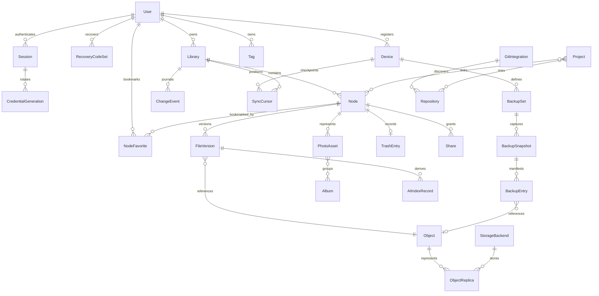

# Synveil canonical domain model

Status: **SKELETON_IMPLEMENTED — initial canonical entities and invariants are validated; the PostgreSQL canonical schema, explicit SQLx mappings, authenticated logical node metadata workflows, persisted upload-session/verified-replica subset, and exact-offset HTTP upload transport are IMPLEMENTED; download and broader content protocols remain PLANNED**

This document owns the canonical meanings, fields, relationships, lifecycle
states, and transaction invariants of Synveil domain entities. It does not
prescribe a physical table layout or adapter implementation. Database
migrations and OpenAPI schemas may add representation detail, but they must
not redefine these semantics.

When this document conflicts with an accepted ADR, the ADR wins and this file
must be reconciled before implementation. See
[CONTRIBUTING_ARCHITECTURE.md](CONTRIBUTING_ARCHITECTURE.md) for authority and
change procedure.

## Modeling conventions

### Identity and common fields

- Every public domain ID is an opaque UUIDv7 serialized as a lowercase
  hyphenated string. Clients must not derive creation time, authorization,
  location, shard, storage path, or ordering from it.
- Database-internal numeric keys may exist for indexing but are never a public
  identity or authorization credential.
- UTC instants use RFC 3339 with sufficient precision to round-trip. A local
  capture time and UTC offset, where known, are stored separately rather than
  rewriting history from a later timezone guess.
- Mutable resources carry an integer `revision` that increments on each
  externally observable mutation. Its API representation supplies a strong
  metadata ETag. Immutable resources use their immutable ID/revision in an
  ETag, not a storage path.
- Fields named `created_at`, `updated_at`, and `deleted_at` are server-observed
  instants. A client-origin time is separately named and treated as untrusted
  metadata.
- User-provided display names are Unicode strings with bounded encoded length.
  Their comparison key is server-derived; it never doubles as a filesystem or
  object-store key.
- Hashes use an algorithm-qualified form. The initial canonical plaintext
  integrity hash is `sha256:<lowercase-hex>`.
- Enumerated values are uppercase ASCII in stored and API contracts. Unknown
  future values must cause a deliberate compatibility response, not accidental
  fallback to a destructive state.

Unless an accepted ADR introduces organizations, a `User` is the top-level
principal and ownership boundary. `Library` is the sync journal and policy
boundary. A deduplication domain is explicitly identified and cannot be
inferred from equal hashes.

### Logical topology



The diagram shows semantic relationships, not a prescribed table layout.
Many-to-many associations require explicit join records with ownership,
timestamps, and auditability.

## Identity and security domain

### `User`

Purpose: human account and principal boundary.

Canonical fields:

- `id`;
- `username` or login identifier plus a normalized uniqueness key;
- optional display name and verified contact/recovery attributes;
- `status`: `PENDING`, `ACTIVE`, `LOCKED`, or `DISABLED`;
- password-credential reference using a vetted Argon2id implementation and
  versioned tunable parameters, never a plaintext or reversible password;
- `is_instance_admin`;
- `session_epoch` for bulk credential invalidation;
- `created_at`, `updated_at`, and `revision`.

Invariants:

- Login identifiers are unique under the chosen normalization policy.
- Disabled users cannot create sessions or mutate resources. Retained data is
  not silently purged by disabling an account.
- Administrator privilege is explicit and audited; ownership is not inferred
  from it.

### `Session`

Purpose: independently revocable authentication grant.

Canonical fields:

- `id`, `user_id`, optional `device_id`, and optional user-visible grant label;
- `kind`: `WEB`, `API`, or `DEVICE`;
- `status`: `PENDING`, `ACTIVE`, `REVOKED`, or `EXPIRED`;
- explicit scopes appropriate to the grant kind;
- issued, last-used, absolute-expiry, idle-expiry, revoked instants;
- `user_session_epoch` snapshot;
- for `WEB` only, the hash/keyed verifier of the browser refresh secret and its
  rotation lineage/generation;
- coarse client metadata appropriate for security review, not an invasive
  fingerprint.

For `WEB`, only the refresh verifier—not its raw secret—is stored on `Session`.
For `API` and `DEVICE`, `Session` is the family aggregate and stores no direct
credential verifier or generation; every verifier and lineage field belongs to
the child `CredentialGeneration`. Browser refresh atomically consumes the old
refresh credential and issues the next one. This browser flow is deliberately
not transparently retryable after an ambiguous response: reuse of the consumed
credential atomically sets the `Session` to `REVOKED`, invalidates every
non-terminal credential in that family, records safe audit reason
`REFRESH_REPLAY_DETECTED`, and requires the user to log in again. No separate
quarantine state exists. That fail-closed rule distinguishes an unknown lost
response from pretending a replay is safe. Session possession never replaces
per-resource authorization.

The public `ApiGrant` representation is not a second authorization aggregate:
it is exactly a `Session` whose kind is `API`, and `grant_id` equals that
`Session.id`. Each `API` or `DEVICE` grant family has child
`CredentialGeneration` records with grant/session ID, monotonic generation,
verifier, status (`PENDING`, `ACTIVE`, `RETIRED`, `REVOKED`, or `EXPIRED`),
issue/activation/retirement/expiry times, and last-use evidence. At most one
generation is `ACTIVE` and one is `PENDING`. Initial activation changes both
the pending generation and grant to `ACTIVE`; rotation activation changes the
old generation to `RETIRED`, the candidate to `ACTIVE`, and leaves the grant
`ACTIVE`. Thus `RETIRED` is a credential-generation status, not a
`Session.status` value.

Creation or rotation first stores one bounded `PENDING` generation and returns
its raw secret exactly once. During rotation the previous `ACTIVE` generation
remains valid until activation. A lost one-time response therefore expires or
is replaced as an unusable pending secret rather than leaving an unknown
active credential. Requested scopes cannot exceed the owner's grantable scope
and never bypass per-resource authorization. Revoking the `Session` is the one
authoritative grant-family revocation: it atomically sets the grant and every
non-terminal generation to `REVOKED`.

A device bearer family is exactly one `Session` with kind `DEVICE` whose
`device_id` points to the `Device`; the device ID and session ID remain distinct.
It uses the same pending-generation activation and rotation rules. The Device
endpoint, rather than the generic Session endpoint, is the authoritative
revocation surface and atomically revokes the device, its credential family,
and every remaining generation.

### `RecoveryCodeSet` and `RecoveryTransaction`

Purpose: self-hosted recovery without retaining a recoverable copy of a code
or silently depending on hosted email.

- A `RecoveryCodeSet` has ID, user ID, generation, state (`PENDING`, `ACTIVE`,
  `RETIRED`, or `EXPIRED`), creation/activation/expiry instants, revision, and
  individually salted/keyed code verifiers with consumed instants. Raw codes
  are returned exactly once and are never stored.
- Creating a replacement first creates one bounded `PENDING` set; the existing
  `ACTIVE` set remains valid until the authenticated user confirms the new
  codes were saved and atomically activates the candidate. A new-key issuance
  atomically expires/replaces any older pending candidate while preserving the
  active set. A lost generation response therefore leaves an unusable candidate
  that can be replaced instead of disabling the last known recovery path.
- A `RecoveryTransaction` stores only a verifier, user/purpose, referenced code
  verifier ID, state (`PENDING`, `CONSUMED`, or `EXPIRED`), short expiry,
  attempt/rate-limit correlation, and consumed instant. Code exchange validates
  and reserves an active unused code. A serialized retry atomically changes any
  older transaction for that code from `PENDING` to `EXPIRED`, releases/rebinds
  its reservation to one new `PENDING` transaction, and returns the new secret
  once; it does not consume the code yet.
- If that response is lost, retrying with the same code invalidates the prior
  pending transaction through that exact `PENDING` → `EXPIRED` transition and
  issues a new one in the same transaction. Timeout expiry releases the
  reservation, so an unreachable transaction cannot consume the user's last
  recovery code. Attempts are serialized and strictly rate-limited.
- Activating a replacement code set atomically retires the old set and expires
  every pending `RecoveryTransaction`/reservation that references it. Password
  reset revalidates that the referenced code set/generation is still `ACTIVE`
  in the consume transaction; retiring a set therefore revokes a stolen code's
  unfinished recovery attempt.
- Password reset atomically consumes both the current recovery transaction and
  its referenced code, changes the Argon2id credential, increments the
  canonical `session_epoch`, invalidates every `WEB`, `API`, and `DEVICE`
  credential grant, changes every affected non-revoked `Device` to `PAUSED`,
  and records audit. Device records and data remain. Owner-driven re-enrollment
  binds a fresh pending `DEVICE` Session/generation to the paused device while
  the old family remains `REVOKED`; activation restores the device to `ACTIVE`.
  No operating-system wipe is claimed.

### `Device`

Purpose: user-visible client identity and policy attachment point.

Canonical fields:

- `id`, `owner_user_id`, display name;
- platform and application/protocol versions;
- declared capability set, credential-family `Session.id`, and current
  credential-generation reference, never a raw credential;
- `status`: `PENDING`, `ACTIVE`, `PAUSED`, or `REVOKED`;
- last-seen, last successful sync, and last successful backup instants;
- created, updated, revoked instants and `revision`.

Capability declarations are input to negotiation, not trusted proof of
security. Registration creates the `Device` in `PENDING` without a usable
credential. Initial credential issuance creates a bounded pending generation
whose raw secret is displayed once; only explicit activation changes the
generation, credential family, and device to `ACTIVE`. Rotation leaves the old
active generation valid until a saved pending replacement is activated. A lost
issuance response therefore leaves no unknown usable device secret. Revocation
atomically invalidates the family/generations and future API access. It does not
prove that downloaded data was erased.

## Storage and namespace domain

### `Library`

Purpose: ownership/policy boundary and one ordered synchronization journal.

Canonical fields:

- `id`, `owner_user_id`, name;
- root `Node` ID;
- `dedup_domain_id`;
- transactionally incremented `sync_head`;
- `journal_epoch` and minimum retained sequence;
- an internal namespace-mutation guard/structural revision used to order short
  `Node` commits in the initial correctness profile;
- quota/policy references;
- `status`: `ACTIVE`, `READ_ONLY`, `QUARANTINED`, or `DELETING`;
- timestamps and `revision`.

Every `Node`, `ChangeEvent`, cursor, share origin, and library-scoped mutation
belongs to exactly one library. A sequence is meaningful only with its library
and epoch.

### `Node`

Purpose: user-visible file or directory identity.

Canonical fields:

- `id`, `library_id`, nullable `parent_node_id` for the single root;
- `kind`: `FILE` or `DIRECTORY`;
- original `name` and server-derived `name_key`;
- for a file, nullable `current_version_id` while an upload has not committed;
- `state`: `ACTIVE`, `TRASHED`, or `PURGING`;
- metadata revision, created/updated instants, and creator/last-actor IDs.

A directory also exposes a server-issued opaque subtree precondition for
recursive destructive commands. The initial representation is resolved by
`SYNC.md` OD-SYNC-004; clients must not derive it from the ordinary metadata
revision.

Invariants:

- A library has exactly one directory root. The root has no parent and cannot
  be moved, trashed, or shared as a public write root unless separately
  specified.
- Each active parent/name-key pair is unique under the accepted name policy.
- A file has no children. A directory's ancestry must be acyclic and remain in
  one library.
- Rename and move mutate `Node` metadata; they do not modify `FileVersion` or
  relocate an `Object`.
- A content mutation changes `current_version_id` and node revision in the same
  transaction that creates the version and journal event.
- In the initial correctness profile, every short transaction that mutates a
  `Node` takes the per-library namespace guard before domain rows and the late
  `sync_head` lock. This gives directory move and recursive Trash a definite
  order against descendant edits without holding a lock during byte upload.

### `NodeFavorite`

Purpose: the current user's personal bookmark for a file or directory. A
favorite is not owner-wide `Node` metadata and is never inherited by another
member or share recipient.

Canonical fields and invariants:

- `user_id`, `library_id`, `node_id`, server creation/update instants, and a
  relation `revision`; `(user_id, node_id)` is unique;
- the referenced node and library must agree, but the relation never grants
  node access, retains a version/object, changes node revision, or creates a
  library `ChangeEvent`;
- reads always re-authorize the node for the current user, so revoked access is
  hidden immediately and cleanup may remove the now-inaccessible relation
  without exposing whether another user's node still exists;
- a favorite may survive `TRASHED` state so an authorized restore preserves
  the preference, but the normal Favorites view returns only readable
  `ACTIVE` nodes; logical purge removes the relation;
- create/remove are desired-state, idempotent preference mutations. The
  relation ETag supports conditional clients, an idempotency key recovers a
  lost response, and concurrent opposing requests resolve by server commit
  order only for this non-content preference.

### Recent node projection

“Recent” means caller-readable nodes most recently changed by a committed
create, content update, rename, move, restore, or other visible metadata
mutation. It is a derived query, not a stored recently-viewed history: reading,
previewing, or downloading a node does not create tracking state.

The projection orders by server-observed node update instant plus immutable
node ID, uses an initial `as_of` watermark in its opaque keyset cursor, and
optionally filters one authorized library. Mutations after that watermark
appear on refresh rather than moving rows inside an existing traversal. Every
page re-authorizes each node; inaccessible or `TRASHED`/`PURGING` nodes are
omitted immediately, and a shared result exposes no unreadable ancestor path.
The projection grants no access, creates no retention reference or
`ChangeEvent`, and does not claim to be an audit history.

### `FileVersion`

Purpose: immutable record binding one file revision to one canonical object.

Canonical fields:

- `id`, `library_id`, `node_id`, `object_id`;
- nullable `parent_version_id` and nullable `conflict_base_version_id`;
- logical byte length, canonical hash, declared/detected media type;
- client modification time plus server commit time;
- actor device/user, source type (`UPLOAD`, `SYNC`, `RESTORE`, `BACKUP_RESTORE`,
  or `SYSTEM_IMPORT`);
- optional conflict group/reason;
- immutable creation metadata.

A restore creates a new version whose source points to the selected historical
version; it never makes old history mutable. Equal objects may be reused only
inside the same allowed dedup domain.

### `Object`

Purpose: immutable canonical plaintext content identity and logical lifecycle
metadata inside one dedup domain. It is not a user-visible file or a physical
backend representation; one or more `ObjectReplica` records materialize it.

Canonical fields:

- `id` and `dedup_domain_id`;
- canonical plaintext hash and length;
- `state`: `STAGING`, `VERIFIED`, `QUARANTINED`, or `DELETING`;
- durability/verification instants and last verification result;
- creation time and garbage-collection eligibility time.

An `Object` becomes referenceable only in `VERIFIED`. Hash equality is
confirmed against length and verified bytes; a collision or mismatch is
quarantined rather than aliased. Stored reference counts may be cached for
performance but deletion eligibility is derived from authoritative live
references plus leases and a safety window.

### `StorageBackend`

Purpose: configured object-store adapter and failure boundary.

Canonical fields:

- `id`, type (`LOCAL_FS`, `S3_COMPATIBLE`, `MINIO`, or future registered type);
- non-secret configuration reference and secret reference;
- namespace/prefix owned by Synveil;
- `status`: `ACTIVE`, `READ_ONLY`, `DEGRADED`, `OFFLINE`, or `RETIRED`;
- capability/version declaration, health timestamps, and `revision`.

Backend configuration never exposes credentials through normal reads. A
backend cannot be retired while it is the sole verified location of referenced
objects. Adapter migration is a verified copy-and-switch workflow, not an
in-place storage-key rewrite.

### `StorageCapabilities`

Purpose: versioned evidence about what a configured `StorageBackend` can safely
accelerate or guarantee.

This is a capability value/contract associated with `StorageBackend`, not a
second source of storage truth. It may declare `reflink`, `block_clone`,
`copy_on_write_clone`, `native_snapshot`, `compression`, `checksumming`,
`sparse_files`, `atomic_rename`, `durable_fsync`, `range_reads`, and
`filesystem_health`, together with probe/version evidence and limitations.
Application logic may select an optimization only after the adapter proves the
capability. It must retain a portable correctness path when a capability is
absent. Btrfs or WinBtrfs is never a required state for a backend or library.

### `ObjectReplica` and `ObjectLease`

These internal records are separate concepts even if an initial deployment
stores only one replica:

- `ObjectReplica` binds an object to `storage_backend_id` and opaque
  `storage_key`; representation codec/parameters/version, encryption
  scheme/key reference when applicable, stored length and independent
  stored-byte checksum; backend version evidence; state (`COPYING`,
  `VERIFIED`, `MISSING`, `CORRUPT`, `DELETING`); and verification evidence.
- `ObjectLease` protects staging, active download/assembly, restore, or
  migration work from garbage collection until a bounded expiry.

They let tiering and backend migration evolve without changing `Object`
identity. Leases are not a substitute for durable references and must expire.

## Upload domain

### `UploadSession`

Purpose: resumable, idempotent staging workflow that is not visible as a file
version until commit.

Canonical fields:

- `id`, owner user/device, target library and target node/parent intent;
- operation type (`CREATE_FILE` or `REPLACE_CONTENT`);
- expected total length, optional expected canonical hash, media/name metadata;
- required base node revision or base version;
- negotiated part constraints;
- `state`: `OPEN`, `VERIFYING`, `COMMITTING`, `COMMITTED`, `FAILED`,
  `EXPIRED`, or `ABORTED`;
- nullable cancel-request actor/instant and lease generation;
- expiry, created/updated instants;
- completion idempotency key and committed node/version outcome when present.

State transitions use row-level concurrency control or equivalent compare and
swap. Only one completion outcome can win. Retrying a committed completion
returns the stored outcome; it does not append a second version or event.
`VERIFYING` contains persisted internal recovery phases such as `ASSEMBLING`,
`HASHING`, `FINALIZING`, and `READBACK_VERIFY`; these are not alternate public
states. A generation-checked cancel can move `OPEN`, `VERIFYING`, or
pre-logical-commit `COMMITTING` to `ABORTED`. The logical commit transaction
rechecks state, lease generation, and cancel intent under the session lock; if
it commits first, `COMMITTED` wins and cancellation cannot undo the version.

### `UploadPart`

Purpose: one verified range or numbered part in a session.

Canonical fields:

- upload session ID and stable part number/range;
- declared and observed length;
- checksum algorithm/value;
- opaque staging locator;
- `state`: `PENDING`, `RECEIVING`, `VERIFIED`, or `REJECTED`;
- idempotency fingerprint and timestamps.

Parts may arrive out of order when negotiated. An identical retry is accepted;
a request that reuses a part identity with different bytes is a conflict.
Overlaps, gaps, total overflow, excessive part count, and expired sessions are
rejected before assembly.

## Synchronization domain

### `ChangeEvent`

Purpose: durable committed fact required for clients to advance state.

Canonical fields:

- `library_id`, transactionally allocated `sequence`, `journal_epoch`;
- event ID, event kind, subject node ID;
- resulting node revision and version ID where applicable;
- minimal parent/name/state projection needed to apply or invalidate a cache;
- actor user/device, server commit time;
- causal/idempotency correlation and schema version.

The unique key is (`library_id`, `journal_epoch`, `sequence`). Sequence order is
commit order for one library, not wall-clock or cross-library order. An event
is appended in the same PostgreSQL transaction as its domain mutation.

### `SyncCursor`

Purpose: opaque server token representing a journal position and epoch for a
client/library.

The decoded server-side claims include token version, library ID, epoch,
last-delivered sequence, and integrity protection. A persisted device
checkpoint may additionally record device ID, acknowledgement sequence, and
last contact.

Clients treat a cursor as opaque, cannot increment or manufacture it, and must
not use it as authorization. Cursors for the wrong user/library/epoch or below
retention are rejected with a directed rescan response.

### Conflict representation

For concurrent edits based on version `v4`:

```text
server head v4
├── Device A commits v5A from v4 -> original Node head
└── Device B submits v5B from v4 -> deterministic sibling conflict-copy Node
```

The server never overwrites `v5A` with `v5B`. It creates a sibling conflict
`Node` with a deterministic non-clobbering name, binds `v5B` to it, retains the
common base/correlation, and appends the required journal facts. Replaying the
same client mutation returns that conflict copy rather than creating another.
Metadata-only conflicts return current state for client rebase. Exact naming
and event fixtures are owned by [SYNC.md](SYNC.md), but may not replace this
accepted conflict-copy behavior with last-writer-wins or an unexposed version.

## Backup domain

### `BackupSet`

Purpose: device-scoped definition of protected sources and retention policy.

Canonical fields:

- `id`, owner user, source device;
- display name, source descriptors with client-stable opaque source IDs;
- include/exclude rules and symlink policy;
- schedule/continuous mode;
- retention-policy reference;
- `status`: `ACTIVE`, `PAUSED`, `DEGRADED`, or `RETIRED`;
- last observation/success, timestamps, and `revision`.

A source descriptor is not trusted as a server path and does not grant access
outside the client-selected source.

### `BackupSnapshot`

Purpose: immutable committed manifest view for one backup set.

Canonical fields:

- `id`, `backup_set_id`, source device;
- parent snapshot ID when incremental;
- `state`: `BUILDING`, `VERIFYING`, `COMMITTED`, `FAILED`, or `EXPIRED`;
- scan start/end and server commit instants;
- manifest format/version, root hash, entry count, logical/unique byte counts;
- consistency class (`FILESYSTEM_CONSISTENT`, `CRASH_CONSISTENT`, or
  `BEST_EFFORT`), completeness, and client/software metadata;
- retention deadline/legal hold where applicable.

Only `COMMITTED` snapshots are restorable. Snapshot commit atomically records
the complete verified manifest references and durable follow-up work. A
`BUILDING` or `FAILED` snapshot may protect staging objects only through
bounded leases.

### `BackupEntry`

Purpose: one immutable manifest entry, not a live `Node`.

Canonical fields:

- snapshot ID, stable entry ID, parent entry ID;
- type (`FILE`, `DIRECTORY`, `SYMLINK`, or explicitly supported type);
- original relative name/path components as untrusted metadata;
- file object/version reference, size, canonical hash, timestamps, and bounded
  portable metadata;
- capture result (`PRESENT`, `UNCHANGED`, `UNREADABLE`, `EXCLUDED`, or
  `MISSING_OBSERVATION`) with error classification.

An absent entry in a later snapshot does not mutate a library node and does not
retroactively remove it from an earlier retained snapshot.

### Restore operation

A restore is a durable operation record with source snapshot/version, explicit
destination, collision policy, actor, state, per-entry results, byte/hash
verification, and idempotency key. Partial completion is visible and
restartable; “successful” means every required result is verified or an
explicitly accepted skip is recorded.

## Sharing, trash, and policy domain

### `Share`

Purpose: revocable authorization grant over a node/subtree.

Canonical fields:

- `id`, owner/grantor, origin library/node;
- grantee user ID for private shares or hashed random-secret verifier for
  public links;
- permission (`READ` or `WRITE`) and whether it includes descendants;
- optional password verifier, expiry, access limits, created/revoked instants;
- `status`: `PENDING`, `ACTIVE`, `REVOKED`, or `EXPIRED`; revision and audit
  correlation.

A share never grants direct `Object` access independently of an authorized
download decision. Moving a node within its allowed library preserves its
identity; moving or copying across ownership boundaries requires explicit
share behavior and cannot silently broaden access.

Private-share discovery is an authorization-filtered view of `Share`, not a
client-maintained ID list. An active private grant appears in the grantee's
“shared with me” collection with only a safe share-root `Node` projection;
ancestor paths the grantee cannot read, other grantees, object/replica locators,
and public-link secrets are excluded. The grantor's “shared by me” collection
may include pending, active, expired, or revoked grants under an explicit status
filter, but never returns a raw capability or password. Expiry/revocation removes a
grant from grantee discovery immediately at authorization time even if cleanup
or a previously issued page cursor lags. Discovery itself does not retain
content or broaden the underlying grant.

A public-link secret has at least 128 bits of cryptographic randomness before
encoding. Creation stores the public share as `PENDING` with only its keyed/
cryptographic verifier and returns the raw secret exactly once. A pending link
cannot authorize access; explicit owner activation changes it to `ACTIVE`
after the capability is saved. If the response is lost, idempotency replay
returns only safe candidate metadata. The inert candidate must be revoked, then
a new share created with a new key—raw capability material is never stored,
replayed, listed, or logged. Private user grants may be created directly as `ACTIVE` because they
carry no one-time bearer secret.

### `TrashEntry`

Purpose: deletion context and retention deadline for a trashed node.

Canonical fields:

- node ID and library ID;
- former parent/name projection;
- deletion actor/device, deletion sequence and time;
- scheduled purge time, restore policy, and optional subtree operation ID.

Restoring is conditional because the former parent or name may now conflict.
Purge is irreversible at the logical layer but physical bytes remain until all
other authoritative references and safety windows are cleared.

### Policy and quota

Policy records are versioned and attached explicitly to a user, library,
device, backup set, or share. Effective-policy resolution is deterministic and
auditable. Quota reservations cover staging and commit races; logical,
retained, staged, and physical bytes are reported separately.

## Photos domain

### `PhotoAsset`

Purpose: photo-specific projection over one or more canonical file resources.

Canonical fields:

- `id`, owner/library, primary node and source file-version IDs;
- media kind (`IMAGE`, `VIDEO`, `LIVE_GROUP`);
- capture instant, original UTC offset, metadata confidence/source;
- dimensions, duration/orientation where safely extracted;
- favorite flag, screenshot classification and provenance;
- processing state (`PENDING`, `READY`, `PARTIAL`, `FAILED`, or `STALE`);
- source device and device-scoped import identity where supplied;
- timestamps and `revision`.

The asset does not own or rewrite original bytes. A new current
`FileVersion` makes derived data stale until reprocessed. Location and face
data are sensitive derived metadata with separate policy.

### `PhotoResource` and `PhotoDerivative`

- `PhotoResource` associates a role (`PRIMARY_IMAGE`, `MOTION_VIDEO`,
  `DEPTH`, or future registered role) with a node/version, allowing
  Live-Photo-like grouping without losing originals.
- `PhotoDerivative` records source version, kind/size, derivative object,
  generator and parameters, state, and integrity. It is replaceable and never
  becomes the canonical original.

### `Album` and membership

`Album` has ID, owner, title, type (`MANUAL` or a future saved query), cover
reference, timestamps, and revision. Membership is an ordered explicit join
with added-at/actor fields. Removing membership never deletes the asset.

### `Tag` and assignment

`Tag` has ID, owner, normalized name key, display label, optional color, and
revision. An assignment links a tag to a subject with provenance `USER`,
`SYSTEM`, or `AI`, confidence only when meaningful, model/rule reference, and
review state. User edits are not overwritten by reindexing.

[PHOTOS.md](PHOTOS.md) owns ingestion, privacy, duplicate, derivative, and
client behavior.

## Integration and workspace domain

### `GitIntegration`

Purpose: configured connection to an external Git service.

Canonical fields:

- `id`, owner, provider type (`FORGEJO` initially);
- canonical base URL plus separately stored secret reference;
- provider installation/account identity;
- requested and verified capability scopes;
- `status`: `PENDING`, `ACTIVE`, `DEGRADED`, `REAUTH_REQUIRED`, `PAUSED`, or
  `REVOKED`;
- last successful poll/webhook, health summary, timestamps, and revision.

URLs and credentials are security-sensitive. Integration records do not make
Synveil the authority for Git permissions.

### `Repository`

Purpose: cached external-repository identity and backup subject.

Canonical fields:

- `id`, integration ID, immutable provider repository ID;
- owner/name/full-name display metadata and canonical provider URL;
- visibility as last observed, default branch, archived state;
- last observed provider revision/updated time;
- sync health and freshness;
- timestamps and revision.

Provider metadata is stale when Forgejo is unreachable and must say so.
Possession of cached metadata does not grant repository access.

### `RepositoryBackup`

Purpose: immutable verified repository recovery point, distinct from a device
`BackupSnapshot`.

Canonical fields:

- `id`, repository ID, state (`BUILDING`, `VERIFYING`, `COMMITTED`,
  `INCOMPLETE`, `FAILED`, or `EXPIRED`);
- capture start/end, provider identity/version;
- consistency class and observed refs;
- versioned manifest/root hash;
- references to Git data, Git LFS, supported release artifact objects and
  per-component results;
- retention and verification evidence.

Only `COMMITTED` backups satisfying their declared consistency class are
offered as complete restores. `INCOMPLETE` records may be retained for
diagnostics but are not mislabeled.

### `Project`

Purpose: optional workspace linking independently owned subjects.

Canonical fields:

- `id`, owner, name, description;
- status, timestamps, and revision.

Typed link records connect a project to repositories, library nodes, backup
sets/snapshots, devices, and metadata. A link does not transfer ownership,
broaden permissions, change retention, or cascade-delete its target.

[CODE_INTEGRATION.md](CODE_INTEGRATION.md) owns provider, backup, restore,
webhook/polling, and project-link behavior.

## AI-derived domain

### `AIIndexRecord`

Purpose: replaceable derived index unit tied to an immutable source revision.

Canonical fields:

- `id`, owner and authorization scope;
- source type/ID and immutable source revision or version;
- modality and chunk/region locator;
- pipeline, extractor, model, model-license, and configuration versions;
- inference mode (`LOCAL` or `REMOTE`) and consent/policy revision;
- content hash/fingerprint of the indexed input;
- status (`PENDING`, `READY`, `FAILED`, `STALE`, `DELETING`);
- derived text/tag/vector references, sensitivity classification;
- attempt/error class, created/updated/indexed/expires instants.

The record is never canonical user data. Search authorization is evaluated
against current source access, not only a stale ACL snapshot in the index.
Deletion, share revocation, source-version change, model change, or consent
change invalidates or removes affected derived records under
[AI.md](AI.md).

### `AIJob`

An asynchronous, at-least-once job carries an idempotency identity based on
pipeline + immutable source version + configuration version. It has bounded
attempts, lease, next-attempt time, safe error class, and terminal/dead-letter
state. A poison input cannot block unrelated indexing.

## Audit and asynchronous delivery domain

### `AuditEvent`

Purpose: append-only security and material-operation fact.

Canonical fields:

- event ID, server time, actor user/session/device or system actor;
- action, target type/ID, library/owner scope;
- outcome and stable reason code;
- request/correlation ID and coarse network/client context allowed by policy;
- redacted structured details and schema version.

Audit records never contain passwords, bearer tokens, public-link secrets,
object-store credentials, raw file content, embeddings, or full sensitive
paths unless an explicit audited policy requires a bounded representation.
Audit retention and administrator access are separate policy decisions.

### `OutboxEvent`

Purpose: durable delivery of follow-up work after a committed core mutation.

Canonical fields:

- ID, aggregate type/ID/revision, event type and schema version;
- transaction commit time, redacted payload/reference;
- availability time, attempt/lease state, delivered/terminal timestamps.

It is inserted in the same PostgreSQL transaction as the mutation. Consumers
are idempotent and delivery is at least once; “delivered” never means every
external side effect is exactly once. An optional consumer outage only
increases lag.

## Atomicity and consistency invariants

The following groups are single PostgreSQL transactions:

| Mutation | Required atomic metadata effects |
|---|---|
| Content commit | Verify the durable receipt; select or create the canonical `Object`; create or attach a verified `ObjectReplica` binding the backend, key, and representation; create `FileVersion`; create/update the `Node` head; reserve/finalize quota; append `ChangeEvent`, `AuditEvent`, and `OutboxEvent`; store the idempotent outcome. |
| Rename or move | Take the namespace guard; validate authorization/name/acyclic ancestry and expected revision; mutate node; append change, audit, outbox, and idempotent outcome. |
| Trash or restore | Take the namespace guard; validate node revision and the server-issued subtree precondition for recursive actions; mutate node state and `TrashEntry`; append change/audit/outbox; restore may resolve a name/parent conflict only by explicit policy. |
| Share mutation | Mutate grant/revision and append audit/outbox. Share revocation is checked at request time. |
| Backup snapshot commit | Transition verified complete manifest to `COMMITTED`, finalize authoritative object references/accounting, record audit/outbox and idempotent outcome. |
| Repository backup commit | Record consistency class, complete component manifest, verified object references, audit/outbox, and one terminal outcome. |

PostgreSQL cannot roll back a filesystem or S3 write. The safe protocol is:

1. create an opaque staging object and bounded lease;
2. stream bytes with size/quota limits;
3. durably finalize and verify the object;
4. commit all logical references and events in PostgreSQL;
5. on database failure, leave an unreferenced object for delayed,
   safety-windowed reconciliation;
6. on lost response, return the stored result for the same idempotency key.

Garbage collection never relies solely on age or a mutable reference counter.
It enumerates authoritative references, leases, object state, retention/legal
hold, and a minimum safety delay; deletion is two-phase and auditable.

## Authorization and privacy boundaries

- A principal is authorized by authenticated identity, owner/library
  relationship, share grant, role, and current policy. An opaque ID, hash,
  cursor, cached repository row, or object key is never sufficient.
- Queries scope by ownership before pagination and aggregation. Counts, timing,
  quota savings, dedup hits, search scores, and error differences must not leak
  another user's data.
- Public links map a random secret to a bounded `Share` and still enforce
  expiry, password, scope, rate limit, and revocation.
- Backup, photo, AI, and repository-derived metadata inherits the source's
  sensitivity and cannot silently acquire broader project or album access.
- Storage adapters receive opaque keys and bytes, not user paths. AI remote
  providers receive content only under explicit mode/policy/consent.
- Deleting a user-facing reference may leave retained versions, snapshots,
  verified repository backups, or audit facts. The UI and erasure workflow
  disclose each retention domain rather than claiming immediate physical
  erasure.

## Required failure behavior

| Case | Domain outcome |
|---|---|
| Two completions race | One `UploadSession` terminal outcome wins; equivalent retry returns it, conflicting request returns `completion_conflict`. |
| Object write succeeds and DB transaction fails | No visible version exists. Object is unreferenced, leased/safety-windowed, and reconciled later. |
| DB commits and API response is lost | Idempotency lookup returns the original IDs/revisions; no duplicate journal event. |
| Object later fails verification | The affected `ObjectReplica` becomes `CORRUPT` or `MISSING`; the `Object` becomes `QUARANTINED` only if no trustworthy replica remains. References stay known, reads fail safely, and recovery seeks another verified replica or backup. |
| Directory move races with descendant move | Transactional ancestry guard/serialization prevents a cycle; one operation retries or conflicts. |
| Cursor is outside retained history | Cursor is rejected; client obtains an authoritative paginated snapshot and new server checkpoint. |
| Backup input disappears | New snapshot records observation under policy; older snapshot references remain until retention expires. |
| Share is revoked while download is in progress | New authorization and range requests fail. Already delivered bytes cannot be recalled; implementation defines whether an active stream is terminated without claiming erasure. |
| AI or photo processing repeats | Idempotency key/source-version uniqueness replaces or returns the same derived record; originals are unchanged. |
| Forgejo identity is reused or renamed | Match the immutable provider repository ID, not display path; a destructive restore requires fresh provider identity and explicit confirmation. |

## Bounded open decisions

OPEN DECISION OD-DOM-001: filename comparison and normalization
Owner: Architecture / Storage / Sync
Needed by: Phase 1 schema and namespace contract gate
Options: byte-preserving names with case-sensitive NFC comparison key; platform-neutral case-insensitive comparison key; per-library comparison policy fixed at creation
Recommendation: preserve the original Unicode display name and use one immutable portable case-insensitive comparison key initially; keep the exact Unicode normalization/case-fold algorithm and version open until the fixture suite selects it
Decision evidence: cross-platform fixture suite covering Unicode normalization, case collisions, reserved names, and round-trip behavior

OPEN DECISION OD-DOM-002: initial multi-user ownership model
Owner: Architecture / Security / Product
Needed by: Phase 3 trusted-access and sharing schema gate
Options: user-owned libraries with node shares only; explicit owner plus library membership; first-class household/team organization
Recommendation: use an explicit owner plus membership model with no cross-owner deduplication, while deferring enterprise organizations; Phase 1 may begin owner-only but cannot encode assumptions that prevent membership
Decision evidence: product requirements and threat review for administration, offboarding, quotas, and shared ownership

OPEN DECISION OD-DOM-003: metadata ETag encoding
Owner: Architecture / API
Needed by: Phase 1 reviewed OpenAPI gate
Options: quoted opaque token from resource ID and revision; signed representation token; server-stored random version token
Recommendation: a quoted opaque encoding of resource kind, ID, and revision protected from client manufacture; never expose SQL transaction IDs
Decision evidence: conditional-request contract tests, proxy compatibility tests, and information-leak review

OPEN DECISION OD-DOM-004: active-stream behavior after authorization revocation
Owner: Security / API / Storage
Needed by: Phase 3 sharing gate
Options: terminate an active response when revocation is observed; authorize once per bounded response; short-lived signed internal read lease with byte/time cap
Recommendation: authorize each request and range request, cap stream duration, and document that already delivered bytes cannot be recalled; evaluate termination only if reliable across adapters
Decision evidence: threat review, streaming implementation test, and user-expectation review
