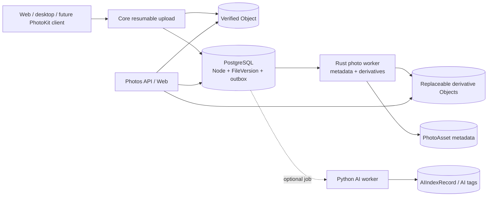

# Photos architecture

Status: **PLANNED subsystem blueprint**

Synveil Photos is a replaceable media projection over canonical files. It is
not an independent storage silo and this document does not claim an
implementation exists. Originals use the same upload, integrity, version,
authorization, retention, and object-store contracts as every other file.

Canonical entity fields are defined in [DOMAIN_MODEL.md](DOMAIN_MODEL.md); API
shapes are planned in [API_ARCHITECTURE.md](API_ARCHITECTURE.md). Storage,
sync, and backup behavior remain governed by [STORAGE.md](STORAGE.md),
[SYNC.md](SYNC.md), and [BACKUP.md](BACKUP.md).

Photos client projections follow the platform contract: Windows, macOS, Linux
Desktop, and Linux Server are first-class host boundaries where the relevant
client or import workflow is supported; Android, iPhone, and iPad remain future
mobile targets with explicit background-transfer and photo-library capability
negotiation. No mobile or OS-specific behavior changes the canonical server
storage model.

## Scope and status

The following are `PLANNED`:

- original image and video preservation;
- automatic import from supported clients;
- asynchronous metadata extraction and safe thumbnails/previews;
- timeline, albums, favorites, screenshot and video filters;
- Live-Photo-like grouped resources;
- exact-duplicate suggestions;
- deterministic metadata search and optional AI-enriched search;
- source-device/import and backup state; and
- future PhotoKit/background-transfer integration.

The following are `EXPERIMENTAL` until separate privacy and quality gates pass:

- perceptual near-duplicate grouping;
- image captions and semantic similarity;
- face detection or recognition;
- object/scene classification beyond deterministic media metadata; and
- transcoded playback variants beyond bounded previews.

Face recognition is disabled by default and is not required by the planned
Photos product. Synveil is not a full media streaming/transcoding platform.

## Non-negotiable invariants

1. The original is a verified immutable `Object` referenced through
   `Node → FileVersion`. A photo processor never rewrites, strips metadata
   from, re-encodes, or replaces that original.
2. A `PhotoAsset` and every derivative are rebuildable projections. Their
   failure or loss cannot make the original unavailable.
3. Photo import success means the original resource versions committed, not
   that metadata, thumbnails, AI tags, or album suggestions finished.
4. Every derivative read reauthorizes against the current original/resource
   relationship. A derivative object ID, cached URL, album membership, or
   device import ID is not authorization.
5. Exact byte equality may reuse physical storage only inside the accepted
   deduplication domain. It does not collapse two user-visible assets unless
   the user explicitly chooses a logical cleanup.
6. Location, faces, captions, OCR, and device/capture context are sensitive
   metadata. They inherit the source access boundary and never silently leave
   the server.
7. Deletion semantics are explicit. Removing an album membership does not
   delete an asset; a missing backup/PhotoKit source does not automatically
   delete retained server content.
8. Optional Photos work is emitted through the transactional PostgreSQL
   outbox after the source mutation commits and is processed at least once by
   idempotent workers.

## Component boundary



The core Rust worker is the preferred owner of deterministic media probing,
safe EXIF extraction, and derivative generation. Python is reserved for
optional OCR/image understanding/embedding work. Neither worker receives
database, object-store, or integration credentials broader than its jobs
require.

## Canonical storage model

### Originals

Each imported resource has a normal `Node` and immutable `FileVersion`. A
`PhotoAsset` references the version(s) that define one user-visible media
asset:

- `PRIMARY_IMAGE` for a still image;
- `PRIMARY_VIDEO` for an ordinary video;
- `MOTION_VIDEO` paired with a still resource;
- `DEPTH` or another registered auxiliary role only when preserved; and
- a primary resource that determines display identity and timeline placement.

`PhotoResource` association is immutable for a source-version generation. If
the logical file receives a new current version, the existing projection
becomes `STALE` and a new version-bound processing generation is scheduled.
Historical projections may be retained only as needed for version history and
must never be mistaken for the current asset.

An import can keep multiple logical assets that reference the same immutable
`Object`. Physical deduplication is invisible to album membership, favorites,
capture metadata corrections, trash state, and audit history.

### Derivatives

A `PhotoDerivative` is keyed by:

```text
source FileVersion ID
+ derivative profile ID/version
+ generator name/version
+ generator configuration version
```

It records output object, pixel dimensions/duration, encoded byte size, media
type, stored checksum, generation state, and safe failure class. Profiles are
enumerated (for example `GRID_THUMBNAIL` and `SCREEN_PREVIEW`); arbitrary
client-requested dimensions do not create an unbounded image-resize service.

Derivative objects:

- use opaque storage keys;
- have independent integrity verification and lifecycle references;
- may be deleted/rebuilt without changing the source;
- never serve as backup proof for an original;
- never copy EXIF/location into output unless the profile explicitly requires
  and discloses it; and
- are authorized and audited according to source sensitivity.

An unsupported or failed derivative returns an explicit processing/fallback
state. The client may request the original only if authorized; it does not
receive corrupt or partially generated bytes labeled as a thumbnail.

## Ingestion contract

### Web and desktop import

1. The client initiates a normal resumable upload for every original resource,
   declaring total length, optional SHA-256, media metadata, destination, and
   base precondition.
2. Parts stream with bounded memory and individually verified checksums.
3. Completion durably verifies the `Object` and transactionally creates the
   `Node`/`FileVersion`, library `ChangeEvent`, audit record, and outbox work.
4. The client sends or includes a `photo import binding` that identifies
   source device, device-scoped import identity, resource role, capture hints,
   and grouping key. These values are untrusted metadata.
5. The binding transaction creates or returns one idempotent `PhotoAsset`
   generation and queues processing. The response may show `PENDING`.

A spoofed MIME type or filename extension never bypasses safe probing. Invalid
media can remain a canonical file while photo projection becomes `FAILED`.

### Import identity and retries

A source import identity is scoped to owner + device + client-library
generation. It is not globally unique, is not a hash, and is not trusted across
devices. The server binds an idempotency record to the complete material input:
source identity, role/group, and immutable version.

- Same identity and same version returns the prior asset/binding.
- Same identity with a new resource revision creates a new version-bound
  generation after an explicit client reconciliation step.
- Same bytes under another identity may remain a distinct logical asset.
- A lost binding response is recovered through the idempotency key or import
  status query; it never creates duplicate album membership.
- Unbound successfully uploaded files remain valid files and may be rebound;
  they are not garbage collected as failed photo imports.

### Live-Photo-like groups

A group is a `PhotoAsset` with multiple independently durable
`PhotoResource` values, not one opaque container. The client declares a
device-scoped group identity and roles. The server verifies supported
association metadata where available but does not assume every provider uses
Apple's representation.

Group state is:

- `PENDING` while required original uploads or association verification remain;
- `READY` when every required role is committed and readable;
- `PARTIAL` when at least one preserved original is usable but a declared role
  is missing/unsupported;
- `FAILED` only when no safe primary projection can be produced; or
- `STALE` when a referenced current version changed.

A partial group is visible with an honest warning and a retry path. Cleanup
does not delete a successfully committed still image merely because its motion
resource failed.

## Future Apple PhotoKit client

The future Apple client is `PLANNED` around PhotoKit, URLSession background
transfer, Keychain, Swift Concurrency, and platform-provided change
observation. The server contract must account for these platform constraints:

- The user may grant full, limited, or later-revoked photo-library access. The
  client uploads only assets PhotoKit currently permits and represents limited
  scope explicitly.
- A PhotoKit local identifier is device/library-scoped and may become invalid
  after library restoration or OS changes. It is a reconciliation hint, not a
  permanent server identity.
- The app cannot assume unrestricted filesystem paths or continuous
  background execution. It persists transfer/session mappings before
  scheduling and resumes after delayed callbacks, termination, network change,
  or device reboot.
- Background upload completion can arrive after credentials rotate or policy
  pauses. The client reauthorizes/reconciles before binding, while already
  committed bytes remain recoverable through the same idempotency identity.
- Original resources are requested through platform APIs at appropriate
  quality. An optimized/local preview must not be mislabeled as the original.
- iCloud-backed assets may require network retrieval by the OS and can be
  temporarily unavailable. Synveil reports `SOURCE_UNAVAILABLE` and retries
  under policy rather than treating absence as deletion.
- Edits in the Apple library may yield adjusted resources. The client records
  whether it is uploading an original or an edited rendition; Synveil does not
  silently replace one with the other.
- Live-photo still and motion resources upload independently and bind only
  after both terminal outcomes are known.

PhotoKit observation state is separate from the Synveil `SyncCursor` and
`BackupSnapshot`. A local PhotoKit deletion can be:

- a new source observation under photo-backup policy, preserving server history;
- an explicit user-issued Synveil delete under two-way policy; or
- ignored/excluded under an upload-only policy.

The client must never infer the destructive option from a missing local
identifier.

## Metadata extraction

### Provenance

Every extracted field records a source and confidence category:

- `EMBEDDED`: read from the committed media metadata;
- `CONTAINER`: derived from media/container structure;
- `CLIENT_HINT`: supplied by an authenticated but untrusted client;
- `FILESYSTEM_HINT`: supplied from a source file timestamp;
- `USER_CORRECTED`: explicit user override;
- `SYSTEM_RULE` or `AI`: replaceable classification.

User corrections are stored separately from original EXIF and win only in the
display projection. Reprocessing does not overwrite them. The original
metadata remains auditable/readable according to privacy policy.

### Capture time

The projection preserves:

- source local date/time, if present;
- explicit UTC offset/timezone evidence, if present;
- derived UTC instant only when enough evidence exists;
- fallback server/client time and its provenance; and
- user correction with revision.

The server never silently assumes its own timezone for a photo whose EXIF lacks
an offset. Timeline sorting therefore includes confidence/provenance and a
stable asset-ID tie-breaker. Changing a user correction creates an auditable
metadata revision and can move an asset in the timeline without rewriting the
file.

### Sensitive fields

Exact GPS, place labels, recognized text, face templates/clusters, captions,
device make/model, and source application can reveal highly sensitive
information.

- Exact location has a separate view/search/export permission and user-visible
  enablement policy.
- API list views return only fields needed for that view; they do not include
  raw EXIF blobs by default.
- Logs and metrics contain no raw EXIF, coordinates, filenames, captions,
  recognized text, thumbnails, or local PhotoKit identifiers.
- Shared-photo behavior states whether original metadata is downloadable and
  whether a sanitized derivative is offered; it never claims to strip metadata
  from a separately downloadable original.
- Remote geocoding or AI enrichment is off unless explicitly configured and
  consented under [AI.md](AI.md).

## Timeline, albums, favorites, and categories

### Timeline

The timeline is keyset-paginated by the selected effective capture instant,
provenance rank where required, server commit instant, and immutable asset ID.
Its cursor binds owner/library, filters, authorization scope, and sort
generation. A metadata correction can expire an old cursor rather than mix two
orders.

Supported deterministic filters are planned to include images, videos,
favorites, screenshots, source device, album, capture-time interval, and
processing state. Every result exposes source/derivative readiness and whether
capture time is exact, inferred, or user-corrected.

### Albums

- Manual albums contain ordered membership records; they do not own assets.
- Adding or removing a member is idempotent and increments album revision.
- Deleting an album removes the album and memberships only.
- Album cover selection references an authorized asset/derivative and falls
  back safely if the asset is trashed or permission changes.
- Shared/smart albums are future contract additions, not implied by manual
  album schema.

### Favorites and screenshots

Favorite is user-authored metadata on an asset and uses conditional mutation.
Screenshot classification initially uses explicit client/platform hints plus
bounded deterministic evidence, always with provenance. An AI classifier may
suggest a value later but cannot overwrite a user correction.

## Duplicate behavior

### Exact duplicates — `PLANNED`

Exact duplicate suggestions require server-verified canonical length and
SHA-256 inside the same owner/dedup domain. They may identify:

- two assets with identical original bytes;
- resources already physically reused; or
- a new upload that still represents a distinct device/library occurrence.

The API does not expose the number, owner, timing, or existence of matches in
another dedup domain. A user may choose to keep both, consolidate album
references, trash a selected logical asset, or cancel an uncommitted import.
Synveil never auto-deletes an original solely because its hash matches.

### Perceptual duplicates — `EXPERIMENTAL`

Near-duplicate grouping is advisory. It records algorithm/model/configuration,
score, compared source versions, and review decision. False positives are
expected; the result cannot trigger physical deduplication, version merging,
trash, or retention change. Generated fingerprints inherit source
authorization and are removable derived data.

## Search and tagging

Photo search has independent layers:

| Layer | Status | Source |
|---|---|---|
| Metadata | `PLANNED` | filename, media kind, safe EXIF projection, date, device, album, favorite, user tag |
| OCR/full text | `PLANNED` optional | version-bound extracted text |
| OCR/text semantic | `PLANNED` optional | embeddings over authorized version-bound OCR/text chunks |
| Vision/image semantic | `EXPERIMENTAL` | captions and vision/image embeddings under AI mode and consent |
| Faces | `EXPERIMENTAL` disabled by default | separately consented local derived data |

Results identify layer, source version, freshness, and reason/provenance. Search
authorization joins current source access at query time. Removing a share,
trashing/purging a source, disabling an AI mode, or changing a source version
invalidates derived results with observable deletion/reindex lag.

Tags preserve `USER`, `SYSTEM`, and `AI` provenance. Reindexing may replace its
own AI assignment generation but cannot modify a user tag or accepted user
decision.

## Sync, backup, trash, and retention

- A photo original in a `Library` follows normal `Node` change events,
  conflict copies, trash, versions, and purge rules.
- Album/favorite/user-metadata changes require their own versioned events if
  future clients synchronize them. They cannot be smuggled into file content
  timestamps.
- Two devices uploading equal bytes may create separate assets while object
  reuse remains internal.
- A conflicting replacement preserves both incoming original versions through
  the deterministic sync conflict-copy contract.
- Photo automatic upload configured as backup creates/updates backup manifests;
  disappearance from a device does not propagate a live deletion.
- Trash retention and backup snapshot retention are independent. Purging a
  Drive node does not collect its bytes while a retained backup snapshot,
  historical version, grouped resource, or required derivative source
  reference remains.
- A restore defaults to a non-destructive target, verifies original hashes,
  reconstructs group relationships when manifests include them, and reports
  unsupported auxiliary resources rather than dropping them silently.

Derived thumbnails are excluded from backup as canonical user data because
they can be rebuilt. User-authored albums, corrections, favorites, and tag
assignments are metadata that the Synveil deployment recovery plan must
preserve.

## Processing lifecycle

The normal sequence is:

```text
original resource commit
  -> outbox photo.resource_committed
  -> safe probe and metadata extraction
  -> PhotoAsset generation update
  -> bounded derivative profiles
  -> optional OCR / image AI jobs
  -> READY or PARTIAL with freshness
```

Workers claim durable jobs with leases, run expensive parsing outside the
claim transaction, and complete conditionally on lease generation and source
version. The stable job identity includes source version + pipeline/profile +
configuration version.

- Duplicate delivery returns/replaces the same generation.
- A worker crash releases its lease and retries with bounded exponential
  backoff and jitter.
- A poison file reaches a visible terminal/dead-letter state and does not spin
  or block other assets.
- Model/generator upgrade creates a new generation; readers can use the old
  verified derivative until the new one is complete, then switch
  transactionally.
- Source deletion/revocation schedules derived cleanup. Query-time
  authorization protects the lag window.

## Security and resource limits

Media is hostile input even when uploaded by an authenticated user.

- Probe magic bytes and structure; do not trust MIME, extension, dimensions,
  duration, frame count, metadata length, archive entry, or codec declarations.
- Parse and render in a sandboxed/least-privilege process with bounded CPU,
  memory, wall time, temporary disk, decoded pixels, frame count, recursion,
  metadata size, and output bytes.
- Prevent decompression/pixel bombs by checking dimensions and decoded work
  before allocation and during streaming.
- Do not follow embedded URLs, external entities, filesystem references,
  symlinks, playlists, sidecar paths, or network resources.
- Use an allow-list of output encoders/media types; generate opaque temporary
  names and atomically finalize verified outputs.
- Treat EXIF/ICC/XMP strings as untrusted display content. Strip active or
  irrelevant metadata from derivatives and escape values in web UI.
- Video probing/transcoding, if enabled, runs with the same isolation and
  cannot spawn arbitrary protocols or devices.
- Limit imports and processing concurrency by user, device, worker, and
  deployment capacity. Backpressure leaves jobs queued rather than exhausting
  core API resources.
- Record safe parser/generator versions so a vulnerable generation can be
  invalidated and rebuilt.

## Failure contract

| Failure | Required behavior |
|---|---|
| Original upload fails checksum or disk fills | No `FileVersion` or `PhotoAsset` success is exposed; resumable state reports the safe retry/abort path. |
| Original commits but photo-binding response is lost | Same idempotency key returns the existing binding; the original remains a valid file even if binding must be retried. |
| Outbox consumer is offline | Original remains downloadable/syncable/backed up; asset says `PENDING` or `STALE` and lag is observable. |
| Parser crashes, times out, or exceeds bounds | Job retries within policy then becomes safe terminal failure; original is not quarantined solely because optional parsing failed. |
| Parser proves declared media is malformed | Canonical file remains available under file policy; photo projection becomes `FAILED` with a safe reason. |
| Derivative bytes write but metadata commit fails | Bytes remain unreferenced under lease/grace and are reconciled; no derivative URL is published. |
| Metadata commits but response is lost | Job's source/profile generation identity returns the committed derivative; no duplicate visible generation. |
| One live-photo role fails | Asset is `PARTIAL` when a safe primary remains; successful original resources are preserved. |
| Exact duplicate found | Return an owner-scoped suggestion after full verification; do not skip authorization/accounting or auto-delete. |
| Local PhotoKit identifier disappears | Record source unavailability/observation according to policy; never infer a live or retained-backup deletion. |
| Access is revoked while an index/thumbnail exists | New queries/downloads fail current authorization immediately; cleanup follows asynchronously and is observable. |
| Object corruption is found during photo read | Abort/fail safely, quarantine the replica, seek another verified copy/backup; never substitute a thumbnail for an original restore. |

## Observability

Planned metrics include queue age, per-pipeline attempt/terminal counts,
processing time and resource-class buckets, derivative bytes, parser
timeouts/bound violations, stale asset count, and corruption incidents.
Labels never contain filenames, hashes, coordinates, device identifiers,
album names, captions, or user-provided metadata.

Structured logs include job ID, pseudonymous source/version reference,
pipeline/profile generation, safe error class, duration, and request/trace
correlation. They exclude originals, derivatives, EXIF, OCR, embeddings,
secrets, and raw parser output.

Photo health is a separate derived-service status. Thumbnail lag does not mark
core storage unready.

## Verification gate

Before any Photos capability becomes `IMPLEMENTED`, tests must cover:

- byte-identical original download after import and after metadata extraction;
- large streaming import, interruption, resume, duplicate completion, disk
  full, quota race, object-write/DB-failure, and lost response;
- idempotent import binding and device source-ID reuse/change;
- malicious dimensions, metadata bombs, corrupt containers, parser crash,
  time/memory/disk limits, and forbidden external references;
- derivative profile determinism/integrity, stale generation replacement, and
  orphan cleanup;
- capture time with/without UTC offsets, daylight-saving ambiguity, user
  correction, and stable keyset pagination;
- full/limited/revoked PhotoKit access, iCloud source unavailable, app
  termination, delayed background callbacks, rotated credentials, and
  independent live-photo resource retries;
- exact duplicate privacy across dedup domains and perceptual false-positive
  non-destruction;
- album deletion without asset deletion, favorite/tag concurrency, trash,
  backup-source deletion, retention, group restore, and corrupt-object restore;
- share revocation and source purge while derivative/index cleanup is delayed;
  and
- AI disabled, local worker unavailable, remote consent revoked, reindex, and
  non-AI search fallback.

Benchmark methodology records image dimensions/codec, input/output bytes,
worker memory and CPU, concurrent jobs, storage backend, cache state, and
parser/generator version. It sets regression budgets from measured baselines,
not marketing numbers.

## Bounded open decisions

OPEN DECISION OD-PHOTO-001: initial derivative profile matrix
Owner: Photos / Web / Storage / Performance
Needed by: Phase 8 derivative OpenAPI and storage-format gate
Options: JPEG thumbnails only; WebP previews plus JPEG compatibility; AVIF/WebP/JPEG negotiated profiles
Recommendation: begin with a small immutable set of widely decodable thumbnail/preview profiles and preserve explicit profile versioning; select encoders only after client and resource benchmarks
Decision evidence: browser/Apple/desktop compatibility matrix, visual-quality fixtures, CPU/memory benchmark, and migration/rebuild test

OPEN DECISION OD-PHOTO-002: capture-time fallback order
Owner: Photos / Clients / Product
Needed by: Phase 8 timeline contract gate
Options: embedded offset-aware time then local unknown-offset time then client file time; import time only when offset is absent; require user confirmation for unknown-offset media
Recommendation: preserve all source values and provenance, prefer offset-aware embedded time, retain unknown-offset local time without inventing UTC, then use client file time and server import time as labeled fallbacks
Decision evidence: real EXIF/video fixture corpus, timezone/DST tests, Apple export behavior, and timeline UX review

OPEN DECISION OD-PHOTO-003: default location visibility
Owner: Privacy / Photos / Sharing / Product
Needed by: Phase 8 photo metadata and sharing gate
Options: extract and show to owner by default; extract but hide until enabled; do not extract until opt-in
Recommendation: extract locally into a separately protected field but hide from ordinary list/share responses until the owner explicitly enables location views; never send it remotely by default
Decision evidence: privacy threat review, sharing/export UX test, deletion test, and operator backup disclosure

OPEN DECISION OD-PHOTO-004: live-photo role compatibility
Owner: Photos / Apple Client / Storage
Needed by: Phase 9 PhotoKit protocol freeze
Options: preserve still and motion only; preserve all recognized auxiliary resources; store an opaque platform export plus normalized core roles
Recommendation: normalize required still/motion roles while preserving supported auxiliary originals as explicit versioned roles; never require Apple-only metadata for ordinary image/video assets
Decision evidence: PhotoKit export/import corpus, restore round-trip to Apple clients, non-Apple client behavior, and partial-group recovery tests

OPEN DECISION OD-PHOTO-005: photo source deletion policy UX
Owner: Backup / Sync / Photos / Apple Client / Product
Needed by: `SV-G8-PHOTOS-SAFE`, before Phase 8 promotion
Options: backup-only observation; explicit two-way photo sync; per-album/source mode fixed at enrollment
Recommendation: default automatic Photos upload to backup semantics; make any two-way deletion propagation a separately named opt-in with confirmation and retained recovery window
Decision evidence: device-loss/deletion user research, PhotoKit limitation tests, sync threat analysis, and end-to-end restore drill
