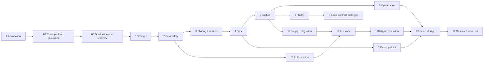

# Synveil implementation roadmap

Status: **PLANNED execution blueprint**

This roadmap sequences Synveil from an empty repository into a trustworthy
self-hosted data platform. It is a dependency plan, not a feature claim or a
calendar promise. A phase is complete only when the evidence gates below pass;
code, a migration, or a UI shell by itself never changes a capability to
`IMPLEMENTED`.

The roadmap is subordinate to accepted ADRs, protocol/domain specifications,
and the authority order in
[CONTRIBUTING_ARCHITECTURE.md](CONTRIBUTING_ARCHITECTURE.md). Detailed task
ownership and per-phase work packages live in [TEAM_PLAN.md](TEAM_PLAN.md).

## Delivery principles

1. Storage, upload, version, sync, backup, and restore correctness form the
   critical path. Optional enrichment cannot weaken that path.
2. Synveil is easy by default, safe by default, cross-platform by design, and
   powerful when needed. Personal / Home and Advanced / Server Mode share one
   protocol, API, data model, and correctness boundary.
3. Early and medium releases remain a Rust modular monolith: one API process,
   one Rust worker process, PostgreSQL, an `ObjectStore`, a static React web
   client, and optional Python AI. Platform services are adapters, not domain
   concepts.
4. PostgreSQL jobs/outbox are the initial durable work mechanism. A broker,
   Redis, Kubernetes, and network microservices require measured need and a new
   ADR.
5. Public contracts are frozen before independent implementation begins.
   Protocol fixtures and adversarial tests are written with or before code.
6. Every destructive or format-changing feature first proves restore,
   retry/idempotency, crash recovery, and upgrade behavior.
7. A phase may research later work, but it may not publish a later stored or
   public contract before its prerequisite gate.
8. English and Vietnamese core documentation must carry the same technical
   meaning before a release is promoted.

## Gate model

Every phase exit records evidence in these dimensions:

| Gate | Required evidence |
|---|---|
| `A` Architecture | Accepted ADR/specs, reviewed OpenAPI delta, domain invariants, and no blocking `OPEN DECISION`. |
| `C` Correctness | Unit/integration/conformance tests, retry behavior, failure injection, and recovery evidence for the phase. |
| `S` Security | Threat-model delta, authorization matrix, abuse/resource limits, secret handling, audit behavior, and no unaccepted critical finding. |
| `P` Performance | Reproducible benchmark method, declared hardware/data profile, bounded memory/concurrency, and an accepted regression budget. No marketing number is invented. |
| `O` Operations | Deployment/configuration, health, metrics, logs, backup/restore, migration, and incident behavior are documented and exercised. |
| `D` Documentation | API/spec/operator/user status documentation is accurate and English/Vietnamese meaning is aligned. |
| `N` Next phase | Integrated suite is green; no unresolved high-severity data-loss, authorization, or upgrade defect; downstream prerequisites are named. |

An exception requires an owner, written risk acceptance, expiry, and a release
scope that cannot expose the missing guarantee to users. Data-loss and
authorization defects cannot be waived into a stable release.

The master plan's exact promotion tokens are the `SYNVEIL_*` and
`SECURITY_REVIEW_PASS` gates listed in [TEAM_PLAN.md](TEAM_PLAN.md). The
`SV-G*` labels used in the detailed phase material below are retained as
internal evidence-bundle references for the expanded roadmap; they are not
alternative promotion gates and must never be reported as a replacement for
the exact master tokens.

## Dependency spine

Phase numbers express the default product promotion order. After the core
data-safety gates, bounded specification or prototype work may run in parallel
where the diagram has independent edges. The stable release train still
promotes only an integrated, supportable set.

## Phase overview

| Phase | Outcome | Entry gate | Expanded evidence reference / canonical gate |
|---|---|---|---|
| 0 | Repository, contracts, CI, and feature-empty runtime skeleton | Blueprint approved | `SV-G0-FOUNDATION` after the cross-platform subgates |
| 0A | Cross-platform product, platform-runtime, and storage-capability foundation | `SYNVEIL_CONTRACTS_READY` | `SYNVEIL_CROSS_PLATFORM_FOUNDATION_READY` |
| 0B | Guided/native distribution, managed database, update, uninstall, migration, and recovery foundation | `SYNVEIL_CROSS_PLATFORM_FOUNDATION_READY` | `SYNVEIL_FOUNDATION_READY` |
| 1 | Authenticated logical storage and streaming I/O | `SYNVEIL_FOUNDATION_READY` | `SV-G1-STORAGE` |
| 2 | Resumable uploads, integrity, versions, trash, reconciliation | `SV-G1-STORAGE` | `SV-G2-DATA-SAFETY` |
| 3 | Revocable shares and device identity | `SV-G2-DATA-SAFETY` | `SV-G3-TRUSTED-ACCESS` |
| 4 | Ordered, retry-safe multi-device sync protocol | `SV-G3-TRUSTED-ACCESS` | `SV-G4-SYNC-CONFORMANT` |
| 5 | Snapshot backup, retention, and verified restore | `SV-G4-SYNC-CONFORMANT` | `SV-G5-RESTORABLE` |
| 6 | Safe compression, whole-object dedup, accounting, GC | `SV-G5-RESTORABLE` | `SV-G6-OPTIMIZED-SAFELY` |
| 7 | First cross-platform desktop/reference client | `SV-G4-SYNC-CONFORMANT` | `SV-G7-DESKTOP-REFERENCE` |
| 8 | Original-preserving photo library and derivatives | `SV-G5-RESTORABLE` | `SV-G8-PHOTOS-SAFE` |
| 9 | Apple platform contract/prototype evidence | `SV-G7-DESKTOP-REFERENCE`, `SV-G8-PHOTOS-SAFE` | Internal `SV-G9-APPLE-CONTRACT-PROTOTYPE`; not final promotion |
| 10 | Optional private AI/OCR/semantic-index foundation | `SV-G2-DATA-SAFETY` and durable jobs | `SV-G10-AI-OPTIONAL` |
| 11 | Forgejo inventory, project association, backup/restore | `SV-G5-RESTORABLE` | `SV-G11-FORGEJO-RESTORABLE` |
| 12 | ACL-correct repository intelligence | `SV-G10-AI-OPTIONAL`, `SV-G11-FORGEJO-RESTORABLE` | `SV-G12-CODE-INTELLIGENCE` |
| 12B | Final Apple client promotion in the master sequence | `SYNVEIL_DESKTOP_SYNC_READY`, `SYNVEIL_PHOTOS_FOUNDATION_READY`, `SYNVEIL_CODE_INTEGRATION_READY`, `SYNVEIL_CLIENT_CONTRACT_READY` | `SYNVEIL_APPLE_CLIENT_READY` |
| 13 | Files on demand, deterministic tiering, anomaly safeguards | `SV-G6-OPTIMIZED-SAFELY`, `SYNVEIL_APPLE_CLIENT_READY`, client evidence | `SV-G13-SMART-STORAGE` |
| 14 | Justified horizontal/distributed evolution | Measured bottleneck and accepted ADR | `SV-G14-SCALE-PROVEN` |

## Phase 0 — Repository and architectural foundation

**Objective.** Create an executable but feature-empty monorepo foundation that
enforces the accepted contracts.

**Scope.** Establish the Rust workspace and API/worker composition roots,
React/TypeScript/Vite workspace, reviewed OpenAPI conventions, migration
runner, PostgreSQL/job skeleton, local `ObjectStore` interface, configuration
validation, Docker Compose/Caddy Advanced / Server topology, CI, dependency/
license inventory, and bilingual documentation process. Resolve portable name,
local durability, platform-runtime, storage-capability, installation, and
recovery decisions before schema or adapter behavior escapes.

### Phase 0A — Cross-platform foundation and complexity boundary

**Objective.** Freeze the product-facing contract that makes Synveil approachable
to non-technical users while preserving an expert self-hosted path.

**Scope.** Pair [PLATFORM.md](PLATFORM.md) with the product, architecture,
storage, domain, security, deployment, and client specifications. Freeze the
Personal / Home versus Advanced / Server Mode distinction; first-class Windows,
macOS, Linux Desktop, and Linux Server targets; future Android/iPhone/iPad
direction; the `PlatformRuntime`/service-lifecycle port; the
`StorageBackend → StorageCapabilities` boundary; capability-driven storage
selection; short-lived pairing; layered self-hosted-first remote access; user,
administrator, and developer diagnostics; and progressive-disclosure/terminology
rules. No platform-specific service manager API belongs in the domain core.

**Evidence.** English/Vietnamese parity, accepted ADR-017/018/022, capability
matrix fixtures for supported filesystem families, error-to-user-action mapping,
pairing threat cases, and a review confirming that the same API/data model serves
both modes. The gate does not claim a native installer or client exists.

**Gate.** `SYNVEIL_CROSS_PLATFORM_FOUNDATION_READY` is recorded only after the
contract owner and an independent reviewer accept the artifacts and no unresolved
decision makes a later implementation choose a different core boundary.

### Phase 0B — Distribution, managed database, and recovery foundation

**Objective.** Define the operational path from installation to safe maintenance
for ordinary users and operators.

**Scope.** Specify native/guided install preflight, OS service adapters,
Synveil-managed PostgreSQL lifecycle, storage picker and migration semantics,
signed release/update verification, health translation, data-preserving
uninstall/reinstall, machine migration, recovery workflows, and release-lab
matrix. Compose remains an Advanced / Server reference topology, not the sole
product onboarding path. Keep packaging choices open under ADR-019 and the
`OD-PLAT-*` decisions until evidence closes them.

**Evidence.** Installer/service/update/uninstall/migration threat and failure
fixtures; clean-host and reboot/crash/sleep scenarios; managed PostgreSQL
backup/restore and ownership notes; Windows/macOS/Linux support matrix; and a
release checklist that separates application removal from data deletion.

**Gate.** The evidence contributes to `SYNVEIL_FOUNDATION_READY`; no platform
profile is called supported until its native/guided install and recovery lab
passes.

**Promotion evidence.** Clean checkout builds and tests; the feature-empty
runtime reaches a bounded ready state in the developer profile and the Advanced /
Server Compose profile; migrations are checksummed and serialized; secrets are
absent from images/logs; liveness/readiness/structured logging exist; API errors
and UUIDv7 serialization have contract tests; CI runs Rust formatting/lints/tests,
strict TypeScript checks, docs links, secret scanning, dependency review, and
migration checks. There is no claim of working storage or a supported native
installer.

**Gate.** Promote to `SV-G0-FOUNDATION` only after `A/C/S/P/O/D/N` evidence and
the cross-platform subgates are recorded. The gate records that MIT is currently
operative and assigns the owner/deadline for any future license split; it does
not silently enact or require relicensing before the external-contribution/
differently-licensed-release trigger.

## Phase 1 — Storage foundation

**Objective.** Deliver authenticated user/library/file metadata plus bounded
streaming upload and range download over the production local filesystem
adapter.

**Scope.** One-time administrator bootstrap, users, Argon2id credentials,
hashed opaque browser sessions, CSRF defense, centralized authorization,
`Library`, directory/file `Node`, immutable `FileVersion`/`Object`, metadata
list/move/rename, basic upload, streaming/range download, quotas, and a minimal
web file manager. The portable naming profile and storage durability profile
become frozen contracts. OD-SYNC-004's recursive-subtree precondition
representation also freezes here so Phase 2 Trash cannot invent a schema or
wire token before the broader Phase 4 sync protocol.

**Promotion evidence.** Object keys never derive from names; symlink/path
traversal, IDOR, SQL injection, CSRF, XSS filename, oversized request, disk-full,
and missing-backend tests pass. API/worker memory is bounded independently of
file size. A success response implies a verified durable object and committed
metadata/journal/audit/outbox transaction. Local adapter conformance and a
small recovery drill pass.

**Gate.** `SV-G1-STORAGE` requires no unreviewed mutation path that bypasses
authorization, idempotency, or the canonical object commit boundary, and
records the accepted OD-SYNC-004 schema/API representation before recursive
Trash is dispatched.

## Phase 2 — Reliable uploads and data safety

**Objective.** Make interrupted and repeated content operations recoverable
without duplicate or corrupt visible data.

**Scope.** Persisted resumable upload state/parts, SHA-256 and representation
checksums, serialized completion, idempotency outcome replay, staging expiry,
orphan reconciliation, integrity scans/quarantine, immutable version history,
trash/restore/purge retention, storage accounting, and mark-and-sweep GC with
leases and grace periods.

**Promotion evidence.** The crash matrix covers every boundary between part
write, object promotion, database commit, response delivery, outbox claim, and
cleanup. Duplicate completion and lost-success replay return one result.
Objects written before a failed transaction remain inaccessible and are
eventually reconciled. GC dry-run and live modes prove every protected
reference class; retention and restore preserve hashes. Checksum mismatch never
serves bytes as valid.

**Gate.** `SV-G2-DATA-SAFETY` requires a repeatable invariant auditor and a
restore drill from versions/trash, not only upload happy paths.

## Phase 3 — Sharing and device foundation

**Objective.** Add revocable delegated access and independently manageable
device credentials without weakening object authorization.

**Scope.** Private user shares, public link capabilities, expiry/passwords,
read/write policy, atomic revoke, audit/activity, device registration,
scoped/hashed credentials, rotation/revocation, pause policy, capability/version
declarations, and rate/abuse controls.

**Promotion evidence.** A principal/resource/action authorization matrix has
positive and negative tests. Public tokens are high entropy and hash-only at
rest; passwords use a reviewed verifier; links have request/byte/concurrency
limits. Device revoke invalidates future use within the documented bound and
never claims to erase an operating system. Share cache/download limitations are
truthfully documented.

**Gate.** `SV-G3-TRUSTED-ACCESS` requires adversarial cross-user IDOR, revoked
token, credential rotation replay, share brute-force, and recursive permission
tests.

## Phase 4 — Sync protocol

**Objective.** Publish one reference, deterministic, offline-safe sync protocol
before shipping a full native client.

**Scope.** Per-`Library` transactional journal clock, versioned authenticated
opaque cursors, change pages, initial snapshot/rebaseline, client mutation IDs,
base revisions/ETags, tombstones, rename/move/delete/restore semantics,
deterministic conflict preservation, retention, device checkpoints, protocol
fixtures, and a headless reference client/simulator.

**Promotion evidence.** The conformance suite covers duplicate pages, atomic
client apply, writes during pagination, stale/wrong cursor, old epoch,
offline/offline edits, edit/delete races, directory cycles, name collisions,
clock skew, retry after lost response, backlog, revocation, crash, and disk
failure. No successful concurrent content path silently discards bytes. Cursor
retention has a monitored operational value and an authoritative rescan route.

**Gate.** `SV-G4-SYNC-CONFORMANT` requires the unusually detailed sync matrix
in [TESTING.md](TESTING.md) to pass against the API and reference client, with
the fixture format frozen and versioned.

## Phase 5 — Backup and restore

**Objective.** Protect historical device state with semantics that cannot be
mistaken for deletion-propagating sync.

**Scope.** Device-scoped `BackupSet`, `BUILDING` and atomically `COMMITTED`
snapshot manifests, entries and consistency labels, unchanged-object reuse,
retention, holds, backup health, resumable restore plans, file/folder/snapshot
restore, and recovery after source-device loss.

**Promotion evidence.** Source deletion or omission never deletes retained
history; partial snapshots are never restorable; retention cannot free an
object referenced by any remaining snapshot; changed files during scan receive
an honest consistency label; restore defaults to a non-destructive destination
and verifies manifest membership, byte length, and SHA-256. Quota, interruption,
corruption, repeated backup, removed device, and complete disaster-recovery
drills pass.

**Gate.** `SV-G5-RESTORABLE` requires an independent restore drill on a clean
destination. A backup that has never been restored is not release evidence.

## Phase 6 — Storage optimization

**Objective.** Reduce physical storage without changing canonical bytes,
authorization, retention, or recoverability.

**Scope.** Measured Zstandard policy, plaintext versus stored checksums,
transparent decode/range strategy, whole-object dedup inside one dedup domain,
logical/retained/physical accounting, GC hardening, and background re-encoding
or replica migration with verified copy-and-switch.

**Promotion evidence.** Round trips are byte-identical for eligible and skipped
formats; compressed/encrypted/already-compressed inputs are bounded; malicious
headers/decompression bombs fail safely; dedup trusts only server verification;
cross-owner equality cannot be inferred through APIs, timing, or quota; old
representation readers remain supported during migration; performance data
proves a benefit for each enabled policy.

**Gate.** `SV-G6-OPTIMIZED-SAFELY` requires optimization feature flags and a
safe disable/rollback-to-existing-representation path. Advanced `PLANNED`
chunk-level dedup remains behind its own accepted ADR and measured later gate;
it cannot block this phase.

## Phase 7 — Desktop reference client

**Objective.** Prove the server protocol against real Windows, macOS, Linux
Desktop, and Linux Server filesystem behavior with selected-folder sync and
backup after the platform/distribution boundary is frozen.

**Scope.** A reusable Rust sync state machine where justified, platform
filesystem adapters, local durable state, onboarding/device registration,
selected-folder policies, offline queue, conflict UI/status, bandwidth control,
packaging/update strategy, and user-facing recovery. Platform shells retain
native credential, placeholder, watcher, service, and UI behavior. Android,
iPhone, and iPad remain future clients with capability-specific evidence rather
than a desktop gate prerequisite.

**Promotion evidence.** Cross-platform name/case/Unicode, atomic replace,
permissions/symlink policy, watcher loss, clock skew, locked files, sparse files,
reboot, local database corruption, stale cursor, and low-disk tests pass. A
device can be revoked and a new device can rebuild from server truth. Client
credentials use OS protection and logs exclude paths/tokens by default.

**Gate.** `SV-G7-DESKTOP-REFERENCE` requires one supported client to complete
initial scan, incremental sync, conflict recovery, and restore on each claimed
platform; unsupported capabilities remain labeled, not simulated.

## Phase 8 — Photos

**Objective.** Add a privacy-aware photo view over canonical originals without
turning thumbnail/parser failure into data loss.

**Scope.** `PhotoAsset`, original image/video upload, timeline, albums,
favorites, video/screenshot classification, grouped live-photo-style resources,
EXIF extraction, renditions/thumbnails, exact duplicate detection, search
metadata, and device backup state. Perceptual duplicate suggestions may be
evaluated as optional `EXPERIMENTAL` work and are not required for this gate.

**Promotion evidence.** Originals remain immutable and downloadable when all
photo workers are absent. Parsers run with file-size, pixel-count, CPU, memory,
time, recursion, and network limits. EXIF/location is authorization-scoped;
shares can strip sensitive derivative metadata without mutating originals.
Malformed media, unsupported codecs, duplicate grouping, derivative purge and
rebuild, deletion/retention, and very large video upload tests pass.

**Gate.** `SV-G8-PHOTOS-SAFE` requires a reviewed decision that phone-library
deletion does not silently delete server backup history; upload-only protection
is the default.

## Phase 9 — Apple client contract prototype

**Objective.** Validate iPhone, iPad, and macOS platform limits through a
disposable prototype and frozen fixtures, not an assumed unrestricted
filesystem/background process. This is not final Apple-client promotion.

**Scope.** Swift/SwiftUI shell, Keychain credentials, URLSession background
transfers, FileProvider enumeration/change anchors/hydration where supported,
PhotoKit limited/full-library access, grouped resource upload, Swift
Concurrency, device status, and explicit sync/backup policy.

**Evidence.** Limited PhotoKit authorization, permission revocation, asset
edits/deletes, duplicate callbacks, background termination, upload resume, low
power/network/storage, credential revoke, FileProvider stale anchor,
placeholder eviction/hydration, and server upgrade compatibility are exercised
on the claimed prototype OS matrix. The UX explains best-effort scheduling and
never claims complete iPhone backup. This checkpoint is recorded as internal
`SV-G9-APPLE-CONTRACT-PROTOTYPE`; it does not promote a product capability.

## Phase 10 — AI foundation

**Objective.** Add optional OCR, embeddings, semantic search, and generated tags
with explicit data provenance and egress control.

**Scope.** `DISABLED`, `LOCAL`, and opt-in `REMOTE` modes; Python runtime;
version-bound AI jobs/index records; optional pgvector; OCR/extraction;
embeddings; result freshness; editable `AI` tag provenance; per-library/item
exclusions; retention/deletion; provider credentials and data-use disclosure.

**Promotion evidence.** Core upload/download/sync/backup/restore and metadata
search pass with AI stopped, missing, overloaded, or removed. Remote requests
cannot occur without effective policy and an allowlisted provider. Inputs are
minimized and audited by category, not logged as content. Stale-version output
cannot become current; delete/revoke schedules bounded index removal; search
rechecks current ACLs. Untrusted document text is data, never tool instruction.

**Gate.** `SV-G10-AI-OPTIONAL` requires a no-egress test in `DISABLED`/`LOCAL`
modes, an explicit remote-consent test, and a complete derived-data rebuild and
purge drill.

## Phase 11 — Forgejo and project integration

**Objective.** Inventory and protect Forgejo repositories while leaving Git
protocols and collaboration authority in Forgejo.

**Scope.** Connector interface, encrypted least-privilege integration
credentials, SSRF-bounded base origins, polling plus authenticated webhook
hints, repository/ref/commit summaries, health/staleness, `Project` links,
restorable Git data, LFS and selected release-artifact backup, verification,
and safe restore destination.

**Promotion evidence.** Forgejo outage or bad credentials affect only the
integration and expose stale/error state. Webhook signatures, replay windows,
idempotency, payload limits, reconciliation, redirect/DNS behavior, and secret
redaction pass. A backup includes a manifest of covered/omitted data, passes
Git integrity checks, includes claimed LFS/artifacts, and restores into a new
Forgejo target without overwriting a live repository by default.

**Gate.** `SV-G11-FORGEJO-RESTORABLE` requires a documented connector/Forgejo
compatibility matrix and a clean restore drill. Metadata inventory is not
accepted as repository backup.

## Phase 12 — AI plus code

**Objective.** Make authorized repository content searchable and explainable
without granting AI broader repository or file access.

**Scope.** The `PLANNED` promotion scope is version/commit-bound source
indexing, README/docs/metadata indexing, semantic code retrieval/search,
project-aware retrieval, provenance/citations, refresh, and deletion. Generated
repository Q&A and change summaries may be evaluated as `EXPERIMENTAL`; they
are not required for this gate. Issues/PRs are included only when an adapter
contract and permission mapping exist.

**Promotion evidence.** Every result is filtered against current Synveil and
connector permissions. Revoked repositories disappear within the documented
index-removal bound. Prompt-injection fixtures cannot cause tool/network/secret
access. Branch/ref changes do not mislabel stale content as current. Large or
malicious repositories have file/count/CPU/time limits and binary/generated
exclusions.

**Gate.** `SV-G12-CODE-INTELLIGENCE` requires adversarial cross-project ACL,
secret-file exclusion, stale-index, untrusted-instruction, remote-provider, and
repository deletion tests.

## Phase 12B — Final Apple client promotion

**Objective.** Promote the Apple client only after the master plan's desktop,
Photos, AI, and Forgejo/code contracts are stable.

**Entry.** `SYNVEIL_DESKTOP_SYNC_READY`,
`SYNVEIL_PHOTOS_FOUNDATION_READY`, `SYNVEIL_CODE_INTEGRATION_READY`, and
`SYNVEIL_CLIENT_CONTRACT_READY`. The Phase 9 prototype may provide fixtures but
is not a substitute for these gates.

**Scope.** Reconcile the prototype with versioned server contracts; complete
device auth/revocation, PhotoKit import and permission behavior, FileProvider
enumeration/change anchors/hydration where supported, background URLSession
resume, conflict/error UX, package/entitlement review, and the support matrix
for each claimed OS/device.

**Promotion evidence.** The full platform matrix covers limited/full/revoked
PhotoKit permission, duplicate callbacks, edited/deleted assets, background
termination/resume, low power/network/storage, stale FileProvider anchors,
conflict, Keychain/device revoke, server upgrade compatibility, clean restore,
and documented best-effort scheduling. Unsupported capabilities are explicit
errors/states, never silent simulation. Security, release provenance, support,
rollback/update, and privacy evidence pass independently.

**Gate.** Promote the exact master token `SYNVEIL_APPLE_CLIENT_READY`; do not
claim full-device backup or guaranteed continuous background execution.

## Phase 13 — Smart storage and files on demand

**Objective.** Optimize local/remote placement using explainable rules while
preserving at least one verified reachable copy.

**Scope.** Client-visible local/cloud/pinned/transfer/conflict/unavailable
states, hydration and verified eviction, deterministic `HOT`/`WARM`/`COLD`/
`ARCHIVE` rules, asynchronous replica copy/verify/switch, recommendations, and
bounded anomaly safeguards for destructive bursts.

**Promotion evidence.** No cache eviction emits server deletion. No source
replica is retired before target verification and rollback window. Backend
outage, policy reversal, interrupted move, stale client, low disk, concurrent
pin/evict, and restore tests pass. Anomaly handling preserves evidence and has
an explicit recoverable override; it is not marketed as perfect ransomware
detection.

**Gate.** `SV-G13-SMART-STORAGE` requires
`SYNVEIL_APPLE_CLIENT_READY`, state-machine/property tests across each supported
client capability, and proof that disabling the rule engine does not strand
canonical data.

## Phase 14 — Advanced scale only when justified

**Objective.** Remove measured capacity or availability bottlenecks without
redefining correctness.

**Scope.** S3/MinIO production adapters if not already promoted, worker/API
replicas, bounded shared rate limiting, broker fan-out, read replicas, and
Kubernetes/multi-node guidance only where measurements and operational goals
justify them.

**Promotion evidence.** An accepted ADR names the measured trigger, rejected
simpler option, consistency impact, mixed-version strategy, rollback, cost,
security boundary, and operations owner. Adapter conformance, multi-writer
journal, job lease, rate-limit, failure-partition, backup/restore, and load tests
prove behavior. PostgreSQL remains the atomic outbox handoff until an equivalent
guarantee is demonstrated.

**Gate.** `SV-G14-SCALE-PROVEN` is capability-specific. “Runs on Kubernetes” or
“has a message broker” is not itself a product milestone.

## Work that may run in parallel

- In Phase 0, web/toolchain, Rust skeleton, CI, Compose, and docs may proceed
  after contract ownership is assigned; migrations and OpenAPI each have one
  integrator.
- In Phases 1–2, UI and adapters may consume frozen APIs while storage safety,
  database transactions, and failure tests remain serially owned.
- After `SV-G2-DATA-SAFETY`, AI runtime prototypes may proceed against synthetic
  data without enabling remote egress or changing core schemas.
- After `SV-G4-SYNC-CONFORMANT`, desktop client work can proceed while backup
  is implemented, but a desktop backup feature cannot promote before
  `SV-G5-RESTORABLE`.
- Photo server work and Forgejo connector research may proceed after storage/
  backup contracts; each remains optional and isolated.
- Phase 10 AI and Phase 11 Forgejo can execute independently after their entry
  gates. Phase 12 waits for both.
- No parallel task independently invents IDs, event schemas, cursor semantics,
  authorization, storage formats, migrations, or error codes.

## Release channels and semantic versioning

### `0.x` development

- `0.x.y-dev`/nightly artifacts are reproducible integration builds, may be
  incompatible, and are never the default production recommendation.
- Alpha begins only after the storage safety gate for the advertised feature
  set. It is for disposable or explicitly backed-up installations.
- Beta begins after sync and backup restore drills, upgrade fixtures, security
  review, and documented support limits. Beta data is not assumed disposable.
- Stable `1.0.0` requires a supported clean install and upgrade path, a tested
  system backup/restore runbook, sync and backup conformance, security review,
  dependency/SBOM policy, and no high-severity data-loss or authorization bug.

The monorepo ships one product/server version initially. API path `/api/v1`
does not imply product version `1.0`, and compatible additions do not require a
new path. Breaking API/protocol behavior needs explicit version negotiation and
migration.

### Release artifacts and provenance

Each promoted release supplies source, immutable container tags/digests,
checksums, generated SBOMs, provenance/signatures when the release system
supports them, a compatible Compose/Caddy bundle, migration notes, configuration
changes, known limitations, and an exact supported upgrade matrix. Operator
guidance pins a version or digest, never mutable `latest`.

## Upgrade and migration policy

1. Released migrations are append-only and checksum-verified. One migration
   runner holds an advisory lock; API readiness fails on an unsupported schema.
2. Use expand/backfill/contract evolution. New readers deploy before a new
   writer where mixed versions exist. Destructive column/format removal is not
   combined with first introduction of its replacement.
3. Large data backfills are restartable, observable jobs, not unbounded startup
   transactions. Canonical objects are never rewritten in place.
4. A preflight verifies configuration, schema version, backend identity,
   capacity, and a recent successful system backup before migration.
5. Early Compose upgrades may use a documented maintenance window: drain/stop
   workers and mutations, take a coordinated database/object/config/secret
   backup, run one migrator, start services, wait for readiness, and verify a
   representative read/restore.
6. Forward migrations are the norm. Binary downgrade is supported only when
   the compatibility matrix says so; otherwise rollback means restoring the
   complete pre-upgrade backup. Never instruct users to wipe PostgreSQL.
7. Storage-format changes are versioned and use copy, verify, transactional
   location switch, rollback window, and later retirement. Changing a mounted
   path is never treated as a migration.
8. Every release candidate upgrades fixtures from each supported source
   version and restores them on a clean environment. The support window is an
   explicit product decision, not an accidental promise.

## Open-source and contributor gate

The repository currently uses MIT. ADR-011 is proposed and does not change
that fact. Before accepting contributions under a different policy, the owner
must decide among retaining MIT, adopting an owner-approved AGPL core/web plus
Apache-2.0 SDK split, or a rights-compatible dual-license model. A dual-license
plan requires contributor rights/CLA analysis; a DCO alone does not necessarily
grant relicensing rights. App Store/mobile distribution and dependency/model/
asset compatibility require specialist review. Previously granted MIT rights
cannot simply be revoked.

## Roadmap-level risks and controls

| Risk | Control and release trigger |
|---|---|
| Silent sync overwrite or omission | Per-library commit-ordered journal, base versions, conflict preservation, reference simulator, property tests; blocks Phase 4 and stable. |
| Object/metadata split-brain | Object-first verified commit, one DB transaction, idempotency outcome, orphan grace/reconciliation, invariant auditor; blocks Phases 1–2. |
| Backup accidentally behaves as sync | Separate entities/APIs/events; source absence tests; independent clean restore; blocks Phase 5. |
| Self-hosted upgrade destroys data | Coordinated backup, immutable migrations, upgrade fixtures, restore-only rollback when required; blocks beta/stable. |
| Cross-platform namespace loss | Portable immutable naming profile and conformance fixtures before Phase 1; platform adapter tests before clients. |
| Cross-platform promise exceeds evidence | First-class host matrix, real install/service/update/recovery labs, capability-driven fallback, and no “Linux Compose equals every platform” claim; blocks the foundation gate. |
| Non-technical onboarding leaks operator complexity | Progressive disclosure, managed PostgreSQL contract, storage picker, pairing, user/admin/dev health layers, and usability/error-recovery fixtures; blocks Personal / Home promotion. |
| Filesystem-specific optimization becomes a correctness dependency | `StorageCapabilities` probes and portable fallback keep Btrfs/WinBtrfs and similar accelerators optional; blocks storage promotion if the fallback is incomplete. |
| Untrusted parser compromise | Isolated bounded derivative workers with no default egress; malformed corpus; blocks Photos/AI. |
| Remote AI data leakage | Default disabled/local, explicit policy, minimization, provider allowlist/audit/purge; blocks remote mode. |
| Git credential/SSRF abuse | Encrypted least-scope secrets, exact-origin policy, redirect/DNS controls, authenticated webhooks; blocks Forgejo. |
| Mobile background assumptions | Capability negotiation and real-device tests; truthful best-effort UX; blocks Apple promotion. |
| E2EE/dedup/AI contradiction | Keep E2EE a separate future mode under ADR-016; no zero-knowledge claim. |
| Scope expansion ahead of correctness | Gate tokens, one accountable owner per task, no status promotion without evidence. |
| License ambiguity | Owner decision before new headers/split releases/external contribution policy. |

## `OPEN DECISION` register

The authoritative format is defined in
[CONTRIBUTING_ARCHITECTURE.md](CONTRIBUTING_ARCHITECTURE.md). These decisions
must be closed by the named gate; recommendations are defaults, not silent
implementation permission.

### OPEN DECISION OD-001: portable name comparison profile

- **Owner:** Domain, Sync, Clients
- **Needed by:** `SV-G0-FOUNDATION`, before Phase 1 schema freeze
- **Options:** one case-insensitive portable profile; per-library portable or
  case-sensitive profile; server case-sensitive names with client conflict
  encoding
- **Recommendation:** preserve display UTF-8 but enforce a versioned Unicode
  normalization/case-fold comparison key that prevents sibling names from
  colliding on supported clients.
- **Decision evidence:** Windows/macOS/Linux fixture corpus, Unicode versioning,
  reserved-name and migration review.

### OPEN DECISION OD-002: local filesystem durability profiles

- **Owner:** Storage, Operations
- **Needed by:** `SV-G1-STORAGE`
- **Options:** strict file-and-directory sync; documented balanced mode;
  filesystem-specific profiles
- **Recommendation:** make strict durability the production default and allow
  a clearly labeled performance profile only after power-loss testing.
- **Decision evidence:** local/NAS capability tests and measured fsync cost.

### OPEN DECISION OD-003: account and ownership isolation

- **Owner:** Product, Domain, Security
- **Needed by:** `SV-G3-TRUSTED-ACCESS`
- **Options:** single-user instance; multiple independent users; family/group
  membership model
- **Recommendation:** explicit owner plus membership, with no cross-owner dedup,
  while deferring enterprise organizations.
- **Decision evidence:** authorization matrix, sharing UX, quota/accounting and
  deletion ownership review.

### OPEN DECISION OD-004: project licensing policy

- **Owner:** Project owner with legal review
- **Needed by:** first external contribution or differently licensed release
- **Options:** retain MIT; AGPL core/web plus Apache-2.0 SDK boundary; compliant
  dual license
- **Recommendation:** evaluate the proposed split before significant external
  contributions, but leave current MIT operative until an authorized change.
- **Decision evidence:** copyright provenance, contributor mechanism,
  dependency and App Store review.

### OPEN DECISION OD-005: recovery delivery and administrator override

- **Owner:** Security, Product, Operations
- **Needed by:** public account enrollment
- **Options:** recovery codes plus host-local admin reset; optional configured
  email; later MFA/WebAuthn recovery
- **Recommendation:** printable one-time recovery codes and an audited,
  explicitly invoked host-admin recovery procedure; do not depend on hosted
  email.
- **Decision evidence:** anti-takeover threat review and lost-device drill.

### OPEN DECISION OD-006: local AI support baseline

- **Owner:** AI, Operations, Product
- **Needed by:** `SV-G10-AI-OPTIONAL`
- **Options:** CPU-only baseline; GPU profiles; pluggable inference endpoint
- **Recommendation:** publish only benchmarked model/hardware profiles and keep
  the core Compose deployment free of an AI requirement.
- **Decision evidence:** quality, memory, throughput, image licensing, and
  offline installation measurements.

### OPEN DECISION OD-007: supported upgrade window

- **Owner:** Release, Database, Operations
- **Needed by:** first beta
- **Options:** only consecutive minor upgrades; last two minors; all `0.x`
  releases
- **Recommendation:** initially guarantee documented consecutive-minor upgrades
  and provide an explicit stepping path; expand only after the fixture matrix is
  sustainable.
- **Decision evidence:** migration/restore CI duration and support capacity.

### OPEN DECISION OD-008: repository backup representation

- **Owner:** Integrations, Backup, Security
- **Needed by:** `SV-G11-FORGEJO-RESTORABLE`
- **Options:** Forgejo-supported export; verified Git bundle plus separate
  LFS/artifact manifest; versioned hybrid
- **Recommendation:** a versioned hybrid selected from documented Forgejo/Git
  interfaces, with a manifest that states exactly what is covered.
- **Decision evidence:** compatibility matrix, consistency analysis, `git fsck`,
  LFS/artifact restore drill, and overwrite-safety review.

### OPEN DECISION OD-009: shared Rust client core boundary

- **Owner:** Clients, Architecture
- **Needed by:** Phase 7 packaging and Phase 12B final Apple promotion
- **Options:** protocol/state only; protocol plus local database; native Swift
  implementation on Apple
- **Recommendation:** share deterministic protocol/state logic across desktop;
  prototype before putting Rust behind Apple FileProvider/PhotoKit FFI.
- **Decision evidence:** platform lifecycle, binary size, debugging, FFI safety,
  and test-reuse prototype.

### OPEN DECISION OD-010: photo source-deletion policy

- **Owner:** Photos, Backup, Product
- **Needed by:** `SV-G8-PHOTOS-SAFE`
- **Options:** upload-only retention; explicit mirror mode; separate managed
  photo-library mode
- **Recommendation:** upload-only backup by default: deleting a phone asset
  does not remove the retained server original without an explicit Synveil
  action/policy.
- **Decision evidence:** PhotoKit behavior, retention UX, restore, and accidental
  deletion tests.

The platform-specific open decisions are maintained in
[PLATFORM.md](PLATFORM.md): `OD-PLAT-001` through `OD-PLAT-005` cover the native
installer boundary, managed PostgreSQL packaging, storage capability policy,
remote-access posture, and migration/recovery package. They must be closed by
the named foundation or product gate; this roadmap does not silently choose a
package format or hosted relay.

## Recommended next implementation gate

The only next implementation target after this blueprint is
`SYNVEIL_CROSS_PLATFORM_FOUNDATION_READY`. It is a contract-and-evidence gate,
not a claim that installers or clients already exist. The foundation must first
freeze the platform/runtime, storage-capability, onboarding, pairing, health,
update, uninstall, migration, and recovery boundaries; only then may
`SYNVEIL_FOUNDATION_READY` and subsequent storage implementation work proceed.
