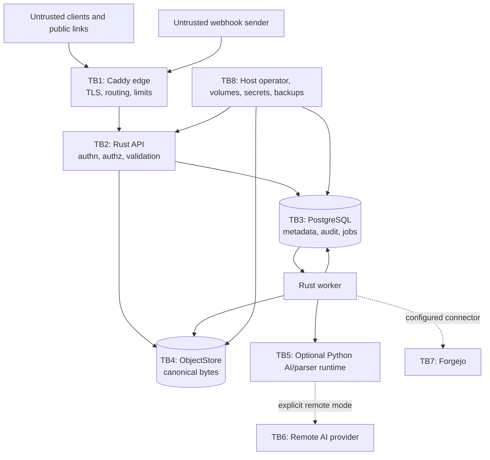

# Synveil security and privacy architecture

Status: **Normative threat-model blueprint**

Authentication foundation status: **Argon2id password hashing is
IMPLEMENTED/VALIDATED by unit tests; persistent first-admin bootstrap is
IMPLEMENTED**. Bootstrap concurrency is **VALIDATED only when the disposable
PostgreSQL test runs**. Verifier-only browser-session persistence and
transport-neutral login/session semantics are **IMPLEMENTED**; session
PostgreSQL behavior is **VALIDATED only when the disposable PostgreSQL session
test runs**. HTTP login/logout/session/CSRF transport, secure cookie policy, the
typed web API boundary, the first-run bootstrap HTTP flow, and the minimal web
setup/login/session UI are **IMPLEMENTED**. The authenticated exact-offset
upload transport and raw-byte browser API helpers are also **IMPLEMENTED**. The
transport-neutral owner-authorized content-read service selects only a verified
replica, cross-checks object metadata, and streams full/current-range bytes
without exposing physical keys; it is **IMPLEMENTED**. The authenticated HTTP
full/single-range download transport is also **IMPLEMENTED** with strong
SHA-256 validators, safe attachment headers, private no-store caching, and no
CSRF requirement for safe GETs. One-time device enrollment, device bearer
authentication, server profiles, native secure credential persistence, and the
production HTTP `SyncRemote` are **IMPLEMENTED**. Browser recovery, upload UI,
and download UI remain **PLANNED**. Authenticated version-history listing and direct
metadata lookup are **IMPLEMENTED** with owner/library scoping, active-file
concealment, bounded node-scoped cursors, safe allowlisted DTOs, and no
ObjectStore access; safe historical-version restore is **IMPLEMENTED** with
CSRF, signed `If-Match`, owner/file/source rechecks, verified-replica
selection, append-only FileVersion creation, and persisted idempotent replay.
The restore response exposes only safe version and node concurrency metadata;
it never exposes object or replica identity. PostgreSQL end-to-end
bootstrap/session/upload/content-read/version-history/restore evidence remains
environment-dependent when the disposable database is not configured.
Internal physical object GC is **IMPLEMENTED/VALIDATED** with final
reference/hold/lease revalidation, durable replica actions, lifecycle fencing,
and ObjectStore-only deletion. Its opt-in internal worker orchestration and
stuck-operation reconciliation are **IMPLEMENTED**; it has no public route,
normal-user deletion control, or unknown-physical-orphan auto-delete. The
durable change journal, per-device checkpoints, incremental change feed,
acknowledgment, and materialized logical snapshot/rebaseline bootstrap are
**VALIDATED**. Typed client mutation submission, durable UUID idempotency,
canonical SHA-256 fingerprinting, optimistic preconditions, deterministic
conflict persistence, and exact journal integration are **IMPLEMENTED**.
Durable conflict records, manual inspection, and explicit idempotent manual
resolution are **IMPLEMENTED**. The desktop inbound sync core is **VALIDATED**.
Automatic conflict resolution, backup, sharing, filesystem watching, outbound
mutation generation, and desktop GUI/pairing UX remain **NOT IMPLEMENTED/PLANNED**.

Synveil stores personal files, backups, photos, device state, repository data,
credentials, and derived search information. Security is therefore a release
condition, not an optional hardening pass. This document defines the initial
trust model and mandatory controls; it does not claim that an unimplemented
control already exists.

Accepted ADRs and domain/protocol specifications take precedence. Every phase
updates this threat model and produces the security evidence required by
[TEAM_PLAN.md](TEAM_PLAN.md).

## Security goals

Synveil must:

1. preserve confidentiality and authorization of canonical bytes and metadata;
2. preserve integrity and recoverability across malicious input, retry, crash,
   operator error, compromised credentials, and optional-service failure;
3. make destructive and security-relevant activity attributable without
   logging secrets or file contents;
4. fail closed at authentication, authorization, object selection, and remote
   egress boundaries;
5. bound CPU, memory, disk, database, queue, network, parser, and external-
   provider work from untrusted input;
6. keep AI, media parsing, Forgejo, webhooks, thumbnails, OCR, and semantic
   indexing outside the core availability path;
7. state residual risk truthfully, especially operator trust, downloaded data,
   device compromise, and deferred E2EE.

Availability does not permit accepting untracked canonical bytes when
PostgreSQL is unavailable or exposing a `FileVersion` before its `Object` is
durable and verified.

## Trust and threat assumptions

### Trusted with important limits

- The self-hosting operator controls the host, TLS name, storage paths,
  backups, and configuration. The initial server can read user plaintext.
- The PostgreSQL primary and selected `ObjectStore` run within the operator's
  trust boundary, but their credentials and network endpoints remain
  least-privilege secrets.
- Reviewed Synveil API/domain code is trusted to enforce policy; optional
  workers receive only the authority required for one job.

An attacker with root/administrator access to the host, database, object
backend and server-side encryption keys can read or alter server-readable data.
Encrypted disks and provider encryption protect media at rest or disposal; they
do not create zero knowledge. Only a separately designed E2EE mode could reduce
operator trust, and ADR-016 explicitly defers it.

### Untrusted or semi-trusted

- internet clients, browsers, filenames, metadata, file bytes and MIME claims;
- authenticated users outside the resource being requested;
- compromised/revoked devices and copied bearer credentials;
- public-share users and webhook callers;
- media/document/archive/repository contents, including prompt-like text;
- reverse-proxy headers not received from the configured proxy;
- Forgejo and AI endpoints outside the deployment;
- AI/model output and all derived classifications;
- network, DNS, clock and client-provided timestamps;
- job delivery count and order: jobs are at-least-once and may repeat.

### Explicit limitations

- Revocation prevents future Synveil access; it cannot recall bytes already
  downloaded or prove an operating system erased them.
- Public links are bearer capabilities; anyone who obtains an active token has
  its scoped rights until expiry/revocation/limit.
- Anomaly detection may preserve and pause suspicious changes but cannot
  guarantee ransomware detection.
- Initial deployments are single-host, not automatically highly available.
- Synveil is not a malware scanner or safe viewer for every file type.

## Protected assets and classification

| Class | Examples | Handling baseline |
|---|---|---|
| Authentication secret | Passwords, raw session/device/share tokens, recovery codes | Never log; plaintext exists only at issue/use boundary; store reviewed password verifier or keyed/cryptographic token hash; rotate and revoke. |
| Infrastructure secret | PostgreSQL URL, storage key, AI/Git token, webhook secret, application master key | Mounted/runtime secret, least scope, no image/source/UI exposure, backed up separately and encrypted, auditable rotation. |
| Canonical content | File objects, backup objects, originals, repository backup, release artifact | Immutable, SHA-256 verified, authorized through logical reference, encrypted transport, protected retention and restore. |
| Sensitive metadata | Names, hierarchy, timestamps, EXIF/location, device activity, repository names, OCR/extracted text | Treat as private user data; minimize logs/provider egress; authorize queries, exports, indexes and deletion. |
| Derived content | Thumbnail, OCR, embedding, AI tag, repository index | Version-bound, replaceable, provenance-labeled, ACL checked, purge/rebuild supported; never canonical truth. |
| Audit/security data | Login, revoke, permission and destructive events | Append-oriented, restricted, retention-controlled, redacted and backed up; no raw secret or content. |
| Operational telemetry | Request/job/storage health and errors | Low-cardinality opaque identifiers, route templates, redaction, bounded retention; opt-in diagnostics export. |

Filenames, repository names, IP/device metadata, EXIF and extracted text can be
highly sensitive even though they are not file bodies.

## Trust boundaries



### Boundary requirements

- **TB1 Internet → edge:** TLS, bounded headers/body/connection/time, canonical
  host, secure headers, request ID, trusted-proxy list, and no direct DB/object
  exposure.
- **TB2 edge → API:** accept forwarded identity/address headers only from the
  configured proxy network; authenticate every protected route; apply CSRF,
  authorization, input and rate policies in the API even if Caddy has limits.
- **TB3 API/worker → PostgreSQL:** separate runtime/migration roles, TLS when the
  network leaves the host, parameterized SQL, constraints, short transactions,
  explicit isolation/locks and restricted audit/secret columns.
- **TB4 API/worker → object store:** server-generated opaque key, scoped
  credentials/prefix, TLS for remote storage, capability conformance, checksum
  and length verification, and logical authorization before any byte access.
- **TB5 core → optional compute:** version-bound jobs/capabilities, size/type
  limits, no ambient admin credential, bounded filesystem/network, idempotent
  output and a killable process/container.
- **TB6 remote AI:** disabled by default, exact provider/origin allowlist,
  explicit policy, minimized disclosed data, provider/retention record, audit
  and derived deletion path.
- **TB7 Forgejo:** exact configured origin, private-network access only by
  operator opt-in, least-scope encrypted credential, redirect/DNS/rebinding
  controls, bounded polling/processes and authenticated webhook hints.
- **TB8 host/operations:** non-root containers, minimal mounts, no Docker
  socket, private ports, explicit volume ownership, secret-file permissions,
  coordinated external backup and restore rehearsal.

## Security invariants

1. A UUIDv7, object ID, storage key, node ID, repository ID, cursor or ordinary
   share record ID is never authorization or proof of secrecy.
2. Every object read begins from an authorized logical resource/version/share
   and resolves its internal location server-side. Clients do not choose
   storage keys.
3. User names are metadata, never concatenated with a server path or object key.
4. A successful content mutation references a durable verified object and
   atomically records metadata, change, audit and required outbox work.
5. A retry with the same idempotency identity and fingerprint produces the
   original outcome; reuse with a different fingerprint is rejected.
6. A stale write never silently overwrites conflicting bytes. Backup source
   absence never becomes live deletion.
7. Tokens and credentials are raw only at issuance/presentation; storage and
   logs contain verifiers/metadata, never reusable plaintext.
8. Optional jobs cannot mutate canonical bytes. Derived records identify their
   source `FileVersion`/repository revision and are stale when the source or ACL
   changes.
9. GC cannot delete while any live/history/trash/backup/derivative/staging/
   migration reference, lease, hold or safety window protects an object.
10. Remote content egress occurs only under the effective current policy; no
    filename, OCR text, photo or repository content silently leaves the host.

### Trash retention safety

Trash eligibility is evaluated from the server-observed `nodes.trashed_at`, the
single configured retention policy, current server time, owner-scoped library
state, and the canonical node revision. Client, browser, and device clocks
cannot shorten the retention window or supply a deletion timestamp. The
internal candidate scan is bounded and opaque; it is not a global user-facing
administrative API. `begin_node_purge` rechecks owner, library, state, empty
directory shape, retention cutoff, and expected revision while holding the
same transaction locks used by restore. Restore remains available after the
deadline until `PURGING` wins, so the race has one committed state transition.
The transition does not delete or detach `FileVersion`, `Object`,
`ObjectReplica`, or object bytes, and it has no `ObjectStore` dependency.

The internal `execute_metadata_purge` boundary is narrower and separately
authorized: it accepts only an owner-scoped node already in `PURGING`, rechecks
the expected revision and root/parent/child invariants, and runs as one
PostgreSQL transaction. It deletes only the node's `Node`, `FileVersion`, and
restore-operation metadata, then records canonical object identities in the
metadata-only GC-candidate table. It has no public route, no object-store
capability, and no operation that deletes `Object`, `ObjectReplica`, or bytes.
The compact replay record contains only owner/node/revision identity; it does
not retain filenames, paths, content, or credentials. Cross-library reference
release and re-reference are serialized by database transaction locks.

### Physical GC controls

`ObjectGcPolicy` rejects zero or invalid grace/lease durations and unbounded
batches, evaluates the inclusive grace boundary against PostgreSQL
`clock_timestamp()`, and limits claims to a configured maximum (default 100,
hard maximum 500). A claim transaction uses stable ordering and `FOR UPDATE
SKIP LOCKED`, then locks the candidate row and canonical Object before checking
`NOT EXISTS` committed `FileVersion` rows for the exact
`(object_id, object_dedup_domain_id)` identity.

Lease IDs are opaque UUIDv7 values and the database generation is incremented
under the candidate row lock. Non-expired leases block competing claims;
expired leases can be reclaimed, and stale ID/generation pairs cannot renew,
release, or revalidate a successor. `READY` is only revocable planning
metadata. A new committed FileVersion clears any candidate, including a
leased/ready row, under the same candidate -> Object lock order. The worker
must therefore treat a missing row, stale lease, or failed final revalidation
as cancellation, never as permission to delete bytes. The executor creates its
durable operation and per-replica action rows before ObjectStore I/O, sets the
Object lifecycle to `GC_DELETING`, and repeats the same reference/active-hold/
lease/generation proof immediately before a conditional delete. It reconciles
unknown outcomes using exact-key metadata; it never calls `get` to buffer bytes
for reconciliation, never trusts a lost delete response, and removes
ObjectReplica/Object metadata only after confirmed absence. The generic
`object_gc_holds` table is the mandatory boundary for future backup/share/sync
reference classes: each must register an active hold before it can coexist with
physical GC.

The opt-in `GcWorker` is deliberately less privileged than the physical
executor: it owns cycle ordering and bounded claims only, and can reach storage
solely through the accepted Prompt 28 service. It neither accepts arbitrary
paths/keys nor calls `ObjectStore` or filesystem deletion directly. Its opaque
worker identity is not a correctness input; PostgreSQL lease/generation fencing
remains authoritative across multiple processes. Configuration rejects zero,
contradictory, or excessive cycle/concurrency/retry values; defaults are
disabled, 60-second cycles, two concurrent executions, and one concurrent
replica delete.

The worker persists attempt count and PostgreSQL-clock retry deadlines on the
replica action. Retryable outages, stale leases, and reconciliation-required
outcomes never become success. Evidence mismatch, unsafe persisted state,
unsupported backend routing, and retry exhaustion enter `NEEDS_ATTENTION` for
operator review. Metadata-only reconciliation can report inconsistent durable
states but never recursively scans a storage root or auto-deletes unknown
physical bytes. On shutdown it stops claiming, has only a bounded drain window,
and leaves an unfinished fence to be revalidated after restart.

## Authentication, bootstrap and recovery

### Passwords and login

- Use a maintained, reviewed Argon2id implementation. Store algorithm and
  parameter version with each verifier; benchmark parameters on supported
  deployment classes and rehash after authenticated login when policy changes.
- Do not cap a password at a silently truncating library limit. Apply a
  documented encoded-length bound large enough for password managers and reject
  invalid encodings before expensive work.
- This foundation uses Argon2id v=19 with `m=65536`, `t=3`, `p=1`, and a
  32-byte output; it rejects empty passwords and inputs over 1,024 UTF-8 bytes.
  Production calibration may revisit these centralized parameters.
- Login errors are generic. Rate limits combine source, normalized account,
  instance and expensive-operation dimensions without providing enumeration.
- Apply progressive delay/backoff and security logging; a malicious party must
  not permanently lock out an account without an audited recovery route.
- Never use security questions or custom password encryption.

### Browser sessions

- Session secrets are random high entropy opaque values. Store only a keyed or
  cryptographic verifier, issue/expiry/idle/last-use, user/session epoch,
  rotation lineage and revocation.
- The current foundation implements a separate UUIDv7 session record identity,
  a 256-bit random bearer token, SHA-256 verifier-only storage, persisted
  absolute expiry, active-user validation, and immediate persisted revocation.
  Its default eight-hour TTL is a configurable implementation baseline, not a
  public protocol guarantee.
- Login and session-validation service semantics remain transport-neutral, and
  the API boundary now implements `POST /api/v1/auth/login`,
  `POST /api/v1/auth/logout`, `GET /api/v1/auth/session`, and
  `GET /api/v1/auth/csrf`.
- Session cookies are host-only (`Domain` is omitted), use `Path=/`,
  `HttpOnly`, `SameSite=Lax`, and `Secure` under the production policy.
  An explicit development-only insecure policy exists for isolated local HTTP;
  it is not the default.
- Authenticated state-changing cookie requests require a signed
  session-bound double-submit proof in `X-CSRF-Token`, a matching non-
  `HttpOnly` CSRF cookie, and same-origin `Origin`/`Sec-Fetch-Site` validation
  where available. Login is exempt because it has no authenticated session;
  `SameSite` alone is not the complete defense.
- Authentication and CSRF responses use `Cache-Control: no-store`; raw session
  credentials are only placed in the session cookie and are never serialized,
  logged, traced, or persisted.
- The first-run HTTP boundary implements `GET /api/v1/system/bootstrap-status`
  and `POST /api/v1/bootstrap/admin` with a strict 16 KiB JSON body, unknown
  field rejection, safe status-only responses, request correlation, and a
  race-safe call into the existing bootstrap service. It never issues a
  browser session; the web client performs explicit login after setup.
- Every `/api/v1/upload-sessions` route requires the authenticated session;
  create, PATCH append, complete, and abort additionally require the same
  session-bound CSRF proof and same-origin provenance. Status is an
  authenticated safe read and needs no CSRF header.
- Upload creation accepts no `user_id`, object key, staging handle, path, or
  backend field. PATCH requires one canonical `Upload-Offset` and exactly
  `application/octet-stream`; the handler streams frames through the bounded
  application service and never logs or aggregates file content. Safe error
  bodies expose only allow-listed codes, request IDs, and an authoritative
  offset where recovery requires it.
- Ambiguous append outcomes are recovered only through authenticated GET
  status. The browser helper never reads the HttpOnly session cookie, persists
  bearer material, base64-encodes bytes, or assumes that a locally incremented
  offset is authoritative.
- Session refresh rotation atomically consumes and issues. It is not
  transparently retryable after an ambiguous response: reuse of the consumed
  credential atomically sets the family to `REVOKED`, invalidates all remaining
  credential material, records `REFRESH_REPLAY_DETECTED`, and requires login.
  No quarantine state exists; this fail-closed outcome is explicit in UI/API
  tests.
- Logout, password reset, disable, administrator action and device revoke
  update server-side validation immediately or within an explicitly bounded,
  tested cache lag.

### Device/API credentials

Prompt 37 implements the following deliberately small device enrollment
contract; automatic rotation, expiring credential generations, step-up UI,
backup/photo/admin API credentials, and pairing GUI remain deferred.

- `DeviceCredentialId` and `DeviceEnrollmentGrantId` are non-secret UUIDv7
  identities. The canonical `devices` table and `Device::transition_status`
  remain authoritative; no duplicate device registry is introduced.
- The browser owner, with the existing session and CSRF proof, creates a grant
  for an owned PENDING/ACTIVE Device or a new PENDING Device. PAUSED/REVOKED
  Devices and another owner's Device are rejected. New Device creation and
  grant persistence share one transaction.
- Grant and bearer secrets each contain 32 independently OS-random bytes,
  encoded as `sve1_` or `svd1_` plus 64 lowercase hexadecimal characters.
  Each presentation is exactly 69 ASCII bytes, header-safe, bounded on parse,
  zeroized on drop, redacted in `Debug`, and has no `Display` implementation.
- The grant expires after 10 minutes; the database independently caps any grant
  lifetime at 15 minutes. Only digests are stored. SHA-256 uses distinct
  `synveil.device-enrollment-grant.v1\0` and
  `synveil.device-credential.v1\0` domains before the complete versioned token.
  A password KDF is unnecessary for uniformly random 256-bit secrets; a stolen
  verifier does not become a bearer credential. Digest comparison uses the
  reviewed constant-time primitive where practical; lookup is by digest.
- The enrollment token itself is authority for an unauthenticated HTTPS
  exchange. Anyone possessing it can attempt the single claim: it must be
  transferred privately, never in a URL, log, browser storage, or public QR.
  Owner, Device, and grant locks serialize exchange with revocation. Expiry,
  unused/unrevoked state, and owner/Device scope are checked inside the
  transaction that activates PENDING → ACTIVE, inserts the bearer digest, and
  records consumption. Production expiry uses a fresh server timestamp after
  all authorization/grant locks are acquired, so waiting for a lock cannot
  extend the grant lifetime. Failure rolls all three effects back.
- The bearer is returned exactly once. A consumed grant never issues another
  credential, including after response loss. Recovery is explicit browser
  revoke-all for the same Device, then a new owner-created grant and exchange.
  Revoke-all also invalidates outstanding grants but leaves an ACTIVE Device
  enrollable. The owner can revoke one known credential instead when its ID is
  available. Credential rows are retained for audit, not aggressively deleted.
- Device credentials have no automatic expiry/rotation in this phase; explicit
  revocation/new enrollment is the supported lifecycle. Every request reads
  current PostgreSQL credential, owner, and Device status. A revoked credential,
  non-ACTIVE Device, or inactive owner fails the next authentication request;
  no positive-auth cache or best-effort last-used write weakens that boundary.
  The distinct `device_revoked` result is returned only after knowledge of the
  actual credential has been proved. Unknown/tampered enrollment and credential
  errors do not disclose whether arbitrary grants or credentials exist.

`AuthenticatedPrincipal` distinguishes `BROWSER_SESSION` from
`DEVICE_CREDENTIAL { owner_user_id, device_id, credential_id }`. A Device ID is
not authentication, and a bearer never receives a fabricated Session ID.
Device auth is allowed only for checkpoint/feed/ack, rebaseline start/page/
complete, and required logical Node/version metadata and current/version
download reads. Every device-scoped route must match the credential's Device;
owner/library authorization and the existing logical download service remain
in force. Prompt 34 mutation submission, Prompt 35 manual conflict resolution,
uploads, version restore, enrollment/revocation administration, and other
browser-only routes reject device bearers. Verified device-bearer mutations do
not require CSRF; browser-cookie requests still do. Invalid bearers cannot fall
back to cookies, and mixed Cookie/Authorization requests are rejected.

Grant/exchange/revoke bodies are strict JSON capped at 2 KiB. Secret responses
and all success/error responses on these routes are `private, no-store`.
Automatic retries of one-time exchange are forbidden. Revocation is checked
when a new stream/request is authorized; it does not recall delivered bytes
or promise to terminate a download already in progress.

## Native installation, pairing, service, and lifecycle security

Personal / Home Mode introduces a host boundary without changing the domain
authority. The installer, supervisor, update coordinator, and storage picker
are platform adapters and must be threat-reviewed separately from the Rust
domain core:

- Native/guided installers verify signed, pinned artifacts before elevation,
  validate architecture/runtime/paths/capacity, request the least privilege
  needed to protect the selected data root, and never initialize over an
  existing storage identity after an ambiguous preflight.
- Service adapters use OS-native least privilege and a narrow authenticated IPC
  surface. Windows Service, launchd, systemd, and any helper are not trusted to
  define authorization; they can start/stop/restart a bounded process and report
  state. Elevation, user/session crossing, crash recovery, reboot, sleep/wake,
  uninstall, and update transitions are audited and tested.
- Secret material uses the declared OS facility where available. Prompt 37
  implements Windows Credential Manager and Linux Secret Service through the
  existing `PlatformRuntime::SecretStore`; other native backends remain
  unsupported. Production persistence fails closed when the backend is locked,
  missing, or unavailable: no plaintext file/SQLite or volatile fallback. Raw
  pairing codes, database credentials, recovery material, and master keys do
  not appear in logs, command lines, browser storage, or installer bundles.
- The storage picker exposes only host-authorized candidates. It rejects `/`,
  home/workspace roots, PostgreSQL paths, unsafe symlinks/junctions/reparse
  points, and ambiguous removable roots; it verifies a persistent Synveil
  identity and capability profile before use. A missing root is an unavailable
  dependency, never permission to initialize a new empty store.
- Managed PostgreSQL is provisioned with isolated data ownership and runtime/
  migration roles, protected from ordinary uninstall, and recovered through the
  same backup/key/upgrade policy. Personal / Home does not silently switch to
  SQLite when the managed service is unavailable.
- Future native pairing UX uses a short-lived, high-entropy, single-use authenticated exchange
  bound to the intended instance/user/device. It has expiry, replay, concurrent
  claim, wrong-target, revoke, and visible failure/remediation behavior. A
  human confirmation or authenticated bootstrap step must prevent silent
  attacker enrollment. Prompt 37 supplies the owner-created grant groundwork
  only, not this confirmation UI; a leaked grant remains claimable by its holder.
- Remote access is layered: local/LAN first, operator-configured direct/proxy
  access next, and an optional relay only under an explicit accepted contract.
  No relay is mandatory for core correctness. Relay metadata is minimized,
  content is end-to-end protected by the configured transport/session policy,
  and remote discovery never silently opens an inbound port.
- Signed updates verify artifact, platform compatibility, configuration,
  capacity, health, backup, and migration path before mutation. Uninstall stops
  services and removes application material separately from permanent data
  deletion; reinstall discovers retained identity. Machine migration uses
  `inspect → plan → validate → execute → verify`, rotates device credentials as
  needed, and treats missing keys or incomplete objects as visible blockers.

### Bootstrap and recovery

- When no administrator exists, the current HTTP bootstrap contract exposes
  only the minimum status and first-administrator command. It has no accepted
  setup-secret field: browser requests are checked for same-origin provenance
  when `Origin`/`Sec-Fetch-Site` are present, and operators must keep the
  first-run endpoint on a trusted/private or correctly terminated TLS network
  until a later installer or secret-gate contract is reviewed.
- The first-administrator command is serialized by the existing PostgreSQL
  bootstrap service and closes atomically after success. It never reopens from
  a browser cookie, and this phase provides no distributed rate-limiter
  subsystem; the body bound and deployment exposure controls are the explicit
  current limits.
- The successful bootstrap response contains no password, verifier, cookie,
  session credential, or administrator record and does not create a session.
  The minimal web UI shows a safe completion notice and sends the user to
  explicit login.
- Recovery codes are the frozen baseline. Each replacement set's raw codes are
  generated and displayed exactly once, then stored only as verifiers and
  consumed atomically; the authenticated pending-then-activate flow may safely
  replace a set without invalidating the last active set on a lost response.
- Code exchange reserves rather than consumes a code and returns one pending
  transaction secret. A retry invalidates/replaces the unreachable pending
  transaction; expiry releases the reservation. Password reset alone consumes
  both the current transaction and code atomically, so response loss cannot
  strand the final code.
- Activating a replacement set expires every pending transaction/reservation
  for the retired set; reset rechecks that set/generation is still active.
  Password reset revokes all credential families, pauses retained devices, and
  requires owner step-up re-enrollment into a fresh pending device family.
- If OD-005 selects a host-administrator override, it must be an explicit
  CLI/maintenance action that records audit evidence and does not expose
  password material. No such reset path or email delivery is assumed until the
  named security/product decision closes.
- Optional email, MFA and WebAuthn are additive only after enrollment,
  revocation, anti-lockout and recovery threats are reviewed.

## Authorization model

Central policy evaluates authenticated principal, resource ownership/
membership, share grant, device scope/status, requested action and current
resource state. Transport handlers may not duplicate ad hoc policy.

Mandatory negative cases include:

- another user's library/node/version/object/upload/backup/photo/repository;
- an object formerly reachable only through a revoked or expired share;
- a device paused/revoked after obtaining a cursor or upload session;
- write through a read-only grant; permission escalation through subtree move;
- restore, purge, GC, retention or storage migration without explicit role;
- AI/search result whose source permission changed after indexing;
- repository/project association that does not grant repository access.

Administrative visibility and ownership are distinct. An administrator action
that accesses user data is explicit, audited and described in operator policy;
`is_instance_admin` does not silently make every ordinary query cross-owner.

Database queries scope by owner/library/grant in addition to checking UUID
syntax. Randomness and opacity reduce guessing; they never replace policy.

### Prompt 38 synchronization, remote-connection, and observation status

| Capability | Status |
|---|---|
| durable change journal | `VALIDATED` |
| device checkpoints/feed | `VALIDATED` |
| snapshot/rebaseline | `VALIDATED` |
| client mutation submission | `VALIDATED` |
| optimistic conflict detection | `VALIDATED` |
| durable conflict records | `IMPLEMENTED` |
| manual conflict inspection | `IMPLEMENTED` |
| explicit manual resolution | `IMPLEMENTED` |
| automatic conflict resolution | `NOT IMPLEMENTED` |
| desktop inbound sync core | `VALIDATED` |
| desktop server profiles | `IMPLEMENTED` |
| device enrollment groundwork | `IMPLEMENTED` |
| device bearer authentication | `IMPLEMENTED` |
| secure desktop credential persistence | `IMPLEMENTED` |
| production HTTP SyncRemote | `IMPLEMENTED` |
| filesystem observation | `IMPLEMENTED` |
| self-generated change suppression | `IMPLEMENTED` |
| durable outbound intent capture | `IMPLEMENTED` |
| rename/move attribution | `IMPLEMENTED with conservative fallback` |
| watcher overflow/reconciliation | `IMPLEMENTED` |
| automatic outbound mutation submission | `NOT IMPLEMENTED` |
| desktop GUI/pairing UX | `NOT IMPLEMENTED` |

Prompt 38's observer does not receive credentials or a `SyncRemote`. It writes
only local SQLite control-plane rows and never calls mutation, upload, or manual
conflict-resolution endpoints. Watcher hints are untrusted; root markers,
profile binding, symlink/reparse checks, control-directory exclusion, streaming
hash verification, and durable Prompt 36 suppression evidence are rechecked
before an outbound intent is persisted. Ambiguous or unsupported local facts are
blocked locally instead of being sanitized or submitted.

### Durable change-journal boundary

The implemented journal is metadata-only and remains behind the authenticated
application boundary. The reader receives the authenticated owner separately,
requires the requested library to belong to that owner, and applies a bounded
keyset limit before returning events. A cursor is versioned, length-bounded,
integrity-checked, and library/epoch scoped, but it is not an authorization
credential and cannot be used to infer another owner's library.

Journal projections contain only typed logical IDs, revisions, state/kind
metadata, and the minimum purge tombstone identity. They exclude ObjectStore
keys, staging handles, filesystem paths, backend credentials, session/CSRF
tokens, content, and raw SQL errors. The database append-only trigger rejects
history UPDATE/DELETE attempts. Every supported Node mutation acquires the
transaction-scoped library namespace guard before Node locks and appends its
fact with the domain change and idempotent outcome in one PostgreSQL
transaction. The public sync feed exposes only the bounded logical projection
over an authenticated owner browser session or an inbound-scoped device bearer
and an existing active registered device.
Its acknowledgment token is HMAC-signed evidence bound to owner, device,
library, epoch, page range, and high watermark; it is not a bearer credential.
CSRF protects browser-cookie acknowledgment; verified device-bearer requests
are exempt. All sync responses are private/no-store, and raw
tokens, storage internals, paths, credentials, and journal payloads are not
logged or returned. The authenticated mutation route accepts one strict typed
logical operation, requires the session-bound CSRF proof, applies a 16 KiB
body limit, and returns only allowlisted logical Node/result or conflict
fields. The server scopes the operation by the active owner, registered active
device, and owner-owned library; it never accepts physical object/replica
identities, paths, storage locators, credentials, arbitrary JSON patches, or
file bytes. The mutation identity and fingerprint are logged only as opaque
bounded values; raw request bodies and conflict payloads are not logged.
Mutation success, conflict, and error responses are private/no-store.

### Logical rebaseline bootstrap boundary

Bootstrap uses the same honest trust model as the incremental feed: an
authenticated owner browser session or inbound-scoped device bearer acts for an
existing registered `ACTIVE` Device and an owned Library. Random device, library, bootstrap, cursor, or
token values do not grant access. Every request rechecks the current owner,
device lifecycle, library ownership, and durable session scope. Inaccessible or
cross-owner application scopes are concealed as `not_found`; a browser request
for a revoked Device is likewise concealed. A proven revoked device bearer is
rejected earlier by authentication with `device_revoked`.

Start and complete require the existing session-bound CSRF proof when
cookie-authenticated; only a verified device principal is exempt. Page GETs are safe reads under current
policy and do not require CSRF. Their successful and error responses are
`Cache-Control: private, no-store`; start/complete bodies are capped at 2 KiB,
page limits at 1000, cursors at 320 bytes, and completion tokens at 336 bytes.

Cursor and terminal tokens use HMAC-SHA-256 with separate format/domain labels.
Cursor claims bind owner, device, library, bootstrap, generation, epoch,
resume sequence, and last Node ID. Terminal proof additionally binds immutable
manifest count and terminal marker. They are integrity evidence only: scope and
authorization are independently revalidated. The application secret has a
redacted `Debug` implementation. Logs may record opaque bootstrap/device/
library IDs, item count, cut sequence, terminal flag, replay flag, and outcome
class; they never record a raw cursor/token, physical path/key/locator,
credential, or bytes.

PostgreSQL/server time governs expiry. A checkpoint generation compare-and-set,
current epoch/retention validation, exact terminal proof, and an already-ahead
checkpoint check fence stale sessions. Completion either commits the exact cut
and `COMPLETED` state atomically or changes neither. This protocol is not
device attestation, pairing, or bidirectional sync. Client mutation submission
is a separate CSRF-protected logical write boundary: stale or occupied
resources produce a durable typed conflict and do not mutate canonical metadata
or append a journal event. No automatic conflict-copy, merge, or last-writer-
wins policy is enabled.

### Durable conflict-management boundary

Conflict identity, mutation identity, and resolution identity are opaque
correlation values, never capabilities. List, detail, and resolve independently
require the authenticated owner, an owned `ACTIVE` Device, an owned Library,
and exact persisted conflict scope. Cross-owner, wrong-Device, wrong-Library,
unknown, and revoked-Device access is concealed as `not_found`. GET inspection
is CSRF-free under the current read policy; resolution requires the existing
session-bound CSRF proof. Every success and error is private/no-store. The
strict resolution body is capped at 16 KiB and rejects unknown fields.

OPEN listing is capped at 100 and has no OFFSET path. Its HMAC-SHA-256 cursor
is at most 384 bytes, uses the deployment-stable rebaseline key under a
distinct conflict-specific HMAC domain label, and binds owner, Device, Library,
OPEN ordering, timestamp, and conflict ID. It remains integrity evidence only;
the database scope is always reauthorized. Cursor and HMAC key debug/log output
is redacted or omitted.

The database stores a closed typed intent/evidence projection, never raw JSON,
ObjectStore keys, ObjectReplica locators, filesystem paths, staging handles,
backend credentials, session/CSRF secrets, HMAC keys, or bytes. Detail calls
historical data `historical_server_observation` and intentionally omits current
canonical state so stale evidence cannot be mistaken for authority. Narrow
triggers make original evidence and terminal decisions immutable. Conflict
rows have no Node foreign key, preserving audit history through purge.

Resolution SHA-256 fingerprints are canonical typed encodings of conflict ID,
action, and explicit fresh preconditions, including absence versus presence;
raw request serialization is not hashed or retained. Resolution first takes
the existing library namespace guard and scoped row locks, then re-reads current
canonical rows and uses the shared Prompt 34 executor. Stale/purged state fails
closed without changing a Node, event, lifecycle, or checkpoint. Safe logs may
include request/conflict/mutation/resolution/device/library/resource IDs,
action/outcome, replay state, and successful journal sequence. Names, bodies,
tokens, secrets, storage paths/keys, backend identifiers, SQL/lock text, and raw
errors are excluded. No automatic conflict resolution policy exists.

## Web and API protections

### XSS and content handling

- React's default escaping is preserved. Avoid raw HTML; any required sanitizer
  has a reviewed allowlist and adversarial tests.
- Apply a restrictive Content Security Policy, `X-Content-Type-Options: nosniff`,
  framing restrictions, Referrer Policy and permission policy appropriate to
  the app.
- User filenames, tags, repository text and errors are rendered as text. Never
  interpolate them into HTML, shell commands, SQL, headers or filesystem paths.
- User-controlled SVG/HTML is downloaded as an attachment or transformed in a
  sandbox; it is not served inline from the authenticated application origin by
  default.
- `Content-Disposition` uses a safe server encoder with bounded fallback. MIME
  is untrusted metadata; the server does not rely on a client claim to select a
  privileged parser.

### CSRF, CORS and request provenance

- Same-origin web deployment is the default. CORS has an exact allowlist and
  never combines wildcard origin with credentials.
- Cookie-authenticated state changes require CSRF protection. Bearer-token API
  clients do not bypass authorization/rate/idempotency controls.
- The current browser implementation uses a cryptographically random
  256-bit nonce plus HMAC-SHA-256 over the nonce and raw session credential.
  The proof is rotated by `GET /api/v1/auth/csrf` and cannot validate against a
  different session.
- Trust `X-Forwarded-*` only from configured Caddy addresses. Validate the
  canonical host and scheme used for absolute links and callback origins.

### Stable error behavior

External errors expose a request ID, stable machine code and safe detail, not a
stack trace, SQL, storage path, object key, dependency URL with credentials, or
cross-user existence. Authentication/authorization/not-found responses avoid
enumeration where policy requires it.

## Storage and upload safety

### Names, paths and symlinks

- Store bounded UTF-8 display names and a versioned comparison key. Reject NUL,
  separators/control forms prohibited by the portable profile and sibling
  collisions under that profile.
- Physical keys are generated opaque components under a configured storage
  root/prefix. A client path is never passed to `open`, joined to that root, or
  used as an S3 key.
- The implemented local adapter uses exclusive temporary creation and
  `symlink_metadata`/reparse-point checks before managed path operations. It
  derives every object path from a validated opaque-key hash. Portable standard
  APIs do not eliminate every cross-process check/open TOCTOU window;
  descriptor-relative hardening remains future platform-adapter work, and the
  root therefore requires exclusive service ownership and permissions.
- The configured root cannot be a filesystem root, user home/profile, current
  directory, build-time source workspace, or redirected symlink/junction entry.
  Recursive GC is not implemented in this phase and must retain the no-follow
  rule when added.
- Backup symlinks are manifest metadata under an explicit policy; restore does
  not follow a restored symlink to write outside the destination.

### Streaming, limits and durability

- Apply maximum logical size, part size/count, simultaneous sessions, per-user/
  device quotas, temporary-space budget, request/idle/deadline and checksum CPU
  concurrency at both edge and API as appropriate.
- Stream to exclusive staging storage with bounded buffers. Reject declared
  length overflow/underflow, overlapping/gapped parts and a retry that reuses a
  part identity for different bytes.
- On local storage, write and verify temporary bytes, flush according to the
  accepted durability profile, atomically promote where supported, and sync
  containing metadata as required. An adapter declares rather than invents its
  capabilities.
- A disk-full or I/O error never publishes a visible version. Preserve a
  resumable state only when its verified parts and capacity accounting are
  trustworthy; otherwise fail/abort it explicitly.
- S3 ETags are not treated as canonical content checksums. Remote object
  completion verifies length and configured checksum/read-after-write behavior.

### Cross-store commit and GC

The object is made immutable and verified before the database references it.
The following database transaction creates/reuses the `Object`, creates the
`FileVersion`/node state, updates quota/reference metadata, appends
`ChangeEvent`, `AuditEvent` and required outbox records, and stores the
idempotency outcome.

If object durability succeeds and the transaction fails, bytes are an
unauthorized orphan candidate. Reconciliation may reuse or delete them only
after upload/job leases and a safety grace period. If the transaction commits
and the response is lost, replay returns the stored result. GC uses authoritative
marking across every protected reference; a cached reference count alone cannot
authorize deletion. Deletion is two-stage, auditable and restartable.

### Corruption

- Store canonical plaintext SHA-256 plus length and an independent checksum of
  encoded stored bytes.
- A mismatch marks the affected `ObjectReplica` `CORRUPT` or `MISSING`,
  increments a high-severity metric, blocks serving that replica as valid, and
  preserves evidence. A verified healthy replica keeps the `Object` readable;
  the `Object` becomes `QUARANTINED` and affected reads fail only when no
  trustworthy replica remains. Recovery attempts only a verified redundant
  source and never silently “repairs” metadata to match corrupt bytes.
- A suspected hash collision/length inconsistency is kept distinct and
  byte-compared/quarantined; client-provided hashes are hints, not proof.

## Resource-exhaustion and parser controls

Untrusted data can attack even without code execution. Limits are applied
before allocation where possible and continuously while streaming:

- encoded and decoded byte count, image dimensions/pixel count, page/frame/file
  count, archive depth/member count/ratio, OCR duration, repository file/count/
  history scope, compression output ratio and vector/index size;
- CPU/memory/GPU/process count, blocking-pool slots, database statements/rows,
  queue age/attempts, temporary disk, outbound bytes and external requests;
- bounded pagination and asynchronous recursive/bulk work instead of one
  unbounded request or transaction.

Archives are not automatically extracted into server paths. Media/document/
repository parsing runs in a separate least-privilege process/container with a
read-only or capability-scoped input, isolated temporary output, no default
network, resource limits, timeouts and a maintained library/image. A crash or
timeout records a replaceable derivative failure; it does not affect the
original.

Zip/decompression bombs, oversized uploads and slow clients are tested at both
proxy and application layers. Optional work uses lower priority/backpressure so
it cannot exhaust core API, database or storage capacity.

## SQL and data-store controls

- Use SQLx bind parameters and typed queries where practical; no string
  concatenation of user values, identifiers or ordering clauses. Dynamic sort/
  filter uses a closed server mapping.
- Database constraints enforce ownership, uniqueness, valid state transitions
  and protected references in addition to application checks.
- Runtime and migration roles are separate. Runtime cannot change schema or
  read secret material outside its function. Backup credentials are separate
  from normal API credentials.
- Transactions are short; external I/O does not occur while holding a claim/
  lease transaction. Isolation and retry are use-case specific and bounded.
- Database URLs and SQL parameter values are redacted from telemetry. Debug
  endpoints cannot expose unrestricted queries or pool credentials.

## Shares and abuse

- A public share token has at least 128 bits of cryptographic randomness,
  preferably 256, and only its verifier is stored. A share record UUID is not
  the token.
- Public-link creation stores an inert `PENDING` verifier and displays the raw
  capability once. It becomes `ACTIVE` only after explicit owner confirmation;
  same-key replay returns safe metadata and `one_time_secret_unavailable`, not
  the capability. A lost candidate is revoked, then a new share is created with
  a new key; there is no in-place capability replacement.
- Read-only is the safe default. Permission, subtree, expiry and optional
  password are explicit. Password verification is rate-limited and uses a
  reviewed password hash.
- Limit requests, guesses, concurrent streams, bytes and expensive transforms
  by token/source/instance. A share cannot trigger unbounded archive creation or
  recursive listing synchronously.
- Revocation is enforced on each new authorization/stream initiation and is
  atomic with audit. A stream already delivered and a downloaded file cannot be
  recalled; the UI states this.
- Downloads preserve content integrity but avoid exposing internal keys, owner
  metadata, other children or error differences that reveal private existence.

## Jobs, events and optional workers

PostgreSQL job/outbox delivery is at-least-once, not exactly-once. Each handler:

- accepts a stable job ID, schema version and immutable source version;
- validates current authorization/policy where output may be visible or leave
  the host;
- executes outside the short claim transaction under a lease generation;
- uses bounded retry with exponential backoff/jitter and terminal/dead-letter
  state;
- commits output idempotently and rejects stale-version output;
- releases temporary capabilities and storage; emits redacted metrics/audit;
- can be disabled/replayed without changing canonical file state.

Job payloads contain opaque IDs and necessary policy/version snapshots, not raw
passwords/tokens or large content. Poison jobs remain visible and do not spin.
Queue age, attempt count, dead letters and lease expiry are monitored.

For the implemented GC worker, logging is limited to redacted error classes and
safe cycle counters/status/duration. A worker failure or `NEEDS_ATTENTION`
finding does not make the public API unhealthy, and no diagnostics endpoint is
introduced as a destructive control plane.

## AI privacy and security model

### Modes

| Mode | Network/data behavior | Required UX and controls |
|---|---|---|
| `DISABLED` | No AI dispatch, model download, OCR/embedding provider egress or required AI schema for core operations. Existing derived data follows an explicit retain/purge choice. | Default-safe installation option; core and metadata search remain usable. |
| `LOCAL` | Inference stays in the configured self-hosted runtime. Model acquisition is a separate, disclosed network/install action. | Resource profile, model/license/hash, parser sandbox, data-category and retention controls. |
| `REMOTE` | Only policy-authorized, minimized inputs go to an exact configured provider over TLS. | Explicit admin configuration and user/library/item policy, provider/model/data/retention disclosure, credential rotation, audit and withdrawal/purge behavior. |

### Mandatory AI controls

- No sensitive content silently leaves the server. Enabling a provider at the
  instance level does not override a user/library/item exclusion.
- Remote work records provider, model/purpose, data categories, source version,
  effective policy version, time and outcome without logging payload content.
- Prefer the smallest representation needed: extracted bounded text or a
  derivative rather than an original when quality permits. Do not send names,
  EXIF/location, repository secrets or unrelated context by default.
- Provider credentials are separate encrypted secrets. Egress is allowlisted;
  redirects, dynamic tool URLs and model-suggested network calls are denied.
- User content and prompt-like repository/document text are untrusted data, not
  system instructions. AI has no arbitrary shell, SQL, object-store, network or
  administrative tool authority.
- Index records bind to source version, owner/library, model/config and
  provenance. Query authorization is evaluated against current source ACL, not
  only the index-time ACL.
- Delete, purge, share revoke, provider withdrawal or item exclusion schedules
  derived deletion and exposes lag. Canonical state never waits on provider
  deletion, and documentation states provider-side deletion limitations.
- AI tags and answers are labeled `AI`, editable/non-authoritative, confidence/
  provenance bearing where useful, and never overwrite user tags or canonical
  metadata silently.
- Remote provider terms, retention/training behavior and data region are
  operator responsibilities surfaced before use. Synveil must not assert “no
  training” unless the selected provider/config contract supports it.

## Forgejo/Git integration security

- Forgejo remains authoritative for Git smart HTTP/SSH, refs, packfiles,
  permissions, issues and pull requests. Synveil does not implement a custom
  forge or accept arbitrary Git protocol traffic in early phases.
- Integrations use a documented least-privilege token/account. Store the token
  encrypted under an operator-managed application master key or an equivalent
  secret backend; never return it after creation or place it in URLs/logs.
- The configured base URL is one pinned origin. Deny redirects by default or
  revalidate every hop. Resolve and connect consistently to prevent DNS
  rebinding; block loopback/link-local/metadata and private ranges unless the
  host operator explicitly allowlists the exact private Forgejo origin.
- Polling has bounded pages/rate/backoff and marks inventory stale on failure.
  Webhooks use a strong secret/signature, timestamp/replay window, content-type
  and body limit, duplicate idempotency and repository/integration association
  validation. They schedule reconciliation; they are never authoritative truth.
- Git/export subprocesses receive explicit arguments without a shell, run as a
  restricted user with a controlled environment/temp directory, have CPU/
  memory/disk/time/output limits, and do not inherit unrelated credentials.
- Repository content, submodules, `.gitmodules`, LFS URLs and release links are
  untrusted. No content-derived URL is fetched outside the configured connector
  policy.
- Backups state exact coverage and verify Git data, LFS and artifacts. Restore
  defaults to a new destination, validates target authorization, refuses
  overwrite, and is audited.
- Forgejo outage, malicious payload or bad credential cannot block Drive,
  sync, backup, restore or existing verified repository-backup reads.

## Photos and future-client security

- Photo originals use the canonical upload path and are never rewritten by
  EXIF, thumbnail, duplicate or AI jobs.
- EXIF, location, faces and capture context are sensitive metadata. Authorization
  follows the original; public derivatives may strip location/metadata under an
  explicit policy without changing the original.
- Exact hash duplicates may share bytes only within the dedup domain.
  Perceptual matches are suggestions, not automatic deletion proof.
- Future PhotoKit import uses user-granted limited/full access, stable Synveil
  idempotency identities and background URLSession. A device-local PhotoKit ID
  is not a server authorization secret or globally durable identity.
- FileProvider/placeholders hydrate an immutable version and evict only a
  verified local cache. Eviction never emits a server deletion. Keychain holds
  device credentials.
- Client diagnostics and logs exclude raw tokens and sensitive full paths by
  default. Remote cache deletion is limited to Synveil-managed cache and cannot
  claim OS/device wipe.

## SSRF and outbound network policy

The application does not fetch arbitrary user URLs. Every outbound integration
is a registered adapter with a purpose-specific exact-origin policy.

- Parse URLs with one reviewed library; allow only expected schemes; reject
  userinfo, ambiguous encodings and unsupported ports.
- Resolve all candidate addresses, apply the configured public/private policy,
  connect to a validated result and validate again on redirect/retry.
- Block cloud instance metadata, loopback, link-local, Unix sockets and internal
  control endpoints by default. Private self-hosted Forgejo requires an explicit
  exact allowlist.
- Disable redirects unless required; then limit hops and reapply every check.
- Bound DNS/connect/read/total time, response bytes, decompression and
  concurrency. Do not pass internal authorization headers across origins.
- Model output, repository contents, webhooks and file metadata cannot create
  new outbound destinations.

## Encryption and key management

### Transport

Production uses TLS from client to Caddy and TLS again for any dependency link
that leaves the trusted host/network. HTTP redirects to HTTPS; HSTS is enabled
only after the operator confirms the canonical hostname/certificate lifecycle.
Clients validate certificates and do not offer a silent “trust any certificate”
mode. A deliberate self-signed/on-premises trust workflow installs a specific
CA/pin through OS mechanisms.

### Server-side at-rest encryption

The initial supported approach is an encrypted filesystem/volume, NAS/storage
backend encryption, or S3-provider encryption. Application-managed envelopes
are a later ADR requiring standard audited primitives, versioned format, key
IDs, rotation, backup/recovery and corruption tests. Credentials/integration
secrets may need application-level encryption earlier; their master key is kept
outside PostgreSQL and included in secure disaster-recovery planning.

Server-side encryption does not protect from a running compromised server with
the key. Operators need encrypted off-host backups and tested secret recovery;
losing the only master key can make integration or encrypted content
unrecoverable.

### E2EE and compression ordering

E2EE is a separate future product mode under ADR-016. It affects previews,
dedup, compression, OCR, semantic search, sharing, recovery and client
onboarding; no field-level shortcut or custom crypto is allowed.

For server-readable data the normal order is:

```text
canonical plaintext → optional compression → authenticated encryption → storage
```

Encryption before compression produces high-entropy ciphertext that normally
does not compress. Convergent encryption is not an accepted way to combine
global dedup and zero knowledge because it reveals content equality and enables
confirmation attacks.

## Secrets and container/host hardening

- Never commit secrets, bake them into images, expose them in web bundles, put
  them on command lines, or include them in diagnostics. Prefer mounted secret
  files or an external secret backend with restrictive ownership/mode.
- Docker Compose `secrets` mounts improve injection but are not automatically
  encrypted at rest like an orchestrator secret service; the operator still
  protects source files and backups.
- Containers run as fixed non-root users, drop all unnecessary capabilities,
  use `no-new-privileges`, a read-only root filesystem where compatible,
  bounded writable temp/data mounts and no Docker socket/host root mount.
- Only Caddy publishes internet ports. PostgreSQL, worker, object backend and AI
  bind private networks. Administrative/metrics endpoints are internal or
  separately authenticated.
- Images are pinned by digest for promoted releases, built from minimal bases,
  scanned, accompanied by SBOM/license inventory and updated under a published
  dependency response policy.
- Configuration rejects unknown/insecure production options and validates
  storage identity, canonical URL, proxy trust, secret-file permissions and
  incompatible modes before readiness.

## Logging, audit, metrics and privacy

### Application telemetry

Structured events may include timestamp, service/version, severity, request/
trace/operation ID, route template, stable error code, status, duration,
bounded byte count and redacted/pseudonymous principal/device IDs. Do not use
user/file/object/repository names, raw URL queries, authorization headers,
cookies, bodies, AI payloads, SQL parameter values, storage keys or credential-
bearing dependency URLs as metric labels or routine logs.

High-cardinality labels can disclose data and exhaust monitoring systems. Use
route templates and bounded enums; correlate a specific incident through
restricted audit/trace IDs.

### Security audit

Audit is separate from debug logs and records actor/auth method, action,
opaque target, authorization outcome, server time, source category, request ID
and safe change summary for:

- login/recovery/bootstrap/MFA/credential issue, rotate, revoke and failures;
- user/admin/device state and security setting changes;
- share create/access/password failure/permission/revoke;
- trash/purge/restore, retention, GC override, storage migration and corruption;
- backup snapshot/restore and repository backup/restore;
- AI mode/provider/policy/egress/purge changes;
- secret/config changes and administrative diagnostics export.

The application role cannot silently update old audit facts. Retention, export,
access and backup are explicit. Audit may be append-oriented, but no claim of
tamper-proofness is made against a host/database administrator unless an
independent external sink is configured.

## Threat-control verification matrix

| Threat | Primary controls | Required evidence |
|---|---|---|
| Stolen/brute-forced password | Argon2id, generic errors, multi-dimensional limits/backoff, recovery and audit | Parameter benchmark; enumeration/brute-force/recovery tests |
| Raw token/database theft | High-entropy opaque tokens, verifier-only storage, pending activation, expiry/rotation/revoke, secret redaction | DB/log scan; lost-response, activation-race, rotation replay, and revoke tests |
| Compromised device | Scoped credential, device status, revoke, base versions/conflicts, retained backup | Revoke during sync/upload; malicious stale mutation; clean-device recovery |
| IDOR/cross-user access | Central resource relationship policy; object access only through authorized logical reference | Complete positive/negative authorization matrix and query review |
| Path traversal/symlink/TOCTOU | Generated hashed keys, managed-entry no-follow/reparse checks, exclusive root ownership, portable names, root validation; descriptor-relative hardening remains planned | Key-validation and practical symlink containment tests now; race/fuzz corpus before broader deployment support |
| Malicious filename/XSS/content sniffing | React escaping, CSP, safe disposition, `nosniff`, no inline active content | Browser E2E with hostile names/SVG/HTML and header assertions |
| CSRF/CORS/proxy spoof | Secure cookie, CSRF token + origin checks, exact CORS, trusted proxy list | Cross-site mutation, preflight and spoofed-header tests |
| Oversized upload/slow client | Edge/API size/time/concurrency/quota limits, bounded streaming | Boundary/overrun/slow stream/disk-full/load tests |
| Zip/decompression/media bomb | Decode ratios/dimensions/count/time limits and isolated no-network parser | Malformed/bomb corpus under resource telemetry |
| SQL injection | Bound queries, closed sort mapping, least DB role, safe errors | Injection corpus, static review and privilege test |
| Unauthorized object/S3 access | Private endpoint/credentials, opaque keys, logical auth, short scoped signed URL if later | Direct-key/foreign-reference/bucket-policy tests |
| Public share guessing/abuse | Random capability, verifier-only pending activation, expiry/password, rate/byte/concurrency limits | Entropy/enum/brute/lost-response/activation/revoke/large-download tests |
| SSRF/DNS rebinding | Registered exact origins, address policy, redirect revalidation, metadata denial | Redirect, alternate encoding, DNS change and private opt-in tests |
| Malicious webhook/replay | HMAC/strong secret, timestamp window, body limit, idempotency and reconciliation | Bad/missing signature, old/duplicate/oversize/misbound event tests |
| Git credential/process abuse | Encrypted least-scope token, no shell, restricted process/temp/env, URL policy | Secret scan, argument injection, malicious repo/submodule/LFS tests |
| Remote AI privacy leak | Disabled default, policy/minimization/allowlist/audit/purge, no model-driven tools | Network-capture no-egress, consent/withdrawal/provider tests |
| AI prompt injection/ACL leak | Treat content as data, no arbitrary tools, current ACL filter, version provenance | Cross-user retrieval, instruction corpus, stale/revoked index tests |
| Object corruption/tamper | Plain/stored checksums, immutable objects, quarantine, verified restore | Bit-flip/truncation/missing object and redundant-recovery tests |
| Ransomware/mass deletion | Base versions, trash/version/snapshot retention, bounded heuristics/pause/audit | Burst edit/delete simulation and verified restore; no perfect-detection claim |
| Poison/replayed job | Leases/generation, idempotent handler, bounded retry/dead letter | Crash/lease expiry/duplicate/stale-version/poison tests |
| Docker/secret leakage | Non-root/cap-drop/private ports/mounted secrets/no socket/SBOM | Container/config inspection and external port scan |
| Supply-chain compromise | Locked dependencies, provenance/SBOM, scans, pinned release images, patch policy | CI reports, license inventory, artifact signature/checksum verification |
| Upgrade/migration loss | Coordinated backup, immutable migrations, preflight, fixture upgrade and restore rollback | Supported-version upgrade/interrupt/restore matrix |
| Installer/service elevation | Signed packages, least-privilege adapter, narrow IPC, protected data root and no domain authorization in supervisor | Elevation/IPC, multi-user host, crash/reboot/sleep, uninstall and service-recovery tests |
| Pairing-code takeover/replay | Short-lived single-use authenticated code, target binding, user confirmation, replay/revoke/audit | Wrong-target, concurrent claim, sniff/replay, expiry, revoke and recovery UX tests |
| Remote-access exposure | Self-hosted-first layers, no silent inbound opening, explicit relay contract, TLS/session policy and metadata minimization | LAN/direct/proxy/relay/offline matrix, port scan, TLS/proxy and relay privacy tests |
| Uninstall/migration key loss | Separate application/data deletion, retained identity discovery, signed update, verified backup/key/capacity preflight | Failed update, uninstall/reinstall, interrupted migration, missing-key/object and rollback tests |

## Vulnerability and incident handling

### Severity and release effect

- Suspected canonical-data loss, unauthorized cross-user access, raw secret
  disclosure, remote code execution, authentication bypass or unrecoverable
  migration is release-blocking and triggers containment.
- A known critical/high dependency finding needs a fix or time-bounded signed
  risk analysis demonstrating non-reachability and compensating control. A
  scanner ignore without owner/expiry/evidence is not acceptance.
- Optional-feature findings may disable that feature while core remains
  available; documentation and configuration default must reflect the disable.

### Response sequence

1. Stop affected publication/destructive automation and revoke exposed
   credentials/capabilities without deleting evidence.
2. Preserve redacted logs/audit, versions, snapshots, object references,
   configuration and exact artifact identifiers.
3. Determine affected principals, objects, versions, releases and time window.
4. Restore availability from verified state only; quarantine suspicious bytes
   or derivatives and avoid silent metadata rewriting.
5. Patch with a regression test, migration/rotation/runbook if required, and an
   independent security/recovery review.
6. Publish an actionable advisory and upgrade/mitigation instructions
   appropriate to open-source self-hosters.

Security contact and disclosure windows must be added before public beta. Do
not ask reporters to send sensitive user files or production secrets.

## Security phase gates

- **Foundation:** trust boundaries, platform/service/installer boundary, secret
  injection and OS key stores, bootstrap/pairing, CI scanning, dependency policy
  and secure defaults; includes `SYNVEIL_CROSS_PLATFORM_FOUNDATION_READY`.
- **Storage/data safety:** authorization, path/symlink, resource limits,
  checksum, cross-store failure, reconciliation and GC.
- **Sharing/devices:** complete authorization matrix, public abuse, rotation,
  revoke, recovery and audit.
- **Sync:** cursor integrity/scope, replay, malicious stale client, no silent
  overwrite and bounded backlog.
- **Backup:** protected history, manifest/path/symlink validation, restore
  authorization and clean-device recovery.
- **Optimization:** decompression, cross-owner dedup side channel, format
  migration and GC proof.
- **Clients/photos:** package/credential/cache, parser sandbox, EXIF/location,
  platform permissions, pairing/revoke, background/service limits and
  source-delete semantics.
- **AI:** no-egress, consent, current ACL, prompt injection, provider secret,
  derived purge and model/license review.
- **Forgejo/code:** SSRF, credential/process/webhook, exact backup coverage,
  retrieval ACL and content-as-data.
- **Stable release:** external or independent threat review, supported upgrade
  and full restore drill, incident contact/process, SBOM/provenance, no open
  release-blocking security finding.

## Security `OPEN DECISION` items

### OPEN DECISION OD-S01: application secret encryption and master-key source

- **Owner:** Security, Operations
- **Needed by:** first stored Forgejo/remote-AI credential
- **Options:** mounted master key with reviewed authenticated envelope; external
  secret manager adapter; provider-specific secret reference only
- **Recommendation:** versioned standard authenticated-encryption envelope with
  a mounted key outside PostgreSQL plus an adapter boundary for external secret
  managers; include rotation and disaster recovery before use.
- **Decision evidence:** cryptographic library review, key-loss/rotation/backup/
  restore tests and Compose permission model.

### OPEN DECISION OD-S02: administrative user-data access policy

- **Owner:** Product, Security, Project owner
- **Needed by:** multi-user beta
- **Options:** host operator access only outside app; audited break-glass app
  access; routine instance-admin data access
- **Recommendation:** no routine implicit access; explicit audited break-glass
  only if a recovery requirement demonstrates need.
- **Decision evidence:** support/recovery use cases, privacy disclosure and
  authorization tests.

### OPEN DECISION OD-S03: external security telemetry

- **Owner:** Operations, Privacy, Product
- **Needed by:** public beta packaging
- **Options:** local-only logs/metrics; operator-configured OTLP/Prometheus;
  opt-in diagnostics bundle
- **Recommendation:** local/operator-configured telemetry with no vendor egress
  by default; diagnostics export is explicit and redacted.
- **Decision evidence:** field classification, redaction tests and self-hosting
  UX.

### OPEN DECISION OD-S04: share-stream revoke boundary

- **Owner:** Security, API, Product
- **Needed by:** `SV-G3-TRUSTED-ACCESS`
- **Options:** check only at stream initiation; periodic recheck for long
  streams; short-lived authorized signed URLs
- **Recommendation:** enforce at initiation and use bounded short authorization
  lifetime; document that already delivered bytes cannot be recalled. Evaluate
  periodic recheck only if it does not corrupt range/resume semantics.
- **Decision evidence:** large-download UX, proxy/object adapter capability,
  revoke and resource tests.

### OPEN DECISION OD-S05: native service, installer, and OS secret boundary

- **Owner:** Platform / Distribution, Security, Release
- **Needed by:** `SYNVEIL_CROSS_PLATFORM_FOUNDATION_READY` and native installer
  implementation
- **Options:** one privileged supervisor; per-user service with narrow helper;
  OS-native service per platform; protected user-session-only process
- **Recommendation:** use the least-privilege OS-native adapter with narrow
  authenticated IPC, OS credential facilities, signed artifacts, and no domain
  authorization logic in the supervisor.
- **Decision evidence:** elevation/IPC threat model, multi-user host behavior,
  key-store recovery, reboot/sleep/crash, update/uninstall and migration tests.

### OPEN DECISION OD-S06: remote access and optional relay security contract

- **Owner:** Networking / Connectivity, Security, Product
- **Needed by:** remote-access implementation and beta support claim
- **Options:** direct/LAN only; operator-configured reverse proxy/direct access;
  optional metadata-minimizing relay; mandatory hosted relay
- **Recommendation:** self-hosted direct/LAN and operator-configured proxy first;
  keep relay optional and outside core correctness, with explicit content,
  metadata, retention, abuse, availability, and shutdown semantics.
- **Decision evidence:** threat/privacy review, port/TLS/proxy matrix, offline and
  air-gapped behavior, relay compromise/abuse tests, and support cost.

## Security review checklist for every change

- Which trust boundary, data class, principal, secret or egress path changes?
- What positive and negative authorization cases were added?
- Can retry, crash, duplicate delivery or stale state change the outcome?
- Can attacker-controlled size/count/path/name/codec/URL/SQL/order exhaust or
  escape a boundary?
- Is any new parser, subprocess, model, dependency, image or outbound endpoint
  introduced, and how is it constrained?
- Do logs, metrics, errors, audit and diagnostics exclude secrets/content while
  preserving incident evidence?
- How are deletion, revoke, retention, backup, restore and upgrade affected?
- Does the change make a privacy/encryption/E2EE claim broader than the actual
  trust model?
- Is the English/Vietnamese user and operator disclosure consistent?

## Prompt 36 desktop inbound security boundary

The Prompt 36 client core remains transport-neutral and receives logical server
state; Prompt 37 supplies the separate production credential/HTTP boundary.
`OpaqueEvidence` is length-bounded,
redacted from `Debug`, never implements `Display`, and is persisted only where
restart-safe acknowledgement or bootstrap completion requires it. The local
database contains no session secret, CSRF secret, password, signing key, object
backend credential, storage key, server filesystem path, or file contents.

A filesystem mutation requires all of the following:

- an explicitly selected absolute managed root that was empty at initialization
  or already carried the exact Synveil marker;
- marker owner, device, library, and random UUIDv7 binding matching SQLite;
- rejection of filesystem roots, HOME/USERPROFILE, the current process root,
  arbitrary populated-folder adoption, and different-root/database bindings;
- a relative path composed only of exact portable logical segments or a closed
  Synveil control path;
- root, marker, and every existing target component passing symlink/reparse
  inspection immediately before use;
- no exact unknown occupancy and no portable case/normalization collision;
- the current attributed object matching its last durable kind, length, and
  SHA-256 evidence before a destructive operation.

Linux symlinks and Windows symlink/reparse attributes are rejected. The
standard-library path implementation performs repeated component checks but is
not presented as a hostile same-user, race-free directory-handle sandbox; a
native Windows runtime and adversarial platform race lab remain required before
a stronger OS-hardening claim. Ambiguous post-crash attribution blocks rather
than guessing. Operation receipts live only under the bound `.synveil` control
tree and contain an operation ID, not authority or a secret.

On Windows, every resolved managed path is also capped conservatively at
32,000 UTF-16 code units (with each segment capped separately) before a
filesystem operation. This stays below the extended-length ceiling with room
for termination/prefix handling; an over-limit path fails closed rather than
depending on inconsistent per-operation Win32 errors.

Local issues are a closed vocabulary separate from server Prompt 35 conflicts:
divergence, occupied path, unrepresentable/colliding name, missing parent, type
mismatch, local I/O unavailability, content integrity mismatch, and ambiguous
recovery. Resolution is explicit; the engine does not auto-dismiss an issue or
generate an upload/conflict copy. Error values contain stable codes rather than
absolute paths, raw names, file contents, or opaque tokens.

No shell, subprocess, automatic outbound mutation producer, automatic conflict
resolver, last-write-wins policy, merge engine, external broker, GUI framework,
or installer privilege boundary was added. The Prompt 38 watcher is local-only
and stops at durable SQLite intents. ACL/xattr/permission propagation and forced
local mtime are deferred instead of being approximated insecurely.

## Prompt 37 desktop remote security boundary

Profiles contain only a UUIDv7 profile ID, canonical origin-root base URL,
display label, and connection timestamps. Enrollment metadata contains owner,
Device, and credential IDs plus timestamps. The forward-only SQLite migration
stores neither bearer nor enrollment secrets. A replica binds one explicit
profile in addition to its owner/Device/Library; a different profile cannot be
opened as that replica. Legacy unbound replicas are not automatically inferred
from a Library ID. A profile's verified origin/TLS is the current server binding:
the server exposes no stable installation ID, and no hostname-derived identity
is invented.

`DeviceCredentialSecret` is stored only through `PlatformRuntime::SecretStore`,
keyed by opaque profile plus credential identity. Loading, explicit replacement,
and local forget preserve profile/owner/Device binding. Forget deletes local
secret material and records retryable non-secret cleanup intent where required;
it does not claim an offline server revoke or delete replica content/progress.
The explicit in-memory test store is not a production fallback. Native OS
keyring persistence requires an unlocked-backend runtime test; compilation or a
mock test alone is not native persistence evidence.

Production base URLs accept HTTPS origin roots only: no userinfo, query,
fragment, reverse-proxy subpath, malformed port, or unsupported scheme. Explicit
test mode permits HTTP only for literal loopback IPs. The mature HTTP client
keeps normal certificate/hostname verification, disables redirects completely,
has no browser cookie jar, and cannot expose a certificate-bypass switch. A
profile/credential for Server A cannot be rebound or forwarded to Server B.
TLS terminates at the trusted deployment edge; the current server binary's
plain HTTP listener must remain loopback/private behind that edge.

Metadata/error bodies, connect/header/request duration, stream idle time, and
download duration have finite limits. Streaming content is bounded by the
expected logical length and SHA-256, without whole-file buffering. Transparent
HTTP compression is disabled. No automatic request retries are enabled;
typed retryable outcomes are returned to a later runtime. Protocol responses
must have the expected content type, schema, scope, epoch, and sequence. HTML
proxy pages and incompatible responses fail closed as protocol errors.

Logs retain only safe route classes, opaque IDs, status, request ID, timing,
and counts. Authorization, enrollment/bearer secrets, CSRF, ack/completion
proofs, and full bodies are excluded. Client request-ID hints containing the
reserved `svd1_` or `sve1_` prefixes are discarded and replaced with a fresh
server ID, including when a secret is embedded in a longer hint. This prevents
copying a machine secret into an otherwise syntactically valid logged ID.
`AUTH_REQUIRED`/`DEVICE_REVOKED` and
transport failures preserve local files, applied/acknowledged progress,
pending evidence, and local issues. This phase adds no watcher, outbound
mutation generator, automatic conflict resolver, GUI/QR UX, installer,
certificate pinning/TOFU, relay, or custom TLS stack.
