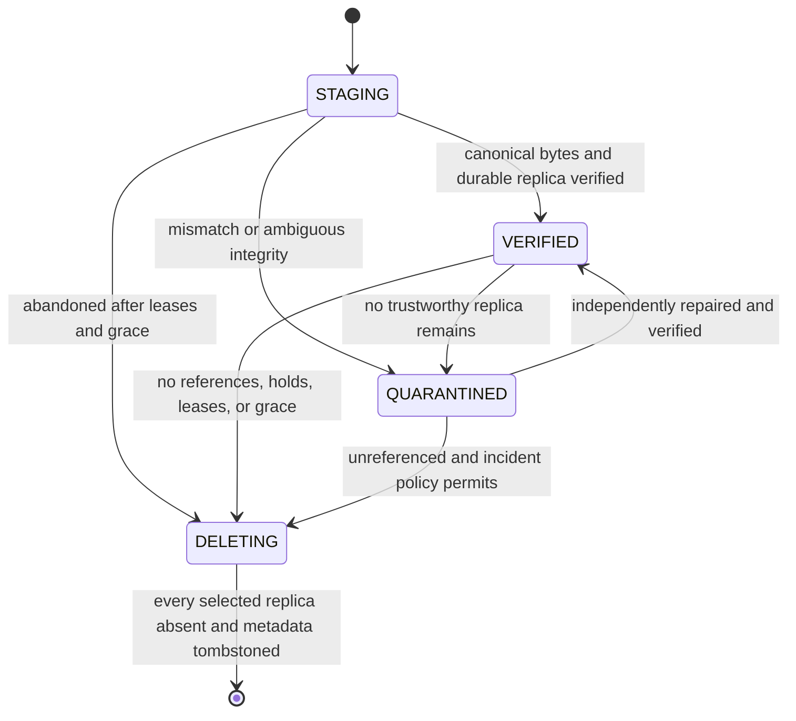
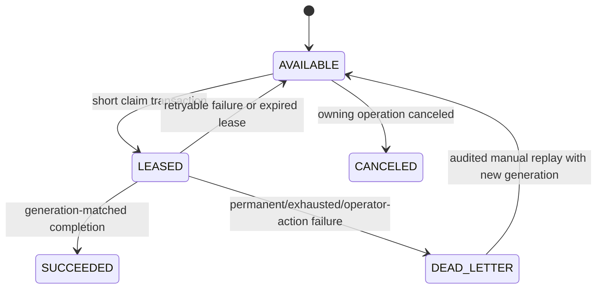

# Storage, object lifecycle, versions, and trash

Status: **PLANNED normative blueprint**

This document specifies Synveil's canonical byte-storage contract and the
logical lifecycle that sits above it. It is subordinate to accepted ADRs and
uses the entity meanings in [DOMAIN_MODEL.md](DOMAIN_MODEL.md). Upload protocol
details are in [UPLOADS.md](UPLOADS.md), client synchronization is in
[SYNC.md](SYNC.md), and protected backup history is in [BACKUP.md](BACKUP.md).

Nothing in this document is an implementation-status claim.

## Scope and ownership

The storage workstream owns:

- the `ObjectStore` port and adapter conformance suite;
- admission of local filesystem, NAS-mounted, S3-compatible/MinIO, and future
  storage adapters only through declared capabilities and that conformance
  suite;
- opaque physical-key generation and representation metadata;
- durable object promotion, read/range-read, verification, quarantine, replica
  management, leases, reconciliation, and garbage collection;
- the `Node -> FileVersion -> Object` lifecycle, including version restore;
- Trash/Recently Deleted metadata semantics and purge orchestration;
- logical, retained, staged, and physical storage accounting.

The upload module owns resumable transport and calls the storage port. The sync
module owns journal facts and conflict policy. The backup module owns snapshot
manifests and retention. None may call a local filesystem or S3 SDK directly;
they use the storage application service and `ObjectStore` port.

## Filesystem independence and capability acceleration

Synveil does not require Btrfs, WinBtrfs, a particular local filesystem, or a
filesystem-native snapshot feature. The correctness model is intended to work
with NTFS, ReFS, APFS, Btrfs, ext4, XFS, supported future ZFS, generic local
filesystems, NAS-mounted filesystems, and S3-compatible/object backends subject
to the adapter conformance gate.

The local/backend boundary is explicitly capability-based:

```text
StorageBackend
    ↓ declares and proves
StorageCapabilities
    ↓ informs
portable correctness paths and optional accelerators
```

`StorageCapabilities` may include:

```text
reflink                 block_clone
copy_on_write_clone     native_snapshot
compression             checksumming
sparse_files            atomic_rename
durable_fsync           range_reads
filesystem_health
```

The exact capability vocabulary and evidence version are adapter contracts.
Application logic must branch on declared evidence, not on an OS or filesystem
name. Missing capabilities use a correct portable path, remain visibly
unsupported, or disable an optimization. They never weaken the commit,
integrity, retention, sync, backup, restore, or deletion guarantee.

Btrfs may accelerate Linux deployments through reflink, compression, native
snapshots, scrub, or send/receive. NTFS/ReFS may expose Windows-native cloning,
integrity, or sparse-file paths. APFS may expose file clones and appropriate
native snapshots. These are optimizations only. Synveil versioning is not a
Btrfs snapshot, Synveil backup is not an APFS snapshot, and filesystem
replication is not Synveil sync. Synveil-native identity, journal, object
references, conflict handling, retention, integrity metadata, deduplication,
and restore semantics remain backend-neutral.

The storage picker may discover filesystem/capability details, capacity,
writability, removability, dangerous layouts, and safely available health
signals. Normal Personal / Home Mode UI presents “Internal drive”, “External
SSD”, capacity, and health; `Settings → Advanced` may reveal NTFS/APFS/Btrfs,
capability names, backend type, or durability profile. A storage choice never
silently initializes a broad or unexpected path.

## Non-negotiable invariants

1. A successful content-commit response references an immutable object whose
   canonical length and SHA-256 have been verified and whose selected replica
   is durable and readable according to its backend contract.
2. A `FileVersion` references only an `Object` in `VERIFIED`; a temporary,
   partial, `QUARANTINED`, or `DELETING` object is never a current file.
3. Physical keys are generated by the server, opaque, versioned, and unrelated
   to user names, paths, object IDs, or plaintext hashes.
4. Object bytes are immutable. Replacing content creates a new `FileVersion`
   and either a new object or a verified reuse inside the same dedup domain.
5. Renaming or moving a `Node` never copies or renames object bytes.
6. PostgreSQL is authoritative for object identity, logical references,
   lifecycle state, leases, and work. Backend listings are reconciliation
   evidence, never the sole source of truth.
7. No operation commits a database reference before the referenced bytes are
   durable. A durable write followed by a database rollback produces a safe
   orphan candidate, not a visible file.
8. Object deletion is two-phase, generation-checked, delayed by a safety
   window, and allowed only after all authoritative references, holds, and
   unexpired leases have been disproved.
9. A mutable reference-count column may be an optimization, but it is never
   sufficient evidence for deletion.
10. Authorization starts from an authenticated logical resource. An object ID,
    storage key, hash, backend ETag, or possession of a range URL is not an
    authorization grant.
11. Logical quota is independent from dedup savings. Equal content must not
    change another owner's API behavior, timing disclosure, or quota result.
12. Corruption is failed closed: Synveil quarantines the bad replica and never
    knowingly serves corrupt bytes as valid content.

## Logical and physical model

```text
Library
  -> Node (stable user-visible file or directory)
      -> current FileVersion (immutable revision metadata)
          -> Object (immutable canonical content identity)
              -> ObjectReplica (backend + opaque key + representation)
```

An `Object` is equality and lifecycle metadata for canonical plaintext bytes.
An `ObjectReplica` is one stored representation of those bytes. An initial
local deployment normally has one replica, but keeping the concepts separate
allows verified storage migration, repair, tiering, and future redundancy
without changing `FileVersion.object_id`.

The initial equality tuple is:

```text
(dedup_domain_id, hash_algorithm = SHA-256, plaintext_length, plaintext_hash)
```

Representation identity additionally includes codec, codec parameters/version,
encryption scheme/key version, stored length, and a stored-byte checksum. A
backend ETag is opaque adapter evidence; it is never treated as a SHA-256 or
content identity. Suspected hash collision, equal hash with unequal length, or
verification disagreement creates a distinct quarantined candidate and an
operator-visible integrity incident. It never overwrites an existing object.
The normal equality constraint is therefore partial to ordinary canonical
`VERIFIED` rows; quarantined collision candidates carry an incident/discriminator
and cannot be referenced. A confirmed same-length SHA-256 collision requires a
reviewed secondary identity/format migration and disables aliasing for those
bytes rather than forcing one row through the ordinary uniqueness rule.

### Recommended physical-key shape

The key generator emits a registered layout version plus random/opaque
components, for example:

```text
objects/v1/7f/2a/<opaque-random-key>
staging/v1/uploads/<opaque-session-key>/<opaque-part-key>
```

The example is not a public contract. Clients never see or construct it, and a
layout migration does not change public IDs. Generated components use a strict
server alphabet; no untrusted path component enters a key. A key is used for
one immutable representation and is never recycled, even after deletion.

## `ObjectStore` port

The port is streaming and capability-aware. Exact Rust types belong in the
reviewed crate contract, but the semantic operations are:

| Operation | Required semantics |
|---|---|
| Begin staged write | Create an exclusive server-named staging target and return an opaque handle. A collision cannot overwrite bytes. |
| Stream staged bytes/part | Apply declared and observed length limits while hashing with bounded memory. Failure leaves no committed object. |
| Inspect staged state | Return adapter evidence needed for safe retry; absence is explicit. |
| Abort staging | Idempotently remove/cancel a known staging handle, including a native multipart upload. |
| Finalize immutable | Produce one never-overwritten final key and a durability receipt. Duplicate retry either returns the same receipt or proves the already-finalized key. |
| `HEAD` immutable | Return existence, stored length, representation checksum/metadata, and opaque backend version evidence. |
| Read/range-read | Stream authorized logical bytes with bounded memory and precise range behavior; never return a partial success as a full object. |
| Delete immutable | Delete only a server-authorized key and expected replica generation/version; absence is idempotent success. |
| Enumerate owned prefix | Support reconciliation where available. Listing consistency is declared and listing is never used to authorize or establish a newly committed reference. |

A durability receipt contains at least the backend ID, final opaque key,
stored length, stored-byte checksum and algorithm, representation format and
version, backend object/version evidence, completion time, and which declared
durability checks succeeded. Only the application service can convert that
receipt into a `VERIFIED` object/replica record.

### Capability declaration

Each configured backend declares and proves, through conformance tests:

- atomic promotion support, if any;
- conditional/exclusive creation support;
- native multipart support and its minimum/maximum part rules;
- trustworthy checksum algorithms and whether they cover complete objects;
- read-after-write behavior for a completed key;
- listing consistency and pagination behavior;
- conditional/versioned delete support;
- range-read behavior;
- durability-flush guarantees exposed by the adapter;
- maximum object size and metadata limits.

Application code branches on explicit capabilities. It must not infer them
from an adapter name and must not reduce the success guarantee when a backend
is weaker. An adapter that cannot prove required read-after-write/durability
must delay success, use a stronger verification workflow, or be ineligible for
production writes.

## Local filesystem adapter

The local adapter is the initial implementation target. Its safety contract is:

- Resolve and validate the configured storage root at startup. The root has a
  Synveil storage-identity marker tied to `StorageBackend`; an absent or
  unexpected marker fails readiness rather than treating all objects as lost.
- Never concatenate a user file name, path, MIME type, or public ID into a
  filesystem path. Generated relative key components are validated again at
  the adapter boundary.
- Open staging and final files exclusively. Refuse symlinks, junction-like
  redirects, non-regular targets, or traversal outside the owned root. Use
  descriptor-relative/no-follow operations where the platform permits rather
  than canonicalize-after-open checks with race windows.
- Place promotion temporary data on the same filesystem as its final key.
  Stream to a temporary file, verify length/checksum, flush file data and
  required metadata, promote without replacement, then flush the containing
  directory according to the selected durability profile.
- Never expose a growing file at a final key. A crash before promotion leaves
  only staging; a crash after promotion leaves either the complete immutable
  file or a receipt that recovery can reconstruct with `HEAD` and hashing.
- Treat short writes, `ENOSPC`, quota errors, read-only mounts, I/O errors, and
  flush failures as storage failures. Do not record the affected part/object as
  verified.
- Do not assume every NAS-mounted filesystem provides local atomic-rename or
  `fsync` semantics. A NAS path is accepted only after the same adapter
  conformance and crash tests, with limitations surfaced in health output.

The adapter must also carry platform-specific implementations behind the same
contract: Windows path/reparse-point and service lifecycle rules, macOS APFS
and permission/sleep behavior, and Linux filesystem/mount behavior. No platform
path may leak into domain invariants.

Startup does not recursively scan all content before serving. It validates
identity/configuration and schedules bounded reconciliation. Missing referenced
objects make readiness degraded or failed according to scope; they are never
silently recreated as empty files.

## S3-compatible adapter

S3/MinIO is a later adapter, not an early deployment dependency. Its contract
differs deliberately from a filesystem:

- Use a never-before-used final key. Do not emulate rename by copy-and-delete
  and call that atomic promotion.
- A native multipart upload remains staging until successful complete. Persist
  its upload identifier and part receipts as opaque adapter data; abort is
  idempotent and cleanup also lists abandoned multipart uploads defensively.
- After completion, perform the capability-required `HEAD`/read verification
  before metadata commit. A complete call whose response is lost is recovered
  by inspecting the preassigned final key; it is not answered by blindly
  creating a second key.
- Never interpret multipart ETags as plaintext MD5 or SHA-256. Generic
  S3-compatible checksum support varies; canonical SHA-256 is computed or
  verified through the upload protocol independently.
- Record provider version ID where bucket versioning is enabled, but do not
  require versioning for object immutability. Conditional creation and delete
  use adapter-supported preconditions when available.
- Listing may lag. Direct `HEAD` of a known key and PostgreSQL records drive
  recovery; repeated bounded listing is only orphan evidence.
- Signed direct-upload/download URLs are not an initial shortcut. If later
  enabled, they require an ADR/protocol extension covering checksum proof,
  content-length enforcement, expiry, revocation limits, authorization,
  audit, and prevention of a content-presence oracle.

## Object and replica state machines

### Object state



Only `VERIFIED` can acquire a new authoritative reference. Transition to
`DELETING` locks the object row and closes that gate. Recovery does not move a
missing/corrupt object back to `VERIFIED` without new verification evidence.

### Replica state

```text
COPYING -> VERIFIED -> DELETING -> deleted/tombstoned
    |          |
    v          +-> MISSING
  CORRUPT <--------+
```

At least one `VERIFIED` replica is required for an object to remain readable.
If one replica fails but another verifies, reads route to the healthy replica
and a repair job is durable. If none verifies, the object is quarantined and
all affected logical references remain known for operator recovery.

### Object leases

Leases protect non-reference work such as upload assembly, a snapshot being
built, active restore, migration copy, or integrity repair. Each lease has
object/staging identity, purpose, owner operation ID, generation, and bounded
expiry. Renewal is conditional on generation. A stale worker cannot extend or
release a successor's lease. Leases expire and are reconciled; they are not a
substitute for a committed `FileVersion` or `BackupEntry` reference.

## Durable-first content commit

Content commit is a small saga with an atomic PostgreSQL finish:

1. Persist operation/session intent, destination, base condition, quota
   reservation, preassigned final key, and idempotency identity.
2. Stream/assemble to staging with bounded resources.
3. Compute canonical length/SHA-256, finalize one immutable representation,
   and obtain a durability receipt.
4. Verify the known final key through the selected backend. Persist enough
   receipt evidence for recovery before attempting the logical commit.
5. In one database transaction, lock the operation and affected logical rows;
   revalidate authorization, base version/revision, name and quota; select or
   create the dedup-domain `Object`; create or attach the verified
   `ObjectReplica` that binds the selected backend/key/representation receipt
   to that object (or record the unselected representation for grace-protected
   orphan disposition); create its logical reference and immutable
   `FileVersion`/backup manifest binding; update current logical state; append
   journal, audit, required job/outbox, accounting, and idempotent outcome.
6. Commit, then return the stored outcome. Optional consumers execute later.

If step 3 fails, no metadata is visible. If steps 3-4 succeed and step 5 rolls
back, the final key is an orphan candidate protected by the operation lease and
global orphan grace. A retry of the same operation reuses/re-verifies it. If
step 5 commits and the process crashes before responding, the idempotency lookup
returns exactly the committed IDs, ETag, and journal result.

Do not hold a PostgreSQL transaction open while uploading, hashing a large
object, copying a replica, calling S3, or waiting for a worker.

## Whole-object deduplication

Deduplication occurs only after server verification. The commit transaction
looks for an existing `VERIFIED` object with the same equality tuple inside the
same `dedup_domain_id`:

- If a trustworthy object exists, create a new logical reference to it and let
  the newly written verified representation become a delayed orphan, or attach
  it as an explicitly desired replica. The choice must not affect the response
  in a way that reveals content outside the domain.
- If concurrent transactions race, a unique constraint on the equality tuple
  selects one canonical object. The loser re-reads the winner and commits its
  logical reference; its unselected bytes remain grace-protected orphan data.
- Never accept a client hash as proof that bytes already exist. An optimization
  that skips upload needs a reviewed proof-of-possession protocol and must stay
  inside the dedup domain.
- Restoring an older version or reusing an unchanged backup entry adds a
  reference without copying bytes.

Chunk-level deduplication is an advanced `PLANNED` capability, not an initial
storage profile. It changes corruption blast radius, manifest formats, range
reads, encryption, GC, and repair, and requires a separate accepted ADR,
measured justification, and storage-format migration plan before implementation.

## Representation compression policy

Compression is a `PLANNED` Phase 6 physical-representation optimization. The
initial correctness profile stores canonical bytes pass-through. Enabling or
changing a codec never changes `Node`, `FileVersion`, canonical plaintext
length/SHA-256, retention, authorization, or logical quota truth.

The first candidate codec is Zstandard with a small, versioned set of parameter
profiles. Selection is deterministic and policy-based:

1. Treat MIME type and filename extension as untrusted hints. Use a bounded
   sample and an allowlist/denylist, minimum size, maximum CPU/concurrency
   budget, and expected space-saving threshold.
2. Text, JSON, CSV, logs, database dumps, and source code are likely candidates
   only after corpus measurements. Do not blindly recompress JPEG, WebP, AVIF,
   MP4, MKV, ZIP, 7z, another already-compressed representation, or encrypted
   data.
3. Fall back to pass-through when sampling is ambiguous, compression expands
   data, a codec/version is unavailable, resource limits are reached, or the
   active range-read profile cannot be honored.
4. Record the decision and algorithm generation so the same object remains
   readable after policy changes. A new policy affects new/re-encoded replicas,
   not the interpretation of an existing representation.

Each compressed `ObjectReplica` records at least:

- representation format/version (`IDENTITY` or a named Zstandard profile),
  codec parameters/dictionary identity where any dictionary is ever allowed;
- canonical plaintext length and SHA-256 from `Object`;
- stored representation length and independent stored-byte checksum;
- optional versioned seek/chunk index identity and encoded logical range;
- backend/key, creation/verification time, and reader compatibility floor.

Reads stream through a bounded decoder and verify declared lengths. A full read
can verify canonical SHA-256; the stored checksum detects representation
corruption before or during decoding. The decoder rejects output beyond the
declared plaintext length, excessive expansion, malformed frames, unsupported
dictionaries, or configured resource limits, so a corrupt representation
cannot become a decompression bomb.

Transparent decompression does not justify a false range promise. Whole-object
Zstandard generally makes arbitrary logical range reads expensive. A backend
may advertise logical `Accept-Ranges` only when pass-through storage or a
versioned independently decodable chunk/seek format satisfies the requested
range with bounded work. Otherwise compression remains disabled for that
profile until OD-STORAGE-003 is closed.

Whole-object deduplication compares verified canonical plaintext identity
before choosing a representation, so equal content can reference one `Object`
even if replicas use different codec generations. Physical savings from dedup
and compression are measured separately; users see logical/retained, staged,
physical, and saved-byte estimates without one optimization changing quota or
retention semantics.

If application-managed encryption is later enabled, readable content is
compressed before encryption. Ciphertext is not usefully compressible, and an
E2EE mode cannot silently retain server-side compression/dedup/indexing
promises. Re-encoding is an asynchronous replica migration: write, decode and
verify a new immutable representation, transactionally switch/add the selected
replica, wait through leases/rollback grace, then retire the old representation.
Export and restore always yield canonical plaintext bytes after authorization.

## Versioning contract

A file's current content is an immutable `FileVersion`; its history is never
rewritten.

| Operation | Version effect |
|---|---|
| Create file | Create first version and point the new node to it atomically. |
| Replace/sync edit | Create a child version from the accepted base and update the node head atomically. |
| Rename/move | Increment node metadata revision only; do not create a content version. |
| Copy | Create a new node and a new `FileVersion` record that may reference the same object; do not share mutable node identity. |
| Restore old version | Create a new head version referencing the historical object's bytes and recording source `RESTORE`; never move the head pointer backward to rewrite history. |
| Conflict | Preserve incoming bytes in a conflict version/node according to [SYNC.md](SYNC.md); never replace the winning head silently. |
| Trash | Preserve versions and object references throughout Trash retention. |
| Purge/retention expiry | Remove logical version references under durable purge work; physical object GC remains separate. |

Every content mutation supplies an operation-appropriate base version. A node
revision protects metadata mutations. Neither an `Object` ID nor an
`ObjectReplica` physical key ever serves as a concurrency token.

Version retention policy is explicit and versioned. A policy may keep all,
keep a duration/count, or place a hold, but it cannot remove the current
version, a version required by a retained snapshot, a conflict still exposed to
the user, or any other protected reference. Retention first expires logical
references; object GC later determines whether bytes are physically deletable.

## Trash / Recently Deleted

Trash is a user-visible soft deletion in the live sync domain. It is not backup
retention and it is not physical deletion.

### Trash transaction

For one node or directory subtree, a single PostgreSQL transaction:

1. authorizes the actor and locks the target plus required ancestry/name rows;
2. verifies the expected node revision and, for a recursive directory action,
   the server-issued subtree precondition; it also checks that no ancestor
   already makes the operation redundant;
3. changes the subtree root to `TRASHED` and records one `TrashEntry` with its
   former parent/name, actor, deletion operation, and purge deadline;
4. makes the entire subtree inaccessible to ordinary live-tree mutation and
   traversal through effective ancestor state;
5. appends a recursive tombstone `ChangeEvent`, audit fact, required jobs, and
   idempotent outcome under the library sequence transaction;
6. commits without deleting any `FileVersion` or object reference.

No descendant mutation may slip through after the subtree decision. The initial
correctness profile acquires the library namespace-mutation guard before every
transaction that mutates a `Node`; Trash holds that guard through commit. A
future finer-grained scheme may use shared ancestor/exclusive subtree locks, but
must prove the same edit-versus-Trash ordering before replacing the guard.

The physical schema may place trashed subtree roots in a hidden server-managed
namespace or retain ancestry plus an effective-state index. Either layout must
preserve stable node IDs, make active sibling name reuse possible, prevent a
trashed descendant from being edited, and pass the same subtree race tests.
It must not update every descendant merely to make a large directory vanish.

A client applies the recursive tombstone to its local subtree. A client that
does not possess the complete subtree invalidates the known root and reconciles
through the node/snapshot API; it does not infer that missing children are new
uploads.

### Restore transaction

Restore is conditional and explicit:

- The API identifies the `TrashEntry`, expected trash revision, target parent,
  and collision policy. Default is the recorded parent/name if both remain
  valid.
- If the parent was purged, authorization changed, or the name is occupied,
  return the current facts and require an explicit alternate parent/name (or a
  reviewed non-destructive rename policy). Never overwrite the occupying node.
- The transaction restores the subtree root to `ACTIVE`, removes/marks the
  trash context restored, increments revision, and appends restore change,
  audit, outbox, and idempotent outcome. Descendant bytes and versions are
  unchanged.
- Restoring a directory restores its retained subtree. A nested independent
  trash entry, if the product later permits one, remains trashed; initial
  behavior should reject redundant nested trash operations to avoid ambiguity.

### Purge state machine

```text
TRASHED --retention/manual confirmation--> PURGING --batched durable job--> logical tombstone
   ^                                          |
   +--------------- restore -----------------+  (only before PURGING begins)
```

Entering `PURGING` is a transactionally audited point of no return at the
logical layer. A job walks the subtree in deterministic bounded batches,
removes authoritative version/reference rows, records progress, and can resume
after a crash. The root remains hidden and immutable while partial work exists.
Completion retains a compact tombstone for the journal/replay policy and
releases objects only to the separate GC eligibility workflow. A failed purge
does not make partially purged data appear live.

Trash continues to consume retained logical quota by default. The UI reports
live, historical-version, Trash, backup, staging-reserved, and physical bytes
separately so users can understand why deletion has not freed capacity.

## Garbage collection and orphan reconciliation

### Eligibility proof

An object can become a GC candidate only when all of these are true in a
transaction that locks its lifecycle row:

- state is `VERIFIED` or an incident-approved unreferenced `QUARANTINED` state;
- no current or historical `FileVersion` protected by its retention policy
  references it;
- no `COMMITTED` backup/repository snapshot or retained derivative references
  it;
- no Trash, legal/administrative hold, migration/repair plan, or active restore
  protects it;
- no unexpired `ObjectLease` or staging/upload claim protects the key;
- the object and every possible reference-removal transaction are older than
  the configured safety window;
- reconciliation has no unresolved ambiguity for that backend/key.

The transaction sets `DELETING`, increments a delete generation, and inserts a
unique delete job. Because new references may target only `VERIFIED`, no new
reference can race in after this transition.

### Delete job

The worker claims the generation, deletes each selected replica with expected
key/version evidence, verifies absence as required, and records the result.
Backend absence is idempotent success. A transient backend error retries with
backoff. A permission/configuration error becomes operator-action state; the
database record remains `DELETING`. After every replica is confirmed absent, a
short transaction tombstones/finalizes metadata. If bytes were deleted but the
final transaction failed, retry observes absence and finishes safely.

No cleanup command accepts an arbitrary user path, unbounded prefix, or empty
backend target.

### Orphan classes

- **Staging orphan:** part/temp/multipart state no longer referenced by an open
  session or valid lease. Cleanup uses the upload expiry plus safety grace.
- **Final-key orphan:** immutable bytes were finalized but no object/reference
  transaction committed. Recovery first checks session/operation receipts and
  may resume commit; only then may grace-based cleanup delete them.
- **Metadata orphan:** PostgreSQL references a missing/corrupt replica. This is
  data-loss/quarantine work, never an instruction to delete the metadata.
- **Duplicate verified representation:** concurrent dedup produced extra
  verified bytes. It follows normal final-key orphan handling.

Reconciliation is periodic, paginated, restartable, rate-limited, and records a
watermark/cursor per backend. Multiple passes older than grace are required
before destructive action on eventually consistent listings. Findings produce
metrics and durable repair/cleanup jobs, not immediate inline deletion.

## Integrity verification and reads

Every upload computes plaintext length and SHA-256. Every representation also
has a stored-byte checksum. Verification levels are explicit:

- **Commit verification:** required before first reference; validates canonical
  length/hash and durable representation receipt.
- **Read verification:** validates backend/provider checksum where trustworthy;
  full reads may validate plaintext SHA-256 before claiming verified delivery.
- **Scrub verification:** periodic bounded job re-reads stored bytes, validates
  representation and canonical content, and records evidence/time.
- **Restore verification:** validates the exact source object and destination
  result under [BACKUP.md](BACKUP.md).

Range reads return logical byte ranges. A stored codec that cannot support
arbitrary logical ranges must either decode through a bounded server path,
store a versioned seek/chunk index, or be excluded from range-served canonical
objects. The API never return ranges over compressed representation bytes while
labeling them file offsets.

On mismatch, stop the stream if possible, mark the replica suspect through a
durable incident command, try another already-verified replica, and return a
stable `object_corrupt`/`storage_unavailable` response. Do not repair by copying
from an unverified source. A backup manifest that references the same sole
physical replica is historical protection, not an independent corruption
failure domain; operations documentation must say so.

## Accounting and capacity

Track at least these dimensions independently:

| Metric | Meaning |
|---|---|
| Live logical bytes | Current visible file sizes under the policy's counting rule. |
| Historical-version bytes | Logical sizes retained by file-version policy. |
| Trash bytes | Logical sizes still restorable from Trash. |
| Backup logical bytes | Sum represented by retained snapshot manifests under the selected reporting view. |
| Staging bytes/reservation | Incomplete physical bytes plus reserved expected logical bytes. |
| Physical stored bytes | Actual replica representation lengths, including temporary/duplicate/orphan classes where measured. |
| Dedup/compression savings | Derived estimate only; never authorization or deletion truth. |

Initiating an upload reserves expected logical capacity and enforces per-user,
per-library, per-session, and instance staging limits. Committing converts the
reservation atomically. Expiry/abort releases it idempotently. Dedup does not
erase logical usage. Disk-free probes are advisory; every write must still
handle `ENOSPC`/provider quota atomically and safely.

## Storage-backend migration

Migration is per-replica copy and verified switch:

1. register and health-check the destination backend without changing current
   reads;
2. create a migration operation and leases for a bounded object batch;
3. stream from a verified source to a new opaque destination key;
4. verify canonical content and destination representation;
5. transactionally add/switch the `VERIFIED` replica and record audit/progress;
6. retain the old replica through a rollback window;
7. retire old replicas only through normal two-phase deletion;
8. retire a backend only after a proof query shows it is not the sole verified
   location of any protected object.

Copy failure leaves the existing location authoritative. Mixed backends are a
normal migration state. Editing a mount path or bucket prefix in configuration
is not migration and must fail storage-identity validation.

## Change, audit, outbox, and job boundaries

These records have distinct audiences and retention:

- `ChangeEvent` is an ordered library fact for sync clients and is specified in
  [SYNC.md](SYNC.md).
- `AuditEvent` is append-oriented accountability/security evidence. It records
  actor, action, target, outcome, correlation, and safe reason—not file content,
  secret, or raw storage key.
- `OutboxEvent` is a committed domain fact/follow-up handoff inserted in the
  same transaction as the mutation.
- A `Job` is executable at-least-once work with a stable identity, payload
  schema version, attempts, availability time, lease, and terminal state.

Required work should be inserted directly as a job in the core transaction when
no separate fan-out is needed. If an outbox dispatcher creates jobs, a unique
consumer/event identity makes that conversion idempotent; there is never an
unprotected in-memory handoff.

### Job state and lease protocol



Workers claim bounded batches using row locks/`SKIP LOCKED`, set
`lease_owner`, `lease_generation`, `lease_until`, and attempt count, then commit
before doing external or long work. Heartbeat, success, and failure updates are
conditional on the same generation. A worker that resumes after losing its
lease cannot complete or overwrite the successor's result. Handlers use a
unique semantic key such as `(job_kind, aggregate_id, aggregate_revision)` and
verify current state before acting.

Retries use classified exponential backoff with jitter and a cap. Integrity,
authorization, invalid format, and missing-secret failures are not retried in a
tight loop. Queue oldest age, attempts, expired leases, dead letters, and job
duration are metrics. Manual replay is audited and never edits a historical
outbox payload in place.

## Error contract

Storage-facing APIs use stable codes and safe detail:

- `not_found` for an authorized logical resource that is absent;
- `permission_denied` without revealing cross-owner object existence;
- `version_conflict` or `name_conflict` for conditional logical mutations;
- `quota_exceeded` for policy capacity rejection;
- `storage_unavailable` for retryable backend/disk/flush failure;
- `object_corrupt` for a known integrity failure;
- `invalid_range` for an unsatisfiable logical byte range;
- `resource_in_trash` or `purge_in_progress` for invalid lifecycle actions;
- `internal_error` with correlation ID, never a filesystem path, bucket secret,
  SQL error, or stack trace.

Retryability is explicit. HTTP success is not returned until the relevant
strong boundary is satisfied.

## Crash and failure matrix

| Crash/failure point | Required recovery |
|---|---|
| Process dies during staging stream | No verified part/object is recorded; exclusive temp is removed after session lease/grace. |
| Disk fills or flush fails | Stop stream, report retryable storage/capacity error, keep no visible version, reconcile partial temp. |
| Final local rename/remote complete succeeds but receipt update is lost | Preassigned key plus session intent lets recovery `HEAD` and re-verify; never create a second logical result. |
| Object durable, PostgreSQL commit rolls back | No logical reference; retry same operation or classify as orphan after lease and grace. |
| PostgreSQL commits, response is lost | Persisted idempotency result returns the same node/version/event outcome. |
| Dedup transactions race | Equality uniqueness chooses one canonical object; both logical operations can reference it; loser bytes are delayed orphan. |
| Worker dies after job claim | Lease expires; another worker retries. Stale generation cannot complete. |
| Worker dies after backend delete but before DB update | Retry treats absence as success and finalizes the same delete generation. |
| Backend loses a referenced key | Preserve metadata, quarantine/mark replica missing, try verified replica or operator restore; never convert loss into user deletion. |
| Reconciliation listing omits a key | No destructive conclusion from one listing; direct known-key checks and repeated grace-separated passes are required. |
| Storage root/bucket configuration changes unexpectedly | Fail readiness with storage identity error; do not initialize an empty replacement automatically. |

## Required tests

### Adapter conformance

- stream zero-byte, small, multipart-sized, and maximum-policy objects without
  whole-file buffering;
- exclusive key collision and concurrent finalization never overwrite;
- exact and suffix/prefix range behavior, invalid ranges, canceled readers, and
  backpressure;
- crash before/after flush and promotion/complete, including a lost completion
  response;
- short writes, disk full, read-only backend, permission loss, timeouts, and
  transient provider errors;
- stored checksum mismatch, truncation, extra bytes, stale ETag/version, and
  corrupt metadata;
- idempotent abort/delete and delete-generation mismatch;
- local symlink/path traversal/race fixtures and storage-root identity mismatch;
- S3 multipart ETag not treated as canonical hash, eventually consistent list,
  and direct known-key recovery;
- bounded memory and file-descriptor use under concurrent large streams.

### Lifecycle and transaction integration

- no `FileVersion` can reference non-`VERIFIED`/wrong-domain content;
- rename/move of a multi-gigabyte node performs no object operation;
- restore creates a new immutable head and keeps the selected old version;
- concurrent identical uploads dedup to one canonical object without losing
  either logical outcome;
- SHA-256/length inconsistency quarantines rather than aliases;
- object durable + forced DB rollback leaves no visible file and is recovered
  or collected only after grace;
- DB commit + dropped response replays the identical result;
- reference creation racing GC either commits before `DELETING` or fails and
  retries; it never points to deleted bytes;
- refcount drift cannot cause deletion while an authoritative reference exists;
- migration copy corruption never switches the verified location;
- sole-replica backend cannot retire.

### Versions and Trash

- rename, move, copy, content replace, old-version restore, and conflict have
  exactly the specified version effects;
- recursive Trash is atomic to clients without O(subtree) inline mutation;
- offline descendant mutation versus Trash follows [SYNC.md](SYNC.md) conflict
  recovery and never silently resurrects/deletes bytes;
- restore succeeds to the old parent, reports a deleted parent, and handles an
  occupied name only through explicit policy;
- purge racing restore has one point-of-no-return winner;
- process crash in every purge batch resumes without a visible partial subtree;
- Trash/version/backup references keep bytes alive; final reference expiry only
  makes the object GC-eligible;
- stale clients receive tombstones or a mandatory rebaseline, never a false
  active node.

### Property/fuzz and operations

- generated keys can never escape the owned namespace for arbitrary Unicode,
  separators, NUL-like input, reserved names, or long input;
- randomized reference/lease/retention transitions never delete a protected
  object;
- randomized job lease expiry ensures at-least-once execution and only one
  generation can record completion;
- repeated reconciliation is idempotent under missing, duplicate, and reordered
  listing pages;
- a restore drill from coordinated PostgreSQL/object/configuration backup finds
  every referenced object and reports all extra objects as safe candidates.

## Observability and operational gates

Expose metrics for staged/final bytes, upload/orphan age, objects by lifecycle,
replicas missing/corrupt, verification age, GC candidate/delete failures,
logical/physical accounting lag, storage latency/error class, backend capacity,
job queue age/leases/dead letters, and Trash/purge backlog. Structured logs use
operation/request IDs and public domain IDs where policy permits, but redact
user paths, object keys, hashes when sensitive, and all credentials.

The production gate requires adapter conformance, crash-injection evidence,
disk-full handling, a GC dry-run/report mode, a successful backup/restore drill,
and runbooks for quarantine, root-identity mismatch, full disk, dead letters,
and orphan backlog.

## Open decisions

OPEN DECISION OD-STORAGE-001: local durability profile
Owner: Storage / Operations
Needed by: Phase 1 local adapter production gate
Options: require data and directory `fsync` for every committed object; group durable flushes with an explicitly bounded loss window; expose operator-selectable strict and relaxed profiles
Recommendation: ship `STRICT` as the documented default and permit no relaxed profile until crash/power-loss tests on supported filesystems quantify and clearly label its weaker guarantee
Decision evidence: filesystem/container/NAS crash matrix, latency benchmark, and recovery drill

OPEN DECISION OD-STORAGE-002: portable namespace comparison
Owner: Architecture / Storage / Sync
Needed by: Phase 1 schema and API freeze
Options: case-sensitive NFC comparison; portable case-insensitive comparison; immutable per-library policy
Recommendation: use a portable case-insensitive comparison key as the baseline, preserve original display names, and version the exact Unicode normalization/folding algorithm before migrations
Decision evidence: Windows/macOS/Linux Unicode, normalization, reserved-name, and case-collision fixtures

OPEN DECISION OD-STORAGE-003: initial representation and range strategy
Owner: Storage / API / Performance
Needed by: Phase 6 compression format gate; not blocking pass-through storage
Options: pass-through canonical bytes only; whole-object Zstandard with server decoding; versioned independently compressed chunks plus seek index
Recommendation: use pass-through bytes initially; adopt compression only after range-read, corruption-repair, and measured space/CPU evidence selects a versioned format
Decision evidence: representative corpus benchmarks, random-range conformance, memory limits, and corruption tests

OPEN DECISION OD-STORAGE-004: version and Trash quota policy
Owner: Product / Storage / Backup
Needed by: Phase 2 quota and retention UI gate
Options: all retained logical bytes count; current/live bytes count with separate retention cap; configurable per-library accounting
Recommendation: count all retained logical bytes against transparent domain-specific limits and always report physical usage separately; avoid letting dedup change a user's logical quota
Decision evidence: product policy, abuse analysis, migration behavior, and UI usability test

OPEN DECISION OD-STORAGE-005: initial cross-platform capability matrix
Owner: Storage / Platform / Clients / QA
Needed by: cross-platform foundation gate and first native/local adapter release
Options: portable pass-through path only; per-filesystem acceleration profiles;
  capability probes with a conservative fallback profile
Recommendation: implement one portable correctness profile first and add
filesystem accelerators only after capability probes, crash evidence, and
disable/fallback behavior are versioned
Decision evidence: NTFS/ReFS/APFS/Btrfs/ext4/XFS/NAS fixtures, power-loss and
disconnect tests, capability false-positive tests, and performance evidence
