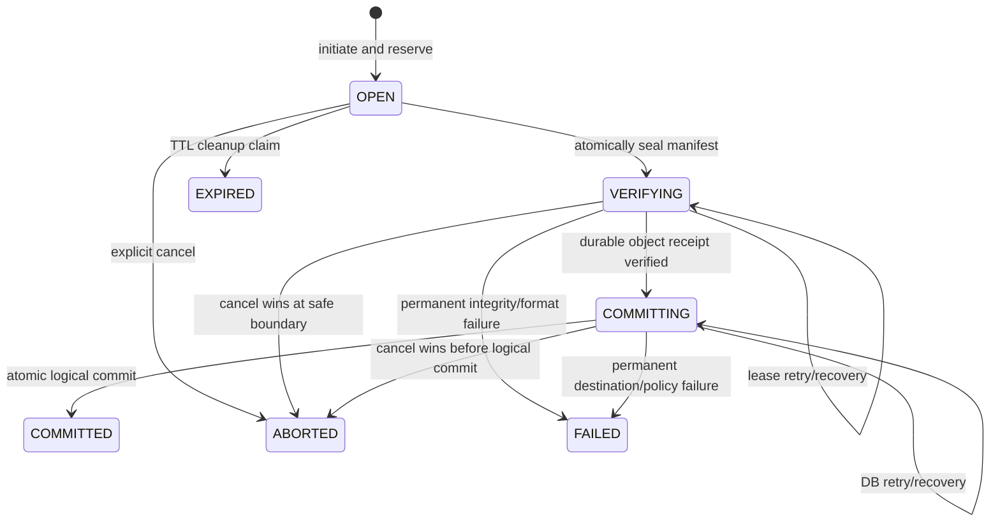
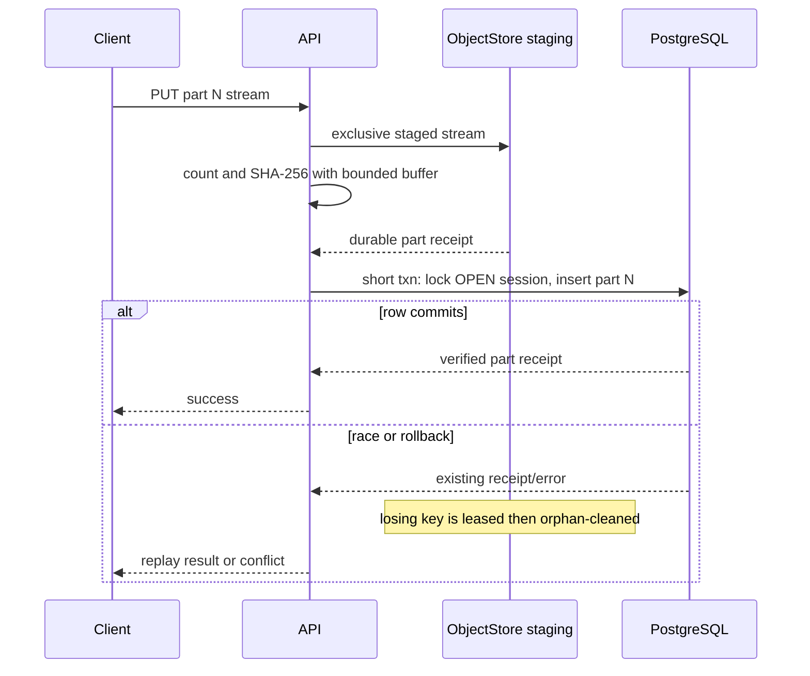

# Resumable upload protocol

Status: **Normative blueprint; persisted upload-session/application-service subset IMPLEMENTED/VALIDATED; exact-offset HTTP byte transport IMPLEMENTED**

This document specifies the server-coordinated resumable upload state machine.
It follows ADR-005, the canonical entities in
[DOMAIN_MODEL.md](DOMAIN_MODEL.md), and the durable object contract in
[STORAGE.md](STORAGE.md). The repository now implements the bounded persisted-
session and transport-neutral application-service subset described below. The
authenticated exact-offset HTTP subset is now implemented and specified in
[`api/openapi.yaml`](../../api/openapi.yaml). The larger part-manifest protocol
remains blueprint material; this document does not claim it is implemented.

## Current repository implementation boundary

The current implementation provides:

- PostgreSQL `upload_sessions` persistence plus the first verified
  `object_replicas` record, with owner/library/target intent, opaque staging and
  object identities, progress, leases, expiry, terminal errors, durability
  evidence, and completion outcome;
- `CREATE_FILE` and `REPLACE_CONTENT` target semantics with an expected node
  revision recheck at finalization;
- exact-offset append, bounded object/chunk/session limits, staging progress
  reconciliation, safe status projections, and the public state sequence
  `OPEN -> VERIFYING -> COMMITTING -> COMMITTED` with terminal failure,
  expiry, and abort states;
- durable local staging, checksum verification, create-only promotion, and
  post-promotion read/integrity confirmation through the backend-neutral
  `ObjectStore` port; and
- the storage application service and focused restart/idempotency/integrity/
  version-conflict tests; and
- authenticated upload-session create/status/append/complete/abort routes,
  CSRF on every mutation, bounded streaming raw-byte append, stable safe
  errors, authoritative offset recovery, and typed browser API helpers.

`UploadPart`, ordered manifests, richer idempotency fingerprints, quota
reservation, worker scheduling, and GC execution remain future work and must
not be inferred from this exact-offset HTTP subset. The separate
transport-neutral content-read application service and authenticated HTTP
download transport are documented in [STORAGE.md](STORAGE.md) and
[API_ARCHITECTURE.md](API_ARCHITECTURE.md); upload product UI, download UI,
sync, and backup remain planned.

## Implemented exact-offset HTTP subset

The current canonical transport is deliberately smaller than the future
part-manifest blueprint:

| Method and path | Implemented contract |
|---|---|
| `POST /api/v1/upload-sessions` | Strict 16 KiB tagged JSON for `CREATE_FILE` or `REPLACE_CONTENT`; authenticated identity is the owner and mutations require the existing CSRF proof. |
| `GET /api/v1/upload-sessions/{upload_session_id}` | Owner-scoped safe state plus authoritative `Upload-Offset`; authentication is required but CSRF is not. |
| `PATCH /api/v1/upload-sessions/{upload_session_id}` | Non-empty `application/octet-stream`, one canonical unsigned-decimal `Upload-Offset`, and an aggregate service-configured chunk limit (8 MiB by default). |
| `POST /api/v1/upload-sessions/{upload_session_id}/complete` | Calls only the validated completion service and returns canonical, retry-stable completion metadata. |
| `POST /api/v1/upload-sessions/{upload_session_id}/abort` | Calls only the validated abort service; a repeat is safe and API code never deletes storage directly. |

The PATCH body is forwarded frame by frame into the upload application service;
the HTTP handler never aggregates the complete chunk. Every accepted frame goes
through durable exact-offset append and progress persistence. Consequently a
disconnect, timeout, or chunked request that crosses the aggregate limit may
leave a prefix durably accepted even when the caller receives no success. This
is intentional recoverable ambiguity, not permission to guess progress:

```text
ambiguous PATCH outcome
    -> GET the same upload session
    -> read Upload-Offset / received_bytes
    -> resume exactly at that offset
```

A stale or gap offset returns `409 invalid_offset`, includes the authoritative
`Upload-Offset` header and `current_offset` safe detail, and appends no bytes.
The browser helper sends `Blob`/`ArrayBuffer` directly and follows the returned
offset; it does not base64-encode content or implement upload UI.

The current executable wires this service only when both `DATABASE_URL` and an
explicit absolute `SYNVEIL_OBJECT_ROOT` are configured. Without either
dependency the authenticated routes fail closed with a safe dependency error.
This wiring is a developer/runtime composition boundary, not production
deployment support.

## Goals and non-goals

The protocol must:

- stream files larger than memory through unreliable networks;
- resume without retransmitting already verified parts;
- make part upload, sealing, verification, and completion idempotent;
- survive API/worker/PostgreSQL/object-store crashes at every boundary;
- verify canonical length and SHA-256 before a visible `FileVersion` exists;
- serialize concurrent completion and replay a lost success response;
- bound session count, object size, part count, memory, hashing concurrency,
  temporary storage, and quota reservations;
- support the local adapter first and an S3/MinIO adapter without assuming
  filesystem rename.

The initial protocol does not provide peer-to-peer upload, unverified
client-to-bucket signed URLs, chunk-level deduplication, streaming compression
format negotiation, or an upload endpoint that exposes raw object keys.

## Protocol invariants

1. An `UploadSession` is staging intent, not a visible file or version.
2. Initiation freezes owner/device, library, destination operation, expected
   total length, base precondition, part policy, expiry, and request identity.
3. A part becomes `VERIFIED` only after the server has streamed all bytes,
   enforced length, computed a checksum, durably staged them, and committed the
   part receipt in PostgreSQL.
4. A session in `VERIFYING` or later accepts no new/replacement/deleted parts.
5. Exactly one ordered manifest is sealed. Gaps, overlaps, duplicate ranges,
   overflow, undersized non-final parts, and excessive part count fail before
   assembly.
6. Exactly one terminal completion outcome can win. A retry with the same
   semantic request returns that stored outcome.
7. Canonical SHA-256 is server-verified over the complete logical byte stream;
   a client-provided hash is an expectation, never proof of existing content.
8. Database transactions never remain open while receiving a body, assembling
   parts, hashing a large file, flushing a file, or completing S3 multipart.
9. A committed upload implies the immutable object is durable. Durable bytes
   without a committed outcome remain leased/recoverable and later become
   grace-protected orphan candidates.
10. Quota and staging capacity are reserved before accepting unbounded work and
    finalized/released transactionally.

## Resource model

### Session intent

Initiation records at least:

- session ID, owner user, authenticated device/session, target library, and
  dedup domain;
- operation `CREATE_FILE` or `REPLACE_CONTENT`;
- for create: target parent ID, requested display name, and expected parent
  revision/name policy context;
- for replace: target node ID and required `base_version_id`; metadata ETag may
  be supplied for a stricter interactive precondition;
- conflict policy: `FAIL` for ordinary interactive/API uploads or the explicitly
  authorized `PRESERVE_COPY` policy for sync ingestion;
- required expected plaintext length, optional expected `sha256`, media type,
  client modification time, and bounded untrusted metadata;
- negotiated part-size/minimum/final-part rules, maximum part count, and
  checksum algorithms;
- preassigned opaque staging/final storage intent, quota reservation, expiry,
  and recovery lease metadata;
- initiation and completion idempotency identities, request fingerprints, and
  stored terminal result/error.

The destination cannot be retargeted after initiation. A caller that chooses a
different parent, node, name, content length, or base creates a new session.
This prevents a verified byte set from being replayed into a more privileged
destination.

### Part identity

The initial protocol uses consecutive integer part numbers beginning at zero.
The server derives each expected logical range from negotiated part size and
total length; clients do not submit arbitrary overlapping byte ranges. The
final part may be shorter. A zero-byte object uses an empty manifest and still
passes whole-object verification.

Each part receipt stores:

- `(upload_session_id, part_number)` unique identity;
- expected and observed logical range/length;
- client-declared checksum when supplied and server-observed SHA-256;
- opaque staging handle and adapter receipt;
- state/generation and timestamps;
- request fingerprint needed to distinguish an identical retry from a
  different body under the same part number.

Part SHA-256 does not compose into whole-file SHA-256. It provides transfer and
retry integrity only; completion still hashes the ordered complete byte stream
unless a future backend capability is proven to provide the exact canonical
whole-object checksum.

## State machine

The canonical externally visible states are those in `DOMAIN_MODEL.md`:



`VERIFYING` contains persisted internal phases such as `ASSEMBLING`,
`HASHING`, `FINALIZING`, and `READBACK_VERIFY`; those phases are diagnostics and
recovery checkpoints, not additional public states. `FAILED`, `EXPIRED`,
`ABORTED`, and `COMMITTED` are terminal. A retryable backend/database failure
does not prematurely use `FAILED`; it leaves a recoverable state with
`next_attempt_at` and a safe error summary.

### `OPEN`

- Accepts part operations and status reads.
- May explicitly remove a verified part before sealing, using the part's ETag
  or checksum precondition; replacement is a new generation/staging key rather
  than in-place overwrite.
- Owns a logical quota reservation and bounded staging allowance.
- Can become `ABORTED` by the owner or `EXPIRED` by a generation-checked cleanup
  claim when no active request/lease remains.

### `VERIFYING`

- The ordered part manifest and its fingerprint are frozen.
- One API process or worker owns a bounded, renewable lease generation.
- It assembles/finalizes, computes total length and SHA-256, compares all
  expectations, and persists the immutable durability receipt.
- Other completion callers receive the same status/result poll URI; they do not
  run a second assembly.
- Lease loss permits another worker to resume from persisted evidence. The old
  worker cannot record phase/result after its generation is stale.

### `COMMITTING`

- Canonical bytes and final key are durable and verified, and their receipt is
  persisted.
- Recovery repeatedly attempts only the short logical PostgreSQL transaction.
- Destination authorization, base state, name availability, quota, dedup
  selection, and conflict policy are revalidated because they may have changed
  during transfer.
- A transient DB error stays retryable. A permanent policy/base conflict either
  creates the authorized sync conflict copy or records one terminal `FAILED`
  result. It never silently changes the destination.

### `COMMITTED`

The stored result contains the session, node, version, canonical object
metadata safe for the caller, strong ETag, journal correlation/cursor hint, and
server commit time. Every later semantically identical complete request returns
this result without new object references, versions, or events.

### Terminal failure/cancel states

- `FAILED` preserves a stable safe reason such as `checksum_mismatch`,
  `version_conflict`, `invalid_manifest`, or irreversible policy rejection.
  It does not expose backend paths or stack traces.
- `EXPIRED` means expiry cleanup won the `OPEN` row generation. A late part or
  completion is rejected with `upload_expired` and cannot reopen it.
- `ABORTED` means an explicit cancel won. Cancellation after sealing is a
  durable request flag handled at a safe phase boundary. The worker/session
  transaction checks the row state, lease generation, and flag before durable
  promotion and again immediately before the logical metadata commit. If
  cancel wins, it persists the terminal outcome, releases reservation, and
  enqueues idempotent cleanup. Finalized but unreferenced bytes remain protected
  by lease/grace and become reconciled orphan candidates; cleanup never deletes
  a referenced object. If logical commit wins first, `COMMITTED` is returned
  and cancel cannot turn that result into deletion.

Terminal sessions retain their result/fingerprint long enough to guarantee the
documented retry horizon. Cleanup of their bytes is a separate idempotent job.

## API blueprint

All routes require an authenticated principal and authorization scoped to the
target library. Device credentials also require upload/sync scopes. Public
object IDs and storage handles are never accepted as destination authority.

### Initiate

```http
POST /api/v1/uploads
Idempotency-Key: <high-entropy client operation key>
```

Request responsibility:

- declare operation/destination/base, exact total length, optional whole-object
  hash, media metadata, and client capabilities;
- never send a storage key or select a server backend;
- for sync, include `client_mutation_id` and the conflict policy permitted by
  that endpoint/grant.

Response responsibility:

- return session ID, state, negotiated part size/count/checksum rules, expiry,
  maximum concurrency, part/status/complete URLs, and reservation summary;
- return the same session for a repeated key and identical normalized request;
- return `idempotency_conflict` if the key is reused with a different
  fingerprint.

Initiation validates maximum object size, integer overflow, parent/node kind,
authorization, current base existence, policy, concurrent-session limit,
logical quota reservation, and instance staging headroom in one short
transaction. It does not create a `Node` or placeholder visible to sync.

### Upload one part

```http
PUT /api/v1/uploads/{upload_id}/parts/{part_number}
Content-Length: <exact negotiated length>
Digest: sha-256=<optional client digest in reviewed encoding>
If-None-Match: *
```

The handler authenticates and validates session/range before reading the body,
then streams to a unique staging key while counting and hashing. Memory per
connection is bounded. On EOF it verifies length/digest, durably finalizes the
part staging receipt, then briefly locks the session and inserts the verified
part row if it is still `OPEN`.

If the database insert fails after durable staging, that part key is an orphan
candidate. If another request won the same part number:

- same observed length/checksum and compatible request fingerprint returns the
  existing part receipt;
- different content returns `part_conflict` and leaves the losing staging key
  for delayed cleanup;
- a caller that intentionally wants different bytes first deletes the part
  with its current ETag while the session is `OPEN`, then uploads a new part
  generation.

The API may return a verified-part ETag/checksum and never returns a physical
locator. A failed, canceled, too-long, too-short, or checksum-mismatched stream
does not create a verified part row.

### Inspect/resume

```http
GET /api/v1/uploads/{upload_id}
GET /api/v1/uploads/{upload_id}/parts?cursor=<opaque-keyset-cursor>
```

The session resource includes state, expiry, expected size, negotiated policy,
bounded part/missing-range counts or summaries, retryable safe error, phase
progress, terminal result, and a link to the parts collection. The paginated
parts collection carries verified part numbers/ranges/checksums; the session
resource never embeds an unbounded list. Part pagination uses a stable keyset;
it must not omit a committed part because an eventually consistent backend
listing lagged. PostgreSQL receipts are authoritative and known keys
are verified directly when recovery needs them.

### Seal and complete

```http
POST /api/v1/uploads/{upload_id}/complete
Idempotency-Key: <completion key>
```

The request contains the exact ordered part-number/checksum manifest and,
optionally, repeats the expected whole-object hash. The first short transaction
locks the session, validates `OPEN`, validates every part and total range,
stores the manifest fingerprint/completion key, changes state to `VERIFYING`,
creates the verification lease/job, and commits.

Completion may return:

- `201`/`200` with the stored committed result if work finishes within the
  bounded synchronous budget;
- `202` with a status URI while assembly/verification/commit continues;
- the same terminal success/failure for a repeated equivalent request;
- `completion_conflict` if another manifest/key for that session was sealed.

The protocol does not require an HTTP request to remain open for a multi-hour
assembly. Polling is authoritative initially; notifications may be an optional
outbox consumer later.

### Abort

```http
DELETE /api/v1/uploads/{upload_id}
If-Match: <session-etag>
```

In `OPEN`, the transaction changes state to `ABORTED`, releases quota, and
enqueues cleanup. Repeating abort succeeds idempotently. Once `COMMITTED`, abort
does not delete the file. During `VERIFYING`/`COMMITTING`, the request records a
durable cancel flag and returns the stored terminal outcome or `202` while the
lease owner reaches a safe boundary. The generation-checked row transition to
`ABORTED` and the final logical commit are mutually exclusive; the response or
subsequent status read reports which terminal state won.

## Part-write transaction boundary

Part upload deliberately has a storage-before-database mini-saga:



No part is inferred solely from a local temp filename or S3 multipart listing.
Recovery validates the persisted staging handle and corrects it to missing or
verified evidence.

## Assembly and whole-object verification

### Local adapter path

The verifier opens verified part handles in manifest order, streams them into
one exclusive finalization temp on the destination filesystem, and computes
whole-object SHA-256 and length in one pass. It never maps or buffers the whole
file. It verifies expected totals, flushes, promotes without replacement, and
records the local durability receipt defined by [STORAGE.md](STORAGE.md).

If a crash leaves only the temp, a successor restarts or safely removes it. If
promotion succeeded but the receipt update was lost, the session's preassigned
final key is inspected and fully reverified. The successor does not concatenate
a second final object blindly.

### S3-compatible path

An adapter may map staged parts to a native multipart upload, but completion
must respect provider constraints and the sealed ordering. Complete makes the
unique final key visible; recovery uses the stored multipart ID and preassigned
key. Provider ETags are not canonical checksums.

For generic compatibility, the initial correct path computes canonical
SHA-256 while bytes pass through Synveil and/or performs a complete verified
readback of the assembled logical stream. Skipping that pass is allowed only
after a declared backend checksum capability passes conformance for the exact
algorithm and assembly semantics. Performance optimization cannot weaken the
canonical-integrity invariant.

### Verification mismatch

Part-manifest mismatch, total-length mismatch, expected whole-hash mismatch, or
stored-readback mismatch changes the session to terminal `FAILED`, quarantines
ambiguous final bytes, releases logical reservation as policy permits, and
enqueues delayed cleanup/incident work. It never falls back to the client hash,
truncates/extends content, or commits a partial version.

## Atomic logical commit

After durable verification, the session enters `COMMITTING`. One PostgreSQL
transaction performs all logical effects:

1. lock the session and confirm the same durability receipt, completion
   fingerprint, generation, principal, and nonterminal state;
2. lock/authorize destination nodes and the quota/accounting record;
3. revalidate base content version and any stricter node/parent ETag;
4. apply conflict policy without last-writer-wins loss;
5. select/create the same-domain canonical `Object` and `ObjectReplica`, using
   equality uniqueness to resolve dedup races;
6. create the immutable `FileVersion` and create/update the `Node` head, or
   create the deterministic sync conflict node/version;
7. convert/release quota reservation and create authoritative object reference;
8. allocate the library change sequence under [SYNC.md](SYNC.md), append change
   facts, append the audit event and required outbox/jobs;
9. store the full completion outcome and change session to `COMMITTED`;
10. commit and only then acknowledge success.

An ordinary `REPLACE_CONTENT` whose base changed records terminal
`version_conflict` and does not retarget bytes. A sync upload with the authorized
`PRESERVE_COPY` policy follows the conflict-copy rules in [SYNC.md](SYNC.md).
If a node was trashed while an offline sync upload was in flight, incoming bytes
are preserved as a recovered conflict rather than silently resurrecting or
overwriting Trash.

The transaction is retried only for classified serialization/deadlock/transient
database failures, using the same session outcome identity. SQL retry never
repeats the object write.

## Idempotency and concurrency

### Request identities

- Initiation requires `Idempotency-Key`, scoped to authenticated principal and
  route, with a normalized request fingerprint.
- Offline sync also supplies globally unique `client_mutation_id`, scoped to
  device and library and stored with its semantic outcome.
- Part identity is session + part number + generation and verified content
  fingerprint.
- Completion stores one key + sealed-manifest fingerprint on the session; the
  session itself permits only one terminal outcome.

Reusing a key with a different fingerprint is a conflict, never a new attempt.
Idempotency records remain long enough for the documented offline/retry window;
content completion receipts should be compactly retained for the lifetime of
the associated version or device/library to avoid duplicate versions after a
very late retry.

### Races

- Two initiations with one idempotency key return one session.
- Two uploads of the same part may both write staging, but only one verified
  receipt wins; the loser is cleaned later.
- Part upload versus seal is serialized by the session row. Either the part row
  is included before sealing or the upload is rejected; it is never silently
  omitted after acknowledged success.
- Two completes seal one manifest. One verifier lease generation acts; stale
  generations cannot persist phase/result.
- Completion versus abort/expiry has one terminal row winner.
- Dedup races use the object equality constraint, not `SELECT`-then-assume.
- Destination mutation during transfer is detected at the final transaction,
  not hidden by an early authorization/base check.

## Quota, limits, and abuse controls

Before initiation commits, validate:

- configured maximum file size and exact nonnegative length without integer
  overflow;
- user/library logical quota including active reservations;
- per-principal/device/IP open session and request rate limits;
- global and per-backend staging reservation limits;
- negotiated part size/count within server bounds;
- allowed metadata length and media type syntax.

Part handlers enforce exact `Content-Length`, transport body ceiling, idle and
absolute timeouts, maximum concurrent streams per principal/session, bounded
hashing/IO concurrency, and cancellation. Chunk size is large enough to bound
row/object count and small enough for practical retries. Backend minimums such
as S3's non-final multipart part size are capability inputs, not protocol
assumptions exposed as permanent constants.

Trash, version, and backup quota accounting is defined in
[STORAGE.md](STORAGE.md). Whole-object dedup may save physical bytes but does not
refund logical quota. A disk-free precheck is advisory; every write still
handles mid-stream full disk safely.

## Expiry and cleanup

An `OPEN` session has a server expiry that may be extended through a bounded,
authenticated heartbeat/status policy. Expiry worker behavior:

1. claim candidate rows in a short transaction using row locks/skip-locked;
2. compare state, revision, active request/lease, and server clock;
3. atomically change the winner to `EXPIRED` and release quota;
4. enqueue one generation-keyed cleanup job;
5. abort/delete known staging handles outside the transaction;
6. mark each cleanup outcome; retry transient backend failure with backoff.

`VERIFYING`/`COMMITTING` do not expire merely because the original HTTP TTL
passed. Recovery leases and attempt policy govern them. A stuck session becomes
operator-visible; a deliberate terminal failure decision preserves its reason
before cleanup.

Cleanup never relies on a prefix constructed from client input. Final immutable
keys follow the longer orphan grace and recovery inspection in
[STORAGE.md](STORAGE.md); part staging can use the session cleanup policy only
after the terminal state is certain.

## Failure and recovery matrix

| Failure point | Persistent state | Retry/recovery behavior | Client result |
|---|---|---|---|
| Disconnect before full part body | Session remains `OPEN`; no verified part row | Remove/expire partial exclusive temp; resend part | Retryable transport error |
| Part bytes durable, DB row insert fails | Unreferenced staging key | Same request may stage again; reconciler removes loser after grace | Retryable database error |
| DB part row commits, response lost | Verified part receipt exists | Status or identical PUT returns it | Same part success |
| Disk fills during part or assembly | No visible version; phase/error recorded | Free capacity and retry same session/lease if staging remains valid | `storage_unavailable` or `quota_exceeded`, retry hint |
| Seal races final part | Session row decides whether part committed first | Included exactly once or part request rejected after seal | Complete or `upload_sealed` |
| API dies after `OPEN -> VERIFYING` | Frozen manifest, lease expires | Worker/new API generation resumes | `202` on status/retry |
| Assembly temp exists after crash | No final receipt unless promotion verified | Remove/restart temp or inspect preassigned final key | `202`/retryable |
| S3 complete/local promotion succeeds, response/DB phase update lost | Known final key, session still `VERIFYING` | `HEAD` and full verification recover same object | No duplicate logical result |
| Whole checksum mismatch | `FAILED`, bytes quarantined/cleanup queued | No retry can reinterpret same manifest; initiate corrected upload | `checksum_mismatch` |
| Durable object, logical DB commit fails | `COMMITTING`, receipt and lease retained | Retry only logical transaction; later orphan if terminal | Retryable database error |
| Destination base changed | `COMMITTED` conflict copy for authorized sync, otherwise `FAILED` | Replay same terminal outcome | Conflict result/current state |
| DB commit succeeds, response lost | `COMMITTED` outcome exists | Same complete/mutation key returns exact IDs and ETag | Success replay |
| Two complete callers | One sealed fingerprint/lease/outcome | Loser observes/polls/replays winner | Same result or `completion_conflict` |
| Worker dies after claiming cleanup | Terminal session, cleanup lease expires | Next generation aborts/deletes idempotently | Terminal state unchanged |
| PostgreSQL unavailable before part | No safe receipt can be established | Prefer reject/stop; do not accept untrackable canonical work | `storage_unavailable`/`internal_dependency_unavailable` |
| Object backend unavailable at completion | Session remains recoverable; no metadata commit | Backoff/retry; status exposes safe phase | `202` or retryable `storage_unavailable` |

## Security properties

- Authorize the session on every request; session ID entropy does not grant
  access. A revoked/paused device cannot resume merely by knowing the ID.
- Bind destination, owner, library, dedup domain, base, and operation at
  initiation. Completion cannot substitute them.
- Validate all lengths before allocation and use checked arithmetic for range,
  part count, quota, and offsets.
- Do not trust file names as paths, MIME types as parsers, client hashes as
  content proof, or S3 ETags as canonical integrity.
- Rate-limit initiation, part streams, status polling, failed digest attempts,
  and completion CPU. Enforce bounded time and memory per connection.
- Do not log request bodies, full sensitive names/paths, checksums when policy
  treats them as sensitive, physical keys, multipart IDs, tokens, or backend
  errors containing credentials.
- Malware/OCR/thumbnail scanning is asynchronous and cannot convert an
  uncommitted object into a version. A future quarantine policy for malicious
  content requires a separate explicit availability contract.

## Events and jobs

The logical completion transaction may append:

- one or more client `ChangeEvent` facts such as `NODE_CREATED`,
  `CONTENT_UPDATED`, or `CONFLICT_CREATED`;
- an `AuditEvent` for upload completion outcome;
- an internal `upload.completed.v1` outbox event bound to immutable version ID;
- idempotent optional jobs such as metadata extraction, thumbnail generation,
  indexing, or later integrity scrub.

Part receipt and verification progress are not library change events. Optional
consumer failure does not change `COMMITTED`. Staging cleanup, verification
recovery, and orphan reconciliation are durable jobs using the lease-generation
rules in [STORAGE.md](STORAGE.md).

## Required tests

### Protocol and idempotency

- initiate replay with identical request returns one session; a changed request
  under the same key returns `idempotency_conflict`;
- zero-byte, one-part, short-final-part, out-of-order part, maximum allowed part
  count, and very large streamed upload;
- same part/body retry before and after lost response returns one receipt;
- same part number with different bytes conflicts; explicit remove/replacement
  works only in `OPEN` and with the current generation;
- duplicate/missing/overlapping/out-of-range/undersized/oversized manifest is
  rejected without assembly;
- two final part uploads racing seal are linearizable;
- two complete calls, different manifests, lost complete response, and retry
  months later cannot create a second version/event;
- abort versus part, seal, verification, and commit has exactly one terminal
  winner; abort after commit does not delete the node;
- expiry versus active lease/status extension cannot remove acknowledged work.

### Integrity and storage boundary

- server whole-object SHA-256 matches a known corpus regardless of part
  boundaries/order of arrival;
- corrupt one staged part after receipt and prove final verification fails;
- client expected hash wrong, length off by one, truncated/extra part, backend
  checksum wrong, and S3 multipart ETag-shaped values never bypass verification;
- inject crash before/after local flush, promotion, S3 complete, durability
  receipt persistence, object dedup selection, logical DB commit, and HTTP
  response;
- durable-object/DB-rollback produces no visible node and is reused or orphaned
  only after lease/grace;
- disk full during every part/assembly boundary and capacity recovery resume;
- PostgreSQL/object backend unavailable independently; no metadata references
  partial/missing bytes;
- bounded-memory assertion under concurrent uploads and slow clients.

### Destination, quota, and sync conflict

- create name collision after initiation but before commit follows explicit
  failure policy and never overwrites;
- interactive replace from stale base returns current state and preserves the
  verified incoming bytes only according to documented terminal cleanup;
- two offline sync replacements from the same base commit one head and one
  visible conflict copy with both byte streams verified;
- rename/move during content transfer commutes when content base remains valid;
  delete/Trash during transfer follows recovered-conflict policy;
- reservation races cannot exceed logical quota; abort/expiry/failure releases
  once; commit converts once; dedup does not refund logical bytes;
- cross-owner equal content yields indistinguishable accepted protocol behavior
  and never reuses outside the configured dedup domain.

### Recovery/property/fuzz

- randomized state-machine commands never transition from terminal state, add
  parts after seal, or produce more than one completion outcome;
- randomized manifest ranges and checked arithmetic cannot overflow or create a
  gap accepted as content;
- lease-generation fuzz proves a stale verifier/cleanup worker cannot record
  success after takeover;
- repeated status/list pagination under concurrent part completion returns all
  committed receipts without duplicates that change meaning;
- orphan cleanup is idempotent for absent local files, canceled multipart IDs,
  and final keys whose logical commit later succeeds.

## Observability and release gate

Metrics cover sessions by state/age, reserved/staged bytes, part throughput and
failures, verification/assembly/hash duration, bounded-worker saturation,
completion latency, duplicate request rate, lease takeovers, expiry backlog,
orphan bytes, checksum mismatch, disk-full/provider errors, and terminal error
class. Traces correlate request, session, part, verification generation,
logical mutation, and worker without logging content or credentials.

The release gate requires local adapter conformance, PostgreSQL/object-store
integration, crash injection at every matrix boundary, multi-gigabyte streaming
with bounded memory, quota/disk-full tests, sync conflict fixtures, and an
operator runbook for stuck `VERIFYING`/`COMMITTING`, full staging storage,
checksum incidents, cleanup dead letters, and orphan growth.

## Open decisions

OPEN DECISION OD-UPLOAD-001: initial part size and limit profile
Owner: Uploads / Storage / Performance
Needed by: Phase 2 OpenAPI and capacity gate
Options: one fixed server part size; bounded server-selected profile by object size/backend; client proposal constrained by server
Recommendation: server selects from a small versioned profile using object size and backend capability, while clients treat returned values as session-specific and opaque
Decision evidence: browser/desktop retry tests, row/object-count limits, S3 conformance, memory and throughput benchmarks

OPEN DECISION OD-UPLOAD-002: client part digest requirement
Owner: Uploads / Clients / Security
Needed by: Phase 2 protocol freeze
Options: require SHA-256 on every part; allow absent digest while server computes it; require digest only for direct/native multipart modes
Recommendation: server always computes a part digest; accept an absent client digest for initial API-proxied browser compatibility, but require and verify it for any future direct-to-backend mode
Decision evidence: browser streaming capability tests, retry bandwidth measurements, and corruption/threat analysis

OPEN DECISION OD-UPLOAD-003: direct S3 transfer
Owner: Storage / Uploads / Security
Needed by: S3 scale phase, not Phase 2 local uploads
Options: keep all bytes proxied through API; issue bounded signed multipart URLs with checksums; deploy a dedicated trusted ingest proxy
Recommendation: proxy initially; adopt signed direct transfer only with proof of exact length/checksum, short expiry, abort/revocation behavior, audit, quota enforcement, and no cross-domain presence oracle
Decision evidence: S3/MinIO interoperability suite, threat review, failure recovery test, and measured API bottleneck
