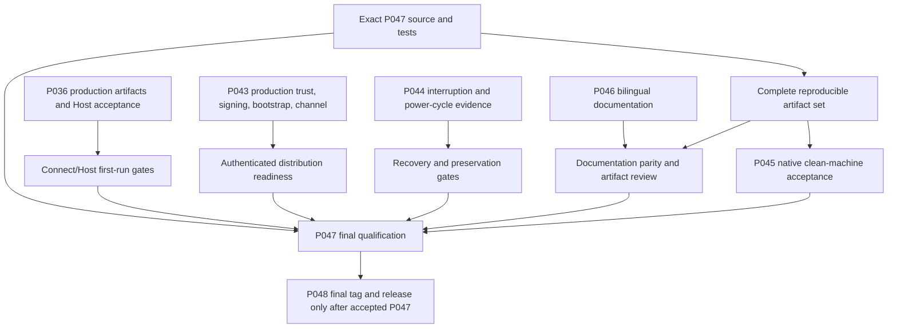

# Prompt047 manifest — final release-candidate validation

## Decision and branch lineage

**Preparation state: complete for currently available source and report checks; exact product-source hosted runs remain queued. Release qualification: BLOCKED.** This manifest and the machine-readable report do not approve a release.

- Required branch: `release/p047-final-rc-validation`.
- Base main SHA: `3851ea11927e24255614cfc38adbaccbd345ca03`.
- P047 source-fix commits: `80cef30506cee79d8b3d2dd36ceef6d423c581e3`, `f7f597a1a4c4110ff1c64d9cdecc10bb60a53125`, `1de1d2786aecbe0f786740505726e0d75c174ae0`, `acfd06f1e834a68e59b2eb7faa94155b083d07e9`, `3e52c01d15ded421791f01eecb1145387a3fd10c`, `381b27f4be27c77d64450f58cea08f63e98ad34b`, and `62651f05431ed5be255b7e7dd05ac1cffe8b927d`.
- Pull request: [#104](https://github.com/nghianguyen150612/Synveil/pull/104), draft, targeting `main`.
- P045 remains [PR #78](https://github.com/nghianguyen150612/Synveil/pull/78), open/draft/unmerged at `035497c05c145e5c6129e744f9455937069680f4`. P047 was created from main and contains no P045 merge or cherry-pick.
- P045 was inspected by fetching its published PR head for reference only. Its `deploy/acceptance/p045-matrix-v1.json` requires seven platform/artifact journeys; `docs/v0.2/P045_NATIVE_RUNNER_HANDOFF.md` requires isolated Ubuntu/Fedora KVM guests, an interactive Windows 11 standard-user session, exact producer hashes, and hypervisor hard-power control. No P045 result or runner change was imported. No qualifying external worker is available or registered in this P047 execution.
- P046 remains accepted and merged through PR #101; its bilingual documentation is present on the base.
- Current product version is `0.1.0`. P047 has not created `v0.2.0` and does not start P048.

## Authority and qualification rule

The current source contracts remain authoritative: [roadmap](ROADMAP.md), [installation contract](INSTALLATION_PRODUCT_CONTRACT.md), [clean-machine acceptance](CLEAN_MACHINE_ACCEPTANCE.md), [release manifest](RELEASE_ARTIFACT_MANIFEST.md), [download integrity](RELEASE_DOWNLOAD_INTEGRITY.md), [release channels](RELEASE_CHANNEL_SELECTION.md), [installer security](INSTALLER_SECURITY_HARDENING.md), and [installation resilience](INSTALLATION_RESILIENCE_HARDENING.md).

P047 applies the existing result values `PASS`, `FAIL`, `BLOCKED`, `ERROR`, and `SKIPPED`, and the existing evidence ladder from `contract-valid` through `release-acceptance`. A build, fixture, source check, hosted job, or known digest does not establish an authenticated public artifact or clean-machine product acceptance. Missing, invalid, skipped, and weaker-than-required evidence keep the release gate blocked.

## Machine-readable evidence

The full coverage matrix, exact producer inventory, workflow/job references, source revisions, evidence classes, blockers, and dependency graph are in [the P047 validation report](../../acceptance/p047/release-candidate-validation-v1.json). Validate it with:

```sh
./scripts/validate-p047-release-validation.sh
```

The report inventories Windows Setup, DEB, RPM, AppImage, server runtime, P036 managed-host dependencies, channel metadata, release manifest, and production trust/signing material. It records CI artifacts as CI evidence and retains `UNVERIFIED` signature status unless a production trust contract proves otherwise. Missing hashes, artifacts, workflow IDs, and production identities remain `null` with an explicit status.

## Main-branch audit

The audit was performed against `3851ea11927e24255614cfc38adbaccbd345ca03` and its tree `7801eb5c0d57a312072440a1f2decb463008b12c`.

Main contains the P007–P010 installer engine and journal, P012–P020 Linux package and quick-install producers, P021–P028 Windows installer/runtime source, P029–P035 managed server and first-admin source, P037–P042 Connect/first-library/client UX, P043 security hardening, P044 recovery hardening, and merged P046 bilingual documentation. Their source presence is separate from release qualification. The P045 branch is not part of main. P036's Host handoff remains `IMPLEMENTATION_PENDING` for FIRST-RUN-2 and its production dependency manifest is absent.

The audited source still declares product version `0.1.0`. Any CI outputs are recorded as unsigned CI artifacts for that source revision; no v0.2.0 release-candidate set is present. P047 does not change the product version or create the tag; P048 owns the final v0.2.0 release operation.

The acceptance inventory contains 11 versioned journeys. All 11 declare `IMPLEMENTATION_PENDING`; they are scenario definitions, not recorded product results. P047 does not turn source validators, fixture tests, Xvfb smoke checks, or source inspection into native journey results.

### Unmerged pull-request scope audit

At the audit checkpoint, P045 PR #78 is still open/draft and carries the native matrix that is absent from main. PR #58 and PR #59 are old open/draft server-network reachability branches. Their scope overlaps P034, which is already present on main at commit `2e4809f`; PR #59's head patch has the same stable patch ID as that main commit. PR #58 is an alternate P034 implementation with overlapping files, not a separate release-ready platform journey. Neither branch supplies P036 production identities or Host acceptance. PR #103 contains substantial iOS client work but targets `ios-app`, so it is outside the desktop/server mainline P047 candidate scope. P047 does not import any of these unmerged branch contents.

## Reproduced defects and source corrections

| Area | Exact observation | P047 correction | Qualification consequence |
| --- | --- | --- | --- |
| AppImage | Main run `38015962187`, job `114106149743`, failed `APPIMAGE-8`: linuxdeploy's Qt hook wrapped the reviewed AppRun. | Remove only the known generated Qt hook, fail on unknown leftover hooks, restore the reviewed AppRun before output, and compare it after output. The validator locks the order. | Requires a fresh AppImage build, byte reproducibility, runtime smoke, and native acceptance. |
| Windows toolchain | Main Windows candidate run `38015962172`, job `114106142192`, selected Git's `/usr/bin/link.exe`. | Both Windows candidate workflows and Windows CI now call one PowerShell selector that authenticates the absolute AMD64 MSVC linker from active `VCToolsInstallDir`. | Cross-compilation and hosted compilation are not Windows clean-machine acceptance. |
| Windows CRT | Main installer run `38015962245`, job `114106184060`, passed linker selection then stopped because `Qt6Core.dll` imported missing `MSVCP140.dll`. On intermediate P047 SHA `80cef30506cee79d8b3d2dd36ceef6d423c581e3`, the initial fixed VC143 directory assumption failed on Visual Studio 18/MSVC 14.51. | The selector now locates exactly one `Microsoft.VC*.CRT` directory under that toolset's version-matched x64 `VCToolsRedistDir`; the package copies only imported Microsoft CRT DLLs, then reruns the closed PE import audit. | Exact-head hosted build must prove the selected directory and package closure. |
| Rust cross-platform fixtures | Main Rust CI `38015962171`: Windows test modules imported Unix APIs; Windows config tests used POSIX `/tmp` roots; macOS IPC fixtures exceeded the Unix socket path limit; Windows named-pipe shutdown lost a listener during cancellation. | Unix-only test modules are gated to Unix, config fixtures use platform absolute roots, Unix socket fixtures use short `/tmp` paths, and named-pipe accept retains the pending listener while `connect()` is cancellable. | Requires Rust workspace, Windows, and macOS hosted reruns; no assertion or synchronization data semantics were weakened. |
| Client schema assertion | Main Rust CI run `38015962171` and PG17 run `38015962181` expected local schema 7 after P041 migration 0008 had set `LOCAL_SCHEMA_VERSION = 8`. | Schema assertions now use the authoritative current constant; the packaging contract pins the current value 8. | P041's accepted migration remains in place; upgrade/data compatibility still needs release artifact evidence. |
| P035 test fixture | Main run `38015962207`, job `114106142150`: the first live bootstrap test passed, then the second invocation reused the closed database and expected a fresh `Open` state. | The second exact integration test now gets a newly created PostgreSQL 17 database; its assertions remain unchanged. | Verified at P047 run `38023996395`, job `114130832163`: both live database invocations passed. This scoped result does not satisfy P036 Host production acceptance. |
| Linux package lint gate | P047 run `38023992747`, job `114130875731`: strict ShellCheck stopped before package production with `SC2034` for the unused bounded CRT-loop counter in `deploy/packages/build-windows.sh`. | The loop uses the intentional `_` placeholder; its four-pass closure bound and import audit remain unchanged. | Fix was verified by the strict ShellCheck step in run `38024448867`, job `114132185268`. The final-source package run `38025827873` is queued. |
| DEB/RPM reproducibility | Main run `38015962118`, job `114106144572`, built packages but failed independent `synveil-desktop` binary identity; generated inputs and embedded QML paths did not explain the byte difference. | No speculative binary change was made. | This remains blocked until an exact cause is reproduced and the build becomes byte-reproducible. |
| PG17 scheduled workflow | Main run `38015962181`, job `114106199419`, failed Prompt89 before later scheduled-maintenance steps: actual schema was 8, stale test expected 7. | The stale schema assertions were corrected without changing migrations or data semantics. | Later scheduled-maintenance checks were skipped in that run; their current outcome requires a fresh exact-head run. |

The Linux reproducibility diagnosis artifact is evidence only: workflow artifact `11656224311`, 891 bytes, SHA-256 `32ca6e551c74e4955d4186d410147a8c6ef9bab3cccca0dd0762fed7e6f71c29`. It contains diagnosis metadata, not release binaries or packages.

### Exact cross-platform failures

Main Rust CI run `38016138153` was not a product-wide pass. Its Windows check job `114106700463` failed compiling Unix-only `os::unix` APIs and `PermissionsExt::from_mode`; Windows test job `114106700561` failed for the same target-specific compile issue. Windows Qt job `114106700545` reported these fixture failures: `config::tests::network_hint_interval_is_bounded`, `config::tests::manifest_rejects_control_bearing_root_values`, `config::tests::parses_only_bounded_non_secret_profile_and_library_references`, `config::tests::pending_library_bindings_are_non_secret_and_bounded`, and `config::tests::rejects_relative_roots_duplicates_and_credentials_as_unknown_keys`. Its sixth failure was `control::tests::platform_native_windows_pipe_command_and_shutdown_parity`, where cancellation dropped the named-pipe listener. macOS job `114106700631` failed `control::tests::active_socket_is_never_replaced_and_stale_socket_is_recovered`, `control::tests::local_server_and_client_share_one_host_control_surface`, and `launch::tests::platform_supervised_stop_requests_canonical_shutdown_over_ipc`; each returned `UnsafeEndpoint`. Ubuntu test job `114106700528` failed `production_packaging_units::package_unit_6_upgrade_preserves_state` because the assertion expected schema 7 while the authoritative P041 schema is 8. P047 changes retained all product assertions and migration/data semantics.

P047 run `38024446185` on source `acfd06f1e834a68e59b2eb7faa94155b083d07e9` reproduced three macOS `UnsafeEndpoint` failures: the fixtures used `/tmp`, whose macOS alias resolves through a symlink, so the secure endpoint validator rejected it. Commits `3e52c01d15ded421791f01eecb1145387a3fd10c` and `381b27f4be27c77d64450f58cea08f63e98ad34b` canonicalize a short macOS `/tmp` root and assert the socket path stays below 100 bytes. The same run's Windows job `114132190544` failed `runtime_server_configuration::tests::advanced_external_config_uses_read_only_shared_authority`, `runtime_server_configuration::tests::explicit_managed_authority_rejects_mixed_operator_environment`, and `runtime_server_configuration::tests::preparing_storage_is_not_runtime_ready` with `InvalidPath`: `LinuxConfigLayout` intentionally parses POSIX path components, while Windows fixture paths contain a drive prefix. P047 now runs these Linux server-store tests on Unix targets; their imports and helper functions are gated together to avoid Windows unused-import warnings, and their assertions continue to execute on Linux and macOS. Exact final-source Rust CI run `38025827860` is pending.

P047 Windows installer run `38024448969`, job `114132184799`, verified the explicit MSVC linker and active CRT selection but failed the closed PE import audit on `UIAutomationCore.DLL`, imported by Qt's `platforms/qwindows.dll`. This is a Windows system DLL provided by the supported OS. P047 moved the system import policy into `deploy/packages/common/windows-pe-import-policy.sh`, added that system DLL to the allowlist, and added a regression check that still rejects the MSVC runtime DLLs and unknown imports from the system allowlist. Final producer verification is recorded only from the exact source-head run.

P047 AppImage run `38024448824`, job `114132184041`, built and inspected its AppDir but its bounded QML smoke then failed because the validator forced `QT_QPA_PLATFORM=offscreen` while the packaged AppDir contained `libqxcb.so` and no offscreen plugin. The built image digest printed in that failed, unpublished workflow was `8a39886bb5dedbcc17c374d329af28b2ab689c4f1b772ba18e2af95cc4a09196`; the run did not upload the image, and no byte size or Actions artifact ID is available. The validator now selects the bundled `xcb` plugin under isolated Xvfb; `tests/appimage/test_validator_smoke.py` locks that selection and the missing-Xvfb failure behavior. This harness correction is not itself evidence that the AppRun clean-machine journey passes.

## Exact product-source hosted status

At `2026-10-10 05:02:25 UTC`, the exact product-source commit `62651f05431ed5be255b7e7dd05ac1cffe8b927d` (tree `510408aa1bea32a73226c401e83f290427043b9e`) had 23 GitHub Actions runs: six push workflows and 17 pull-request workflows. Every run and queried job was still `queued`; none had a conclusion. Queued is not a pass.

Push runs:

- Rust CI `38025827860` (jobs `114136399823`, `114136399943`, `114136399949`, `114136399990`, `114136399998`, `114136400016`, `114136400022`, `114136400038`, `114136400092`, `114136400102`, `114136400202`).
- PostgreSQL 17 scheduled maintenance `38025827935` (job `114136347978`).
- Linux DEB/RPM producers `38025827873` (jobs `114136348412`, `114136348508`, `114136348522`).
- Windows native-acceptance workflow `38025827893` (job `114136382885`).
- Windows installer producer `38025827853` (job `114136380889`).
- Linux AppImage producer `38025827887` (job `114136388332`).

Pull-request runs are recorded individually in the machine-readable report. They cover Rust CI, PostgreSQL 17, Windows installer/native acceptance, Linux packages/AppImage/clean-machine, P034/P035/P036, Connect/auth/library/sync flows, repair/recovery, installer security, and resilience. All remain queued in the observed snapshot.

The Actions artifact endpoints for the exact-source Windows installer (`38025827853`), DEB/RPM (`38025827873`), and AppImage (`38025827887`) each returned zero artifacts. No exact-source binary identity can be recorded. The P047 report retains these producers as `BLOCKED` with missing artifact fields `null`; it does not promote the earlier failed AppImage digest or the known main-source reproducibility diagnosis into candidate artifacts.

The source fixes are committed before this report/manifest metadata change. The metadata commit does not alter compiled inputs; the source revision and tree above identify what the producers were dispatched against. Exact-source hosted results remain a release blocker until the runs complete and any resulting evidence is audited.

## External dependencies and remaining release gates

P045 must be genuinely accepted and merged, or provide an explicitly supported verified evidence contract, before native Windows 11 interactive GUI/logon/named-pipe, Ubuntu 24.04, Fedora 42, lifecycle/data-preservation, and real power-cycle requirements can be counted.

The P045 handoff remains operationally blocked: registration labels do not prove a usable desktop or hardware power control. Its documented KVM and interactive Windows worker prerequisites, exact candidate transfer, and result-v1 aggregation must be completed by the P045 owner before P047 can import accepted native evidence.

P036 must provide the real `acceptance/p036/production-artifacts.json` with authentic PostgreSQL 17 and managed-edge identities. The installed Host UI must then complete real first-admin bootstrap, normal login, library setup, initial synchronization, recovery, and preservation against a controlled reachable server. The file is absent; P047 will not fabricate it or substitute fixtures.

Production signing keys, trusted bootstrap, authenticated channel publication, and key-rotation evidence remain unavailable. P043 source validators prove verifier policy, not production signing infrastructure. P044 source/fixture checks do not prove real power-cycle recovery.

Platform qualification remains limited to Windows 11, Ubuntu 24.04 x86_64, and Fedora 42 x86_64 candidates until accepted native evidence says otherwise. No Debian derivative, other RPM distribution, or generic Linux support claim is added.

## Dependency graph



P048 prerequisites include every required gate passing at the exact candidate identities, P045 native evidence, P036 live Host evidence, a complete and authenticated artifact set, production trust/signing/channel readiness, documented upgrade/repair/uninstall preservation, power-cycle recovery, and accepted P047 work merged to main. P047 does not perform any P048 action.
