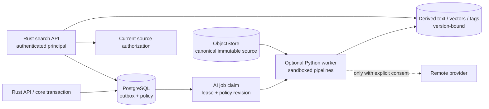

# Kiến trúc AI tùy chọn và hợp đồng privacy

Trạng thái: **Nền tảng PLANNED với các capability EXPERIMENTAL rõ ràng**

Synveil AI là subsystem derived-data có thể thay thế. Nền tảng Phase 10—OCR
hữu hạn, embedding gắn version, semantic search và AI-proposed tag có thể
chỉnh sửa—là capability nâng cao, tùy chọn, `PLANNED`. Repository question
answering, autonomous model recommendation, hiểu face/image và hành vi kiểu
agent là `EXPERIMENTAL`.

Không AI endpoint, model, worker, index hay provider nào được blueprint này
triển khai. Quyết định kiến trúc đã chấp thuận là
[ADR-008](../adr/ADR-008-ai-outside-critical-path.md): canonical storage commit
trước khi AI work vào durable outbox. Core upload, download, metadata search,
sync, backup, restore, sharing và version history vẫn hoạt động khi AI bị tắt,
hỏng, quá tải hoặc vắng mặt.

## Goal và non-goal

### Nền tảng nâng cao dự kiến

- OCR cho scan, PDF, screenshot và photo thích hợp;
- safe text/code extraction làm input cho full-text và semantic indexing;
- versioned embedding trên authorized source chunk;
- semantic search trên chunk dẫn xuất từ text/code/OCR của document, photo,
  repository, code và project đã chọn; vision/image embedding vẫn là bề mặt
  experimental;
- suggested tag có thể chỉnh sửa với provenance `AI` rõ ràng;
- local/self-hosted inference làm mode được hỗ trợ;
- explicit remote-provider mode với consent theo data category; và
- reindex, staleness, deletion và model provenance có thể quan sát.

### Bề mặt thử nghiệm

- repository/project question answering và generated summary;
- natural-language answer tổng hợp trên nhiều source;
- image caption, scene/object label, near-duplicate embedding và face feature;
- model recommendation hoặc storage-policy recommendation;
- remote provider adapter trước privacy/retention conformance; và
- mọi model-initiated tool hoặc mutation.

### Non-goal

AI không bao giờ là:

- canonical truth hay cách duy nhất để tìm file;
- một phần của content durability, synchronization conflict, snapshot commit
  hoặc restore verification;
- được phép rewrite original hoặc user tag;
- route ẩn để data rời server;
- đáng tin để authorize result từ object ID, embedding hoặc cached ACL;
- parser sandbox escape route hay arbitrary URL fetcher;
- engine tự chủ cho deletion, sharing, restore, repository write hoặc policy;
  hoặc
- được mô tả là private chỉ vì model chạy “local”—self-hosted operator và server
  vẫn nằm trong trust model.

## Invariant kiến trúc

1. Core mutation trước tiên verify bền vững `Object` và commit theo giao dịch
   `Node`/`FileVersion`, `ChangeEvent`, audit fact và outbox work. AI consume
   committed immutable version sau.
2. Mọi AI record bind với source ID, immutable source version/revision,
   pipeline/configuration version, model/version, inference mode và current
   owner scope. Chỉ “latest filename” không bao giờ là index identity.
3. Outbox/job delivery là at least once. Job identity khiến extraction,
   embedding, tagging, reindex và deletion idempotent.
4. Derived output có thể thay thế và delete riêng. Nó không bao giờ kéo dài
   canonical retention hay thay original, snapshot hoặc repository backup.
5. Search check current source authorization. ACL copy lúc index có thể tăng tốc
   candidate restriction nhưng không bao giờ là final access decision.
6. Effective policy hạn chế nhất thắng. `DISABLED` ở scope instance, user,
   library, source hoặc data-category ngăn work mới tại scope đó.
7. Inference `REMOTE` cần provider được cấu hình rõ và active versioned consent
   cho từng egress data category. Không cho phép implicit fallback từ local
   failure sang remote provider.
8. Parser/model/output failure không mutate hay quarantine canonical byte hợp lệ
   chỉ vì optional derivation thất bại.
9. Model output, OCR text, caption, tag, summary và generated answer là untrusted
   data có provenance, không phải executable instruction.
10. AI health và readiness tách khỏi core readiness.

## Inference mode

### `DISABLED`

- `DISABLED` là default mode cho installation mới đến khi authorized
  operator/user chọn và cấu hình mode được phép khác rõ ràng.
- Không dispatch extraction, OCR, embedding, captioning hoặc model query mới
  cho disabled scope.
- Deterministic filename/metadata search tiếp tục. Non-AI full-text extraction
  chỉ có thể cấu hình riêng nếu UI và policy phân biệt rõ.
- Queued work được cancel hoặc suppress trước input read. In-flight local hoặc
  remote call được cancel khi có thể; result tạo theo old policy revision bị từ
  chối publication.
- Existing derived record theo keep-or-delete policy của user, có visible
  cleanup progress và query-time exclusion ngay lập tức.

### `LOCAL`

- Model và inference chạy trong optional Python runtime trên infrastructure do
  operator kiểm soát.
- Worker chỉ đọc scoped immutable source/derivative qua internal authorization,
  không dùng public object URL hay raw storage credential.
- Model download, update check, telemetry, package repository và license term
  là operational egress rõ ràng. “Local inference” không authorize hidden
  runtime network call.
- CPU, GPU, memory, temporary disk, wall time, concurrency và output size bị
  giới hạn theo pipeline và deployment profile.

### `REMOTE`

Remote mode là opt-in và riêng theo provider. Trước khi chạy, sản phẩm hiển thị
và ghi:

- provider và endpoint identity;
- exact data category được phép: raw byte, extracted text, image derivative,
  repository/code content, metadata và query text là category riêng;
- model/service purpose;
- claim retention/training/deletion của provider dưới dạng policy metadata do
  operator cung cấp, Synveil không đảm bảo lời hứa bên ngoài;
- data residency/region khi provider cung cấp;
- credential owner và secret reference;
- policy/consent revision, grant time, revocation time và scope; và
- derived record Synveil lưu local cùng cách delete/rebuild.

Request minimize content, dùng TLS, có giới hạn time/body/retry và emit redacted
egress audit fact. Provider failure không bao giờ trigger unapproved fallback,
mở rộng scope hay trả raw provider diagnostic cho user.

## Ranh giới component và trust



Rust application vẫn là policy và publication boundary. Python worker có thể
chạy riêng vì ML dependency và resource profile khác, nhưng không trở thành
metadata authority thứ hai. Nó claim scoped job, validate effective
policy/consent, đọc bounded source, tạo staged result và yêu cầu
application/database contract chỉ publish nếu source version và policy revision
vẫn khớp.

Deployment ban đầu dùng PostgreSQL-backed outbox/job. Kafka, RabbitMQ, NATS,
Redis hoặc service mesh không phải prerequisite. Broker sau có thể fan out sau
cùng transactional outbox boundary.

## Job contract

Stable AI job identity về khái niệm là:

```text
job kind
+ owner/source scope
+ immutable source version
+ pipeline/configuration version
+ model/version
+ inference mode
+ consent/policy revision
```

Job state là `QUEUED`, `RUNNING`, `RETRY_WAIT`, `SUCCEEDED`, `SUPERSEDED`,
`CANCELED` hoặc `DEAD_LETTER`. Mỗi job ghi bounded attempt count, next-run time,
lease owner/generation/expiry, safe error class và resource profile.

- Worker claim bằng PostgreSQL transaction ngắn và execute bên ngoài.
- Long job renew bounded lease; completion compare lease generation.
- Retry dùng exponential backoff với jitter và maximum attempt/age riêng theo
  operation.
- Authentication, invalid input, permanent unsupported format, policy
  revocation và resource-limit class không retry mãi.
- Poison source trở nên visible trong dead-letter/terminal status và không block
  job khác hoặc một queue partition.
- Duplicate success trả hoặc thay cùng generation; không append duplicate tag
  hay chunk.
- Publication có điều kiện source version và effective policy vẫn khớp. Nếu
  không, result là `SUPERSEDED` và staged output được clean sau grace period.

## Derived data model và provenance

Field `AIIndexRecord` là chuẩn trong [DOMAIN_MODEL.md](DOMAIN_MODEL.md). Mỗi
logical indexed unit còn cần versioned locator phù hợp modality:

- document page và bounded text span;
- source-code blob/commit cộng byte hoặc line span;
- description image/video region/frame sampling;
- photo asset/resource/version;
- repository/project relationship; hoặc
- whole-resource metadata-only unit.

Mọi result mang:

- extractor/OCR/chunker/pipeline implementation và configuration version;
- model identity, immutable model artifact digest, provider model identifier và
  license/usage metadata;
- source fingerprint và immutable source version;
- inference mode và consent/policy revision;
- generated time và freshness state;
- language/modality;
- confidence chỉ khi model định nghĩa/calibrate có ý nghĩa;
- warning cho truncation, unsupported region hoặc partial extraction; và
- provenance link phù hợp để user inspect source.

Derived value không đổi canonical hash `FileVersion`. User-authored correction
và tag nằm trong provenance record riêng; reindex chỉ có thể replace pipeline
generation của chính nó.

## Extraction và OCR

### Lựa chọn input

Pipeline nhận server-detected media class và bounded source stream. Filename và
declared MIME là hint. Eligible scope rõ ràng: ordinary Drive content, photo
original/derivative, retained backup snapshot và repository backup không tự
động đều được index chỉ vì cùng byte tồn tại.

Index retained backup hoặc historical version được enable riêng vì nó đổi
discoverability, storage cost, deletion behavior và privacy. Default search nên
trỏ current live authorized content.

### Safe extraction

- Ưu tiên parser có thể stream hoặc áp đặt bound page/object/decompressed-output.
- Chạy document, image, OCR, archive và code parsing không đáng tin cậy với least
  privilege và giới hạn CPU, memory, time, process count, temporary disk,
  decoded pixel, page, recursion và output character.
- Disable network, external entity, remote font/resource, macro, executable
  attachment, filesystem link, shell expansion và arbitrary plugin loading.
- Coi zip/decompression bomb và nested container là hostile. Archive không được
  recursively index quá policy depth/entry/expanded-byte rõ ràng.
- Không bao giờ execute repository code, build hook, notebook, document script
  hay model output để hiểu content.
- Chỉ giữ safe partial result nếu schema đánh dấu omitted/truncated portion.
  Không mô tả nó là complete.

OCR output được lưu riêng với page/region, language, engine/version, confidence
khi định nghĩa và source-version provenance. OCR failure không khiến PDF/photo
corrupt. Raw OCR text là sensitive content và nhận cùng protection search,
logging, sharing, retention và remote-egress như source.

## Chunking và embedding

Text extraction tạo bounded logical chunk bằng versioned deterministic chunker.
Chunk ghi source locator, normalized-text fingerprint, language, token/character
count, truncation và adjacency. Chunk boundary không phải public permanent ID;
đổi algorithm tạo index generation mới.

Embedding record chứa:

- model/provider identity và vector dimension;
- source và chunk generation;
- vector/index representation version;
- normalization/distance metric configuration;
- owner/authorization scope và sensitivity class; và
- lifecycle/freshness state.

Embedding có thể leak thông tin về input. Chúng là private derived content,
không phải metadata vô hại. Chúng bị loại khỏi log, ordinary export, public API,
cross-user cache và telemetry. Equal vector hoặc nearest-neighbor count không
bao giờ reveal content của user khác.

PostgreSQL vẫn authoritative cho index metadata và lifecycle. `pgvector` là
ứng viên đầu ưu tiên cho vector search vì giữ authorization relationship và
transaction gần nhau, nhưng ADR-002 coi nó là optional derived-index storage.
Không vector engine nào thành canonical truth hay dependency Phase 0.

## Hợp đồng semantic search

### Query flow

1. Authenticate user/share context và resolve allowed library, repository,
   project, data category và search layer.
2. Normalize và bound query. Nếu semantic mode disabled, trả `ai_disabled` cho
   semantic-only request hoặc dùng deterministic layer client yêu cầu—không bao
   giờ âm thầm egress.
3. Embed query local hoặc bằng explicitly consented remote provider. Query text
   là egress data category riêng.
4. Chỉ search owner/authorization-partitioned candidate khi khả thi.
5. Join candidate source ID với current source authorization và lifecycle state
   trước khi trả bất kỳ score, snippet, count, facet hoặc existence signal nào.
6. Áp dụng bounded oversampling để candidate đã remove/inaccessible không làm
   cạn result, đồng thời giữ timing/count behavior khỏi trở thành cross-scope
   oracle.
7. Trả source/version, layer `SEMANTIC`, model/index generation, freshness,
   score semantic, safe snippet/caption provenance và opaque query-bound cursor.

API không bao giờ trả raw vector. Semantic result là ranking aid, không phải
bằng chứng file chứa một fact. Filename/metadata search vẫn dùng được và có thể
request riêng.

### Access change

- Share revocation hoặc policy removal block result tại query time ngay cả trước
  index cleanup.
- Trash có thể ẩn result khỏi normal search trong khi retention derived record
  đến khi trash/retention policy hết; Trash search là explicit scope.
- Purge schedule deletion derived record và ngăn mọi normal query visibility.
- File version mới khiến old current-version record thành `STALE`/non-current
  và schedule generation mới. Historical search có scope riêng.
- Project/album membership không grant access rộng hơn underlying source. Result
  cần current access vào cả container context và source khi feature hứa context
  đó.
- Backup snapshot expiration schedule derived cleanup chỉ cho record có last
  authoritative source scope đã hết hạn.

## Automatic tagging

AI tagging từ text/code/OCR và metadata/rule đã review là suggestion framework
`PLANNED`. Tag scene, object, face/person hoặc image-understanding tương tự do
vision tạo vẫn `EXPERIMENTAL` theo [PHOTOS.md](PHOTOS.md); tag model dùng chung
không promote inference capability đó.

- tag assignment dùng provenance `AI`, pipeline/model/configuration, confidence
  khi có ý nghĩa, source version và review state;
- user có thể accept, edit, reject, mute hoặc delete suggestion;
- accepted/created `USER` tag thành separate user-authored record;
- reindex chỉ replace unreviewed assignment từ superseded generation của nó;
- rejected suggestion có thể giữ minimal suppression fingerprint theo policy
  để không xuất hiện lại ngay, mà không giữ raw source content trong log; và
- không tag nào tự động đổi sharing, retention, backup, trash, tiering, device
  policy hoặc authorization.

Deterministic system tag như explicit media type vẫn là `SYSTEM`, không được mô
tả sai là AI.

## Generated answer và hiểu repository

Repository Q&A và synthesized multi-source answer là `EXPERIMENTAL`.

- Retrieval dùng cùng current-authorization search path và version-bound
  citation.
- Generated text định danh model/mode, index freshness và source citation; nó có
  thể incomplete hoặc sai.
- Content trong file, code comment, issue, README, EXIF và OCR là untrusted
  retrieval data. Instruction chứa trong đó là prompt injection, không phải
  authority trên Synveil hoặc worker.
- Model không có tool storage, shell, network, database, Git, share, delete,
  restore, credential hay policy.
- Future tool-using agent cần ADR riêng, authorization theo action, human
  confirmation cho side effect, allow-listed tool, audit và rollback analysis.
  Blueprint này không grant capability đó.
- Repository content không bao giờ execute. Answer không thể claim build/test/
  runtime truth trừ khi independently authorized process tạo evidence đó.

## Privacy, consent và control

### Policy hierarchy

Effective policy kết hợp:

```text
instance capability/administrator ceiling
  ∩ user consent
  ∩ library/project/source policy
  ∩ provider and data-category grant
  ∩ current resource authorization
```

Intersection được evaluate lúc job claim, ngay trước remote send, lúc
publication và query time khi liên quan. Policy record có revision. Result tạo
dưới stale revision không thể publish vào active index.

Administrator có thể disable provider hoặc feature toàn cục nhưng không thể âm
thầm opt sensitive content của user vào remote egress. Owner không thể override
disabled/egress ceiling của operator.

### User control

UI/API dự kiến cho phép authorized user:

- chọn `DISABLED`, `LOCAL` hoặc provider `REMOTE` được cấu hình rõ;
- scope indexing theo library/project/source và data type;
- inspect category nào có thể gửi remote;
- xem queued/running/failed/stale index state và last model generation;
- exclude source mà không delete canonical data;
- request reindex;
- delete derived record theo source/scope/model/provider; và
- withdraw remote consent, block dispatch mới ngay và query use của
  stale-policy result.

Deletion khỏi Synveil không thể đảm bảo erasure từ remote provider vượt quá
contract thực của provider. UI phải disclose giới hạn này và ghi provider
deletion-request evidence khi được hỗ trợ mà không claim success không thể
verify.

### Logging và telemetry

Không bao giờ log:

- source byte, extracted text, OCR output, prompt, query, model response,
  embedding, caption, tag, snippet hoặc file path/name;
- access/share/device token, provider API key, model registry credential hoặc
  signed source capability; hoặc
- exact user/library/source ID trong high-cardinality metric.

Structured log dùng job/request ID, pseudonymous bounded identifier, pipeline
generation, mode/provider class, safe error, bucket byte/token/resource và
duration. Debug capture content cần quy trình operator riêng rõ ràng, redaction,
access control, expiry và audit; mặc định tắt.

## Supply chain model và dependency

- Pin model artifact bằng immutable digest và ghi origin, license, intended use,
  architecture, tokenizer, size và compatibility.
- Verify signed checksum/provenance khi có. Không download/execute model ở first
  user query.
- Model activation là operator-reviewed deployment action có check storage và
  memory capacity.
- Từ chối unsafe arbitrary deserialization hoặc model format có thể execute
  code; sandbox mọi converter.
- Pin Python dependency bằng hash/lock data, scan chúng và build reproducible
  image khi khả thi.
- Ghi model và parser generation trong mọi result để vulnerable artifact có thể
  invalidate và reindex.
- Review model/data license cho self-hosted, commercial và remote use. Model
  tương thích kỹ thuật không tự động hợp pháp để distribute.

## Lifecycle và deletion

| Source/policy transition | Hành động derived-data |
|---|---|
| Immutable source version mới | Đánh dấu prior current generation stale, queue generation mới, chỉ giữ historical record theo explicit history policy. |
| Chỉ rename/move | Update display projection mà không re-embed byte trừ khi path/context cố ý là một phần pipeline. |
| Share grant | Không copy embedding vào recipient scope; current authorization có thể làm existing authorized source result visible theo feature policy. |
| Share revocation | Query-time deny ngay; queue scope/index cleanup và cache invalidation. |
| Trash | Ẩn khỏi normal current search; retain/delete theo declared trash indexing policy. |
| Purge hoặc erasure request | Queue deletion/tombstone, deny ngay, remove vector/text/tag/cache record sau khi evaluate mọi authorized retained-source scope. |
| Backup snapshot được giữ | Mặc định không index; nếu explicit index, snapshot retention sở hữu source lifetime. |
| Model/config upgrade | Build generation mới song song, validate, atomically select rồi retire old generation sau rollback window. |
| Chuyển LOCAL sang REMOTE | Cần consent provider/data-category mới; không bao giờ reinterpret old local consent. |
| Withdraw REMOTE consent | Block dispatch ngay, reject stale-policy publication, cancel khi có thể, queue local derived cleanup theo lựa chọn, disclose provider deletion limit. |

Derived data có thể được đưa vào operational database backup để recovery, nhưng
restore coi nó là rebuildable và validate source/model generation. Canonical
recovery không được phụ thuộc restore embedding.

## Hợp đồng failure và recovery

| Lỗi | Hành vi bắt buộc |
|---|---|
| AI service vắng mặt lúc deployment | Core service ready; AI mode báo `DISABLED`/unavailable và deterministic search hoạt động. |
| Worker offline sau file commit | Durable job già đi thấy được; original file, sync, backup và restore vẫn healthy. |
| Worker crash sau remote/provider work nhưng trước publication | Lease hết hạn; retry dùng job identity. Publication vẫn là một version-bound generation, dù external billing có thể xảy ra nhiều hơn một lần và phải disclose/limit. |
| DB commit derived result fail sau object/text staging | Không active index nào trỏ nó; staged output reconcile sau lease/grace. |
| Policy bị revoke trong inference | Result không thể publish theo stale policy revision; query use mới bị deny và cleanup/cancellation theo sau. |
| Source bị purge trong job | Source/version conditional publication fail; job thành superseded và output bị remove. |
| Parser gặp bomb/timeout hoặc malformed content | Bounded terminal/retry result; canonical source vẫn valid và accessible theo core policy. |
| Model trả malicious instruction hoặc HTML/script | Lưu/render làm untrusted text với strict escaping; không bao giờ execute hay grant tool. |
| Remote provider trả oversized/malformed/error body | Bound và reject, map safe code, redact raw response, áp dụng retry policy mà không fallback provider khác. |
| Vector index mất/hỏng | Disable semantic result cho affected generation, rebuild từ authorized source version, giữ deterministic search/core data nguyên vẹn. |
| Model dimension/config đổi | Build generation/index riêng; không bao giờ mix incompatible vector trong một ranking. |
| Authorization cache/index lag sau revoke | Final current-source authorization deny; không emit result/snippet/count. |
| Deletion job liên tục fail | Source bị query-deny ngay, terminal lag được alert/audit, có operator retry/remediation; UI không claim physical deletion complete. |

## API và event contract

Public route dự kiến được xác định trong
[API_ARCHITECTURE.md](API_ARCHITECTURE.md):

- `GET/PATCH /api/v1/ai/settings`;
- `POST /api/v1/ai/reindex-operations`;
- `DELETE /api/v1/ai/index-records`;
- `GET /api/v1/ai/status`; và
- `GET /api/v1/search` với explicit search layer.

Settings mutation dùng ETag/`If-Match` và audit đổi mode/provider/scope không
kèm secret. Reindex và deletion là idempotent asynchronous operation. Search
cursor bind query, layer, filter, index generation và authorization scope.

Internal versioned event/job family dự kiến là:

- `ai.extract.requested`;
- `ai.ocr.requested`;
- `ai.embed.requested`;
- `ai.tag.requested`;
- `ai.index.remove_requested`;
- `ai.index.generation_changed`; và
- experimental `ai.answer.requested`.

Payload mang ID và source-version reference, không mang raw content. Event name
không ngụ ý success; terminal job/index state là authoritative.

## Observability và operation

AI health riêng báo:

- configured/effective mode và provider class;
- queue oldest age, depth theo safe pipeline class, attempt, lease và
  dead-letter count;
- current/target index và model generation;
- stale/failed/deletion-pending record count;
- parser/model time, resource-limit termination, bucket input/output size,
  local CPU/GPU memory pressure và remote latency/status class;
- estimate remote request/count/byte/token/cost khi provider expose, scope
  private; và
- đổi privacy control và remote egress audit count.

Metric tránh user/source name, prompt, query term, embedding, exact coordinate,
raw provider response và identifier tạo content side channel. Core readiness
không fail vì AI queue age cao.

Operator có thể:

- pause claim theo pipeline/provider mà không drop job;
- drain/revoke provider;
- inspect safe terminal error;
- pin/rollback model/index generation;
- chỉ requeue eligible failed job;
- delete/rebuild một authorized scope; và
- verify disabled mode không tạo network egress trong conformance test.

## Verification và promotion gate

Trước khi nền tảng AI thành `IMPLEMENTED`, validation phải bao phủ:

- AI absent/disabled trong khi mọi core flow và metadata search pass;
- ordering commit-before-outbox và lost/duplicated/out-of-order job delivery;
- worker crash trước/sau source read, remote call, staging, publication và
  acknowledgement;
- source update/trash/purge/restore, share grant/revoke, project link removal,
  consent change và model-generation race;
- current-authorization filtering với adversarial stale ACL/index/cache cùng
  test cross-user timing/count/dedup;
- parser bomb, malformed PDF/image/archive/code, external entity, symlink,
  executable content, resource exhaustion và poison job;
- malicious prompt injection, XSS/HTML output, oversized provider body,
  timeout, rate limit, duplicate billing exposure và secret redaction;
- local mode với network denied; remote mode denied nếu thiếu bất kỳ required
  consent nào; không silent provider fallback;
- vector loss/corruption, dimension mismatch, deterministic rebuild, dual-index
  cutover, rollback và deleted-source exclusion;
- OCR provenance/partial result, chỉnh sửa/từ chối AI tag của user và reindex
  không overwrite user data;
- derived deletion progress và giới hạn remote-erasure trung thực; và
- model/dependency digest, unsafe deserialization, license inventory và
  vulnerable-generation invalidation.

Performance methodology ghi named hardware, model digest, runtime và
quantization, input corpus cùng sensitivity-safe distribution size/page/token,
concurrency, CPU/GPU/RAM/temp disk, vector count/dimension/index parameter,
warm/cold cache, storage backend và end-to-end queue latency. Target theo
measured baseline và resource budget; blueprint này không phát minh claim
accuracy hay throughput.

Quality evaluation dùng versioned, legally usable, privacy-safe dataset và ghi
precision/recall hoặc measure phù hợp task, abstention/partial behavior,
language coverage (gồm tiếng Anh và tiếng Việt khi được claim), false-positive
impact và model drift. Không aggregate metric nào có thể override privacy hoặc
authorization failure.

## Open decision hữu hạn

OPEN DECISION OD-AI-001: chiến lược vector storage và index đầu tiên
Owner: AI / Database / Performance / Operations
Needed by: Gate kiến trúc semantic-search Phase 10
Options: PostgreSQL với pgvector; separate self-hosted vector service; exact/brute-force PostgreSQL vector cho bounded initial corpus
Recommendation: bắt đầu bằng pgvector trong PostgreSQL làm optional derived-index storage, partition/scope cho authorization và chỉ đưa separate service vào sau measured scale cùng operations evidence
Decision evidence: benchmark corpus đại diện, authorization-query plan review, backup/rebuild test, memory/disk cost, index quality/latency và upgrade test

OPEN DECISION OD-AI-002: local model và runtime profile được hỗ trợ
Owner: AI / DevOps / Product / Legal
Needed by: Gate release local-inference Phase 10
Options: CPU-first small model profile; optional GPU profile cộng CPU fallback; pluggable operator-supplied model không bundled default
Recommendation: publish một bounded CPU-capable baseline cộng explicitly optional GPU profile chỉ sau quality/resource/license evaluation; không bao giờ biến chúng thành core deployment dependency
Decision evidence: English/Vietnamese quality evaluation, model license/security review, image size, cold-start, benchmark CPU/GPU/RAM và offline installation test

OPEN DECISION OD-AI-003: granularity remote consent
Owner: Privacy / Security / AI / Product
Needed by: Thí nghiệm remote-provider đầu tiên Phase 10
Options: một account-wide remote switch; theo provider và data category; theo library/project/source cộng provider/category
Recommendation: cần consent theo provider cộng data-category với optional scope library/project/source hẹp hơn, đồng thời giữ raw byte, extracted text, image, code, metadata và query text tách biệt
Decision evidence: privacy threat model, consent-comprehension study, revocation/deletion test, provider-retention review và audit review

OPEN DECISION OD-AI-004: hợp đồng text chunking
Owner: AI / Search / Clients
Needed by: Index-format freeze Phase 10
Options: structure-aware chunk theo document/code type; uniform token window; hybrid structure-aware chunk với bounded overlap
Recommendation: versioned structure-aware chunk với bounded overlap và uniform safe fallback; locator phải giữ provenance qua reindex mà không thành public permanent ID
Decision evidence: multilingual retrieval evaluation, benchmark memory/index-size, parser-failure fixture, citation fidelity và migration/rebuild test

OPEN DECISION OD-AI-005: indexing retained history và backup
Owner: AI / Backup / Versions / Privacy / Product
Needed by: Gate indexing-scope Phase 10
Options: chỉ current live version; gồm version history; opt-in retained backup snapshot và repository backup
Recommendation: mặc định index current live version; biến history và từng retained backup domain thành explicit opt-in với control riêng cho cost, discoverability, retention và deletion
Decision evidence: restore/search user requirement, privacy và erasure analysis, benchmark storage/compute, snapshot-expiry test và UI comprehension test

OPEN DECISION OD-AI-006: availability generated-answer
Owner: AI / Security / Product / Documentation
Needed by: Thí nghiệm repository-intelligence Phase 12
Options: chỉ retrieval result; cited generated answer không tool; tool-using agent theo kiến trúc mới
Recommendation: nếu theo đuổi, bắt đầu bằng cited read-only answer không tool; mọi side-effecting agent cần ADR và security review riêng
Decision evidence: prompt-injection red-team, citation/grounding evaluation, authorization test, harmful-output review và product need rõ ràng
