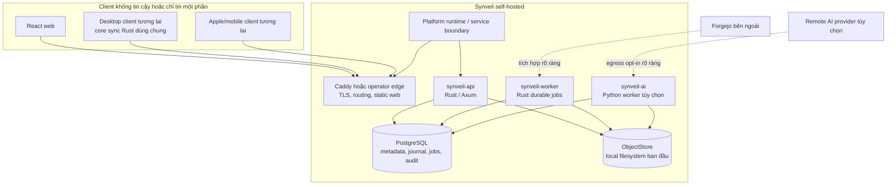
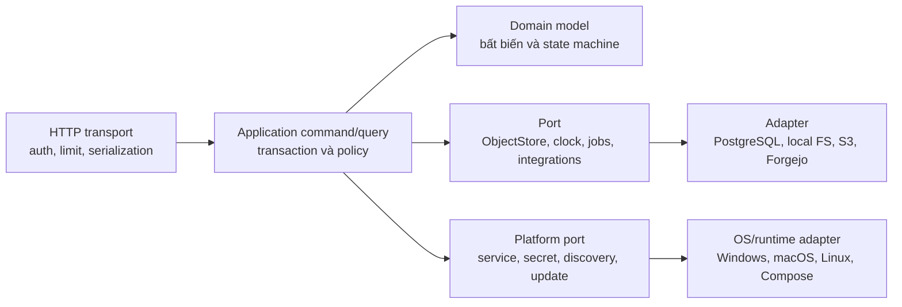

# Kiến trúc hệ thống

Trạng thái: **Blueprint quy chuẩn**

## Kiến trúc tổng quan

Synveil bắt đầu là modular monolith với hợp đồng domain rõ ràng. Một codebase
Rust tạo ra tiến trình HTTP API và tiến trình background worker bền vững; cả hai
dùng PostgreSQL và chung adapter ObjectStore. React web là client xác thực được
phục vụ dưới dạng static asset. Runtime Python riêng là tùy chọn và chỉ dùng cho
AI/OCR/embedding. Ranh giới platform runtime cho phép cùng core được đóng gói
thành Personal / Home Mode trên Windows, macOS, Linux Desktop và Linux Server,
hoặc vận hành thành Advanced / Server Mode với Docker Compose và infrastructure
tùy chỉnh.

Mô hình này giảm failure mode phân tán nhưng vẫn giữ ranh giới để hỗ trợ client
SDK, S3, worker độc lập và scale ngang khi có số đo chứng minh.



Mũi tên không tự cấp quyền tin cậy. Mọi request phải xác thực và authorize tại
ranh giới resource; worker claim job có scope và đọc original qua capability
server-side, không dùng object URL công khai.

## Bất biến kiến trúc

1. Response tạo file version thành công có nghĩa Object chuẩn đã bền vững và
   checksum được xác minh theo backend cấu hình.
2. Metadata không bao giờ công bố Object tạm hoặc chưa hoàn tất thành
   `FileVersion` committed.
3. Mỗi mutation người dùng thấy cùng `ChangeEvent`, audit fact và outbox bắt
   buộc được commit trong một giao dịch PostgreSQL.
4. Change sequence theo `Library` phản ánh thứ tự commit: client đã tiến qua `n`
   không thể bỏ sót event có sequence `≤ n` xuất hiện sau.
5. Retry dùng kết quả idempotency đã lưu phía server. Mất response không tạo thêm
   version, object reference, share hoặc mutation.
6. File content version và backup snapshot là bất biến. Restore tạo current state
   mới chứ không viết lại lịch sử.
7. Xóa trong sync tạo tombstone/Trash và lan truyền. Thiếu nguồn backup chỉ ảnh
   hưởng manifest snapshot mới; không xóa lịch sử ngoài retention.
8. ID và object key không phải authorization. Mọi lookup phải scope theo owner,
   membership, device grant hoặc share capability đã xác thực.
9. AI, OCR, thumbnail, repository indexing và notification là dữ liệu dẫn xuất
   eventual. Sự cố không rollback core data.
10. GC chỉ xóa Object được chứng minh không còn tham chiếu từ live version,
    trash retention, backup manifest, rendition, staging lease, hold hoặc active
    job, và chỉ sau safety grace period.
11. Personal / Home Mode và Advanced / Server Mode dùng chung protocol, domain
    model, metadata authority, storage correctness model và security model.
    Khác biệt đóng gói không được tạo data model không tương thích.
12. Platform service, OS credential store, path semantic và filesystem
    accelerator đi qua port/capability tường minh; domain logic không phụ thuộc
    trực tiếp Windows Service, launchd, systemd, Docker hay feature filesystem
    riêng của host.

## Các lớp logic



- **Transport** parse input có giới hạn, xác thực, map stable error; không chứa
  SQL hoặc filesystem path.
- **Application** sở hữu transaction boundary của use case, authorization,
  idempotency và orchestration.
- **Domain** mô tả chuyển trạng thái không phụ thuộc kiểu Axum, SQLx hay vendor
  storage.
- **Port/adapter** cô lập database, ObjectStore, clock, random, durable job,
  external integration, platform service, secret store, storage discovery và
  update coordination.

Ranh giới crate bắt buộc chiều dependency nhưng crate giai đoạn đầu vẫn nằm
trong cùng deployment thay vì gọi qua mạng.

## Monorepo đề xuất

```text
synveil/
├── apps/
│   ├── web/                       # React + TypeScript + Vite
│   └── docs/                      # docs site tương lai, không thay prose chuẩn
├── crates/
│   ├── domain/                    # ID, entity, policy, state machine
│   ├── application/               # command/query và điều phối authorization
│   ├── api/                       # Axum transport, map lỗi
│   ├── auth/                      # credential, session, device grant
│   ├── metadata-postgres/         # SQLx repository và transaction unit
│   ├── object-store/              # trait, representation, integrity contract
│   ├── object-store-local/        # adapter filesystem an toàn
│   ├── object-store-s3/           # adapter S3-compatible về sau
│   ├── uploads/                   # máy trạng thái UploadSession
│   ├── sync/                      # journal, mutation, cursor, conflict
│   ├── backup/                    # set, manifest, snapshot, restore plan
│   ├── sharing/                   # ACL và link capability
│   ├── photos/                    # asset, rendition, album
│   ├── jobs/                      # worker job/outbox PostgreSQL
│   ├── integrations/              # giao diện connector
│   └── observability/             # tracing, metric, health contract
├── bins/
│   ├── synveil-api/
│   └── synveil-worker/
├── services/ai/                   # Python service/worker tùy chọn
├── clients/
│   ├── sync-core/                 # state machine client Rust tương lai
│   ├── ios/                       # tương lai, không scaffold ở Phase 0
│   ├── macos/
│   ├── windows/
│   └── linux/
├── api/openapi.yaml               # hợp đồng public đã review
├── migrations/                    # SQL migration tiến có thứ tự
├── deploy/                        # Compose, Caddy, image, runbook
├── docs/{en,vi,adr}/              # blueprint chuẩn
├── scripts/                       # thao tác lặp lại, không chứa secret
└── tests/                         # fixture protocol, E2E, recovery, conformance
```

Tên là ranh giới đề xuất, không bắt buộc tạo mọi crate ngay. Tránh dependency
vòng và thư mục common thành nơi chứa mọi thứ.

## Component và ranh giới lõi

### Web

Web chỉ dùng HTTP API đã ghi. Không đọc DB, dựng object path hay sở hữu sự thật
sync. Ban đầu download có thể stream qua API; signed URL ngắn hạn về sau vẫn
phải giữ cùng authorization và audit.

### Rust API

API thực hiện authentication, resource authorization, validation, streaming,
conditional mutation và metadata query. Hash/nén tốn CPU chạy với concurrency
giới hạn ngoài hot path async executor Tokio. API không chờ enrichment tùy chọn.

### Rust worker

Worker claim job PostgreSQL bền vững bằng lease và cơ chế tương tự `FOR UPDATE
SKIP LOCKED`. Job là at-least-once, idempotent, có giới hạn và quan sát được.
Job đầu gồm cleanup staging, đối soát orphan, verify toàn vẹn, retention/GC,
thumbnail và integration polling. API/worker có thể chung image nhưng command và
resource limit riêng.

### PostgreSQL

PostgreSQL là nguồn sự thật cho identity, quan hệ authorization, logical node,
version, object metadata/reference, upload state, change journal có thứ tự,
backup manifest, share, job và audit. Nội dung chuẩn lớn không phải BLOB.
Transaction dùng isolation, row/advisory lock, constraint và retry rule rõ theo
use case.

### ObjectStore

`ObjectStore` cung cấp staged write dạng luồng, đọc/range-read immutable bản
committed, head metadata, abort và delete dưới quyền server. Adapter local dùng
root cấu hình, key sinh tự động, không nối path người dùng, tạo temp độc quyền,
atomic rename khi filesystem hỗ trợ và bước durability. S3 dùng key immutable
đã hoàn tất, không dựa vào rename. Hợp đồng khai báo capability để adapter không
giả vờ có atomic rename hay strong listing.

### Python AI worker

AI runtime tùy chọn đọc job cùng input dẫn xuất được cấp quyền, tạo index record
gắn version và ghi lỗi mà không sửa Object chuẩn. Chế độ `DISABLED`, `LOCAL`,
`REMOTE` rõ ràng. Remote mode công bố provider, loại dữ liệu, retention và egress.

### Integration

Connector chuyển external state thành repository metadata và backup job của
Synveil. Forgejo vẫn quản Git protocol, packfile, ref, issue, pull request và
permission. Credential lỗi chỉ làm integration stale, không làm Drive ngừng.

### Platform runtime và service lifecycle

Personal / Home Mode về sau có thể dùng native installer và OS service manager.
Advanced / Server Mode có thể dùng Compose hoặc native package cho operator.
Cả hai dùng lifecycle contract trung lập platform cho install, configure, thứ tự
startup, graceful shutdown, crash recovery, health, log, update và uninstall.
Contract quản lý API, worker, PostgreSQL managed (khi chọn), storage health và
update coordinator thành các trách nhiệm tách biệt.

Platform adapter sở hữu chi tiết Windows Service, launchd, systemd, supervisor
user-session hoặc Compose. Application/domain core chỉ thấy state ổn định
`STARTING`, `READY`, `DEGRADED`, `STOPPING`, `FAILED`, `MAINTENANCE` và
diagnostic record có giới hạn; không gọi trực tiếp OS API.

Database canonical vẫn là PostgreSQL. Managed PostgreSQL adapter tương lai có
thể provision/configure/start/stop/upgrade/backup/recover private hoặc system
service cho Personal / Home; Advanced / Server tiếp tục hỗ trợ PostgreSQL do
operator quản lý. Distribution cụ thể mở trong `PLATFORM.md` và ADR-019.

## Đường mutation chuẩn

Tạo content đi qua ranh giới DB/ObjectStore không thể dùng chung giao dịch, nên
Synveil dùng thứ tự ghi byte bền vững trước:

```mermaid
sequenceDiagram
    participant C as Client
    participant A as Rust API
    participant S as ObjectStore
    participant P as PostgreSQL
    participant W as Worker

    C->>A: stage content / complete(idempotency key)
    A->>S: stream, hash, verify, make immutable
    S-->>A: durable object key + representation metadata
    A->>P: transaction: Object + ObjectReplica + FileVersion + Node + ChangeEvent + audit + outbox
    alt transaction commit
        P-->>A: committed result
        A-->>C: success + ETag/version/cursor
        W->>P: claim outbox at least once
    else transaction rollback
        P-->>A: failure
        A-->>C: stable retryable/non-retryable error
        Note over S,W: byte bền vững chưa tham chiếu; đối soát sau grace
    end
```

DB không commit tham chiếu tới Object còn đang upload. Nếu finalize Object lỗi,
session còn retry được hoặc fail mà metadata không nhìn thấy. Nếu DB commit lỗi
sau durability, Object là orphan candidate có grace period. Nếu mất response
sau commit, cùng idempotency key trả kết quả đã lưu.

Với thao tác chỉ metadata như rename, move, trash, restore, sửa share, domain
update, ETag/version, journal, audit và outbox cùng một transaction DB.

## Mô hình nhất quán

### Ranh giới mạnh

Trên PostgreSQL primary, metadata liên quan authorization, current node state,
tạo FileVersion, uniqueness move/rename, trash/restore, share, complete upload,
thứ tự change trong một Library, commit backup snapshot và publish job là nhất
quán giao dịch.

Sau response success, Object chuẩn phải đọc được từ backend. Nếu backend không
đảm bảo read-after-write với key, adapter phải verify hoặc hoãn success thay vì
làm yếu API.

### Ranh giới eventual

Search extraction, thumbnail, OCR, embedding, tag tự động, storage-health
rollup, integration inventory, notification, GC và physical accounting có thể
trễ. Response phải lộ freshness/job state khi cần.

### Đồng thời

Client mutation Node với `If-Match`/base version. Mismatch trả
`version_conflict` ổn định hoặc tạo conflict copy theo protocol cho content đến;
không bao giờ last-writer-wins làm mất byte. Row clock Library được lock gần cuối
transaction để cấp journal sequence theo commit order. Ban đầu chấp nhận tuần tự
mutation ngắn theo Library để cursor đúng; muốn shard clock phải có ADR và test
conformance.

### Phục hồi cursor

Change cursor chứa version, Library identity, epoch, last sequence trong encoding
mờ đục có xác thực. Khi history hết hạn, trả lỗi cursor-expired cùng route tạo
snapshot/rebaseline. Client không tự reset về 0 và đoán.

## Event và job

Các họ domain event minh họa gồm tạo/cập nhật/move/trash/restore file, hoàn tất
upload, hoàn tất backup, thêm photo và cập nhật repository. Đây là mô tả khái
niệm, không phải tên event trên wire. Protocol spec sở hữu định nghĩa chính xác
cho từng kind `ChangeEvent` hoặc tên/schema outbox có version; chúng phải được
đăng ký trước khi consumer phụ thuộc.

Trong transaction có thể lưu cả `ChangeEvent` cho client và outbox nội bộ,
nhưng đây là các hợp đồng khác nhau:

- change event là sự thật sync có thứ tự, giữ bền vững và có tombstone;
- outbox/job là lệnh công việc at-least-once với attempt, lease, backoff,
  next-run, terminal/dead-letter và identity idempotent;
- audit event là sự thật security/accountability append-oriented với quyền và
  retention chặt hơn.

Registry durable job ban đầu bao gồm rõ: tạo thumbnail, dispatch AI indexing/
OCR, dọn staging và garbage collection, kiểm tra toàn vẹn Object, cleanup
backup retention, backup/poll repository và kiểm tra storage health. Trước khi
bật, mỗi job phải định nghĩa identity idempotent, loại lỗi retryable, resource
limit, mục tiêu freshness và thao tác cuối cho operator. Có thể pause job tùy
chọn mà không xóa source event.

Giai đoạn đầu không cần message broker. Broker về sau chỉ phân phối delivery,
không trở thành nguồn sự thật; PostgreSQL outbox vẫn là ranh giới bàn giao khi
migration.

## Authentication và authorization

Bootstrap route dùng một lần rồi tắt sau khi tạo administrator đầu tiên. Mật
khẩu dùng Argon2id đã kiểm chứng với tham số có phiên bản. Browser session là
token ngẫu nhiên mờ đục trong cookie `Secure`, `HttpOnly`, `SameSite` phù hợp;
DB chỉ lưu hash. Request đổi trạng thái bằng cookie có chống CSRF rõ ràng.
Credential thiết bị tương lai là bearer secret ngẫu nhiên 256-bit, có scope,
rotate/revoke riêng, lưu hash ở server và bảo vệ bằng Keychain/kho OS ở client.

Authorization dùng policy tập trung với principal, resource, owner/membership,
share grant, device scope và action. ID không đủ để cấp quyền. Public share là
capability token entropy cao; server lưu hash, expiry, password verifier tùy
chọn, permission, rate limit và revocation.

Baseline account recovery đã đóng băng là recovery code một lần có thể in.
OD-005 phải quyết định có thêm administrator override self-host được audit rõ
ràng và/hoặc email delivery đã cấu hình trước public registration hay không;
baseline này không giả định hai path đó đã triển khai. MFA/WebAuthn bổ sung về
sau.

## Storage, nén, dedup và mã hóa

Chuỗi logic:

```text
Node → current FileVersion → immutable Object → ObjectReplica → physical representation
```

Rename/move đổi metadata, không di chuyển object nhiều GB. `Object` có ID mờ
đục, dedup domain, plaintext size/SHA-256 chuẩn, trạng thái verify/vòng đời tổng
hợp và lifecycle timestamp. Mỗi `ObjectReplica` ghi backend cùng storage key mờ
đục, stored size/checksum representation, metadata codec/encryption, trạng thái
replica và bằng chứng verify. Mặc định whole-object reuse chỉ trong cùng
owner/dedup domain.

Compression policy stream/sample loại phù hợp và có thể dùng Zstandard.
Plaintext hash tính trên byte chuẩn trước nén; checksum representation phát hiện
hỏng byte lưu. Nội dung đã nén/mã hóa để nguyên. Báo logical quota tách physical
accounting.

Transport dùng TLS. Mã hóa server-side ban đầu dựa vào encrypted volume/backend
hoặc provider encryption. Application-managed encryption nếu có dùng primitive
chuẩn đã review và envelope có version. Nén trước mã hóa; ciphertext gần như
không nén được. Zero-knowledge E2EE là quyết định product lớn vì xung đột dedup,
preview, OCR, semantic search, nén, recovery và public sharing; kiến trúc này
không hứa E2EE.

## Thay storage backend

Backend được đăng ký/health-check; mỗi `ObjectReplica` ghi một backend và key,
trong khi `Object` không phụ thuộc backend. Migration copy representation bất
biến, verify theo `Object` chuẩn, thêm/chuyển replica được chọn bằng giao dịch,
chờ rollback window rồi mới bỏ replica cũ. Không đổi ID `Node`, `FileVersion`
hay `Object`. Trong giai đoạn chuyển, nhiều backend cùng tồn tại là hợp lệ.

Đổi path mount trong config không phải migration. Startup phát hiện storage
identity thiếu/sai và fail readiness thay vì coi mọi Object đã mất.

## Client tương lai

Server cung cấp streaming HTTP, range request, resumable upload, conditional
mutation, snapshot listing và cursor changes không phụ thuộc browser. Device
registration/scope hỗ trợ:

- desktop selected-folder two-way sync, upload-only backup, download-only
  mirror, cloud-only và pinned policy;
- core client Rust dùng chung cho protocol, journal, retry, conflict và local
  state; shell nền tảng quản filesystem integration;
- Android client tôn trọng giới hạn background, permission và pin của Android;
- Apple client dùng FileProvider/PhotoKit thay vì giả định truy cập filesystem
  tự do hoặc background vô hạn;
- capability negotiation cho placeholder, case sensitivity, sparse file,
  range-read, background transfer và nhóm live-photo-like.

Protocol đầu phải bảo thủ: capability không hỗ trợ được biểu diễn rõ, không giả
lập âm thầm.

## Deployment và tiến hóa scale

### Topology hỗ trợ ban đầu

Một Compose project chạy Caddy/static web, API, worker, PostgreSQL và AI tùy
chọn. Volume DB/Object tách nhau nhưng backup phối hợp cùng config/master secret.
Chưa cần nhiều API process cho đến khi test chứng minh job/sequence coordination
an toàn.

Đây là topology tham chiếu của Advanced / Server Mode, không phải installation
user-facing duy nhất về sau. Personal / Home Mode dự kiến do installer và
platform runtime quản lý: user chọn storage bền vững, Synveil quản dependency
database/service được hỗ trợ, nhưng vẫn dùng cùng API/domain/storage model. Xem
[PLATFORM.md](PLATFORM.md) và [DEPLOYMENT.md](DEPLOYMENT.md).

### Trigger scale

- Thêm S3/MinIO khi capacity, durability domain hoặc truy cập nhiều host cần;
  không chỉ vì adapter đã có.
- Thêm API replica sau khi test shared rate limit/session và read-after-write.
- Thêm worker replica bằng lease DB khi queue latency/CPU yêu cầu.
- Chỉ thêm broker khi đo thấy polling PostgreSQL là bottleneck hoặc cần topology
  delivery độc lập.
- Chỉ dùng read replica cho query chấp nhận lag; không dùng cho authorization
  ngay sau mutation hay cấp cursor.
- Chỉ xét Kubernetes/multi-node khi Compose operation, backup, restore và upgrade
  đã trưởng thành.

Không yêu cầu sớm Kafka, RabbitMQ, NATS, Redis Cluster, Elasticsearch, service
mesh, distributed consensus, filesystem riêng hay custom crypto.

## Hợp đồng observability

Mọi process phát structured log/trace với request/operation ID, principal/device
ID được che bớt, stable error code, duration, byte count và outcome. Metric bao
gồm request, upload stream, DB pool, tuổi/attempt job, change-feed lag, capacity/
lỗi backend, integrity failure, tuổi backup và freshness worker.

Liveness nghĩa event loop còn phản hồi. Readiness nghĩa config hợp lệ và
PostgreSQL cùng Object backend vượt bounded check. Probe ghi storage đắt tiền
chạy định kỳ và feed kết quả cache, không tạo file mỗi lần probe.

Không log password, raw session/device/share token, integration secret, remote
AI payload, file content, full sensitive path hoặc DB URL chứa credential.

## Ma trận lỗi

| Lỗi | Hành vi bắt buộc |
|---|---|
| Disk đầy khi staging | Dừng stream có giới hạn, giữ/hủy resumable state an toàn, trả `storage_unavailable`/quota, không tạo version nhìn thấy. |
| Object bền vững, DB commit lỗi | Không có logical reference; đánh dấu/đối soát orphan sau lease và grace; retry cùng session có thể dùng lại staging đã verify. |
| DB commit xong, mất response | Cùng idempotency/mutation key trả kết quả committed; không lặp version/event. |
| Complete lặp | Tuần tự hóa completion và trả đúng một terminal outcome đã lưu. |
| Worker/AI offline | Core commit thành công; job bền vững bị trễ và quan sát được. |
| PostgreSQL không sẵn sàng | Từ chối metadata mutation; không nhận canonical data không thể theo dõi. |
| Object backend lỗi | Read trả lỗi retryable ổn định; content commit không publish metadata. |
| Sync cursor stale | Trả chỉ dẫn snapshot/rebaseline, không âm thầm bỏ event. |
| Forgejo lỗi | Integration stale/error; core domain không bị ảnh hưởng. |
| Stored checksum sai | Cách ly location, cảnh báo, thử nguồn dự phòng đã verify; không trả byte hỏng như hợp lệ. |

State machine chi tiết nằm trong đặc tả storage, upload, sync và backup.

## Quyết định còn mở

- **OD-001, portable name policy:** Unicode case-fold/version chính xác và có
  cho Library mới chọn case-sensitive không. Cần trước schema/API Phase 1;
  khuyến nghị mặc định portable, case-insensitive bất biến, giữ display name.
- **OD-002, storage durability profile:** yêu cầu `fsync` local chính xác và
  trade-off hiệu năng theo filesystem. Cần trước khi adapter local production-
  ready.
- **OD-003, account isolation:** thuật ngữ owner/membership cho cá nhân/gia đình
  và tenant tương lai. Cần trước khi freeze schema share; mặc định owner rõ ràng
  và không dedup xuyên owner.
- **OD-004, license:** giữ MIT hay chủ động relicense/chia module. Owner quyết
  định trước khi nhận code bên ngoài theo chính sách mới.
- **OD-005, recovery delivery:** bắt buộc recovery code; email/admin override
  cần quyết định security/product trước public registration.
- **OD-006, local AI baseline:** model/runtime/hardware hỗ trợ là lựa chọn Phase
  10 dựa benchmark, không phải dependency core.
- **OD-PLAT-001, managed PostgreSQL distribution:** Personal / Home có thể dùng
  PostgreSQL bundled/private, system-managed hoặc packaged; authority canonical
  không đổi. Xem `PLATFORM.md` và ADR-019.
- **OD-PLAT-002, service supervisor:** lifecycle port trung lập platform và OS
  supervisor least-privilege phải được đóng trước native service code.
- **OD-PLAT-003, remote access:** chọn LAN/direct/NAT/VPN/relay tùy chọn,
  metadata visibility, đường content, self-hostability và failure behavior còn
  mở theo ADR-020.
- **OD-PLAT-004, update automation:** signing, mức opt-in, backup gate,
  migration coordination, rollback limit và air-gapped behavior còn mở.
- **OD-PLAT-005, machine migration:** guided transfer hay package encrypted
  portable phải chọn sau test destination sạch, key và device.

Câu hỏi triển khai khác theo thứ tự ADR/spec trong
`CONTRIBUTING_ARCHITECTURE.md`.
