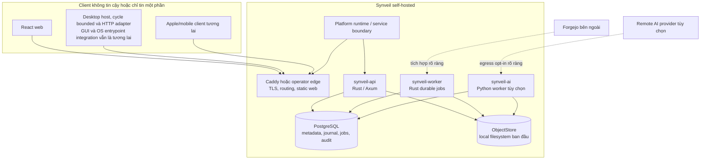
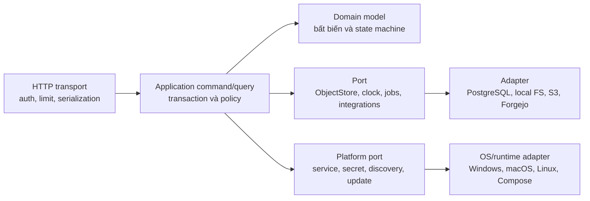

# Kiến trúc hệ thống

Trạng thái: **Blueprint quy chuẩn**

## Kiến trúc tổng quan

Synveil bắt đầu là modular monolith với hợp đồng domain rõ ràng. Một codebase
Rust tạo ra tiến trình HTTP API và tiến trình background worker bền vững; cả hai
dùng PostgreSQL và chung adapter ObjectStore. React web là client xác thực được
phục vụ dưới dạng static asset. Runtime Python riêng là tùy chọn và chỉ dùng cho
AI/OCR/embedding. Ranh giới platform runtime cho phép cùng core được đóng gói
thành Personal / Home Mode trên Windows, macOS, Linux Desktop và Linux Server,
hoặc vận hành thành Advanced / Server Mode với Docker Compose và infrastructure
tùy chỉnh.

Mô hình này giảm failure mode phân tán nhưng vẫn giữ ranh giới để hỗ trợ client
SDK, S3, worker độc lập và scale ngang khi có số đo chứng minh.



Mũi tên không tự cấp quyền tin cậy. Mọi request phải xác thực và authorize tại
ranh giới resource; worker claim job có scope và đọc original qua capability
server-side, không dùng object URL công khai.

## Bất biến kiến trúc

1. Response tạo file version thành công có nghĩa Object chuẩn đã bền vững và
   checksum được xác minh theo backend cấu hình.
2. Metadata không bao giờ công bố Object tạm hoặc chưa hoàn tất thành
   `FileVersion` committed.
3. Mỗi mutation người dùng thấy cùng `ChangeEvent`, audit fact và outbox bắt
   buộc được commit trong một giao dịch PostgreSQL.
4. Change sequence theo `Library` phản ánh thứ tự commit: client đã tiến qua `n`
   không thể bỏ sót event có sequence `≤ n` xuất hiện sau.
5. Retry dùng kết quả idempotency đã lưu phía server. Mất response không tạo thêm
   version, object reference, share hoặc mutation.
6. File content version và backup snapshot là bất biến. Restore tạo current state
   mới chứ không viết lại lịch sử.
7. Xóa trong sync tạo tombstone/Trash và lan truyền. Thiếu nguồn backup chỉ ảnh
   hưởng manifest snapshot mới; không xóa lịch sử ngoài retention.
8. ID và object key không phải authorization. Mọi lookup phải scope theo owner,
   membership, device grant hoặc share capability đã xác thực.
9. AI, OCR, thumbnail, repository indexing và notification là dữ liệu dẫn xuất
   eventual. Sự cố không rollback core data.
10. GC chỉ xóa Object được chứng minh không còn tham chiếu từ live version,
    trash retention, backup manifest, rendition, staging lease, hold hoặc active
    job, và chỉ sau safety grace period.
11. Personal / Home Mode và Advanced / Server Mode dùng chung protocol, domain
    model, metadata authority, storage correctness model và security model.
    Khác biệt đóng gói không được tạo data model không tương thích.
12. Platform service, OS credential store, path semantic và filesystem
    accelerator đi qua port/capability tường minh; domain logic không phụ thuộc
    trực tiếp Windows Service, launchd, systemd, Docker hay feature filesystem
    riêng của host.

## Các lớp logic



- **Transport** parse input có giới hạn, xác thực, map stable error; không chứa
  SQL hoặc filesystem path.
- **Application** sở hữu transaction boundary của use case, authorization,
  idempotency và orchestration.
- **Domain** mô tả chuyển trạng thái không phụ thuộc kiểu Axum, SQLx hay vendor
  storage.
- **Port/adapter** cô lập database, ObjectStore, clock, random, durable job,
  external integration, platform service, secret store, storage discovery và
  update coordination.

Ranh giới crate bắt buộc chiều dependency nhưng crate giai đoạn đầu vẫn nằm
trong cùng deployment thay vì gọi qua mạng.

## Monorepo đề xuất

```text
synveil/
├── apps/
│   ├── web/                       # React + TypeScript + Vite
│   └── docs/                      # docs site tương lai, không thay prose chuẩn
├── crates/
│   ├── domain/                    # ID, entity, policy, state machine
│   ├── application/               # command/query và điều phối authorization
│   ├── api/                       # Axum transport, map lỗi
│   ├── auth/                      # credential, session, device grant
│   ├── metadata-postgres/         # SQLx repository và transaction unit
│   ├── object-store/              # trait, representation, integrity contract
│   ├── object-store-local/        # adapter filesystem an toàn
│   ├── object-store-s3/           # adapter S3-compatible về sau
│   ├── uploads/                   # máy trạng thái UploadSession
│   ├── sync/                      # journal, mutation, cursor, conflict
│   ├── backup/                    # set, manifest, snapshot, restore plan
│   ├── sharing/                   # ACL và link capability
│   ├── photos/                    # asset, rendition, album
│   ├── jobs/                      # worker job/outbox PostgreSQL
│   ├── integrations/              # giao diện connector
│   └── observability/             # tracing, metric, health contract
├── bins/
│   ├── synveil-api/
│   └── synveil-worker/
├── services/ai/                   # Python service/worker tùy chọn
├── clients/
│   ├── sync-core/                 # state machine client Rust tương lai
│   ├── ios/                       # tương lai, không scaffold ở Phase 0
│   ├── macos/
│   ├── windows/
│   └── linux/
├── api/openapi.yaml               # hợp đồng public đã review
├── migrations/                    # SQL migration tiến có thứ tự
├── deploy/                        # Compose, Caddy, image, runbook
├── docs/{en,vi,adr}/              # blueprint chuẩn
├── scripts/                       # thao tác lặp lại, không chứa secret
└── tests/                         # fixture protocol, E2E, recovery, conformance
```

Tên là ranh giới đề xuất, không bắt buộc tạo mọi crate ngay. Tránh dependency
vòng và thư mục common thành nơi chứa mọi thứ.

## Component và ranh giới lõi

### Web

Web chỉ dùng HTTP API đã ghi. Không đọc DB, dựng object path hay sở hữu sự thật
sync. Ban đầu download có thể stream qua API; signed URL ngắn hạn về sau vẫn
phải giữ cùng authorization và audit.

### Rust API

API thực hiện authentication, resource authorization, validation, streaming,
conditional mutation và metadata query. Hash/nén tốn CPU chạy với concurrency
giới hạn ngoài hot path async executor Tokio. API không chờ enrichment tùy chọn.

### Rust worker

Worker claim job PostgreSQL bền vững bằng lease và cơ chế tương tự `FOR UPDATE
SKIP LOCKED`. Job là at-least-once, idempotent, có giới hạn và quan sát được.
Job đầu gồm cleanup staging, đối soát orphan, verify toàn vẹn, retention/GC,
thumbnail và integration polling. API/worker có thể chung image nhưng command và
resource limit riêng.

### PostgreSQL

PostgreSQL là nguồn sự thật cho identity, quan hệ authorization, logical node,
version, object metadata/reference, upload state, change journal có thứ tự,
backup manifest, share, job và audit. Nội dung chuẩn lớn không phải BLOB.
Transaction dùng isolation, row/advisory lock, constraint và retry rule rõ theo
use case.

### ObjectStore

`ObjectStore` cung cấp staged write dạng luồng, đọc/range-read immutable bản
committed, head metadata, abort và delete dưới quyền server. Adapter local dùng
root cấu hình, key sinh tự động, không nối path người dùng, tạo temp độc quyền,
atomic rename khi filesystem hỗ trợ và bước durability. S3 dùng key immutable
đã hoàn tất, không dựa vào rename. Hợp đồng khai báo capability để adapter không
giả vờ có atomic rename hay strong listing.

### Python AI worker

AI runtime tùy chọn đọc job cùng input dẫn xuất được cấp quyền, tạo index record
gắn version và ghi lỗi mà không sửa Object chuẩn. Chế độ `DISABLED`, `LOCAL`,
`REMOTE` rõ ràng. Remote mode công bố provider, loại dữ liệu, retention và egress.

### Integration

Connector chuyển external state thành repository metadata và backup job của
Synveil. Forgejo vẫn quản Git protocol, packfile, ref, issue, pull request và
permission. Credential lỗi chỉ làm integration stale, không làm Drive ngừng.

### Platform runtime và service lifecycle

Personal / Home Mode về sau có thể dùng native installer và OS service manager.
Advanced / Server Mode có thể dùng Compose hoặc native package cho operator.
Cả hai dùng lifecycle contract trung lập platform cho install, configure, thứ tự
startup, graceful shutdown, crash recovery, health, log, update và uninstall.
Contract quản lý API, worker, PostgreSQL managed (khi chọn), storage health và
update coordinator thành các trách nhiệm tách biệt.

Platform adapter sở hữu chi tiết Windows Service, launchd, systemd, supervisor
user-session hoặc Compose. Application/domain core chỉ thấy state ổn định
`STARTING`, `READY`, `DEGRADED`, `STOPPING`, `FAILED`, `MAINTENANCE` và
diagnostic record có giới hạn; không gọi trực tiếp OS API.

Database canonical vẫn là PostgreSQL. Managed PostgreSQL adapter tương lai có
thể provision/configure/start/stop/upgrade/backup/recover private hoặc system
service cho Personal / Home; Advanced / Server tiếp tục hỗ trợ PostgreSQL do
operator quản lý. Distribution cụ thể mở trong `PLATFORM.md` và ADR-019.

## Đường mutation chuẩn

Tạo content đi qua ranh giới DB/ObjectStore không thể dùng chung giao dịch, nên
Synveil dùng thứ tự ghi byte bền vững trước:

```mermaid
sequenceDiagram
    participant C as Client
    participant A as Rust API
    participant S as ObjectStore
    participant P as PostgreSQL
    participant W as Worker

    C->>A: stage content / complete(idempotency key)
    A->>S: stream, hash, verify, make immutable
    S-->>A: durable object key + representation metadata
    A->>P: transaction: Object + ObjectReplica + FileVersion + Node + ChangeEvent + audit + outbox
    alt transaction commit
        P-->>A: committed result
        A-->>C: success + ETag/version/cursor
        W->>P: claim outbox at least once
    else transaction rollback
        P-->>A: failure
        A-->>C: stable retryable/non-retryable error
        Note over S,W: byte bền vững chưa tham chiếu; đối soát sau grace
    end
```

DB không commit tham chiếu tới Object còn đang upload. Nếu finalize Object lỗi,
session còn retry được hoặc fail mà metadata không nhìn thấy. Nếu DB commit lỗi
sau durability, Object là orphan candidate có grace period. Nếu mất response
sau commit, cùng idempotency key trả kết quả đã lưu.

Với thao tác chỉ metadata như rename, move, trash, restore, sửa share, domain
update, ETag/version, journal, audit và outbox cùng một transaction DB.

## Mô hình nhất quán

### Ranh giới mạnh

Trên PostgreSQL primary, metadata liên quan authorization, current node state,
tạo FileVersion, uniqueness move/rename, trash/restore, share, complete upload,
thứ tự change trong một Library, commit backup snapshot và publish job là nhất
quán giao dịch.

Sau response success, Object chuẩn phải đọc được từ backend. Nếu backend không
đảm bảo read-after-write với key, adapter phải verify hoặc hoãn success thay vì
làm yếu API.

### Ranh giới eventual

Search extraction, thumbnail, OCR, embedding, tag tự động, storage-health
rollup, integration inventory, notification, GC và physical accounting có thể
trễ. Response phải lộ freshness/job state khi cần.

### Đồng thời

Client mutation Node với `If-Match`/base version. Mismatch trả
`version_conflict` ổn định hoặc tạo conflict copy theo protocol cho content đến;
không bao giờ last-writer-wins làm mất byte. Row clock Library được lock gần cuối
transaction để cấp journal sequence theo commit order. Ban đầu chấp nhận tuần tự
mutation ngắn theo Library để cursor đúng; muốn shard clock phải có ADR và test
conformance.

### Phục hồi cursor

Change cursor chứa version, Library identity, epoch, last sequence trong encoding
mờ đục có xác thực. Khi history hết hạn, trả lỗi cursor-expired cùng route tạo
snapshot/rebaseline. Client không tự reset về 0 và đoán.

## Event và job

Các họ domain event minh họa gồm tạo/cập nhật/move/trash/restore file, hoàn tất
upload, hoàn tất backup, thêm photo và cập nhật repository. Đây là mô tả khái
niệm, không phải tên event trên wire. Protocol spec sở hữu định nghĩa chính xác
cho từng kind `ChangeEvent` hoặc tên/schema outbox có version; chúng phải được
đăng ký trước khi consumer phụ thuộc.

Trong transaction có thể lưu cả `ChangeEvent` cho client và outbox nội bộ,
nhưng đây là các hợp đồng khác nhau:

- change event là sự thật sync có thứ tự, giữ bền vững và có tombstone;
- outbox/job là lệnh công việc at-least-once với attempt, lease, backoff,
  next-run, terminal/dead-letter và identity idempotent;
- audit event là sự thật security/accountability append-oriented với quyền và
  retention chặt hơn.

Registry durable job ban đầu bao gồm rõ: tạo thumbnail, dispatch AI indexing/
OCR, dọn staging và garbage collection, kiểm tra toàn vẹn Object, cleanup
backup retention, backup/poll repository và kiểm tra storage health. Trước khi
bật, mỗi job phải định nghĩa identity idempotent, loại lỗi retryable, resource
limit, mục tiêu freshness và thao tác cuối cho operator. Có thể pause job tùy
chọn mà không xóa source event.

Giai đoạn đầu không cần message broker. Broker về sau chỉ phân phối delivery,
không trở thành nguồn sự thật; PostgreSQL outbox vẫn là ranh giới bàn giao khi
migration.

## Authentication và authorization

Bootstrap route dùng một lần rồi tắt sau khi tạo administrator đầu tiên. Mật
khẩu dùng Argon2id đã kiểm chứng với tham số có phiên bản. Browser session là
token ngẫu nhiên mờ đục trong cookie `Secure`, `HttpOnly`, `SameSite` phù hợp;
DB chỉ lưu hash. Request đổi trạng thái bằng cookie có chống CSRF rõ ràng.
Credential thiết bị tương lai là bearer secret ngẫu nhiên 256-bit, có scope,
rotate/revoke riêng, lưu hash ở server và bảo vệ bằng Keychain/kho OS ở client.

Authorization dùng policy tập trung với principal, resource, owner/membership,
share grant, device scope và action. ID không đủ để cấp quyền. Public share là
capability token entropy cao; server lưu hash, expiry, password verifier tùy
chọn, permission, rate limit và revocation.

Baseline account recovery đã đóng băng là recovery code một lần có thể in.
OD-005 phải quyết định có thêm administrator override self-host được audit rõ
ràng và/hoặc email delivery đã cấu hình trước public registration hay không;
baseline này không giả định hai path đó đã triển khai. MFA/WebAuthn bổ sung về
sau.

## Storage, nén, dedup và mã hóa

Chuỗi logic:

```text
Node → current FileVersion → immutable Object → ObjectReplica → physical representation
```

Rename/move đổi metadata, không di chuyển object nhiều GB. `Object` có ID mờ
đục, dedup domain, plaintext size/SHA-256 chuẩn, trạng thái verify/vòng đời tổng
hợp và lifecycle timestamp. Mỗi `ObjectReplica` ghi backend cùng storage key mờ
đục, stored size/checksum representation, metadata codec/encryption, trạng thái
replica và bằng chứng verify. Mặc định whole-object reuse chỉ trong cùng
owner/dedup domain.

Compression policy stream/sample loại phù hợp và có thể dùng Zstandard.
Plaintext hash tính trên byte chuẩn trước nén; checksum representation phát hiện
hỏng byte lưu. Nội dung đã nén/mã hóa để nguyên. Báo logical quota tách physical
accounting.

Transport dùng TLS. Mã hóa server-side ban đầu dựa vào encrypted volume/backend
hoặc provider encryption. Application-managed encryption nếu có dùng primitive
chuẩn đã review và envelope có version. Nén trước mã hóa; ciphertext gần như
không nén được. Zero-knowledge E2EE là quyết định product lớn vì xung đột dedup,
preview, OCR, semantic search, nén, recovery và public sharing; kiến trúc này
không hứa E2EE.

## Thay storage backend

Backend được đăng ký/health-check; mỗi `ObjectReplica` ghi một backend và key,
trong khi `Object` không phụ thuộc backend. Migration copy representation bất
biến, verify theo `Object` chuẩn, thêm/chuyển replica được chọn bằng giao dịch,
chờ rollback window rồi mới bỏ replica cũ. Không đổi ID `Node`, `FileVersion`
hay `Object`. Trong giai đoạn chuyển, nhiều backend cùng tồn tại là hợp lệ.

Đổi path mount trong config không phải migration. Startup phát hiện storage
identity thiếu/sai và fail readiness thay vì coi mọi Object đã mất.

## Client tương lai

Server cung cấp streaming HTTP, range request, resumable upload, conditional
mutation, snapshot listing và cursor changes không phụ thuộc browser. Device
registration/scope hỗ trợ:

- desktop selected-folder two-way sync, upload-only backup, download-only
  mirror, cloud-only và pinned policy;
- core client Rust dùng chung cho protocol, journal, retry, conflict và local
  state; shell nền tảng quản filesystem integration;
- Android client tôn trọng giới hạn background, permission và pin của Android;
- Apple client dùng FileProvider/PhotoKit thay vì giả định truy cập filesystem
  tự do hoặc background vô hạn;
- capability negotiation cho placeholder, case sensitivity, sparse file,
  range-read, background transfer và nhóm live-photo-like.

Protocol đầu phải bảo thủ: capability không hỗ trợ được biểu diễn rõ, không giả
lập âm thầm.

## Deployment và tiến hóa scale

### Topology hỗ trợ ban đầu

Một Compose project chạy Caddy/static web, API, worker, PostgreSQL và AI tùy
chọn. Volume DB/Object tách nhau nhưng backup phối hợp cùng config/master secret.
Chưa cần nhiều API process cho đến khi test chứng minh job/sequence coordination
an toàn.

Đây là topology tham chiếu của Advanced / Server Mode, không phải installation
user-facing duy nhất về sau. Personal / Home Mode dự kiến do installer và
platform runtime quản lý: user chọn storage bền vững, Synveil quản dependency
database/service được hỗ trợ, nhưng vẫn dùng cùng API/domain/storage model. Xem
[PLATFORM.md](PLATFORM.md) và [DEPLOYMENT.md](DEPLOYMENT.md).

### Trigger scale

- Thêm S3/MinIO khi capacity, durability domain hoặc truy cập nhiều host cần;
  không chỉ vì adapter đã có.
- Thêm API replica sau khi test shared rate limit/session và read-after-write.
- Thêm worker replica bằng lease DB khi queue latency/CPU yêu cầu.
- Chỉ thêm broker khi đo thấy polling PostgreSQL là bottleneck hoặc cần topology
  delivery độc lập.
- Chỉ dùng read replica cho query chấp nhận lag; không dùng cho authorization
  ngay sau mutation hay cấp cursor.
- Chỉ xét Kubernetes/multi-node khi Compose operation, backup, restore và upgrade
  đã trưởng thành.

Không yêu cầu sớm Kafka, RabbitMQ, NATS, Redis Cluster, Elasticsearch, service
mesh, distributed consensus, filesystem riêng hay custom crypto.

## Hợp đồng observability

Mọi process phát structured log/trace với request/operation ID, principal/device
ID được che bớt, stable error code, duration, byte count và outcome. Metric bao
gồm request, upload stream, DB pool, tuổi/attempt job, change-feed lag, capacity/
lỗi backend, integrity failure, tuổi backup và freshness worker.

Liveness nghĩa event loop còn phản hồi. Readiness nghĩa config hợp lệ và
PostgreSQL cùng Object backend vượt bounded check. Probe ghi storage đắt tiền
chạy định kỳ và feed kết quả cache, không tạo file mỗi lần probe.

Không log password, raw session/device/share token, integration secret, remote
AI payload, file content, full sensitive path hoặc DB URL chứa credential.

## Ma trận lỗi

| Lỗi | Hành vi bắt buộc |
|---|---|
| Disk đầy khi staging | Dừng stream có giới hạn, giữ/hủy resumable state an toàn, trả `storage_unavailable`/quota, không tạo version nhìn thấy. |
| Object bền vững, DB commit lỗi | Không có logical reference; đánh dấu/đối soát orphan sau lease và grace; retry cùng session có thể dùng lại staging đã verify. |
| DB commit xong, mất response | Cùng idempotency/mutation key trả kết quả committed; không lặp version/event. |
| Complete lặp | Tuần tự hóa completion và trả đúng một terminal outcome đã lưu. |
| Worker/AI offline | Core commit thành công; job bền vững bị trễ và quan sát được. |
| PostgreSQL không sẵn sàng | Từ chối metadata mutation; không nhận canonical data không thể theo dõi. |
| Object backend lỗi | Read trả lỗi retryable ổn định; content commit không publish metadata. |
| Sync cursor stale | Trả chỉ dẫn snapshot/rebaseline, không âm thầm bỏ event. |
| Forgejo lỗi | Integration stale/error; core domain không bị ảnh hưởng. |
| Stored checksum sai | Cách ly location, cảnh báo, thử nguồn dự phòng đã verify; không trả byte hỏng như hợp lệ. |

State machine chi tiết nằm trong đặc tả storage, upload, sync và backup.

## Quyết định còn mở

- **OD-001, portable name policy:** Unicode case-fold/version chính xác và có
  cho Library mới chọn case-sensitive không. Cần trước schema/API Phase 1;
  khuyến nghị mặc định portable, case-insensitive bất biến, giữ display name.
- **OD-002, storage durability profile:** yêu cầu `fsync` local chính xác và
  trade-off hiệu năng theo filesystem. Cần trước khi adapter local production-
  ready.
- **OD-003, account isolation:** thuật ngữ owner/membership cho cá nhân/gia đình
  và tenant tương lai. Cần trước khi freeze schema share; mặc định owner rõ ràng
  và không dedup xuyên owner.
- **OD-004, license:** giữ MIT hay chủ động relicense/chia module. Owner quyết
  định trước khi nhận code bên ngoài theo chính sách mới.
- **OD-005, recovery delivery:** bắt buộc recovery code; email/admin override
  cần quyết định security/product trước public registration.
- **OD-006, local AI baseline:** model/runtime/hardware hỗ trợ là lựa chọn Phase
  10 dựa benchmark, không phải dependency core.
- **OD-PLAT-001, managed PostgreSQL distribution:** Personal / Home có thể dùng
  PostgreSQL bundled/private, system-managed hoặc packaged; authority canonical
  không đổi. Xem `PLATFORM.md` và ADR-019.
- **OD-PLAT-002, service supervisor:** lifecycle port trung lập platform và OS
  supervisor least-privilege phải được đóng trước native service code.
- **OD-PLAT-003, remote access:** chọn LAN/direct/NAT/VPN/relay tùy chọn,
  metadata visibility, đường content, self-hostability và failure behavior còn
  mở theo ADR-020.
- **OD-PLAT-004, update automation:** signing, mức opt-in, backup gate,
  migration coordination, rollback limit và air-gapped behavior còn mở.
- **OD-PLAT-005, machine migration:** guided transfer hay package encrypted
  portable phải chọn sau test destination sạch, key và device.

Câu hỏi triển khai khác theo thứ tự ADR/spec trong
`CONTRIBUTING_ARCHITECTURE.md`.

## Boundary inbound desktop Prompt 36

`crates/client-sync` là core apply inbound desktop trung lập transport. Boundary
chủ ý tách thành ba port rõ ràng:

- `SyncRemote` lấy page bootstrap, page change feed, chunk content và thực
  hiện hai handoff server (ack feed và complete bootstrap). Core vẫn trung lập
  transport; Prompt 37 cung cấp HTTP implementation production nhưng không thêm
  background scheduling.
- `LocalStateStore` sở hữu một SQLite single-writer theo vị trí app-state
  desktop. Nó lưu scope, intent manifest/feed, checkpoint applied và
  acknowledged, operation receipt, tiến trình bootstrap, projection node/path
  và local apply issue bền vững.
- `LocalReplica` là mutation surface filesystem duy nhất. Nó bind root do user
  chọn (kể cả tree đã có dữ liệu khi flow tạo remote library mới) với identity owner/device/library, validate từng relative path và
  ancestor thật ngay trước mutation, stage content đã verify, và chỉ
  expose operation directory/file/trash/restore/purge có kiểu.

Engine cố ý xử lý mỗi lần một page hoặc batch có giới hạn. Feed
page được lưu trước filesystem work; mọi event được apply và commit
local trước khi ack page token từ xa; checkpoint acknowledged local chỉ
tiến sau khi server chấp nhận token. Page bootstrap bền vững trước
reconcile, manifest đầy đủ được validate trước terminal apply,
materialization chạy parent-first, generation sweep chỉ xóa node stale đã
tracked, và completion handoff chỉ xảy ra sau khi local complete.

Vocabulary phase public là `Uninitialized`, `Bootstrapping`, `Ready`, `Offline`,
`Diverged`, `Paused` và `NeedsRebaseline`. Prompt 36 triển khai inbound core
sau boundary này. Prompt 37 thêm remote connection và credential boundary bên
dưới. Prompt 38 thêm filesystem observation local và durable outbound-intent
queue. Prompt 91 thêm cycle one-shot bounded trung lập transport, có thể submit
một outbound unit durable sau inbound convergence an toàn. Prompt 94 thêm
composition root cấp application `DesktopSyncHost` cùng seam lifecycle/network
trung lập platform; GUI, wiring entrypoint desktop thật, automatic conflict
resolution, native packaging và claim platform release-lab vẫn nằm ngoài
component này.

## Boundary remote identity Prompt 37 và observation local Prompt 38

Desktop inbound core đã **VALIDATED**. Server profile bền vững, device enrollment
groundwork, device bearer authentication, secure desktop credential persistence
và production HTTP `SyncRemote` đã **VALIDATED**. Filesystem observation,
self-generated change suppression, durable outbound intent capture, rename/move
attribution với conservative fallback, watcher overflow/rescan handling, cycle
bounded outbound Prompt 91, runtime process-local Prompt 92 và composition root
Prompt 94 đã **IMPLEMENTED**. Automatic conflict resolution, desktop
GUI/pairing UX, wiring OS entrypoint thật và policy service/autostart đều
**NOT IMPLEMENTED**.

`OutboundObservationEngine` observe đúng một managed root và không giữ remote
transport. `LocalChangeWatcher` chỉ phát raw hint `CREATE_HINT`, `MODIFY_HINT`,
`REMOVE_HINT`, `RENAME_HINT`, `METADATA_HINT` hoặc `RESCAN_REQUIRED`; classification
chỉ xảy ra sau managed-root validation và reinspection qua `LocalReplica`.
Migration SQLite `0003_outbound_observation.sql` persist `outbound_intents`,
observation issue, rescan state/progress, overlay observed Node local và
suppression evidence từ operation Prompt 36. Overflow, backend loss, shutdown
uncertain và startup gap đều buộc bounded reconciliation thay vì claim complete
ngầm. Observer loại trừ `.synveil/`, không follow symlink/reparse path, hash file
bằng streaming, và ghi fact unsupported/collision/ambiguous thành local issue
thay vì intent mất an toàn.

`ServerProfileId` là UUIDv7 local opaque, không phải hostname, LibraryId hay
bearer. `ServerProfile` chỉ chứa canonical origin bất biến, display label,
creation time và thời điểm kết nối thành công gần nhất. Parser `url` chuẩn hóa
scheme, host/IDNA, IPv6 và port. Production chỉ nhận HTTPS origin root: không
userinfo, query, fragment, reverse-proxy subpath, port sai, sửa lỗi URL ngầm hay
tùy chọn bỏ certificate verification. Constructor test explicit chỉ cho HTTP
với numeric loopback IP. Server hiện chưa expose stable installation identity;
binding hiện là TLS/origin đã verify, không tạo pseudo-ID yếu từ hostname.

Ba binding profile được kiểm tra độc lập:

- Migration SQLite `0002_server_profiles.sql` thêm profile và enrollment
  owner/Device/credential metadata không bí mật. Replica row bất biến có
  `server_profile_id`.
- Managed root production dùng `SYNVEIL_MANAGED_ROOT_V2`, ghi cùng profile ID
  bên cạnh owner, Device, Library và root binding ID.
- `HttpSyncRemote` giữ profile bất biến cùng `LoadedDeviceCredential` lấy từ
  SecretStore entry của profile đó. Enrollment storage chỉ nhận opaque exchange
  receipt bind profile cùng exact origin, không có raw bearer-import API.
  Constructor transport chặn profile/Device khác, và
  từng request kiểm tra owner/Device scope.

Engine verify cả ba trước network/local apply, gồm credential ID đang active.
Local forget hoặc replacement explicit vì thế chặn engine cũ đã tạo. Root V1
và replica row unbound sau migration vẫn dùng được cho legacy test trung lập
transport; không thể suy luận profile production từ chúng. Chưa có explicit
rebind workflow. SQLite database thứ hai không thể override profile trong
physical root marker.

`PlatformRuntime::SecretStore` hiện có là boundary persist bearer duy nhất.
Linux native dùng persistent Secret Service qua D-Bus session mã hóa; Windows
dùng Credential Manager qua native builder `keyring` explicit. Thay global
keyring mock không thể thay builder production. Adapter macOS/generic vẫn
Unsupported rõ ràng ở phase này. Secure store bị khóa, thiếu hoặc lỗi đều
fail closed qua error đã sanitize, không fallback plaintext SQLite/file.
`SecretValue` hiện có và shared machine-secret wrapper che Debug và zeroize
owned storage.

Secret entry dùng opaque profile ID cộng credential ID, không raw URL. Value
bên trong secure store là envelope có version và giới hạn, chứa canonical
origin, transport policy, ID profile/owner/Device/credential và bearer. Load,
overwrite và cleanup delete đều validate envelope; copy/reconstruct SQLite
cùng ID nhưng origin khác không thể load, thay hay xóa credential origin gốc.
Loaded credential giữ origin đã verify từ secure store, và HTTP constructor
kiểm tra lại trước khi tạo Authorization header. Raw legacy value/envelope không
tương thích fail closed; không có credential-import fallback dễ dãi. Lifecycle
ghi cleanup intent không bí mật trước khi store secret mới, read-back rồi commit
enrollment metadata. Replacement phải explicit và cùng owner/Device; xóa key cũ
bền vững và retry được. Forget ghi disconnected marker bền trước khi xóa secure
entry. Delete lỗi được báo và retry sau restart; engine không reload credential
cũ. Forget giữ file local, sequence applied/acknowledged và pending evidence,
không hứa server revoke khi offline. Caller phải drop direct transport object
đã load; engine còn kiểm tra enrollment hiện tại trước mỗi lần synchronize.

Middleware server phân biệt browser-session principal với principal
owner/Device/credential. Browser state change vẫn bắt buộc CSRF. Chỉ bearer
authenticate thành công mới được miễn CSRF trên inbound route; device credential
không cấp quyền mutation Prompt 34 hay resolution Prompt 35. Enrollment một lần
không retry sau response mơ hồ; recovery là owner revoke explicit rồi tạo grant
mới.

HTTP adapter production tắt redirect, cookie storage, ambient proxy và
transparent compression, validate timeout/body budget hữu hạn, stream logical
byte với verify length/hash có giới hạn. Native Linux Secret Service persistence
được test bằng synthetic vault cô lập, gồm đọc entry đã lưu từ process mới
trước khi xóa. Validation Windows gồm cross-target compile toàn workspace và
link test executable client-sync/platform bằng MinGW. Chưa chạy các executable
này trên host Windows native: bằng chứng runtime Credential Manager, TLS và
filesystem vẫn đợi checkpoint Prompt 40.

## Cycle hai chiều bounded Prompt 91

`BidirectionalSyncCycleRunner` là composition seam phía client được runtime
Prompt 92 và caller khác sử dụng. Nó trung lập transport và scope theo một
`ReplicaScope`/Library. Operation one-shot inspect state local, advance
`RebaselineConvergenceCoordinator` hiện có một lần, rồi kiểm tra eligibility
mới trước khi gọi `OutboundSubmissionEngine` hiện có tối đa một lần. Inbound
result quyết định base outbound có an toàn hay không; candidate, handoff,
bootstrap, page/ack pending, local issue và root thiếu đều bảo thủ suppress
outbound.

Runner không có scheduler, timer, daemon, lock process-global, cycle table hay
transport mới. Prompt 87 vẫn là owner của inbound/rebaseline recovery bounded;
Prompt 88 vẫn là owner của chọn intent durable, idempotency, upload/mutation,
reconciliation và conflict fence. Hai guard theo Library hiện có bảo đảm loại
trừ caller cùng Library, còn Library khác vẫn tiến độc lập. Restart dựa trên
SQLite record và server idempotency fact hiện có, không dựa vào state ephemeral
của runner. Prompt 92 sở hữu recurrence riêng qua boundary scheduler hẹp được
mô tả bên dưới.

## Runtime đồng bộ chạy dài Prompt 92

`SyncRuntime` là boundary lifecycle và scheduling chỉ trong process, nằm trên
Prompt 91. Nó đăng ký một `BidirectionalSyncCycleRunner` đã được dựng sẵn (hoặc
port hẹp `SyncCycleExecutor`) cho mỗi Library và chỉ gọi `run_once`. Caller vẫn
chịu trách nhiệm dựng `SyncRemote` authenticated, local replica và runner;
runtime không suy đoán adapter hay credential từ một row SQLite.

Runtime sở hữu một supervisor duy nhất, control `start`/`stop`/`join`, state
lifecycle theo Library, wake metadata coalesced, safety polling định kỳ,
scheduling transient bounded và event observability bounded, non-blocking.
Startup làm cho mỗi Library đã đăng ký có một cycle đầu tiên runnable. Wake
`LocalChange`, `Manual`, `NetworkAvailable` và `CredentialChanged` có thể làm
Library idle runnable sớm; wake trong cycle được giữ thành một cơ hội follow-up.
`AuthBlocked` ngăn request định kỳ thông thường cho đến manual hoặc credential
wake; work rate-limited tôn trọng fallback delay đã validate.

Mỗi Library có tối đa một call Prompt 91 đang chạy. Active-set global (mặc
định bốn, hard maximum đã validate là 1.024) giới hạn số Library chạy đồng
thời; tail requeue round-robin cho Library khác được lượt sau mỗi cycle
productive bounded. Idle dùng safety poll mặc định 30 giây. Outcome transient
và recovery-blocked dùng exponential backoff tất định, cap 60 giây; local
failure hoặc panic chỉ fault Library đó. Conflict chưa resolve chỉ fence
outbound qua Prompt 88, không dừng inbound polling.

Runtime state là ephemeral: không có migration runtime, schedule table, cycle
journal, retry counter hay agent record. Shutdown graceful dừng start mới, cho
future Prompt 91 đang chạy hoàn tất, drain completion rồi mới cho `join` trả.
Restart dựng lại runtime từ registration explicit và tiếp tục work từ durable
state Prompt 87/88. Component không thêm service manager, filesystem watcher,
server push, broker, route, frontend persistence hay lifecycle OS-specific.

## Signal runtime theo thứ tự durable-change trước Prompt 93

Prompt 93 nối các producer local thật vào runtime process-local duy nhất qua
boundary hẹp `SyncWakeNotifier`. Dependency đi theo hướng producer ->
notifier/runtime handle; `LocalStateStore` không biết scheduler concrete. Thứ
tự chuẩn là:

```text
local event hoặc input controller
  -> commit SQLite durable intent/observation hoặc credential
  -> release boundary writer/transaction theo Library
  -> wake runtime best-effort
  -> Prompt 92 schedule một cycle Prompt 91 bounded
```

`OutboundObservationEngine` gắn notifier lúc construct. Một reconciliation
batch gom các durable intent thay đổi vào một notification bit trong memory và
chỉ gửi tối đa một wake `LocalChange` cho Library. Rescan/overflow nhiều batch
giữ bit này đến khi reconciliation hoàn tất; watcher, suppression, rename
attribution và rescan semantics hiện có vẫn là authority. Exact duplicate,
self-generated suppression, path `.synveil/` bị ignore và inspection no-op
không wake.

Producer intent durable khác dùng `OutboundIntentProducer`, trả
`DurableChangeNotification` tách durable result khỏi wake result. Intent write
hoàn tất trước khi release writer guard và gọi notifier. `RuntimeStopped` hoặc
`UnknownLibrary` được caller thấy nhưng không undo intent; startup và runtime
periodic poll vẫn là đường recovery khi signal mất. Caller upload content phải
commit source metadata local cần thiết trước khi dùng boundary post-commit này.

Credential lifecycle adapter gọi workflow secure-store/enrollment hiện có trước.
Chỉ enrollment hoặc replacement usable đã verify thành công mới emit
`CredentialChanged` cho các Library affected sau khi deduplicate. Validation/
persistence fail và credential removal/logout không emit usable-credential wake.
Platform network adapter tương lai có thể gọi `network_available()` như hint;
nó không bypass authentication, conflict fence hay precondition Prompt 91.
Controller gọi `sync_now(library_id)` chỉ nhận scheduling status; không gọi
Prompt 91 trực tiếp và không hứa full convergence.

Wake status bounded gồm `Queued`, `Coalesced`,
`AlreadyRunningFollowupRecorded`, `RuntimeStopped` và `UnknownLibrary`. Mọi
clone runtime/control/notifier cùng trỏ đến một supervisor `Arc`. Wake race với
registration hoặc đến sau unregister có thể unavailable, còn local work durable
vẫn nguyên vẹn để re-register/startup. Không thêm persistent wake queue,
scheduler migration, service manager, OS network monitor, watcher mới, route,
frontend state hay server push channel.

## Composition host đồng bộ desktop và lifecycle tiến trình Prompt 94

`DesktopSyncHost` là composition root cấp application cho stack Prompt 91–93
đã được chấp thuận. Đây không phải state machine đồng bộ thứ tư. Host sở hữu
một `SyncRuntime` cho context owner/Device của process, registration explicit
Library/replica, lifetime của observer, handle điều khiển và (khi mở qua
`open` hoặc `from_platform`) lifetime pool local state. `LocalStateStore`,
`LocalReplica`, `HttpSyncRemote`, engine Prompt 91, scheduling Prompt 92 và thứ
tự durable-before-wake Prompt 93 vẫn giữ ownership/correctness contract hiện có.

Library đầu tiên được register thiết lập context owner/Device của host. Mọi
Library tiếp theo phải cùng context; đăng ký khác account hoặc Device bị từ
chối bằng lỗi typed `WrongScope`, không chia sẻ credential boundary ngầm.
Gen-1 chỉ hỗ trợ một context account/Device cho mỗi host.

Đồ thị composition là:

```text
desktop/client process
  -> DesktopSyncHost
     -> một SyncRuntime + SyncRuntimeHandle + SyncWakeNotifier
     -> một entry Library đã đăng ký cho mỗi local replica durable
        -> LocalReplica + OutboundObservationEngine tùy chọn
        -> BidirectionalSyncCycleRunner Prompt 91
           -> InboundSyncEngine + RebaselineConvergenceCoordinator
           -> OutboundSubmissionEngine
     -> OutboundIntentProducer / CredentialLifecycleController
     -> DesktopLifecycleAdapter / DesktopNetworkAdapter
```

Construction có side effect bounded: validate managed root và binding
SQLite/profile hiện có, compose lower-level graph và register Library nhưng
không start runtime supervisor hay watcher. HTTP Library có thể được construct
khi chưa có enrollment/secret usable. Host chỉ load credential qua
`SecretStore` theo profile hiện có khi cycle chạy; thiếu credential trở thành
outcome `AuthBlocked`. Vì HTTP remote hiện capture credential bất biến, verified
credential replacement chỉ rebuild graph Prompt 91 của Library affected ở cycle
tiếp theo. Bearer byte không đi vào status runtime, scheduler state hay handle.

Startup theo thứ tự deterministic: validate/open local state, resolve profile và
secure provider hiện có, compose runner, register mọi Library, start runtime duy
nhất, rồi mới start observer. Thứ tự này đóng race observer-startup với
registration. Wake bị bỏ lỡ không làm mất work: intent đã commit durable trước,
startup/safety polling của Prompt 92 là recovery path. Register duplicate là
idempotent. Dynamic register khi host đang chạy dùng cùng runtime và chỉ start
observer sau khi đăng ký; unregister chỉ bỏ runtime entry ephemeral, không xóa
sync data.

`DesktopSyncHostHandle` chỉ expose lifecycle, status/event bounded, `sync_now`,
`network_available`, credential-change scheduling và producer/controller Prompt
93. `DesktopLifecycleAdapter` và `DesktopNetworkAdapter` có semantics giống nhau
trên Linux/Windows: process embedding deliver shutdown hoặc positive
network-available hint. Không có OS monitor, retry/conflict logic theo platform,
direct engine call, checkpoint write, service manager, autostart, tray hay UI.
Entrypoint process thật có thể dùng seam này ở phase platform sau.

Shutdown đánh dấu host stopping, cancel observer polling, flush/mark observer
reconciliation, request Prompt 92 shutdown, cho active bounded Prompt 91 hoàn
tất, join runtime task và đóng SQLite chỉ khi host sở hữu. Shutdown/join lặp lại
an toàn; host Stopped là terminal. Process restart tạo host mới trên durable
state cũ và register lại Library explicit. `Drop` chỉ request cancellation best
effort; application phải await shutdown/join trước khi process exit. Quyết định
này được khóa trong [`ADR-036`](../adr/ADR-036-desktop-sync-host-and-process-lifecycle.md).

## Bootstrap process desktop production và root availability (Prompt 95)

Boundary foreground production là package `synveil-client`. Binary entrypoint
cố ý mỏng và tạo Tokio runtime duy nhất trong process:

```text
synveil-client/main
  -> PlatformRuntime hiện tại
  -> client.conf bounded, không bí mật
  -> DesktopClientProcess
     -> một DesktopSyncHost
        -> một SyncRuntime
        -> một registration explicit cho mỗi replica configured
```

Manifest chỉ cung cấp profile ID canonical và reference library/root
explicit. SQLite profile và replica hiện có, managed-root marker vật lý
và `SecretStore` platform vẫn là authority cho server origin, scope
owner/device, root binding, enrollment metadata và credential. Bootstrap
không tạo configured root hoặc replacement marker. Không có process lock hay
state store thứ hai: `state.sqlite3.writer.lock` liền kề hiện có từ chối
opener thứ hai trên cùng local state.

Linux `SIGINT`/`SIGTERM` và Windows Ctrl-C được chuyển thành cùng event
`ShutdownRequested`. Process dừng lifecycle và network adapter rồi delegate
cho graceful shutdown path duy nhất của host. Network native chỉ là positive
hint best-effort. Linux interface inspection và Windows route hint bounded,
không bí mật; lỗi init/runtime thì fallback sang một periodic hint
bounded. Adapter không gọi engine, ghi sync state hoặc bypass gate
authentication/conflict/recovery/root. Service manager, autostart, installer,
tray, GUI và daemon không thuộc boundary này.

Root availability là process state theo từng Library, không phải durable fact:

```text
configured root
  -> Available       (canonical marker và binding validate)
  -> Unavailable     (root missing/lost; observer và cycle bị fence)
  -> Recovering      (same binding validate lại; watcher/rescan đang chạy)
  -> Available       (watcher restart một lần + canonical rescan bounded xong)
```

Root missing dùng deferred replica ghi nhớ binding ID hiện có nhưng không
tạo directory, marker hay deletion intent. `RootGatedCycle` và validation
observer trước drain/trước intent ngăn absence bị hiểu là user deletion.
Root reappear phải có cùng canonical path, profile, scope owner/device/
library và managed-root binding. Chỉ khi khớp, host mới restart watcher
của Library một lần, reconcile thay đổi bounded trong lúc root vắng và
gửi một wake `RootAvailable`. Lifecycle task/status tách theo Library nên
volume removable không làm sibling healthy dừng.

Root availability, host/process status, OS signal state và network hint là
concern application ephemeral. Chúng không thêm PostgreSQL row, SQLite
column, migration, journal event, route, OpenAPI operation, frontend state hay
server push channel. Server migration 36 và client schema V6 giữ nguyên.

## IPC điều khiển desktop cục bộ an toàn (Prompt 96)

Process production có một `DesktopControlServer` duy nhất bao quanh
`DesktopSyncHostHandle` hiện có:

```text
UI / tray / diagnostics tương lai
        -> DesktopControlClient
        -> IPC local frame v1
        -> một control server synveil-client
        -> một DesktopSyncHostHandle
        -> một SyncRuntime
```

Linux dùng runtime directory canonical của platform và Unix socket opaque theo
profile. Control directory `synveil` có quyền owner-only `0700`; socket có
quyền owner-only `0600`; Unix peer credentials phải báo cùng UID. Windows dùng
nhánh named pipe thật theo profile, reject remote client và security descriptor
protected chỉ cho owner. Không có localhost-TCP, HTTP, WebSocket, SSE, public
daemon hoặc fallback hạ quyền. Listener secure thất bại là bootstrap error có
type.

Protocol v1 có ClientHello/ServerHello, prefix độ dài big-endian bốn byte,
payload tối đa 64 KiB, request ID khác zero, dispatch tuần tự mỗi connection
và tối đa 32 connection task. Server translate runtime, root, lifecycle và
process signal hiện có thành event bounded best-effort; không tạo observer thứ
hai hoặc event journal durable. Client chậm, disconnect và malformed bị cô lập;
shutdown chỉ kết thúc task IPC bounded trước khi Prompt 95 tiếp tục.

Gen-1 chỉ gồm Ping, status process/library, `SyncNow`, graceful `Shutdown` và
subscribe event. Status chỉ có category an toàn và ID ổn định; không có raw
root, URL, content, credential, cookie, authorization header hoặc SQLite/
sync-engine data. `SyncNow` đi qua API scheduling Prompt 93/92 hiện có; trả
accepted/coalesced chứ không claim completion. `ShutdownAccepted` được ghi
trước khi đánh thức process lifecycle; handler không gọi `process::exit` hay
abort sync runtime. Quyết định khóa nằm trong
[`ADR-038`](../adr/ADR-038-secure-local-desktop-control-ipc.md).

## Core controller desktop dựa trên IPC (Prompt 97)

Prompt 97 thêm native controller model/client có thể tái sử dụng, không thêm
GUI. Boundary chỉ đi một chiều:

```text
native UI Qt/QML hoặc tray tương lai
             -> DesktopController
                -> DesktopControlClient
                   -> IPC local Prompt 96
                      -> synveil-client đang chạy
                         -> DesktopSyncHost / SyncRuntime hiện có
```

`DesktopController::new` không có side effect. `start()` tạo một relationship
manager cho một profile endpoint, thực hiện handshake protocol v1 Prompt 96
trên mỗi connection, lấy trọn bộ status process/Library và thiết lập event
subscription bounded. Controller chỉ publish state `Connected` / `Fresh` sau
khi process status, library list và status của từng Library đã tạo thành một
snapshot local coherent. Endpoint profile được resolve lại qua resolver
Prompt 96/platform mỗi lần reconnect; controller không tự derive tên socket
hay pipe.

Public state của controller là watch latest-state, không phải event journal.
Snapshot chỉ có connection state, process status an toàn, category Library đã
redact, revision presentation monotonic, freshness, connection generation
local và error category an toàn. Không có root path, URL, file content,
credential, cookie, authorization header, SQLite handle hay sync engine object.
`Fresh`, `Stale` và `Unavailable` là semantics presentation; server/process vẫn
là authority của synchronization correctness.

Event Prompt 96 là invalidation hint. Một pending bit atomic và một event reader
task fold burst thành refresh work. Chỉ một refresh status được chạy cùng lúc;
event tới trong refresh chỉ tạo tối đa một follow-up. Khi disconnect, controller
giữ library list an toàn cuối cùng với freshness `Stale` và dùng lịch reconnect
bounded 250 ms, 500 ms, 1 s, 2 s, 4 s, 5 s. Mỗi attempt có generation mới;
response/event từ generation cũ bị bỏ qua. Endpoint absent là reconnect bình
thường; endpoint-security failure, protocol mismatch và response malformed là
state ổn định có type.

`SyncNow` và `RequestShutdown` dùng một command admission channel bounded tám
item và chỉ route qua Prompt 96. `Accepted`/`Coalesced` chỉ có nghĩa schedule,
không có nghĩa completion. Command khi disconnect không bị queue vô hạn;
response mất trả `OutcomeUnknown`, và không command nào được replay sau
reconnect. `DesktopController::stop()` join task controller/event và chỉ đóng
IPC connection của controller. Nó không tự gọi `Shutdown`, nên UI/controller
exit không dừng `synveil-client` và không đổi sync correctness. Qt/QML,
tray, autostart, service, installer, HTTP route, OpenAPI và database vẫn ngoài
phase này. Decision khóa nằm trong
[`ADR-039`](../adr/ADR-039-ipc-backed-desktop-controller-core.md).

## Shell desktop native Qt 6/QML và system tray (Prompt 98)

Prompt 98 thêm ứng dụng desktop đầu tiên có người dùng nhìn thấy dưới dạng
process `synveil-desktop` riêng. `synveil-client` vẫn là process
synchronization. Shell native dùng một codebase Qt 6/QML và Qt Quick chung cho
Linux và Windows, dùng CXX-Qt làm Rust bridge và embed QML resource. Qt 6.4
là baseline tối thiểu được hỗ trợ; Windows CI pin Qt 6.8.3 và Linux CI phải
provision package Qt 6.4 hoặc mới hơn:

```text
Qt application / QML / system tray
              -> DesktopUiBridge
                 -> một DesktopController
                    -> IPC control local Prompt 96
                       -> synveil-client đang chạy
                          -> DesktopSyncHost / SyncRuntime hiện có
```

Bridge sở hữu lifecycle Qt application, load QML, một async runtime của
controller, tray policy và mapping presentation an toàn. Bridge không sở hữu
`SyncRuntime`, `DesktopSyncHost`, SQLite state, filesystem observer, raw
transport Prompt 96, PostgreSQL, credential hay server metadata. QML không thể
mở Unix socket hoặc Windows named pipe và không serialize IPC frame. Quy tắc
reconnect, freshness và generation của controller vẫn là authority.

Shell chỉ render state bounded: process/connection, library ID và label ổn
định, category root/auth/conflict/runtime, scheduling feedback an toàn và
count bounded. Root path, server URL, content, credential, cookie,
authorization header, secret-store material và raw transport error không xuất
hiện. Library list giữ lại khi reconnect phải có nhãn `Stale`; snapshot fresh
được apply atomically; selection bị clear khi Library bị remove. Mỗi row đủ
điều kiện và detail view đang chọn có thể request `Sync Now` qua scheduling path
chỉ dùng controller; shell không hiển thị completion từ response accepted hoặc
coalesced.

Tray native dùng cùng bridge/model với main window và có đúng các action Gen-1
`Open Synveil`, `Sync Now`, `Quit Synveil Desktop`. Tray Quit và window close
chỉ stop/join công việc controller do UI sở hữu; không gửi Prompt 96
`Shutdown` và không dừng `synveil-client`. Khi có tray, đóng window sẽ hide
shell; khi không có tray, shell exit sạch. Shell không spawn hoặc autostart
`synveil-client`; policy này để Prompt 99 hoặc phase sau. Login, settings,
file browser, upload, sharing và các product surface khác ngoài phase này.

Controller I/O và reconnect chạy ngoài Qt GUI thread. Update thấy được trong
QML đi qua Qt boundary được hỗ trợ và dùng latest-state coalescing, không dùng
callback queue không bounded. Linux CI provision Qt 6 và chạy shell gate
offscreen; Windows CI compile nhánh Qt MSVC native. macOS, service-manager,
packaging, server route, OpenAPI, migration và web behavior không đổi. Decision
khóa nằm trong [`ADR-040`](../adr/ADR-040-native-qt-desktop-shell.md).

## Điều phối khởi chạy desktop production (Prompt 99)

Prompt 99 thêm composition process-management bên dưới Qt bridge và bên trên
controller Prompt 97 hiện có. Topology production:

```text
synveil-desktop
  Qt/QML + tray + DesktopUiBridge
        -> BackgroundClientManager
           -> DesktopController / local IPC Prompt 96
              -> synveil-client
                 -> DesktopSyncHost / SyncRuntime / writer lock Prompt 95
```

`BackgroundClientManager` public qua `synveil-client`, để desktop crate dùng
typed API hẹp thay vì biết chi tiết process manager của platform. Nó sở hữu
availability inspection, một start request bounded, status/enable/disable/run/
stop autostart theo user, resolve sibling canonical và gate in-flight/cooldown
theo profile. Nó không sở hữu sync correctness, library state, credential,
checkpoint, root observation, sync retry, `LocalStateStore`, `SyncRuntime`,
`DesktopSyncHost` hay raw IPC.

Sau khi controller start, manager inspect endpoint và user supervisor. Endpoint
absent, client stopped và supervisor inactive là launchable. Endpoint security,
protocol incompatible, malformed, writer conflict và controller terminal state
không launch. Caller đồng thời dùng chung một gate và nhận `AlreadyStarting`;
attempt thành công/thất bại bounded nên reconnect không biến thành một spawn
cho mỗi retry. Controller vẫn sở hữu reconnect, generation fence, coherent
fresh snapshot và QML presentation an toàn. QML không có process path hay
primitive spawn.

Linux dùng user unit tại `/usr/lib/systemd/user/synveil-client.service`, không
dùng system unit directory. Unit chạy entrypoint thật `/usr/bin/synveil-client`,
có `Restart=on-failure`/`RestartSec`/`StartLimit*` bounded và ngăn restart với
configuration exit 78 permanent theo source. Autostart user là explicit,
reversible qua `systemctl --user`; package và GUI startup không tự enable.
Windows dùng Task Scheduler current-user, least-privilege, sibling canonical
`synveil-client.exe`, logon trigger, restart finite và `IgnoreNew`. Không
platform nào thêm root/Admin background service.

Launch management giữ độc lập GUI/client. GUI close chỉ stop work của
controller, không gửi Prompt 96 `Shutdown` và không stop client. User supervisor
có thể recover client khi GUI đóng; GUI mở thì controller tự reconnect generation
mới. Writer lock Prompt 95 vẫn là duplicate protection cuối cùng theo profile.

Prompt 99 mở rộng Linux package-neutral manifest với client, desktop, user unit,
desktop entry/icon và license/notice, đồng thời giữ maintenance payload hiện có.
Windows packaging tạo ZIP portable có hai executable và Qt/QML/platform/C++
runtime closure target được audit; installer wizard và package signing để sau.
Không thêm server route, OpenAPI operation, web feature, schema migration hay
domain entity synchronization. Xem
[`ADR-041`](../adr/ADR-041-production-desktop-launch-orchestration.md) và
[`DESKTOP_LAUNCH.md`](DESKTOP_LAUNCH.md).

## Xác thực desktop an toàn và lifecycle credential (Prompt 101)

Prompt 101 thêm boundary xác thực nhỏ nhất tương thích với contract enrollment
hiện có. Topology production là:

```text
QML field transient có mask
        -> DesktopUiBridge
           -> DesktopController
              -> IPC local Prompt 96 version 1
                 -> DesktopControlHandle của synveil-client
                    -> DesktopSyncHostHandle
                       -> HttpEnrollmentClient
                          -> exchange device-enrollment hiện có
                             -> LocalStateStore + SecretStore
                                -> wake CredentialChanged
                                   -> SyncRuntime
```

Đây là one-time device-enrollment grant exchange, không phải OAuth, password
login, import API key, session-cookie login hay auth scheme mới.
`synveil-desktop` chỉ sở hữu việc nhận transient và presentation an toàn. Nó
không có HTTP, SQLite, SecretStore, bearer-token, raw response hay credential-ID
surface. `synveil-client` vẫn là owner duy nhất của exchange, kiểm tra profile
và device, promote credential durable và wake runtime.

QML field được mask, giới hạn theo encoded secret hiện có 69 byte và clear ngay
sau khi dispatch. Bridge không parse, persist, log, snapshot, clipboard hay
hiển thị giá trị trong tray. Controller parse input invalid trước IPC và chỉ
admit một auth operation mỗi controller qua command path bounded. Input invalid
không tạo task và không ghi SecretStore. Command extension local là
`Authenticate { enrollment_token }` cùng `SignOut`; handshake/capability list
protocol v1 giữ tương thích, và peer cũ nhận protocol outcome an toàn cho
command chưa biết.

Authentication thành công có thứ tự exchange, validate receipt/profile/device,
ghi/readback/cleanup metadata durable và SecretStore qua lifecycle hiện có, sau
đó wake `CredentialChanged`, runtime reload/publish status, rồi mới trả result
chỉ là category. Durable operation fail thì không trả success và không publish
wake sau persistence. Sign Out dùng forgotten marker durable và cleanup
SecretStore hiện có trước khi gửi cùng wake credential runtime; nó độc lập với
GUI close, tray quit, process restart và client shutdown.

Command đã admit nhưng mất IPC response có kết quả `OutcomeUnknown`.
Controller refresh status authoritative và không replay one-time enrollment
exchange hay Sign Out sau reconnect. Background process restart reload profile
state durable; GUI restart chỉ dựng lại status/affordance an toàn. Validate
profile/device/scope ngăn credential của profile này được promote hoặc wake
library của profile khác. Không thêm server route, OpenAPI operation, schema
migration, database table hay synchronization domain entity. Quyết định khóa
nằm trong
[`ADR-042`](../adr/ADR-042-secure-desktop-authentication-and-credential-lifecycle.md).

## Onboarding profile desktop và cấu hình kết nối (Prompt 102)

Prompt 102 giữ onboarding trên cùng ownership path:

```text
Qt/QML -> DesktopUiBridge -> DesktopController -> IPC local Prompt 96
        -> synveil-client -> DesktopSyncHost -> profile store canonical
        -> HTTP client rustls hiện có -> GET /health/ready
```

Manifest first-run chỉ tạo opaque UUIDv7 identity của process. Không suy luận
profile row hay library row; zero library là state hợp lệ. `synveil-client` là
owner của `ServerProfileId`, parse `CanonicalBaseUrl`, probe readiness,
persistence SQLite và mọi thay đổi credential. QML chỉ nhận metadata URL/label
bounded và typed outcome generic.

Production onboarding chỉ nhận HTTPS origin root strict. Hostname, IPv4/IPv6,
port hợp lệ và trailing slash canonical do parser hiện có xử lý; userinfo,
query/fragment, subpath, port malformed, whitespace, scheme không hỗ trợ và
redirect đều fail closed. Constructor HTTP numeric-loopback explicit vẫn chỉ
dành cho test. Probe dùng DTO anonymous `GET /health/ready` cùng policy rustls,
timeout, redirect, proxy, body và no-retry hiện có.

Apply probe trước durable write canonical. Profile mới được tạo, repeat exact
idempotent và edit origin giữ opaque profile ID. Origin change fence enrollment
cũ, cleanup SecretStore theo profile trước khi commit origin mới; runtime wake
chỉ sau durable success. `0007_profile_reconfiguration.sql` thu hẹp trigger cũ
thành bảo vệ profile-ID immutable để Rust transaction sửa cấu hình. Không có
server migration; client baseline nay là V7. Admission bounded, snapshot
latest-value, reconnect generation-fenced và refresh `OutcomeUnknown` ngăn
mutation duplicate hoặc stale. Xem
[`ADR-043`](../adr/ADR-043-desktop-profile-onboarding-and-connection-configuration.md).

## Boundary onboarding library desktop (Prompt 104)

State authenticated nhưng zero library là có chủ đích. Setup library đầu tiên
giữ ownership path hiện có:

```text
Qt/QML folder picker
  -> DesktopUiBridge -> DesktopController -> IPC Prompt 96
  -> synveil-client -> library API authenticated + LocalStateStore
  -> DesktopSyncHost -> SyncRuntime
```

Client tự sinh UUIDv7, validate/canonicalize root, reconcile server create
ambiguous bằng library list authoritative và persist managed-root/replica theo
profile trước khi register runtime hoặc watcher. Local path không gửi server và
không đi qua safe UI model. Prompt 104 cho phép ordinary file/directory đã có
sẵn khi flow này tạo remote library mới; client seed `root_node_id` authoritative
vào local state trước khi observer bounded chạy. Entry mới trở thành create
intent bình thường và đi qua namespace directory-first cùng staged upload hiện
có. Attach/import vào remote library đã tồn tại vẫn chưa được hỗ trợ. Root mất
vẫn là state fence/deferred, không phải empty-tree deletion. Xem
[`ADR-044`](../adr/ADR-044-desktop-library-onboarding-and-local-root-binding.md)
và [`ADR-045`](../adr/ADR-045-existing-root-bootstrap-and-initial-upload-admission.md).

## Setting desktop thiết yếu và điều khiển sync của user (Prompt 105)

Prompt 105 mở rộng composition hiện có nhưng không chuyển ownership sync vào
Qt:

```text
synveil-desktop -> QML settings -> DesktopUiBridge -> DesktopController
                                      -> IPC Prompt 96
                                      -> synveil-client -> DesktopSyncHost
                                                            -> SyncRuntime
```

Pause/Resume global do `synveil-client` sở hữu và persist bằng file non-secret
bounded `paused`/`running` cạnh process manifest. Client atomic write trước khi
đổi bit `PausedByUser` của runtime duy nhất. Periodic, inbound/network,
local-change, credential và manual wake đều qua admission gate hiện có; paused
chặn remote work nhưng cho operation bounded đang chạy hoàn tất. Resume mở lại
eligibility hiện có, không broad rescan hay runtime thứ hai. Auth, profile,
library setup và local status/control vẫn dùng được.

Login startup vẫn do `BackgroundClientManager` và adapter Linux user-unit/
Windows Task Scheduler per-user sở hữu. Close-to-tray do `QSettings` local của
desktop shell sở hữu và chỉ ảnh hưởng close window khi có tray thật. Không
setting nào sở hữu credential, SQLite sync state, server state hay process
shutdown. Snapshot controller chỉ có category/label/freshness an toàn; outcome
không chắc chắn refresh chứ không replay. Không thêm server route, OpenAPI hay
schema migration; server 36, client V7 với 7 migrations. Quyết định khóa nằm
trong [`ADR-046`](../adr/ADR-046-essential-desktop-settings-and-user-sync-controls.md).

## Composition recovery production (Prompt 107)

Recovery vẫn là projection ở desktop boundary, không phải domain entity mới.
`DesktopController` derive summary typed bounded từ process/profile/library
snapshot coherent; Qt bridge map thành label và action cố định an toàn.
`BackgroundClientManager`, path profile/auth/setup, `DesktopSyncHost` và
`SyncRuntime` vẫn là owner của mọi operation có ý nghĩa. Freshness và
connection generation ngăn row cũ trong GUI được coi là current. Root mất bị
fence chứ không bị hiểu là library rỗng; response mutation mất chỉ refresh,
không replay. Pause Prompt 105 và attention Prompt 106 vẫn là các surface độc
lập. Quyết định khóa nằm trong
[`ADR-048`](../adr/ADR-048-production-desktop-recovery-and-resilience-ux.md).
