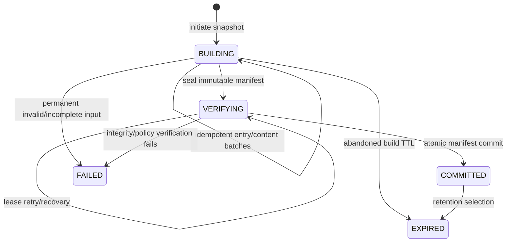
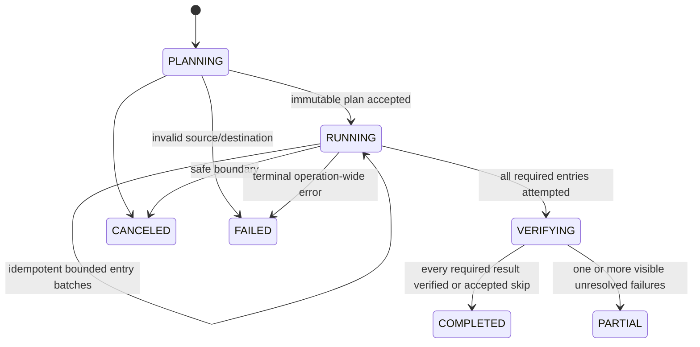

# Backup, snapshot, retention và restore

Trạng thái: **Blueprint quy chuẩn PLANNED**

Tài liệu này đặc tả backup từ thiết bị vào Synveil, backup snapshot bất biến,
retention, workflow recovery và disaster recovery cho instance. Tài liệu tuân
theo ADR-007 và các entity trong [DOMAIN_MODEL.md](DOMAIN_MODEL.md). Vòng đời
object được định nghĩa trong [STORAGE.md](STORAGE.md); truyền byte có thể tiếp
tục trong [UPLOADS.md](UPLOADS.md); đồng bộ live current-state trong
[SYNC.md](SYNC.md).

Không capability backup nào là `IMPLEMENTED` chỉ vì blueprint này tồn tại.

## Hai trách nhiệm backup khác nhau

Synveil dùng từ backup cho hai trách nhiệm liên quan nhưng khác biệt:

1. **Backup người dùng/thiết bị:** `BackupSet` chụp source được chọn từ client
   thành manifest `BackupSnapshot` bất biến và restore content riêng lẻ hoặc
   toàn bộ sau deletion, corruption hay mất thiết bị.
2. **Disaster recovery cho Synveil instance:** operator backup PostgreSQL,
   object storage, configuration và secret bắt buộc cùng nhau để có thể dựng
   lại chính server.

Device snapshot chỉ được lưu trên cùng sole disk với live data của Synveil bảo
vệ lịch sử khỏi sync deletion nhưng không bảo vệ khỏi mất disk đó. UI và
operations guide phân biệt historical retention với bản copy ở failure domain
độc lập.

## Backup không phải synchronization

| Synchronization | Backup |
|---|---|
| Hội tụ một current library namespace giữa các thiết bị. | Bảo toàn các historical manifest view bất biến. |
| Delete trở thành Trash/tombstone và lan truyền. | Source absence chỉ làm thay đổi newly captured manifest. |
| Dùng `Node`, `FileVersion`, `ChangeEvent` và `SyncCursor`. | Dùng `BackupSet`, `BackupSnapshot`, `BackupEntry` và restore operation. |
| Giải quyết concurrent current-state edit/conflict. | Chụp những gì thiết bị quan sát được, với consistency class đã khai báo. |
| Journal retention cho phép incremental convergence. | Snapshot retention quyết định khả năng recovery. |

Backup client không bao giờ gọi live delete endpoint để biểu diễn source file
bị thiếu. Retention không bao giờ phát live sync tombstone. Restore vào library
cố ý tạo live node/version mới rồi dùng sync journal thông thường.

## Bất biến backup

1. Chỉ snapshot `COMMITTED` được liệt kê là có thể restore. `BUILDING`,
   `VERIFYING`, `FAILED` và `EXPIRED` không phải complete recovery point.
2. Snapshot commit là một PostgreSQL transaction làm manifest hoàn chỉnh đã
   stage và verify trước đó trở thành authoritative. Không partial submitted
   manifest nào có thể restore được.
3. Committed snapshot là immutable. Correction tạo snapshot khác; không bao giờ
   edit historical entry hay root hash.
4. Mọi restorable file entry resolve tới `VERIFIED` object trong cùng
   owner/dedup domain với canonical length và SHA-256.
5. Quan sát source missing/unreadable/excluded phải tường minh. Chúng không bao
   giờ xóa entry khỏi retained snapshot cũ hơn.
6. Trong implementation ban đầu, mọi snapshot đều logically complete kể cả khi
   content object được reuse. Retained snapshot không yêu cầu parent snapshot
   của nó còn tồn tại.
7. Retention làm snapshot reference hết hạn trước. Physical object GC chỉ xảy
   ra sau khi mọi live/version/Trash/snapshot/derivative/lease/hold reference
   vắng mặt và storage safety window đã qua.
8. Restore bền vững, idempotent, có thể restart, mặc định non-destructive và
   verify byte. Overwrite, khi được chọn tường minh, tạo file version mới thay
   vì viết lại historical object.
9. Server không bao giờ nâng client capture lên consistency label mạnh hơn bằng
   chứng client hỗ trợ.
10. Revoke/remove source device dừng access backup tương lai; không âm thầm xóa
    retained snapshot.
11. Backup ID, hash, entry path và object ID không phải authorization.
12. Notification, indexing, thumbnail và anomaly detection tùy chọn không thể
    là prerequisite cho snapshot commit hay correctness restore.

## Backup set và source policy

Một `BackupSet` thuộc về một owner và source device. Policy có version của nó
chứa:

- client-stable opaque source ID và user-facing source label;
- selected root, include/exclude rule, file-size/type policy và schedule hoặc
  continuous trigger;
- hành vi symlink/mount-boundary và supported metadata profile;
- retention policy reference và quota domain;
- yêu cầu consistency và việc best-effort snapshot có explicit capture error
  có thể commit hay không;
- state pause/retire và last successful observation.

Source descriptor là untrusted device metadata. Chuỗi như `C:\Users\...` hay
`/home/...` không bao giờ được diễn giải là server path và không bao giờ cấp
server filesystem access.

Hành vi source ban đầu được khuyến nghị:

- không follow symlink trong capture; ghi link làm bounded metadata nếu profile
  client/platform hỗ trợ;
- không vượt mount/volume boundary trừ khi source đó bao gồm tường minh;
- giữ original relative name component nhưng cũng tính portable
  comparison/safety projection cho restore warning;
- ban đầu exclude socket, device node và special file khác; report chúng tường
  minh thay vì serialize semantic không an toàn;
- coi việc bảo toàn hard link, ACL, extended attribute, sparse extent và
  platform-specific metadata là addition có version theo capability, không
  phải promise ngầm định.

Đổi policy chỉ ảnh hưởng snapshot về sau. Snapshot lưu effective policy revision
đã dùng để capture nó.

## State machine snapshot



`FAILED` và `EXPIRED` không restore được. Expired committed snapshot có thể tạm
giữ entry trong khi idempotent purge job chạy, nhưng UI không được trình bày nó
làm recovery point sau điểm không thể quay lại đã audit của retention. Legal
hold chặn `COMMITTED -> EXPIRED`.

### `BUILDING`

Snapshot đã đóng băng identity set/device/parent/policy nhưng nhận bounded,
idempotent manifest batch và backup-scoped content claim. Entry chưa phải
authoritative restore reference. Active snapshot build lease bảo vệ verified
object/staging của nó khỏi GC.

### `VERIFYING`

Manifest được seal: không entry, error, parent, consistency claim hay content
binding nào có thể đổi. Verifier có generation lease validate topology,
completeness, mọi content receipt, canonical manifest serialization/root hash,
capture result, quota và policy. Retryable infrastructure error giữ state này
và schedule attempt khác. Permanent mismatch thành `FAILED`.

### `COMMITTED`

Một transaction chuyển frozen snapshot sang `COMMITTED`, làm mọi entry của nó
thành authoritative reference, finalize accounting, lưu idempotent outcome,
audit và outbox/job. Query restorable entry luôn join với committed snapshot
state. Transaction không update hàng triệu entry; visibility của chúng đổi qua
single locked snapshot state sau khi đã được verify và build lease bảo vệ.

Build lease chỉ release sau commit. GC thấy hoặc unexpired lease trước commit,
hoặc committed snapshot reference sau commit, nên không có interval không được
bảo vệ.

## Mô hình manifest

### Full logical snapshot

Implementation ban đầu lưu complete logical manifest theo snapshot. Incremental
parent là tối ưu ingest và lineage hint, không phải restore dependency. Mỗi
`BackupEntry` mới chứa resulting metadata và object reference của riêng nó.
File không đổi có thể dùng chung immutable object, nhưng expire parent không bao
giờ làm retained child snapshot thiếu hoàn chỉnh.

Structurally shared/delta manifest về sau cần format có version và retention
proof cho thấy mọi retained snapshot vẫn resolve độc lập được. Chúng không phải
schema optimization vô hình.

### Identity và topology của entry

Mỗi entry có client-stable source entry identity nơi platform cung cấp được,
cộng snapshot-local immutable entry ID và parent entry ID. Relative path được
biểu diễn dưới dạng bounded component, không phải trusted concatenated server
path.

Validation yêu cầu:

- chính xác một manifest root cho mỗi declared source root;
- snapshot-local entry ID duy nhất và child comparison key duy nhất dưới một
  parent theo name-policy version của manifest;
- không cycle, missing parent, child dưới non-directory, absolute path,
  traversal component `.`/`..`, NUL, component length quá mức, depth quá mức
  hay checked-arithmetic overflow;
- declared entry count và byte total nằm trong bound set/user/instance;
- type-specific field chỉ dành cho registered type;
- mọi file `PRESENT` có exact length/hash và verified object binding;
- capture error và exclusion được phân loại, đưa vào completeness summary thay
  vì âm thầm bỏ qua.

Original name, timestamp, permission, symlink target và local path là untrusted
metadata. Chúng có thể hiển thị cho owner nhưng không bao giờ điều khiển server
filesystem operation nếu chưa safe restore validation.

### Canonical root hash

Mỗi manifest format có immutable version. Server tính canonical root hash từ
length-delimited, type-tagged entry field và child hash theo byte order đã định
nghĩa; JSON map order, database row order, locale collation và client path
separator không bao giờ là input. Snapshot ghi algorithm, format version, root
hash, entry count, logical byte và capture-error summary.

Expected root hash của client, nếu cung cấp, là bằng chứng cross-check. Giá trị
server tính có thẩm quyền. Mọi format change nhận version mới và golden
cross-language fixture trước khi writer phát nó.

## Giao thức tạo snapshot

### 1. Initiate

```http
POST /api/v1/backup-sets/{backup_set_id}/snapshots
Idempotency-Key: <backup-run-id>
```

Authenticated source device cung cấp parent snapshot tùy chọn, scan start,
client/platform/capability version và consistency mechanism dự định. Server
lock/check backup set, device, policy, concurrent run limit, quota reservation,
parent eligibility và idempotency fingerprint, rồi tạo một snapshot `BUILDING`
với TTL và build lease.

Retry giống hệt trả cùng snapshot. Key được reuse với set/parent/capture request
khác trả `idempotency_conflict`.

### 2. Submit manifest batch

```http
POST /api/v1/backup-snapshots/{snapshot_id}/entry-batches
Idempotency-Key: <client-batch-id>
```

Batch chứa bounded entry được sort/identify theo manifest protocol. Server
validate structure tăng dần, dùng unique constraint cho identity entry và
parent/name, rồi lưu một batch fingerprint/outcome. Retry giống hệt trả nó;
changed batch dưới cùng identity sẽ fail.

Batch submission không thực hiện long object write trong database transaction.
Trong `BUILDING`, server có thể báo protocol disposition `UPLOAD_REQUIRED` cho
file mới/đổi; đây không phải persisted `BackupEntry.capture_result` bổ sung.
Final entry capture result vẫn chính xác là:

- `UNCHANGED`: client chỉ ra entry từ previous committed snapshot đã chọn;
  server verify cùng set/owner, retained verified object và expected length/hash
  tương thích, rồi copy object binding vào snapshot entry này;
- `PRESENT`: completed backup content claim có length/hash được server verify;
- `UNREADABLE`, `EXCLUDED` hoặc `MISSING_OBSERVATION`: explicit non-content
  capture result với safe error class.

Server không expose arbitrary hash-existence query. File mới/đổi upload đầy đủ
và chỉ dedup sau server verification. Tối ưu proof-of-possession tương lai cần
protocol đã review riêng.

### 3. Ingest content bắt buộc

Backup content dùng cùng bounded streaming, part verification, whole-object
SHA-256, immutable finalization, retry, lease và orphan behavior như
[UPLOADS.md](UPLOADS.md), nhưng destination là backup-scoped content claim,
không phải `Node` hay `FileVersion` nhìn thấy được.

Internal claim đóng băng ownership snapshot+entry và expected size/hash. Terminal
result của nó chỉ có thể bind authorized manifest entry đó. Nó không được expose
raw `Object` creation hay cho phép byte đã verify cho owner/snapshot này bị
retarget. Implementation OpenAPI/domain có thể thêm registered upload intent
`BACKUP_ENTRY` hoặc expose backup-specific wrapper trên cùng application
service; không được duplicate state machine byte-integrity.

### 4. Seal

```http
POST /api/v1/backup-snapshots/{snapshot_id}/complete
Idempotency-Key: <snapshot-completion-key>
```

Request cung cấp final entry count, scan end, expected root hash, consistency
evidence và capture-error summary. Transaction ngắn lock `BUILDING`, validate
mọi submitted batch đã terminal, đóng băng manifest fingerprint, đổi state sang
`VERIFYING` và tạo một verifier job/lease. Lời gọi sau không thể thêm hay replace
entry.

Endpoint có thể trả `202` và status URI. Retry giống nhau về ngữ nghĩa trả cùng
verification/terminal outcome. Sealed fingerprint khác trả
`manifest_conflict`.

### 5. Verify và commit

Verifier dùng database read có giới hạn/phân trang để check topology, content,
total, canonical root hash, capture policy và object state. Nó không giữ một
transaction dài trong scan. Nó persist verification generation và summary,
renew build lease, rồi thực hiện một final transaction ngắn:

1. lock snapshot, backup set, reservation/accounting và verifier generation;
2. đảm bảo không entry batch nào đổi sau seal và mọi verification evidence khớp
   frozen fingerprint;
3. đảm bảo build lease bao phủ commit an toàn và không object được tham chiếu
   nào invalid/quarantined/deleting;
4. áp dụng policy: reject snapshot yêu cầu hoàn chỉnh nhưng có capture failure,
   hoặc commit snapshot best-effort được label tường minh;
5. đặt `COMMITTED`, server commit time, final count/hash/consistency label;
6. convert reservation/accounting, persist terminal idempotent outcome,
   `AuditEvent`, outbox `backup.snapshot.committed.v1` và retention/integrity
   follow-up job;
7. commit, rồi trả success và release staging-only resource sau.

Nếu DB commit fail, snapshot vẫn có thể recovery trong `VERIFYING`; object được
lease bảo vệ. Nếu commit thành công và response mất, cùng key trả chính xác
committed snapshot.

## Consistency class của snapshot

Mỗi committed snapshot hiển thị một trong:

- `FILESYSTEM_CONSISTENT`: client capture từ point-in-time filesystem/volume
  snapshot được hỗ trợ và cung cấp capability/evidence giao thức công nhận;
- `CRASH_CONSISTENT`: client dùng bounded scan với stat trước/sau,
  retry/stability check và không known unresolved content mutation, xấp xỉ
  những gì sống sót sau abrupt application stop;
- `BEST_EFFORT`: file có thể đã đổi trong capture hoặc vẫn còn explicit
  unreadable/unstable/unsupported entry.

Các label này mô tả capture, không phải object-storage durability. Server lưu
client method/version và verification summary và không bao giờ gọi ordinary live
scan là filesystem-consistent. Policy có thể làm run fail thay vì commit
`BEST_EFFORT`. Committed best-effort snapshot restore được cho các entry thực sự
đã verify, cùng limitation được báo nổi bật.

Hướng dẫn capture phía client:

- phát hiện change trong khi read file bằng stable file identity cộng size trước/
  sau, modification/change metadata nơi đáng tin cậy; retry trong bounded count;
- hash chính xác byte đã upload, không chỉ pathname về sau;
- ghi rõ rename/replacement phát hiện giữa scan;
- không follow symlink hay mount trái frozen set policy;
- enumerate theo bounded batch và persist outbound progress để restart có thể
  tiếp tục cùng snapshot/run identity.

## File không đổi và deduplication

Fast path không upload an toàn nhất tham chiếu previous retained entry, không
phải arbitrary hash:

1. client claim stable source identity không đổi từ parent entry và gửi expected
   metadata/hash;
2. server authorize cả hai snapshot trong cùng backup set và verify prior object
   vẫn `VERIFIED`;
3. snapshot mới nhận `BackupEntry` hoàn chỉnh riêng tham chiếu object đó;
4. snapshot commit làm reference mới authoritative.

Nếu prior content missing/quarantined/expired hoặc identity evidence không đủ,
server yêu cầu upload. Dedup của newly uploaded equal content dùng cùng rule sau
verification có scope domain như storage. Vì vậy repeated backup reuse byte mà
không coupling snapshot retention.

## Source deletion và input bị thiếu

Nếu source file có trong snapshot S1 và vắng trong S2 về sau:

- S2 đơn giản không có present entry cho source/path đó, hoặc ghi bounded
  `MISSING_OBSERVATION` khi scan phát hiện file biến mất giữa run;
- S1 vẫn immutable/restore được tới khi retention riêng của nó expire;
- không live `Node` nào bị trash và không entry/reference S1 nào bị xóa;
- retention policy, không phải source device, quyết định khi nào S1 có thể
  expire.

Rút drive, mất permission, root bị skip, enumeration chưa hoàn chỉnh hay client
bug không được trông giống successful mass deletion. Check root presence và
scan-completeness hoặc làm snapshot fail, hoặc phân loại nhìn thấy được là
`BEST_EFFORT` theo policy.

## Retention

### Mô hình policy

Retention policy có version có thể kết hợp:

- giữ latest successful `N` snapshot;
- giữ snapshot trẻ hơn một age;
- bucket đại diện daily/weekly/monthly;
- minimum successful recovery point và protection sau failure gần đây;
- manual pin/legal/incident hold;
- hành vi quota-pressure yêu cầu user/admin action thay vì âm thầm làm yếu
  promised retention.

Effective policy revision và computed retention deadline được lưu với mỗi
committed snapshot. Policy change được audit và prospectively re-evaluate theo
rule tường minh; UI preview những gì sẽ expire.

Safety rule được khuyến nghị: không bao giờ expire held snapshot, không bao giờ
để failed run thay thế minimum successful recovery floor và yêu cầu explicit
confirmation trước khi retire set xóa final recovery point của nó.

### Workflow expiry

1. Retention planner tính candidate deterministically từ committed snapshot,
   policy revision, hold và server time. Nó ghi dry-run explanation.
2. Transaction ngắn lock backup set và từng bounded candidate, re-evaluate fact,
   đổi bên thắng từ `COMMITTED` sang `EXPIRED` và append audit/outbox cùng
   idempotent purge job.
3. Expired snapshot lập tức không còn được quảng bá là restorable, nhưng entry
   row/object reference của nó vẫn được bảo vệ vật lý trong khi purge batch chạy.
4. Purge worker xóa entry/reference row theo deterministic bounded batch cùng
   progress/generation. Crash/retry không bao giờ expose partial snapshot như đã
   committed.
5. Completion tombstone snapshot metadata theo audit/product policy. Object chỉ
   trở thành candidate cho separate two-phase GC proof.

Retention không bao giờ gọi object delete trực tiếp, không bao giờ dùng cached
refcount làm proof và không bao giờ cascade vào live file, Trash, snapshot khác
hay backup set khác.

## Domain restore

### Target restore

Synveil hỗ trợ/lên kế hoạch hai path tường minh:

1. **Restore tới thiết bị/filesystem:** client mới được authorize nhận immutable
   manifest và bounded authorized content stream, ghi vào local destination đã
   chọn và báo verified result theo entry.
2. **Restore vào Synveil library:** server tạo state `Node` và `FileVersion` mới
   dùng immutable object hiện có, rồi phát library `ChangeEvent` thông thường.
   Nó không copy byte trừ khi storage policy cần replica khác.

Default destination là non-destructive: directory mới do user chọn, hoặc
top-level directory mới được đặt tên như restore recovery point. Restore trực
tiếp đè existing tree cần explicit collision policy và fresh authorization.

### State machine restore operation



Restore record đóng băng source snapshot/version, selected entry, destination
identity, collision/symlink/metadata policy, actor/device và idempotency key. Nó
sở hữu retention/object lease để source không expire giữa operation. Row theo
entry ghi planned action, attempt, output identity/path projection, expected và
observed length/hash, collision result, safe error và terminal verification
state.

Worker claim bounded batch bằng generation lease và thực thi ngoài claim
transaction. Retry inspect per-entry result và destination identity trước khi
write. Nó không bao giờ giả định “job ran once”. Cancellation dừng batch mới và
báo entry đã restore; không undo chúng bằng destructive bulk deletion.

### Collision policy

- `RENAME` là default non-destructive được khuyến nghị: tạo alternate name
  portable, có version và báo lại.
- `FAIL` dừng/báo collision mà không modify occupant.
- `SKIP` chỉ được phép làm explicit accepted result được ghi theo entry.
- `OVERWRITE` cần explicit confirmation/scope. Khi vào Synveil library, nó tạo
  current `FileVersion` mới với source `BACKUP_RESTORE` dưới current base
  precondition, giữ old history. Trên device, client dùng temp+verify+atomic
  replacement an toàn theo platform và preserve/report policy như cấu hình.

Collision giữa directory và file không bao giờ âm thầm ép type này thành type
khác. Case/normalization collision được phát hiện trước write và surface theo
target platform/name-policy profile.

### An toàn path và symlink

Khi restore filesystem, client coi mọi manifest component là untrusted: reject
absolute path, traversal, NUL, reserved/special name, depth overflow và mọi
resolved path ngoài selected destination. Tạo directory/file mà không follow
attacker-controlled symlink và re-check parent identity qua race. Manifest
symlink không được follow khi write child; policy ban đầu skip/report nó trừ khi
user bật tường minh safe platform-specific recreation mode.

Special file, ownership, ACL, xattr, sparse layout và timestamp chỉ được restore
khi cả manifest profile và client capability đăng ký semantic đó. Thiếu hỗ trợ
metadata là explicit warning theo entry, không phải content verification
success.

### Verification

Mọi restored file stream từ authorized snapshot entry, không từ raw object ID.
Nó validate expected canonical length/SHA-256. Library restore tham chiếu object
đã verify và có thể tùy chọn scrub/read trước commit theo age/health policy.
Filesystem client hash installed logical file sau write/flush và báo result.

`COMPLETED` nghĩa là mọi required entry đã verify hoặc là skip được chấp nhận
tường minh. `PARTIAL` liệt kê chính xác unresolved entry và vẫn có thể tiếp tục.
Server không thể chứng minh bằng mật mã rằng untrusted client đã ghi durable
local media; status phân biệt server-delivery verification với destination
verification do client báo.

### Recovery sau khi mất thiết bị

1. Revoke thiết bị mất cùng credential; không tuyên bố xóa được byte đã có trên
   đó.
2. Đăng ký/authenticate replacement device với credential có scope độc lập.
3. Liệt kê authorized backup set/snapshot cùng consistency class, capture error,
   verification health và retention deadline.
4. Chọn snapshot/entry và non-destructive destination.
5. Tạo một durable restore operation và tiếp tục content theo entry/range sau
   interruption.
6. Verify result và export human-readable restore report trước khi tùy chọn bật
   normal sync/backup trên restored destination.

Không cần lost device để decrypt early server-trusted backup. E2EE mode tương
lai cần independent key recovery/onboarding protocol và không thể kế thừa giả
định này.

## Recovery cho user, uninstall và machine migration

Recovery là product surface, không chỉ operator runbook. Personal / Home Mode
trình bày workflow dễ hiểu cho accidental deletion, version trước, laptop mất,
storage hỏng/removable, object corrupt, update lỗi, database recovery và chuyển
Synveil sang máy hoặc server mới. Advanced / Server Mode expose cùng primitive
qua operator diagnostics.

Machine-migration package guided đi theo:

```text
prepare migration
    → inspect source và destination
    → validate release/schema, PostgreSQL, object identity, key, capacity và host
    → copy/transfer với progress resumable
    → verify reference, checksum, health và device re-registration
    → activate destination và giữ rollback window
```

Operation dùng `inspect → plan → validate → execute → verify`, durable operation
identity, ownership source/destination tường minh và destination mặc định không
destructive. Nó phải tính PostgreSQL metadata, canonical object/replica,
application master key, device credential, hostname/TLS, remote-access config,
backup policy, coexistence instance cũ và rollback. Key thiếu, object transfer
chưa đủ, filesystem capability không hỗ trợ hoặc health check fail là blocker
hiển thị rõ; không bao giờ sinh identity mới rồi trình bày như continuity.

Uninstall/reinstall thuộc phạm vi recovery validation. Xóa application binary/
service giữ PostgreSQL, object, configuration, key và independent backup theo
retention choice đã chọn. Permanent data deletion là operation riêng, có scope,
confirmation và recovery warning. Reinstall discover storage identity đã giữ và
validate trước bootstrap; không coi data root còn giữ là rỗng chỉ vì binary bị
xóa.

## Blueprint API backup

Các route dự kiến gồm:

```text
POST   /api/v1/backup-sets
GET    /api/v1/backup-sets
GET    /api/v1/backup-sets/{backup_set_id}
PATCH  /api/v1/backup-sets/{backup_set_id}                 If-Match required
POST   /api/v1/backup-sets/{backup_set_id}/snapshots       idempotency required
GET    /api/v1/backup-snapshots                 keyset pagination
GET    /api/v1/backup-snapshots/{snapshot_id}
POST   /api/v1/backup-snapshots/{snapshot_id}/entry-batches
POST   /api/v1/backup-snapshots/{snapshot_id}/content-claims
POST   /api/v1/backup-snapshots/{snapshot_id}/complete
GET    /api/v1/backup-snapshots/{snapshot_id}/entries    opaque keyset cursor
POST   /api/v1/restores                         idempotency required
GET    /api/v1/restores/{restore_id}
GET    /api/v1/restores/{restore_id}/entries
POST   /api/v1/restores/{restore_id}/resume
POST   /api/v1/restores/{restore_id}/cancel
```

Exact route naming/schema thuộc OpenAPI đã review. List query scope
authorization trước filter/count và dùng stable keyset pagination. Download
snapshot entry authorize qua owner/set/snapshot/entry và committed state; không
bao giờ chỉ nhận object ID. Mutation dùng `If-Match`/revision và idempotency
fingerprint. Manifest lớn được batch; không endpoint nào yêu cầu body JSON một
triệu entry hay giữ mọi entry trong memory.

Error ổn định gồm `backup_set_paused`, `snapshot_not_restorable`,
`snapshot_incomplete`, `manifest_conflict`, `capture_inconsistent`,
`object_corrupt`, `restore_conflict`, `unsupported_entry_type`,
`quota_exceeded`, `storage_unavailable`, `device_revoked`,
`permission_denied` và `internal_error`.

## Quota và accounting

Snapshot build reserve expected/staged capacity theo bounded policy. Content
claim không thể vượt declared entry length hay aggregate run limit. Commit
convert reservation thành retained backup logical accounting và atomically
release unused staging reservation; failure/expiry release một lần.

Báo riêng:

- logical byte mỗi snapshot biểu diễn;
- logical unique content cho backup set/reporting period;
- physical object byte chỉ có thể quy thuộc dưới dạng ước lượng khi shared
  dedup;
- staging/reserved byte;
- byte của snapshot retained so với expiring/held.

Phần tiết kiệm dedup không âm thầm kéo dài hay giảm promised logical quota.
Retention policy và quota policy không thể làm user deadlock: nếu capacity không
đủ, hệ thống báo required action và bảo vệ documented minimum recovery floor
thay vì xóa nó vô hình.

## Event và job

Thay đổi state snapshot và restore append audit và internal work, không phải live
sync change trừ khi restore cố ý mutate library.

Internal event/job đã đăng ký nên gồm các dạng có version của:

- `backup.snapshot.verify`;
- `backup.snapshot.committed.v1`;
- `backup.snapshot.expire` và bounded purge;
- `backup.object.scrub`;
- `restore.plan`, `restore.batch` và `restore.verify`;
- update health/notification backup thiết bị.

Snapshot commit insert outbox/job bắt buộc trong cùng transaction. Handler là
at-least-once và bind idempotency với snapshot/restore ID cộng immutable
revision/entry batch. Job lease generation, retry classification, dead letter
và manual replay dùng [STORAGE.md](STORAGE.md). Outage notification/anomaly
detection tùy chọn chỉ đổi freshness/lag.

Ransomware/anomaly signal tương lai có thể đặt audited retention hold hoặc yêu
cầu confirmation, nhưng không được tự động delete, rewrite hay tuyên bố snapshot
an toàn. False positive không thể block ordinary restore vô thời hạn.

## Disaster recovery cho instance

### Recovery set

Backup Synveil instance có thể restore bao gồm:

- PostgreSQL metadata/transaction state, gồm migration, journal, snapshot,
  object location, job, audit và idempotency receipt;
- mọi object-store key được database recovery point đó tham chiếu;
- storage-backend identity/configuration, configuration Compose/Caddy, instance
  identity và application/schema version chính xác;
- authentication/storage encryption master material và referenced secret, được
  bảo vệ riêng cùng operator recovery procedure;
- inventory đã sign/hash và restore-runbook version.

Backup chỉ database làm mất file byte. Backup chỉ object volume làm mất name,
authorization, version, journal, backup manifest và key mapping. Thiếu master
secret có thể làm data/auth state dù tồn tại vẫn không recovery được.

Recovery set cũng là source of truth cho machine migration. Nó ghi instance
identity, device-credential rotation, hostname/TLS, remote-access configuration,
platform/filesystem capability profile và release/schema compatibility đang được
di chuyển. Migration có thể giữ instance cũ trong rollback window, nhưng không
được có hai writer hoạt động trên cùng logical identity nếu chưa có protocol
được thiết kế tường minh.

### Quy trình offline/maintenance được khuyến nghị ban đầu

Baseline Compose an toàn nhất là maintenance window được ghi tài liệu:

1. vào maintenance/read-only mode và dừng session mới, upload completion,
   metadata mutation, retention, GC và migration;
2. drain/stop writer API và worker tại schema/application version đã biết;
3. lấy supported PostgreSQL logical/physical backup và filesystem/object
   snapshot/copy trong khi không writer hay GC nào đổi reference/key;
4. capture configuration, storage-identity marker, migration/application
   version và protected required secret;
5. tính/lưu inventory/checksum ngoài protected data set;
6. chỉ restart service sau khi backup command thành công hoặc báo failure tường
   minh;
7. thường xuyên restore set vào isolated deployment và verify mọi
   database-referenced object cộng representative full hash.

Copy live PostgreSQL data directory không phải supported database backup. Chỉ
dừng PostgreSQL trong khi API/worker tiếp tục ghi object không phải coordinated
backup.

### Quy trình online tương lai

Thiết kế online có thể khai thác ordering durable-object-before-database-
reference nhưng yêu cầu GC barrier tường minh:

1. tạo durable disaster-recovery barrier pin mọi object được tham chiếu tại/qua
   database recovery point `T` và block physical deletion liên quan;
2. capture PostgreSQL consistent backup tại `T`;
3. copy/snapshot object storage tại điểm không sớm hơn `T` trong khi barrier
   ngăn xóa object được DB snapshot tham chiếu;
4. capture configuration/secrets/version inventory và verify mọi reference;
5. chỉ release barrier sau khi backup hoàn tất hoặc terminally failed.

Object key thừa tạo sau `T` là orphan an toàn khi restore. Thiếu object được
tham chiếu tại `T` là không an toàn. Lấy object storage trước rồi database sau
mà không quiescence có thể bao gồm DB reference về sau có object không nằm trong
object snapshot trước; thứ tự đó không hợp lệ.

S3 versioning, replication, RAID, ZFS/Btrfs snapshot và PostgreSQL PITR là cơ
chế hữu ích nhưng không cái nào tự nó tạo thành coordinated recovery set.

### Quy trình restore instance

1. Restore vào network/path cô lập, không bao giờ đè lên sole source copy.
2. Verify backup inventory, required secret, storage identity, application
   version và migration compatibility trước khi khởi động writer.
3. Restore PostgreSQL bằng supported tooling và attach/copy object storage dưới
   backend identity đã ghi.
4. Khởi động trong maintenance/read-only mode. Chạy complete reference
   inventory: mọi protected object có known key/replica; object thừa được báo
   nhưng không xóa ngay.
5. Verify representation checksum và sample canonical theo policy/toàn bộ;
   quarantine/report mọi mismatch.
6. Validate auth bootstrap/recovery, constraint journal head/event, root của
   snapshot manifest, job/lease và đối soát storage accounting.
7. Thực hiện drill đại diện cho file, old-version, Trash, backup snapshot và
   device restore.
8. Chỉ sau đó mới làm restored instance writable và thiết lập backup baseline
   mới. Giữ previous source trong rollback window.

Schema upgrade khi restore chỉ diễn ra theo reviewed migration path thông
thường. Binary mới hơn không bao giờ âm thầm rewrite recovery set cũ chưa
verify.

## Ma trận failure và recovery

| Failure | Outcome bắt buộc |
|---|---|
| Client disconnect trong entry/content batch | `BUILDING` vẫn có thể tiếp tục; batch/content receipt replay theo idempotency key. |
| Source file đổi khi read | Retry có giới hạn hoặc ghi unstable/unreadable; không bao giờ claim consistency mạnh hơn. |
| Source root biến mất/unmount | Snapshot fail hoặc commit `BEST_EFFORT` nhìn thấy được theo policy; snapshot cũ hơn vẫn còn. |
| Content object bền vững, update entry/DB fail | Không committed snapshot reference; claim/lease cho phép retry rồi orphan grace. |
| Snapshot seal với entry/object thiếu | Verification fail; không partial restorable snapshot. |
| Verifier crash | Lease expire; successor recompute/resume từ frozen manifest. |
| Snapshot DB commit thành công, response mất | Completion key trả cùng committed snapshot/root hash; không duplicate. |
| Snapshot commit thành công, notification worker down | Snapshot vẫn restorable; durable outbox/job trở nên trễ. |
| Retention race restore | Restore lease/transaction hoặc expiry thắng; authorized restore đã bắt đầu không thể âm thầm mất source. |
| Retention worker chết giữa purge | Snapshot vẫn non-restorable `EXPIRED`; deterministic batch progress tiếp tục; object ref không bị GC sớm. |
| Object hỏng/thiếu trong restore | Entry fail an toàn/dùng verified replica khác; operation thành resumable `PARTIAL`, không false success. |
| Restore response/job completion mất | Idempotency theo entry và destination check ngăn duplicate destructive write. |
| Quota đầy trong backup | Không partial snapshot commit; giữ recovery floor hiện có, dừng/retry run với explicit error. |
| Device bị revoke giữa backup | Request mới fail; current uncommitted build expire/cleanup; committed snapshot còn theo retention. |
| Database backup thành công, object backup fail | Recovery set là failed/incomplete và không được rotate vào làm sole backup. |
| Restored DB tham chiếu object thiếu | Giữ metadata, quarantine/report và tìm recovery set khác; không bao giờ tạo byte rỗng hay xóa row. |

## Test bắt buộc

### Giao thức snapshot

- empty source, một file, deep tree, nhiều root, maximum policy count và large
  manifest với bounded memory/transaction;
- entry batch ngoài thứ tự, duplicate identical batch, changed payload dưới
  cùng key, lost response, missing batch, duplicate ID/name, missing parent,
  cycle, file-as-parent, traversal/absolute/special component và depth/size
  overflow;
- content claim file zero-byte và rất lớn, part interrupted/resumed, checksum
  mismatch, durable object cộng forced DB rollback;
- seal race final entry/content claim có tính linearizable; post-seal mutation
  bị reject;
- verifier crash tại mọi phase, lease takeover, root-hash mismatch, object thành
  quarantined/deleting, DB serialization retry, commit-response loss;
- không snapshot `BUILDING`/`VERIFYING`/`FAILED`/`EXPIRED` nào xuất hiện là
  restorable;
- repeated unchanged backup tạo complete new entry và reuse object reference mà
  không cần parent retention;
- changed large file tạo đúng new object/version binding; equal newly uploaded
  byte chỉ dedup sau verification và trong domain.

### Deletion, completeness và consistency

- file có trong S1, bị xóa cục bộ trước S2: S1 vẫn restore được tới retention;
  backup không phát live sync deletion;
- source root bị rút, permission denied, file biến mất giữa read, file đổi lặp,
  excluded file, unsupported type, symlink loop, mount boundary;
- policy yêu cầu complete capture fail đúng; best-effort policy commit với exact
  error summary và không bao giờ label filesystem-consistent;
- bằng chứng filesystem snapshot, crash-consistent scan và ordinary live scan
  chỉ nhận label được phép;
- client nói dối/báo sai count/hash/consistency và server verification bắt mọi
  inconsistency server có thể verify.

### Tương tác retention và GC

- golden timeline policy keep-last/age/bucket, clock boundary, legal/manual
  hold, policy revision, failed run, final recovery floor và dry-run preview;
- retention đối đầu new commit/restore/hold race có một locked decision;
- crash sau `COMMITTED -> EXPIRED` và sau mọi purge batch tiếp tục mà không có
  partially restorable snapshot;
- object được live version, Trash, S1, S2, derivative và active restore dùng
  chung không đủ điều kiện GC tới khi mọi reference/lease liên quan expire;
- corruption cached refcount không thể xóa retained snapshot object;
- delete/retire device hoặc backup set không bao giờ bypass retention
  confirmation.

### Restore

- full snapshot, một file, directory subtree, historical file version và
  restart sau mọi entry;
- default restore tạo non-destructive destination; `RENAME`, `FAIL`, `SKIP` và
  explicit `OVERWRITE` có exact outcome theo entry;
- library overwrite tạo `FileVersion` và journal event mới trong khi giữ old
  history;
- filesystem path traversal, absolute path, race symlink-parent, reserved/case
  collision, depth/path limit, special file, warning ACL/xattr unsupported;
- corrupt/truncated/download interruption, HTTP range resume, target disk full,
  post-write hash mismatch, client crash trước/sau atomic replace;
- replay restore job/response không tạo duplicate node hay overwrite hai lần;
  cancel báo entry đã complete mà không xóa chúng;
- race retention/GC/device revocation và recovery trên newly registered device;
- `COMPLETED` chỉ sau required verification; exact unresolved result tạo
  `PARTIAL` cùng safe resume.

### Disaster recovery cho instance

- automated isolated restore PostgreSQL + local object store + config/secret
  tại supported version;
- chứng minh set chỉ DB và chỉ object fail completeness check;
- inject object-copy failure sau DB backup và đảm bảo recovery set không được
  promote/old backup không bị xóa;
- prototype online: object commit trước DB point, concurrent new object, GC
  candidate tại barrier và chứng minh mọi reference tại `T` được copy trong khi
  object thừa vô hại;
- missing storage marker, sai bucket/root, sai encryption key, migration
  mismatch, object missing/corrupt, extra orphan, stale job/lease;
- restore và verify live file, old version, Trash subtree, committed backup
  snapshot, constraint sync cursor và authentication recovery;
- guided migration từ source cũ tới destination sạch, storage identity giữ lại,
  copy/resume gián đoạn, key/device credential rotation, hostname/TLS và thay
  remote-access, coexistence instance cũ, rollback window và blocker tường minh
  khi thiếu key/object/capability;
- uninstall chỉ application rồi reinstall discovery, confirmation permanent-data
  deletion và bằng chứng xóa binary không xóa bản database/object/key/backup duy
  nhất;
- ghi recovery time/space và lặp drill theo lịch; backup không bao giờ đạt
  status `VERIFIED` nếu chưa có successful restore test.

### Test property/fuzz/model

- command snapshot build/seal/verify/commit/expire/crash ngẫu nhiên không bao giờ
  làm incomplete manifest restorable;
- transition retention/reference/lease ngẫu nhiên không bao giờ xóa object được
  committed snapshot hay active restore dùng;
- golden fixture canonical manifest khớp Rust và client language tương lai;
- fuzz manifest parser, length-delimited hashing, path component, symlink
  metadata, batch cursor, count và checked arithmetic;
- model repeated backup/delete/restore sequence và chứng minh source deletion
  một mình không bao giờ xóa recovery point cũ hơn được giữ lại.

## Observability và release gate

Metric bao phủ last successful backup/age theo set/device, run và snapshot theo
state/consistency, byte scanned/uploaded/reused/logical/physical, capture error
class, build/verifier lease age, manifest verification time, root-hash mismatch,
retention candidate/hold/purge backlog, restore throughput/result, object
corruption và age instance recovery-set/drill. Log/trace dùng correlation ID
run, snapshot, restore, device và job nhưng redact content, raw local path nơi
nhạy cảm, credential, storage key và secret.

Phase 5 yêu cầu end-to-end backup từ reference desktop client, mọi crash boundary
trên, retention/GC proof, full và selective restore verification, workflow mất
thiết bị, hành vi quota/full-disk và operator runbook. Status production còn yêu
cầu automated coordinated instance backup và successful isolated restore drill;
“files copied somewhere” là không đủ.

## Quyết định mở

OPEN DECISION OD-BACKUP-001: canonical manifest format v1
Owner: Backup / Clients / Storage
Needed by: Gate giao thức và stored-format Phase 5
Options: normalized relational row cộng server Merkle root; immutable CBOR manifest object cộng indexed row; protobuf manifest với canonicalization profile
Recommendation: dùng bounded PostgreSQL entry row đã normalize cho query/commit ban đầu và server-computed Merkle root được đặc tả chính xác với golden fixture; tùy chọn export canonical portable manifest artifact mà không biến nó thành index duy nhất
Decision evidence: benchmark memory/DB một triệu entry, fixture canonical hash đa ngôn ngữ, localization corruption và test export/restore

OPEN DECISION OD-BACKUP-002: retention policy mặc định
Owner: Product / Backup / Operations
Needed by: Gate UI và policy Phase 5
Options: keep-last đơn giản cộng age; bucket grandfather-father-son; chỉ do user cấu hình với safe minimum
Recommendation: phát hành default keep-last-plus-age đơn giản, dễ hiểu với ít nhất một latest successful recovery point được bảo vệ, dry-run preview và explicit hold; chỉ thêm bucket policy sau bằng chứng UX/test
Decision evidence: mô phỏng capacity household đại diện, kỳ vọng recovery accidental-deletion, review abuse/quota và test mức hiểu UI

OPEN DECISION OD-BACKUP-003: platform metadata profile
Owner: Backup / Desktop Clients / Security
Needed by: Gate release từng platform client
Options: chỉ portable content/name/time; capability profile cho POSIX/Windows/macOS ACL, xattr, sparse file, hard link và symlink; opaque metadata blob
Recommendation: bắt đầu với portable subset được ghi tài liệu và explicit safe symlink policy; thêm typed versioned platform profile riêng lẻ, không bao giờ replay privileged metadata mờ đục
Decision evidence: corpus round-trip đa platform, privilege/path threat review và báo cáo restore fidelity

OPEN DECISION OD-BACKUP-004: service level backup instance online
Owner: Operations / Database / Storage
Needed by: Gate online backup sau baseline; không chặn maintenance-window backup
Options: coordinated backup trong maintenance window; PostgreSQL point cộng GC barrier rồi copy object sau; infrastructure atomic snapshot của volume đã validate
Recommendation: hỗ trợ và drill maintenance-window procedure trước; chỉ thêm online protocol DB-point-plus-GC-barrier sau khi fault injection chứng minh mọi object được tham chiếu đều capture
Decision evidence: test power/crash, model concurrent commit/GC, provider snapshot semantics, restore completeness và đo RPO/RTO
