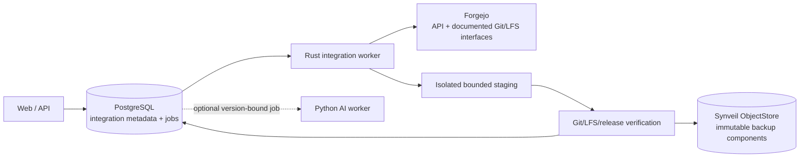
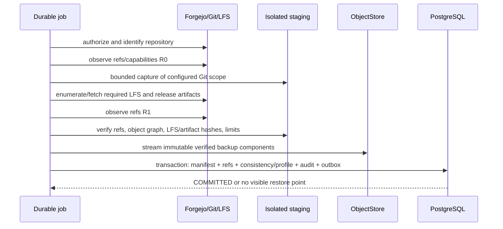

# Kiến trúc tích hợp Git, code và project

Trạng thái: **Tích hợp Forgejo và semantic retrieval PLANNED; generated intelligence EXPERIMENTAL**

Synveil tích hợp với forge; Synveil không trở thành forge. Forgejo là provider
`PLANNED` đầu tiên theo [ADR-012](../adr/ADR-012-forgejo-integration.md) đã chấp
thuận. Repository inventory, health, verified backup/restore, storage reporting
và association `Project` được dự kiến cho Phase 11. Semantic code
indexing/retrieval gắn version là capability Phase 12 nâng cao `PLANNED`.
Repository question answering và generated summary là `EXPERIMENTAL`; GitHub,
GitLab, Gitea và provider-specific collaboration backup vẫn là future provider
work đến khi qua gate riêng.

Không nội dung nào trong blueprint này triển khai connector hoặc tuyên bố một
repository đã được backup. Canonical entity nằm trong
[DOMAIN_MODEL.md](DOMAIN_MODEL.md); HTTP route được dự kiến trong
[API_ARCHITECTURE.md](API_ARCHITECTURE.md); device backup semantic vẫn được xác
định riêng trong [BACKUP.md](BACKUP.md).

## Ranh giới trách nhiệm

| Capability | Forgejo sở hữu | Synveil có thể dự kiến |
|---|---|---|
| Git smart HTTP và SSH | Protocol endpoint, authentication, transport policy | Consume documented Git interface như bounded client |
| Git object database, ref, packfile | Live repository authority và mutation | Capture verified restorable representation |
| Repository permission | Current membership, team, visibility, branch policy | Recheck current provider authorization; chỉ cache labeled metadata |
| Pull request, issue, review, release | Collaboration truth và workflow | Hiển thị selected summary; chỉ backup explicitly supported data |
| Git LFS | Live LFS batch/object service và authorization | Capture/verify required LFS object theo backup profile |
| Webhook | Provider emission và documented signature format | Authenticate làm hint và schedule reconciliation |
| Availability | Forgejo deployment/operator | Đánh dấu freshness `Repository` là `STALE`, đặt `GitIntegration.status` thành `DEGRADED` khi phù hợp và retry độc lập |
| Project | Forgejo project nếu dùng | `Project` Synveil liên kết code với file/asset/backup mà không thay Forgejo |
| AI/code understanding | Không có giả định Synveil | Optional read-only derived indexing theo [AI.md](AI.md) |

Synveil không expose custom Git smart HTTP/SSH, implement pull request hoặc
issue, rewrite packfile làm live forge, mirror Forgejo permission vào competing
authority hay cần Forgejo cho Drive, sync, backup, restore hoặc Photos.

## Invariant kiến trúc

1. Forgejo outage hoặc credential failure không bao giờ block core storage
   operation. Freshness của cached `Repository` thành `STALE`;
   `GitIntegration.status` liên quan thành `DEGRADED` khi integration không khỏe.
2. Cached `Repository` dùng immutable repository ID của provider. Owner, name,
   URL, default branch và visibility là mutable observation, không phải identity.
3. Provider credential có least privilege, write-only qua API, encrypted at rest
   qua reviewed secret service/envelope, không bao giờ embed trong repository
   URL, log, job payload hoặc backup artifact và có thể revoke độc lập.
4. Configured base URL và mọi redirect/network request qua operator-controlled
   SSRF/egress policy. Self-hosted private Forgejo chỉ được hỗ trợ qua explicit
   trusted-network configuration, không bao giờ bằng cách nhận arbitrary private
   address từ untrusted user.
5. Webhook là hint đã authenticate, giới hạn replay và size. Reconciliation qua
   poll/API/Git thiết lập truth trước khi metadata hoặc backup state đổi.
6. Repository inventory không phải backup. Backup chỉ restorable khi versioned
   manifest, declared Git ref/object, required LFS/release component và hash qua
   verification.
7. Repository backup `BUILDING`, `INCOMPLETE` và `FAILED` không bao giờ được cung
   cấp như complete restore point. Chỉ `COMMITTED` đáp ứng consistency/profile
   đã khai báo.
8. Repository restore mặc định tới destination mới, explicit, empty. Nó không
   bao giờ force-push, delete hoặc overwrite live repository mặc định.
9. Link `Project` không chuyển ownership, mở rộng permission, đổi retention hay
   cascade-delete repository, node, backup hoặc device.
10. Repository parsing, backup, AI indexing và external call là asynchronous,
    bounded, idempotent job được deliver at least once từ PostgreSQL outbox.

## Ranh giới component



Rust worker sở hữu provider communication và backup orchestration. External
command, nếu reviewed implementation dùng Git CLI, chạy trong least-privilege
sandbox bằng argument array—không dùng shell—và disable hook, credential
persistence, alternate, external helper, network protocol cùng unsafe
configuration trừ một allowed provider transport.

Python AI worker có thể index immutable repository backup/source version được
chọn rõ ràng. Nó không poll Forgejo, giữ forge credential hay tham gia backup
correctness.

## Kết nối Forgejo

### Creation flow

1. Authenticated owner submit provider type `FORGEJO`, base URL, safe display
   label, authentication material và requested capability scope.
2. API canonicalize URL và validate scheme, absence của userinfo, port,
   hostname, path prefix, configured trust/network zone và egress policy trước
   khi lưu bất cứ thứ gì.
3. Secret đi vào write-only secret boundary. Database lưu secret reference và
   encrypted envelope/ciphertext, không bao giờ lưu token response có thể read.
4. Bounded connection-test job resolve DNS dưới rebinding defense, validate TLS
   theo operator trust policy, revalidate mọi redirect, giới hạn response
   byte/time và gọi documented safe identity endpoint.
5. Job ghi immutable provider installation/account identity, Forgejo
   version/capability, granted scope khi discoverable và safe health.
6. Integration chỉ chuyển từ `PENDING` sang `ACTIVE` sau khi identity và required
   least-privilege capability được verify.

Failed test giữ `PENDING` hoặc thành `REAUTH_REQUIRED`/`DEGRADED` với safe error.
Nó không expose một arbitrary internal host/port có tồn tại không.

### Policy URL và SSRF

Connector URL có privilege cao hơn arbitrary user content vì self-hosted forge
có thể hợp lệ nằm trên private network. Do đó:

- chỉ instance administrator hoặc role được grant integration configuration rõ
  ràng có thể chọn origin mới;
- allowed scheme là HTTPS và HTTP exception được operator phê duyệt rõ cho
  trusted local network;
- URL userinfo, fragment, ambiguous encoding, wildcard host, Unix/file scheme
  và unregistered protocol bị từ chối;
- operator allow-list public egress và/hoặc named private network zone;
- DNS answer được check trước connection và khi redirect/retry; connection pin
  vào allowed resolved address trong attempt đó;
- redirect không thể đổi sang disallowed origin hoặc downgrade transport;
- proxy và environment variable không thể âm thầm reroute traffic ra ngoài
  connector egress policy; và
- webhook callback URL cùng provider-reported clone/LFS/release URL không được
  tin chỉ vì Forgejo trả. Chúng được resolve tương đối theo verified provider
  identity hoặc revalidate độc lập.

### Credential lifecycle

Credential mang purpose rõ: `INVENTORY_READ`, `REPOSITORY_BACKUP`, `LFS_READ`,
`RELEASE_READ` và `RESTORE_WRITE` là conceptual capability riêng dù Forgejo gộp
scope.

- Inventory/backup nên dùng read-only provider credential khi có thể.
- Restore write capability chỉ request cho restore operation hoặc được giữ
  trong separately disclosed integration profile.
- Secret read/decrypt giới hạn cho executing worker identity và operation.
  Decrypted token chỉ giữ trong memory cho bounded call, không pass trên command
  line hay persist bởi Git credential helper.
- Rotation write secret generation mới, validate, atomically activate rồi
  retire old generation sau short auditable overlap.
- Revocation dừng job mới, invalidate queued credential lease, delete hoặc làm
  encrypted secret inaccessible và chỉ giữ safe audit fact.
- Provider `401` hoặc credential bị từ chối đặt integration status thành
  `REAUTH_REQUIRED`. Scope giảm đã verify/`403` đặt status `DEGRADED` với safe
  health reason code `PERMISSION_CHANGED`. Reason code không phải
  `GitIntegration.status`, và automated retry không brute-force revoked
  credential.

Backup không bao giờ gồm Forgejo API token, webhook secret, SSH private key,
HTTP authorization header, credential-helper file hay remote URL chứa userinfo.

## Repository discovery và inventory

### Identity và reconciliation

Discovery page qua documented Forgejo API với bounded page size và call budget.
Mỗi result được upsert theo (`GitIntegration`, provider repository ID), không
theo name hoặc clone URL.

- Rename/owner transfer update display metadata và tạo audit/activity fact
  trong khi giữ Synveil `Repository.id`.
- Path được reuse bởi provider repository ID mới tạo Synveil repository mới; nó
  không tự động inherit old backup.
- Repository vắng khỏi một partial/error response không bị delete. Chỉ complete
  reconciliation mới có thể đánh dấu `REMOVED_AT_PROVIDER`, và retained backup
  vẫn theo policy.
- Provider visibility/permission change update safe cached metadata và có thể
  ngay lập tức ẩn repository khỏi user không còn current access, tùy ownership
  model đã chọn.
- Pagination loop, duplicate provider ID, inconsistent response và response
  truncation khiến reconciliation fail visible thay vì delete cached row.

### Cached metadata

Inventory dự kiến có thể giữ:

- provider repository ID, owner/name/full name, canonical web URL;
- default branch, archive state, visibility ở lần quan sát gần nhất;
- bounded branch/tag summary và recent commit ID/author/time/message;
- provider updated time và last successful Synveil observation;
- provider-reported storage usage được label là provider-reported;
- last repository backup state/time/profile và restore-drill state; và
- health/freshness với safe failure class.

Commit message, author identity, private repository name, branch name và release
name là sensitive. API list view minimize field; log và metric loại chúng. “Last
updated by provider” và “last checked by Synveil” vẫn là value khác nhau.

Synveil không dùng cached visibility làm authorization signal duy nhất. Trong
initial owner-scoped integration, chỉ integration owner và explicitly authorized
Synveil administrator có thể view. Mọi multi-user mapping với Forgejo user/team
cần reviewed authorization contract riêng.

## Polling và webhook

### Polling

Polling là nguồn reconciliation bảo thủ:

- job được schedule theo integration với jitter, bounded concurrency và
  exponential backoff;
- conditional provider request có thể giảm transfer nhưng `304` chỉ đáng tin
  như authenticated provider endpoint và cache key;
- một slow/failing repository không thể giữ database transaction hoặc block
  integration khác;
- result stage rồi commit complete reconciliation checkpoint;
- freshness state ghi last attempted và last successful check; và
- manual refresh enqueue cùng idempotent job thay vì khiến API synchronous phụ
  thuộc Forgejo.

### Webhook

Nếu bật, provider-specific webhook endpoint:

- chỉ nhận bounded body và permitted content type;
- tìm integration qua non-secret routing identity;
- validate documented provider signature/secret constant-time khi áp dụng;
- từ chối timestamp/delivery ID ngoài replay policy và deduplicate accepted
  delivery;
- redact header/body khỏi log;
- chỉ parse sau authentication và schema/size validation;
- ghi minimal hint và enqueue reconciliation; và
- trả nhanh mà không thực hiện repository backup hay tin event là final state.

Webhook có thể delay, duplicate, reorder, forged hoặc lost. Polling và explicit
reconciliation vẫn cần thiết.

## Repository backup

### Backup profile

Versioned repository backup profile khai báo required component:

| Component | Intent ban đầu | Quy tắc completeness |
|---|---|---|
| Git object database và selected ref | `PLANNED REQUIRED` | Mọi recorded ref resolve tới captured object graph; structural verification qua. |
| Git LFS object reachable từ captured scope | `PLANNED REQUIRED when LFS is enabled for profile` | Mọi manifest pointer có captured object với algorithm/length đã verify. |
| Selected release artifact | `PLANNED configurable` | Mọi required artifact do provider list được capture/verify hoặc backup incomplete. |
| Issue, pull request, review, wiki, package, action | `EXPERIMENTAL/FUTURE` | Không bao giờ được ngụ ý bởi “repository backup”; mỗi loại cần versioned export/restore contract. |
| Forgejo permission/setting/hook/secret | `NON-GOAL initially` | Restore chỉ recreate explicitly supported safe setting; secret không bao giờ backup. |

User thấy profile và component result. Git-only backup không được label “full
Forgejo backup.”

### Capture sequence



Yêu cầu chi tiết:

1. Reauthorize current integration/repository identity và required scope.
2. Allocate bounded staging capacity và lease; không bao giờ write trực tiếp vào
   live Forgejo repository hoặc canonical object namespace.
3. Ghi provider identity/version, source repository immutable ID, capture time,
   backup-profile version và initial ref set `R0`.
4. Capture selected ref và complete reachable Git object graph bằng documented
   portable representation. Disable hook, submodule recursion, alternate,
   replacement object, external filter, working-tree checkout, arbitrary
   protocol và credential persistence.
5. Parse LFS pointer content mà không execute filter; enumerate/fetch configured
   reachable LFS object qua authenticated validated endpoint.
6. Enumerate và fetch selected release artifact qua bounded validated provider
   URL. Provider filename vẫn là untrusted metadata.
7. Quan sát `R1` và ghi ref có ổn định không. Nếu đổi, retry theo bounded policy
   hoặc tạo clearly labeled windowed capture chỉ khi mọi manifest ref vẫn
   resolve và selected profile cho phép.
8. Chạy structural Git verification trong sandbox, chứng minh mọi captured ref
   resolve, validate component count/length/checksum và compute versioned
   manifest root.
9. Stream verified component qua normal Synveil object-store durability
   contract dùng opaque key và SHA-256/stored checksum. Internal object hash của
   Git là structural data; không thay Synveil object integrity.
10. Trong một PostgreSQL transaction, tạo mọi authoritative component
    reference, per-component result, consistency class, audit/outbox fact,
    retained accounting và idempotent terminal state.

Nếu object write thành công nhưng transaction fail, không restore point nào
thành visible; unreferenced object vẫn được lease/grace bảo vệ để
reconciliation. Nếu commit thành công nhưng response/job acknowledgement mất,
cùng job identity trả một `RepositoryBackup` duy nhất.

### Consistency class

Backup nêu một trong:

- `REF_STABLE`: `R0 == R1` và mọi ref/object/component profile yêu cầu đã verify;
- `REF_WINDOWED`: ref đổi trong capture, nhưng manifest freeze explicit captured
  ref set có complete object graph verify; disclosure cross-service LFS/release
  observation time;
- `PROVIDER_SNAPSHOT`: provider-native snapshot/export API tương lai cung cấp
  documented stronger point-in-time guarantee; hoặc
- `INCOMPLETE`: thiếu required component hoặc verification.

Chỉ `REF_STABLE`, `REF_WINDOWED` được profile cho phép hoặc reviewed
`PROVIDER_SNAPSHOT` mới có thể thành `COMMITTED`. Không class nào claim atomicity
xuyên Git, LFS, release, issue và database của Forgejo trừ khi provider cung cấp
rõ và Synveil test guarantee đó.

### Retention và accounting

Repository backup có repository/profile retention policy tách khỏi live Forgejo
deletion và retention `BackupSet` device. Xóa integration không âm thầm purge
committed backup. Expiration trước tiên mark manifest unavailable theo policy;
object GC về sau chứng minh không còn file version, backup, repository backup,
derivative, lease hoặc hold reference.

Báo riêng:

- provider-reported live repository usage và freshness;
- backup logical Git/LFS/release byte;
- retained byte trên recovery point;
- unique physical Synveil byte trong permitted dedup domain; và
- staging/failed-capture byte chờ cleanup.

Cross-user deduplication mặc định vẫn bị cấm và không saving hay timing nào
reveal content repository khác.

## Restore và export

### Safe restore flow

1. Chọn một recovery point `COMMITTED` và inspect profile, consistency class,
   component, source provider identity và verification age.
2. Reverify manifest root và stored component integrity. Component hỏng/thiếu
   block complete restore và khởi tạo recovery; không âm thầm skip.
3. Chọn existing Forgejo integration `ACTIVE` và explicit new repository
   owner/name. Reauthorize current create/write/LFS/release scope và revalidate
   provider identity/URL.
4. Confirm destination không tồn tại hoặc là newly created empty,
   operation-owned repository. Overwrite/force-push existing repository không
   phải initial path.
5. Reconstruct trong isolated staging với hook, alternate, checkout, submodule
   recursion và unsafe protocol disabled. Chạy structural verification.
6. Tạo destination và restore ref qua documented Git transport; restore required
   LFS object và supported release artifact.
7. Read back destination ref/component inventory và compare manifest.
8. Ghi per-component `SUCCEEDED`, `SKIPPED_BY_PROFILE`, `CONFLICT` hoặc `FAILED`
   cộng verification. Chỉ báo `SUCCEEDED` khi required component của selected
   profile khớp.

Forgejo change là external side effect và không thể chung PostgreSQL
transaction. Crash có thể để lại partially created destination. Durable
operation ghi provider repository ID và completed step để retry reconcile thay
vì tạo repository khác. Nếu không chứng minh được safe automatic cleanup,
operation để destination quarantined/clearly labeled và đưa manual remediation;
không bao giờ force-delete.

Provider permission hoặc visibility default được chọn rõ lúc restore và re-read
sau. Synveil không restore secret, webhook, deploy key, branch protection,
collaborator, action secret hay issue trừ khi future profile định nghĩa và verify
từng hạng mục.

### Portable export

Authorized user có thể `PLANNED` download versioned manifest và documented
portable component mà không cần working source Forgejo. Export được stream,
checksummed và không expose internal storage key hoặc integration credential.
Nó gồm format/version reader guide và verification command/procedure khi capture
representation được chấp thuận.

Export không tự động là one-file archive; large component có thể dùng manifest
cộng independently checksummed stream. Packaging step enforce entry count,
path, expanded size, symlink và archive safety, đồng thời không thể load
repository vào memory.

## Project và workspace

`Project` là optional Synveil metadata container:

```text
Project
├── Repository links
├── Document and asset Node links
├── BackupSet / BackupSnapshot links
├── Device links
└── User-authored metadata and optional derived search scope
```

Quy tắc:

- Tạo link cần current access vào project và target.
- Read qua project cần current access vào từng target; cached link không bao giờ
  mở rộng access.
- Xóa link không delete hoặc alter target.
- Delete project chỉ xóa project metadata/link sau normal retention/audit
  behavior; không cascade tới file, repository, backup hoặc device.
- Repository hoặc node có thể link tới nhiều project.
- Project title, description và link là sensitive metadata và kế thừa
  owner/share policy.
- Search có thể dùng project làm authorization-constrained scope, nhưng project
  membership không phải authority authorization thay thế.

Normal storage user không bao giờ cần `Project` hay Forgejo connection.

## Code indexing và AI

Code indexing gắn version và semantic code retrieval/search có lọc ACL là
capability Phase 12 nâng cao `PLANNED` chịu sự điều chỉnh của [AI.md](AI.md).
Generated answer như “where is authentication implemented?”, change summary và
repository Q&A vẫn `EXPERIMENTAL`; chúng không bắt buộc để promote nền tảng
retrieval.

- Chỉ index immutable source được chọn rõ: commit/object snapshot hoặc
  `COMMITTED RepositoryBackup`. “Current repository” không có source revision
  thì không reproducible.
- Không bao giờ execute build, test, package manager, hook, notebook, macro hoặc
  repository script để index code.
- Coi README/code/comment/issue là untrusted prompt-injection content.
- AI worker không nhận Forgejo write credential và không có Git, shell, sharing,
  deletion, restore hoặc provider tool.
- Current repository/project/source authorization filter mọi result và citation.
- Remote inference cần consent code/repository content và query text riêng;
  private source không âm thầm rời host.
- Forgejo unavailable có thể làm cached/indexed data stale nhưng không invalidate
  verified immutable source trước đó. Freshness vẫn visible.

AI record là derived và deletable. Repository backup và restore không bao giờ
phụ thuộc embedding, OCR, tag hay generated summary.

## API và event contract

Planned HTTP group trong [API_ARCHITECTURE.md](API_ARCHITECTURE.md) gồm:

- `/api/v1/integrations/git` cho create/list và safe status;
- `/api/v1/integrations/git/{integration_id}` cho conditional update/revoke;
- async command `:test` và `:refresh`;
- `/api/v1/repositories` và `/{repository_id}` cho inventory;
- `/repositories/{repository_id}/backups` và
  `/repository-backups/{backup_id}:restore`;
- `/api/v1/projects` và conditional typed project link; và
- `/api/v1/operations/{operation_id}` cho progress backup/restore/refresh.

Credential là write-only request field và không bao giờ xuất hiện trong
response, example, error, audit detail, idempotency response sau issuance hoặc
generated client debug output. Mọi mutation command dùng ETag/base precondition
và/hoặc persisted idempotency như API architecture quy định.

Internal versioned event/job family dự kiến là:

- `integration.git.reconcile_requested`;
- `integration.git.webhook_received` làm hint;
- `repository.discovered`, `repository.updated` và
  `repository.provider_removed`;
- `repository.backup_requested` và `repository.backup_committed`;
- `repository.restore_requested` và `repository.restore_completed`; và
- optional `repository.index_requested`.

Outbox payload chứa scoped ID và version, không chứa credential, clone URL kèm
token, commit message, code, webhook body hoặc release content. “Requested” và
“completed” là fact khác nhau; queued job không làm backup healthy.

## Yêu cầu security

### Provider và network

- Áp dụng connection SSRF policy cho API, clone/fetch, LFS, release, submodule,
  redirect và provider-reported URL.
- Không tự động follow submodule hoặc fetch external Git alternate.
- Validate TLS và hostname; custom CA/insecure local exception là explicit
  operator trust configuration, scope hẹp và báo nổi bật.
- Bound connection count, DNS resolution, redirect, response header/body, page,
  repository, ref, artifact, retry và total job time.
- Map provider failure sang safe code. Không bao giờ relay raw response
  body/header có thể chứa secret hoặc internal topology.

### Xử lý Git và artifact

- Coi ref name, path, commit message, author, tag, release name, archive entry,
  LFS pointer và Git config là không đáng tin cậy.
- Từ chối hoặc encode an toàn path traversal, absolute path, device name,
  alternate separator, NUL/control character, Unicode ambiguity và archive
  collision trong mọi packaging/restore.
- Enforce limit cho ref, object, pack/delta expansion, object size, history
  traversal, LFS file, release artifact, temporary disk, memory, process count,
  CPU và wall time.
- Chạy structural verification không checkout. Nếu export sau materialize
  working tree, nó dùng sandbox mới cùng strict symlink/submodule/path rule.
- Disable hook, smudge/clean filter, credential helper, external diff,
  upload-pack override, protocol ext, replace/graft mechanism và arbitrary
  configuration include.
- Không bao giờ build hoặc execute repository content.

### Secret và private metadata

- Encryption key cho integration secret nằm ngoài ordinary database backup hoặc
  tự được bảo vệ bởi documented master-key recovery process. Mất master key có
  honest reauthentication recovery path.
- Restrict secret decryption theo process/role và audit use mà không ghi value.
- Redact URL userinfo, query secret, header Authorization/Cookie, webhook
  signature, SSH material và provider error body tại ingress.
- Private repository name, branch/tag name, commit metadata, LFS/release
  filename, project link và storage usage được access-control và loại khỏi
  metric/log.
- Repository có thể chứa credential hoặc personal data. Backup/index/export
  không ngụ ý secret scanning; remote AI egress cần explicit code consent.

## Hợp đồng failure và recovery

| Lỗi | Hành vi bắt buộc |
|---|---|
| Forgejo offline/timeout | Mark freshness `Repository` là `STALE` cùng last success và đặt `GitIntegration.status` thành `DEGRADED` khi không khỏe; retry với backoff; Drive và verified stored backup vẫn available. |
| DNS đổi sang disallowed/private address | Dừng trước connection/redirect, ghi safe SSRF-policy failure, không reveal host reachability. |
| Credential revoke hoặc scope giảm | Đặt `REAUTH_REQUIRED` cho credential bị từ chối, hoặc `DEGRADED` với reason `PERMISSION_CHANGED` khi scope giảm; suppress unauthorized job, không brute-force retry hoặc leak provider body. |
| Webhook duplicate/reorder/forged | Authenticate/deduplicate/replay-limit; nhiều nhất schedule idempotent reconciliation; không mutate truth trực tiếp. |
| Repository rename/transfer | Reconcile bằng immutable provider ID, update safe metadata, reauthorize ownership; không tạo duplicate hoặc âm thầm transfer backup ownership. |
| Provider path được reuse cho repository ID mới | Tạo distinct repository record; old backup vẫn gắn old identity. |
| Repository biến mất khỏi một page/error | Không mark removed đến khi complete reconciliation chứng minh absence. |
| Ref move trong capture | Retry trong bound hoặc dùng allowed `REF_WINDOWED` manifest resolve hoàn toàn; nếu không là `INCOMPLETE`, không bao giờ silent “success.” |
| Git/LFS/release component thiếu/hỏng | Backup giữ `INCOMPLETE`/`FAILED` theo profile; giữ safe diagnostic và retry path. |
| Object write thành công nhưng manifest DB commit fail | Không recovery point nào visible; object thành grace-protected orphan candidate. |
| Manifest commit nhưng worker acknowledgement mất | Cùng job/idempotency identity trả một `RepositoryBackup`. |
| Disk đầy hoặc Git expansion vượt bound | Abort/quarantine staging, giữ existing backup, expose resource failure và chỉ clean leased operation data. |
| Restore crash sau destination creation | Durable step/provider-ID record reconcile cùng destination; không tạo cái khác hoặc force-delete/overwrite. |
| Destination tồn tại/non-empty | Từ chối initial restore path với conflict; cần new explicit destination. |
| Restore component read-back khác | Mark partial/failed, giữ evidence, không claim successful recovery. |
| Project link target access bị revoke | Hide/disable target ngay theo current auth; stale link có thể clean async mà không delete target. |
| AI indexer fail hoặc disabled | Repository inventory/backup/restore vẫn operational; code search/Q&A báo disabled/stale. |

## Observability và operation

Metric dự kiến gồm integration last-success age, safe error class,
provider-call latency/status bucket, reconciliation page/repository count,
webhook accepted/rejected/replay count, queue age/attempt/dead-letter state,
capture logical byte/component/duration, staging capacity, verification failure,
restore progress/result và last successful restore drill.

Label không bao giờ gồm base URL, IP address, token, repository/project name,
ref/commit value, path, release filename, LFS hash hoặc user identifier.
Structured log dùng request/job/integration pseudonymous ID, provider type,
operation/profile/config generation, safe error, duration và bounded count.

Operational control có thể pause một integration/provider, rotate credential,
retest identity/scope, inspect freshness và safe error, requeue eligible job,
reserve/limit staging, verify retained backup, thực hiện restore drill, export
backup và revoke/delete integration secret mà không delete retained backup data.

Integration health tách khỏi core readiness. Configured integration failure có
thể alert nhưng không đánh dấu Synveil API/object store unavailable.

## Verification và promotion gate

Trước khi Forgejo integration thành `IMPLEMENTED`, validation phải bao phủ:

- create/test/rotate/revoke với token redaction, least scope, lost response,
  expired credential, changed provider identity và master-key recovery;
- case SSRF xuyên IPv4/IPv6, DNS rebinding, redirect, userinfo, path prefix,
  custom port, proxy, private-network allow-list, clone/LFS/release URL và custom
  CA policy;
- paginated discovery với duplicate, rename/transfer, path reuse, disappearing
  page, partial response, provider downgrade và permission change;
- webhook valid/invalid signature, secret rotation, replay, duplication,
  reordering, oversized/malformed body và reconciliation sau lost event;
- concurrent ref mutation, nhiều ref/object, shallow/partial provider behavior,
  malicious Git config/hook/filter/alternate/submodule, pack/delta bomb, LFS
  pointer/object mismatch, release redirect và giới hạn disk/memory/time;
- capture crash ở từng stage, object-write/DB-failure, lost job acknowledgement,
  duplicate job, orphan cleanup, retention và cross-dedup privacy;
- structural Git verification và clean-room restore drill cho mọi declared
  backup profile, gồm ref, required LFS, release artifact, read-back, partial
  external side effect và retry tới cùng destination;
- portable export verification khi không có source Forgejo;
- project link authorization, removal, deletion non-cascade, permission
  revocation và cross-project isolation;
- Forgejo offline/slow/malicious trong khi core file integration test vẫn xanh;
  và
- AI disabled, prompt-injection content, remote code consent denied/revoked,
  immutable source provenance và không execution/tool access.

Performance methodology ghi Forgejo/Git version, network topology, repository
shape (ref, object/pack/delta size, LFS/release), source churn,
staging/backend type, cold/warm state, CPU/RAM/temp disk, concurrency, API limit
và duration verification/export/restore. Release budget đến từ measured named
fixture và hardware, không phải repository-size hoặc throughput claim bịa đặt.

## Open decision hữu hạn

OPEN DECISION OD-CODE-001: cơ chế authentication và scope Forgejo ban đầu
Owner: Integrations / Security / Forgejo Operations
Needed by: Gate connector OpenAPI và threat-model Phase 11
Options: personal access token; dedicated service account token; provider application/OAuth flow nếu được hỗ trợ và đủ
Recommendation: dùng dedicated least-privilege service identity/token cho instance-managed backup và separate restore-write capability; chỉ hỗ trợ user OAuth sau khi yêu cầu multi-user authorization được xác định
Decision evidence: targeted Forgejo version capability matrix, scope audit, rotation/revocation test, quyết định product multi-user và credential compromise analysis

OPEN DECISION OD-CODE-002: integration secret encryption và master-key recovery
Owner: Security / DevOps / Integrations
Needed by: Gate persisted credential đầu tiên Phase 11
Options: application envelope encryption với file/secret-mounted master key; external secret manager adapter; operator-supplied per-integration secret lúc runtime
Recommendation: versioned application envelope encryption với master key được cung cấp ngoài PostgreSQL, cộng optional future secret-manager port và explicit reauthentication path nếu mất key
Decision evidence: container/backup threat model, key rotation và disaster-recovery drill, least-privilege test và operator UX review

OPEN DECISION OD-CODE-003: portable Git capture representation
Owner: Integrations / Backup / Storage / Git Specialist
Needed by: ADR format repository-backup Phase 11
Options: Git bundle cộng separate component manifest; normalized bare repository pack/ref representation; provider-native export bọc trong Synveil manifest
Recommendation: dùng documented standard Git bundle hoặc normalized bare representation được chọn qua round-trip test, luôn bọc trong versioned Synveil manifest với LFS/release tách riêng; không bao giờ biến provider-native export thành portable format duy nhất
Decision evidence: repository có mọi ref type, large/delta object, format repository SHA-1/SHA-256 khi hỗ trợ, restore trên supported Git/Forgejo version, fsck, streaming/resource benchmark và migration test

OPEN DECISION OD-CODE-004: backup consistency policy đầu tiên
Owner: Integrations / Backup / Product
Needed by: Gate contract repository-backup Phase 11
Options: cần stable ref và retry nếu không; cho phép verified ref-windowed capture; dùng provider-native maintenance/snapshot API
Recommendation: ưu tiên `REF_STABLE` với bounded retry, chỉ cho `REF_WINDOWED` làm clearly labeled user-selected profile khi mọi recorded ref graph verify và chỉ adopt provider snapshot sau conformance proof
Decision evidence: high-churn repository test, provider maintenance/API capability review, LFS/release race test, restore drill và user expectation review

OPEN DECISION OD-CODE-005: baseline polling và webhook
Owner: Integrations / DevOps / Security
Needed by: Gate inventory scheduling Phase 11
Options: chỉ polling; webhook hint cộng periodic polling; chỉ webhook
Recommendation: ship bounded jittered polling trước, rồi thêm authenticated webhook hint trong khi giữ periodic reconciliation; không bao giờ dựa vào webhook-only truth
Decision evidence: Forgejo webhook signature/version matrix, load measurement, test missed/duplicate/reordered event, firewall/operator UX và freshness requirement

OPEN DECISION OD-CODE-006: coverage release-artifact ban đầu
Owner: Integrations / Backup / Product
Needed by: Backup-profile freeze Phase 11
Options: chỉ Git và LFS; gồm release binary attachment; gồm release metadata cộng attachment
Recommendation: biến release artifact thành explicit profile component với per-artifact verification và honest completeness; không delay Git/LFS recovery profile nếu release API consistency chưa sẵn sàng
Decision evidence: Forgejo API/version matrix, artifact size/redirect/auth test, restore semantic, storage benchmark và user recovery requirement
