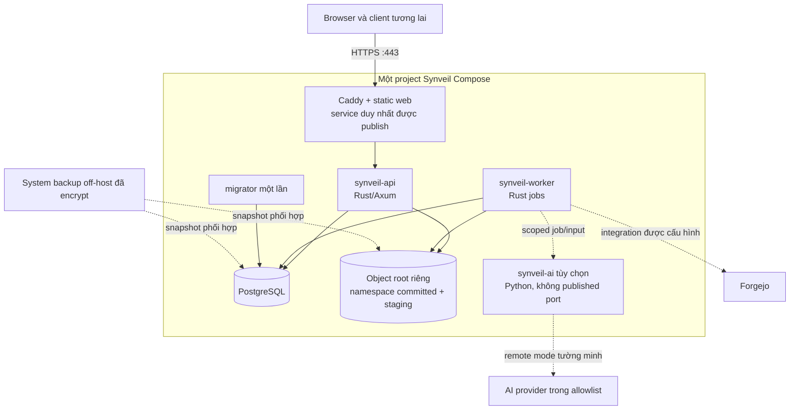

# Kiến trúc deployment và operations của Synveil

Trạng thái: **Blueprint production PLANNED**

Docker Compose là topology production được hỗ trợ cho Advanced / Server Mode,
không chỉ là demo phát triển. Đây không phải installation hướng người dùng duy
nhất về sau. Personal / Home Mode được hoạch định quanh native/guided installer,
platform service lifecycle, chọn storage và PostgreSQL cá nhân do Synveil quản
lý. Cả hai mode dùng chung một API/domain/storage correctness model. Kubernetes,
Redis, message broker, service mesh và nhiều network microservice không phải yêu
cầu cài đặt.

Tài liệu này định nghĩa contract vận hành. Nó không tuyên bố image triển khai
product, Compose file, command hay production support được mô tả ở đây đã tồn
tại. Runtime foundation đã implement health route có giới hạn, browser
authentication transport, first-run bootstrap HTTP boundary, minimal web
setup/login/session shell trong API contract và boundary adapter local
`ObjectStore`/conformance nhận root tường minh. Storage crate cũng chứa
content-read service trung lập transport đã authorize theo owner; developer API
composition root wire route download full/single-range current/historical đã
authenticate khi cả `DATABASE_URL` và `SYNVEIL_OBJECT_ROOT` tuyệt đối, tường
minh được đặt. Metadata version-history listing và direct lookup chỉ cần
metadata service PostgreSQL, không cần object root và không mở storage. Binary
private `synveil-worker` cũng đã implement như runtime GC opt-in có giới hạn,
không listener; đây không phải evidence của production image có thể deploy.
Configuration/preflight download production, topology deployment, installer
lifecycle và production support bên dưới vẫn là kế hoạch; GC planning
metadata-only, execution vật lý và worker orchestration nội bộ đã có boundary
được mô tả.

Prompt 37 implement riêng production HTTP `SyncRemote` library, desktop server
profile, one-time enrollment/device bearer auth và native persistence adapter
của platform SecretStore hiện có. Đây không phải desktop app đã phát hành,
installer hay public TLS listener mới của server.

## Vận hành desktop connection Prompt 37

API binary vẫn phục vụ HTTP ở `127.0.0.1:3000` mặc định. Production deployment
phải đặt nó sau trusted HTTPS reverse proxy và giữ listener cleartext
loopback/private; không expose trực tiếp ra mạng không tin cậy.
`SYNVEIL_BIND_ADDR` không bật TLS. Đặt `SYNVEIL_PUBLIC_ORIGIN` của browser thành
canonical HTTPS origin cho CSRF check hiện có. Desktop profile trỏ tới origin
root đó, không phải `/api/v1` hay proxy subpath. Certificate và hostname
verification là bắt buộc; không implement self-signed bypass, trust-all, TOFU
hay certificate pinning.

Profile production chỉ nhận HTTPS. Constructor non-production riêng chỉ nhận
HTTP tại literal loopback IPv4/IPv6 cho test deterministic, không phải escape
hatch deployment. Tắt mọi redirect, kể cả HTTP → HTTPS: phải cấu hình HTTPS
origin cuối ngay từ đầu. Adapter không dùng proxy environment hay browser
cookie jar. Default hữu hạn: connect 10 giây, header 20 giây, metadata 30 giây,
stream idle 30 giây, toàn download 1 giờ; body metadata tối đa 8 MiB, API error
tối đa 64 KiB. Configuration vẫn bounded và không bật automatic retry, đặc
biệt one-time exchange.

Enrollment và recovery là application operation tường minh:

1. Browser owner đã authenticate lấy CSRF proof hiện có rồi POST strict target
   tới `/api/v1/devices/enrollment-grants`: display name mới hoặc ID Device
   PENDING/ACTIVE thuộc mình. Response trả một enrollment token high-entropy,
   Device ID và expiry 10 phút.
2. Truyền token riêng tư tới desktop rồi exchange đúng một lần ở
   `/api/v1/device-enrollment/exchange` qua verified HTTPS. Không đặt token nào
   trong command-line argument, URL, log, SQLite, profile export hay browser
   storage. Không cung cấp GUI, QR code hay pairing deep-link UX.
3. Lưu bearer trả về ngay trong `PlatformRuntime::SecretStore` dưới profile/
   credential identity. SQLite chỉ lưu ID/timestamp profile và enrollment không
   bí mật. Linux cần Secret Service available đã unlock; Windows dùng Credential
   Manager. Native platform khác chưa được hỗ trợ tại boundary này. Secure
   storage thiếu/locked/unavailable fail closed, không fallback plaintext hay
   in-memory production.
4. Nếu exchange đã commit nhưng mất response, không retry grant. Browser owner
   + CSRF POST `{}` tới `/api/v1/devices/{device_id}/credentials/revoke-all`,
   invalidate mọi credential và grant chưa dùng của Device nhưng giữ lifecycle
   ACTIVE. Tạo grant mới cho cùng Device rồi replace local credential tường minh.
   Nếu biết credential ID, có thể revoke riêng qua
   `/api/v1/devices/{device_id}/credentials/{credential_id}/revoke`.
5. Local forget/disconnect chỉ xóa local secret; không hàm ý đã revoke trên
   server khi offline, không xóa replica data/progress. Server revoke/enrollment
   mới là explicit; automatic rotation bị hoãn.

Giữ `20260828000000_device_credentials_enrollment.sql` trong ordered server
migration. Migration thêm digest-only credential/grant, composite owner/Device
FK, TTL/consumption/revocation check và audit linkage. Consume grant, activate
Device mới và issue credential là atomic. Mỗi request check trạng thái
credential/Device/owner trong PostgreSQL nên revoke có hiệu lực ở request kế
tiếp, không đợi auth cache expiry. Không ép thu hồi download đã chạy. Local
forward-only `crates/client-sync/migrations/0002_server_profiles.sql` thêm
profile/replica binding và non-secret enrollment/cleanup metadata, không sửa
initial SQLite migration hay copy bearer secret.

Server chưa expose stable installation ID. Verified origin/TLS là binding
hiện tại; đổi origin của profile hoặc profile bind vào replica không phải
implicit migration/re-enrollment. Dùng typed connection health (`ONLINE`,
`AUTH_REQUIRED`, `DEVICE_REVOKED`, `SERVER_UNAVAILABLE`, `TLS_ERROR`,
`PROTOCOL_ERROR`) thay vì xóa local state khi mất kết nối. Bằng chứng native
SecretStore cần OS backend thật đã unlock; test-store thành công và
cross-compilation không chứng minh native parity.

| Capability Prompt 38 | Status |
|---|---|
| desktop inbound sync core | `VALIDATED` |
| desktop server profiles | `IMPLEMENTED` |
| device enrollment groundwork | `IMPLEMENTED` |
| device bearer authentication | `IMPLEMENTED` |
| secure desktop credential persistence | `IMPLEMENTED` |
| production HTTP SyncRemote | `IMPLEMENTED` |
| filesystem observation | `IMPLEMENTED` |
| durable outbound intent capture | `IMPLEMENTED` |
| automatic outbound mutation submission | `NOT IMPLEMENTED` |
| automatic conflict resolution | `NOT IMPLEMENTED` |
| desktop GUI/pairing UX | `NOT IMPLEMENTED` |

## Profile deployment được hỗ trợ

| Profile | Mục đích | Service bắt buộc | Target mức hỗ trợ |
|---|---|---|---|
| Developer | Build/test cục bộ với dữ liệu có thể bỏ và ngoại lệ insecure-local tường minh | PostgreSQL, API, worker; Caddy/web/AI tùy chọn | Hỗ trợ developer Phase 0 |
| Personal / Home | Cài đặt native/guided cho người không chuyên, gia đình, desktop user và personal server nhỏ | Platform runtime, Synveil API, worker, PostgreSQL riêng do hệ thống quản lý, `ObjectStore` local, web/AI tùy chọn | Profile first-class tương lai sau các gate installer/lifecycle/recovery |
| Advanced / Server | Homelab, NAS, sysadmin, VPS, developer và deployment self-hosted lớn hơn | Compose/native service, PostgreSQL do operator chọn, `ObjectStore` local/S3/MinIO, edge/AI tùy chọn | Target production nâng cao đầu tiên |
| Single-host local storage | Home server thông thường, host có khả năng NAS, PC hoặc VPS với storage local/mounted riêng | Caddy/static web, API, worker, PostgreSQL, `ObjectStore` local | Topology tham chiếu Advanced / Server; không phải evidence parity Personal / Home |
| Single-host S3/MinIO | Metadata trên host, byte chuẩn trong remote backend đã đạt conformance test | Core tương tự cộng backend S3-compatible cấu hình; service MinIO chỉ khi operator chọn | Promote adapter về sau, không phải yêu cầu Phase 0 |
| Optional local AI | Thêm runtime model/parser self-hosted mà không đổi core readiness | Core profile cộng storage Python AI/model | Profile tùy chọn Phase 10 |
| Optional remote AI | Dùng provider cấu hình theo policy tường minh | Core cộng dispatch/runtime AI và egress kiểm soát | Chỉ opt-in Phase 10 |
| Advanced multi-node | Replica API/worker, có thể broker/Kubernetes/read replica | Chỉ thành phần ADR dựa trên measurement phê duyệt | Tương lai; không hỗ trợ chung giai đoạn sớm |

Directory được mount từ NAS chỉ dùng adapter local sau khi hành vi atomicity,
durability, locking, case/name và error đạt cùng capability test như local
storage. “Có thể mount” không phải bằng chứng backend production an toàn.

## Topology ban đầu



Caddy là edge component, không phải internal domain dependency. Test development
và diagnostic có thể gọi trực tiếp API qua bind private/local. Product logic
không giả định hành vi authentication hay storage riêng của Caddy.

## Lifecycle Personal / Home Mode

Luồng native/guided tương lai là:

```text
installer/package
    ↓
phát hiện candidate storage an toàn và capacity
    ↓
người dùng xác nhận vị trí bền vững
    ↓
provision/configure service do Synveil quản lý và PostgreSQL riêng
    ↓
bootstrap account và recovery material
    ↓
start service và chạy health check có giới hạn
    ↓
pair thiết bị và chọn policy sync/backup
    ↓
sẵn sàng
```

Installer ẩn PostgreSQL role, `DATABASE_URL`, Compose file, reverse-proxy
route, cơ chế certificate TLS, filesystem mount flag và việc sửa environment
variable thông thường. Nó vẫn phải hiển thị data location đã chọn, capacity,
nghĩa vụ backup/recovery, giới hạn network và lựa chọn uninstall bảo toàn data.
Preflight thất bại không bao giờ initialize storage root rỗng mới chồng lên
identity đã tồn tại.

Personal / Home Mode dùng cùng process responsibility với Advanced / Server Mode,
nhưng platform adapter sở hữu service manager. Candidate manager gồm Windows
Service, launchd, systemd, user service/helper giới hạn hoặc runtime supervisor
được hỗ trợ. Domain core không biết manager nào đang hoạt động.

## Lifecycle Advanced / Server Mode

Advanced / Server Mode giữ workflow operator hiện tại:

```text
chọn release và topology đã pin
    → cấu hình PostgreSQL/object/secret reference
    → validate path, capability, port và capacity
    → chạy một migrator rồi start API/worker/edge
    → bootstrap và validate health
    → vận hành bằng runbook Compose/native/CLI
```

Docker Compose vẫn đặc biệt hữu ích cho homelab, NAS, VPS, developer và
administrator. Đây là topology được hỗ trợ và nền tảng implementation hữu ích,
không phải deployment concept duy nhất của sản phẩm.

## Contract service lifecycle

Platform/service port tương lai phải bao phủ:

| Trách nhiệm | Hành vi bắt buộc |
|---|---|
| Synveil API | Start sau preflight config/schema/database/storage; drain graceful; restart sau failure có giới hạn; expose health state |
| Background job | Start sau durable job storage; lease/retry; drain không làm mất work; recover sau crash |
| PostgreSQL | Provision hoặc discover theo profile; initialize role least-privilege; start/stop/health; không reset data khi failure thông thường |
| Storage subsystem | Validate identity/capability; giữ capacity reserve; báo storage thiếu/unavailable/removable; không coi root mất là deletion |
| Update coordinator | Verify artifact đã ký; phối hợp maintenance, backup, migration và restart; giữ failure evidence |
| Health monitor | Tách liveness, readiness, user health, administrator diagnostics và developer evidence |
| Log/rotation | Giữ log local có giới hạn, bảo toàn audit/recovery evidence, redact secret và rotate mà không âm thầm xóa evidence cần thiết |
| Startup/shutdown | Thiết lập dependency order, xử lý sleep/reboot/service termination và resume job/upload idempotent an toàn |

Abstraction trình bày state/action ổn định. Chi tiết Windows Service, launchd,
systemd, Compose và shell/CLI vẫn là adapter. Không service-manager API hay host
process exit code nào thuộc domain model.

## Mô hình deployment PostgreSQL do Synveil quản lý

PostgreSQL vẫn là canonical metadata/transaction authority. Personal / Home Mode
phải hỗ trợ về mặt contract một lifecycle PostgreSQL do Synveil quản lý:

```text
discover/provision
→ initialize data directory riêng và role least-privilege
→ apply migration bất biến
→ start và monitor
→ phối hợp backup/restore
→ upgrade qua compatibility gate
→ recover hoặc vào safe maintenance khi failure
```

Người dùng thấy health “System database”, không phải database administration.
Advanced / Server Mode có thể cung cấp PostgreSQL external, backup tùy chỉnh,
TLS, connection pool và migration operation. Không có product contract kép
SQLite/PostgreSQL.

Các câu hỏi khả thi còn lại gồm distribution bundled/private, PostgreSQL hệ
thống, dependency service packaged, compatibility khi upgrade, PostgreSQL
backup/restore, hỗ trợ Windows/macOS, ownership data directory, uninstall,
resource footprint và security boundary. Chúng vẫn là `OPEN DECISION` trong
[PLATFORM.md](PLATFORM.md) và ADR-019.

## Trách nhiệm và privilege của service

| Service | Trách nhiệm | Truy cập network/volume | Không được có |
|---|---|---|---|
| `caddy` | TLS termination, canonical host, routing, static web asset được hash, limit time/size/connection ở edge | Publish 80/443; route private tới API; config Caddy/state certificate | Credential PostgreSQL/object/AI/Git, Docker socket |
| `synveil-api` | Authentication, authorization, parsing/streaming request có giới hạn, application command/query, stable error | PostgreSQL private; object root/backend cấu hình; không public bind trừ qua Caddy | Privilege migration, Docker socket, admin model/runtime, host filesystem không hạn chế |
| `synveil-worker` | Claim job/outbox PostgreSQL, đối soát, integrity, retention/GC, derivative và integration | PostgreSQL private; object root/backend; AI/egress được duyệt tùy chọn | Published port, privilege schema-owner, credential Caddy/host |
| `migrate` | Validate và apply một bộ migration có thứ tự dưới advisory lock | PostgreSQL với migration role; migration file bất biến | Service chạy dài, object root, public port |
| `postgres` | Metadata, journal, job, audit và idempotency có thẩm quyền | Core network private; persistent data volume riêng | Port publish Internet trong production |
| `synveil-ai` | Tính toán OCR/model/embedding có giới hạn tùy chọn và output dẫn xuất gắn version | Boundary AI private; path input/output/job có scope; chỉ egress provider tường minh ở remote mode | Public port, broad administrator credential, canonical delete, truy cập database/object không liên quan |
| Optional MinIO | Backend S3-compatible do operator chọn sau adapter conformance | Storage network private và persistent data riêng | Mặc định public administrative console, root credential dùng chung trong log/config API |

API và worker có thể dùng cùng immutable image với command và resource limit
riêng. Điều này giữ một bộ code/version mà không kết hợp process failure domain.

## Network, port và outbound access

### Inbound

- Chỉ Caddy publish port production, thường TCP 80 cho ACME/redirect và 443 cho
  HTTPS. Operator có thể dùng DNS challenge hoặc certificate đã được quản lý
  khi inbound 80 không có.
- PostgreSQL, API, worker, AI và endpoint MinIO/admin dùng internal network hoặc
  diagnostic bind chỉ loopback. Firewall/host scan verify chúng không thể truy
  cập từ bên ngoài.
- Metric và health chi tiết ở internal hoặc xác thực riêng. Response liveness
  public không chứa detail dependency, version, path hay capacity hữu ích cho
  reconnaissance.

### Internal network

Dùng logical network riêng ở nơi hỗ trợ Compose/runtime làm boundary có ý nghĩa:

- `edge`: Caddy tới API;
- `core`: API/worker/migrator tới PostgreSQL;
- `ai`: capability channel Rust worker/API tới AI tùy chọn;
- `storage`: chỉ khi cấu hình network object store.

Network separation bổ sung nhưng không thay thế application authorization và
credential có scope.

### Outbound

Core operation local-storage không đòi hỏi control plane vendor hay telemetry
egress. Outbound destination riêng theo mục đích:

- ACME/DNS provider chỉ khi configuration certificate Caddy yêu cầu;
- origin Forgejo cấu hình tường minh;
- remote AI provider tường minh chỉ ở chế độ `REMOTE`;
- việc lấy image/model/update do operator gọi.

Chỉ network Compose không phải egress firewall hoàn chỉnh. Hướng dẫn production
phải chỉ cách cưỡng chế allowlist bằng control firewall/proxy host khi operator
yêu cầu. Quy tắc redirect/DNS/private-address tuân theo
[SECURITY.md](SECURITY.md).

## Persistent state và layout filesystem

Tên logical volume chỉ mang tính minh họa; deployment đóng gói có thể map chúng
tới bind path đã validate.

| State | Quy tắc persistence và backup |
|---|---|
| Dữ liệu PostgreSQL | Volume/path riêng, chỉ PostgreSQL sở hữu; không bao giờ dùng chung với object byte. Backup logic hoặc bằng phương pháp snapshot database đã review. |
| Object root | Storage identity riêng chứa namespace `staging/` được sinh và committed bất biến tách biệt trên cùng durability domain khi dùng atomic promotion local. Không mapping user path. |
| State Caddy | State certificate/account và configuration; state certificate thường có thể tạo lại, nhưng credential CA/DNS tùy chỉnh là secret và cần operator recovery. |
| Configuration | File non-secret có version cùng override riêng deployment. Backup effective configuration đã redact và schema version. |
| Secrets | File mounted được host bảo vệ hoặc external secret reference, tách khỏi source/config; bắt buộc secure off-host recovery cho master key. |
| Model/cache AI | Tùy chọn, có giới hạn và có thể thay thế trừ khi license/download availability đòi bảo toàn. Không bao giờ là bản sao duy nhất của canonical user data. |
| Dữ liệu temporary parser/job | Vùng temp writable có giới hạn; có thể bỏ sau process crash và đối soát theo job identity. |
| System backup | Failure domain/off-host destination riêng, không phải directory khác trên cùng disk nhưng được trình bày như bảo vệ. |

Trạng thái repository: adapter filesystem cục bộ nhận root tường minh cùng layout
`objects/` và `staging/` đã `IMPLEMENTED/VALIDATED` tại ranh giới storage crate.
Composition root API developer nhận `SYNVEIL_OBJECT_ROOT` chỉ cùng
`DATABASE_URL`, rồi install upload application service đã validate sau các HTTP
route đã authenticate; root chưa đặt sẽ fail closed thay vì tự chọn default.
Content-read application service và API download transport dùng chung port
metadata/`ObjectStore`. Safe version restore đã implement ở boundary
API/metadata authenticate nhưng vẫn cần metadata service PostgreSQL. Khi có
`DATABASE_URL`, API còn bắt buộc `SYNVEIL_REBASELINE_TOKEN_KEY` gồm chính xác 64
ký tự hexadecimal chữ thường (32 byte ngẫu nhiên). Đây là deployment secret:
giữ cùng giá trị qua process restart và mọi replica, inject qua secret boundary
được hỗ trợ, không print hay commit. Cấu hình thiếu/sai làm startup fail closed;
rotate key cố ý vô hiệu cursor/completion token bootstrap đang tồn tại nên
session `OPEN` phải restart. Configuration/preflight download production,
automatic conflict resolution, backup và installer wiring vẫn `PLANNED`; typed
client mutation submission, feed/checkpoint theo device và bootstrap rebaseline
logical server-side đã implement/validate tại boundary tương ứng. Metadata-only
GC planning và internal
physical execution service đã `IMPLEMENTED/VALIDATED`, còn GC worker private
bounded đã `IMPLEMENTED`. Metadata version-history vẫn có thể dùng từ metadata
service đã cấu hình mà không cần object-root setup.

### Validation object-root local

Boundary `LocalFilesystemObjectStore::open` đã implement verify:

- path đã resolve không rỗng, là absolute directory, không phải filesystem root,
  home/profile người dùng, current directory, source workspace tại thời điểm
  build, symlink, junction hay reparse-point root khác;
- marker local-layout có version chứa bounded content đúng dự kiến;
- namespace `staging/` và `objects/v1/` bắt buộc tồn tại trực tiếp dưới root và
  không phải redirected entry; và
- hành vi file sync, directory sync, same-root hard-link promotion và rename
  được probe để populate capability mà không suy ra từ tên OS.

Runtime configuration/readiness chưa được nối. Policy ownership/mode, loại trừ
directory PostgreSQL, gắn identity `StorageBackend` bền vững, reserve free-space/
inode, phát hiện mount bị thay và health report cho operator vẫn `PLANNED`;
deployment không được tuyên bố các check này active chỉ vì có thể construct
adapter.

Routine open tường minh có thể tạo directory cấu hình đang thiếu, nhưng từ chối
marker ngoài dự kiến hay managed entry bị redirect. Runtime composition tầng
cao hơn phải quyết định khi nào root đã bind trước đó bị thiếu làm readiness
fail; không bao giờ diễn giải điều kiện đó thành “mọi object đã bị xóa”, và đổi
chuỗi path không bao giờ là object-store migration.

### Placement staging

Với adapter local, staging upload dùng cho atomic promotion phải nằm trên cùng
filesystem/durability domain với namespace committed trừ khi application dùng
path finalization copy-and-verify đã test. Temporary volume riêng tiện lợi không
được âm thầm biến rename thành cross-device copy. Staging có accounting/expiry
riêng ngay cả khi dùng chung object root.

## Contract configuration

Configuration được typed, versioned và validate trước khi process trở thành
ready. Precedence được ghi tài liệu và xác định, ví dụ:

```text
packaged defaults < configuration file < explicitly supported environment
references < command-line maintenance override
```

Giá trị secret được tham chiếu, không in trong output effective-config.

Category production bắt buộc gồm:

- canonical external URL và trusted Caddy/proxy network;
- endpoint/pool/timeout PostgreSQL và secret reference runtime role;
- kiểu storage backend, identity, root/bucket/prefix, durability profile,
  capacity reserve và credential reference;
- session/cookie/CSRF và reference application master-key;
- limit request/upload/part/quota/concurrency/deadline;
- retention journal/trash/version/staging/job/audit và state hạch toán
  reference của metadata purge nội bộ;
- override retention logical của Trash là `SYNVEIL_TRASH_RETENTION_SECONDS`
  tính bằng giây nguyên; khi unset dùng default 30 ngày có thể cấu hình, và
  chỉ điều khiển logical retention eligibility và metadata purge; không bật
  physical object purge hay GC object byte;
- policy GC planning metadata-only dùng
  `SYNVEIL_OBJECT_GC_GRACE_SECONDS`, `SYNVEIL_OBJECT_GC_LEASE_SECONDS` và
  `SYNVEIL_OBJECT_GC_MAX_BATCH_SIZE`; default là 24 giờ, 15 phút và 100,
  hard maximum 500; giá trị zero/không hợp lệ fail validation config và không
  bật xóa vật lý;
- policy GC-worker nội bộ: `SYNVEIL_GC_WORKER_ENABLED` mặc định `false`; cycle
  `60` giây, cap new-claim (`8`), active-operation (`2`), replica-action (`4`),
  execution (`2`) và replica-delete (`1`) được validate độc lập.
  `SYNVEIL_GC_WORKER_RETRY_BASE_SECONDS` và
  `SYNVEIL_GC_WORKER_RETRY_MAX_SECONDS` mặc định `30`/`900`,
  `SYNVEIL_GC_WORKER_MAX_ATTEMPTS` mặc định `12`, còn
  `SYNVEIL_GC_WORKER_SHUTDOWN_TIMEOUT_SECONDS` mặc định `30`. Policy object
  không mang database URL, storage root hay credential; runtime composition
  sở hữu dependency đó. Xem [STORAGE.md](STORAGE.md) cho danh sách variable đầy
  đủ và quan hệ giữa các bound;
- level/format/redaction log, metric và endpoint OTLP tùy chọn;
- bootstrap state và first-run exposure policy; HTTP contract hiện tại không có
  setup-secret field;
- mode/provider/model/resource/privacy policy AI tùy chọn;
- origin/credential reference/policy webhook Forgejo tùy chọn.

Startup production từ chối critical key unknown, URL invalid, giá trị plaintext
secret trong field bị cấm, cookie insecure dưới URL không local, schema mới hơn/
không hỗ trợ, storage identity mismatch và limit mâu thuẫn nội bộ. Command
validation config chạy mà không mutate dữ liệu.

## Quản lý secret

- Installation sinh secret random độc lập cho database, session/token-verifier,
  CSRF, application-master và webhook/provider khi cần. Bootstrap setup secret
  không thuộc HTTP contract hiện tại và không được tự phát minh trong config
  deployment. Không tái dùng một secret cho nhiều mục đích.
- Ưu tiên file mounted có ownership/mode host hạn chế. Environment variable có
  thể rò qua process inspection, crash/debug output hoặc support tooling và
  không phải nguồn production dài hạn được ưu tiên.
- Mount file Compose `secrets` không tự động encrypt at rest; source file và
  backup vẫn là trách nhiệm operator.
- Không secret nào được bake vào image, check in repository, đặt trong URL/
  command line, render cho web client hay đưa vào log/diagnostic.
- Rotation riêng theo loại secret, hỗ trợ overlap ngắn tường minh khi cần, ghi
  audit và có hướng dẫn rollback/recovery.
- Application master key nằm ngoài PostgreSQL. System backup bỏ sót nó có thể
  restore metadata nhưng mất quyền truy cập credential integration/provider đã
  encrypt. Validation backup và restore kiểm tra rõ việc này.

## Hardening container

Định nghĩa service production nên:

- chạy với UID/GID non-root ổn định và path writable tối thiểu;
- đặt `no-new-privileges`, drop capability và tránh `privileged`;
- dùng root filesystem read-only ở nơi library runtime hỗ trợ;
- chỉ mount chính xác path data/config/secret bắt buộc, không bao giờ mount host
  `/`, home directory, workspace root hay Docker socket;
- đặt policy memory/CPU/PID/file-descriptor/temp-space có giới hạn phù hợp host,
  đồng thời ghi cách resource termination xuất hiện và recovery;
- cung cấp chiến lược init/reaping cho container parser/Git chạy subprocess;
- pin image promote bằng version/digest bất biến và giữ bằng chứng SBOM/checksum/
  provenance;
- định nghĩa health check không nhúng credential trên command line.

API và worker cần object storage; Caddy và PostgreSQL không cần. AI tùy chọn
không nên mount toàn bộ canonical object root khi capability/stream có scope có
thể cung cấp một input. Nếu chọn direct backend access, nó dùng credential
read-only/có scope riêng và không thể delete canonical object.

## Hành vi Caddy và HTTP

Caddy cung cấp TLS cùng routing ở edge nhưng không sở hữu application security.
Configuration production phải:

- redirect HTTP sang HTTPS khi áp dụng và tự động hóa hoặc load certificate hợp
  lệ cho canonical host;
- chỉ truyền proxy header đã normalize và overwrite forwarding value không tin
  cậy do client cung cấp;
- bảo toàn request/trace ID theo policy được ghi;
- stream response upload/download/range mà không buffer toàn file;
- đặt timeout tương thích resumable part size và client chậm nhưng hợp lệ, đồng
  thời áp dụng limit idle/deadline và connection;
- cưỡng chế policy maximum request/body/header thô, với validation có thẩm quyền
  theo user/session/part/quota lặp lại trong API;
- chỉ route `/api/v1/` tới API và phục vụ web asset content-hashed cùng cache
  header phù hợp; mặc định không cache authenticated API response;
- áp dụng security header và hành vi host/origin chính xác; không bao giờ phơi
  internal storage path hay dependency error.

HSTS chỉ bật sau khi hiểu recovery hostname/certificate. Ngoại lệ development
HTTP ở loopback/isolated và không thể âm thầm sao chép vào production profile.

## UX installation và lần chạy đầu

Personal / Home Mode dùng luồng packaged/guided:

```text
nhận release/installer đã pin
    ↓
phát hiện và preflight host, service, storage candidate và capacity
    ↓
người dùng chọn/xác nhận vị trí data bền vững
    ↓
provision PostgreSQL riêng, sinh secret được bảo vệ và configuration non-secret
    ↓
start service, chạy migration một lần và health check có giới hạn
    ↓
hoàn thành bootstrap administrator/recovery
    ↓
pair thiết bị và chọn policy sync/backup/remote access
    ↓
sẵn sàng
```

Advanced / Server Mode vẫn dùng luồng operator:

```text
lấy bundle release/Compose đã pin
    → khai báo PostgreSQL/object/backup path được pre-authorize
    → validate capability, port, capacity, secret/config reference
    → chạy migrator một lần và start API/worker/edge
    → bootstrap và chạy checklist health/backup
```

`git clone ... && docker compose up -d` có thể vẫn là tiện ích contributor.
Operator stable nhận release asset bất biến và exact version pin thay cho
default branch luôn thay đổi.

Install preflight verify architecture/OS được hỗ trợ, runtime cần thiết, port và
hostname/TLS, ownership directory, storage identity/capability, capacity/inode,
connectivity database và permission config/secret. Nó không thay đổi deployment
hiện có cho tới khi user/operator xác nhận path đã resolve.

Installer không yêu cầu người dùng Personal / Home tự biết PostgreSQL role,
`DATABASE_URL`, Compose, reverse proxy, TLS flag hay environment variable. Nó vẫn
phải cho thấy data location, capacity, backup/recovery obligation, giới hạn
network và lựa chọn uninstall bảo toàn data.

Browser setup có thể làm việc chọn storage dễ hiểu mà không trở thành browser
host-filesystem tùy ý. Runtime/installer trước hết discover và allowlist candidate
root hoặc named backend; sau authentication, bootstrap chọn candidate, verify/tạo
Synveil storage identity dưới một lần xác nhận tường minh và ghi non-secret
backend reference. Credential backend vẫn là secret được bảo vệ và không bao giờ
round-trip tới JavaScript trong browser. Migration backend về sau dùng quy trình
copy/verify/switch, không dùng chuỗi path mới.

Bootstrap lần đầu trong HTTP/web phase hiện tại:

1. chỉ available khi chưa có administrator;
2. nhận field canonical `login`, `login_key` và `password` trong JSON strict có
   giới hạn; không nhận setup-secret field;
3. check browser provenance khi có `Origin` hoặc `Sec-Fetch-Site`, nên
   deployment phải giữ route trên mạng trusted/private hoặc TLS terminate đúng
   cách cho tới khi có installer/secret-gate contract tương lai;
4. serialize claim đồng thời và commit administrator cùng bootstrap-close
   nguyên tử qua service hiện có;
5. trả safe status metadata, không issue session và đóng cho tới khi có
   maintenance action được review riêng. Web client sau đó login tường minh.

Phase này không có distributed rate-limiter subsystem. Body bound, generic
error, response no-store, provenance check và boundary network deployment là
control hiện tại; operator không được expose setup endpoint đang open ra mạng
public không tin cậy.

Không bước first-run nào đòi manual SQL hay sửa object metadata.

## Lifecycle schema migration

- One-shot migrator riêng giữ PostgreSQL advisory lock, validate checksum
  migration đã phát hành và apply forward migration có thứ tự.
- API/worker không race để migrate. Chúng giữ unready khi migration được hỗ trợ
  đang chạy và từ chối schema mới hơn unknown.
- Dùng transactional DDL ở nơi hỗ trợ. Operation non-transactional có state/check
  có thể resume và hành vi interruption được ghi.
- Dùng thay đổi expand/backfill/contract. Backfill lớn chạy như job có thể
  restart, giới hạn rate, có progress metric, không phải startup lock vô hạn.
- Migration file đã phát hành là bất biến. Correction là migration mới và
  upgrade fixture.
- Nếu nhiều application version có thể chạy, reader cho form cũ/mới deploy
  trước writer mới. Upgrade maintenance single-host ban đầu thay vào đó có thể
  cố ý dừng mọi writer cũ và ghi downtime.
- Thay đổi schema/data không bao giờ giả định wipe. Chỉ cho binary downgrade theo
  compatibility matrix tường minh; nếu không rollback là restore hoàn chỉnh
  trước upgrade.

## Health và readiness

### Ngữ nghĩa endpoint

| Signal | Ý nghĩa | Hành vi dependency |
|---|---|---|
| `/health/live` | Process runtime/event loop có thể trả lời | Không probe dependency tốn kém; failure nghĩa là restart có thể hữu ích. |
| `/health/ready` | Process có thể nhận traffic bắt buộc an toàn | Config/schema hợp lệ; kiểm tra PostgreSQL có giới hạn; identity object backend được chọn và probe cache gần đây; secret bắt buộc available. |
| Restricted health details | View operator về DB, object capacity/integrity, worker, job, backup, AI/integration và migration | Chỉ authenticated/admin hoặc internal; trả state, timestamp, stable error an toàn, không credential/path. |
| Worker heartbeat | Worker đang claim/hoàn tất class job bắt buộc | Được lưu/tổng hợp cùng freshness; worker stale degrade job nhưng không làm core read báo live sai. |

Liveness không query mọi dependency. Readiness không scan mọi object hay tạo
test object ở mỗi probe. Job storage health định kỳ thực hiện probe write/read/
delete có giới hạn trong namespace health riêng, cache kết quả và feed readiness
theo policy.

Core API readiness không cần AI, Forgejo, thumbnail, OCR hay semantic search.
Trạng thái của chúng là `DISABLED`, `READY`, `DEGRADED`, `STALE` hoặc `FAILED`
trong restricted system view. Lỗi PostgreSQL hoặc canonical object-backend có
thể làm mutation unready trong khi metadata read được định nghĩa kỹ vẫn tiếp
tục; edge không nên restart-loop process khỏe chỉ vì dependency down.

### Mô hình health dễ hiểu cho người dùng

Personal / Home Mode trình bày các state sản phẩm như:

```text
Storage       Healthy
Database      Healthy
Backups       Healthy
Remote access Connected
Devices       4 connected
```

Lớp user-facing dịch stable error code và diagnostic thành action, ví dụ:
“Synveil storage sắp đầy. Còn 182 GB. [Quản lý storage].” Administrator
diagnostics giữ `ENOSPC`, migration state, backend identity, job age và
correlation ID sau authenticated view. Developer diagnostics giữ log/trace đã
redact. Các lớp này không được bất đồng về health state nền.

### Bảo trì tự động

Native/personal service có thể lên lịch database maintenance, GC, integrity
scan, backup verification, thumbnail/cache cleanup, certificate renewal,
service recovery, log rotation, storage health check, retention cleanup và
update readiness. Mỗi operation phải an toàn, quan sát được, recoverable và có
giới hạn. Bảo trì destructive dùng
`inspect → plan → validate → execute → verify`, hỗ trợ dry-run/report khi phù
hợp và không âm thầm xóa bản sao duy nhất còn recovery được.

## Vận hành job và worker

PostgreSQL là durable queue/outbox ban đầu. Worker claim bằng transaction ngắn và
lease generation, thực thi ngoài claim transaction rồi complete có điều kiện.
Operations phơi:

- queue depth và tuổi eligible cũ nhất theo bounded job class;
- attempt, expiry/steal lease, duration running, success/failure và dead letter;
- job staging/orphan/integrity/retention/GC/storage-health thành công gần nhất;
- concurrency, priority và backpressure theo class;
- administrative pause/resume/retry/inspection dead-letter an toàn cùng audit.

Boundary execution object-GC đã implement tiếp sau lease `READY`. Nó ghi
operation/action bền trước external effect, đặt Object thành `GC_DELETING` và
dùng transaction ngắn theo thứ tự candidate -> canonical Object ->
operation/action. Nó renew/revalidate lease/generation matching, zero reference
`FileVersion` và active hold trước mỗi replica action; ObjectStore I/O ở ngoài
transaction. Replica exact được order xác định, xóa từng cái với conditional
evidence khi có, rồi đối soát mọi response ambiguous. Candidate/ObjectReplica/
Object chỉ bị dọn khi mọi replica được chứng minh absent.

`synveil-worker` đã implement là runtime private opt-in, không phải extension
của API process hay public control surface. Runtime loop gọi coordinator
transport-neutral `run_once()`, sleep theo interval cấu hình và lắng nghe
shutdown. Một cycle báo reconciliation metadata có giới hạn, sau đó reclaim
operation incomplete đến hạn trước khi xét candidate mới; bất kỳ recovery claim
nào cũng chặn destructive work mới trong cycle đó. Nó áp dụng tối đa một replica
action trên mỗi operation được chọn, cap riêng concurrency task operation và
storage-delete, rồi release planning lease của slice nonterminal để cycle đến
hạn tiếp theo phải reclaim generation fence hiện tại.

Attempt retry replica và thời gian đến hạn kế tiếp được persist trong
PostgreSQL. Server clock schedule delay retry exponential bounded với jitter
xác định tối đa 10%. Outcome database/storage transient, lease stale và
ambiguous không báo completion; lỗi identity/evidence/configuration đã persist
hoặc retry budget cạn chuyển thành `NEEDS_ATTENTION`. Khi Ctrl-C binary dừng
claim, chỉ drain cycle hiện tại theo bound cấu hình và để action fenced bị timeout
cho reconciliation Prompt 28 bình thường sau restart. API health/readiness chung
vẫn độc lập với backlog worker hay failure của GC riêng lẻ. Counter/status/
duration cycle an toàn và error class đã redact được log; operator không nhận
storage key, path, credential hay delete command.

Reconciliation có giới hạn và chỉ từ metadata: nó báo state candidate/
operation/action/lifecycle Object mâu thuẫn nhưng không recursive-inventory
storage root. File vật lý không rõ không bị auto-delete trong phase này.
Producer hold backup/share/sync vẫn chưa implement.

Worker termination làm expiry lease có giới hạn và lặp idempotent. Poison job
thành terminal thay vì hot-loop. Công việc AI/photo/Git tùy chọn dùng concurrency
class riêng và không thể làm đói job reconciliation, integrity, retention hay
backup.

Deployment sớm không cần Kafka, RabbitMQ, NATS hay Redis. Broker về sau có thể
fan out từ PostgreSQL outbox chỉ sau khi ADR dựa trên measurement chứng minh
hành vi retry/idempotency và operations tương đương.

## Observability

### Structured log và trace

Rust dùng `tracing`. Record JSON production gồm service/version, timestamp,
severity, request/trace/operation ID, route template, stable error code, outcome,
duration và byte count có giới hạn. Identifier principal/device được redact/
pseudonymous. Span worker kết nối outbox/job/source version, object/backend và
retry mà không ghi content hay storage key.

Không bao giờ log password, cookie, bearer/share/recovery token, giá trị secret/
config, file content, full path/name nhạy cảm, AI payload, SQL parameter,
authorization header hay URL mang credential. Debug mode không disable redaction.

Export OpenTelemetry do operator cấu hình và mặc định off. Log local không tự
động gửi tới Synveil hay hosted service khác.

### Metric

Phơi endpoint internal tương thích Prometheus hoặc bounded exporter tương đương
mà không yêu cầu bundle stack Prometheus/Grafana. Metric gồm:

- request/in-flight/duration/error HTTP và byte streamed theo route template,
  method/status class và stable error—không theo user/file/token;
- active upload session/part, staged byte, lỗi completion/checksum/disk/quota và
  memory/concurrency stream;
- DB pool wait/use, retry/deadlock transaction, migration và duration query-family;
- latency/error read/write/range object, capacity/inode/reserve, replica missing/
  corrupt/quarantined và phát hiện reconciliation/GC;
- head/retention/cursor-expiry change-feed và lag/backlog thiết bị trong bucket
  có giới hạn;
- depth/tuổi cũ nhất/attempt/dead-letter job/heartbeat worker theo class giới hạn;
- backup/snapshot/restore thành công gần nhất và lỗi verification restore;
- freshness queue photo/AI/Git tùy chọn, trạng thái provider/connector và class
  failure không có payload/tên repository.

Label high-cardinality bị cấm. Audit record, không phải metric, trả lời câu hỏi
security riêng theo user.

### Baseline alerting

Operator cần cảnh báo có thể hành động cho database/object unavailable, cạn
storage reserve/inode, storage identity ngoài dự kiến, checksum corruption,
drift orphan/reference, job bắt buộc bị stall, system hoặc user backup lỗi/trễ,
abuse authentication/share lặp lại, migration failure, certificate expiry,
secret decryption failure và degradation provider/connector tùy chọn.

Threshold là quyết định configuration/load-profile được đo trong phase; docs
không bịa universal marketing SLO. Mỗi alert link tới runbook, phân biệt symptom
với destructive action và tránh purge/repair tự động khi bằng chứng không chắc.

## Vận hành capacity và performance

Capacity planning phân biệt:

- canonical logical byte, historical/backup byte được giữ và physical byte;
- object committed, active staging, orphan grace, derivative, index, database/
  WAL và không gian system-backup;
- byte capacity và count inode/object/row;
- CPU/memory/blocking thread/DB connection/network và quota external-provider.

Duy trì disk/inode reserve có thể cấu hình. Commit staging/content mới dừng trước
khi cạn critical trong khi read, purge/recovery và diagnostic operator còn
headroom. Emergency reserve không được tính là user quota.

Bằng chứng benchmark ghi hardware, filesystem/backend, TLS/proxy, version
software/config, distribution file-size/directory, concurrency, cache warm/cold,
duration, error rate, CPU/memory/disk/network và tail latency. Regression budget
tương đối có trước product claim. Tuning performance không được làm yếu fsync,
checksum, authorization, idempotency hay restore.

## System backup Synveil

Tính năng user backup của sản phẩm không tự động bảo vệ chính server Synveil.
Operator cần một **system backup** phối hợp của:

1. metadata PostgreSQL, journal, job, audit và idempotency state;
2. mọi namespace/backend canonical object được tham chiếu hoặc snapshot backend
   bền vững độc lập với restore point chính xác;
3. effective non-secret configuration, release version, checksum migration và
   storage identity;
4. application master key cùng secret không thể thay thế khác qua recovery
   channel encrypt riêng;
5. metadata license connector/model bắt buộc tùy chọn và configuration external-
   storage.

Backup chỉ database không thể restore file byte. Backup chỉ object không thể
dựng lại tên, ownership, version, manifest hay authorization. Một bản copy trên
cùng disk không bảo vệ trước disk loss.

### Quy trình backup phối hợp ban đầu

Mô hình online được hỗ trợ đầu tiên an toàn nhất là maintenance window được ghi:

1. validate target, capacity, encryption và trạng thái backup trước;
2. vào chế độ maintenance/drain; dừng mutation/upload mới và pause worker;
3. chờ thời gian có giới hạn cho active database transaction/object finalization,
   rồi dừng API/worker writer nếu cần;
4. ghi product/schema/config/storage identity và một database consistency point;
   tạo `pg_dump` đã review hoặc PostgreSQL snapshot được hỗ trợ;
5. copy/snapshot namespace immutable committed object và backend metadata bắt
   buộc khi không có writer đồng thời;
6. capture an toàn configuration và key reference/material không thể thay;
7. tạo manifest với version component, count/size/checksum và policy staging;
   encrypt và transfer tới failure domain riêng;
8. restart service, chạy bounded health/invariant check và ghi success;
9. định kỳ restore bộ đó vào môi trường sạch biệt lập.

Staging upload chưa hoàn tất có thể được đưa vào để bảo toàn resumability, hoặc
bị loại theo policy được ghi khiến open session đã restore thành expired/
retryable. Lựa chọn được ghi trong backup manifest và không bao giờ ảnh hưởng
object committed.

Snapshot online tương lai cần mutation barrier/high-water mark tường minh và
bảo đảm backend snapshot trước khi thay phương pháp maintenance.

### Retention và an toàn backup

- Định nghĩa RPO/RTO và retention do operator chọn; không quảng bá bảo đảm chung.
- Giữ ít nhất một bản encrypt off-host/offline hoặc được quản trị độc lập khi
  thực tế. Policy kiểu 3-2-1 là hướng dẫn khuyến nghị, không phải bảo đảm Synveil.
- Không prune known-good set cuối ngay sau khi tạo set mới chưa verify. Verify
  manifest, restore metadata, sample/full object read theo policy rồi mới áp
  retention.
- Hạn chế credential backup khỏi role API/worker thường. Log backup không chứa
  master key, filename hay giá trị database secret.

## Disaster restore

Restore dùng target sạch và không bao giờ trỏ process chưa validate vào bản
backup duy nhất.

1. Provision phiên bản Synveil/PostgreSQL/runtime tương thích được ghi và
   persistent path rỗng đã validate.
2. Verify backup manifest, availability encryption/key, release/schema và object
   backend identity trước khi write.
3. Restore object data vào namespace/path mới và verify count/checksum/sample
   theo manifest.
4. Restore PostgreSQL khi không có API/worker writer, chỉ apply migration sequence
   tương thích được ghi và restore configuration/secret reference.
5. Chạy read-only invariant check: object reference/location, library root,
   journal epoch/head, snapshot committed, job/lease và dữ liệu quarantined.
6. Start API ở mode maintenance/read-only, verify read file/version/range đại
   diện đã xác thực và một backup restore tới destination không phá hủy.
7. Expire/reconcile lease, staging và job theo backup manifest; không bao giờ
   bulk-delete object không chắc chắn.
8. Rotate credential có thể lộ bởi incident, bật writer, monitor và ghi bằng
   chứng recovery.

Canonical object thiếu vẫn là incident `MISSING`/corrupt tường minh; metadata
không bị âm thầm xóa để check xanh. Nếu master key thiếu, báo secret/data encrypt
nào không thể recovery thay vì sinh replacement và giả vờ continuity.

## Runbook release và upgrade

### Artifact phát hành

Bản phát hành promote cung cấp version/digest image bất biến, source/checksum,
inventory SBOM/license, schema Compose/Caddy/config, migration, release và
security note, known limitation, ma trận source-version được hỗ trợ, thay đổi
resource, hướng dẫn backup/rollback và provenance test. Operator không pin
`latest`.

### Quy trình upgrade

1. Đọc release note và xác nhận version hiện tại là source được hỗ trợ. Thực
   hiện stepping upgrade bắt buộc thay vì âm thầm skip.
2. Validate configuration bằng schema mới; kiểm tra storage identity, health
   database/object, capacity/inode và không có corruption chưa giải quyết.
3. Tạo và verify complete pre-upgrade system backup ở failure domain khác. Ghi
   manifest và phương pháp restore của nó.
4. Pull/verify exact release artifact và giữ artifact/config trước.
5. Vào maintenance; drain upload/mutation; pause/stop worker và API writer cũ
   theo compatibility plan.
6. Chạy chính xác một migrator dưới advisory lock. Nếu cần resumable backfill,
   theo sequencing và metric riêng của version.
7. Start service phụ thuộc database theo thứ tự, chờ readiness có giới hạn, rồi
   Caddy. Lỗi AI/Git tùy chọn không chặn core readiness.
8. Chạy smoke/invariant check sau upgrade: login, list metadata, hash/range file
   đại diện, idempotency record, journal head/change page, list backup snapshot
   và restore không phá hủy; inspect health job/worker.
9. Thoát maintenance và monitor signal error, storage, DB, job cùng backup trong
   soak period được ghi.

### Failure và rollback

- Nếu migration chưa commit và schema trước vẫn tương thích, sửa nguyên nhân và
  retry cùng migration bất biến theo quy tắc được ghi.
- Nếu binary mới lỗi nhưng schema/format vẫn backward compatible, có thể dùng
  binary/config rollback được ghi.
- Nếu forward migration hoặc writer mới tạo thay đổi không tương thích, dừng
  writer và restore complete pre-upgrade set database/object/config/secret.
  Không start binary cũ trên schema mới hơn unknown.
- Migration object-format dùng copy, verify, switch trong transaction, rollback
  window rồi retire. Không bao giờ rewrite tại chỗ representation chuẩn duy nhất.
- Upgrade lỗi không bao giờ khuyến nghị wipe PostgreSQL hay reinitialize object
  root.

## Kiến trúc automatic update

Native Personal / Home installation về sau có thể có stable và beta channel.
Update coordinator phải verify release artifact đã ký, kiểm tra compatibility
platform/runtime, validate capacity/config/health, drain service, chạy đúng
migration path được phép và đòi backup đã verify trước thay đổi schema/storage
format nguy hiểm. Nó ghi progress/failure, giữ artifact/config trước khi rollback
có thể thực hiện và ghi rõ khi rollback đòi restore toàn bộ recovery set trước đó.
Nó không dùng package unsigned hay âm thầm thay database/object root.

Notification-only hoặc update opt-in tường minh là profile hợp lệ ở giai đoạn
đầu. Upgrade pinned do administrator kiểm soát vẫn hợp lệ cho Compose và
Advanced / Server Mode. Không mặc định automatic security-only update an toàn
cho tới khi update, air-gapped, backup, migration và support policy được duyệt.

## Ngữ nghĩa uninstall

Deployment manager phải phân biệt các resource:

```text
application binary
configuration
PostgreSQL/database state
stored user object
cache và temporary data
log và audit evidence
credential và key material
system/independent backup
```

“Remove Synveil application” dừng service và xóa binary nhưng giữ data/config
theo retention choice đã chọn. “Permanently delete Synveil data” là workflow
destructive riêng với scope summary, confirmation và recovery warning rõ ràng.
Uninstall không được tùy tiện xóa PostgreSQL hay object root; reinstall phải
discover được storage identity đã giữ thay vì initialize chồng lên nó.

## UX migration máy và recovery

Guided migration từ máy cũ sang máy mới về sau đi theo:

```text
prepare migration
    → inspect source và destination
    → validate database/object/configuration/key/capacity/version
    → copy hoặc transfer
    → verify reference, checksum và health
    → activate destination
    → reconnect hoặc re-register device
```

Operation durable, resumable và dùng cùng quy tắc
`inspect → plan → validate → execute → verify` như các operation irreversible
khác. Nó phải xử lý PostgreSQL metadata, object replica, application master key,
device identity/credential rotation, hostname/TLS, remote-access config,
coexistence của instance cũ và rollback. Master key thiếu hoặc object transfer
chưa đủ là recovery blocker hiển thị rõ, không phải lý do sinh replacement rồi
tuyên bố continuity.

Recovery surface cho người dùng nên có workflow dễ hiểu cho accidental deletion,
previous version, laptop mất, drive hỏng, object corrupt, update lỗi, database
recovery và chuyển sang server mới. Hướng dẫn operator cấp thấp vẫn là đường
escalation.

## Ma trận failure-operation

| Failure | Hành vi service/health | Action operator |
|---|---|---|
| PostgreSQL unavailable | Mutation bị từ chối; API không ready cho dependent work; không commit object thành công mà không được theo dõi | Restore connectivity DB; không purge staged/object byte; inspect transaction/job sau recovery |
| Object backend unavailable | Commit content mới và byte read lỗi bằng stable error retryable; metadata an toàn có thể còn | Restore backend/credential/identity; verify object đại diện và reconciliation trước write |
| Disk/inode gần reserve | Dừng staging mới trước exhaustion; giữ headroom read/recovery; alert | Thêm/migrate capacity hoặc giảm retained data tường minh qua policy; không broad-delete path |
| Object bền vững, DB commit lỗi | Orphan không được tham chiếu được bảo vệ bởi lease/grace; request lỗi | Để reconciliation verify/reuse/delete sau grace; inspect drift metric, không xóa path thủ công |
| DB commit, response mất | Retry trả outcome bền vững | Client retry cùng idempotency key; thường không cần operator action |
| API crash | Caddy trả unavailable; worker có thể tiếp tục job an toàn | Restart cùng version; verify readiness và recovery upload/session active |
| Worker crash/stale | Core commit tiếp tục sau durable outbox; tuổi job tăng | Restart; lease expiry và handler lặp idempotent; inspect poison job |
| AI lỗi | Trạng thái dẫn xuất AI/OCR/search degraded/stale; core ready | Disable/restart/retry optional profile; không bao giờ rollback canonical data |
| Forgejo unavailable | Connector stale/error; core ready và verified backup đọc được | Sửa endpoint/credential; reconciliation có giới hạn; không cần restart core |
| Checksum mismatch | `ObjectReplica` lỗi thành `CORRUPT`/`MISSING`; replica healthy đã verify giữ `Object` đọc được; nếu không `Object` thành `QUARANTINED` và read bị ảnh hưởng lỗi rõ | Giữ bằng chứng, tìm verified replica/system backup, restore và audit blast radius; alert high-severity |
| Storage identity thay đổi/thiếu | API/worker fail readiness thay vì coi object đã xóa | Sửa mount/config; validate exact resolved path/marker; không initialize đè dữ liệu không chắc |
| Migration bị gián đoạn | Service giữ maintenance/unready theo migration state | Theo quy trình resume/restore migration bất biến; không sửa lịch sử migration |
| TLS/certificate lỗi | Caddy không thể phục vụ HTTPS production đáng tin | Sửa DNS/ACME/certificate theo runbook operator; không phơi fallback HTTP public không an toàn |
| Master key thiếu | Decryption secret integration/provider lỗi; optional feature bị disable | Recovery key từ secure backup hoặc reconfigure/rotate credential; không âm thầm replace rồi tuyên bố recovery |

## Gate tiến hóa scale

### S3/MinIO

Chỉ promote sau khi adapter đạt suite chung cho streaming, range, conditional
create, multipart, checksum, read-after-write, retry, corruption, orphan, delete
và storage-migration. S3 ETag không phải plaintext hash. Bucket policy giới hạn
Synveil trong prefix của nó và delete vẫn do server kiểm soát.

### Replica worker

Thêm khi tuổi queue hoặc công việc CPU vượt envelope công bố. Trước hết chứng
minh lease generation, duplicate execution, renewal job dài, class fairness,
dead-letter, shutdown/drain và hành vi database-pool với nhiều worker.

### Replica API

Thêm sau test shared object read-after-write, lag session/revocation, rate
limiting, idempotency, lock clock theo library, proxy routing và điều phối
deployment/migration. Không local-only staging/session state nào được một
replica cụ thể yêu cầu.

### Broker, read replica và Kubernetes

- Broker chỉ hợp lý vì pressure job/outbox PostgreSQL đã đo hoặc topology giao
  bắt buộc. PostgreSQL vẫn là atomic handoff cho tới khi ADR chứng minh boundary
  no-loss tương đương.
- Read replica chỉ phục vụ query chịu stale tường minh, không bao giờ cho
  authorization tức thời, outcome idempotency, completion upload hay allocation
  cursor.
- Kubernetes là deployment thay thế sau khi operations Compose trưởng thành,
  không phải correctness feature hay prerequisite production.

Mỗi thay đổi scale có security boundary, owner cost/operations, kế hoạch mixed-
version, bằng chứng backup/restore và rollback.

## Ma trận validation deployment

Trước khi profile được gọi là supported, CI hoặc release lab validate:

- clean install và bootstrap một lần;
- restart sau termination host/container/process;
- upgrade từ mọi source version được hỗ trợ và rollback/restore được ghi;
- hành vi outage PostgreSQL/object/worker/AI/Forgejo;
- reserve disk/inode, quota, checksum corruption và mount identity ngoài dự kiến;
- TLS, header, proxy trust, scan private-port và redaction secret/log;
- system backup cộng clean isolated restore;
- architecture/OS/filesystem/backend và version container runtime được công bố;
- workload streaming/range/upload/sync/backup đại diện trong capacity envelope
  được công bố.

Với mỗi first-class host profile được tuyên bố, release lab còn phải validate
native/guided install, service start/stop/crash recovery, storage picker an toàn,
managed database lifecycle khi áp dụng, user-facing health translation,
signed update/uninstall-bảo toàn-data và machine migration sạch. Windows,
macOS, Linux Desktop và Linux Server không được đại diện chỉ bằng một bài test
Linux Compose.

## Các mục `OPEN DECISION` về deployment

### OPEN DECISION OD-D01: mặc định packaged persistent-path

- **Owner:** DevOps, Storage, Project owner
- **Needed by:** bundle Compose production đầu tiên
- **Options:** named volume; bind mount đã validate dưới operator path; directory
  do installer quản lý
- **Recommendation:** hỗ trợ named volume cho install đơn giản và explicit
  validated bind mount cho kiểm soát NAS/capacity; không bao giờ suy ra broad
  host path.
- **Decision evidence:** UX backup/restore, ownership rootless, capability test
  NAS và hành vi Compose đa nền tảng.

### OPEN DECISION OD-D02: phương pháp system-backup PostgreSQL ban đầu

- **Owner:** Database, Operations
- **Needed by:** readiness production `SV-G1-STORAGE`
- **Options:** maintenance-window `pg_dump`; physical snapshot/base backup;
  integration PostgreSQL backup external của operator
- **Recommendation:** logical backup trong maintenance-window cho profile
  single-host ban đầu, với adapter physical/external chỉ thêm theo contract
  compatibility/runbook đã test.
- **Decision evidence:** measurement size/load database, nhu cầu point-in-time,
  thời gian restore và hỗ trợ exact version.

### OPEN DECISION OD-D03: privilege data-plane AI

- **Owner:** AI, Security, Architecture
- **Needed by:** `SV-G10-AI-OPTIONAL`
- **Options:** Rust worker stream input/output có scope; internal capability URL
  ngắn hạn; credential direct DB/object hạn chế
- **Recommendation:** capability có scope qua Rust/API, không có broad object
  delete hay metadata authority; direct access chỉ khi chi phí transfer đã đo đủ
  căn cứ và conformance least-privilege chứng minh an toàn.
- **Decision evidence:** compatibility local/S3, throughput input lớn,
  revocation, audit và test blast-radius khi compromise.

### OPEN DECISION OD-D04: ma trận host/runtime được hỗ trợ

- **Owner:** Release, QA, Project owner
- **Needed by:** alpha đầu tiên
- **Options:** một baseline container/runtime; các first-class host profile được
  chọn; ma trận architecture/runtime rộng hơn
- **Recommendation:** công bố ma trận đầu tiên đã test cho Windows, macOS, Linux
  Desktop và Linux Server cùng Advanced / Server runtime đã khai báo; gắn nhãn
  môi trường chưa test là community/experimental tới khi suite
  install/upgrade/restore của chúng đạt.
- **Decision evidence:** capacity CI/release-lab, hành vi filesystem/network,
  install native/guided, service lifecycle, update, uninstall và migration cho
  mọi host được claim.

### OPEN DECISION OD-D05: hành vi automatic update

- **Owner:** Product, Release, Security
- **Needed by:** beta đầu tiên
- **Options:** chỉ notification; download opt-in; automatic maintenance opt-in
- **Recommendation:** trước hết notification/manual pinned upgrade. Không bao
  giờ tự động mutate installation self-hosted nếu thiếu explicit opt-in, backup
  đã verify và contract rollback.
- **Decision evidence:** mức khẩn cấp security patch, UX operator, độ tin cậy
  backup/upgrade và cách dùng air-gapped.

### OPEN DECISION OD-D06: privilege service native và installer

- **Owner:** Platform / Distribution, Release, Security
- **Needed by:** architecture gate của native installer
- **Options:** một supervisor có privilege; per-user service với helper giới hạn;
  OS-native service theo platform; service chỉ trong user session
- **Recommendation:** một lifecycle port trung lập với platform và adapter
  OS-native least-privilege đủ để bảo vệ data root và recover core service.
- **Decision evidence:** test elevation/IPC threat, reboot/sleep/crash recovery,
  host multi-user, update/uninstall và support matrix.

### OPEN DECISION OD-D07: packaging PostgreSQL managed

- **Owner:** Database, Release, Security, Product
- **Needed by:** implementation Personal / Home Mode
- **Options:** PostgreSQL bundled/private; service do hệ thống quản lý;
  dependency packaged; chỉ PostgreSQL external
- **Recommendation:** private/system service do Synveil quản lý cho platform
  Personal / Home được hỗ trợ; external PostgreSQL cho Advanced / Server Mode;
  bảo toàn một canonical PostgreSQL model.
- **Decision evidence:** package/security patch cadence, ownership data
  directory, backup/restore Windows/macOS/Linux, upgrade, uninstall và
  resource/support cost.

### OPEN DECISION OD-D08: machine migration package

- **Owner:** Backup / Recovery, Database, Storage, Clients, Release
- **Needed by:** gate migration được hỗ trợ
- **Options:** guided local transfer; portable encrypted migration archive;
  coordinated backup/restore; procedure chỉ dành cho administrator
- **Recommendation:** guided workflow dựa trên backup/restore primitives đã
  verify; chỉ thêm archive sau khi key, identity, format và resume semantics
  được đặc tả đầy đủ.
- **Decision evidence:** clean destination restore, transfer gián đoạn,
  device re-registration, thay đổi hostname/remote-access và rollback test.
