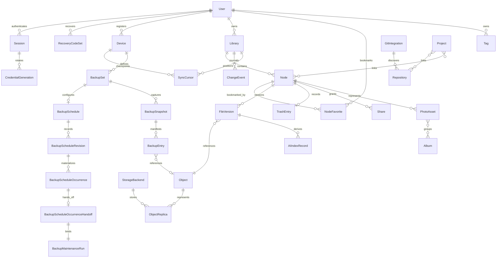

# Domain model chuẩn của Synveil

Trạng thái: **SKELETON_IMPLEMENTED — entity và invariant chuẩn ban đầu đã được validate; canonical schema PostgreSQL, mapping SQLx tường minh, logical node metadata workflow authenticated, subset persisted upload-session/verified-replica, exact-offset HTTP upload transport, content-read bất biến đã authorize theo owner, HTTP download full/single-range đã authenticate, metadata version-history bất biến đã authenticate, safe historical-version restore, metadata Trash retention/purge execution, reference accounting theo FileVersion, GC grace/lease planning metadata-only và xóa vật lý Object/ObjectReplica nội bộ an toàn khi crash đã IMPLEMENTED/VALIDATED; GC-worker orchestration nội bộ bounded và đối soát operation bị kẹt đã IMPLEMENTED; durable change journal, checkpoint theo device, incremental change feed, acknowledgment và bootstrap snapshot/rebaseline logical materialized là VALIDATED; typed client mutation submission với durable idempotency, canonical fingerprint, optimistic concurrency, deterministic conflict persistence và exact journal integration đã IMPLEMENTED/VALIDATED; durable conflict record, manual inspection và explicit manual resolution đã IMPLEMENTED; automatic conflict resolution, desktop sync agent, download UI và content protocol rộng hơn vẫn NOT IMPLEMENTED/PLANNED**

Tài liệu này sở hữu ý nghĩa chuẩn, field, relationship, lifecycle state và
transaction invariant của các domain entity trong Synveil. Tài liệu không áp
đặt layout table vật lý hay implementation của adapter. Database migration và
OpenAPI schema có thể bổ sung chi tiết representation, nhưng không được định
nghĩa lại các ngữ nghĩa này.

Khi tài liệu này mâu thuẫn với ADR đã chấp thuận, ADR được ưu tiên và file này
phải được điều chỉnh trước khi triển khai. Xem
[CONTRIBUTING_ARCHITECTURE.md](CONTRIBUTING_ARCHITECTURE.md) để biết thẩm quyền
và quy trình thay đổi.

## Quy ước modeling

### Identity và field chung

- Mọi public domain ID là UUIDv7 mờ đục được serialize thành chuỗi chữ thường
  có dấu gạch nối. Client không được suy ra creation time, authorization,
  location, shard, storage path hay ordering từ ID.
- Numeric key nội bộ database có thể tồn tại để indexing nhưng không bao giờ là
  public identity hoặc authorization credential.
- Instant UTC dùng RFC 3339 với precision đủ để round-trip. Local capture time
  và UTC offset, nếu biết, được lưu riêng thay vì rewrite lịch sử dựa trên phỏng
  đoán timezone về sau.
- Mutable resource mang integer `revision` tăng sau mỗi mutation có thể quan
  sát từ bên ngoài. API representation của resource cung cấp strong metadata
  ETag. Immutable resource dùng immutable ID/revision trong ETag, không dùng
  storage path.
- Các field tên `created_at`, `updated_at` và `deleted_at` là instant server quan
  sát. Thời gian bắt nguồn từ client được đặt tên riêng và coi là metadata không
  đáng tin cậy.
- Display name do user cung cấp là chuỗi Unicode có encoded length hữu hạn.
  Comparison key do server tạo; key này không bao giờ đồng thời là filesystem
  key hoặc object-store key.
- Hash dùng dạng có algorithm qualifier. Plaintext integrity hash chuẩn ban đầu
  là `sha256:<lowercase-hex>`.
- Enumerated value là ASCII chữ hoa trong stored contract và API contract.
  Future value chưa biết phải gây ra compatibility response có chủ đích, không
  được vô tình fallback sang destructive state.

Trừ khi ADR đã chấp thuận đưa organization vào, `User` là principal cấp cao nhất
và ownership boundary. `Library` là sync journal và policy boundary. Một
deduplication domain được định danh rõ ràng và không thể suy ra từ hash bằng nhau.

### Topology logic



Diagram thể hiện semantic relationship, không quy định table layout. Association
many-to-many cần join record rõ ràng có ownership, timestamp và khả năng audit.

## Domain identity và security

### `User`

Mục đích: human account và principal boundary.

Field chuẩn:

- `id`;
- `username` hoặc login identifier cùng normalized uniqueness key;
- display name tùy chọn và verified contact/recovery attribute;
- `status`: `PENDING`, `ACTIVE`, `LOCKED` hoặc `DISABLED`;
- password-credential reference dùng implementation Argon2id đã được thẩm định
  cùng tunable parameter có version, không bao giờ dùng password dạng plaintext
  hoặc reversible;
- `is_instance_admin`;
- `session_epoch` để vô hiệu hóa credential hàng loạt;
- `created_at`, `updated_at` và `revision`.

Invariant:

- Login identifier là duy nhất theo normalization policy đã chọn.
- User bị disabled không thể tạo session hoặc mutate resource. Dữ liệu được giữ
  lại không bị âm thầm purge khi disable account.
- Administrator privilege được khai báo rõ và audit; không suy ra ownership từ
  privilege này.

### `Session`

Mục đích: authentication grant có thể revoke độc lập.

Field chuẩn:

- `id`, `user_id`, `device_id` tùy chọn và label grant user nhìn thấy tùy chọn;
- `kind`: `WEB`, `API` hoặc `DEVICE`;
- `status`: `PENDING`, `ACTIVE`, `REVOKED` hoặc `EXPIRED`;
- scope rõ ràng phù hợp với grant kind;
- instant issued, last-used, absolute-expiry, idle-expiry và revoked;
- snapshot `user_session_epoch`;
- chỉ với `WEB`, hash/keyed verifier của browser refresh secret và rotation
  lineage/generation của nó;
- coarse client metadata phù hợp cho security review, không phải fingerprint
  xâm phạm.

Với `WEB`, chỉ refresh verifier—không phải raw secret—được lưu trên `Session`.
Với `API` và `DEVICE`, `Session` là family aggregate và không lưu trực tiếp
credential verifier hay generation; mọi verifier và field lineage thuộc record
con `CredentialGeneration`. Browser refresh consume nguyên tử refresh
credential cũ và cấp credential kế tiếp. Flow browser này cố ý không
transparently retryable sau response mơ hồ: reuse credential đã consume đặt
nguyên tử `Session` thành
`REVOKED`, invalidate mọi credential chưa terminal trong family, ghi safe audit
reason `REFRESH_REPLAY_DETECTED` và yêu cầu user đăng nhập lại. Không tồn tại
quarantine state riêng. Quy tắc fail-closed đó phân biệt response bị mất không
rõ với việc giả vờ replay an toàn. Sở hữu session không bao giờ thay thế
authorization theo resource.

Representation public `ApiGrant` không phải authorization aggregate thứ hai:
nó chính là `Session` có kind `API`, và `grant_id` bằng `Session.id` đó. Mỗi
grant family `API` hoặc `DEVICE` có các record con `CredentialGeneration` gồm
grant/session ID, generation tăng đơn điệu, verifier, status (`PENDING`,
`ACTIVE`, `RETIRED`, `REVOKED` hoặc `EXPIRED`), thời điểm issue/activation/
retirement/expiry và bằng chứng last-use. Tối đa một generation là `ACTIVE` và
một generation là `PENDING`. Activation ban đầu chuyển cả generation pending
và grant thành `ACTIVE`; activation rotation chuyển generation cũ thành
`RETIRED`, candidate thành `ACTIVE` và giữ grant `ACTIVE`. Vì vậy `RETIRED` là
status của credential generation, không phải giá trị `Session.status`.

Create hoặc rotate trước hết lưu một generation `PENDING` có giới hạn và trả
raw secret đúng một lần. Trong rotation, generation `ACTIVE` trước vẫn hợp lệ
tới activation. Response một lần bị mất vì thế làm pending secret không dùng
được expire hoặc bị replace thay vì để lại credential active không biết. Scope
request không thể vượt scope owner được phép grant và không bao giờ bỏ qua
authorization theo resource. Revoke `Session` là authority duy nhất để revoke
grant family: nó nguyên tử đặt grant và mọi generation chưa terminal thành
`REVOKED`.

Bearer family của device chính là một `Session` có kind `DEVICE` với
`device_id` trỏ tới `Device`; device ID và session ID vẫn riêng biệt. Nó dùng
cùng quy tắc activation và rotation của pending generation. Endpoint Device,
không phải endpoint Session chung, là surface có thẩm quyền để revoke và revoke
nguyên tử device, credential family cùng mọi generation còn lại.

### `RecoveryCodeSet` và `RecoveryTransaction`

Mục đích: recovery self-hosted mà không giữ bản code có thể khôi phục hoặc âm
thầm phụ thuộc email hosted.

- `RecoveryCodeSet` có ID, user ID, generation, state (`PENDING`, `ACTIVE`,
  `RETIRED` hoặc `EXPIRED`), instant create/activate/expiry, revision và code
  verifier được salt/key riêng cùng instant consumed. Raw code chỉ được trả
  chính xác một lần và không bao giờ được lưu.
- Tạo replacement trước hết tạo một set `PENDING` có giới hạn; set `ACTIVE` hiện
  tại vẫn hợp lệ tới khi user đã xác thực confirm đã lưu code mới và activate
  candidate nguyên tử. Issuance bằng key mới expire/replace nguyên tử pending
  candidate cũ trong khi giữ active set. Vì vậy response generation bị mất để
  lại candidate không dùng được có thể replace thay vì disable recovery path
  cuối cùng đã biết.
- `RecoveryTransaction` chỉ lưu verifier, user/purpose, ID code verifier được
  tham chiếu, state (`PENDING`, `CONSUMED` hoặc `EXPIRED`), short expiry,
  correlation attempt/rate-limit và instant consumed. Code exchange validate
  rồi reserve một active code chưa dùng. Retry được serialize chuyển nguyên tử
  transaction cũ của code đó từ `PENDING` sang `EXPIRED`, release/rebind
  reservation của nó sang một transaction `PENDING` mới và trả secret mới đúng
  một lần; nó chưa consume code.
- Nếu response đó bị mất, retry bằng cùng code invalidate pending transaction
  trước qua đúng transition `PENDING` → `EXPIRED` và cấp transaction mới trong
  cùng transaction. Timeout expiry giải phóng reservation, nên transaction không
  thể tiếp cận không thể consume recovery code cuối của user. Attempt được
  serialize và strict rate-limit.
- Activate replacement code set retire nguyên tử set cũ và expire mọi
  `RecoveryTransaction`/reservation pending tham chiếu set đó. Reset password
  revalidate trong transaction consume rằng code set/generation được tham chiếu
  vẫn `ACTIVE`; retire một set vì thế revoke recovery attempt chưa hoàn tất từ
  code bị đánh cắp.
- Reset password consume nguyên tử cả recovery transaction hiện tại và code
  được tham chiếu, đổi credential Argon2id, tăng `session_epoch` chuẩn,
  invalidate mọi credential grant `WEB`, `API` và `DEVICE`, chuyển mọi `Device`
  chưa revoke bị ảnh hưởng thành `PAUSED`, rồi ghi audit. Device record và data
  vẫn còn. Re-enrollment do owner điều khiển bind một `Session`/generation
  `DEVICE` pending mới vào paused device trong khi family cũ vẫn `REVOKED`;
  activation khôi phục device thành `ACTIVE`. Không tuyên bố wipe hệ điều hành.

### `Device`

Mục đích: client identity người dùng nhìn thấy và điểm gắn policy.

Field chuẩn:

- `id`, `owner_user_id`, display name;
- platform version và application/protocol version;
- capability set đã khai báo, `Session.id` của credential family và reference
  đến credential generation hiện tại, không bao giờ là raw credential;
- `status`: `PENDING`, `ACTIVE`, `PAUSED` hoặc `REVOKED`;
- instant last-seen, lần sync thành công gần nhất và lần backup thành công gần
  nhất;
- instant created, updated, revoked và `revision`.

Capability declaration là input cho negotiation, không phải bằng chứng security
đáng tin cậy. Registration tạo `Device` ở `PENDING` mà chưa có credential usable.
Initial credential issuance tạo pending generation có giới hạn với raw secret
chỉ hiển thị một lần; chỉ activation tường minh mới chuyển generation,
credential family và device thành `ACTIVE`. Rotation giữ generation active cũ
hợp lệ tới khi pending replacement đã lưu được activate. Vì vậy response issue
bị mất không để lại device secret usable không biết. Revocation invalidate
nguyên tử family/generation và quyền API tương lai. Nó không chứng minh dữ liệu
đã download đã bị xóa.

## Domain storage và namespace

### `Library`

Mục đích: ownership/policy boundary và một synchronization journal có thứ tự.

Field chuẩn:

- `id`, `owner_user_id`, name;
- root `Node` ID;
- `dedup_domain_id`;
- `sync_head` tăng theo giao dịch (library row lock được lấy tại boundary append
  journal, sau khi namespace mutation đã được kiểm tra);
- `journal_epoch` và minimum retained sequence;
- namespace-mutation guard nội bộ theo transaction dùng để sắp thứ tự các commit
  `Node` ngắn trong correctness profile ban đầu;
- quota/policy reference;
- `status`: `ACTIVE`, `READ_ONLY`, `QUARANTINED` hoặc `DELETING`;
- timestamp và `revision`.

Mỗi `Node`, `ChangeEvent`, cursor, share origin và library-scoped mutation thuộc
chính xác một library. Sequence chỉ có ý nghĩa cùng library và epoch của nó.

### `Node`

Mục đích: identity file hoặc directory người dùng nhìn thấy.

Field chuẩn:

- `id`, `library_id`, `parent_node_id` nullable cho root duy nhất;
- `kind`: `FILE` hoặc `DIRECTORY`;
- `name` gốc và `name_key` do server tạo;
- đối với file, `current_version_id` nullable khi upload chưa commit;
- `state`: `ACTIVE`, `TRASHED` hoặc `PURGING`;
- `trashed_at` nullable là timestamp chuẩn, chỉ có ở `TRASHED`/`PURGING` và
  được clear khi restore; retention policy derive `restore_deadline` mà không
  lưu thêm cột deadline thứ hai;
- metadata revision, instant created/updated và creator/last-actor ID.

Directory còn expose opaque subtree precondition do server cấp cho destructive
command đệ quy. Representation ban đầu được giải quyết bởi OD-SYNC-004 trong
`SYNC.md`; client không được suy ra nó từ metadata revision thông thường.

Invariant:

- Một library có chính xác một directory root. Root không có parent và không
  thể bị move, trash hay share làm public write root trừ khi được quy định riêng.
- Mỗi cặp active parent/name-key là duy nhất theo name policy đã chấp thuận.
- File không có child. Ancestry của directory phải acyclic và luôn nằm trong
  một library.
- Rename và move mutate metadata `Node`; chúng không sửa `FileVersion` hay di
  chuyển `Object`.
- Content mutation đổi `current_version_id` và node revision trong cùng giao
  dịch tạo version và journal event.
- Trash eligibility chỉ dùng `trashed_at` do server quan sát, một retention
  policy chuẩn, server time hiện tại, ownership và state an toàn. Node `ACTIVE`,
  đã restore, root và `PURGING` không bao giờ là fresh purge candidate. Contract
  Trash một node hiện tại reject directory không rỗng nên candidate selection
  không thể orphan child.
- Trong correctness profile ban đầu, mọi giao dịch ngắn mutate `Node` đều lấy
  namespace guard theo library trước domain row và lock `sync_head` ở cuối.
  Cách này tạo thứ tự xác định giữa directory move hoặc recursive Trash với
  descendant edit mà không giữ lock trong lúc upload byte.

### `NodeFavorite`

Mục đích: bookmark cá nhân của user hiện tại cho file hoặc directory. Favorite
không phải metadata `Node` dùng chung cho owner và không bao giờ được kế thừa
bởi member hoặc người nhận share khác.

Field chuẩn và invariant:

- `user_id`, `library_id`, `node_id`, instant create/update do server ghi và
  `revision` của relation; `(user_id, node_id)` là duy nhất;
- node và library được tham chiếu phải khớp, nhưng relation không cấp quyền
  node, không giữ lại version/object, không đổi node revision và không tạo
  `ChangeEvent` của library;
- read luôn authorize lại node cho user hiện tại, vì vậy access bị revoke được
  ẩn ngay; cleanup có thể xóa relation không còn truy cập được mà không làm lộ
  node của user khác còn tồn tại hay không;
- favorite có thể tồn tại khi node ở `TRASHED` để restore được authorize giữ
  preference, nhưng view Favorites thông thường chỉ trả node `ACTIVE` đọc được;
  logical purge xóa relation;
- create/remove là mutation preference desired-state và idempotent. ETag của
  relation hỗ trợ client dùng điều kiện, idempotency key phục hồi response bị
  mất, và request đối nghịch đồng thời chỉ resolve theo commit order của server
  cho preference không chứa content này.

### Projection node gần đây

“Recent” nghĩa là các node caller còn đọc được và được thay đổi gần nhất bởi
create, content update, rename, move, restore hoặc mutation metadata nhìn thấy
đã commit. Đây là query dẫn xuất, không phải lịch sử recently-viewed được lưu:
read, preview hay download node không tạo tracking state.

Projection sắp theo instant update node do server quan sát cộng immutable node
ID, dùng watermark `as_of` ban đầu trong opaque keyset cursor và có thể filter
một library đã authorize. Mutation sau watermark chỉ xuất hiện khi refresh,
không di chuyển row trong traversal đang chạy. Mỗi page authorize lại từng
node; node inaccessible hoặc `TRASHED`/`PURGING` bị bỏ ngay, và result shared
không expose ancestor path không đọc được. Projection không cấp access, không
tạo retention reference hay `ChangeEvent`, và không tự nhận là audit history.

### `FileVersion`

Mục đích: record bất biến liên kết một file revision với một canonical object.

Field chuẩn:

- `id`, `library_id`, `node_id`, `object_id`;
- `parent_version_id` nullable và `conflict_base_version_id` nullable;
- logical byte length, canonical hash, declared/detected media type;
- client modification time cùng server commit time;
- actor device/user, source type (`UPLOAD`, `SYNC`, `RESTORE`, `BACKUP_RESTORE`
  hoặc `SYSTEM_IMPORT`);
- conflict group/reason tùy chọn;
- immutable creation metadata.

Một restore tạo version mới có source trỏ đến historical version đã chọn; nó
không bao giờ khiến lịch sử cũ trở thành mutable. Object bằng nhau chỉ được tái
sử dụng bên trong cùng dedup domain được phép.

Metadata API đã implement list các record bất biến này theo newest-first với
bounded node-scoped keyset cursor và chỉ báo currentness từ
`Node.current_version_id`. DTO public cố ý loại object, replica, backend,
staging và filesystem identity. Direct version ID cũng là ID mà historical
content-read route chấp nhận. Restore route đã authenticate tạo một head bất
biến mới từ historical version được chọn, dùng head trước restore làm parent,
chỉ dùng lại canonical Object cùng replica đã verify matching và giữ nguyên mọi
historical row. File node trashed hoặc purging vẫn bị che giấu theo active-file
visibility contract. Bằng chứng restore end-to-end PostgreSQL bị gate bởi
`SYNVEIL_TEST_DATABASE_URL`.

Sau điểm không thể quay lại của Trash retention, metadata-purge contract hiện
tại xóa vĩnh viễn row Node và mọi FileVersion của node đó trong một transaction.
Schema hiện tại không có contract tombstone để giữ lịch sử FileVersion đã bị
purge. Chỉ giữ một replay identity tối thiểu, không có tên file hay path. Bằng
chứng PostgreSQL end-to-end purge bị gate bởi `SYNVEIL_TEST_DATABASE_URL`.

### `Object`

Mục đích: identity nội dung plaintext chuẩn bất biến và metadata vòng đời logic
trong một dedup domain. Đây không phải file người dùng nhìn thấy hay
representation vật lý theo backend; một hoặc nhiều `ObjectReplica` materialize
nó.

Field chuẩn:

- `id` và `dedup_domain_id`;
- canonical plaintext hash và length;
- `state`: `STAGING`, `VERIFIED`, `QUARANTINED` hoặc `DELETING`;
- instant durability/verification và kết quả verification gần nhất;
- creation time và garbage-collection eligibility time.

Một `Object` chỉ có thể được tham chiếu khi ở `VERIFIED`. Hash equality được xác
nhận dựa trên length và byte đã verify; collision hoặc mismatch bị quarantine
thay vì alias. Implementation hiện tại dùng relation `FileVersion -> Object`
làm truy vấn logical reference có thẩm quyền, không dùng global counter
mutable. Row metadata-only `object_gc_candidates` ghi `unreferenced_at` và
source sau khi reference FileVersion cuối được release. Row này không phải
deadline xóa byte. Planner thêm grace bounded, worker lease, generation fence,
reference revalidation và planning `READY` có thể revoke. Executor vật lý nội
bộ sau đó lấy `GC_DELETING` theo lock order candidate -> Object, ghi operation
bền cùng action replica theo thứ tự xác định, và lặp lại proof FileVersion/
hold/lease cuối cùng trước mỗi external delete. Object chỉ `AVAILABLE` hoặc
`GC_DELETING`; state sau reject FileVersion/ObjectReplica reference và active
hold mới. Chỉ replica đã được xác nhận absent mới bị dọn metadata; chỉ sau mọi
replica absent executor mới xóa candidate/Object và complete operation. Worker
nội bộ đã implement chỉ phối hợp recovery/new-work slice bounded qua các service
đó; nó persist retry scheduling và báo inconsistency chỉ metadata, nhưng không
auto-delete file vật lý không rõ. Producer hold backup/share/sync vẫn PLANNED.

### `StorageBackend`

Mục đích: object-store adapter đã cấu hình và failure boundary.

Field chuẩn:

- `id`, type (`LOCAL_FS`, `S3_COMPATIBLE`, `MINIO` hoặc future registered type);
- non-secret configuration reference và secret reference;
- namespace/prefix do Synveil sở hữu;
- `status`: `ACTIVE`, `READ_ONLY`, `DEGRADED`, `OFFLINE` hoặc `RETIRED`;
- capability/version declaration, health timestamp và `revision`.

Backend configuration không bao giờ expose credential qua read thông thường.
Không thể retire backend khi đó là verified location duy nhất của object được
tham chiếu. Adapter migration là workflow copy-and-switch có verify, không phải
rewrite storage-key tại chỗ.

### `StorageCapabilities`

Mục đích: evidence có version về những gì `StorageBackend` có thể tăng tốc hoặc
guarantee an toàn.

Đây là capability value/contract gắn với `StorageBackend`, không phải nguồn sự
thật storage thứ hai. Nó có thể khai báo `reflink`, `block_clone`,
`copy_on_write_clone`, `native_snapshot`, `compression`, `checksumming`,
`sparse_files`, `atomic_rename`, `durable_fsync`, `range_reads` và
`filesystem_health`, cùng probe/version evidence và limitation. Application chỉ
chọn tối ưu sau khi adapter chứng minh capability; khi thiếu vẫn phải giữ
portable correctness path. Btrfs hoặc WinBtrfs không bao giờ là state bắt buộc
của backend hay library.

### `ObjectReplica` và `ObjectLease`

Các internal record này là khái niệm tách biệt dù deployment ban đầu chỉ lưu một
replica:

- `ObjectReplica` liên kết object với `storage_backend_id` và `storage_key` mờ
  đục; representation codec/parameter/version, encryption scheme/key reference
  nếu áp dụng, stored length và checksum stored-byte độc lập; backend version
  evidence; state (`COPYING`, `VERIFIED`, `MISSING`, `CORRUPT`, `DELETING`); và
  verification evidence.
- `ObjectLease` bảo vệ công việc staging, active download/assembly, restore hoặc
  migration khỏi garbage collection đến khi bounded expiry.

Chúng cho phép tiering và backend migration phát triển mà không đổi identity
`Object`. Lease không thay thế durable reference và phải hết hạn.

## Domain upload

### `UploadSession`

Mục đích: workflow staging resumable, idempotent, không nhìn thấy như file
version trước khi commit.

Field chuẩn:

- `id`, owner user/device, target library và intent target node/parent;
- operation type (`CREATE_FILE` hoặc `REPLACE_CONTENT`);
- expected total length, expected canonical hash tùy chọn, media/name metadata;
- required base node revision hoặc base version;
- negotiated part constraint;
- `state`: `OPEN`, `VERIFYING`, `COMMITTING`, `COMMITTED`, `FAILED`, `EXPIRED`
  hoặc `ABORTED`;
- actor/instant cancel-request nullable và lease generation;
- expiry, instant created/updated;
- completion idempotency key và committed node/version outcome nếu có.

State transition dùng row-level concurrency control hoặc compare-and-swap tương
đương. Chỉ một completion outcome có thể thắng. Retry completion đã commit trả
stored outcome; không append version hoặc event thứ hai. `VERIFYING` chứa các
internal recovery phase đã persist như `ASSEMBLING`, `HASHING`, `FINALIZING` và
`READBACK_VERIFY`; đây không phải public state thay thế. Cancel có kiểm tra
generation có thể chuyển `OPEN`, `VERIFYING` hoặc `COMMITTING` trước logical
commit sang `ABORTED`. Transaction logical commit kiểm tra lại state, lease
generation và cancel intent dưới session lock; nếu nó commit trước,
`COMMITTED` thắng và cancel không thể undo version.

### `UploadPart`

Mục đích: một range hoặc numbered part đã verify trong session.

Field chuẩn:

- upload session ID và stable part number/range;
- declared length và observed length;
- checksum algorithm/value;
- opaque staging locator;
- `state`: `PENDING`, `RECEIVING`, `VERIFIED` hoặc `REJECTED`;
- idempotency fingerprint và timestamp.

Part có thể đến không theo thứ tự khi đã negotiate. Retry giống hệt được chấp
nhận; request tái sử dụng part identity với byte khác là conflict. Overlap, gap,
total overflow, quá nhiều part và session hết hạn bị từ chối trước assembly.

## Domain đồng bộ — trạng thái Prompt 35

| Capability | Status |
|---|---|
| durable change journal | `VALIDATED` |
| device checkpoints/feed | `VALIDATED` |
| snapshot/rebaseline | `VALIDATED` |
| client mutation submission | `VALIDATED` |
| optimistic conflict detection | `VALIDATED` |
| durable conflict records | `IMPLEMENTED` |
| manual conflict inspection | `IMPLEMENTED` |
| explicit manual resolution | `IMPLEMENTED` |
| automatic conflict resolution | `NOT IMPLEMENTED` |
| desktop sync agent | `NOT IMPLEMENTED` |

### `ChangeEvent`

Mục đích: fact đã commit bền vững cần thiết để client tiến state.

Field của foundation đã implement là:

- `entry_id`, `owner_user_id`, `library_id`, `sequence` được cấp theo giao
  dịch và `journal_epoch`;
- resource kind và change kind có type, có schema version, cùng subject node ID;
- node revision kết quả, parent ID, node kind/state và current version ID khi
  áp dụng;
- `occurred_at` là timestamp mô tả theo transaction time của PostgreSQL.

Unique key là (`library_id`, `journal_epoch`, `sequence`). Sequence order là
commit order cho một library, không phải wall-clock order hay cross-library
order. Event được append trong cùng PostgreSQL transaction với domain mutation.
Foundation cố ý không copy name, path, object/replica identity, actor-device
metadata hay JSON tùy ý; schema version tương lai chỉ có thể thêm projection
bounded đã review mà không đổi ordering contract.

### `SyncCursor`

Mục đích: opaque server token biểu diễn journal position và epoch cho một
client/library.

Foundation metadata expose `JournalCursor` riêng, gồm version, library ID,
journal epoch và last-delivered sequence. Cursor có giới hạn, opaque với caller,
được integrity-check và revalidate với owner/library/head trong PostgreSQL.
Public feed dùng token evidence acknowledgment HMAC bounded riêng; token chỉ
chứng minh integrity, không phải authorization.

### `DeviceSyncCheckpoint`

Mục đích: consumer progress bền vững của một device đã register thuộc owner và
một library.

Field chuẩn:

- `owner_user_id`, `device_id`, `library_id`, với composite foreign key theo
  ownership và duy nhất một checkpoint cho mỗi device/library;
- `journal_epoch`, `acknowledged_sequence`, khởi tạo bằng epoch hiện tại và
  sequence zero ở lần dùng đầu;
- `rebaseline_generation` tăng đơn điệu, chỉ dùng làm compare-and-set fence để
  bootstrap cũ không thể thay thế progress synchronization mới hơn;
- `created_at`, `updated_at` do server ghi và `last_seen_high_watermark` tùy
  chọn.

Checkpoint không lưu journal payload, object/replica identity, storage key,
path hay device credential. Chỉ device hiện hữu ở `ACTIVE` và library thuộc
owner mới được tạo, đọc, fetch hoặc acknowledge. Fetch không advance. Ack dùng
row lock và compare-and-set: page start đã ký phải bằng sequence hiện tại,
range delivered phải hiện hữu liên tục trong journal và chỉ có thể advance
trong epoch hiện tại. Replay ack cũ hợp lệ trả row hiện tại mà không rewind;
gap, future progress, sai epoch hay history đã mất đều trả outcome tường minh.

Trust model HTTP hiện tại là owner session đã authenticate hành động thay cho
device đã register. Pairing, credential mạnh của device và attestation chưa
thuộc phase này.

Client coi cursor và acknowledgment token là mờ đục, không thể increment hoặc tự
tạo và không được dùng làm authorization. Cursor/checkpoint sai
user/library/epoch hoặc thấp hơn retention bị từ chối bằng `not_found` hoặc
`sync_rebaseline_required` ổn định.

### `SyncBootstrap`

Mục đích: session server-side an toàn qua restart, bind một manifest logical
bất biến với một journal handoff cut chính xác cho một device/library.

Field chuẩn gồm `SyncBootstrapId` có type, `owner_user_id`, `device_id`,
`library_id`, generation tăng đơn điệu, `snapshot_epoch`,
`snapshot_resume_sequence`, item count và terminal Node ID tùy chọn bất biến,
state, cùng timestamp create/expiry/completion do PostgreSQL/server quản lý.
State đóng gồm `OPEN`, `COMPLETED`, `ABORTED`, `EXPIRED`. Tối đa một row `OPEN`
cho mỗi scope device/library. Retry start an toàn trả row đó; thay row đã expire
phải tăng generation của checkpoint trước khi tạo session mới.

Start không reset checkpoint. Complete cần terminal-page evidence chính xác và
claim owner/device/library/session/generation/cut matching. Trong một transaction
có row lock, service recheck journal epoch hiện tại và retained history, từ chối
checkpoint đã đi trước, đặt checkpoint chính xác vào epoch/resume sequence đã
capture, rồi đánh dấu bootstrap `COMPLETED`. Replay completed trả checkpoint đã
commit mà không reset lần nữa.

### `LogicalSnapshotNode`

Mục đích: một projection logical bất biến được capture trong `SyncBootstrap`;
nó không phải row `Node` live hay entry backup/archive.

Field gồm `node_id`, `parent_node_id` tùy chọn, logical name, kind `FILE` hoặc
`DIRECTORY`, state public `ACTIVE` hoặc `TRASHED`, revision, current version ID
tùy chọn và—chỉ với current file—cặp content length/SHA-256. Canonical root được
include. Row `PURGING` nội bộ và Node đã purge vĩnh viễn không có mặt; full
history `FileVersion` không được copy. Directory không thể mang content
metadata; file phải có cả length/hash hoặc không có cả hai theo projection
current version.

Membership và value manifest được copy trong cùng transaction đọc journal cut,
rồi page tăng dần theo immutable Node ID. Row manifest cố ý không foreign-key
ngược tới Node/FileVersion/Object mutable, nên rename, move, Trash, purge,
content replacement hoặc version restore sau đó không thể đổi page đã capture.
Manifest không có Object/ObjectReplica ID, storage key, staging handle,
filesystem path, backend locator/version, credential, GC state hay byte content.
Cleanup session retired chỉ cascade tới row manifest đã copy, không bao giờ tới
Library, Node, FileVersion, Object hay journal canonical.

### `LogicalSnapshot` và `RebaselineSnapshot`

Prompt 81 cũng định nghĩa nền tảng snapshot transport-neutral, không gắn với
device. `LogicalSnapshot` là namespace logical đầy đủ của một `library_id`,
không phải bản sao riêng cho từng device. Snapshot include canonical root và
order canonical theo immutable `NodeId`; quan hệ parent phải resolve qua các row
directory tới đúng một root active. Node hiện tại ở state `ACTIVE` và `TRASHED`
được biểu diễn; row nội bộ `PURGING` và Node đã purge vĩnh viễn không có mặt.
Aggregate không chứa physical storage identity hay byte file.

Metadata `RebaselineSnapshot` ghép state đó với `JournalHighWatermark`/
`JournalCursor` đã có type. PostgreSQL builder lấy cả hai từ một view
`REPEATABLE READ` trong khi giữ library namespace guard hiện có, nên mutation
cooperative đã commit không thể rơi vào khoảng giữa state và continuation
boundary. Build value không đổi bất kỳ `DeviceSyncCheckpoint` nào. Đây chỉ là
nền tảng in-memory của Prompt 81.

Prompt 82 làm cut đã validate đó durable nhưng không biến nó thành bootstrap
thuộc Device. `RebaselineSnapshotId` là identity UUIDv7 riêng; header PostgreSQL
lưu Library, journal boundary có type đầy đủ, entry count bất biến và instant
create/expiry được inject, còn một row cho mỗi `LogicalSnapshotNode` chỉ lưu
projection logical canonical. Header cùng mọi entry commit atomically, bất biến
sau publication, không có Object/ObjectReplica ID physical, storage key,
backend/filesystem locator, staging handle, secret hay byte file.

`RebaselineSnapshotDescriptor` và `RebaselineSnapshotPage` là metadata value
transport-neutral. Page dùng `RebaselineSnapshotPageCursor` riêng (artifact ID
cộng `NodeId` immutable cuối), không phải `JournalCursor`; cursor sau vẫn là
incremental continuation boundary. Page read theo owner, dùng keyset order bất
biến và một view repeatable-read ngắn cho header/entry, không đọc lại namespace
live hoặc lấy mutation guard của nó. Snapshot chỉ valid khi
`observed_at < expires_at`; expiry từ chối payload read. Prompt 86 có thể xóa
payload sau đó bằng call bounded explicit nhưng vẫn giữ handoff proof.

### `RebaselineSnapshotHandoffProof` và floor retention journal

Mục đích: giữ authority bất biến tối thiểu để hoàn tất handoff checkpoint sau
khi payload transfer lớn đã vắng mặt, đồng thời bound storage journal và proof.

Field proof chuẩn là `snapshot_id`, `owner_user_id`, `library_id`,
`journal_epoch`, `snapshot_resume_sequence`, `snapshot_created_at`,
`snapshot_expires_at` và `proof_expires_at`. Snapshot identity duy nhất. Mọi
field bất biến, proof được tạo trong transaction payload, deadline đúng 30 ngày
sau expiry payload. Proof không chứa entry count, projection Node,
Object/ObjectReplica, storage key/path, credential hay identity device/
checkpoint, và cố ý không cascade từ payload header.

`minimum_retained_sequence` hiện có của Library là floor đã compact qua bền
vững của epoch hiện tại. Floor đơn điệu trong epoch, không vượt `sync_head`, và
đổi nguyên tử cùng việc xóa đúng prefix liên tục tới giá trị mới. Cursor thấp
hơn floor là stale; equality là continuation exclusive-after hợp lệ. Proof cùng
Library/epoch tạm cap floor tại boundary nhỏ nhất. Checkpoint device bình thường
không pin và cleanup không mutate chúng.

Cleanup payload expired chỉ đổi `rebaseline_snapshots` và entry cascade;
cleanup proof chỉ đổi proof đủ điều kiện khi payload đã vắng; cleanup journal
chỉ đổi journal row và floor Library. Tất cả là operation metadata explicit có
bound. Entity contract này không thêm API retention public, background runtime,
retry, conflict behavior hay recovery client Prompt 87.

### Local lifecycle `RebaselineConvergenceCoordinator`

Prompt 87 không thêm server entity hay local schema migration. Nó compose
namespace `rebaseline_candidates` v5 hiện có và một marker
`rebaseline_applied_handoffs` cho mỗi Library. Candidate thật và marker pending
cũ chỉ có thể cùng tồn tại khi recovery proof-loss/checkpoint-conflict:
candidate là remote base stage chưa authoritative, còn marker cũ vẫn là inbound
fence authoritative. Candidate row `FAILED` inert chỉ được dành cho claim
descriptor-less, scope theo Library quanh POST snapshot-create không idempotent
duy nhất; nó không bao giờ page-readable hay activatable.

Activation candidate complete là local transition duy nhất có thể đổi remote
base và pending marker. Nó expose nguyên tử hoặc old base cùng H1, hoặc
replacement base cùng H2; không bao giờ không marker hay pair lẫn. Chỉ Prompt
85 cài boundary đã được server prove vào local cursor và xóa H2. Outbound
intent cùng upload/submission row local không thuộc cả hai transition. Coordinator
không có retry count durable: một invocation tạo nhiều nhất một artifact; handoff
conflict canonical thứ hai là typed stop, caller sau quyết định có bắt đầu
invocation khác hay không.

### Lifecycle local `BidirectionalSyncCycleRunner` (Prompt 91)

Prompt 91 thêm một boundary composition trung lập transport, không thêm domain
entity hay cycle record durable. `BidirectionalSyncCycleRunner` giữ các
`RebaselineConvergenceCoordinator`, `OutboundSubmissionEngine` đã tạo sẵn và
`LocalStateStore` dùng chung. `run_once(observed_at)` thực hiện một lần inspect
cục bộ, một lần gọi convergence, rồi inspect eligibility cục bộ mới trước khi
gọi tối đa một lần outbound submission. `observed_at` chỉ là metadata caller;
không phải cursor, lease, retry marker hay record scheduling.

Outbound chỉ đủ điều kiện với `IncrementalReady`, incremental progress hữu hạn
an toàn hoặc `RebaselineConverged`, và lần inspect cuối không có candidate,
handoff pending, bootstrap, feed page/ack pending, local issue hay root thiếu.
Conflict row hiện có không chặn inbound; engine Prompt 88 trả outcome fence
durable mà không phát mutation. Inbound auth không an toàn, transport,
rate-limit, recovery-blocked hoặc overlap-blocked đều bỏ qua outbound bảo thủ.
Result không có credential, cookie, token, path raw, content byte hay conflict
payload raw.

Một invocation ordinary giới hạn một feed page và một unit
intent/submission outbound. Prompt 87 vẫn sở hữu recovery hữu hạn và bound tạo
tối đa một snapshot; Prompt 88 vẫn sở hữu idempotency mutation/upload,
reconciliation và conflict. Cycle không thêm loop, retry, scheduler, daemon,
global lock, migration, route hay client schema. Tính đúng sau restart dựa vào
page, candidate, handoff, intent, upload, idempotency và conflict record đã có.

### Biểu diễn conflict

Mỗi client mutation mang `client_mutation_id` bền vững, fingerprint canonical,
base journal epoch/sequence và precondition resource có type. Khi precondition
thất bại, server giữ nguyên Node canonical và trả `MutationConflict` có reason
được hỗ trợ, expected value, current logical state an toàn nếu có, cùng
server epoch/sequence. Resource đã purge được báo từ tombstone `NODE_PURGED`
còn giữ trong journal, không resurrect và không biến thành kết quả rỗng.

Prompt 35 cấp mỗi managed terminal mutation conflict một `SyncConflictId`
UUIDv7 có type và đúng một row `sync_conflicts` trong cùng transaction
terminalize row `device_mutation_operations` gốc. Quan hệ là one-to-one theo cả
hai hướng. Replay mutation ID/fingerprint gốc trả cùng conflict ID; dùng lại ID
với semantic khác vẫn là mutation-identity conflict. Authentication, CSRF,
input malformed, dependency/internal failure, identity reuse và
`sync_rebaseline_required` không bao giờ tạo managed conflict row.

Conflict scope theo owner, Device nguồn, Library, client mutation gốc và
logical resource chính. Lifecycle đóng là `OPEN`, `RESOLVED`, `DISMISSED`.
Evidence bất biến gồm identity conflict/mutation gốc, kind có type, reason,
resource, expected context gốc, field intent typed đóng, server
revision/state/parent/name lịch sử, epoch/sequence đã capture và created_at.
Nó không lưu raw request JSON, path, Object/ObjectReplica identity, locator,
staging handle, credential hay byte. Historical projection là evidence, không
phải current canonical truth. Không có Node foreign key nên purge/rebaseline
không xóa nó. Chỉ lifecycle và terminal resolution linkage được transition một
lần.

`sync_conflict_resolutions` là decision record nhỏ nhất đủ cho resolution
identity UUIDv7, fingerprint SHA-256 typed có version, replay sau mất response,
concurrency fencing, audit stale result và linkage journal event thông thường
khi có. Action vocabulary chính xác là `ACCEPT_SERVER` và
`APPLY_CLIENT_INTENT`. Cùng ID/fingerprint trả outcome, timestamp và event
linkage gốc cùng replay marker; semantic khác trả `resolution_id_conflict`.

`ACCEPT_SERVER` chuyển OPEN thành DISMISSED mà không đổi canonical resource hay
journal. `APPLY_CLIENT_INTENT` bắt buộc fresh current revision do caller cung
cấp, reconstruct semantic intent đã giữ và dùng chung executor mutation trong
transaction cùng lock order Prompt 34. Success đổi Node, append đúng một
`ChangeEvent` thông thường, terminalize decision và chuyển conflict thành
RESOLVED trong một commit nguyên tử. Kết quả stale/purged chỉ terminalize
resolution attempt đó thành stale, giữ conflict OPEN và không đổi Node, journal
hay checkpoint. Decision đồng thời tạo tối đa một terminal conflict transition.
Operation Prompt 34 gốc giữ CONFLICT vĩnh viễn. Không có automatic
conflict-copy, merge, last-writer-wins, silent overwrite hay policy tự động chọn
action.

## Domain backup

Trạng thái Prompt 72: **durable backup scheduling, occurrence identity,
exactly-once occurrence-to-maintenance handoff, deterministic manual
single-step scheduler tick, bounded misfire policy an toàn sau restart,
worker step scheduled-maintenance có fence, cycle scheduler+worker bị chặn
gọi thủ công, service integration boundary, bất biến thứ tự khóa chuẩn,
runtime một lần nội bộ và lifecycle ngoài systemd oneshot+timer đã
IMPLEMENTED/VALIDATED**. Timer ngoài sở hữu recurrence (xấp xỉ mỗi phút,
`Persistent=true`, `RandomizedDelaySec=10s`); binary một lần sở hữu đúng một
cycle bị chặn; không có daemon, loop, retry hay bảng lifecycle mới. Schedule,
occurrence ledger, handoff/skip/claim relation cùng tick và worker step là
control-plane metadata; handoff tạo maintenance run canonical còn worker step
advance run tối đa một fenced transition cho mỗi lần gọi tường minh. Trạng
thái này không ngụ ý scheduler daemon, poll loop, retry queue, heartbeat,
automatic snapshot capture, HTTP route hay UI; scheduled backup không chạy
liên tục trong background.

### `BackupSet`

Mục đích: định nghĩa source được bảo vệ và retention policy theo thiết bị.

Field chuẩn:

- `id`, owner user, source device;
- display name, source descriptor cùng client-stable opaque source ID;
- include/exclude rule và symlink policy;
- schedule/continuous mode;
- retention-policy reference;
- `status`: `ACTIVE`, `PAUSED`, `DEGRADED` hoặc `RETIRED`;
- last observation/success, timestamp và `revision`.

Source descriptor không được tin như server path và không trao quyền truy cập
bên ngoài source do client chọn.

### `BackupSchedule` và `BackupScheduleRevision`

Mục đích: một local-time recurrence bền vững cho một `BackupSet`, có lịch sử
configuration immutable và một current revision có authority.

`BackupSchedule` có `id`, `owner_user_id`, `backup_set_id`,
`current_revision_id`, `enabled`, `effective_from`, `created_at` và
`updated_at`. Mỗi BackupSet có nhiều nhất một schedule.
`BackupScheduleRevision` có ID riêng, scope
schedule/owner/BackupSet, `revision_number` dương tăng đơn điệu,
`operation_id` idempotent, semantic fingerprint canonical có version,
`recurrence_kind` (`DAILY` hoặc `WEEKLY`), IANA `timezone` tường minh, local
minute `HH:MM`, `weekly_days` chuẩn hóa theo Monday đến Sunday, `misfire_mode`
(`REPLAY_ONE_BY_ONE` hoặc `LATEST_ONLY`), `max_lateness_seconds` có giới hạn và
`created_at`. Default an toàn là `LATEST_ONLY` với 604800 giây; khoảng lateness
đóng là 60 đến 2678400 giây.

Owner và scope BackupSet được kiểm tra ở mọi service boundary. Revision và
operation evidence là append-only; current pointer phải trỏ đúng một revision
cùng scope và chỉ được chuyển tới revision number cao hơn. Request có semantic
giống nhau trả current revision mà không tạo revision mới; dùng lại operation
identity cho semantic khác phải fail closed. Policy change là semantic change
và append revision mới; timing-and-policy no-op chính xác không đổi revision
hay `effective_from`. Fingerprint version 1 giữ cách replay timing-only gốc;
fingerprint version 2 mới chứa timing đã chuẩn hóa, mode và lateness. Daily
không có weekday; weekly phải có ít nhất một weekday đã chuẩn hóa.

Pure planner nhận một UTC instant exclusive và resolve local date/time bằng
IANA rule đã lưu. Planner trả instant kế tiếp nghiêm ngặt sau reference, đẩy
nonexistent DST wall time tới minute hợp lệ đầu tiên trong cùng local date, và
chọn absolute instant sớm hơn khi fall-back tạo ambiguous wall time. Occurrence
chỉ effective khi `BackupSet` sở hữu đang `ACTIVE` và schedule được enable.
Disable schedule suppress occurrence nhưng giữ current và historical
configuration.

`effective_from` là activation boundary strict chuyên biệt. First
configuration, semantic current-revision change và `DISABLED -> ENABLED` làm
nó tiến lên; semantic no-op không đổi boundary. Occurrence của current revision
chỉ được materialize mới khi canonical UTC instant đã tới hạn và nằm nghiêm
ngặt sau boundary.

### `BackupScheduleOccurrence`

Mục đích: durable identity immutable cho một scheduled firing opportunity,
tách khỏi mọi execution state tương lai.

Field chuẩn gồm opaque UUIDv7 `id`, scope owner/BackupSet/schedule/revision,
`local_calendar_date`, `resolved_local_wall_time` thực tế, IANA timezone của
revision, canonical `scheduled_for_utc` và `materialized_at`. Logical key là
`(schedule_revision_id, local_calendar_date)`; `(schedule_id,
scheduled_for_utc)` là exact-instant uniqueness fence thứ hai.

Materialization lock BackupSet sở hữu rồi schedule, kiểm tra logical row đã có
trước; chỉ với row mới mới kiểm tra ACTIVE/enabled, current revision, recurrence
target chính xác, strict effectivity và due time. Server tính lại resolved
local/UTC qua đúng DST planner của Prompt 61. Request đồng thời và retry sau
lost response hội tụ về cùng occurrence ID. Row của old revision đã commit vẫn
replay được sau edit/disable; old revision chưa có row không thể materialize
mới.

Occurrence row từ chối UPDATE và DELETE. Materialized chỉ có nghĩa “đã ghi
nhận bền vững”; không có nghĩa backup đã chạy hay thành công. Relation
`BackupScheduleOccurrenceHandoff` riêng bind mỗi occurrence tối đa một lần vào
một `BackupMaintenanceRun` canonical; occurrence không mang progress. Domain
này không lưu occurrence execution/claim, job, lease, retry
hay worker; handoff không snapshot, journal, ObjectStore, sync, restore, prune,
GC hay physical-storage mutation.

### `BackupScheduleOccurrenceHandoff`

Mục đích: provenance binding immutable từ một occurrence đã materialize tới
maintenance run canonical được tạo cho firing đó.

Relation chỉ chứa `occurrence_id`, scope owner/BackupSet/schedule,
`maintenance_run_id` và `created_at`. PostgreSQL enforce mỗi occurrence chỉ có
một relation và mỗi maintenance run chỉ thuộc tối đa một scheduled occurrence;
composite foreign key chứng minh occurrence, schedule, BackupSet, owner và run
cùng logical scope. UPDATE và DELETE bị từ chối; không hỗ trợ retarget
occurrence hoặc attach một manual run đã tồn tại.

Handoff service yêu cầu occurrence tồn tại trước. Service serialize
`BackupSet → BackupSchedule → Occurrence → maintenance-run/policy → handoff`,
kiểm tra relation đã commit trước fence schedule/set hiện tại, rồi trả run và
relation canonical ở disposition `CREATED` hoặc `EXISTING`. Run mới được tạo
qua Prompt 49 primitive ở state `CREATED`, bind immutable retention-policy
revision hiện tại và child operation identity. Handoff không phải completion:
không capture snapshot, plan expiry, advance run và không cung cấp scheduler
daemon, retry policy hay automatic execution loop.

### `BackupScheduleMisfireSkip` và manual scheduler tick

`BackupScheduleMisfireSkip` là control-plane evidence immutable rằng một
activation epoch cố ý tiến qua expired prefix. Relation lưu opaque UUIDv7 ID,
scope owner/BackupSet/schedule/revision, `activation_effective_from`, range
`(resolved_from_exclusive_utc, resolved_through_utc]`, observation time và
snapshot mode/lateness của immutable revision. Composite foreign key,
activation/policy validation, monotonic insertion, range check, unique boundary
và trigger từ chối UPDATE/DELETE bảo vệ ledger.

Prompt 65 mở rộng lời gọi tường minh
`BackupSchedulerService::run_scheduler_tick` với `observed_at_utc` được inject.
Trong mỗi activation, resolution reference là `max(effective_from, occurrence
đã handoff mới nhất, skip resolved_through_utc mới nhất)`. Materialization đơn
thuần không làm reference tiến lên. Mỗi schedule tạo tối đa một action
`SKIP_EXPIRED`, handoff-existing hoặc materialize-and-handoff. Thứ tự toàn cục
dùng action instant, rồi stable schedule/revision ID. Service không có cursor
durable hay cursor trong process và không materialize future hay collapsed row
chỉ để discover work.

Exact cutoff là `observed_at_utc - max_lateness_seconds`; equality vẫn eligible.
`REPLAY_ONE_BY_ONE` resolve expired prefix trước rồi chọn occurrence eligible cũ
nhất. `LATEST_ONLY` chọn occurrence eligible mới nhất; handoff thành công tự
resolve backlog cũ hơn. Nếu toàn bộ unresolved work đã expired, một range row
resolve tới canonical due occurrence mới nhất mà không tạo occurrence, handoff
hay maintenance run.

Candidate được chọn đi qua materialization của Prompt 62 và handoff của Prompt
63; scheduler không insert trực tiếp vào occurrence, handoff hay maintenance
table. Scheduler handoff thêm atomic fence current revision và activation
`effective_from` nhưng vẫn giữ nguyên replay behavior trực tiếp của Prompt 63.
Occurrence unhanded lịch sử, thuộc disabled period, superseded hoặc cũ trước
re-enable vẫn là audit evidence và không tự động catch up.

Kết quả tick là `IDLE`, `SKIPPED_EXPIRED`, `HANDED_OFF_EXISTING` hoặc
`MATERIALIZED_AND_HANDED_OFF`. Tick tạo tối đa một occurrence, một handoff và
một maintenance run ở state `CREATED`. Tick không advance run và không làm
snapshot, expiry, prune/GC, journal, sync hay ObjectStore. Đây là manual
invocation restart-safe, không phải daemon, poller, retry policy, lease hay
continuous background scheduler.

### `BackupScheduledMaintenanceClaim` và worker step có fence

Mục đích: durable authorization cho đúng một transition Prompt 49 chuẩn từ một
expected maintenance state, cùng lease dùng để fence stale holder.

Field chuẩn gồm UUIDv7 `claim_id` opaque, scope owner/`BackupSet`/schedule/
occurrence/maintenance-run, `expected_state` (chỉ `CREATED`,
`SNAPSHOT_CAPTURED` hoặc `EXPIRY_PLANNED`), `resulting_state` tiền định
(tương ứng `SNAPSHOT_CAPTURED`, `EXPIRY_PLANNED` hoặc `COMPLETED`),
`lease_worker_id`, `lease_token` không đoán được, `lease_generation` tăng đơn
điệu từ 1, `lease_acquired_at`, `lease_expires_at` (luôn sau acquired),
`completed_at` và timestamp. Identity của claim là
`(maintenance_run_id, expected_state)` với uniqueness ở database; lease token
là unique. Completion đòi hỏi cả `completed_at` và `resulting_state`; receipt
hoàn thành một nửa không thể commit.

Provenance được fence ở database tới Prompt 63 handoff đã commit bind cùng
occurrence, run, owner, `BackupSet` và schedule, vì vậy manual run không bao
giờ có claim và cross-scope forgery bị reject. Claim bắt đầu ở generation 1 và
incomplete. Claim incomplete chấp nhận đúng hai transition: takeover đúng tại
hoặc sau expiry (generation N → N+1 với token mới và lease interval mới) hoặc
completion seal resulting state tiền định trong khi lease identity bị frozen.
Receipt đã complete từ chối UPDATE, mọi row từ chối DELETE, provenance column
là immutable.

`ScheduledMaintenanceWorkerService` expose `claim_next_...`,
`execute_claimed_...` và `run_scheduled_maintenance_worker_step` kết hợp, tất
cả gọi tường minh với `observed_at_utc` inject và lease duration bị chặn (mặc
định 120 giây, chấp nhận 10 tới 900). Discovery quét scheduled run toàn cục
theo `occurrence.scheduled_for_utc`, `schedule_id` rồi `maintenance_run_id`;
lease còn hiệu lực của worker khác thì skip mà không chặn, lease cũ nhất hết
hạn được takeover trước, claim cũ nhất đã đạt resulting được reconcile trước.
Execution verify full lease fence trong cùng transaction commit transition
Prompt 49 duy nhất, tái dùng canonical capture, expiry-planning và
expiry-execution operation với durable child-operation identity của run.
Crash-trước-advance được takeover; crash-sau-advance reconcile mà không
transition lần hai rồi dừng; response completion bị mất replay chuẩn; state bất
ngờ fail closed; run `STALE` trả typed stale outcome. Mỗi lần gọi thực hiện tối
đa một semantic transition hoặc recovery action. Primitive này không có daemon,
polling/heartbeat loop, retry/backoff, public API, UI hay physical identity.

### `ScheduledMaintenanceCycleResult` và cycle bị chặn gọi thủ công

Mục đích: một orchestration boundary gọi thủ công gồm đúng một scheduler tick
và đúng một worker step, không có durable state mới.

`ScheduledMaintenanceCycleService::run_scheduled_maintenance_cycle` nhận
`worker_id` tường minh, `observed_at_utc` được inject và lease duration bị
chặn, rồi chạy canonical tick trước canonical worker step và trả
`ScheduledMaintenanceCycleResult { tick, worker }`. Phía tick là `Idle`,
`SkippedExpired`, `HandedOffExisting` hoặc `MaterializedAndHandedOff` với
accessor `outcome()`/`skip_outcome()` tương ứng `BackupSchedulerTickResult`;
phía worker là `Idle` hoặc `Stepped(ScheduledMaintenanceWorkerStepOutcome)`.
Lỗi được type là `Scheduler(BackupSchedulerError)` hoặc
`Worker(ScheduledMaintenanceWorkerError)`; lỗi scheduler thì bỏ worker step,
lỗi worker vẫn giữ scheduler state đã commit mà không có spanning transaction.
Mỗi lần gọi commit tối đa một maintenance transition, global claim ordering và
lease fencing giữ nguyên, không có cycle table, cursor, heartbeat, retry,
daemon hay physical identity mới.

### `BackupSnapshot`

Mục đích: immutable committed manifest view cho một backup set.

Field chuẩn:

- `id`, `backup_set_id`, source device;
- parent snapshot ID khi incremental;
- `state`: `BUILDING`, `VERIFYING`, `COMMITTED`, `FAILED` hoặc `EXPIRED`;
- instant scan start/end và server commit;
- manifest format/version, root hash, entry count, logical/unique byte count;
- consistency class (`FILESYSTEM_CONSISTENT`, `CRASH_CONSISTENT` hoặc
  `BEST_EFFORT`), completeness và client/software metadata;
- retention deadline/legal hold khi áp dụng.

Chỉ snapshot `COMMITTED` có thể restore. Snapshot commit ghi nguyên tử complete
verified manifest reference và durable follow-up work. Snapshot `BUILDING` hoặc
`FAILED` chỉ có thể bảo vệ staging object qua bounded lease.

### `BackupEntry`

Mục đích: một immutable manifest entry, không phải `Node` live.

Field chuẩn:

- snapshot ID, stable entry ID, parent entry ID;
- type (`FILE`, `DIRECTORY`, `SYMLINK` hoặc type được hỗ trợ rõ ràng);
- original relative name/path component dưới dạng metadata không đáng tin cậy;
- file object/version reference, size, canonical hash, timestamp và bounded
  portable metadata;
- capture result (`PRESENT`, `UNCHANGED`, `UNREADABLE`, `EXCLUDED` hoặc
  `MISSING_OBSERVATION`) cùng error classification.

Một entry vắng mặt trong snapshot sau không mutate library node và không xóa
ngược entry đó khỏi snapshot cũ còn retention.

### Restore operation

Restore là durable operation record có source snapshot/version, destination rõ
ràng, collision policy, actor, state, per-entry result, byte/hash verification
và idempotency key. Partial completion nhìn thấy được và restart được;
“successful” nghĩa là mọi result bắt buộc đã verify hoặc một skip được chấp nhận
rõ ràng đã được ghi.

## Domain sharing, trash và policy

### `Share`

Mục đích: authorization grant có thể revoke trên node/subtree.

Field chuẩn:

- `id`, owner/grantor, origin library/node;
- grantee user ID cho private share hoặc hashed random-secret verifier cho
  public link;
- permission (`READ` hoặc `WRITE`) và việc permission có gồm descendant hay
  không;
- password verifier tùy chọn, expiry, access limit, instant created/revoked;
- `status`: `PENDING`, `ACTIVE`, `REVOKED` hoặc `EXPIRED`; revision và audit
  correlation.

Share không bao giờ grant quyền truy cập `Object` trực tiếp độc lập với quyết
định download đã authorize. Move node trong library được phép giữ identity của
nó; move hoặc copy qua ownership boundary cần hành vi share rõ ràng và không thể
âm thầm mở rộng access.

Discovery private share là view của `Share` được lọc authorization, không phải
danh sách ID do client tự giữ. Grant private active xuất hiện trong collection
“được share với tôi” của grantee chỉ với projection an toàn của `Node` gốc
share; ancestor path grantee không đọc được, grantee khác, locator
object/replica và secret public link đều bị loại. Collection “tôi đã share” của
grantor có thể gồm grant pending, active, expired hoặc revoked theo status filter tường
minh, nhưng không bao giờ trả raw capability hay password. Expiry/revocation
loại grant khỏi discovery của grantee ngay tại authorization time dù cleanup
hoặc page cursor đã cấp trước đó bị trễ. Discovery không tự giữ content hoặc mở
rộng grant nền.

Public-link secret có ít nhất 128 bit randomness mật mã trước encoding. Creation
lưu public share ở `PENDING` chỉ với keyed/cryptographic verifier và trả raw
secret chính xác một lần. Link pending không thể authorize access; owner
activation tường minh chuyển nó thành `ACTIVE` sau khi capability đã được lưu.
Nếu response bị mất, idempotency replay chỉ trả safe candidate metadata.
Candidate inert phải được revoke, rồi tạo share mới bằng key mới—raw capability
material không bao giờ được lưu, replay, list hay log. Private user grant có thể
được tạo thẳng thành `ACTIVE` vì không mang one-time bearer secret.

### `TrashEntry`

Mục đích: deletion context và retention deadline cho node đã trash.

Field chuẩn:

- node ID và library ID;
- former parent/name projection;
- deletion actor/device, deletion sequence và time;
- scheduled purge time, restore policy và subtree operation ID tùy chọn.

Restore có điều kiện vì former parent hoặc name nay có thể conflict. Purge không
thể đảo ngược ở logical layer, nhưng physical byte được giữ đến khi mọi
authoritative reference khác và safety window đã được xóa.

### Policy và quota

Policy record có version và được gắn rõ vào user, library, device, backup set
hoặc share. Effective-policy resolution tất định và có thể audit. Quota
reservation bao phủ race giữa staging và commit; logical byte, retained byte,
staged byte và physical byte được báo cáo riêng.

## Domain photos

### `PhotoAsset`

Mục đích: projection riêng cho photo trên một hoặc nhiều canonical file
resource.

Field chuẩn:

- `id`, owner/library, primary node và source file-version ID;
- media kind (`IMAGE`, `VIDEO`, `LIVE_GROUP`);
- capture instant, original UTC offset, metadata confidence/source;
- dimension, duration/orientation khi extract an toàn;
- favorite flag, screenshot classification và provenance;
- processing state (`PENDING`, `READY`, `PARTIAL`, `FAILED` hoặc `STALE`);
- source device và device-scoped import identity khi được cung cấp;
- timestamp và `revision`.

Asset không sở hữu hoặc rewrite original byte. `FileVersion` current mới khiến
derived data stale cho đến khi xử lý lại. Location và face data là sensitive
derived metadata có policy riêng.

### `PhotoResource` và `PhotoDerivative`

- `PhotoResource` liên kết một role (`PRIMARY_IMAGE`, `MOTION_VIDEO`, `DEPTH`
  hoặc future registered role) với node/version, cho phép nhóm kiểu Live Photo
  mà không làm mất original.
- `PhotoDerivative` ghi source version, kind/size, derivative object, generator
  và parameter, state và integrity. Nó có thể thay thế và không bao giờ trở
  thành canonical original.

### `Album` và membership

`Album` có ID, owner, title, type (`MANUAL` hoặc future saved query), cover
reference, timestamp và revision. Membership là explicit join có thứ tự với
field added-at/actor. Xóa membership không bao giờ xóa asset.

### `Tag` và assignment

`Tag` có ID, owner, normalized name key, display label, color tùy chọn và
revision. Assignment liên kết tag với subject, có provenance `USER`, `SYSTEM`
hoặc `AI`, confidence chỉ khi có ý nghĩa, model/rule reference và review state.
Reindex không overwrite chỉnh sửa của user.

[PHOTOS.md](PHOTOS.md) sở hữu hành vi ingestion, privacy, duplicate, derivative
và client.

## Domain integration và workspace

### `GitIntegration`

Mục đích: connection đã cấu hình đến external Git service.

Field chuẩn:

- `id`, owner, provider type (ban đầu là `FORGEJO`);
- canonical base URL cùng secret reference được lưu riêng;
- provider installation/account identity;
- requested capability scope và verified capability scope;
- `status`: `PENDING`, `ACTIVE`, `DEGRADED`, `REAUTH_REQUIRED`, `PAUSED` hoặc
  `REVOKED`;
- lần poll/webhook thành công gần nhất, health summary, timestamp và revision.

URL và credential nhạy cảm về security. Integration record không khiến Synveil
trở thành authority cho Git permission.

### `Repository`

Mục đích: cached external-repository identity và backup subject.

Field chuẩn:

- `id`, integration ID, immutable provider repository ID;
- owner/name/full-name display metadata và canonical provider URL;
- visibility ở lần quan sát gần nhất, default branch, archived state;
- provider revision/updated time được quan sát gần nhất;
- sync health và freshness;
- timestamp và revision.

Provider metadata là stale khi Forgejo không thể tiếp cận và phải nói rõ điều
đó. Sở hữu cached metadata không grant quyền truy cập repository.

### `RepositoryBackup`

Mục đích: immutable verified repository recovery point, khác với
`BackupSnapshot` của device.

Field chuẩn:

- `id`, repository ID, state (`BUILDING`, `VERIFYING`, `COMMITTED`,
  `INCOMPLETE`, `FAILED` hoặc `EXPIRED`);
- capture start/end, provider identity/version;
- consistency class và observed ref;
- versioned manifest/root hash;
- reference đến Git data, Git LFS, supported release artifact object và
  per-component result;
- retention và verification evidence.

Chỉ backup `COMMITTED` đáp ứng consistency class đã khai báo mới được cung cấp
như complete restore. Record `INCOMPLETE` có thể được giữ để diagnostic nhưng
không được ghi label sai.

### `Project`

Mục đích: workspace tùy chọn liên kết các subject sở hữu độc lập.

Field chuẩn:

- `id`, owner, name, description;
- status, timestamp và revision.

Typed link record kết nối project với repository, library node, backup
set/snapshot, device và metadata. Link không chuyển ownership, mở rộng
permission, đổi retention hoặc cascade-delete target của nó.

[CODE_INTEGRATION.md](CODE_INTEGRATION.md) sở hữu hành vi provider, backup,
restore, webhook/polling và project-link.

## Domain dẫn xuất từ AI

### `AIIndexRecord`

Mục đích: derived index unit có thể thay thế, gắn với immutable source revision.

Field chuẩn:

- `id`, owner và authorization scope;
- source type/ID và immutable source revision hoặc version;
- modality và chunk/region locator;
- pipeline, extractor, model, model-license và configuration version;
- inference mode (`LOCAL` hoặc `REMOTE`) và consent/policy revision;
- content hash/fingerprint của indexed input;
- status (`PENDING`, `READY`, `FAILED`, `STALE`, `DELETING`);
- derived text/tag/vector reference, sensitivity classification;
- attempt/error class, instant created/updated/indexed/expires.

Record không bao giờ là canonical user data. Search authorization được đánh giá
dựa trên current source access, không chỉ stale ACL snapshot trong index.
Deletion, share revocation, source-version change, model change hoặc consent
change invalidate hoặc xóa derived record bị ảnh hưởng theo [AI.md](AI.md).

### `AIJob`

Asynchronous at-least-once job mang idempotency identity dựa trên pipeline +
immutable source version + configuration version. Job có bounded attempt,
lease, next-attempt time, safe error class và terminal/dead-letter state. Poison
input không thể chặn indexing không liên quan.

## Domain audit và asynchronous delivery

### `AuditEvent`

Mục đích: security fact và material-operation fact chỉ append.

Field chuẩn:

- event ID, server time, actor user/session/device hoặc system actor;
- action, target type/ID, library/owner scope;
- outcome và stable reason code;
- request/correlation ID và coarse network/client context policy cho phép;
- redacted structured detail và schema version.

Audit record không bao giờ chứa password, bearer token, public-link secret,
object-store credential, raw file content, embedding hoặc full sensitive path,
trừ khi policy được audit rõ ràng yêu cầu representation hữu hạn. Audit
retention và administrator access là quyết định policy riêng.

### `OutboxEvent`

Mục đích: durable delivery của follow-up work sau core mutation đã commit.

Field chuẩn:

- ID, aggregate type/ID/revision, event type và schema version;
- transaction commit time, redacted payload/reference;
- availability time, attempt/lease state, delivered/terminal timestamp.

Record được insert trong cùng PostgreSQL transaction với mutation. Consumer là
idempotent và delivery là at least once; “delivered” không bao giờ có nghĩa mọi
external side effect là exactly once. Outage của optional consumer chỉ làm lag
tăng.

## Invariant atomicity và consistency

Các nhóm sau là single PostgreSQL transaction:

| Mutation | Hiệu ứng metadata nguyên tử bắt buộc |
|---|---|
| Content commit | Verify durable receipt; chọn hoặc tạo `Object` chuẩn; tạo hoặc attach `ObjectReplica` đã verify, bind backend, key và representation; tạo `FileVersion`; tạo/cập nhật head `Node`; reserve/finalize quota; append `ChangeEvent`, `AuditEvent` và `OutboxEvent`; lưu idempotent outcome. |
| Rename hoặc move | Lấy namespace guard; validate authorization/name/acyclic ancestry và expected revision; mutate node; append change, audit, outbox và idempotent outcome. |
| Trash hoặc restore | Lấy namespace guard; validate node revision và server-issued subtree precondition cho thao tác đệ quy; mutate node state và `TrashEntry`; append change/audit/outbox; restore chỉ có thể giải quyết name/parent conflict bằng policy rõ ràng. |
| Share mutation | Mutate grant/revision và append audit/outbox. Share revocation được kiểm tra tại request time. |
| Backup snapshot commit | Chuyển complete manifest đã verify sang `COMMITTED`, finalize authoritative object reference/accounting, ghi audit/outbox và idempotent outcome. |
| Repository backup commit | Ghi consistency class, complete component manifest, verified object reference, audit/outbox và một terminal outcome. |

PostgreSQL không thể rollback filesystem write hoặc S3 write. Protocol an toàn là:

1. tạo opaque staging object và bounded lease;
2. stream byte với giới hạn size/quota;
3. finalize bền vững và verify object;
4. commit mọi logical reference và event trong PostgreSQL;
5. khi database failure, để lại unreferenced object cho reconciliation trì
   hoãn, có safety window;
6. khi mất response, trả stored result cho cùng idempotency key.

Garbage collection không bao giờ chỉ dựa vào age hoặc mutable reference counter.
Nó liệt kê authoritative reference, lease, object state, retention/legal hold
và minimum safety delay; deletion có hai phase và có thể audit.

## Ranh giới authorization và privacy

- Principal được authorize bằng authenticated identity, quan hệ owner/library,
  share grant, role và current policy. Opaque ID, hash, cursor, cached repository
  row hoặc object key không bao giờ đủ.
- Query scope theo ownership trước pagination và aggregation. Count, timing,
  quota saving, dedup hit, search score và khác biệt error không được leak dữ
  liệu của user khác.
- Public link ánh xạ random secret đến `Share` hữu hạn và vẫn enforce expiry,
  password, scope, rate limit và revocation.
- Metadata dẫn xuất từ backup, photo, AI và repository kế thừa sensitivity của
  source và không thể âm thầm nhận access project hoặc album rộng hơn.
- Storage adapter nhận opaque key và byte, không nhận user path. Remote AI
  provider chỉ nhận content theo mode/policy/consent rõ ràng.
- Xóa user-facing reference có thể để lại retained version, snapshot, verified
  repository backup hoặc audit fact. UI và erasure workflow công bố từng
  retention domain thay vì tuyên bố physical erasure tức thì.

## Hành vi lỗi bắt buộc

| Trường hợp | Domain outcome |
|---|---|
| Hai completion chạy đua | Một terminal outcome của `UploadSession` thắng; retry tương đương trả outcome đó, request xung đột trả `completion_conflict`. |
| Object write thành công và DB transaction thất bại | Không có visible version. Object không được tham chiếu, được bảo vệ bằng lease/safety window và reconcile sau. |
| DB commit và API response bị mất | Idempotency lookup trả original ID/revision; không có journal event trùng. |
| Object về sau fail verification | `ObjectReplica` bị ảnh hưởng thành `CORRUPT` hoặc `MISSING`; `Object` chỉ thành `QUARANTINED` khi không còn replica đáng tin cậy. Reference vẫn được biết, read fail an toàn và recovery tìm verified replica hoặc backup khác. |
| Directory move chạy đua với descendant move | Transactional ancestry guard/serialization ngăn cycle; một operation retry hoặc conflict. |
| Cursor nằm ngoài retained history | Cursor bị từ chối; client lấy authoritative paginated snapshot và server checkpoint mới. |
| Backup input biến mất | Snapshot mới ghi observation theo policy; reference của snapshot cũ tồn tại đến khi retention hết hạn. |
| Share bị revoke khi download đang chạy | Authorization và range request mới thất bại. Byte đã giao không thể thu hồi; implementation xác định có terminate active stream hay không mà không tuyên bố erasure. |
| AI hoặc photo processing lặp lại | Idempotency key/source-version uniqueness thay thế hoặc trả cùng derived record; original không đổi. |
| Forgejo identity được tái sử dụng hoặc rename | Match immutable provider repository ID, không dùng display path; destructive restore cần provider identity mới và confirmation rõ ràng. |

## Open decision hữu hạn

OPEN DECISION OD-DOM-001: so sánh và normalization filename
Owner: Architecture / Storage / Sync
Needed by: Gate schema và namespace Phase 1
Options: tên giữ nguyên byte cùng comparison key NFC case-sensitive; comparison key case-insensitive trung lập platform; comparison policy theo library, cố định lúc tạo
Recommendation: giữ original Unicode display name và ban đầu dùng một portable comparison key case-insensitive bất biến; để mở chính xác algorithm Unicode normalization/case-fold cùng version cho đến khi fixture suite lựa chọn
Decision evidence: fixture suite cross-platform bao phủ Unicode normalization, case collision, reserved name và hành vi round-trip

OPEN DECISION OD-DOM-002: mô hình ownership multi-user ban đầu
Owner: Architecture / Security / Product
Needed by: Gate trusted-access và sharing schema Phase 3
Options: library do user sở hữu chỉ có node share; owner rõ ràng cộng library membership; organization household/team hạng nhất
Recommendation: dùng owner rõ ràng cộng membership, không có cross-owner deduplication, đồng thời hoãn enterprise organization; Phase 1 có thể bắt đầu owner-only nhưng không được encode assumption ngăn membership
Decision evidence: product requirement và threat review cho administration, offboarding, quota và shared ownership

OPEN DECISION OD-DOM-003: encoding metadata ETag
Owner: Architecture / API
Needed by: Gate OpenAPI đã review Phase 1
Options: quoted opaque token từ resource ID và revision; signed representation token; random version token lưu trên server
Recommendation: quoted opaque encoding của resource kind, ID và revision được bảo vệ khỏi client tự tạo; không bao giờ expose SQL transaction ID
Decision evidence: conditional-request contract test, proxy compatibility test và information-leak review

OPEN DECISION OD-DOM-004: hành vi active stream sau authorization revocation
Owner: Security / API / Storage
Needed by: Gate sharing Phase 3
Options: terminate active response khi quan sát thấy revocation; authorize một lần cho mỗi bounded response; short-lived signed internal read lease có giới hạn byte/time
Recommendation: authorize từng request và range request, giới hạn stream duration và ghi rõ byte đã giao không thể thu hồi; chỉ đánh giá termination nếu đáng tin cậy trên mọi adapter
Decision evidence: threat review, streaming implementation test và user-expectation review

## `SyncConflict` chỉ ở client

`SyncConflict` là projection bền vững ở client, không phải entity server và
không thuộc change journal. Nó định danh một `OutboundIntent` và ghi một trong
các category đúng với bằng chứng: `REMOTE_REVISION_CHANGED`,
`REMOTE_CONTENT_CHANGED`, `REMOTE_STATE_CHANGED`, `REMOTE_MISSING`,
`NAME_COLLISION` hoặc `PARENT_CHANGED_OR_UNAVAILABLE`. Các trường node
revision/state/parent và vị trí journal tùy chọn là bằng chứng an toàn tại lần
phát hiện đầu; thiếu trường nghĩa là response chuẩn không chứng minh fact đó.

Lifecycle là `UNRESOLVED → RESOLVED`. Resolution là `ACCEPT_REMOTE` không có
replacement, hoặc `RETRY_LOCAL_AGAINST_CURRENT_BASE` có đúng một
`OutboundIntent` mới được liên kết. Quan hệ intent duy nhất làm detection và
resolution lặp lại sau mất response đều idempotent. Intent cũ và precondition
của nó vẫn là bằng chứng lịch sử; record đã resolved không được tái sử dụng nếu
replacement xung đột về sau.

## `SyncRuntime` chỉ trong process (Prompt 92)

`SyncRuntime` là application component, không phải domain entity. State của nó
ephemeral và không được biểu diễn bằng row PostgreSQL, client migration,
change-journal event hay synchronization record. Caller đăng ký explicit một
runner Prompt 91 đã dựng cho mỗi Library; registration là binding giữa Library
ID với adapter transport/local-replica authenticated của process đó.

Component expose lifecycle (`start`, `stop`, `join`), register/unregister
explicit, surface `wake_library` typed, status an toàn và event bounded
non-blocking. Status chỉ có Library ID, phase lifecycle, duration next-due
tương đối, outcome cuối, cờ pending-wake và số transient failure. Không có
credential, cookie, token, path, filename, content hay remote evidence.

Scheduler không sở hữu sync truth. Mỗi unit được schedule delegate đúng một
call `BidirectionalSyncCycleRunner::run_once`; Prompt 87 là owner của
inbound/rebaseline recovery, Prompt 88 là owner của outbound intent durable,
idempotency, upload, reconciliation và conflict fence. Outcome runtime chỉ
chọn cơ hội process-local kế tiếp:

| Runtime outcome | Ý nghĩa scheduling ephemeral |
|---|---|
| `Idle` | safety poll; nếu có wake coalesced thì follow-up ngắn, công bằng |
| `Progress` | follow-up ngắn tất định để tiếp tục work có thể còn |
| `Offline` hoặc `ServerTransient` | exponential backoff, reset sau cycle an toàn |
| `RateLimited` | delay fallback bounded; không loop 429 ngay |
| `AuthBlocked` | dừng polling thường kỳ đến manual/credential wake |
| `ConflictBlocked` | inbound vẫn runnable, outbound theo policy Prompt 88 |
| `RecoveryBlocked` | cơ hội retry bounded, không tạo recovery branch mới |
| `FatalLocal` hoặc `Panicked` | chỉ fault Library này; cần manual retry explicit |

Mỗi Library chỉ giữ một pending wake reason nên wake storm không tạo queue hay
task không bounded. Supervisor chỉ cho một cycle active mỗi Library và số
Library active global có giới hạn. Round-robin cùng requeue mỗi unit giúp
Library có queue lớn không bỏ đói Library khác. Shutdown không xóa hay repair
sync state durable; process restart chỉ register lại runner đã dựng và để
record cấp dưới khôi phục work.

## Signal runtime theo thứ tự durable-change trước (Prompt 93)

Prompt 93 thêm các integration value, không thêm domain entity hay durable
scheduler state. `DurableChangeResult` phân biệt `NoChange` với `Committed`,
còn `DurableChangeNotification` giữ durable result tách khỏi
`SyncRuntimeWakeResult`. Vì vậy intent hoặc credential đã commit vẫn báo thành
công dù wake best-effort trả `RuntimeStopped` hoặc `UnknownLibrary`.

Invariant của mọi producer là:

```text
durable local state / credential commit
  -> release boundary writer và transaction
  -> gọi wake notifier chỉ với LibraryId + reason closed
```

`OutboundIntentUpsertResult.changed` chỉ true khi insert hoặc update active
intent coalesced; exact semantic duplicate là `NoChange`. Observation engine
gom intent thay đổi trong một poll/reconciliation bounded và emit tối đa một
wake `LocalChange` mỗi Library. Rescan nhiều batch giữ pending bit đến khi scan
hoàn tất. Operation self-generated bị suppression, control path ignore và
reinspection no-op không tạo notification.

Credential lifecycle vẫn thuộc profile/SecretStore. Integration adapter chỉ
emit `CredentialChanged` sau secure-store verification và transaction metadata
enrollment hiện có thành công, đồng thời deduplicate Library affected explicit.
Credential persistence fail và removal/logout không emit usable-credential wake.
`network_available()` và `sync_now()` chỉ là scheduling hint process-local;
không mutate trực tiếp checkpoint, snapshot, handoff, journal row hay conflict,
và không bypass safety gate Prompt 91/88.

Notifier message không có secret, cookie, token, path, filename, content,
checkpoint hay conflict evidence. Runtime state vẫn ephemeral và local schema
vẫn V6. Startup và periodic polling là fallback correctness khi wake mất;
registration/unregistration explicit không xóa local work durable. Runtime/control
clone cùng dùng một supervisor, không tạo scheduler thứ hai.

## Composition root cấp application: `DesktopSyncHost` (Prompt 94)

`DesktopSyncHost` là application component ephemeral, không phải domain entity.
Nó không có row PostgreSQL, SQLite migration, lifecycle record, checkpoint,
feed cursor, candidate, handoff, conflict hay journal projection. State local
trong process của nó chỉ gồm phase host (`Constructed`, `Starting`, `Running`,
`Stopping`, `Stopped`, `Faulted`), reference explicit tới registration
Library/replica durable, một `SyncRuntime`, observer task handle và ownership
tùy chọn của pool SQLite đã mở. Host Stopped là terminal; process restart tạo
host mới trên durable state cũ.

Library đầu tiên được register cố định context owner/Device của host. Library
sau đó nếu khác owner hoặc Device sẽ bị từ chối bằng `WrongScope`; host không
đưa vào việc chia sẻ credential giữa nhiều account.

Invariant một-runtime của host là invariant composition, không phải domain
invariant mới: mọi runner Library đã register dùng chung một `SyncRuntime`, còn
runtime, control handle, `SyncWakeNotifier`, outbound-intent producer,
credential controller và observation engine expose cùng identity process-local.
Runtime status/event chỉ có category Library/scheduling bounded cùng timing
relative; secret, cookie, token, path, content và remote evidence không phải
domain value của component này.

Library discovery vẫn explicit và dùng binding durable
`LocalStateStore`/`LocalReplica` hiện có. Registration xảy ra trước observer
start. HTTP profile có thể prepare replica bound theo profile trước khi có
credential; credential byte vẫn ở sau `SecretStore` hiện có, immutable HTTP
transport chỉ rebuild cho Library affected sau credential replacement đã verify.
`network_available` và `sync_now` là scheduling hint, không phải domain
mutation. Platform lifecycle/network adapter chỉ deliver hint, không sở hữu
sync policy.

Host delegate mọi durable synchronization behavior cho Prompt 87/88/91 và
scheduling/signal behavior cho Prompt 92/93. Graceful shutdown cancel
observation delivery, cho active bounded cycle hoàn tất, join runtime rồi đóng
chỉ resource host sở hữu. Unregister Library chỉ bỏ registration runtime
ephemeral, không xóa durable sync state. Boundary composition này được khóa
trong [`ADR-036`](../adr/ADR-036-desktop-sync-host-and-process-lifecycle.md).

## Process production và root availability (Prompt 95)

`DesktopClientProcess` và `DesktopSyncHost` là application component, không
phải domain entity. Status `Starting`, `Running`, `Stopping`, `Stopped`,
`Faulted` chỉ local trong process và không persist. Tương tự, root state
`Available`, `Unavailable`, `Recovering` của mỗi Library mô tả environment
hiện tại và có chủ ý không xuất hiện trong PostgreSQL, SQLite client,
change journal hay sync domain model.

Manifest process không bí mật nhận diện một profile và root explicit cho
Library. Profile/replica durable vẫn mang scope owner/device/library,
profile binding, root binding ID, cursor, intent, conflict và recovery state.
Secure provider vẫn mang bearer credential. Path có thể chỉnh trong
manifest không phải authority để đổi binding; root phải được mở lại
theo marker và durable binding hiện có.

Root lifecycle là environmental gate bao quanh domain operation hiện có:

| State ephemeral | Hệ quả domain |
|---|---|
| `Available` | Observer reconciliation và sync cycle bounded được phép chạy. |
| `Unavailable` | Library là `RootBlocked`; không tạo delete/trash intent từ absence. |
| `Recovering` | Chạy watcher restart và một canonical rescan bounded trước khi thả work mới. |

Process nhận Linux `SIGINT`/`SIGTERM` và Windows Ctrl-C qua một lifecycle
event chung. Network change là positive hint, không phải domain fact: nó
có thể release scheduler backoff nhưng không authenticate, mutate
checkpoint, resolve conflict hay làm root hợp lệ. Writer lock SQLite hiện
có vẫn là boundary cross-process của một state database, vì vậy không
cần process-identity entity hay PID record thứ hai.

Prompt 95 không thêm domain migration và không đổi server migration 36 hay
client schema V6. Setup secret, distributed rate limiting, redesign
device-credential, upload/share, backup, MFA/OAuth/OIDC, UI/tray và
service-manager semantics vẫn nằm ngoài model này.

## IPC điều khiển desktop là application state, không phải domain state (Prompt 96)

Control plane cục bộ là application boundary ephemeral quanh cùng process
production. `DesktopControlHandle` giữ một host handle hiện có, một status cell
của process lifecycle, một event broadcaster bounded và shutdown coordination.
Nó không đại diện cho user, device, credential profile, library root, sync
journal, checkpoint, snapshot, handoff, conflict payload hoặc database
transaction. Process status và root availability vẫn local trong process, không
persist.

Wire model chỉ có library ID ổn định, timing relative, category
runtime/root/auth/conflict, scheduling result và invalidation event. Status là
projection read-only của host/runtime hiện có. Không được lộ root path, server
URL, file content, credential/credential ID, cookie, authorization header hoặc
secret-store material. Không được tự bịa `Ready`, `Missing`, `Revoked` khi
runtime chưa có proof; projection dùng `Unknown` cho tới khi có canonical
observation an toàn.

Có zero IPC migration và zero bảng IPC durable. Reconnect sau khi client hoặc
process restart thực hiện handshake và status fetch mới, không repair/replay
IPC state. SQLite writer lock hiện có và durable records Prompt 91–95 vẫn là
boundary ownership/correctness duy nhất.

## Presentation state của desktop controller không phải domain state (Prompt 97)

`DesktopController` là application component ephemeral nằm trên local IPC
client Prompt 96. `DesktopControllerSnapshot` chỉ chứa presentation
latest-state của process/Library: connection lifecycle, process state an toàn,
Library ID ổn định, category runtime/root/auth/conflict, timing scheduling
relative, revision monotonic, freshness và connection generation local.
Snapshot controller không phải `Library`, checkpoint, feed cursor, journal
event, conflict record, handoff, credential, root binding hay synchronization
result.

Snapshot đầu tiên được publish atomically từ một bộ status transaction. Khi
disconnect, data đầy đủ cuối cùng có thể tiếp tục hiển thị nhưng phải đánh dấu
`Stale`; không được xem stale là current. Reconnect tạo generation local mới và
fetch lại process/Library status canonical. Response hoặc event từ generation
cũ không thể thay presentation mới. Event chỉ là invalidation hint nên event
bị mất hoặc coalesce không tạo consequence durable.

Controller không lưu durable state và không có authority mutate domain state.
`SyncNow` là scheduling request; result accepted/coalesced không phải proof
cycle đã hoàn tất. `RequestShutdown` là process-lifecycle command explicit;
controller stop/drop không phải command đó. Không field nào của controller có
thể biểu diễn password, token, cookie, authorization header, credential
material, server URL, raw root path, file content, SQLite state hoặc handle
internal Prompt 91–95. Domain model vì thế không đổi: server migration 36 và
client schema V6 vẫn là baseline duy nhất. Xem
[`ADR-039`](../adr/ADR-039-ipc-backed-desktop-controller-core.md).

## Projection của shell desktop native không phải domain state (Prompt 98)

`synveil-desktop` là application process ephemeral. Qt/QML bridge và tray chỉ
consume `DesktopController` Prompt 97; chúng không thêm entity `DesktopShell`,
`Tray`, `Window`, `Selection` hay `UI session` vào domain. State do UI sở hữu
chỉ là latest presentation snapshot trong memory, stable Library ID đang chọn,
scheduling feedback bounded và lifecycle controller. Không state nào được
persist vào PostgreSQL, client SQLite, change journal, checkpoint, conflict
hoặc sync record.

QML projection chỉ có category/label an toàn cho connection, process,
freshness, runtime, root, authentication, conflict và scheduling, cùng stable
Library ID và count bounded. Không có raw root path, server URL, file content,
credential, cookie, authorization header, secret-store value, SQLite handle,
transport frame hay sync object nội bộ. Projection được derive từ một
controller snapshot coherent: snapshot stale phải hiện stale khi reconnect,
snapshot fresh thay presentation atomically, và selection chỉ giữ khi stable ID
vẫn còn trong list.

`Sync Now` không phải domain command được UI tự implement. Đây là call bounded
qua `DesktopController::sync_now`; `Accepted`, `Coalesced` và
`AlreadyRunningFollowupRecorded` là scheduling outcome, không phải completion
proof. Shell không thể mutate root, credential, checkpoint, conflict hay sync
correctness state. Đóng shell chỉ stop/join controller work, không issue Prompt
96 `Shutdown`, nên synchronization domain độc lập với UI lifecycle.

Không có domain migration Prompt 98 và không có durable record mới. Server
migration 36 và client schema V6 vẫn là schema baseline duy nhất. Xem
[`ADR-040`](../adr/ADR-040-native-qt-desktop-shell.md).

## Supervision launch là process metadata, không phải domain state (Prompt 99)

`BackgroundClientManager`, availability/supervisor/autostart state, in-flight
gate và launch result bounded của nó là application component ephemeral. Chúng
không phải entity `Library`, `RootBinding`, `Change`, `Checkpoint`, `Conflict`,
`Handoff`, `SyncCycle`, credential hay user-domain. Manager không mở SQLite
synchronization, không inspect root, không load secret và không ghi sync record
durable.

Platform metadata duy nhất Prompt 99 có thể đổi là registration của user
supervisor: enablement `systemd --user` trên Linux hoặc Task Scheduler theo
current user trên Windows. Record này chỉ mô tả process có nên được launch;
không mô tả synchronization có đúng, root có tồn tại, checkpoint đã commit hay
intent đã handoff. Enable/disable explicit reversible và không có transaction
relationship với PostgreSQL hay SQLite client.

Client vẫn sở hữu process bootstrap, profile configuration, `DesktopSyncHost`,
`SyncRuntime`, writer lock, root availability, credential, durable intent,
checkpoint, conflict và sync correctness. Launch fail, supervisor outage, crash,
protocol mismatch hoặc endpoint bị security deny chỉ được translate thành
application state bounded. Chúng không thể bịa domain absence, delete intent,
recovery completion, authentication result hay fresh sync state. GUI close chỉ
đổi lifecycle UI/controller và không issue shutdown command explicit Prompt 96.

Vì vậy Prompt 99 thêm zero server migration, zero client schema migration và
zero domain table. Schema baseline vẫn là server migration 36 và client schema
V6. Xem [`ADR-041`](../adr/ADR-041-production-desktop-launch-orchestration.md).

## Authentication desktop là credential transition hiện có, không phải domain entity mới (Prompt 101)

Input enrollment của Prompt 101 là `EnrollmentSecret` transient; nó không phải
`User`, `Session`, `Device`, credential record hay synchronization entity.
One-time device-enrollment exchange hiện có của server trả về receipt
`EnrollmentCredentials` hiện có. Client validate server profile bất biến,
owner và device binding rồi promote qua lifecycle `DeviceEnrollmentRecord` và
`SecretStore` theo profile hiện có.

Durable model vẫn chỉ gồm enrollment metadata theo profile, secure-store value
theo profile và cleanup/forgotten marker hiện có dùng khi remove credential
tường minh. Category result authentication, controller gate, IPC request ID,
QML field và GUI affordance là application/process state. Chúng không phải
domain fact durable và không được ghi vào PostgreSQL, SQLite client, Qt
settings, snapshot hay event history.

Thứ tự durable là verify metadata/SecretStore trước, rồi mới gửi runtime hint
`CredentialChanged`. Sign Out ghi forgotten marker và hoàn tất SecretStore
cleanup trước hint đó. Wake chỉ là scheduling signal; runtime status mới là
authoritative và có thể chuyển thành `AuthBlocked` khi credential thiếu, bị
revoke hoặc hết hạn.

Profile và device scope là boundary bất biến. Receipt của profile, owner hoặc
device khác bị reject; không tự động rebind và không wake cross-profile.
Prompt 101 vì vậy thêm zero server migration, zero client schema migration,
zero table và zero synchronization entity mới. Xem
[`ADR-042`](../adr/ADR-042-secure-desktop-authentication-and-credential-lifecycle.md).

## Onboarding profile desktop là configuration state, không phải domain entity mới (Prompt 102)

First-run profile identity là process binding opaque UUIDv7. `ServerProfile`
hiện có vẫn là record canonical không bí mật: origin, display label, creation
timestamp và last-connected timestamp. Profile có thể tồn tại khi không có
library. Onboarding không tạo default library, không suy luận root và không coi
list rỗng là deletion.

`ValidateProfileConfiguration` probe không mutation. Apply probe readiness
anonymous rồi dùng SQLite transaction canonical. Profile ID immutable;
`0007_profile_reconfiguration.sql` chỉ cho Rust-owned correction path đổi
origin/label trong khi trigger vẫn bảo vệ profile identity. Origin change fence
enrollment và xóa secure-store material theo profile trước khi origin mới
durable. Client schema vì vậy là V7, server schema không đổi. Xem
[`ADR-043`](../adr/ADR-043-desktop-profile-onboarding-and-connection-configuration.md).

## Onboarding library desktop dùng record domain hiện có (Prompt 104)

Setup library không thêm desktop-specific library entity. `POST
/api/v1/libraries` tạo `Library` owner-scoped và root `Node` canonical hiện có;
UUID do client sinh giúp request recoverable. Replica state row theo profile,
managed-root marker profiled và process manifest active/pending không bí mật
cùng biểu diễn local binding. Absolute path là local capability, không phải
server metadata.

First-bind nhận file/directory ordinary đã có khi cùng flow tạo remote library
mới. Client giữ `root_node_id` authoritative, seed transactional các row
`replicas` và `local_nodes` hiện có, rồi bắt đầu bounded scan với root đã biết.
File hiện có trở thành create intent directory/file bình thường và đi qua
namespace, upload-session, mutation-idempotency hiện có. Attach/import vào
remote library đã tồn tại vẫn chưa được hỗ trợ. Root mất vẫn là
deferred/fenced, không phải logical tree rỗng hay mass deletion. Xem
[`ADR-044`](../adr/ADR-044-desktop-library-onboarding-and-local-root-binding.md)
và [`ADR-045`](../adr/ADR-045-existing-root-bootstrap-and-initial-upload-admission.md).

## Recovery không phải domain record mới (Prompt 107)

Recovery summary được derive từ profile, replica/root, runtime,
authentication, setup và attention state hiện có. Nó không lưu cạnh library,
không thêm repair table và không được mutate root hay SQLite row. Pending setup
tiếp tục dùng pending identity theo profile và server reconciliation hiện có.
Root đúng same path trở lại được validate theo root/marker contract canonical;
root mất hoặc mismatch bị fence và không bao giờ thành logical tree rỗng. Xem
[`ADR-048`](../adr/ADR-048-production-desktop-recovery-and-resilience-ux.md).
