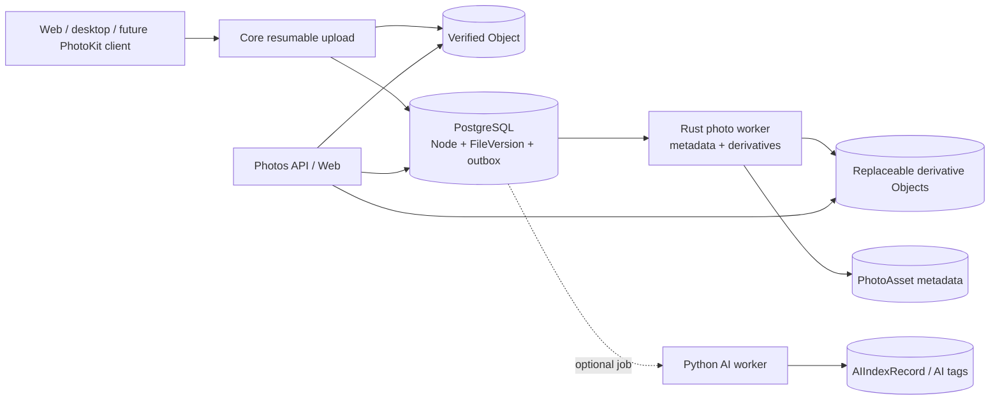

# Kiến trúc Photos

Trạng thái: **Blueprint subsystem PLANNED**

Synveil Photos là media projection có thể thay thế trên canonical file. Đây
không phải storage silo độc lập và tài liệu này không tuyên bố implementation
tồn tại. Original dùng cùng hợp đồng upload, integrity, version, authorization,
retention và object-store như mọi file khác.

Field entity chuẩn được xác định trong [DOMAIN_MODEL.md](DOMAIN_MODEL.md); API
shape được dự kiến trong [API_ARCHITECTURE.md](API_ARCHITECTURE.md). Hành vi
storage, sync và backup vẫn chịu sự điều chỉnh của [STORAGE.md](STORAGE.md),
[SYNC.md](SYNC.md) và [BACKUP.md](BACKUP.md).

Photos client projection tuân theo platform contract: Windows, macOS, Linux
Desktop và Linux Server là host boundary first-class nơi client hoặc import
workflow liên quan được hỗ trợ; Android, iPhone và iPad vẫn là mobile target
tương lai với capability negotiation tường minh cho background transfer và
photo library. Không behavior mobile hoặc OS-specific nào thay đổi canonical
server storage model.

## Phạm vi và trạng thái

Các hạng mục sau là `PLANNED`:

- bảo toàn original image và video;
- automatic import từ client được hỗ trợ;
- asynchronous metadata extraction cùng thumbnail/preview an toàn;
- timeline, album, favorite, filter screenshot và video;
- resource được nhóm kiểu Live Photo;
- suggestion exact duplicate;
- deterministic metadata search và optional AI-enriched search;
- trạng thái source-device/import và backup; và
- integration PhotoKit/background-transfer tương lai.

Các hạng mục sau là `EXPERIMENTAL` đến khi qua gate privacy và quality riêng:

- nhóm perceptual near-duplicate;
- image caption và semantic similarity;
- face detection hoặc recognition;
- phân loại object/scene ngoài deterministic media metadata; và
- transcoded playback variant ngoài bounded preview.

Face recognition mặc định bị tắt và không bắt buộc cho sản phẩm Photos dự kiến.
Synveil không phải nền tảng media streaming/transcoding đầy đủ.

## Invariant không thể thương lượng

1. Original là `Object` bất biến đã verify được tham chiếu qua
   `Node → FileVersion`. Photo processor không bao giờ rewrite, strip metadata,
   re-encode hoặc thay thế original đó.
2. `PhotoAsset` và mọi derivative là projection có thể rebuild. Failure hoặc
   loss của chúng không thể làm original unavailable.
3. Photo import thành công nghĩa là original resource version đã commit, không
   có nghĩa metadata, thumbnail, AI tag hay album suggestion đã hoàn tất.
4. Mỗi derivative read reauthorize dựa trên current original/resource
   relationship. Derivative object ID, cached URL, album membership hay device
   import ID không phải authorization.
5. Exact byte equality chỉ có thể tái sử dụng physical storage trong
   deduplication domain đã chấp thuận. Nó không gộp hai user-visible asset trừ
   khi user rõ ràng chọn logical cleanup.
6. Location, face, caption, OCR và device/capture context là sensitive metadata.
   Chúng kế thừa source access boundary và không bao giờ âm thầm rời server.
7. Deletion semantic rõ ràng. Xóa album membership không xóa asset; backup/
   PhotoKit source bị thiếu không tự động xóa retained server content.
8. Optional Photos work được emit qua transactional PostgreSQL outbox sau khi
   source mutation commit và được idempotent worker xử lý at least once.

## Ranh giới component



Core Rust worker là owner ưu tiên cho deterministic media probing, safe EXIF
extraction và derivative generation. Python dành cho optional OCR/image
understanding/embedding work. Không worker nào nhận database, object-store hoặc
integration credential rộng hơn job yêu cầu.

## Canonical storage model

### Original

Mỗi imported resource có `Node` thông thường và `FileVersion` bất biến.
`PhotoAsset` tham chiếu version xác định một user-visible media asset:

- `PRIMARY_IMAGE` cho still image;
- `PRIMARY_VIDEO` cho ordinary video;
- `MOTION_VIDEO` ghép cặp với still resource;
- `DEPTH` hoặc registered auxiliary role khác chỉ khi được bảo toàn; và
- primary resource xác định display identity và timeline placement.

Association `PhotoResource` bất biến cho một source-version generation. Nếu
logical file nhận current version mới, existing projection thành `STALE` và
version-bound processing generation mới được schedule. Historical projection
chỉ có thể retention khi cần cho version history và không bao giờ được nhầm với
current asset.

Import có thể giữ nhiều logical asset tham chiếu cùng immutable `Object`.
Physical deduplication vô hình đối với album membership, favorite, capture
metadata correction, trash state và audit history.

### Derivative

Một `PhotoDerivative` được key bằng:

```text
source FileVersion ID
+ derivative profile ID/version
+ generator name/version
+ generator configuration version
```

Nó ghi output object, pixel dimension/duration, encoded byte size, media type,
stored checksum, generation state và safe failure class. Profile được enumerate
(ví dụ `GRID_THUMBNAIL` và `SCREEN_PREVIEW`); arbitrary dimension client yêu cầu
không tạo image-resize service không giới hạn.

Derivative object:

- dùng opaque storage key;
- có integrity verification và lifecycle reference độc lập;
- có thể delete/rebuild mà không đổi source;
- không bao giờ làm backup proof cho original;
- không bao giờ copy EXIF/location vào output trừ khi profile yêu cầu và công
  bố rõ; và
- được authorize và audit theo source sensitivity.

Derivative không được hỗ trợ hoặc thất bại trả processing/fallback state rõ
ràng. Client chỉ có thể request original nếu được authorize; client không nhận
corrupt hoặc partially generated byte được label như thumbnail.

## Hợp đồng ingestion

### Import từ web và desktop

1. Client khởi tạo normal resumable upload cho mỗi original resource, khai báo
   total length, SHA-256 tùy chọn, media metadata, destination và base
   precondition.
2. Part stream với bounded memory và checksum được verify riêng.
3. Completion verify bền vững `Object` rồi tạo `Node`/`FileVersion`, library
   `ChangeEvent`, audit record và outbox work theo giao dịch.
4. Client gửi hoặc kèm `photo import binding` định danh source device,
   device-scoped import identity, resource role, capture hint và grouping key.
   Các value này là metadata không đáng tin cậy.
5. Binding transaction tạo hoặc trả một idempotent `PhotoAsset` generation và
   queue processing. Response có thể hiển thị `PENDING`.

MIME type hoặc filename extension giả không bao giờ bypass safe probing.
Invalid media có thể vẫn là canonical file trong khi photo projection thành
`FAILED`.

### Import identity và retry

Source import identity được scope theo owner + device + client-library
generation. Nó không globally unique, không phải hash và không được tin cậy giữa
các device. Server bind idempotency record vào material input hoàn chỉnh: source
identity, role/group và immutable version.

- Cùng identity và cùng version trả asset/binding trước đó.
- Cùng identity với resource revision mới tạo version-bound generation mới sau
  bước client reconciliation rõ ràng.
- Cùng byte dưới identity khác có thể vẫn là logical asset khác.
- Binding response bị mất được recovery qua idempotency key hoặc import status
  query; không bao giờ tạo album membership trùng.
- File đã upload thành công nhưng chưa bind vẫn là valid file và có thể bind
  lại; chúng không bị garbage collect như failed photo import.

### Nhóm kiểu Live Photo

Group là `PhotoAsset` có nhiều `PhotoResource` bền vững độc lập, không phải một
opaque container. Client khai báo device-scoped group identity và role. Server
verify supported association metadata khi có nhưng không giả định mọi provider
dùng representation của Apple.

Group state là:

- `PENDING` khi original upload bắt buộc hoặc association verification còn lại;
- `READY` khi mọi role bắt buộc đã commit và readable;
- `PARTIAL` khi ít nhất một preserved original dùng được nhưng declared role bị
  thiếu/unsupported;
- `FAILED` chỉ khi không tạo được safe primary projection; hoặc
- `STALE` khi current version được tham chiếu đã đổi.

Partial group nhìn thấy được cùng warning trung thực và retry path. Cleanup
không xóa successfully committed still image chỉ vì motion resource thất bại.

## Apple PhotoKit client tương lai

Apple client tương lai là `PLANNED` quanh PhotoKit, URLSession background
transfer, Keychain, Swift Concurrency và platform-provided change observation.
Server contract phải tính đến các giới hạn platform này:

- User có thể grant full, limited hoặc later-revoked photo-library access.
  Client chỉ upload asset PhotoKit hiện cho phép và biểu diễn limited scope rõ
  ràng.
- PhotoKit local identifier được scope theo device/library và có thể invalid sau
  library restoration hoặc OS change. Nó là reconciliation hint, không phải
  permanent server identity.
- App không thể giả định unrestricted filesystem path hay continuous background
  execution. App persist transfer/session mapping trước scheduling và resume
  sau delayed callback, termination, network change hoặc device reboot.
- Background upload completion có thể đến sau khi credential rotate hoặc policy
  pause. Client reauthorize/reconcile trước binding, trong khi byte đã commit
  vẫn có thể recovery qua cùng idempotency identity.
- Original resource được request qua platform API ở quality thích hợp.
  Optimized/local preview không được label sai là original.
- Asset backed bởi iCloud có thể cần OS network retrieval và tạm thời
  unavailable. Synveil báo `SOURCE_UNAVAILABLE` và retry theo policy thay vì coi
  vắng mặt là deletion.
- Edit trong Apple library có thể tạo adjusted resource. Client ghi việc đang
  upload original hay edited rendition; Synveil không âm thầm thay cái này bằng
  cái kia.
- Live-photo still và motion resource upload độc lập và chỉ bind sau khi biết
  cả hai terminal outcome.

PhotoKit observation state tách khỏi Synveil `SyncCursor` và `BackupSnapshot`.
Local PhotoKit deletion có thể là:

- source observation mới theo photo-backup policy, giữ server history;
- explicit Synveil delete do user phát theo two-way policy; hoặc
- bị ignore/exclude theo upload-only policy.

Client không bao giờ được suy ra destructive option từ missing local identifier.

## Metadata extraction

### Provenance

Mỗi extracted field ghi source và confidence category:

- `EMBEDDED`: đọc từ committed media metadata;
- `CONTAINER`: dẫn xuất từ media/container structure;
- `CLIENT_HINT`: do authenticated nhưng untrusted client cung cấp;
- `FILESYSTEM_HINT`: cung cấp từ source file timestamp;
- `USER_CORRECTED`: explicit user override;
- `SYSTEM_RULE` hoặc `AI`: replaceable classification.

User correction được lưu riêng khỏi original EXIF và chỉ thắng trong display
projection. Reprocessing không overwrite correction. Original metadata vẫn có
thể audit/read theo privacy policy.

### Capture time

Projection giữ:

- source local date/time nếu có;
- explicit UTC offset/timezone evidence nếu có;
- derived UTC instant chỉ khi đủ evidence;
- fallback server/client time cùng provenance; và
- user correction với revision.

Server không bao giờ âm thầm giả định timezone của chính nó cho photo có EXIF
thiếu offset. Do đó timeline sort gồm confidence/provenance và stable asset-ID
tie-breaker. Đổi user correction tạo auditable metadata revision và có thể move
asset trong timeline mà không rewrite file.

### Field nhạy cảm

Exact GPS, place label, recognized text, face template/cluster, caption, device
make/model và source application có thể làm lộ thông tin rất nhạy cảm.

- Exact location có view/search/export permission riêng và user-visible
  enablement policy.
- API list view chỉ trả field cần cho view đó; mặc định không gồm raw EXIF blob.
- Log và metric không chứa raw EXIF, coordinate, filename, caption, recognized
  text, thumbnail hoặc local PhotoKit identifier.
- Hành vi shared-photo nêu rõ original metadata có thể download không và có
  sanitized derivative không; không bao giờ tuyên bố strip metadata khỏi
  original có thể download riêng.
- Remote geocoding hoặc AI enrichment bị tắt trừ khi được cấu hình và consent rõ
  theo [AI.md](AI.md).

## Timeline, album, favorite và category

### Timeline

Timeline được keyset-paginate theo selected effective capture instant,
provenance rank khi cần, server commit instant và immutable asset ID. Cursor
bind owner/library, filter, authorization scope và sort generation. Metadata
correction có thể expire old cursor thay vì trộn hai order.

Deterministic filter được hỗ trợ dự kiến gồm image, video, favorite, screenshot,
source device, album, capture-time interval và processing state. Mỗi result
expose source/derivative readiness và capture time là exact, inferred hay
user-corrected.

### Album

- Manual album chứa ordered membership record; chúng không sở hữu asset.
- Add hoặc remove member là idempotent và tăng album revision.
- Delete album chỉ xóa album và membership.
- Album cover selection tham chiếu authorized asset/derivative và fallback an
  toàn nếu asset bị trash hoặc permission đổi.
- Shared/smart album là future contract addition, không được ngụ ý bởi manual
  album schema.

### Favorite và screenshot

Favorite là user-authored metadata trên asset và dùng conditional mutation.
Screenshot classification ban đầu dùng explicit client/platform hint cộng
bounded deterministic evidence, luôn kèm provenance. AI classifier có thể đề
xuất value sau nhưng không thể overwrite user correction.

## Hành vi duplicate

### Exact duplicate — `PLANNED`

Exact duplicate suggestion cần canonical length và SHA-256 do server verify
trong cùng owner/dedup domain. Chúng có thể định danh:

- hai asset có original byte giống hệt;
- resource đã được physical reuse; hoặc
- upload mới vẫn biểu diễn một device/library occurrence riêng.

API không expose count, owner, timing hoặc existence của match trong dedup
domain khác. User có thể chọn giữ cả hai, consolidate album reference, trash
logical asset đã chọn hoặc cancel uncommitted import. Synveil không bao giờ
auto-delete original chỉ vì hash khớp.

### Perceptual duplicate — `EXPERIMENTAL`

Near-duplicate grouping chỉ mang tính advisory. Nó ghi algorithm/model/
configuration, score, compared source version và review decision. False
positive được dự kiến; result không thể trigger physical deduplication, version
merge, trash hay retention change. Generated fingerprint kế thừa source
authorization và là removable derived data.

## Search và tagging

Photo search có các layer độc lập:

| Layer | Trạng thái | Source |
|---|---|---|
| Metadata | `PLANNED` | filename, media kind, safe EXIF projection, date, device, album, favorite, user tag |
| OCR/full text | `PLANNED` tùy chọn | version-bound extracted text |
| Semantic OCR/text | `PLANNED` tùy chọn | embedding trên chunk OCR/text gắn version đã authorize |
| Semantic vision/image | `EXPERIMENTAL` | caption và vision/image embedding theo AI mode và consent |
| Face | `EXPERIMENTAL` mặc định tắt | local derived data có consent riêng |

Result định danh layer, source version, freshness và reason/provenance. Search
authorization join current source access lúc query. Xóa share, trash/purge
source, disable AI mode hoặc đổi source version invalidate derived result cùng
observable deletion/reindex lag.

Tag giữ provenance `USER`, `SYSTEM` và `AI`. Reindexing có thể thay thế AI
assignment generation của chính nó nhưng không thể sửa user tag hoặc accepted
user decision.

## Sync, backup, trash và retention

- Photo original trong `Library` theo normal `Node` change event, conflict copy,
  trash, version và purge rule.
- Đổi album/favorite/user-metadata cần versioned event riêng nếu future client
  sync chúng. Không thể giấu chúng trong file content timestamp.
- Hai device upload byte bằng nhau có thể tạo separate asset trong khi object
  reuse vẫn là nội bộ.
- Conflicting replacement giữ cả hai incoming original version qua deterministic
  sync conflict-copy contract.
- Photo automatic upload cấu hình làm backup tạo/cập nhật backup manifest; sự
  biến mất khỏi device không lan truyền live deletion.
- Trash retention và backup snapshot retention độc lập. Purge Drive node không
  collect byte của nó khi retained backup snapshot, historical version, grouped
  resource hoặc required derivative source reference vẫn còn.
- Restore mặc định tới non-destructive target, verify original hash, reconstruct
  group relationship khi manifest có và báo unsupported auxiliary resource thay
  vì âm thầm bỏ.

Derived thumbnail bị loại khỏi backup với tư cách canonical user data vì có thể
rebuild. User-authored album, correction, favorite và tag assignment là
metadata mà recovery plan của deployment Synveil phải bảo toàn.

## Processing lifecycle

Sequence thông thường là:

```text
original resource commit
  -> outbox photo.resource_committed
  -> safe probe and metadata extraction
  -> PhotoAsset generation update
  -> bounded derivative profiles
  -> optional OCR / image AI jobs
  -> READY or PARTIAL with freshness
```

Worker claim durable job bằng lease, chạy expensive parsing bên ngoài claim
transaction và complete có điều kiện theo lease generation và source version.
Stable job identity gồm source version + pipeline/profile + configuration
version.

- Duplicate delivery trả/thay cùng generation.
- Worker crash release lease và retry với bounded exponential backoff cùng
  jitter.
- Poison file đạt visible terminal/dead-letter state và không spin hoặc block
  asset khác.
- Model/generator upgrade tạo generation mới; reader có thể dùng old verified
  derivative đến khi cái mới hoàn tất rồi switch theo giao dịch.
- Source deletion/revocation schedule derived cleanup. Query-time authorization
  bảo vệ lag window.

## Security và resource limit

Media là hostile input kể cả khi được authenticated user upload.

- Probe magic byte và structure; không tin MIME, extension, dimension, duration,
  frame count, metadata length, archive entry hay codec declaration.
- Parse và render trong sandboxed/least-privilege process với giới hạn CPU,
  memory, wall time, temporary disk, decoded pixel, frame count, recursion,
  metadata size và output byte.
- Ngăn decompression/pixel bomb bằng cách check dimension và decoded work trước
  allocation và trong streaming.
- Không follow embedded URL, external entity, filesystem reference, symlink,
  playlist, sidecar path hay network resource.
- Dùng allow-list output encoder/media type; tạo opaque temporary name và
  finalize verified output nguyên tử.
- Coi EXIF/ICC/XMP string là untrusted display content. Strip active hoặc
  irrelevant metadata khỏi derivative và escape value trong web UI.
- Video probing/transcoding, nếu bật, chạy cùng isolation và không thể spawn
  arbitrary protocol hoặc device.
- Giới hạn import và processing concurrency theo user, device, worker và
  deployment capacity. Backpressure để job queued thay vì làm cạn core API
  resource.
- Ghi safe parser/generator version để vulnerable generation có thể invalidate
  và rebuild.

## Hợp đồng lỗi

| Lỗi | Hành vi bắt buộc |
|---|---|
| Original upload fail checksum hoặc disk đầy | Không expose thành công `FileVersion` hoặc `PhotoAsset`; resumable state báo safe retry/abort path. |
| Original commit nhưng photo-binding response bị mất | Cùng idempotency key trả existing binding; original vẫn là valid file ngay cả khi phải retry binding. |
| Outbox consumer offline | Original vẫn download/sync/backup được; asset báo `PENDING` hoặc `STALE` và lag quan sát được. |
| Parser crash, timeout hoặc vượt bound | Job retry trong policy rồi thành safe terminal failure; original không bị quarantine chỉ vì optional parsing fail. |
| Parser chứng minh declared media malformed | Canonical file vẫn dùng được theo file policy; photo projection thành `FAILED` với safe reason. |
| Derivative byte write nhưng metadata commit fail | Byte không được tham chiếu dưới lease/grace và được reconcile; không publish derivative URL. |
| Metadata commit nhưng response bị mất | Source/profile generation identity của job trả committed derivative; không duplicate visible generation. |
| Một live-photo role fail | Asset là `PARTIAL` khi safe primary còn lại; successful original resource được giữ. |
| Tìm thấy exact duplicate | Trả owner-scoped suggestion sau full verification; không bỏ authorization/accounting hoặc auto-delete. |
| Local PhotoKit identifier biến mất | Ghi source unavailability/observation theo policy; không bao giờ suy ra live deletion hoặc retained-backup deletion. |
| Access bị revoke khi index/thumbnail tồn tại | Query/download mới fail current authorization ngay; cleanup chạy bất đồng bộ và quan sát được. |
| Tìm thấy object corruption trong photo read | Abort/fail an toàn, quarantine replica, tìm verified copy/backup khác; không bao giờ thay thumbnail cho original restore. |

## Observability

Metric dự kiến gồm queue age, per-pipeline attempt/terminal count, processing
time và resource-class bucket, derivative byte, parser timeout/bound violation,
stale asset count và corruption incident. Label không bao giờ chứa filename,
hash, coordinate, device identifier, album name, caption hoặc user-provided
metadata.

Structured log gồm job ID, pseudonymous source/version reference,
pipeline/profile generation, safe error class, duration và request/trace
correlation. Chúng loại original, derivative, EXIF, OCR, embedding, secret và raw
parser output.

Photo health là derived-service status riêng. Thumbnail lag không đánh dấu core
storage unready.

## Verification gate

Trước khi bất kỳ Photos capability nào thành `IMPLEMENTED`, test phải bao phủ:

- download original byte-identical sau import và sau metadata extraction;
- large streaming import, interruption, resume, duplicate completion, disk
  full, quota race, object-write/DB-failure và lost response;
- idempotent import binding và device source-ID reuse/change;
- malicious dimension, metadata bomb, corrupt container, parser crash, giới hạn
  time/memory/disk và forbidden external reference;
- derivative profile determinism/integrity, stale generation replacement và
  orphan cleanup;
- capture time có/không UTC offset, daylight-saving ambiguity, user correction
  và stable keyset pagination;
- full/limited/revoked PhotoKit access, iCloud source unavailable, app
  termination, delayed background callback, rotated credential và retry độc lập
  live-photo resource;
- exact duplicate privacy xuyên dedup domain và perceptual false-positive
  non-destruction;
- album deletion không xóa asset, favorite/tag concurrency, trash,
  backup-source deletion, retention, group restore và corrupt-object restore;
- share revocation và source purge khi derivative/index cleanup bị delay; và
- AI disabled, local worker unavailable, remote consent revoked, reindex và
  non-AI search fallback.

Benchmark methodology ghi image dimension/codec, input/output byte, worker
memory và CPU, concurrent job, storage backend, cache state và parser/generator
version. Nó đặt regression budget từ measured baseline, không dùng marketing
number.

## Open decision hữu hạn

OPEN DECISION OD-PHOTO-001: ma trận derivative profile ban đầu
Owner: Photos / Web / Storage / Performance
Needed by: Gate derivative OpenAPI và storage-format Phase 8
Options: chỉ JPEG thumbnail; WebP preview cộng JPEG compatibility; profile AVIF/WebP/JPEG được negotiate
Recommendation: bắt đầu bằng tập nhỏ immutable thumbnail/preview profile có khả năng decode rộng và giữ explicit profile versioning; chỉ chọn encoder sau benchmark client và resource
Decision evidence: ma trận tương thích browser/Apple/desktop, visual-quality fixture, benchmark CPU/memory và migration/rebuild test

OPEN DECISION OD-PHOTO-002: thứ tự fallback capture-time
Owner: Photos / Clients / Product
Needed by: Gate timeline contract Phase 8
Options: embedded offset-aware time rồi local unknown-offset time rồi client file time; chỉ import time khi offset vắng mặt; yêu cầu user confirmation cho unknown-offset media
Recommendation: giữ mọi source value và provenance, ưu tiên offset-aware embedded time, giữ unknown-offset local time mà không tự tạo UTC, rồi dùng client file time và server import time làm labeled fallback
Decision evidence: corpus fixture EXIF/video thực, timezone/DST test, hành vi Apple export và timeline UX review

OPEN DECISION OD-PHOTO-003: default location visibility
Owner: Privacy / Photos / Sharing / Product
Needed by: Gate photo metadata và sharing Phase 8
Options: extract và mặc định hiển thị cho owner; extract nhưng ẩn đến khi enable; không extract đến khi opt-in
Recommendation: extract cục bộ vào field được bảo vệ riêng nhưng ẩn khỏi ordinary list/share response đến khi owner enable location view rõ ràng; không bao giờ gửi remote mặc định
Decision evidence: privacy threat review, sharing/export UX test, deletion test và operator backup disclosure

OPEN DECISION OD-PHOTO-004: compatibility role live-photo
Owner: Photos / Apple Client / Storage
Needed by: Protocol freeze PhotoKit Phase 9
Options: chỉ giữ still và motion; giữ mọi auxiliary resource nhận biết được; lưu opaque platform export cộng normalized core role
Recommendation: normalize required still/motion role trong khi giữ supported auxiliary original làm explicit versioned role; không bao giờ cần Apple-only metadata cho ordinary image/video asset
Decision evidence: corpus PhotoKit export/import, restore round-trip đến Apple client, hành vi non-Apple client và partial-group recovery test

OPEN DECISION OD-PHOTO-005: UX policy xóa photo source
Owner: Backup / Sync / Photos / Apple Client / Product
Needed by: `SV-G8-PHOTOS-SAFE`, trước promotion Phase 8
Options: backup-only observation; explicit two-way photo sync; per-album/source mode cố định lúc enrollment
Recommendation: mặc định automatic Photos upload dùng backup semantic; biến mọi two-way deletion propagation thành opt-in có tên riêng cùng confirmation và retained recovery window
Decision evidence: nghiên cứu user về device loss/deletion, test giới hạn PhotoKit, sync threat analysis và end-to-end restore drill
