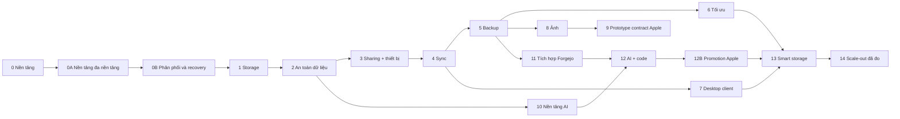

# Lộ trình triển khai Synveil

Trạng thái: **Blueprint thực thi PLANNED**

Lộ trình này sắp xếp trình tự phát triển Synveil từ một repository trống thành
một nền tảng dữ liệu self-hosted đáng tin cậy. Đây là kế hoạch dependency,
không phải tuyên bố về tính năng hay cam kết lịch trình. Một phase chỉ hoàn tất
khi các gate bằng chứng bên dưới đều đạt; riêng code, một migration hay một UI
shell không bao giờ đổi trạng thái một khả năng thành `IMPLEMENTED`.

Lộ trình này phụ thuộc vào các ADR đã chấp thuận, đặc tả protocol/domain và thứ
tự thẩm quyền trong
[CONTRIBUTING_ARCHITECTURE.md](CONTRIBUTING_ARCHITECTURE.md). Quyền sở hữu task
chi tiết và các work package theo từng phase nằm trong [TEAM_PLAN.md](TEAM_PLAN.md).

## Nguyên tắc bàn giao

1. Tính đúng đắn của storage, upload, version, sync, backup và restore tạo thành
   critical path. Enrichment tùy chọn không được làm suy yếu con đường này.
2. Synveil dễ mặc định, an toàn mặc định, được thiết kế đa nền tảng và vẫn mạnh
   khi cần. Personal / Home và Advanced / Server Mode dùng chung protocol, API,
   data model và correctness boundary.
3. Các bản phát hành sớm và trung hạn vẫn là Rust modular monolith: một tiến
   trình API, một tiến trình Rust worker, PostgreSQL, một `ObjectStore`, một
   React web client tĩnh và Python AI tùy chọn. Platform service là adapter,
   không phải khái niệm domain.
4. PostgreSQL jobs/outbox là cơ chế công việc bền vững ban đầu. Broker, Redis,
   Kubernetes và network microservice đòi hỏi nhu cầu đã được đo lường cùng một
   ADR mới.
5. Public contract được đóng băng trước khi bắt đầu triển khai độc lập. Protocol
   fixture và adversarial test được viết cùng hoặc trước code.
6. Mọi tính năng phá hủy dữ liệu hoặc thay đổi format trước hết phải chứng minh
   hành vi restore, retry/idempotency, crash recovery và upgrade.
7. Một phase có thể nghiên cứu công việc về sau, nhưng không được công bố stored
   contract hay public contract của phase sau trước prerequisite gate của nó.
8. Tài liệu cốt lõi tiếng Anh và tiếng Việt phải mang cùng ý nghĩa kỹ thuật trước
   khi promote một bản phát hành.

## Mô hình gate

Mỗi lần kết thúc phase đều ghi lại bằng chứng theo các chiều sau:

| Gate | Bằng chứng bắt buộc |
|---|---|
| `A` Architecture | ADR/spec đã chấp thuận, OpenAPI delta đã review, các bất biến domain và không có `OPEN DECISION` đang chặn. |
| `C` Correctness | Unit/integration/conformance test, hành vi retry, fault injection và bằng chứng recovery cho phase. |
| `S` Security | Delta của threat model, ma trận authorization, giới hạn abuse/resource, xử lý secret, hành vi audit và không có phát hiện critical chưa được chấp nhận. |
| `P` Performance | Phương pháp benchmark có thể tái lập, profile phần cứng/dữ liệu được công bố, memory/concurrency có giới hạn và regression budget đã chấp thuận. Không bịa đặt con số marketing. |
| `O` Operations | Deployment/configuration, health, metrics, logs, backup/restore, migration và hành vi incident đã được ghi tài liệu và diễn tập. |
| `D` Documentation | Tài liệu trạng thái API/spec/operator/user chính xác và ý nghĩa tiếng Anh/tiếng Việt thống nhất. |
| `N` Next phase | Integrated suite xanh; không còn defect mức độ nghiêm trọng cao về mất dữ liệu, authorization hay upgrade; prerequisite downstream đã được nêu tên. |

Ngoại lệ đòi hỏi một owner, văn bản chấp nhận rủi ro, thời hạn hết hiệu lực và
phạm vi phát hành không thể làm người dùng tiếp xúc với bảo đảm còn thiếu. Không
thể miễn trừ defect về mất dữ liệu và authorization để đưa vào stable release.

Promotion token chính xác của master plan là các gate `SYNVEIL_*` và
`SECURITY_REVIEW_PASS` được liệt kê trong [TEAM_PLAN.md](TEAM_PLAN.md). Các nhãn
`SV-G*` trong phần phase chi tiết bên dưới được giữ lại như tham chiếu nội bộ
cho evidence bundle của roadmap mở rộng; chúng không phải promotion gate thay
thế và không bao giờ được report thay cho token master chính xác.

## Xương sống dependency

Số phase biểu thị thứ tự promote sản phẩm mặc định. Sau các gate data-safety
cốt lõi, công việc đặc tả hoặc prototype có giới hạn có thể chạy song song ở
những nơi sơ đồ có các cạnh độc lập. Stable release train vẫn chỉ promote một
tập hợp đã tích hợp và có thể hỗ trợ được.

## Tổng quan phase

| Phase | Kết quả | Entry gate | Tham chiếu evidence mở rộng / canonical gate |
|---|---|---|---|
| 0 | Repository, contract, CI và runtime skeleton chưa có tính năng | Blueprint được phê duyệt | `SV-G0-FOUNDATION` sau các subgate đa nền tảng |
| 0A | Nền tảng product, platform-runtime và storage-capability đa nền tảng | `SYNVEIL_CONTRACTS_READY` | `SYNVEIL_CROSS_PLATFORM_FOUNDATION_READY` |
| 0B | Nền tảng distribution native/guided, database managed, update, uninstall, migration và recovery | `SYNVEIL_CROSS_PLATFORM_FOUNDATION_READY` | `SYNVEIL_FOUNDATION_READY` |
| 1 | Storage logic đã xác thực và streaming I/O | `SYNVEIL_FOUNDATION_READY` | `SV-G1-STORAGE` |
| 2 | Upload có thể tiếp tục, toàn vẹn, version, trash, đối soát | `SV-G1-STORAGE` | `SV-G2-DATA-SAFETY` |
| 3 | Share có thể thu hồi và identity thiết bị | `SV-G2-DATA-SAFETY` | `SV-G3-TRUSTED-ACCESS` |
| 4 | Protocol sync đa thiết bị có thứ tự, an toàn khi retry | `SV-G3-TRUSTED-ACCESS` | `SV-G4-SYNC-CONFORMANT` |
| 5 | Snapshot backup, retention và restore đã verify | `SV-G4-SYNC-CONFORMANT` | `SV-G5-RESTORABLE` |
| 6 | Nén an toàn, whole-object dedup, accounting, GC | `SV-G5-RESTORABLE` | `SV-G6-OPTIMIZED-SAFELY` |
| 7 | Desktop/reference client đa nền tảng đầu tiên | `SV-G4-SYNC-CONFORMANT` | `SV-G7-DESKTOP-REFERENCE` |
| 8 | Thư viện ảnh và derivative bảo toàn original | `SV-G5-RESTORABLE` | `SV-G8-PHOTOS-SAFE` |
| 9 | Evidence prototype contract Apple | `SV-G7-DESKTOP-REFERENCE`, `SV-G8-PHOTOS-SAFE` | Internal `SV-G9-APPLE-CONTRACT-PROTOTYPE`; không phải final promotion |
| 10 | Nền tảng AI/OCR/semantic-index riêng tư tùy chọn | `SV-G2-DATA-SAFETY` và durable jobs | `SV-G10-AI-OPTIONAL` |
| 11 | Inventory, liên kết project, backup/restore Forgejo | `SV-G5-RESTORABLE` | `SV-G11-FORGEJO-RESTORABLE` |
| 12 | Repository intelligence đúng theo ACL | `SV-G10-AI-OPTIONAL`, `SV-G11-FORGEJO-RESTORABLE` | `SV-G12-CODE-INTELLIGENCE` |
| 12B | Promotion Apple client cuối theo master sequence | `SYNVEIL_DESKTOP_SYNC_READY`, `SYNVEIL_PHOTOS_FOUNDATION_READY`, `SYNVEIL_CODE_INTEGRATION_READY`, `SYNVEIL_CLIENT_CONTRACT_READY` | `SYNVEIL_APPLE_CLIENT_READY` |
| 13 | File theo nhu cầu, tiering xác định, bảo vệ khỏi bất thường | `SV-G6-OPTIMIZED-SAFELY`, `SYNVEIL_APPLE_CLIENT_READY`, bằng chứng client | `SV-G13-SMART-STORAGE` |
| 14 | Tiến hóa ngang/phân tán có căn cứ | Nút thắt đã đo và ADR được chấp thuận | `SV-G14-SCALE-PROVEN` |

## Phase 0 — Nền tảng repository và kiến trúc

**Mục tiêu.** Tạo một nền tảng monorepo thực thi được nhưng chưa có tính năng,
có khả năng cưỡng chế các contract đã chấp thuận.

**Phạm vi.** Thiết lập Rust workspace và composition root cho API/worker,
workspace React/TypeScript/Vite, quy ước OpenAPI đã review, migration runner,
PostgreSQL/job skeleton, interface `ObjectStore` cục bộ, validation cấu hình,
topology Docker Compose/Caddy cho Advanced / Server, CI, inventory dependency/
license và quy trình tài liệu song ngữ. Giải quyết các quyết định về tên
portable, local durability, platform-runtime, storage-capability, installation
và recovery trước khi hành vi schema hoặc adapter thoát ra ngoài.

### Phase 0A — Nền tảng đa nền tảng và ranh giới complexity

**Mục tiêu.** Đóng băng product-facing contract giúp Synveil dễ tiếp cận với
người không chuyên mà vẫn giữ được self-hosted path cho người có kinh nghiệm.

**Phạm vi.** Ghép [PLATFORM.md](PLATFORM.md) với product, architecture,
storage, domain, security, deployment và client specification. Đóng băng phân
biệt Personal / Home với Advanced / Server Mode; target first-class Windows,
macOS, Linux Desktop và Linux Server; hướng Android/iPhone/iPad tương lai;
`PlatformRuntime`/service-lifecycle port; boundary
`StorageBackend → StorageCapabilities`; chọn storage theo capability; pairing
ngắn hạn; remote access theo lớp và self-hosted-first; user/admin/developer
diagnostics; progressive-disclosure/terminology. Không API service manager cụ
thể nào được thuộc domain core.

**Bằng chứng.** Parity Anh/Việt, ADR-017/018/022 đã chấp thuận, fixture
capability matrix cho filesystem family được hỗ trợ, error-to-user-action
mapping, pairing threat case và review xác nhận hai mode dùng chung API/data
model. Gate này không tuyên bố native installer hay client đã tồn tại.

**Gate.** Chỉ ghi nhận `SYNVEIL_CROSS_PLATFORM_FOUNDATION_READY` sau khi
contract owner và reviewer độc lập chấp thuận artifact, đồng thời không còn
decision chưa giải quyết khiến implementation sau phải chọn core boundary khác.

### Phase 0B — Nền tảng distribution, database managed và recovery

**Mục tiêu.** Định nghĩa đường đi vận hành từ installation tới maintenance an
toàn cho user thông thường và operator.

**Phạm vi.** Đặc tả native/guided install preflight, OS service adapter,
PostgreSQL lifecycle do Synveil quản lý, storage picker và migration semantic,
verify signed release/update, health translation, uninstall/reinstall bảo toàn
data, machine migration, recovery workflow và release-lab matrix. Compose vẫn
là topology tham chiếu của Advanced / Server, không phải onboarding duy nhất.
Giữ các lựa chọn packaging mở theo ADR-019 và decision `OD-PLAT-*` cho tới khi
có bằng chứng đóng.

**Bằng chứng.** Installer/service/update/uninstall/migration threat và failure
fixture; scenario clean-host, reboot/crash/sleep; ghi chú backup/restore và
ownership của PostgreSQL managed; support matrix Windows/macOS/Linux; release
checklist tách application removal khỏi data deletion.

**Gate.** Bằng chứng đóng góp cho `SYNVEIL_FOUNDATION_READY`; không profile
platform nào được gọi là supported trước khi native/guided install và recovery
lab của nó đạt.

**Bằng chứng promote.** Clean checkout build và test được; runtime chưa có
feature đạt trạng thái ready có giới hạn trong developer profile và Advanced /
Server Compose profile; migration có checksum và được serialize; image/log
không chứa secret; có liveness/readiness/structured logging; API error và
serialization UUIDv7 có contract test; CI chạy Rust formatting/lint/test, kiểm
tra TypeScript nghiêm ngặt, link tài liệu, secret scanning, dependency review và
migration check. Không có tuyên bố storage hoạt động hay native installer đã
được hỗ trợ.

**Gate.** Chỉ promote lên `SV-G0-FOUNDATION` sau khi có bằng chứng
`A/C/S/P/O/D/N` và đã ghi nhận các subgate đa nền tảng. Gate ghi nhận MIT đang có
hiệu lực và giao owner/deadline cho bất kỳ lần tách license tương lai nào; nó
không âm thầm thi hành hoặc yêu cầu relicensing trước trigger về external
contribution/bản phát hành dùng license khác.

## Phase 1 — Nền tảng storage

**Mục tiêu.** Cung cấp metadata user/library/file đã xác thực cùng upload
streaming có giới hạn và range download qua adapter filesystem cục bộ production.

**Phạm vi.** Bootstrap administrator một lần, user, credential Argon2id, browser
session mờ đục được hash, phòng vệ CSRF, authorization tập trung, `Library`,
`Node` directory/file, `FileVersion`/`Object` bất biến, list/move/rename metadata,
upload cơ bản, streaming/range download, quota và web file manager tối thiểu.
Profile đặt tên portable và profile durability storage trở thành contract đóng
băng. Representation precondition recursive-subtree của OD-SYNC-004 cũng đóng
băng tại đây để Trash Phase 2 không tự phát minh schema hay wire token trước
protocol sync rộng hơn ở Phase 4.

**Bằng chứng promote.** Object key không bao giờ dẫn xuất từ tên; các test
symlink/path traversal, IDOR, SQL injection, CSRF, XSS qua filename, request quá
lớn, disk-full và backend bị thiếu đều đạt. Memory API/worker có giới hạn độc
lập với kích thước file. Response success hàm ý object bền vững đã verify cùng
transaction metadata/journal/audit/outbox đã commit. Adapter conformance cục bộ
và một recovery drill nhỏ đều đạt.

**Gate.** `SV-G1-STORAGE` yêu cầu không có mutation path chưa review nào đi vòng
qua authorization, idempotency hay canonical object commit boundary, đồng thời
ghi representation schema/API OD-SYNC-004 đã được chấp thuận trước khi dispatch
Trash recursive.

## Phase 2 — Upload đáng tin cậy và an toàn dữ liệu

**Mục tiêu.** Làm cho operation content bị gián đoạn và lặp lại có thể recovery
mà không tạo dữ liệu hiển thị bị trùng hoặc hỏng.

**Phạm vi.** Trạng thái/part resumable upload được lưu bền vững, checksum SHA-256
và representation, completion được serialize, replay kết quả idempotency,
staging expiry, đối soát orphan, scan/quarantine toàn vẹn, lịch sử version bất
biến, retention trash/restore/purge, storage accounting và mark-and-sweep GC có
lease cùng grace period.

**Bằng chứng promote.** Crash matrix bao phủ mọi boundary giữa ghi part, promote
object, commit database, gửi response, claim outbox và cleanup. Completion trùng
và replay khi mất success trả về đúng một kết quả. Object được ghi trước một
transaction thất bại vẫn không thể truy cập và cuối cùng được đối soát. Chế độ
GC dry-run và live chứng minh mọi lớp reference được bảo vệ; retention và
restore bảo toàn hash. Checksum mismatch không bao giờ phục vụ byte như hợp lệ.

**Gate.** `SV-G2-DATA-SAFETY` đòi hỏi invariant auditor có thể lặp lại cùng một
restore drill từ version/trash, không chỉ happy path của upload.

## Phase 3 — Nền tảng sharing và thiết bị

**Mục tiêu.** Thêm delegated access có thể thu hồi và credential thiết bị có
thể quản lý độc lập mà không làm yếu authorization object.

**Phạm vi.** Share riêng tư cho user, public link capability, expiry/password,
policy read/write, revoke nguyên tử, audit/activity, đăng ký thiết bị,
credential có scope/được hash, rotation/revocation, pause policy, khai báo
capability/version và kiểm soát rate/abuse.

**Bằng chứng promote.** Ma trận authorization principal/resource/action có cả
test dương và âm. Public token có entropy cao và khi lưu chỉ giữ hash; password
dùng verifier đã review; link có giới hạn request/byte/concurrency. Revoke thiết
bị vô hiệu hóa lần dùng tương lai trong giới hạn được ghi tài liệu và không bao
giờ tuyên bố xóa được một hệ điều hành. Giới hạn cache/download của share được
ghi tài liệu trung thực.

**Gate.** `SV-G3-TRUSTED-ACCESS` đòi hỏi test adversarial về IDOR chéo user,
token đã revoke, replay khi rotate credential, brute-force share và quyền đệ quy.

## Phase 4 — Protocol sync

**Mục tiêu.** Công bố một protocol sync tham chiếu, xác định, offline-safe trước
khi phát hành native client đầy đủ.

**Phạm vi.** Transactional journal clock theo `Library`, cursor mờ đục đã xác
thực và có version, page thay đổi, initial snapshot/rebaseline, client mutation
ID, base revision/ETag, tombstone, ngữ nghĩa rename/move/delete/restore, bảo toàn
conflict xác định, retention, device checkpoint, protocol fixture và headless
reference client/simulator.

**Bằng chứng promote.** Conformance suite bao phủ page trùng, client apply nguyên
tử, write trong lúc phân trang, cursor stale/sai, epoch cũ, chỉnh sửa offline/
offline, race edit/delete, cycle directory, collision tên, clock skew, retry sau
khi mất response, backlog, revocation, crash và disk failure. Không content path
đồng thời thành công nào âm thầm loại bỏ byte. Retention cursor có giá trị vận
hành được giám sát và có đường rescan có thẩm quyền.

**Gate.** `SV-G4-SYNC-CONFORMANT` đòi hỏi ma trận sync chi tiết bất thường trong
[TESTING.md](TESTING.md) đạt trên API và reference client, với format fixture
được đóng băng và có version.

## Phase 5 — Backup và restore

**Mục tiêu.** Bảo vệ trạng thái thiết bị lịch sử bằng ngữ nghĩa không thể bị nhầm
với sync lan truyền việc xóa.

**Phạm vi.** `BackupSet` có scope theo thiết bị, manifest snapshot `BUILDING` và
được commit nguyên tử thành `COMMITTED`, entry và consistency label, tái sử dụng
object không đổi, retention, hold, backup health, restore plan có thể tiếp tục,
restore file/folder/snapshot và recovery sau khi mất thiết bị nguồn.

**Bằng chứng promote.** Xóa hoặc bỏ sót ở nguồn không bao giờ xóa lịch sử còn
được giữ lại; partial snapshot không bao giờ restore được; retention không thể
giải phóng object còn được tham chiếu bởi bất kỳ snapshot nào còn lại; file thay
đổi trong lúc scan nhận consistency label trung thực; restore mặc định tới đích
không phá hủy và verify tư cách thành viên manifest, byte length cùng SHA-256.
Drill về quota, gián đoạn, corruption, backup lặp lại, thiết bị bị loại và
disaster-recovery hoàn chỉnh đều đạt.

**Gate.** `SV-G5-RESTORABLE` đòi hỏi một restore drill độc lập trên đích sạch.
Một backup chưa từng được restore không phải bằng chứng phát hành.

## Phase 6 — Tối ưu storage

**Mục tiêu.** Giảm storage vật lý mà không thay đổi byte chuẩn, authorization,
retention hay khả năng recovery.

**Phạm vi.** Policy Zstandard đã đo, checksum plaintext so với stored, chiến
lược decode/range trong suốt, whole-object dedup bên trong một dedup domain,
accounting logical/retained/physical, hardening GC và background re-encoding
hoặc migration replica với copy-and-switch đã verify.

**Bằng chứng promote.** Round trip giống hệt từng byte cho cả format đủ và không
đủ điều kiện; input nén/encrypt/đã nén có giới hạn; header độc hại/decompression
bomb thất bại an toàn; dedup chỉ tin server verification; không thể suy ra tính
bằng nhau chéo owner qua API, timing hay quota; reader representation cũ vẫn
được hỗ trợ trong migration; dữ liệu hiệu năng chứng minh lợi ích cho mỗi policy
được bật.

**Gate.** `SV-G6-OPTIMIZED-SAFELY` đòi hỏi feature flag tối ưu cùng đường disable/
rollback-to-existing-representation an toàn. Chunk-level dedup nâng cao
`PLANNED` vẫn ở sau ADR được chấp thuận cùng gate đo lường riêng về sau; nó
không thể chặn phase này.

## Phase 7 — Desktop reference client

**Mục tiêu.** Chứng minh protocol server trước hành vi filesystem Windows,
macOS, Linux Desktop và Linux Server thực tế bằng sync và backup folder được
chọn, sau khi platform/distribution boundary đã đóng băng.

**Phạm vi.** Rust sync state machine có thể tái sử dụng ở nơi hợp lý, adapter
filesystem từng nền tảng, local state bền vững, onboarding/đăng ký thiết bị,
policy selected-folder, offline queue, UI/status conflict, kiểm soát băng thông,
chiến lược đóng gói/update và recovery hướng người dùng. Platform shell giữ lại
hành vi native của credential, placeholder, watcher, service và UI. Android,
iPhone và iPad là client tương lai với evidence theo capability, không phải
prerequisite của desktop gate.

**Bằng chứng promote.** Test về name/case/Unicode đa nền tảng, atomic replace,
policy permission/symlink, mất sự kiện watcher, clock skew, file bị khóa, sparse
file, reboot, local database corruption, stale cursor và low-disk đều đạt. Có thể
revoke một thiết bị và thiết bị mới có thể dựng lại từ sự thật trên server.
Credential client dùng bảo vệ của OS và mặc định log không chứa path/token.

**Gate.** `SV-G7-DESKTOP-REFERENCE` đòi hỏi một client được hỗ trợ hoàn tất
initial scan, incremental sync, conflict recovery và restore trên từng nền tảng
được tuyên bố; capability không được hỗ trợ vẫn phải gắn nhãn, không giả lập.

## Phase 8 — Ảnh

**Mục tiêu.** Thêm một photo view chú trọng privacy trên các original chuẩn mà
không biến lỗi thumbnail/parser thành mất dữ liệu.

**Phạm vi.** `PhotoAsset`, upload original image/video, timeline, album,
favorite, phân loại video/screenshot, resource nhóm theo kiểu live photo, trích
EXIF, rendition/thumbnail, phát hiện duplicate chính xác, search metadata và
trạng thái backup thiết bị. Suggestion perceptual duplicate có thể được đánh
giá như công việc `EXPERIMENTAL` tùy chọn và không bắt buộc cho gate này.

**Bằng chứng promote.** Original vẫn bất biến và tải xuống được khi mọi photo
worker vắng mặt. Parser chạy với giới hạn file-size, pixel-count, CPU, memory,
time, recursion và network. EXIF/location được scope bằng authorization; share
có thể loại metadata derivative nhạy cảm mà không sửa original. Test media hỏng,
codec không hỗ trợ, nhóm duplicate, purge và rebuild derivative, deletion/
retention cùng upload video rất lớn đều đạt.

**Gate.** `SV-G8-PHOTOS-SAFE` đòi hỏi quyết định đã review rằng việc xóa trong
thư viện điện thoại không âm thầm xóa lịch sử backup trên server; bảo vệ
upload-only là mặc định.

## Phase 9 — Prototype contract Apple client

**Mục tiêu.** Xác thực giới hạn platform iPhone, iPad và macOS qua prototype và
fixture có thể bỏ, không giả định filesystem/background process không bị hạn
chế. Đây không phải promotion Apple client cuối.

**Phạm vi.** Swift/SwiftUI shell, credential Keychain, background transfer bằng
URLSession, enumeration/change anchor/hydration FileProvider ở nơi được hỗ trợ,
quyền PhotoKit limited/full-library, upload resource nhóm, Swift Concurrency,
trạng thái thiết bị và policy sync/backup tường minh.

**Evidence.** Prototype OS matrix được claim phải exercise PhotoKit limited,
revoke permission, asset edit/delete, callback trùng, background termination,
resume upload, low power/network/storage, revoke credential, stale anchor
FileProvider, eviction/hydration placeholder và server upgrade compatibility.
UX giải thích scheduling best-effort và không tuyên bố backup iPhone hoàn chỉnh.
Checkpoint này ghi internal `SV-G9-APPLE-CONTRACT-PROTOTYPE`; không promote
capability sản phẩm.

## Phase 10 — Nền tảng AI

**Mục tiêu.** Thêm OCR, embedding, semantic search và tag được sinh ra dưới dạng
tùy chọn với provenance dữ liệu và kiểm soát egress tường minh.

**Phạm vi.** Các chế độ `DISABLED`, `LOCAL` và `REMOTE` opt-in; runtime Python;
AI job/index record gắn với version; pgvector tùy chọn; OCR/extraction;
embedding; độ fresh của kết quả; provenance tag `AI` có thể chỉnh; exclusion
theo library/item; retention/deletion; credential provider và công bố cách dùng
dữ liệu.

**Bằng chứng promote.** Core upload/download/sync/backup/restore và metadata
search đạt khi AI bị dừng, thiếu, quá tải hoặc bị xóa. Request remote không thể
xảy ra nếu thiếu policy có hiệu lực và provider trong allowlist. Input được giảm
thiểu và audit theo category, không log như content. Output của version stale
không thể trở thành current; delete/revoke lên lịch xóa index trong giới hạn;
search kiểm tra lại ACL hiện tại. Văn bản document không tin cậy là dữ liệu,
không bao giờ là tool instruction.

**Gate.** `SV-G10-AI-OPTIONAL` đòi hỏi test no-egress ở chế độ `DISABLED`/`LOCAL`,
test remote-consent tường minh và drill rebuild/purge dữ liệu dẫn xuất hoàn chỉnh.

## Phase 11 — Tích hợp Forgejo và project

**Mục tiêu.** Lập inventory và bảo vệ repository Forgejo trong khi để protocol
Git và thẩm quyền cộng tác ở Forgejo.

**Phạm vi.** Interface connector, credential tích hợp least-privilege đã
encrypt, base origin bị ràng buộc SSRF, polling cộng authenticated webhook hint,
tóm tắt repository/ref/commit, health/staleness, liên kết `Project`, dữ liệu Git
có thể restore, backup LFS và release artifact được chọn, verification và đích
restore an toàn.

**Bằng chứng promote.** Forgejo outage hoặc credential xấu chỉ ảnh hưởng tích hợp
và phơi bày trạng thái stale/error. Test chữ ký webhook, cửa sổ replay,
idempotency, payload limit, đối soát, hành vi redirect/DNS và che secret đều đạt.
Backup có manifest của dữ liệu được bao phủ/bỏ qua, đạt kiểm tra toàn vẹn Git,
bao gồm LFS/artifact đã tuyên bố và restore vào target Forgejo mới mà mặc định
không ghi đè repository đang hoạt động.

**Gate.** `SV-G11-FORGEJO-RESTORABLE` đòi hỏi ma trận tương thích connector/
Forgejo được ghi tài liệu và một clean restore drill. Metadata inventory không
được chấp nhận là repository backup.

## Phase 12 — AI cộng code

**Mục tiêu.** Làm cho content repository được authorize có thể tìm kiếm và giải
thích mà không cấp cho AI quyền truy cập repository hoặc file rộng hơn.

**Phạm vi.** Scope promotion `PLANNED` là index source gắn version/commit,
index README/docs/metadata, semantic code retrieval/search, retrieval nhận biết
project, provenance/citation, refresh và deletion. Generated repository Q&A và
change summary có thể được đánh giá như `EXPERIMENTAL`; chúng không bắt buộc
cho gate này. Issue/PR chỉ được đưa vào khi tồn tại contract adapter và mapping
permission.

**Bằng chứng promote.** Mọi kết quả được lọc theo permission Synveil và connector
hiện tại. Repository đã revoke biến mất trong giới hạn xóa index được ghi tài
liệu. Fixture prompt-injection không thể gây truy cập tool/network/secret. Thay
đổi branch/ref không gắn nhãn sai content stale là current. Repository lớn hoặc
độc hại có giới hạn file/count/CPU/time cùng exclusion binary/generated.

**Gate.** `SV-G12-CODE-INTELLIGENCE` đòi hỏi test adversarial về ACL chéo project,
loại secret-file, stale-index, untrusted-instruction, remote-provider và xóa
repository.

## Phase 12B — Promotion Apple client cuối

**Mục tiêu.** Chỉ promote Apple client sau khi contract desktop, Photos, AI và
Forgejo/code trong master plan đã ổn định.

**Entry.** `SYNVEIL_DESKTOP_SYNC_READY`,
`SYNVEIL_PHOTOS_FOUNDATION_READY`, `SYNVEIL_CODE_INTEGRATION_READY` và
`SYNVEIL_CLIENT_CONTRACT_READY`. Prototype Phase 9 có thể cung cấp fixture
nhưng không thay thế các gate này.

**Phạm vi.** Đối chiếu prototype với server contract đã version; hoàn thiện
device auth/revocation, import và permission PhotoKit,
enumeration/change-anchor/hydration FileProvider ở nơi hỗ trợ, resume
background URLSession, UX conflict/error, review package/entitlement và ma
trận support cho OS/device được claim.

**Bằng chứng promote.** Matrix platform đầy đủ bao phủ PhotoKit limited/full/
revoked, callback trùng, asset edit/delete, background termination/resume, low
power/network/storage, stale anchor FileProvider, conflict, Keychain/revoke
thiết bị, tương thích upgrade server, clean restore và scheduling best-effort đã
document. Capability không hỗ trợ là error/state tường minh, không giả lập âm
thầm. Security, release provenance, support, rollback/update và privacy
evidence đều đạt độc lập.

**Gate.** Promote token master chính xác `SYNVEIL_APPLE_CLIENT_READY`; không
tuyên bố full-device backup hay background liên tục được bảo đảm.

## Phase 13 — Smart storage và file theo nhu cầu

**Mục tiêu.** Tối ưu placement local/remote bằng quy tắc có thể giải thích trong
khi bảo toàn ít nhất một bản sao đã verify và có thể truy cập.

**Phạm vi.** Các trạng thái local/cloud/pinned/transfer/conflict/unavailable mà
client nhìn thấy, hydration và eviction đã verify, quy tắc `HOT`/`WARM`/`COLD`/
`ARCHIVE` xác định, copy/verify/switch replica bất đồng bộ, recommendation và
biện pháp bảo vệ bất thường có giới hạn cho burst phá hủy.

**Bằng chứng promote.** Không cache eviction nào phát server deletion. Không
retire source replica nào trước target verification và rollback window. Test
backend outage, đảo policy, move bị gián đoạn, client stale, low disk, pin/evict
đồng thời và restore đều đạt. Xử lý bất thường giữ bằng chứng và có override rõ
ràng, có thể recovery; nó không được quảng bá là phát hiện ransomware hoàn hảo.

**Gate.** `SV-G13-SMART-STORAGE` đòi hỏi
`SYNVEIL_APPLE_CLIENT_READY`, state-machine/property test trên từng client
capability được hỗ trợ và bằng chứng rằng disable rule engine không làm dữ liệu
chuẩn bị mắc kẹt.

## Phase 14 — Scale nâng cao chỉ khi có căn cứ

**Mục tiêu.** Loại bỏ nút thắt capacity hoặc availability đã đo mà không định
nghĩa lại correctness.

**Phạm vi.** Adapter production S3/MinIO nếu chưa được promote, replica
worker/API, shared rate limiting có giới hạn, broker fan-out, read replica và
hướng dẫn Kubernetes/multi-node chỉ ở nơi measurement và mục tiêu vận hành đủ
căn cứ.

**Bằng chứng promote.** ADR được chấp thuận nêu trigger đã đo, phương án đơn giản
hơn bị loại, tác động consistency, chiến lược mixed-version, rollback, chi phí,
security boundary và operations owner. Test adapter conformance, multi-writer
journal, job lease, rate-limit, failure-partition, backup/restore và load chứng
minh hành vi. PostgreSQL vẫn là atomic outbox handoff cho tới khi chứng minh
được bảo đảm tương đương.

**Gate.** `SV-G14-SCALE-PROVEN` dành riêng theo capability. “Chạy trên Kubernetes”
hay “có message broker” tự thân không phải một product milestone.

## Công việc có thể chạy song song

- Trong Phase 0, web/toolchain, Rust skeleton, CI, Compose và docs có thể tiến
  hành sau khi gán quyền sở hữu contract; migration và OpenAPI mỗi phần có một
  integrator duy nhất.
- Trong Phase 1–2, UI và adapter có thể dùng API đã đóng băng trong khi storage
  safety, database transaction và failure test vẫn thuộc quyền sở hữu tuần tự.
- Sau `SV-G2-DATA-SAFETY`, prototype runtime AI có thể tiến hành với dữ liệu tổng
  hợp mà không bật remote egress hay thay đổi core schema.
- Sau `SV-G4-SYNC-CONFORMANT`, công việc desktop client có thể tiến hành trong
  lúc triển khai backup, nhưng tính năng desktop backup không thể promote trước
  `SV-G5-RESTORABLE`.
- Công việc photo server và nghiên cứu connector Forgejo có thể tiến hành sau
  contract storage/backup; mỗi phần vẫn tùy chọn và biệt lập.
- Phase 10 AI và Phase 11 Forgejo có thể thực thi độc lập sau entry gate tương
  ứng. Phase 12 chờ cả hai.
- Không task song song nào được tự mình phát minh ID, event schema, ngữ nghĩa
  cursor, authorization, storage format, migration hay error code.

## Kênh phát hành và semantic versioning

### Phát triển `0.x`

- Artifact `0.x.y-dev`/nightly là integration build có thể tái lập, có thể không
  tương thích và không bao giờ là khuyến nghị production mặc định.
- Alpha chỉ bắt đầu sau gate storage safety cho tập tính năng được quảng bá. Nó
  dành cho installation có thể bỏ hoặc đã được backup tường minh.
- Beta bắt đầu sau drill sync và backup restore, fixture upgrade, security review
  và giới hạn hỗ trợ được ghi tài liệu. Không giả định dữ liệu beta có thể bỏ.
- Stable `1.0.0` đòi hỏi clean install và upgrade path được hỗ trợ, runbook system
  backup/restore đã test, conformance sync và backup, security review, policy
  dependency/SBOM và không có bug mất dữ liệu hay authorization mức nghiêm trọng
  cao.

Ban đầu monorepo phát hành một phiên bản product/server. API path `/api/v1`
không hàm ý phiên bản sản phẩm `1.0`, và addition tương thích không đòi hỏi path
mới. Hành vi API/protocol breaking cần negotiation version và migration tường
minh.

### Artifact phát hành và provenance

Mỗi bản phát hành được promote cung cấp source, tag/digest container bất biến,
checksum, SBOM được sinh, provenance/chữ ký khi hệ thống phát hành hỗ trợ, bundle
Compose/Caddy tương thích, ghi chú migration, thay đổi configuration, giới hạn
đã biết và ma trận upgrade được hỗ trợ chính xác. Hướng dẫn operator pin một
version hoặc digest, không bao giờ dùng `latest` có thể thay đổi.

## Policy upgrade và migration

1. Migration đã phát hành chỉ được append và được verify checksum. Một migration
   runner giữ advisory lock; API readiness thất bại trên schema không hỗ trợ.
2. Dùng tiến hóa expand/backfill/contract. Deploy reader mới trước writer mới ở
   nơi có mixed version. Không kết hợp việc xóa column/format phá hủy với lần
   giới thiệu đầu tiên của phần thay thế.
3. Backfill dữ liệu lớn là job có thể restart và quan sát, không phải startup
   transaction không giới hạn. Object chuẩn không bao giờ bị viết lại tại chỗ.
4. Preflight verify configuration, schema version, backend identity, capacity
   và một system backup thành công gần đây trước migration.
5. Upgrade Compose ban đầu có thể dùng maintenance window được ghi tài liệu:
   drain/stop worker và mutation, tạo backup phối hợp database/object/config/
   secret, chạy một migrator, khởi động service, chờ readiness và verify một
   lần read/restore đại diện.
6. Forward migration là chuẩn. Chỉ hỗ trợ binary downgrade khi compatibility
   matrix nói vậy; nếu không rollback nghĩa là restore backup đầy đủ trước
   upgrade. Không bao giờ hướng dẫn user xóa sạch PostgreSQL.
7. Thay đổi storage-format có version và dùng copy, verify, chuyển location
   trong transaction, rollback window rồi retire sau. Việc đổi mounted path
   không bao giờ được coi là migration.
8. Mỗi release candidate upgrade fixture từ từng source version được hỗ trợ và
   restore chúng trên môi trường sạch. Support window là quyết định sản phẩm
   tường minh, không phải lời hứa vô tình.

## Gate nguồn mở và contributor

Repository hiện dùng MIT. ADR-011 được đề xuất và không làm thay đổi thực tế đó.
Trước khi chấp nhận contribution theo policy khác, owner phải quyết định giữa
việc giữ MIT, áp dụng AGPL core/web cùng boundary SDK Apache-2.0 được owner phê
duyệt, hoặc mô hình dual-license tương thích quyền. Kế hoạch dual-license đòi
hỏi phân tích contributor right/CLA; chỉ DCO không nhất thiết cấp quyền
relicense. Phân phối App Store/mobile và tương thích dependency/model/asset đòi
hỏi specialist review. Không thể đơn giản thu hồi quyền MIT đã cấp trước đây.

## Rủi ro cấp lộ trình và biện pháp kiểm soát

| Rủi ro | Biện pháp kiểm soát và release trigger |
|---|---|
| Sync âm thầm ghi đè hoặc bỏ sót | Journal theo library và thứ tự commit, base version, bảo toàn conflict, reference simulator, property test; chặn Phase 4 và stable. |
| Split-brain object/metadata | Commit object-first đã verify, một DB transaction, kết quả idempotency, orphan grace/đối soát, invariant auditor; chặn Phase 1–2. |
| Backup vô tình hành xử như sync | Entity/API/event riêng; test thiếu nguồn; clean restore độc lập; chặn Phase 5. |
| Upgrade self-hosted phá dữ liệu | Backup phối hợp, migration bất biến, fixture upgrade, rollback chỉ bằng restore khi cần; chặn beta/stable. |
| Mất namespace đa nền tảng | Profile đặt tên portable bất biến và conformance fixture trước Phase 1; test platform adapter trước client. |
| Lời hứa đa nền tảng vượt quá evidence | Host matrix first-class, lab install/service/update/recovery thực tế, fallback theo capability và không tuyên bố “Linux Compose = mọi platform”; chặn foundation gate. |
| Onboarding người không chuyên vẫn lộ complexity operator | Progressive disclosure, contract PostgreSQL managed, storage picker, pairing, lớp health user/admin/dev và fixture UX/error-recovery; chặn Personal / Home promotion. |
| Tối ưu đặc thù filesystem trở thành dependency correctness | Probe `StorageCapabilities` và portable fallback giữ Btrfs/WinBtrfs cùng accelerator tương tự ở trạng thái tùy chọn; chặn storage promotion nếu fallback chưa đủ. |
| Parser không tin cậy bị compromise | Worker derivative biệt lập, có giới hạn và mặc định không egress; corpus malformed; chặn Photos/AI. |
| Rò rỉ dữ liệu qua remote AI | Mặc định disabled/local, policy tường minh, giảm thiểu, allowlist/audit/purge provider; chặn remote mode. |
| Lạm dụng credential Git/SSRF | Secret least-scope đã encrypt, policy exact-origin, kiểm soát redirect/DNS, webhook đã xác thực; chặn Forgejo. |
| Giả định sai về background mobile | Negotiation capability và test thiết bị thực; UX best-effort trung thực; chặn promote Apple. |
| Mâu thuẫn E2EE/dedup/AI | Giữ E2EE là chế độ tương lai riêng theo ADR-016; không tuyên bố zero-knowledge. |
| Mở rộng scope trước correctness | Gate token, một owner chịu trách nhiệm cho mỗi task, không promote trạng thái khi thiếu bằng chứng. |
| License không rõ ràng | Quyết định của owner trước header mới/bản phát hành tách/policy external contribution. |

## Sổ đăng ký `OPEN DECISION`

Format có thẩm quyền được định nghĩa trong
[CONTRIBUTING_ARCHITECTURE.md](CONTRIBUTING_ARCHITECTURE.md). Các quyết định này
phải được đóng trước gate đã nêu; recommendation là mặc định, không phải quyền
triển khai ngầm.

### OPEN DECISION OD-001: profile so sánh tên portable

- **Owner:** Domain, Sync, Clients
- **Needed by:** `SV-G0-FOUNDATION`, trước khi đóng băng schema Phase 1
- **Options:** một profile portable không phân biệt hoa thường; profile portable
  hoặc phân biệt hoa thường theo library; tên phân biệt hoa thường trên server
  cùng encoding conflict của client
- **Recommendation:** bảo toàn display UTF-8 nhưng cưỡng chế comparison key
  Unicode normalization/case-fold có version để ngăn tên sibling collision trên
  client được hỗ trợ.
- **Decision evidence:** corpus fixture Windows/macOS/Linux, versioning Unicode,
  review reserved-name và migration.

### OPEN DECISION OD-002: profile durability filesystem cục bộ

- **Owner:** Storage, Operations
- **Needed by:** `SV-G1-STORAGE`
- **Options:** sync file-and-directory nghiêm ngặt; chế độ cân bằng được ghi tài
  liệu; profile theo filesystem
- **Recommendation:** đặt strict durability làm mặc định production và chỉ cho
  phép profile hiệu năng có nhãn rõ sau test mất điện.
- **Decision evidence:** test capability local/NAS và chi phí fsync đã đo.

### OPEN DECISION OD-003: cô lập account và ownership

- **Owner:** Product, Domain, Security
- **Needed by:** `SV-G3-TRUSTED-ACCESS`
- **Options:** instance single-user; nhiều user độc lập; mô hình membership
  family/group
- **Recommendation:** owner cùng membership tường minh, không dedup chéo owner,
  đồng thời hoãn organization cấp enterprise.
- **Decision evidence:** authorization matrix, sharing UX, review quota/accounting
  và ownership khi xóa.

### OPEN DECISION OD-004: policy license dự án

- **Owner:** Project owner cùng legal review
- **Needed by:** external contribution đầu tiên hoặc bản phát hành có license khác
- **Options:** giữ MIT; AGPL core/web cùng boundary SDK Apache-2.0; dual license
  tuân thủ
- **Recommendation:** đánh giá phương án tách đề xuất trước contribution bên
  ngoài đáng kể, nhưng giữ MIT hiện tại có hiệu lực cho tới thay đổi được authorize.
- **Decision evidence:** provenance copyright, cơ chế contributor, review
  dependency và App Store.

### OPEN DECISION OD-005: cung cấp recovery và override administrator

- **Owner:** Security, Product, Operations
- **Needed by:** đăng ký account công khai
- **Options:** recovery code cộng host-local admin reset; email cấu hình tùy chọn;
  recovery MFA/WebAuthn về sau
- **Recommendation:** recovery code một lần có thể in và quy trình recovery
  host-admin được gọi tường minh, có audit; không phụ thuộc hosted email.
- **Decision evidence:** threat review chống account takeover và drill mất thiết bị.

### OPEN DECISION OD-006: baseline hỗ trợ AI cục bộ

- **Owner:** AI, Operations, Product
- **Needed by:** `SV-G10-AI-OPTIONAL`
- **Options:** baseline CPU-only; profile GPU; inference endpoint có thể cắm
- **Recommendation:** chỉ công bố profile model/phần cứng đã benchmark và giữ
  core Compose deployment không có dependency AI.
- **Decision evidence:** measurement về chất lượng, memory, throughput, license
  image và cài đặt offline.

### OPEN DECISION OD-007: support window upgrade

- **Owner:** Release, Database, Operations
- **Needed by:** beta đầu tiên
- **Options:** chỉ upgrade minor liên tiếp; hai minor gần nhất; mọi bản phát hành
  `0.x`
- **Recommendation:** ban đầu bảo đảm upgrade consecutive-minor được ghi tài liệu
  và cung cấp stepping path tường minh; chỉ mở rộng sau khi fixture matrix bền vững.
- **Decision evidence:** thời lượng CI migration/restore và capacity hỗ trợ.

### OPEN DECISION OD-008: representation backup repository

- **Owner:** Integrations, Backup, Security
- **Needed by:** `SV-G11-FORGEJO-RESTORABLE`
- **Options:** export được Forgejo hỗ trợ; Git bundle đã verify cùng manifest
  LFS/artifact riêng; hybrid có version
- **Recommendation:** hybrid có version được chọn từ interface Forgejo/Git đã
  ghi tài liệu, cùng manifest nói chính xác phạm vi bao phủ.
- **Decision evidence:** compatibility matrix, phân tích consistency, `git fsck`,
  drill restore LFS/artifact và review overwrite-safety.

### OPEN DECISION OD-009: boundary shared Rust client core

- **Owner:** Clients, Architecture
- **Needed by:** đóng gói Phase 7 và promotion Apple cuối Phase 12B
- **Options:** chỉ protocol/state; protocol cộng local database; implementation
  native Swift trên Apple
- **Recommendation:** dùng chung logic protocol/state xác định trên desktop;
  prototype trước khi đặt Rust sau FFI Apple FileProvider/PhotoKit.
- **Decision evidence:** lifecycle nền tảng, binary size, debugging, FFI safety
  và prototype tái sử dụng test.

### OPEN DECISION OD-010: policy xóa nguồn ảnh

- **Owner:** Photos, Backup, Product
- **Needed by:** `SV-G8-PHOTOS-SAFE`
- **Options:** retention upload-only; mirror mode tường minh; chế độ photo-library
  được quản lý riêng
- **Recommendation:** mặc định backup upload-only: xóa asset trên điện thoại
  không loại original được giữ trên server nếu thiếu action/policy Synveil tường
  minh.
- **Decision evidence:** hành vi PhotoKit, UX retention, restore và test xóa nhầm.

Các open decision đặc thù platform được duy trì trong
[PLATFORM.md](PLATFORM.md): `OD-PLAT-001` tới `OD-PLAT-005` bao phủ native
installer boundary, packaging PostgreSQL managed, storage capability policy,
remote-access posture và machine migration/recovery package. Chúng phải được
đóng bởi foundation hoặc product gate đã nêu; roadmap này không âm thầm chọn
package format hay hosted relay.

## Gate triển khai tiếp theo được khuyến nghị

Target triển khai tiếp theo duy nhất sau blueprint này là
`SYNVEIL_CROSS_PLATFORM_FOUNDATION_READY`. Đây là contract-and-evidence gate,
không phải tuyên bố installer hay client đã tồn tại. Trước hết phải đóng băng
platform/runtime, storage-capability, onboarding, pairing, health, update,
uninstall, migration và recovery boundary; chỉ sau đó mới tiến tới
`SYNVEIL_FOUNDATION_READY` và implementation storage tiếp theo.
