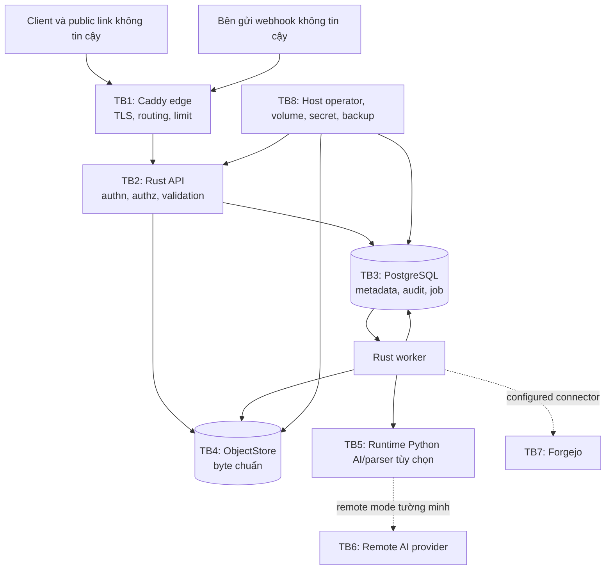

# Kiến trúc security và privacy của Synveil

Trạng thái: **Blueprint threat-model quy chuẩn**

Trạng thái authentication foundation: **password hashing Argon2id đã
IMPLEMENTED/VALIDATED bằng unit test; first-admin bootstrap persistent đã
IMPLEMENTED**. Concurrency của bootstrap chỉ **VALIDATED khi test PostgreSQL
disposable thực thi**. Persistence browser session chỉ lưu verifier và
semantics login/session không phụ thuộc transport đã **IMPLEMENTED**; hành vi
session trên PostgreSQL chỉ **VALIDATED khi test PostgreSQL session disposable
thực thi**. Transport HTTP login/logout/session/CSRF, policy cookie an toàn,
typed web API boundary, first-run bootstrap HTTP flow và minimal web setup/
login/session UI đã **IMPLEMENTED**. Exact-offset upload transport đã
authenticate và browser API helper raw-byte cũng **IMPLEMENTED**. Content-read
service trung lập transport đã authorize theo owner chỉ chọn replica đã verify,
cross-check metadata object và stream byte full/current-range mà không expose
physical key; nó đã **IMPLEMENTED**. HTTP download full/single-range đã
authenticate cũng **IMPLEMENTED**, với ETag SHA-256 strong, attachment header
an toàn, private no-store và không cần CSRF cho safe GET. Credential thiết bị,
recovery, upload UI và download UI vẫn **PLANNED**. Metadata version-history
listing và direct lookup đã **IMPLEMENTED** với owner/library scoping,
active-file concealment, cursor bounded theo node, DTO allowlist an toàn và
không truy cập ObjectStore; safe historical-version restore đã **IMPLEMENTED**
với CSRF, signed `If-Match`, recheck owner/file/source, chọn replica đã verify,
append-only FileVersion mới và replay idempotent đã persist. Response restore
chỉ expose version metadata an toàn cùng node concurrency metadata, không expose
object hay replica identity. Bằng chứng bootstrap/session/upload/content-read/
version-history/restore end-to-end trên PostgreSQL vẫn phụ thuộc môi trường khi
chưa cấu hình disposable database.

Synveil lưu file cá nhân, backup, ảnh, trạng thái thiết bị, dữ liệu repository,
credential và thông tin search dẫn xuất. Vì vậy security là điều kiện phát hành,
không phải một lượt hardening tùy chọn. Tài liệu này định nghĩa mô hình trust ban
đầu và các biện pháp kiểm soát bắt buộc; nó không tuyên bố một control chưa được
triển khai đã tồn tại.

ADR đã chấp thuận và đặc tả domain/protocol được ưu tiên. Mỗi phase cập nhật
threat model này và tạo bằng chứng security theo yêu cầu của
[TEAM_PLAN.md](TEAM_PLAN.md).

## Mục tiêu security

Synveil phải:

1. bảo toàn confidentiality và authorization của byte chuẩn cùng metadata;
2. bảo toàn integrity và khả năng recovery trước input độc hại, retry, crash,
   lỗi operator, credential bị compromise và lỗi optional-service;
3. làm activity phá hủy hoặc liên quan security có thể quy trách nhiệm mà không
   log secret hay content file;
4. fail closed tại boundary authentication, authorization, chọn object và remote
   egress;
5. giới hạn công việc CPU, memory, disk, database, queue, network, parser và
   external-provider từ input không tin cậy;
6. giữ AI, media parsing, Forgejo, webhook, thumbnail, OCR và semantic indexing
   bên ngoài core availability path;
7. nêu residual risk trung thực, đặc biệt là trust vào operator, dữ liệu đã tải,
   thiết bị bị compromise và E2EE bị hoãn.

Availability không cho phép chấp nhận byte chuẩn không được theo dõi khi
PostgreSQL unavailable hay phơi một `FileVersion` trước khi `Object` của nó bền
vững và được verify.

## Giả định trust và threat

### Được tin cậy với giới hạn quan trọng

- Operator self-hosting kiểm soát host, tên TLS, storage path, backup và
  configuration. Server ban đầu có thể đọc plaintext của user.
- PostgreSQL primary và `ObjectStore` được chọn chạy trong trust boundary của
  operator, nhưng credential và network endpoint của chúng vẫn là secret
  least-privilege.
- Code Synveil API/domain đã review được tin cậy để cưỡng chế policy; optional
  worker chỉ nhận authority cần cho một job.

Attacker có quyền root/administrator trên host, database, object backend và
encryption key phía server có thể đọc hoặc sửa dữ liệu server đọc được. Disk đã
encrypt và provider encryption bảo vệ media khi at rest hoặc disposal; chúng
không tạo zero knowledge. Chỉ một chế độ E2EE được thiết kế riêng mới giảm trust
vào operator, và ADR-016 hoãn rõ chế độ đó.

### Không tin cậy hoặc chỉ tin một phần

- client Internet, browser, filename, metadata, file byte và tuyên bố MIME;
- user đã xác thực nhưng ở ngoài resource được yêu cầu;
- thiết bị bị compromise/revoke và bearer credential đã sao chép;
- user public-share và caller webhook;
- content media/document/archive/repository, gồm văn bản giống prompt;
- header reverse-proxy không được nhận từ proxy cấu hình;
- endpoint Forgejo và AI bên ngoài deployment;
- output AI/model và mọi classification dẫn xuất;
- network, DNS, clock và timestamp client cung cấp;
- số lần/thứ tự giao job: job là at-least-once và có thể lặp.

### Giới hạn tường minh

- Revocation ngăn truy cập Synveil tương lai; không thể thu hồi byte đã tải hay
  chứng minh một hệ điều hành đã xóa chúng.
- Public link là bearer capability; bất kỳ ai có active token đều có quyền theo
  scope của nó tới khi expiry/revocation/limit.
- Anomaly detection có thể bảo toàn và pause thay đổi đáng ngờ nhưng không thể
  bảo đảm phát hiện ransomware.
- Deployment ban đầu single-host, không tự động highly available.
- Synveil không phải malware scanner hay safe viewer cho mọi kiểu file.

## Asset được bảo vệ và classification

| Class | Ví dụ | Baseline xử lý |
|---|---|---|
| Authentication secret | Password, raw token session/device/share, recovery code | Không bao giờ log; plaintext chỉ tồn tại tại boundary issue/use; lưu password verifier đã review hoặc token hash keyed/cryptographic; rotate và revoke. |
| Infrastructure secret | URL PostgreSQL, storage key, token AI/Git, webhook secret, application master key | Secret mounted/runtime, least scope, không phơi qua image/source/UI, được backup riêng và encrypt, rotation có audit. |
| Canonical content | File object, backup object, original, repository backup, release artifact | Bất biến, verify SHA-256, authorize qua logical reference, transport encrypt, retention và restore được bảo vệ. |
| Sensitive metadata | Tên, hierarchy, timestamp, EXIF/location, activity thiết bị, tên repository, OCR/text trích xuất | Coi là dữ liệu user riêng tư; giảm log/provider egress; authorize query, export, index và deletion. |
| Derived content | Thumbnail, OCR, embedding, AI tag, repository index | Gắn version, có thể thay thế, gắn nhãn provenance, kiểm tra ACL, hỗ trợ purge/rebuild; không bao giờ là sự thật chuẩn. |
| Audit/security data | Login, revoke, permission và event phá hủy | Theo hướng append, hạn chế, kiểm soát retention, redact và backup; không có raw secret hay content. |
| Operational telemetry | Health request/job/storage và error | Identifier mờ đục low-cardinality, route template, redaction, retention có giới hạn; export diagnostic opt-in. |

Filename, tên repository, metadata IP/device, EXIF và text trích xuất có thể rất
nhạy cảm dù chúng không phải body file.

## Trust boundary



### Yêu cầu boundary

- **TB1 Internet → edge:** TLS, header/body/connection/time có giới hạn,
  canonical host, secure header, request ID, danh sách trusted-proxy và không
  phơi trực tiếp DB/object.
- **TB2 edge → API:** chỉ chấp nhận header identity/address được forward từ
  proxy network cấu hình; authenticate mọi protected route; áp dụng CSRF,
  authorization, input và rate policy trong API kể cả khi Caddy có limit.
- **TB3 API/worker → PostgreSQL:** role runtime/migration riêng, TLS khi network
  rời host, SQL parameterized, constraint, transaction ngắn, isolation/lock
  tường minh và column audit/secret bị hạn chế.
- **TB4 API/worker → object store:** key mờ đục do server sinh, credential/prefix
  có scope, TLS cho remote storage, conformance capability, verification
  checksum/length và logical authorization trước mọi truy cập byte.
- **TB5 core → optional compute:** job/capability gắn version, giới hạn size/type,
  không ambient admin credential, filesystem/network có giới hạn, output
  idempotent và process/container có thể kill.
- **TB6 remote AI:** mặc định disabled, allowlist provider/origin chính xác,
  policy tường minh, dữ liệu công bố được giảm thiểu, record provider/retention,
  audit và path deletion dẫn xuất.
- **TB7 Forgejo:** origin cấu hình chính xác, truy cập private-network chỉ khi
  operator opt-in, credential least-scope đã encrypt, kiểm soát redirect/DNS/
  rebinding, polling/process có giới hạn và authenticated webhook hint.
- **TB8 host/operations:** container non-root, mount tối thiểu, không Docker
  socket, port private, ownership volume tường minh, permission secret-file,
  backup bên ngoài phối hợp và rehearsal restore.

## Bất biến security

1. UUIDv7, object ID, storage key, node ID, repository ID, cursor hoặc ordinary
   share record ID không bao giờ là authorization hay bằng chứng secrecy.
2. Mỗi lần đọc object bắt đầu từ logical resource/version/share đã authorize và
   resolve internal location phía server. Client không chọn storage key.
3. Tên user là metadata, không bao giờ nối với server path hoặc object key.
4. Content mutation thành công tham chiếu object bền vững đã verify và ghi
   nguyên tử metadata, change, audit cùng outbox work bắt buộc.
5. Retry với cùng identity và fingerprint idempotency tạo outcome ban đầu; tái
   sử dụng với fingerprint khác bị từ chối.
6. Stale write không bao giờ âm thầm ghi đè byte conflict. Thiếu nguồn backup
   không bao giờ trở thành live deletion.
7. Token và credential chỉ ở dạng raw lúc issue/presentation; storage và log
   chứa verifier/metadata, không chứa plaintext dùng lại được.
8. Optional job không thể mutate byte chuẩn. Derived record xác định source
   `FileVersion`/revision repository và trở thành stale khi source hoặc ACL đổi.
9. GC không thể xóa khi bất kỳ reference live/history/trash/backup/derivative/
   staging/migration, lease, hold hoặc safety window nào bảo vệ object.
10. Remote content egress chỉ xảy ra theo policy hiệu lực hiện tại; không
    filename, text OCR, ảnh hay content repository nào âm thầm rời host.

### An toàn retention của Trash

Trash eligibility được evaluate từ `nodes.trashed_at` do server quan sát, một
retention policy chuẩn, server time hiện tại, state library theo owner và node
revision chuẩn. Clock của client, browser hay device không thể rút ngắn grace
window hoặc cung cấp deletion timestamp. Candidate scan nội bộ có bound và
cursor opaque; nó không phải global administrative API cho user. Trong cùng
transaction lock với restore, `begin_node_purge` kiểm tra lại owner, library,
state, directory phải rỗng, retention cutoff và expected revision. Restore vẫn
được phép sau deadline cho tới khi `PURGING` thắng, vì vậy race chỉ commit một
state transition. Transition này không xóa hoặc detach `FileVersion`, `Object`,
`ObjectReplica`, object byte và không có dependency vào `ObjectStore`.

Boundary nội bộ `execute_metadata_purge` hẹp hơn và được authorize riêng: nó
chỉ nhận node thuộc owner đã ở `PURGING`, recheck expected revision cùng invariant
root/parent/child và chạy trong một PostgreSQL transaction. Operation chỉ xóa
metadata `Node`, `FileVersion` và restore-operation của node, sau đó ghi
canonical object identity vào bảng GC candidate metadata-only. Nó không có
public route, không có capability ObjectStore và không có thao tác xóa
`Object`, `ObjectReplica` hay byte. Replay record nhỏ gọn chỉ giữ identity
owner/node/revision, không giữ filename, path, content hay credential. Release
reference và re-reference cross-library được serialize bằng transaction lock
của database.

## Authentication, bootstrap và recovery

### Password và login

- Dùng implementation Argon2id được duy trì và review. Lưu algorithm cùng
  version tham số với mỗi verifier; benchmark tham số trên class deployment
  được hỗ trợ và rehash sau login đã xác thực khi policy đổi.
- Không cap password tại limit thư viện âm thầm truncate. Áp dụng bound encoded-
  length được ghi tài liệu, đủ lớn cho password manager và từ chối encoding
  không hợp lệ trước công việc tốn kém.
- Foundation này dùng Argon2id v=19 với `m=65536`, `t=3`, `p=1`, output 32
  byte; từ chối password rỗng và input dài hơn 1.024 byte UTF-8. Production có
  thể calibration lại các tham số tập trung này về sau.
- Error login là generic. Rate limit kết hợp các chiều source, account đã
  normalize, instance và expensive-operation mà không cho enumeration.
- Áp dụng progressive delay/backoff và security logging; bên độc hại không được
  vĩnh viễn lock out account nếu thiếu route recovery có audit.
- Không bao giờ dùng security question hay custom password encryption.

### Browser session

- Session secret là giá trị random mờ đục có entropy cao. Chỉ lưu verifier
  keyed hoặc cryptographic, issue/expiry/idle/last-use, user/session epoch,
  lineage rotation và revocation.
- Foundation hiện thực identity record session UUIDv7 riêng với bearer token
  random 256-bit, chỉ lưu verifier SHA-256, expiry tuyệt đối bền vững,
  validation user active và revoke bền vững ngay lập tức. TTL mặc định tám giờ
  là baseline implementation có thể cấu hình, không phải protocol guarantee
  công khai.
- Semantics login và validate session không phụ thuộc transport; API boundary
  hiện triển khai `POST /api/v1/auth/login`, `POST /api/v1/auth/logout`,
  `GET /api/v1/auth/session` và `GET /api/v1/auth/csrf`.
- Session cookie là host-only (bỏ qua `Domain`), dùng `Path=/`, `HttpOnly`,
  `SameSite=Lax` và `Secure` theo policy production. Có policy insecure dành
  riêng cho local HTTP cô lập và phải opt-in rõ ràng; đây không phải default.
- Request state-changing đã authenticated bằng cookie cần proof double-submit
  có ký, bound với session trong `X-CSRF-Token`, CSRF cookie tương ứng không
  `HttpOnly`, và validation same-origin `Origin`/`Sec-Fetch-Site` khi có. Login
  được miễn vì chưa có authenticated session; chỉ `SameSite` không phải phòng
  vệ hoàn chỉnh.
- Response authentication và CSRF dùng `Cache-Control: no-store`; raw session
  credential chỉ nằm trong session cookie, không serialize, log, trace hay
  persist.
- First-run HTTP boundary hiện triển khai `GET /api/v1/system/bootstrap-status`
  và `POST /api/v1/bootstrap/admin` với JSON strict 16 KiB, từ chối unknown
  field, response chỉ chứa status an toàn, request correlation và call race-safe
  tới bootstrap service hiện có. Nó không issue browser session; web client
  login tường minh sau setup.
- Mọi route `/api/v1/upload-sessions` đều cần session đã authenticate; create,
  PATCH append, complete và abort còn cần cùng CSRF proof bound theo session và
  provenance same-origin. Status là safe read đã authenticate nên không cần
  CSRF header.
- Upload create không nhận `user_id`, object key, staging handle, path hay field
  backend. PATCH cần một `Upload-Offset` chuẩn và chính xác
  `application/octet-stream`; handler stream frame qua application service có
  giới hạn và không bao giờ log hay aggregate content file. Safe error body chỉ
  expose code allow-list, request ID và offset có thẩm quyền khi recovery cần.
- Kết quả append mơ hồ chỉ recovery qua GET status đã authenticate. Browser
  helper không đọc HttpOnly session cookie, persist bearer material, encode
  byte thành base64 hay giả định offset tự tăng ở client là có thẩm quyền.
- Rotation refresh session consume và issue nguyên tử. Nó không transparently
  retryable sau response mơ hồ: reuse credential đã consume đặt family thành
  `REVOKED` nguyên tử, invalidate mọi credential material còn lại, ghi
  `REFRESH_REPLAY_DETECTED` và yêu cầu login. Không có quarantine state; outcome
  fail-closed này tường minh trong test UI/API.
- Logout, reset password, disable, action administrator và revoke thiết bị cập
  nhật validation phía server ngay hoặc trong cache lag có giới hạn tường minh
  và đã test.

### Credential thiết bị/API

- Grant API và device nhận credential mờ đục có scope riêng, expiry, có thể
  rotate qua TLS sau đăng ký đã xác thực. Initial issuance chỉ lưu verifier
  `PENDING` và display raw secret một lần; không pending generation nào
  authenticate trước activation tường minh.
- Device token dùng header Authorization, không bao giờ dùng URL, query parameter
  hay browser local storage. Native client dùng facility credential Keychain/OS.
- Scope tách action sync, backup, photo import và administrative. Khai báo
  capability không phải security claim.
- Rotation tạo một pending candidate trong khi generation active cũ còn hợp lệ.
  Activation retire nguyên tử generation cũ. Response bị mất chỉ để lại
  candidate inert có thể replace tường minh; revocation invalidate family, mọi
  generation, lần dùng API tương lai và truy cập journal.
- Activation device credential chỉ dành cho owner với recent step-up,
  generation precondition, idempotency, rate limit và audit. Pending bearer
  secret không thể authenticate hoặc tự activate.

## Security của native installation, pairing, service và lifecycle

Personal / Home Mode thêm một host boundary mà không đổi authority của domain.
Installer, supervisor, update coordinator và storage picker là platform adapter
và phải được threat-review riêng với Rust domain core:

- Native/guided installer verify artifact đã ký và đã pin trước elevation,
  validate architecture/runtime/path/capacity, chỉ xin privilege tối thiểu để
  bảo vệ data root đã chọn và không initialize chồng lên storage identity hiện
  có sau preflight mơ hồ.
- Service adapter dùng OS-native least privilege và authenticated IPC hẹp.
  Windows Service, launchd, systemd và helper đều không định nghĩa
  authorization; chúng chỉ start/stop/restart process có giới hạn và báo state.
  Elevation, crossing user/session, crash recovery, reboot, sleep/wake,
  uninstall và update transition phải audit và test.
- Secret material dùng OS facility đã khai báo khi có—Windows Credential
  Manager/DPAPI, macOS Keychain, Linux Secret Service hoặc fallback protected
  file—với permission và semantics backup/recovery rõ. Raw pairing code,
  database credential, recovery material và master key không xuất hiện trong
  log, command line, browser storage hay installer bundle.
- Storage picker chỉ expose candidate host đã authorize. Nó reject `/`,
  home/workspace root, PostgreSQL path, symlink/junction/reparse unsafe và
  removable root mơ hồ; verify Synveil identity persistent cùng capability
  profile trước khi dùng. Root mất chỉ là dependency unavailable, không phải
  quyền initialize store rỗng mới.
- PostgreSQL managed được provision với data ownership riêng cùng runtime/
  migration role, được bảo vệ khỏi uninstall thông thường và recovery qua cùng
  backup/key/upgrade policy. Personal / Home không âm thầm đổi sang SQLite khi
  managed service unavailable.
- Pairing dùng authenticated exchange high-entropy, sống ngắn, single-use, bind
  vào instance/user/device đích. Có expiry, replay, concurrent claim,
  wrong-target, revoke và failure/remediation hiển thị rõ. Human confirmation
  hoặc authenticated bootstrap ngăn code bị thấy trên LAN tự bind attacker
  device.
- Remote access theo lớp: local/LAN trước, direct/proxy do operator cấu hình
  tiếp theo và relay tùy chọn chỉ sau contract đã chấp thuận. Không relay nào là
  bắt buộc cho correctness core. Relay metadata được giảm thiểu, content được
  bảo vệ theo transport/session policy đã cấu hình và remote discovery không mở
  inbound port âm thầm.
- Signed update verify artifact, platform compatibility, config, capacity,
  health, backup và migration path trước mutation. Uninstall dừng service và
  tách application material khỏi permanent data deletion; reinstall discover
  identity đã giữ. Machine migration dùng
  `inspect → plan → validate → execute → verify`, rotate device credential khi
  cần và coi key/object thiếu là blocker hiển thị rõ.

### Bootstrap và recovery

- Khi chưa có administrator, HTTP bootstrap contract hiện tại chỉ expose status
  tối thiểu và command tạo administrator đầu tiên. Nó không nhận setup-secret
  field: browser request được check provenance same-origin khi có
  `Origin`/`Sec-Fetch-Site`, còn operator phải giữ endpoint first-run trên mạng
  trusted/private hoặc TLS terminate đúng cách cho tới khi installer hoặc
  secret-gate contract tương lai được review.
- Command tạo administrator được serialize bởi PostgreSQL bootstrap service
  hiện có và đóng nguyên tử sau success. Nó không re-open từ browser cookie;
  phase này không có distributed rate-limiter subsystem, nên body bound và
  deployment exposure control là giới hạn hiện tại.
- Bootstrap success response không chứa password, verifier, cookie, session
  credential hay administrator record và không tạo session. Minimal web UI hiện
  completion notice an toàn rồi chuyển sang login tường minh.
- Recovery code là baseline đã đóng băng. Raw code của mỗi replacement set được
  sinh và hiển thị chính xác một lần, rồi chỉ lưu dạng verifier và được tiêu thụ
  nguyên tử; flow pending-then-activate đã xác thực có thể replace set an toàn
  mà không invalidate set active cuối cùng khi response bị mất.
- Code exchange reserve thay vì consume code và trả một pending transaction
  secret. Retry invalidate/replace pending transaction không thể tiếp cận;
  expiry giải phóng reservation. Chỉ reset password mới consume nguyên tử cả
  current transaction và code, nên response loss không thể làm mắc kẹt code
  cuối cùng.
- Activate replacement set expire mọi pending transaction/reservation của set
  đã retire; reset check lại set/generation vẫn active. Reset password revoke
  mọi credential family, pause device được giữ và yêu cầu re-enrollment bằng
  owner step-up vào fresh pending device family.
- Nếu OD-005 chọn host-administrator override, nó phải là action
  CLI/maintenance tường minh, ghi audit evidence và không phơi password
  material. Không giả định reset path hoặc email delivery như vậy tồn tại đến
  khi quyết định security/product được nêu tên đã đóng.
- Email, MFA và WebAuthn tùy chọn chỉ là addition sau khi threat enrollment,
  revocation, anti-lockout và recovery được review.

## Mô hình authorization

Policy tập trung đánh giá principal đã xác thực, ownership/membership resource,
share grant, scope/status thiết bị, action yêu cầu và trạng thái resource hiện
tại. Transport handler không được sao chép policy ad hoc.

Negative case bắt buộc gồm:

- library/node/version/object/upload/backup/photo/repository của user khác;
- object trước đây chỉ truy cập qua share đã revoke hoặc expiry;
- thiết bị bị pause/revoke sau khi lấy cursor hoặc upload session;
- write qua read-only grant; escalation permission qua move subtree;
- restore, purge, GC, retention hoặc storage migration không có role rõ;
- kết quả AI/search có source permission thay đổi sau indexing;
- liên kết repository/project không cấp quyền truy cập repository.

Administrative visibility và ownership là riêng biệt. Action administrator
truy cập dữ liệu user phải tường minh, được audit và mô tả trong operator policy;
`is_instance_admin` không âm thầm làm mọi ordinary query cross-owner.

Query database được scope theo owner/library/grant ngoài việc kiểm tra cú pháp
UUID. Randomness và opacity giảm guessing; không bao giờ thay thế policy.

## Bảo vệ web và API

### XSS và xử lý content

- Giữ default escaping của React. Tránh raw HTML; sanitizer bắt buộc nào cũng có
  allowlist đã review và adversarial test.
- Áp dụng Content Security Policy hạn chế, `X-Content-Type-Options: nosniff`,
  hạn chế framing, Referrer Policy và permission policy phù hợp app.
- Filename, tag, text repository và error do user kiểm soát được render như text.
  Không bao giờ interpolate chúng vào HTML, shell command, SQL, header hay
  filesystem path.
- SVG/HTML do user kiểm soát được tải như attachment hoặc transform trong
  sandbox; mặc định không phục vụ inline từ origin application đã xác thực.
- `Content-Disposition` dùng server encoder an toàn cùng fallback có giới hạn.
  MIME là metadata không tin cậy; server không dựa vào claim client để chọn
  privileged parser.

### CSRF, CORS và provenance request

- Web deployment same-origin là mặc định. CORS có allowlist chính xác và không
  bao giờ kết hợp wildcard origin với credential.
- Thay đổi state được xác thực bằng cookie cần phòng vệ CSRF. API client bearer-
  token không bỏ qua control authorization/rate/idempotency.
- Implementation browser hiện dùng nonce random cryptographic 256-bit cộng
  HMAC-SHA-256 trên nonce và raw session credential. Proof được rotate bởi
  `GET /api/v1/auth/csrf` và không thể validate với session khác.
- Chỉ trust `X-Forwarded-*` từ address Caddy cấu hình. Validate canonical host
  và scheme dùng cho absolute link cùng callback origin.

### Hành vi error ổn định

Error external phơi request ID, machine code ổn định và detail an toàn, không
phơi stack trace, SQL, storage path, object key, dependency URL kèm credential
hay sự tồn tại cross-user. Response authentication/authorization/not-found tránh
enumeration ở nơi policy yêu cầu.

## An toàn storage và upload

### Tên, path và symlink

- Lưu display name UTF-8 có giới hạn và comparison key có version. Từ chối NUL,
  separator/control form bị cấm bởi profile portable và collision sibling theo
  profile đó.
- Physical key là component mờ đục được sinh dưới storage root/prefix cấu hình.
  Client path không bao giờ được truyền cho `open`, join vào root đó hay dùng
  làm S3 key.
- Adapter local đã implement dùng tạo temporary độc quyền và check
  `symlink_metadata`/reparse-point trước operation trên managed path. Mọi object
  path được derive từ hash của opaque key đã validate. Standard API portable
  không loại bỏ mọi cửa sổ TOCTOU check/open giữa process; hardening
  descriptor-relative vẫn là việc platform-adapter tương lai, nên root cần
  ownership và permission độc quyền cho service.
- Root cấu hình không thể là filesystem root, home/profile người dùng, current
  directory, source workspace tại thời điểm build hay symlink/junction entry bị
  redirect. GC đệ quy chưa implement trong phase này và phải giữ quy tắc
  no-follow khi được thêm.
- Symlink backup là metadata manifest theo policy tường minh; restore không
  follow symlink đã restore để write ra ngoài destination.

### Streaming, limit và durability

- Áp dụng logical size tối đa, part size/count, simultaneous session, quota theo
  user/device, budget temporary-space, request/idle/deadline và concurrency CPU
  checksum ở edge và API khi phù hợp.
- Stream vào staging storage độc quyền bằng buffer có giới hạn. Từ chối declared
  length overflow/underflow, part overlap/gap và retry tái sử dụng part identity
  cho byte khác.
- Trên local storage, write và verify byte temporary, flush theo profile
  durability đã chấp thuận, promote nguyên tử khi hỗ trợ và sync metadata chứa
  theo yêu cầu. Adapter khai báo capability thay vì tự bịa.
- Disk-full hoặc I/O error không bao giờ công bố version hiển thị. Chỉ giữ state
  có thể resume khi part đã verify cùng capacity accounting đáng tin; nếu không
  fail/abort tường minh.
- S3 ETag không được coi là checksum content chuẩn. Completion object remote
  verify length và hành vi checksum/read-after-write cấu hình.

### Commit cross-store và GC

Object được làm bất biến và verify trước khi database tham chiếu. Transaction
database sau đó create/reuse `Object`, tạo `FileVersion`/node state, cập nhật
metadata quota/reference, append `ChangeEvent`, `AuditEvent` cùng record outbox
bắt buộc và lưu outcome idempotency.

Nếu durability object thành công còn transaction thất bại, byte là orphan
candidate không được authorize. Đối soát chỉ có thể tái sử dụng hoặc xóa chúng
sau lease upload/job và safety grace period. Nếu transaction commit nhưng mất
response, replay trả kết quả đã lưu. GC dùng marking có thẩm quyền trên mọi
protected reference; riêng reference count cache không thể authorize deletion.
Deletion có hai stage, được audit và restart được.

### Corruption

- Lưu SHA-256 plaintext chuẩn cùng length và checksum độc lập của encoded stored
  byte.
- Mismatch đặt `ObjectReplica` bị ảnh hưởng thành `CORRUPT` hoặc `MISSING`, tăng
  metric high-severity, chặn phục vụ replica đó như hợp lệ và giữ bằng chứng.
  Replica healthy đã verify giữ `Object` đọc được; `Object` chỉ thành
  `QUARANTINED` và read bị ảnh hưởng mới fail khi không còn replica đáng tin
  cậy. Recovery chỉ thử nguồn redundant đã verify và không bao giờ âm thầm
  “sửa” metadata cho khớp byte hỏng.
- Nghi ngờ hash collision/length inconsistency được giữ riêng và byte-compare/
  quarantine; hash client cung cấp là hint, không phải proof.

## Kiểm soát resource-exhaustion và parser

Dữ liệu không tin cậy có thể tấn công ngay cả khi không thực thi code. Limit
được áp dụng trước allocation khi có thể và liên tục trong streaming:

- số byte encoded/decoded, dimension/pixel count ảnh, page/frame/file count,
  depth/member count/ratio archive, thời lượng OCR, scope file/count/history
  repository, ratio output compression và kích thước vector/index;
- CPU/memory/GPU/process count, slot blocking-pool, statement/row database, tuổi/
  attempt queue, temporary disk, outbound byte và external request;
- pagination có giới hạn và công việc recursive/bulk bất đồng bộ thay vì một
  request hay transaction vô hạn.

Archive không tự động extract vào server path. Parsing media/document/repository
chạy trong process/container least-privilege riêng với input read-only hoặc có
scope capability, output temporary cô lập, mặc định không network, resource
limit, timeout và library/image được duy trì. Crash hoặc timeout ghi lỗi
derivative có thể thay thế; không ảnh hưởng original.

Zip/decompression bomb, upload quá lớn và client chậm được test ở cả layer proxy
và application. Optional work dùng priority/backpressure thấp hơn để không thể
làm cạn capacity core API, database hoặc storage.

## Kiểm soát SQL và data store

- Dùng SQLx bind parameter và typed query khi thực tế; không nối chuỗi user
  value, identifier hay ordering clause. Dynamic sort/filter dùng mapping server
  đóng.
- Constraint database cưỡng chế ownership, uniqueness, valid state transition
  và protected reference ngoài application check.
- Role runtime và migration riêng. Runtime không thể thay schema hay đọc secret
  material ngoài chức năng. Credential backup riêng với credential API thường.
- Transaction ngắn; external I/O không xảy ra khi giữ transaction claim/lease.
  Isolation và retry riêng theo use case và có giới hạn.
- URL database và giá trị SQL parameter được redact khỏi telemetry. Debug
  endpoint không thể phơi query không hạn chế hay pool credential.

## Share và abuse

- Public share token có ít nhất 128 bit randomness mật mã, ưu tiên 256, và chỉ
  verifier được lưu. UUID share record không phải token.
- Creation public link lưu verifier inert `PENDING` và display raw capability
  một lần. Nó chỉ thành `ACTIVE` sau confirmation tường minh của owner; replay
  cùng key trả safe metadata và `one_time_secret_unavailable`, không trả
  capability. Candidate bị mất được revoke, rồi tạo share mới bằng key mới;
  không có replacement capability tại chỗ.
- Read-only là mặc định an toàn. Permission, subtree, expiry và password tùy chọn
  đều tường minh. Password verification có rate limit và dùng password hash đã
  review.
- Giới hạn request, guess, concurrent stream, byte và transform tốn kém theo
  token/source/instance. Share không thể trigger tạo archive vô hạn hay listing
  đệ quy đồng bộ.
- Revocation được cưỡng chế ở mỗi lần authorization/khởi đầu stream mới và
  nguyên tử cùng audit. Stream đã gửi và file đã tải không thể thu hồi; UI nêu rõ.
- Download bảo toàn integrity content nhưng tránh phơi internal key, metadata
  owner, child khác hay khác biệt error tiết lộ sự tồn tại private.

## Job, event và optional worker

Giao job/outbox PostgreSQL là at-least-once, không phải exactly-once. Mỗi handler:

- nhận job ID ổn định, schema version và source version bất biến;
- validate authorization/policy hiện tại ở nơi output có thể thấy hoặc rời host;
- thực thi ngoài claim transaction ngắn dưới một lease generation;
- dùng retry có giới hạn cùng exponential backoff/jitter và trạng thái terminal/
  dead-letter;
- commit output idempotent và từ chối stale-version output;
- giải phóng temporary capability và storage; phát metric/audit đã redact;
- có thể disable/replay mà không đổi canonical file state.

Payload job chứa ID mờ đục cùng snapshot policy/version cần thiết, không chứa raw
password/token hay content lớn. Poison job vẫn nhìn thấy và không spin. Tuổi
queue, attempt count, dead letter và lease expiry được monitor.

## Mô hình privacy và security của AI

### Chế độ

| Mode | Hành vi network/data | UX và control bắt buộc |
|---|---|---|
| `DISABLED` | Không dispatch AI, tải model, egress provider OCR/embedding hay yêu cầu schema AI cho core operation. Dữ liệu dẫn xuất hiện có tuân theo lựa chọn retain/purge tường minh. | Tùy chọn installation default-safe; core và metadata search vẫn dùng được. |
| `LOCAL` | Inference ở trong runtime self-hosted cấu hình. Việc lấy model là action network/install riêng được công bố. | Resource profile, model/license/hash, parser sandbox, control data-category và retention. |
| `REMOTE` | Chỉ input đã được policy authorize và giảm thiểu đi tới provider cấu hình chính xác qua TLS. | Configuration admin cùng policy user/library/item tường minh, công bố provider/model/data/retention, rotation credential, audit và hành vi withdrawal/purge. |

### Control AI bắt buộc

- Không sensitive content nào âm thầm rời server. Bật provider ở cấp instance
  không override exclusion của user/library/item.
- Remote work ghi provider, model/purpose, category dữ liệu, source version,
  effective policy version, thời gian và outcome mà không log payload content.
- Ưu tiên representation nhỏ nhất cần thiết: text trích xuất có giới hạn hoặc
  derivative thay vì original khi chất lượng cho phép. Mặc định không gửi tên,
  EXIF/location, repository secret hay context không liên quan.
- Credential provider là secret đã encrypt riêng. Egress dùng allowlist;
  redirect, dynamic tool URL và network call do model gợi ý bị từ chối.
- User content và text giống prompt trong repository/document là dữ liệu không
  tin cậy, không phải system instruction. AI không có authority tùy ý với shell,
  SQL, object-store, network hay administrative tool.
- Index record gắn với source version, owner/library, model/config và provenance.
  Query authorization được đánh giá theo ACL source hiện tại, không chỉ ACL lúc
  index.
- Delete, purge, revoke share, rút provider hoặc exclude item lên lịch deletion
  dẫn xuất và phơi lag. Canonical state không bao giờ chờ provider deletion, và
  docs nêu giới hạn deletion phía provider.
- AI tag và answer gắn nhãn `AI`, có thể edit/không có thẩm quyền, mang confidence/
  provenance khi hữu ích, và không bao giờ âm thầm ghi đè user tag hay metadata
  chuẩn.
- Terms, hành vi retention/training và vùng dữ liệu của remote provider là trách
  nhiệm operator được nêu trước khi dùng. Synveil không được khẳng định “no
  training” trừ khi contract provider/config được chọn hỗ trợ.

## Security tích hợp Forgejo/Git

- Forgejo vẫn có thẩm quyền cho Git smart HTTP/SSH, ref, packfile, permission,
  issue và pull request. Synveil không triển khai custom forge hay chấp nhận Git
  protocol traffic tùy ý trong phase sớm.
- Integration dùng token/account least-privilege được ghi tài liệu. Lưu token
  encrypt dưới application master key do operator quản lý hoặc secret backend
  tương đương; không bao giờ trả lại sau khi tạo hay đặt trong URL/log.
- Base URL cấu hình là một origin được pin. Mặc định từ chối redirect hoặc
  revalidate mọi hop. Resolve và connect nhất quán để ngăn DNS rebinding; chặn
  loopback/link-local/metadata và private range trừ khi host operator allowlist
  rõ origin Forgejo private chính xác.
- Polling có page/rate/backoff giới hạn và đánh dấu inventory stale khi lỗi.
  Webhook dùng secret/chữ ký mạnh, timestamp/replay window, giới hạn content-type
  và body, idempotency duplicate cùng validation liên kết repository/integration.
  Chúng lên lịch đối soát; không bao giờ là sự thật có thẩm quyền.
- Subprocess Git/export nhận argument tường minh không qua shell, chạy dưới user
  hạn chế với environment/temp directory được kiểm soát, có limit CPU/memory/
  disk/time/output và không kế thừa credential không liên quan.
- Content repository, submodule, `.gitmodules`, URL LFS và release link không
  tin cậy. Không URL dẫn xuất từ content nào được fetch ngoài policy connector
  cấu hình.
- Backup nêu phạm vi chính xác và verify dữ liệu Git, LFS cùng artifact. Restore
  mặc định tới destination mới, validate authorization target, từ chối overwrite
  và được audit.
- Forgejo outage, payload độc hại hay credential xấu không thể chặn Drive, sync,
  backup, restore hoặc đọc repository-backup đã verify hiện có.

## Security cho ảnh và client tương lai

- Original ảnh dùng canonical upload path và không bao giờ bị job EXIF,
  thumbnail, duplicate hay AI rewrite.
- EXIF, location, khuôn mặt và capture context là sensitive metadata.
  Authorization theo original; derivative public có thể strip location/metadata
  theo policy tường minh mà không đổi original.
- Exact hash duplicate chỉ có thể dùng chung byte trong dedup domain. Perceptual
  match là gợi ý, không phải bằng chứng xóa tự động.
- Import PhotoKit tương lai dùng quyền limited/full do user cấp, identity
  idempotency Synveil ổn định và background URLSession. PhotoKit ID cục bộ theo
  thiết bị không phải server authorization secret hay identity bền vững toàn cục.
- FileProvider/placeholder hydrate một version bất biến và chỉ evict local cache
  đã verify. Eviction không bao giờ phát server deletion. Keychain giữ credential
  thiết bị.
- Diagnostic và log client mặc định loại raw token và full path nhạy cảm. Xóa
  remote cache chỉ giới hạn ở cache do Synveil quản lý và không thể tuyên bố wipe
  OS/device.

## Policy SSRF và outbound network

Application không fetch URL user tùy ý. Mọi outbound integration là adapter đã
đăng ký có policy exact-origin riêng theo mục đích.

- Parse URL bằng một thư viện đã review; chỉ cho scheme mong đợi; từ chối
  userinfo, encoding mơ hồ và port không hỗ trợ.
- Resolve mọi candidate address, áp dụng policy public/private cấu hình, connect
  tới kết quả đã validate và validate lại khi redirect/retry.
- Mặc định chặn cloud instance metadata, loopback, link-local, Unix socket và
  internal control endpoint. Forgejo self-hosted private cần exact allowlist
  tường minh.
- Disable redirect trừ khi bắt buộc; khi đó giới hạn hop và áp lại mọi check.
- Giới hạn thời gian DNS/connect/read/total, byte response, decompression và
  concurrency. Không truyền internal authorization header qua origin.
- Model output, content repository, webhook và file metadata không thể tạo
  outbound destination mới.

## Encryption và quản lý key

### Transport

Production dùng TLS từ client tới Caddy và TLS lần nữa cho mọi dependency link
rời trusted host/network. HTTP redirect sang HTTPS; HSTS chỉ bật sau khi operator
xác nhận lifecycle canonical hostname/certificate. Client validate certificate
và không cung cấp chế độ âm thầm “trust any certificate”. Workflow trust
self-signed/on-premises có chủ ý cài một CA/pin cụ thể qua cơ chế OS.

### Encryption at-rest phía server

Phương pháp được hỗ trợ ban đầu là filesystem/volume encrypt, encryption backend
NAS/storage hoặc S3-provider. Envelope do application quản lý là ADR sau, đòi
hỏi primitive chuẩn đã audit, format có version, key ID, rotation, backup/
recovery và test corruption. Secret credential/integration có thể cần
application-level encryption sớm hơn; master key của chúng được giữ ngoài
PostgreSQL và đưa vào kế hoạch disaster-recovery an toàn.

Server-side encryption không bảo vệ trước server đang chạy bị compromise cùng
key. Operator cần backup off-host đã encrypt và secret recovery đã test; làm mất
master key duy nhất có thể khiến integration hoặc content encrypt không thể
recovery.

### E2EE và thứ tự compression

E2EE là một product mode tương lai riêng theo ADR-016. Nó ảnh hưởng preview,
dedup, compression, OCR, semantic search, sharing, recovery và onboarding
client; không cho phép shortcut field-level hay custom crypto.

Với dữ liệu server đọc được, thứ tự thông thường là:

```text
canonical plaintext → optional compression → authenticated encryption → storage
```

Encryption trước compression tạo ciphertext entropy cao, bình thường không nén
được. Convergent encryption không phải cách được chấp nhận để kết hợp global
dedup và zero knowledge vì nó tiết lộ content equality và cho phép confirmation
attack.

## Hardening secret và container/host

- Không bao giờ commit secret, bake vào image, phơi trong web bundle, đặt trên
  command line hay đưa vào diagnostic. Ưu tiên mounted secret file hoặc external
  secret backend có ownership/mode hạn chế.
- Mount Docker Compose `secrets` cải thiện injection nhưng không tự động encrypt
  at rest như orchestrator secret service; operator vẫn bảo vệ source file và
  backup.
- Container chạy dưới fixed non-root user, drop mọi capability không cần, dùng
  `no-new-privileges`, root filesystem read-only khi tương thích, mount temp/data
  writable có giới hạn và không Docker socket/host root mount.
- Chỉ Caddy publish port Internet. PostgreSQL, worker, object backend và AI bind
  private network. Endpoint administrative/metrics ở internal hoặc được xác thực
  riêng.
- Image được pin bằng digest cho bản phát hành promote, build từ base tối thiểu,
  scan, đi kèm inventory SBOM/license và cập nhật theo dependency response policy
  đã công bố.
- Configuration từ chối option production unknown/insecure và validate storage
  identity, canonical URL, proxy trust, permission secret-file cùng mode không
  tương thích trước readiness.

## Logging, audit, metric và privacy

### Telemetry application

Event có cấu trúc có thể gồm timestamp, service/version, severity, request/
trace/operation ID, route template, stable error code, status, duration, byte
count có giới hạn và principal/device ID đã redact/pseudonymous. Không dùng tên
user/file/object/repository, raw URL query, authorization header, cookie, body,
AI payload, giá trị SQL parameter, storage key hay dependency URL mang credential
làm label metric hoặc log thường lệ.

Label high-cardinality có thể tiết lộ dữ liệu và làm cạn monitoring system. Dùng
route template và enum có giới hạn; tương quan incident cụ thể qua audit/trace
ID bị hạn chế.

### Security audit

Audit tách với debug log và ghi actor/auth method, action, target mờ đục,
authorization outcome, server time, source category, request ID và tóm tắt thay
đổi an toàn cho:

- login/recovery/bootstrap/MFA/issue credential, rotate, revoke và failure;
- thay đổi state và security setting user/admin/device;
- create/access/password failure/permission/revoke share;
- trash/purge/restore, retention, GC override, storage migration và corruption;
- backup snapshot/restore và repository backup/restore;
- thay đổi mode/provider/policy/egress/purge AI;
- thay đổi secret/config và export administrative diagnostic.

Application role không thể âm thầm update audit fact cũ. Retention, export,
access và backup tường minh. Audit có thể theo hướng append, nhưng không tuyên bố
tamper-proof trước host/database administrator trừ khi external sink độc lập được
cấu hình.

## Ma trận verification threat-control

| Threat | Control chính | Bằng chứng bắt buộc |
|---|---|---|
| Password bị đánh cắp/brute-force | Argon2id, generic error, limit/backoff đa chiều, recovery và audit | Benchmark tham số; test enumeration/brute-force/recovery |
| Raw token/database bị đánh cắp | Token mờ đục entropy cao, chỉ lưu verifier, pending activation, expiry/rotation/revoke, redaction secret | Scan DB/log; test lost-response, race activation, replay rotation và revoke |
| Thiết bị bị compromise | Credential có scope, trạng thái thiết bị, revoke, base version/conflict, backup được giữ | Revoke trong sync/upload; mutation stale độc hại; recovery clean-device |
| IDOR/truy cập chéo user | Policy quan hệ resource tập trung; chỉ truy cập object qua logical reference đã authorize | Ma trận authorization dương/âm hoàn chỉnh và review query |
| Path traversal/symlink/TOCTOU | Key sinh dạng hash, check no-follow/reparse cho managed entry, ownership root độc quyền, tên portable, validation root; hardening descriptor-relative vẫn planned | Test validation key và containment symlink thực tế hiện tại; corpus race/fuzz trước khi hỗ trợ deployment rộng hơn |
| Filename độc hại/XSS/content sniffing | React escaping, CSP, disposition an toàn, `nosniff`, không active content inline | Browser E2E với tên/SVG/HTML hostile và assertion header |
| CSRF/CORS/proxy spoof | Secure cookie, CSRF token + kiểm tra origin, CORS chính xác, danh sách trusted proxy | Test mutation cross-site, preflight và header spoof |
| Upload quá lớn/client chậm | Limit size/time/concurrency/quota edge/API, streaming có giới hạn | Test boundary/overrun/slow stream/disk-full/load |
| Zip/decompression/media bomb | Limit ratio/dimension/count/time decode và parser no-network biệt lập | Corpus malformed/bomb dưới resource telemetry |
| SQL injection | Bound query, mapping sort đóng, role DB tối thiểu, error an toàn | Corpus injection, static review và privilege test |
| Truy cập object/S3 không được authorize | Endpoint/credential private, key mờ đục, logical auth, signed URL ngắn có scope nếu về sau | Test direct-key/foreign-reference/bucket-policy |
| Guessing/abuse public share | Capability random, pending activation chỉ lưu verifier, expiry/password, limit rate/byte/concurrency | Test entropy/enum/brute/lost-response/activation/revoke/large-download |
| SSRF/DNS rebinding | Exact origin đã đăng ký, address policy, revalidate redirect, từ chối metadata | Test redirect, alternate encoding, thay đổi DNS và private opt-in |
| Webhook độc hại/replay | HMAC/secret mạnh, cửa sổ timestamp, body limit, idempotency và đối soát | Test signature bad/missing, event old/duplicate/oversize/misbound |
| Lạm dụng credential/process Git | Token least-scope đã encrypt, không shell, process/temp/env hạn chế, URL policy | Scan secret, argument injection, test repo/submodule/LFS độc hại |
| Rò rỉ privacy qua remote AI | Mặc định disabled, policy/minimization/allowlist/audit/purge, không tool do model điều khiển | Network-capture no-egress, test consent/withdrawal/provider |
| AI prompt injection/rò ACL | Coi content là data, không tool tùy ý, filter ACL hiện tại, provenance version | Cross-user retrieval, corpus instruction, test index stale/revoked |
| Object corruption/tamper | Checksum plain/stored, object bất biến, quarantine, restore đã verify | Test bit-flip/truncation/missing object và redundant-recovery |
| Ransomware/xóa hàng loạt | Base version, retention trash/version/snapshot, heuristic/pause/audit có giới hạn | Mô phỏng burst edit/delete và restore đã verify; không tuyên bố phát hiện hoàn hảo |
| Poison/replayed job | Lease/generation, handler idempotent, retry/dead letter có giới hạn | Test crash/lease expiry/duplicate/stale-version/poison |
| Rò rỉ Docker/secret | Non-root/cap-drop/private port/mounted secret/không socket/SBOM | Inspection container/config và scan port external |
| Supply-chain compromise | Dependency locked, provenance/SBOM, scan, image release đã pin, patch policy | Báo cáo CI, inventory license, verification chữ ký/checksum artifact |
| Mất dữ liệu upgrade/migration | Backup phối hợp, migration bất biến, preflight, upgrade fixture và restore rollback | Ma trận upgrade/interrupt/restore theo version được hỗ trợ |
| Elevation installer/service | Package signed, adapter least-privilege, IPC hẹp, data root được bảo vệ và supervisor không chứa authorization domain | Test elevation/IPC, host multi-user, crash/reboot/sleep, uninstall và service recovery |
| Pairing-code takeover/replay | Code authenticated sống ngắn, single-use, bind target, human confirmation, replay/revoke/audit | Test sai target, concurrent claim, sniff/replay, expiry, revoke và recovery UX |
| Remote-access exposure | Layer self-hosted-first, không mở inbound âm thầm, relay contract tùy chọn, TLS/session policy và metadata tối thiểu | Matrix LAN/direct/proxy/relay/offline, port scan, TLS/proxy và privacy relay |
| Mất key khi uninstall/migration | Tách application/data deletion, discover identity giữ lại, signed update, preflight backup/key/capacity đã verify | Test update lỗi, uninstall/reinstall, migration gián đoạn, key/object thiếu và rollback |

## Xử lý vulnerability và incident

### Severity và tác động phát hành

- Nghi ngờ mất canonical-data, truy cập cross-user không được authorize, lộ raw
  secret, remote code execution, authentication bypass hoặc migration không thể
  recovery chặn phát hành và trigger containment.
- Phát hiện dependency critical/high đã biết cần fix hoặc phân tích rủi ro ký
  tên, có giới hạn thời gian, chứng minh không thể reach và có compensating
  control. Scanner ignore thiếu owner/expiry/evidence không phải acceptance.
- Phát hiện optional-feature có thể disable feature đó trong khi core vẫn
  available; tài liệu và configuration default phải phản ánh việc disable.

### Trình tự response

1. Dừng publication/destructive automation bị ảnh hưởng và revoke credential/
   capability bị lộ mà không xóa bằng chứng.
2. Bảo toàn log/audit đã redact, version, snapshot, object reference,
   configuration và identifier artifact chính xác.
3. Xác định principal, object, version, bản phát hành và time window bị ảnh hưởng.
4. Chỉ restore availability từ state đã verify; quarantine byte hoặc derivative
   đáng ngờ và tránh rewrite metadata âm thầm.
5. Patch cùng regression test, migration/rotation/runbook nếu cần và review
   security/recovery độc lập.
6. Công bố advisory có thể hành động cùng hướng dẫn upgrade/mitigation phù hợp
   người self-host open-source.

Security contact và disclosure window phải được thêm trước public beta. Không
yêu cầu reporter gửi file user nhạy cảm hay production secret.

## Gate security theo phase

- **Foundation:** trust boundary, platform/service/installer boundary, injection
  secret và OS key store, bootstrap/pairing, CI scanning, dependency policy và
  secure default; gồm `SYNVEIL_CROSS_PLATFORM_FOUNDATION_READY`.
- **Storage/data safety:** authorization, path/symlink, resource limit, checksum,
  failure cross-store, reconciliation và GC.
- **Sharing/devices:** authorization matrix hoàn chỉnh, public abuse, rotation,
  revoke, recovery và audit.
- **Sync:** integrity/scope cursor, replay, malicious stale client, không silent
  overwrite và backlog có giới hạn.
- **Backup:** protected history, validation manifest/path/symlink, authorization
  restore và recovery clean-device.
- **Optimization:** decompression, side channel dedup chéo owner, format migration
  và bằng chứng GC.
- **Clients/photos:** package/credential/cache, parser sandbox, EXIF/location,
  permission nền tảng, pairing/revoke, giới hạn background/service và ngữ nghĩa
  source-delete.
- **AI:** no-egress, consent, ACL hiện tại, prompt injection, secret provider,
  derived purge và review model/license.
- **Forgejo/code:** SSRF, credential/process/webhook, phạm vi backup chính xác,
  retrieval ACL và content-as-data.
- **Stable release:** threat review external hoặc độc lập, upgrade được hỗ trợ và
  full restore drill, contact/process incident, SBOM/provenance, không có phát
  hiện security đang chặn phát hành.

## Các mục `OPEN DECISION` về security

### OPEN DECISION OD-S01: encryption application secret và nguồn master-key

- **Owner:** Security, Operations
- **Needed by:** credential Forgejo/remote-AI được lưu đầu tiên
- **Options:** mounted master key cùng authenticated envelope đã review; adapter
  external secret manager; chỉ provider-specific secret reference
- **Recommendation:** envelope standard authenticated-encryption có version với
  mounted key ngoài PostgreSQL cùng adapter boundary cho external secret manager;
  gồm rotation và disaster recovery trước khi dùng.
- **Decision evidence:** review cryptographic library, test key-loss/rotation/
  backup/restore và mô hình permission Compose.

### OPEN DECISION OD-S02: policy truy cập user-data của administrative

- **Owner:** Product, Security, Project owner
- **Needed by:** beta multi-user
- **Options:** host operator chỉ truy cập ngoài app; app access break-glass có
  audit; truy cập dữ liệu thường lệ của instance-admin
- **Recommendation:** không truy cập implicit thường lệ; chỉ break-glass tường
  minh có audit nếu yêu cầu recovery chứng minh nhu cầu.
- **Decision evidence:** use case support/recovery, công bố privacy và
  authorization test.

### OPEN DECISION OD-S03: telemetry security external

- **Owner:** Operations, Privacy, Product
- **Needed by:** đóng gói public beta
- **Options:** log/metric chỉ local; OTLP/Prometheus do operator cấu hình; bundle
  diagnostic opt-in
- **Recommendation:** telemetry local/do operator cấu hình, mặc định không vendor
  egress; export diagnostic tường minh và đã redact.
- **Decision evidence:** classification field, test redaction và UX self-hosting.

### OPEN DECISION OD-S04: boundary revoke share-stream

- **Owner:** Security, API, Product
- **Needed by:** `SV-G3-TRUSTED-ACCESS`
- **Options:** chỉ kiểm tra lúc khởi đầu stream; recheck định kỳ cho stream dài;
  authorized signed URL ngắn hạn
- **Recommendation:** cưỡng chế khi khởi đầu và dùng lifetime authorization ngắn
  có giới hạn; ghi tài liệu rằng byte đã gửi không thể thu hồi. Chỉ đánh giá
  periodic recheck nếu không làm hỏng ngữ nghĩa range/resume.
- **Decision evidence:** UX large-download, capability proxy/object adapter,
  test revoke và resource.

### OPEN DECISION OD-S05: boundary native service, installer và OS secret

- **Owner:** Platform / Distribution, Security, Release
- **Needed by:** `SYNVEIL_CROSS_PLATFORM_FOUNDATION_READY` và implementation
  native installer
- **Options:** một supervisor có privilege; per-user service với helper hẹp;
  OS-native service từng platform; process chỉ trong user session được bảo vệ
- **Recommendation:** dùng adapter OS-native least-privilege với authenticated
  IPC hẹp, OS credential facility, artifact signed và không có domain
  authorization logic trong supervisor.
- **Decision evidence:** threat model elevation/IPC, host multi-user, recovery
  key store, reboot/sleep/crash, update/uninstall và migration test.

### OPEN DECISION OD-S06: contract security remote access và relay tùy chọn

- **Owner:** Networking / Connectivity, Security, Product
- **Needed by:** implementation remote access và beta support claim
- **Options:** chỉ direct/LAN; reverse proxy/direct do operator cấu hình; relay
  tùy chọn giảm metadata; hosted relay bắt buộc
- **Recommendation:** direct/LAN self-hosted và proxy do operator cấu hình trước;
  relay vẫn tùy chọn, ngoài core correctness, với semantics tường minh về
  content, metadata, retention, abuse, availability và shutdown.
- **Decision evidence:** threat/privacy review, matrix port/TLS/proxy, offline/
  air-gapped, relay compromise/abuse test và support cost.

## Checklist security review cho mọi thay đổi

- Trust boundary, data class, principal, secret hay egress path nào thay đổi?
- Positive và negative authorization case nào được thêm?
- Retry, crash, duplicate delivery hay stale state có thể đổi outcome không?
- Size/count/path/name/codec/URL/SQL/order do attacker kiểm soát có thể làm cạn
  hoặc thoát boundary không?
- Có parser, subprocess, model, dependency, image hay outbound endpoint mới nào
  được đưa vào, và nó bị ràng buộc thế nào?
- Log, metric, error, audit và diagnostic có loại secret/content trong khi giữ
  bằng chứng incident không?
- Deletion, revoke, retention, backup, restore và upgrade bị ảnh hưởng thế nào?
- Thay đổi có làm claim privacy/encryption/E2EE rộng hơn trust model thực không?
- Công bố user và operator tiếng Anh/tiếng Việt có nhất quán không?
