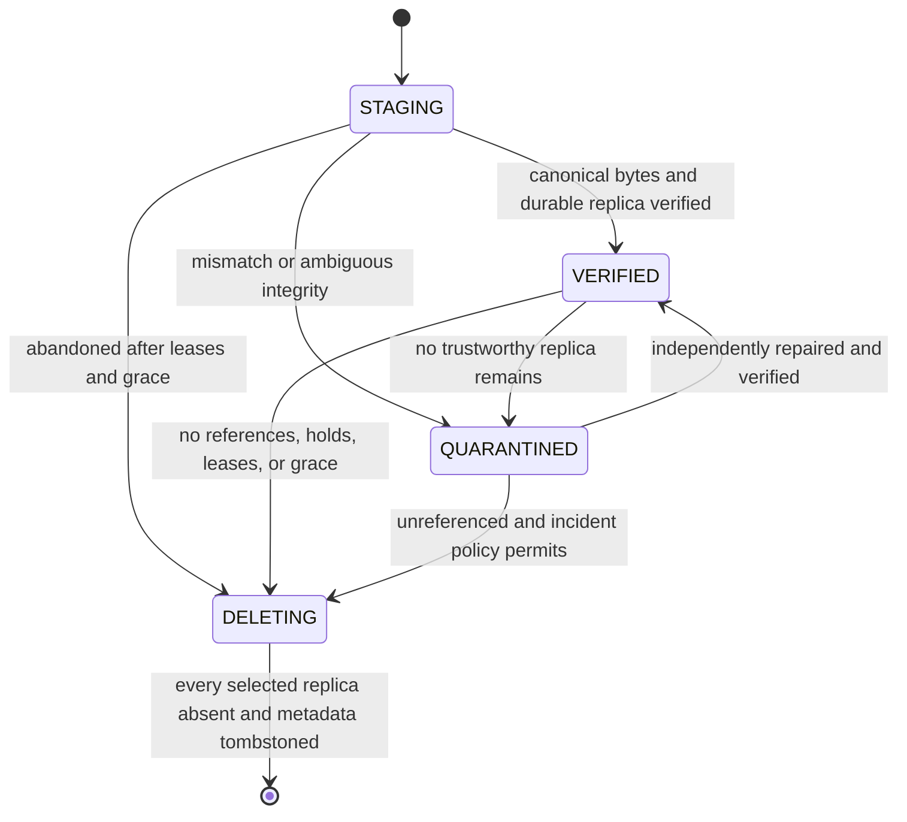
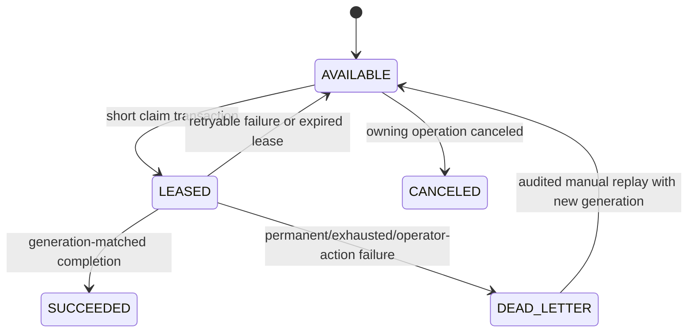

# Lưu trữ, vòng đời object, phiên bản và Thùng rác

Trạng thái: **Hợp đồng ObjectStore VALIDATED; adapter in-memory VALIDATED; adapter
filesystem cục bộ IMPLEMENTED/VALIDATED; subset persisted upload-session và
application-service IMPLEMENTED/VALIDATED; exact-offset HTTP upload transport
IMPLEMENTED/VALIDATED; content-read application service full/range trung lập
transport đã authorize theo owner IMPLEMENTED/VALIDATED; HTTP download
full/single-range đã authenticate IMPLEMENTED/VALIDATED; metadata
version-history bất biến listing/lookup IMPLEMENTED/VALIDATED; safe
historical-version restore IMPLEMENTED; metadata retention và purge execution
metadata-only cùng reference accounting theo FileVersion VALIDATED; planning
grace-period/lease và xóa Object/ObjectReplica vật lý nội bộ crash-safe đã
IMPLEMENTED/VALIDATED; GC-worker orchestration nội bộ có giới hạn và đối soát
operation bị kẹt IMPLEMENTED; auto-delete orphan vật lý không rõ NOT IMPLEMENTED;
nền tảng change journal bền vững theo owner/library đã IMPLEMENTED/VALIDATED;
checkpoint theo device và incremental change feed đã VALIDATED; bootstrap
snapshot/rebaseline logical materialized cũng đã VALIDATED; typed client
mutation submission, optimistic concurrency conflict detection, durable
idempotency và exact journal integration đã IMPLEMENTED; automatic conflict
resolution, filesystem observation và durable outbound intent capture đã
IMPLEMENTED; automatic outbound mutation submission, desktop GUI, download UI,
backup, sharing và lifecycle cấp cao vẫn NOT IMPLEMENTED/PLANNED**

Tài liệu này đặc tả hợp đồng lưu trữ byte chuẩn của Synveil và vòng đời logic
nằm bên trên hợp đồng đó. Tài liệu tuân theo các ADR đã được chấp thuận và sử
dụng ý nghĩa entity trong [DOMAIN_MODEL.md](DOMAIN_MODEL.md). Chi tiết giao thức
upload nằm trong [UPLOADS.md](UPLOADS.md), đồng bộ client nằm trong
[SYNC.md](SYNC.md), còn lịch sử backup được bảo vệ nằm trong
[BACKUP.md](BACKUP.md).

Bảng trạng thái dưới đây là ranh giới implementation của repository hiện tại.
Các phần lifecycle, upload, retention, reconciliation và backend còn lại vẫn là
tài liệu quy chuẩn kế hoạch trừ khi được đánh dấu khác.

| Capability | Trạng thái hiện tại của repository |
|---|---|
| Hợp đồng `ObjectStore` | `VALIDATED` |
| adapter in-memory | `VALIDATED` |
| adapter filesystem cục bộ | `IMPLEMENTED/VALIDATED` |
| persisted upload-session state | `IMPLEMENTED/VALIDATED` |
| resumable upload service trung lập transport | `IMPLEMENTED/VALIDATED` |
| exact-offset HTTP byte upload transport | `IMPLEMENTED/VALIDATED` |
| content-read service đã authorize trung lập transport (current và historical full/range) | `IMPLEMENTED/VALIDATED` |
| HTTP download full/single-range đã authenticate | `IMPLEMENTED/VALIDATED` |
| metadata version-history bất biến listing và lookup đã authenticate | `IMPLEMENTED/VALIDATED` |
| safe historical-version restore thành `FileVersion` bất biến mới đã authenticate | `IMPLEMENTED` |
| change-journal bền vững theo owner/library và bounded read service | `IMPLEMENTED/VALIDATED` |
| per-device checkpoints | `VALIDATED` |
| incremental change feed và acknowledgment | `VALIDATED` |
| logical snapshot/rebaseline bootstrap | `VALIDATED` |
| client mutation submission | `IMPLEMENTED` |
| optimistic concurrency conflict detection | `IMPLEMENTED` |
| filesystem observation | `IMPLEMENTED` |
| durable outbound intent capture | `IMPLEMENTED` |
| automatic outbound mutation submission | `NOT IMPLEMENTED` |
| automatic conflict resolution | `NOT IMPLEMENTED` |
| desktop GUI | `NOT IMPLEMENTED` |
| timestamp Trash chuẩn, retention status dẫn xuất và begin `PURGING` metadata-only | `IMPLEMENTED` |
| trusted metadata purge execution, release reference FileVersion và GC-candidate metadata | `IMPLEMENTED/VALIDATED` |
| GC grace-period, bounded claim, lease, revalidation và ready planning | `IMPLEMENTED/VALIDATED` |
| xóa vật lý nội bộ `Object`/`ObjectReplica` và cleanup object byte | `IMPLEMENTED/VALIDATED` |
| GC worker nội bộ, cycle cap, retry scheduling và đối soát operation bị kẹt | `IMPLEMENTED` |
| auto-delete orphan vật lý không rõ | `NOT IMPLEMENTED` |
| download UI | `PLANNED` |
| compression | `PLANNED` |
| filesystem optimization | `PLANNED` |
| client synchronization rộng hơn | `PLANNED` |
| backup | `PLANNED` |
| sharing | `PLANNED` |

## Nền tảng change journal bền vững đã implement

Boundary metadata hiện sở hữu một table chuẩn `change_journal`. Logical namespace
mutation trước hết lấy guard ngắn theo library trong transaction trước khi lock
bất kỳ `Node` nào; sau khi domain work sẵn sàng, writer transaction-local mới
lock library row, advance `journal_epoch`/`sync_head` và insert projection event
có type trong cùng PostgreSQL transaction. Boundary này áp dụng cho tạo
directory, rename, move, Trash, restore, finalize upload, restore version hoặc
purge metadata. Transaction thất bại sẽ không publish domain change hay journal
fact. PostgreSQL cũng reject UPDATE và DELETE trên `change_journal`; retention và
compaction cố ý chưa có.

Journal chỉ lưu logical ID, revision kết quả, projection parent/kind/state và
current version ID khi hữu ích. Nó không lưu object/replica key, filesystem path,
staging handle, credential hay file content. Purge dùng tombstone node tối thiểu
vẫn tồn tại sau khi Node và FileVersion bị xóa. GC lease nội bộ, retry, xóa
replica và cleanup vật lý không phải journal event.

`ChangeJournalService` cung cấp bounded reader trung lập transport theo owner đã
authorize, dùng keyset `sequence > cursor` và snapshot repeatable-read có
high-watermark. Cursor có integrity-check nhưng không phải credential
authorization; service vẫn phải nhận và verify owner đã authenticate riêng.
Public feed và checkpoint theo device xây trên boundary đã validate này. Route
client mutation authenticated hiện bổ sung một logical mutation strict mỗi
request với identity/fingerprint bền, precondition typed và journal integration
chính xác; nó không mang byte hay physical storage identity. Automatic conflict
policy và client apply engine vẫn là công việc tương lai; journal service tự nó
vẫn trung lập transport.

## Bootstrap logical đã implement không phải storage vật lý

Rebaseline Prompt 33 materialize một projection namespace logical trong
PostgreSQL. Nó không đọc/list `ObjectStore`, mở local filesystem, copy object,
tạo archive hay giữ file byte. Trong cùng transaction capture journal
epoch/resume sequence, service copy mỗi projection Node public hiện tại vào
manifest bất biến: Node/parent ID, logical name, kind, state
`ACTIVE`/`TRASHED`, revision, current version ID tùy chọn và byte length/SHA-256
đã public của current file. Canonical root được include; `PURGING` và row đã
purge bị loại.

Storage manifest cố ý không có Object/ObjectReplica ID, object key, staging
handle, filesystem path, backend version/locator, replica/GC state, credential
hay byte column. Nó không giữ full history FileVersion. Content endpoint hiện có
đã authorize theo owner hydrate current version sau khi client xử lý manifest
logical. Mutation hay collection Node/FileVersion/Object về sau không thể đổi
manifest đã capture vì row là value copy không có foreign key ngược tới record
mutable.

Paging chỉ đọc requested limit cộng một row theo immutable Node-ID order, không
load toàn library vào một Rust collection. Cleanup chỉ xóa bounded bootstrap
session đã retire cùng manifest row cascade; không bao giờ xóa journal, Library,
Node, FileVersion, Object, ObjectReplica hay dữ liệu ObjectStore. Do đó TTL
bootstrap là retention staging synchronization, không phải retention user data
hay backup.

## Phạm vi và quyền sở hữu

Workstream storage sở hữu:

- port `ObjectStore` và bộ kiểm thử tương thích adapter;
- chỉ tiếp nhận adapter filesystem cục bộ, NAS-mounted, tương thích S3/MinIO và
  storage adapter tương lai thông qua capability đã khai báo cùng bộ kiểm thử
  tương thích đó;
- việc sinh physical key mờ đục và metadata representation;
- promote object bền vững, đọc/range-read, verify, quarantine, quản lý replica,
  lease, đối soát và garbage collection;
- vòng đời `Node -> FileVersion -> Object`, bao gồm restore phiên bản;
- ngữ nghĩa metadata của Trash/Recently Deleted và điều phối purge;
- việc hạch toán storage logic, được giữ lại, đang staging và vật lý.

Module upload sở hữu transport có thể tiếp tục và gọi port storage. Module sync
sở hữu các fact trong journal và conflict policy. Module backup sở hữu manifest
snapshot và retention. Không module nào được gọi trực tiếp filesystem cục bộ
hoặc S3 SDK; chúng dùng application service của storage và port `ObjectStore`.

## Content read đã authorize theo owner được implement

`ContentReadApplicationService` là ranh giới application trung lập transport,
không phải HTTP endpoint. Nó resolve `Node` logic của owner active trước khi
mở một `ObjectStore` key opaque:

- current read chỉ theo `Node.current_version_id` của `FILE` active; node vắng
  mặt, cross-owner, trashed và purging dùng cùng outcome not-found được che
  giấu bình thường, còn directory mà owner nhìn thấy được báo rõ không phải
  file;
- historical full read chỉ được phép qua `FileVersion` bất biến đã authorize
  theo owner và gắn với file node active. Service không suy version từ path và
  không nhận object ID/key từ caller;
- PostgreSQL chỉ chọn một row `object_replicas` khớp backend khi state là
  `VERIFIED`, rồi đòi stored length và SHA-256 của replica bằng metadata
  `Object` chuẩn;
- service verify `ObjectStore` read trả đúng opaque key, full canonical length,
  SHA-256 và range được yêu cầu trước khi yield descriptor. Descriptor chỉ có
  logical ID an toàn, metadata bất biến, `ByteRange` tùy chọn và byte stream
  pull-driven; nó không có physical key, path, backend version hay staging
  handle; và
- full read dùng `ObjectStore::get`; range của current file dùng `ByteRange`
  đã parse và `ObjectStore::range_read` chỉ sau capability check cùng canonical
  bound check. Shared range type từ chối range rỗng/overflow, và range vượt
  canonical length bị từ chối trước khi mở storage. Không read method nào ghi
  metadata hoặc state storage.

Boundary HTTP download parse một byte range an toàn, tạo ETag immutable, đặt
content header an toàn cùng private no-store và stream body đã verify qua
service này. Boundary không expose direct object URL hay cung cấp browser UI.
Multi-range, `HEAD`, `If-Range` và download UI vẫn ngoài scope.

## Metadata version-history đã authorize theo owner được implement

Application boundary metadata expose lịch sử bất biến của một file active thuộc
owner qua `GET /api/v1/nodes/{node_id}/versions` và direct lookup qua
`GET /api/v1/versions/{version_id}`. Đây là authenticated read, không cần CSRF
và đặt `Cache-Control: private, no-store`.

Version resource public chỉ có immutable version ID, node ID, server commit
instant dưới tên `created_at`, `byte_length` dạng decimal unsigned chuẩn,
`sha256` chuẩn và cờ `is_current`. Nó không expose `Object` ID, object key,
replica ID, backend kind/version, staging handle, filesystem path hay physical
storage identity nào khác. Application service chỉ đọc metadata từ PostgreSQL
và không bao giờ mở `ObjectStore`.

History listing bị bounded và sắp newest-first theo
`(committed_at DESC, id DESC)`. Cursor là opaque, có scope theo node và mang cả
hai ordering key bất biến nên version có cùng timestamp không bị bỏ sót hoặc
lặp. `is_current` lấy từ pointer có thẩm quyền `Node.current_version_id`,
không suy ra từ timestamp hay ID lớn nhất. Direct lookup dùng chính ID mà
`/api/v1/versions/{version_id}/content` chấp nhận.

Contract visibility active-file hiện có được áp dụng: node/version unknown,
cross-owner, trashed và purging bị che giấu thành not found; directory mà owner
nhìn thấy là invalid state. History trong slice này là append-only. Bằng chứng
history và restore end-to-end PostgreSQL vẫn bị gate bởi
`SYNVEIL_TEST_DATABASE_URL`.

## Safe historical-version restore đã implement

`POST /api/v1/nodes/{node_id}/versions/{version_id}/restore` là mutation của
owner đã authenticate để restore một file version lịch sử. Request cần CSRF
proof của session, signed current-node `If-Match` và `Idempotency-Key` bounded.
Metadata application service thực hiện một PostgreSQL transaction lock và
recheck owner/library, file node active, source version được chọn, quan hệ
canonical object và một replica `VERIFIED` matching.

Khi thành công, service tạo đúng một `FileVersion` bất biến mới tham chiếu cùng
canonical `Object`, đặt parent là current version trước restore, advance
`Node.current_version_id` và revision node, rồi trả version metadata an toàn
cùng node concurrency metadata và ETag. Service không mutate historical row,
không đưa pointer lùi, không copy byte, không mở `ObjectStore` và không tạo
`UploadSession`. Check fail không để lại restore operation đã commit; retry của
commit sẽ replay outcome đã persist, còn dùng lại key cho request material khác
trả conflict. Purge, retention, synchronization, backup, sharing và UI vẫn
ngoài boundary này.

## Độc lập filesystem và tăng tốc theo capability

Synveil không yêu cầu Btrfs, WinBtrfs, một filesystem local cụ thể hay native
filesystem snapshot. Correctness model hướng tới NTFS, ReFS, APFS, Btrfs, ext4,
XFS, ZFS được hỗ trợ về sau, filesystem local generic, NAS-mounted filesystem
và S3-compatible/object backend theo adapter conformance gate.

Ranh giới local/backend dựa rõ trên capability:

```text
StorageBackend
    ↓ khai báo và chứng minh
StorageCapabilities
    ↓ cung cấp thông tin cho
portable correctness path và accelerator tùy chọn
```

`StorageCapabilities` có thể gồm:

```text
reflink                 block_clone
copy_on_write_clone     native_snapshot
compression             checksumming
sparse_files            atomic_rename
durable_fsync           range_reads
filesystem_health
```

Vocabulary capability và version evidence là contract của adapter. Application
logic phải branch theo evidence đã khai báo, không theo tên OS hoặc filesystem.
Thiếu capability thì dùng portable path đúng đắn, hiện unsupported rõ ràng hoặc
tắt tối ưu. Không capability nào được làm yếu guarantee commit, integrity,
retention, sync, backup, restore hay delete.

Btrfs có thể tăng tốc Linux qua reflink, compression, native snapshot, scrub
hoặc send/receive. NTFS/ReFS có thể có clone, integrity hoặc sparse-file native;
APFS có thể có file clone và snapshot phù hợp. Đây chỉ là tối ưu. Synveil
versioning không phải Btrfs snapshot, Synveil backup không phải APFS snapshot,
filesystem replication không phải Synveil sync. Identity, journal, object
reference, conflict, retention, integrity metadata, dedup và restore của
Synveil vẫn trung lập với backend.

Storage picker có thể discovery filesystem/capability, capacity, writable,
removable, layout nguy hiểm và health signal an toàn. UI Personal / Home Mode
chỉ cần hiện “Internal drive”, “External SSD”, capacity và health; `Settings →
Advanced` mới hiện NTFS/APFS/Btrfs, tên capability, backend hay durability
profile. Chọn storage không được âm thầm initialize path rộng hoặc bất ngờ.

## Các bất biến không thể thương lượng

1. Response commit content thành công tham chiếu tới một object bất biến có
   length chuẩn và SHA-256 đã được verify, đồng thời replica được chọn bền vững
   và đọc được theo hợp đồng backend của nó.
2. `FileVersion` chỉ tham chiếu tới `Object` ở trạng thái `VERIFIED`; object tạm,
   chưa hoàn chỉnh, `QUARANTINED` hoặc `DELETING` không bao giờ là file hiện tại.
3. Physical key do server sinh, mờ đục, có phiên bản và không liên quan tới tên,
   path, object ID hay plaintext hash của người dùng.
4. Byte của object là bất biến. Thay content tạo `FileVersion` mới và tạo object
   mới hoặc tái sử dụng object đã verify trong cùng dedup domain.
5. Rename hoặc move một `Node` không bao giờ copy hay rename byte object.
6. PostgreSQL là nguồn có thẩm quyền cho identity của object, reference logic,
   trạng thái vòng đời, lease và work. Listing backend là bằng chứng đối soát,
   không bao giờ là nguồn sự thật duy nhất.
7. Không operation nào commit database reference trước khi byte được tham chiếu
   trở nên bền vững. Ghi bền vững rồi database rollback tạo ra một orphan
   candidate an toàn, không tạo file nhìn thấy được.
8. Xóa object gồm hai phase, có kiểm tra generation, bị trì hoãn bởi safety
   window và chỉ được phép sau khi đã chứng minh không còn bất kỳ authoritative
   reference, hold hay lease chưa hết hạn nào.
9. Cột reference count có thể thay đổi có thể là một tối ưu, nhưng không bao giờ
   là bằng chứng đủ để xóa.
10. Authorization bắt đầu từ một logical resource đã xác thực. Object ID,
    storage key, hash, backend ETag hoặc việc sở hữu range URL không phải là
    authorization grant.
11. Logical quota độc lập với phần tiết kiệm từ dedup. Content giống nhau không
    được làm thay đổi hành vi API, tiết lộ timing hay kết quả quota của owner
    khác.
12. Corruption phải fail closed: Synveil quarantine replica hỏng và không bao
    giờ cố ý phục vụ byte hỏng như content hợp lệ.

## Mô hình logic và vật lý

```text
Library
  -> Node (file hoặc directory ổn định mà người dùng nhìn thấy)
      -> current FileVersion (metadata revision bất biến)
          -> Object (identity content chuẩn bất biến)
              -> ObjectReplica (backend + key mờ đục + representation)
```

Một `Object` là metadata về tính bằng nhau và vòng đời của byte plaintext chuẩn.
Một `ObjectReplica` là một representation được lưu của các byte đó. Deployment
cục bộ ban đầu thường có một replica, nhưng việc tách riêng hai khái niệm cho
phép migration storage có verify, repair, phân tầng và redundancy tương lai mà
không thay đổi `FileVersion.object_id`.

Tuple so sánh bằng nhau ban đầu là:

```text
(dedup_domain_id, hash_algorithm = SHA-256, plaintext_length, plaintext_hash)
```

Identity của representation còn bao gồm codec, tham số/phiên bản codec, scheme
encryption/key version, stored length và checksum byte đã lưu. Backend ETag là
bằng chứng adapter mờ đục; không bao giờ được coi là SHA-256 hay identity
content. Nghi ngờ hash collision, hash bằng nhau nhưng length khác nhau hoặc kết
quả verify bất đồng sẽ tạo một candidate riêng bị quarantine và một integrity
incident mà operator nhìn thấy. Trường hợp này không bao giờ ghi đè object hiện
có. Vì vậy constraint equality thông thường chỉ áp dụng một phần cho các row
`VERIFIED` chuẩn thông thường; collision candidate bị quarantine mang một
incident/discriminator và không thể được tham chiếu. Collision SHA-256 cùng
length đã xác nhận đòi hỏi migration identity/format thứ cấp đã review và vô
hiệu hóa aliasing cho các byte đó thay vì ép một row đi qua uniqueness rule
thông thường.

### Hình dạng physical key được khuyến nghị

Key generator phát ra layout version đã đăng ký cùng các component ngẫu
nhiên/mờ đục, ví dụ:

```text
objects/v1/7f/2a/<opaque-random-key>
staging/v1/uploads/<opaque-session-key>/<opaque-part-key>
```

Ví dụ này không phải public contract. Client không bao giờ thấy hoặc dựng key,
và migration layout không làm đổi public ID. Component được sinh dùng alphabet
nghiêm ngặt phía server; không component path không tin cậy nào đi vào key. Một
key chỉ dùng cho một representation bất biến và không bao giờ được tái sử dụng,
kể cả sau khi xóa.

## Port `ObjectStore`

Port hỗ trợ streaming và nhận biết capability. Các Rust type chính xác thuộc về
hợp đồng crate đã review, nhưng các operation về mặt ngữ nghĩa là:

| Operation | Ngữ nghĩa bắt buộc |
|---|---|
| Begin staged write | Tạo staging target độc quyền có tên do server đặt và trả về handle mờ đục. Collision không thể ghi đè byte. |
| Stream staged bytes/part | Áp dụng giới hạn length đã khai báo và quan sát được trong khi hash với memory có giới hạn. Failure không để lại object đã commit. |
| Inspect staged state | Trả về bằng chứng adapter cần cho retry an toàn; trạng thái không tồn tại phải được biểu diễn rõ. |
| Abort staging | Xóa/hủy theo cách idempotent một staging handle đã biết, bao gồm native multipart upload. |
| Finalize immutable | Tạo một final key không bao giờ bị ghi đè và durability receipt. Retry trùng lặp trả về cùng receipt hoặc chứng minh key đã finalize. |
| `HEAD` immutable | Trả về tồn tại, stored length, checksum/metadata representation và bằng chứng version backend mờ đục. |
| Read/range-read | Stream byte logic đã authorize với memory có giới hạn và hành vi range chính xác; không bao giờ trả partial success như full object. |
| Delete immutable | Chỉ xóa key được server authorize cùng generation/version replica dự kiến; không tồn tại là idempotent success. |
| Enumerate owned prefix | Hỗ trợ đối soát khi có thể. Tính nhất quán listing được khai báo và listing không bao giờ được dùng để authorize hoặc thiết lập reference mới commit. |

Một durability receipt chứa ít nhất backend ID, final opaque key, stored length,
stored-byte checksum và algorithm, format và version của representation, bằng
chứng object/version backend, thời điểm hoàn tất và những durability check đã
khai báo nào thành công. Chỉ application service mới có thể chuyển receipt đó
thành record object/replica `VERIFIED`.

### Khai báo capability

Mỗi backend được cấu hình phải khai báo và chứng minh qua conformance test:

- hỗ trợ atomic promotion, nếu có;
- hỗ trợ tạo conditional/exclusive;
- hỗ trợ native multipart cùng các quy tắc part tối thiểu/tối đa;
- các checksum algorithm đáng tin cậy và chúng có bao phủ object hoàn chỉnh hay
  không;
- hành vi read-after-write đối với key đã hoàn tất;
- tính nhất quán và hành vi phân trang của listing;
- hỗ trợ delete có điều kiện/có version;
- hành vi range-read;
- bảo đảm durability-flush mà adapter cung cấp;
- object size và metadata limit tối đa.

Application code phân nhánh theo capability tường minh. Code không được suy ra
capability từ tên adapter và không được hạ thấp bảo đảm success khi backend yếu
hơn. Adapter không chứng minh được read-after-write/durability bắt buộc phải trì
hoãn success, dùng workflow verify mạnh hơn hoặc không đủ điều kiện cho write
production.

## Adapter filesystem cục bộ

Adapter production đầu tiên được implement trong
`crates/storage/src/local.rs` và được export lại qua storage composition crate.
Hợp đồng root tường minh của nó đã được validate trên host hiện tại bằng
primitive filesystem Rust/Tokio portable:

- `LocalFilesystemObjectStore::open` chỉ nhận root absolute được truyền tường
  minh, giữ dạng canonical đã resolve, tạo marker layout Synveil cùng `objects/`
  và `staging/`, từ chối root filesystem, home/profile người dùng,
  current-directory và source-workspace tại thời điểm build, đồng thời không
  recursive-clean content không rõ chủ sở hữu. Marker chứng minh đúng version
  local adapter/layout; việc gắn nó với record `StorageBackend` bền vững vẫn
  thuộc tầng cao hơn.
- Physical path được sinh từ SHA-256 của `ObjectKey` opaque đã validate, không từ
  filename, public ID, MIME type hay caller path. Layout nội bộ là
  `objects/v1/<hash-prefix>/<key-hash>/` với content, metadata và committed
  marker; client không thấy layout này.
- Mỗi staging handle là tên opaque dựa trên UUID. Byte được stream vào file
  `.upload` exclusive, hash và kiểm tra length bằng memory bounded, sau đó được
  freeze thành `.verified` cùng metadata record bounded. Staging không xuất hiện
  trong đọc final object và staging cũ không bị tự động xóa.
- Promotion verify lại staged bytes, tạo final directory và content bằng
  hard-link create-only trong cùng root, ghi metadata rồi ghi committed marker
  sau cùng. Key committed đã tồn tại trả về conflict ổn định; không có fallback
  copy cross-device âm thầm làm yếu an toàn promotion. Directory chưa hoàn tất
  không có committed marker tiếp tục vô hình và được quarantine thay vì bị ghi
  đè hay tự động xóa.
- Full read stream qua buffer bounded và validate SHA-256 đã lưu; range read
  validate logical range và toàn bộ object trước khi stream riêng range đó.
  Metadata chỉ trả các field của contract. Delete và conditional delete chỉ
  tác động đúng opaque key committed. So sánh và xóa có điều kiện được serialize
  giữa các clone của một adapter instance; không tuyên bố atomic giữa các
  process độc lập, và các process đó không được mutate đồng thời cùng local root.
- Adapter gọi `sync_all` cho staged content, metadata có giới hạn và commit
  marker. Khi probe lúc open chứng minh directory synchronization, adapter cũng
  sync transition staging đã hoàn tất, chuỗi directory promotion và visibility
  của delete trước khi báo success. `DurableFsync` đòi file-sync probe, còn
  `DurableFlush` đòi thêm directory-sync và same-root hard-link promotion probe.
  Các capability này mô tả hành vi quan sát được, không suy ra từ tên OS.
  Compression, snapshot, reflink/block clone và filesystem-health acceleration
  được đánh dấu unsupported rõ ràng. Unit/conformance test exercise các code
  path này nhưng không phải bằng chứng crash khi mất điện.
- Trên Windows, directory barrier mở directory managed bằng flag native cho
  directory handle là `FILE_FLAG_BACKUP_SEMANTICS` và
  `FILE_FLAG_OPEN_REPARSE_POINT`, yêu cầu write access mà `FlushFileBuffers`
  cần, rồi dùng cùng barrier `sync_all` như phần còn lại của adapter. Đây là
  probe và runtime path thật, không phải override capability riêng cho Windows:
  nếu mở hoặc flush directory thất bại, `DurableFlush` vẫn unsupported và
  upload service từ chối store.
- Managed directory/file được kiểm tra bằng metadata no-follow, bao gồm path
  nhạy cảm với Windows reparse/symlink khi standard API cung cấp bằng chứng.
  Portable API không thể loại bỏ mọi TOCTOU race giữa process, nên ownership và
  permission deployment vẫn bắt buộc.

Adapter, upload service trung lập transport và content-read service đã
authorize theo owner đã được validate bằng contract/conformance hoặc focused
application test. HTTP transport exact-offset đã authenticate stream request
frame có giới hạn qua upload service; route download full/single-range cũng
stream content đã verify qua content-read service. API không expose storage key
hay physical path. Pipeline object-GC nội bộ đã
`IMPLEMENTED/VALIDATED`: metadata-only planning, physical execution
`Object`/`ObjectReplica` an toàn khi crash và worker private bounded không có
HTTP control surface. Download UI, lifecycle object rộng hơn ngoài pipeline nội
bộ này, sync, backup và installer deployment vẫn là `PLANNED`. Transaction finalization
PostgreSQL của upload service chỉ tạo `FileVersion` nhìn thấy được đầu
tiên sau khi object đã durable và được verify. NAS và filesystem khác vẫn cần
capability/crash evidence riêng trước khi tuyên bố production support.

Startup không scan đệ quy toàn bộ content trước khi phục vụ. Nó validate
identity/configuration và lập lịch đối soát có giới hạn. Object được tham chiếu
nhưng thiếu làm readiness degraded hoặc failed tùy phạm vi; không bao giờ âm
thầm tạo lại chúng thành file rỗng.

## Adapter tương thích S3

S3/MinIO là adapter về sau, không phải dependency deployment giai đoạn đầu. Hợp
đồng của nó cố ý khác filesystem:

- Dùng final key chưa từng được dùng trước đó. Không mô phỏng rename bằng
  copy-and-delete rồi gọi đó là atomic promotion.
- Native multipart upload vẫn là staging cho đến khi complete thành công. Lưu
  upload identifier và part receipt dưới dạng dữ liệu adapter mờ đục; abort là
  idempotent và cleanup cũng liệt kê các multipart upload bị bỏ dở để phòng vệ.
- Sau completion, thực hiện `HEAD`/read verification mà capability yêu cầu trước
  khi metadata commit. Lời gọi complete bị mất response được recovery bằng cách
  inspect final key đã gán trước; không xử lý bằng cách mù quáng tạo key thứ hai.
- Không bao giờ diễn giải multipart ETag là plaintext MD5 hay SHA-256. Hỗ trợ
  checksum của các hệ tương thích S3 khác nhau; SHA-256 chuẩn được tính hoặc
  verify độc lập qua upload protocol.
- Ghi provider version ID khi bucket versioning được bật, nhưng không yêu cầu
  versioning để đảm bảo object immutability. Conditional creation và delete
  dùng precondition do adapter hỗ trợ khi có.
- Listing có thể trễ. `HEAD` trực tiếp một key đã biết và record PostgreSQL điều
  khiển recovery; listing lặp có giới hạn chỉ là bằng chứng orphan.
- Signed URL cho direct upload/download không phải shortcut ban đầu. Nếu bật về
  sau, chúng đòi hỏi extension ADR/protocol bao quát proof checksum, enforcement
  content-length, expiry, giới hạn revocation, authorization, audit và ngăn
  content-presence oracle.

## State machine của object và replica

### Trạng thái object



Chỉ `VERIFIED` mới có thể nhận authoritative reference mới. Chuyển sang
`DELETING` lock row object và đóng gate đó. Recovery không chuyển object
thiếu/hỏng về `VERIFIED` nếu không có bằng chứng verify mới.

### Trạng thái replica

```text
COPYING -> VERIFIED -> DELETING -> deleted/tombstoned
    |          |
    v          +-> MISSING
  CORRUPT <--------+
```

Phải có ít nhất một replica `VERIFIED` để object tiếp tục đọc được. Nếu một
replica fail nhưng replica khác verify được, read route tới replica lành và một
repair job được ghi bền vững. Nếu không replica nào verify được, object bị
quarantine và mọi logical reference bị ảnh hưởng vẫn được giữ để operator
recovery.

### Object lease

Lease bảo vệ công việc không phải reference như assembly upload, snapshot đang
build, active restore, migration copy hoặc integrity repair. Mỗi lease có
identity object/staging, purpose, owner operation ID, generation và expiry có
giới hạn. Renewal có điều kiện theo generation. Worker stale không thể gia hạn
hoặc release lease của successor. Lease hết hạn và được đối soát; lease không
thay thế `FileVersion` đã commit hay reference `BackupEntry`.

## Commit content theo thứ tự bền vững trước

Commit content là một saga nhỏ với bước kết thúc nguyên tử trong PostgreSQL:

1. Lưu intent của operation/session, destination, base condition, quota
   reservation, final key gán trước và idempotency identity.
2. Stream/assemble vào staging với resource có giới hạn.
3. Tính length/SHA-256 chuẩn, finalize một representation bất biến và nhận
   durability receipt.
4. Verify key cuối đã biết qua backend được chọn. Lưu đủ bằng chứng receipt cho
   recovery trước khi thử logical commit.
5. Trong một database transaction, lock operation và các logical row bị ảnh
   hưởng; revalidate authorization, base version/revision, name và quota; chọn
   hoặc tạo `Object` trong dedup domain; tạo hoặc attach `ObjectReplica` đã
   verify để bind receipt backend/key/representation được chọn với object đó
   (hoặc ghi representation không được chọn cho orphan disposition được grace
   bảo vệ); tạo logical reference cùng `FileVersion`/binding backup manifest
   bất biến; cập nhật current logical state; append journal, audit, job/outbox
   bắt buộc, accounting và idempotent outcome.
6. Commit, rồi trả về outcome đã lưu. Consumer tùy chọn chạy sau.

Nếu bước 3 fail, không metadata nào nhìn thấy được. Nếu bước 3-4 thành công nhưng
bước 5 rollback, final key là orphan candidate được operation lease và global
orphan grace bảo vệ. Retry cùng operation sẽ tái sử dụng/re-verify key đó. Nếu
bước 5 commit và process crash trước khi response, lookup idempotency trả về
chính xác ID, ETag và kết quả journal đã commit.

Không giữ PostgreSQL transaction mở trong khi upload, hash object lớn, copy
replica, gọi S3 hoặc chờ worker.

## Deduplication toàn object

Deduplication chỉ diễn ra sau khi server verify. Commit transaction tìm object
`VERIFIED` hiện có cùng equality tuple trong cùng `dedup_domain_id`:

- Nếu có object đáng tin cậy, tạo logical reference mới tới nó và để
  representation mới ghi đã verify trở thành delayed orphan, hoặc gắn nó làm
  replica được mong muốn tường minh. Lựa chọn không được ảnh hưởng response theo
  cách làm lộ content ngoài domain.
- Nếu các transaction concurrent race, unique constraint trên equality tuple
  chọn một canonical object. Bên thua đọc lại bên thắng và commit logical
  reference của mình; byte không được chọn của nó vẫn là orphan data được grace
  bảo vệ.
- Không bao giờ chấp nhận client hash làm bằng chứng byte đã tồn tại. Tối ưu bỏ
  qua upload cần proof-of-possession protocol đã review và phải nằm trong dedup
  domain.
- Restore version cũ hoặc tái sử dụng backup entry không đổi sẽ thêm reference
  mà không copy byte.

Deduplication cấp chunk là capability nâng cao `PLANNED`, không phải storage
profile ban đầu. Nó làm thay đổi blast radius của corruption, format manifest,
range read, encryption, GC và repair, đồng thời đòi hỏi ADR riêng được chấp
thuận, lý do đo được và kế hoạch migration storage-format trước implementation.

## Policy compression representation

Compression là tối ưu physical representation `PLANNED` cho Phase 6. Correctness
profile ban đầu lưu canonical byte theo pass-through. Bật hay đổi codec không
bao giờ làm thay đổi `Node`, `FileVersion`, canonical plaintext length/SHA-256,
retention, authorization hay sự thật logical quota.

Codec candidate đầu tiên là Zstandard với một tập profile tham số nhỏ, có
version. Việc lựa chọn có tính xác định và dựa trên policy:

1. Coi MIME type và filename extension là hint không tin cậy. Dùng sample có
   giới hạn cùng allowlist/denylist, minimum size, maximum CPU/concurrency
   budget và ngưỡng expected space-saving.
2. Text, JSON, CSV, log, database dump và source code chỉ là candidate có khả
   năng sau khi có số đo corpus. Không mù quáng recompress JPEG, WebP, AVIF,
   MP4, MKV, ZIP, 7z, representation khác đã nén hoặc encrypted data.
3. Fallback về pass-through khi sampling mơ hồ, compression làm data lớn hơn,
   codec/version không có, chạm resource limit hoặc không thể đáp ứng active
   range-read profile.
4. Ghi decision và algorithm generation để cùng object vẫn đọc được sau policy
   change. Policy mới ảnh hưởng replica mới/re-encoded, không ảnh hưởng cách
   diễn giải representation hiện có.

Mỗi `ObjectReplica` đã nén ghi ít nhất:

- format/version representation (`IDENTITY` hoặc named Zstandard profile), codec
  parameter/dictionary identity nếu dictionary từng được cho phép;
- canonical plaintext length và SHA-256 từ `Object`;
- stored representation length và independent stored-byte checksum;
- identity seek/chunk index có version tùy chọn và encoded logical range;
- backend/key, thời điểm create/verify và reader compatibility floor.

Read stream qua decoder có giới hạn và verify declared length. Full read có thể
verify canonical SHA-256; stored checksum phát hiện corruption representation
trước hoặc trong decoding. Decoder reject output vượt declared plaintext
length, expansion quá mức, malformed frame, unsupported dictionary hoặc
configured resource limit, để representation hỏng không thể trở thành
decompression bomb.

Transparent decompression không biện minh cho false range promise. Whole-object
Zstandard thường làm arbitrary logical range read tốn kém. Backend chỉ có thể
advertise logical `Accept-Ranges` khi pass-through storage hoặc format
chunk/seek có version, decodable độc lập đáp ứng requested range với bounded
work. Nếu không, compression vẫn disabled cho profile đó tới khi
OD-STORAGE-003 được đóng.

Whole-object deduplication so sánh verified canonical plaintext identity trước
khi chọn representation, nên equal content có thể tham chiếu một `Object` kể cả
khi replica dùng codec generation khác nhau. Physical saving từ dedup và
compression được đo riêng; người dùng thấy ước lượng logical/retained, staged,
physical và saved-byte mà không tối ưu nào làm đổi semantic quota hay retention.

Nếu application-managed encryption được bật về sau, readable content được nén
trước khi encryption. Ciphertext không thể nén hữu ích, và E2EE mode không thể
âm thầm giữ promise server-side compression/dedup/indexing. Re-encoding là
asynchronous replica migration: ghi, decode và verify immutable representation
mới, switch/thêm selected replica trong transaction, chờ qua lease/rollback
grace rồi retire representation cũ. Export và restore luôn tạo canonical
plaintext byte sau authorization.

## Hợp đồng versioning

Content hiện tại của file là một `FileVersion` bất biến; lịch sử của nó không
bao giờ bị viết lại.

| Operation | Tác động lên phiên bản |
|---|---|
| Create file | Tạo phiên bản đầu tiên và trỏ node mới tới đó theo cách nguyên tử. |
| Replace/sync edit | Tạo child version từ base đã chấp nhận và cập nhật node head theo cách nguyên tử. |
| Rename/move | Chỉ tăng node metadata revision; không tạo content version. |
| Copy | Tạo node mới và record `FileVersion` mới có thể tham chiếu cùng object; không dùng chung mutable node identity. |
| Restore old version | Tạo head version mới tham chiếu byte object lịch sử và ghi source `RESTORE`; không bao giờ lùi head pointer để viết lại lịch sử. |
| Conflict | Bảo toàn byte incoming trong conflict version/node theo [SYNC.md](SYNC.md); không bao giờ âm thầm thay winning head. |
| Trash | Giữ version và object reference trong suốt retention của Trash. |
| Purge eligibility / begin | Chọn metadata đủ điều kiện theo batch bounded và chuyển một node sang `PURGING`; `FileVersion`, `Object`, `ObjectReplica` và byte vẫn nguyên vẹn. Physical GC là execution nội bộ tách riêng; bước này không tự xóa byte. |
| Metadata purge execution | Yêu cầu `PURGING`, recheck invariant owner/library/root/parent/child/revision, xóa nguyên tử Node cùng mọi FileVersion của nó và ghi candidate metadata-only cho Object mất reference FileVersion cuối; row object, replica và byte vẫn giữ nguyên. |

Mỗi content mutation cung cấp base version phù hợp với operation. Node revision
bảo vệ metadata mutation. Cả `Object` ID lẫn physical key của `ObjectReplica`
đều không bao giờ làm concurrency token.

Version retention policy phải tường minh và có phiên bản. Policy có thể giữ tất
cả, giữ theo duration/count hoặc đặt hold, nhưng không thể xóa current version,
version cần cho retained snapshot, conflict vẫn được hiển thị cho người dùng
hoặc bất kỳ protected reference nào khác. Retention trước hết làm logical
reference hết hạn; object GC sau đó xác định byte có thể xóa vật lý hay không.

## Trash / Recently Deleted

Trash là soft deletion người dùng nhìn thấy trong live sync domain. Nó không
phải backup retention và không phải physical deletion.

Trạng thái implementation của metadata API hiện tại: logical trash một node
đơn lẻ đã implement, root được bảo vệ và directory không rỗng bị reject bằng
conflict ổn định. Recursive subtree trash cố ý chưa implement cho tới khi
subtree precondition và contract edit descendant concurrent trong `SYNC.md`
OD-SYNC-004 được đóng. Việc bắt đầu purge không xóa row `FileVersion` hoặc
`Object`; execution sau `PURGING` là một metadata operation trusted riêng.

### Contract retention metadata đã implement

Timestamp Trash chuẩn được persist tại `nodes.trashed_at`. Server ghi timestamp
quan sát được khi node `ACTIVE` chuyển sang `TRASHED`, giữ nguyên khi node ở
`PURGING`, và clear khi restore về `ACTIVE`. Một `TrashRetentionPolicy` duy nhất
có default 30 ngày; deployment có thể override bằng số giây qua
`SYNVEIL_TRASH_RETENTION_SECONDS`. Default là policy có thể cấu hình, không phải
protocol promise bất biến. `restore_deadline` được derive từ
`trashed_at + retention_duration` và không persist trùng lặp.

Eligibility chỉ dùng server time với boundary inclusive
`now >= restore_deadline`. Chỉ node non-root `TRASHED` có timestamp chuẩn, thuộc
library active cùng parent active đã authorize và không có child row mới được chọn. Node `ACTIVE`,
đã restore, root, thiếu timestamp và node đã `PURGING` đều bị loại. Vì logical
Trash hiện tại reject directory không rỗng, candidate query cũng loại directory
còn child và không bao giờ orphan descendant.

`TrashRetentionService` nội bộ cung cấp candidate scan bounded, dùng opaque v1
keyset cursor riêng, thứ tự ổn định `(trashed_at ASC, node_id ASC)` và page tối
đa 500. `begin_node_purge` lock owner, library và node trong cùng transaction,
kiểm tra revision kỳ vọng cùng retention cutoff rồi chỉ chuyển metadata sang
`PURGING`. Retry với revision hiện tại là idempotent; revision cũ trả conflict
xác định. Begin contract này không xóa, detach hay gửi tới `ObjectStore` bất kỳ
`Node`, `FileVersion`, `Object`, `ObjectReplica`, object reference hay object
byte nào.

### Metadata purge execution đã implement

`execute_metadata_purge` là trusted service operation nội bộ; không phải public
HTTP route và không có capability `ObjectStore`. Operation chỉ nhận node thuộc
owner, revision kỳ vọng và node đã ở `PURGING`. Trong một PostgreSQL transaction,
service kiểm tra lại owner/library/root/parent/child, upload-parent reference
đã persist và revision, clear current-version pointer của node, xóa
restore-operation row của node, chỉ xóa metadata `Node` và `FileVersion` của
node đó, rồi ghi canonical Object identity có reference `FileVersion` vừa bị
release vào `object_gc_candidates`. Operation không bao giờ xóa row object,
row replica hay object byte. Candidate chỉ ghi canonical Object identity; sự
tồn tại của replica không phải logical reference và không ngăn candidate
zero-reference. Upload session đã persist mà target node là create parent sẽ
block purge cho tới khi lifecycle staging/session độc lập release FK; nó không
được tính là committed `FileVersion` reference.

Bảng candidate chỉ là metadata handoff: physical object GC vẫn là workflow riêng
và phải tự kiểm tra retention, lease, hold, backup và reconciliation. Purge
thành công chỉ giữ replay identity nhỏ gọn gồm owner/node/revision. Retry cùng
revision trả successful replay result; revision khác trả conflict. Replay record
không chứa filename, path, content hay credential. Khi một `FileVersion` mới
reference lại object đang là candidate, candidate được clear trong cùng
transaction. PostgreSQL advisory và row lock serialize quyết định release và
re-reference cho canonical object dùng chung giữa các library.

### GC eligibility và lease planning đã implement

Prompt 27 implement phần planning metadata-only của object GC. `ObjectGcPolicy`
typed dùng grace period 24 giờ, worker lease 15 phút và claim batch mặc định
100 (giới hạn cứng 500). Deployment có thể override bằng
`SYNVEIL_OBJECT_GC_GRACE_SECONDS`, `SYNVEIL_OBJECT_GC_LEASE_SECONDS` và
`SYNVEIL_OBJECT_GC_MAX_BATCH_SIZE`. Duration bằng zero/không hợp lệ và batch
ngoài bound đều bị reject. `clock_timestamp()` của PostgreSQL là authoritative;
quy tắc grace inclusive là `now >= unreferenced_at + grace_period`.

`ObjectGcPlanningService` nội bộ, trung lập transport, expose claim candidate
có bound, renew lease, release an toàn, revalidate reference và planning
metadata-only sang `READY`. Claim dùng `FOR UPDATE SKIP LOCKED` theo thứ tự ổn
định `(unreferenced_at ASC, object_id ASC, dedup_domain_id ASC)`. Mỗi row được
recheck theo lock order canonical candidate row -> advisory Object -> Object
row; chỉ khi không có `FileVersion` committed mới tạo lease. Lease ID là UUIDv7
mờ đục; generation lưu trong DB tăng dần và generation cũ không được renew,
release hay revalidate successor. `LEASED`/`READY` hết hạn có thể reclaim; lease
còn hạn chặn claim khác.

`READY` chỉ là metadata state có thể revoke, không phải delete command. Khi có
`FileVersion` mới commit, candidate `ELIGIBLE`, `LEASED` hoặc `READY` bị clear
theo cùng lock order, nên worker resume sau cancellation chỉ gặp stale lease
hoặc candidate đã mất. Revalidation và ready planning đều lặp lại `NOT EXISTS`
FileVersion authoritative. Executor vật lý lặp lại final check sau khi lấy
action fence riêng và chỉ dùng lease/generation planning như capability, không
phải delete command.

### Physical GC execution đã implement

`ObjectGcExecutionService` là application boundary nội bộ có
`start_gc_execution`, `delete_next_replica`/`reconcile_replica` mỗi lần đúng
một replica, resume và completion. Start yêu cầu `READY` và lease/generation
matching còn hạn. Transaction PostgreSQL ngắn lock candidate cùng Object,
lặp lại zero-reference `FileVersion` và active-hold check, ghi
`object_gc_operations` và `object_gc_replica_actions` theo thứ tự xác định,
đổi replica verified sang `DELETING` và Object sang `GC_DELETING` trước external
side effect.

Trước mỗi external delete executor renew lease rồi lặp proof candidate/Object/
action. Nó chỉ route backend kind đã persist tới adapter `ObjectStore` đã cấu
hình, validate opaque key cùng length/SHA-256/backend version expected và dùng
conditional delete khi adapter chứng minh capability. Một action được persist
fenced trước một delete call; ambiguity được đối soát bằng `reconcile_delete`,
không byte read hay đoán. Chỉ exact absence, kể cả replica đã absent, mới dọn
row `ObjectReplica`; retryable presence, delete in progress, unknown và
evidence mismatch là recovery state bền.

Adapter local rename object directory được managed/hashed sang tombstone riêng
`.deleting` trước khi remove file. Nó reject entry redirect/không mong đợi,
trả tombstone bị ngắt là `InProgress`, và chỉ báo absence khi content, commit
marker, metadata và tombstone directory đều mất. Sau mọi action `DELETED`, một
transaction cuối recheck reference/hold/lease, xóa candidate/Object và mark
operation `COMPLETED`. `object_gc_holds` là boundary tương lai: producer
backup/share/sync chưa implement và phải đăng ký active hold trước khi coexist
với physical GC. Không có public GC API. Worker opt-in bên dưới là scheduler
runtime duy nhất và là process nội bộ, không phải control xóa dành cho người
dùng thông thường.

### GC worker nội bộ và reconciliation có giới hạn đã implement

`GcWorker` là coordinator trung lập transport nằm trên
`ObjectGcPlanningService`, `ObjectGcExecutionService` và repository recovery
chỉ PostgreSQL. Nó không có filesystem path hay capability xóa trực tiếp qua
`ObjectStore`. Runtime composition là binary private `synveil-worker`; binary
không có HTTP listener và bị disable cho tới khi được bật tường minh.

`run_once()` là application/test boundary xác định. Một cycle khi enabled trước
hết tạo report reconciliation chỉ từ metadata có giới hạn, sau đó reclaim
operation incomplete đến hạn theo thứ tự update cũ nhất. Nếu có recovery claim,
planning candidate mới chờ cycle sau. Nếu không, worker claim một slice new-work
có giới hạn. Mỗi operation được chọn chỉ nhận tối đa một bước replica vật lý
trong cycle. Slice nonterminal release planning lease để cycle đến hạn tiếp theo
reclaim lease/generation opaque mới thay vì giữ lease do worker sở hữu khi ngủ.

Các environment variable sau được validate trước khi worker chạy. Mọi duration
là giây nguyên; giá trị invalid, zero, mâu thuẫn hoặc ngoài range làm config
parse fail.

| Variable | Default | Mục đích |
|---|---:|---|
| `SYNVEIL_GC_WORKER_ENABLED` | `false` | Opt-in rõ ràng cho worker private. |
| `SYNVEIL_GC_WORKER_CYCLE_INTERVAL_SECONDS` | `60` | Delay tối thiểu giữa các cycle hoàn tất; không polling sub-second. |
| `SYNVEIL_GC_WORKER_MAX_CANDIDATE_CLAIMS` | `8` | Claim planning mới mỗi cycle. |
| `SYNVEIL_GC_WORKER_MAX_ACTIVE_OPERATIONS` | `2` | Số operation slice xét trong mỗi cycle. |
| `SYNVEIL_GC_WORKER_MAX_REPLICA_ACTIONS` | `4` | Cap cho replica step/reconciliation inspection mỗi cycle. |
| `SYNVEIL_GC_WORKER_MAX_CONCURRENT_EXECUTIONS` | `2` | Tối đa task operation concurrent; không vượt active operation. |
| `SYNVEIL_GC_WORKER_MAX_CONCURRENT_REPLICA_DELETES` | `1` | Semaphore toàn worker process cho storage side effect; không vượt execution. |
| `SYNVEIL_GC_WORKER_RETRY_BASE_SECONDS` / `SYNVEIL_GC_WORKER_RETRY_MAX_SECONDS` | `30` / `900` | Cửa sổ retry exponential có giới hạn. |
| `SYNVEIL_GC_WORKER_MAX_ATTEMPTS` | `12` | Số attempt action bền tối đa trước intervention. |
| `SYNVEIL_GC_WORKER_SHUTDOWN_TIMEOUT_SECONDS` | `30` | Thời gian drain tối đa cho cycle hiện tại. |

Retry state thuộc replica action bền: `attempt_count` và `next_attempt_at` dùng
giờ PostgreSQL. Storage presence retryable, delete đang tiến hành, response
ambiguous/reconciliation-required, database unavailable và outcome lease stale/
expired không tạo completion. Delay exponential, cap tại maximum cấu hình và
thêm jitter xác định theo identity tối đa 10%. Metadata bền không an toàn,
evidence replica mismatch, backend routing không hỗ trợ hoặc retry budget cạn
chuyển thành `NEEDS_ATTENTION`, không retry vô hạn. Worker chỉ log counter/
status/error class an toàn và duration từng cycle; không expose key, path,
credential, raw provider error hay control của người dùng thông thường.

Reconciliation có giới hạn và chỉ dựa metadata. Nó đếm Object `GC_DELETING`
không có operation, operation không có candidate, candidate `READY` hết hạn
không có work incomplete, terminal action còn cleanup pending và operation
`NEEDS_ATTENTION` hiện có. Nó không recursive-list storage root và không
auto-delete file vật lý không rõ. Replica được phát hiện absent ngoài active
action vẫn là concern integrity/reconciliation, không phải lý do xóa Object
metadata.

Khi database outage, không claim destructive mới nào có thể persist và cycle
trả lỗi an toàn. Khi ObjectStore outage, execution service bên dưới giữ recovery
state bền đã fenced với retry đến hạn; metadata candidate, replica và Object
không bị false-complete. Binary dừng claim khi Ctrl-C, chỉ đợi drain có giới hạn
theo config, và để lại fence in-flight timeout cho Prompt 28 reconciliation sau
restart. Nhiều worker vẫn an toàn không cần leader election: PostgreSQL
`SKIP LOCKED`, transaction ngắn, lease generation và final revalidation Prompt
28 vẫn authoritative.

### Transaction đưa vào Trash

Đối với một node hoặc subtree directory, một PostgreSQL transaction duy nhất:

1. authorize actor và lock target cùng các row ancestry/name bắt buộc;
2. verify expected node revision và, với recursive directory action,
   precondition subtree do server cấp; đồng thời kiểm tra không ancestor nào đã
   khiến operation trở nên dư thừa;
3. chuyển subtree root sang `TRASHED` và ghi một `TrashEntry` với former
   parent/name, actor, deletion operation và purge deadline;
4. làm toàn subtree không thể truy cập qua live-tree mutation và traversal
   thông thường dựa trên effective ancestor state;
5. append recursive tombstone `ChangeEvent`, audit fact, job bắt buộc và
   idempotent outcome trong transaction sequence của library;
6. commit mà không xóa `FileVersion` hay object reference nào.

Không descendant mutation nào được lọt qua sau quyết định cho subtree. Correctness
profile ban đầu lấy library namespace-mutation guard trước mọi transaction mutate
một `Node`; Trash giữ guard đó cho tới commit. Scheme chi tiết hơn trong tương lai
có thể dùng shared ancestor/exclusive subtree lock, nhưng phải chứng minh cùng
thứ tự edit-versus-Trash trước khi thay guard.

Physical schema có thể đặt root của trashed subtree vào namespace ẩn do server
quản lý hoặc giữ ancestry cùng effective-state index. Mỗi layout phải bảo toàn
stable node ID, cho phép tái sử dụng tên active sibling, ngăn trashed descendant
bị edit và vượt qua cùng các subtree race test. Layout không được update mọi
descendant chỉ để làm directory lớn biến mất.

Client áp dụng recursive tombstone cho subtree cục bộ. Client không sở hữu toàn
bộ subtree sẽ invalidate root đã biết và đối soát qua node/snapshot API; không
suy diễn các child bị thiếu là upload mới.

### Transaction restore

Restore có điều kiện và tường minh:

- API xác định `TrashEntry`, expected trash revision, target parent và collision
  policy. Mặc định là parent/name đã ghi nếu cả hai vẫn hợp lệ.
- Nếu parent đã purge, authorization thay đổi hoặc name bị chiếm, trả về các
  fact hiện tại và yêu cầu alternate parent/name tường minh (hoặc reviewed
  non-destructive rename policy). Không bao giờ ghi đè node đang chiếm tên.
- Transaction restore subtree root sang `ACTIVE`, xóa/đánh dấu trash context đã
  restore, tăng revision và append restore change, audit, outbox cùng idempotent
  outcome. Byte và version của descendant không đổi.
- Restore directory sẽ restore retained subtree của nó. Nested independent
  trash entry, nếu sau này product cho phép, vẫn trashed; hành vi ban đầu nên từ
  chối redundant nested trash operation để tránh mơ hồ.

### State machine purge

```text
TRASHED --retention/manual confirmation--> PURGING --batched durable job--> logical tombstone
   ^                                          |
   +--------------- restore -----------------+  (only before PURGING begins)
```

Đi vào `PURGING` là điểm không thể quay lại ở lớp logic và được transaction
guard. Repository hiện tại thực thi một leaf đã ở `PURGING` trong một
transaction duy nhất, với semantics replay khi retry hoặc có worker concurrent.
Service xóa authoritative `FileVersion` reference trước khi xóa row node và
commit toàn bộ metadata purge hoặc không commit gì. Completion chỉ giữ replay
identity nhỏ gọn và release object identity sang workflow GC-candidate riêng;
không xóa physical byte. Purge fail không làm dữ liệu đã purge một phần xuất
hiện live.

Mặc định Trash tiếp tục tiêu thụ retained logical quota. UI báo riêng live byte,
historical-version byte, Trash byte, backup byte, staging-reserved byte và
physical byte để người dùng hiểu vì sao xóa chưa giải phóng capacity.

## Garbage collection và đối soát orphan

Metadata purge tạo handoff `object_gc_candidates` theo canonical object
identity. Prompt 27 implement lớp planning grace/lease/revalidation, và Prompt
28 implement execution vật lý nội bộ có fence qua `ObjectStore`. Prompt 29
implement scheduling bounded, durable retry và worker concurrency control.
Đối soát inventory orphan, policy rate-limit rộng hơn, sync, backup và sharing
vẫn là future work. Contract rộng hơn dưới đây không phải public deletion API.

### Bằng chứng đủ điều kiện

Object chỉ có thể thành GC candidate khi tất cả điều sau đúng trong transaction
lock lifecycle row của nó:

- state là `VERIFIED` hoặc state `QUARANTINED` không được tham chiếu đã được
  incident policy chấp thuận;
- không current hay historical `FileVersion` nào được retention policy bảo vệ
  tham chiếu nó;
- không backup/repository snapshot `COMMITTED` hay retained derivative nào tham
  chiếu nó;
- không Trash, legal/administrative hold, migration/repair plan hay active
  restore nào bảo vệ nó;
- không `ObjectLease` chưa hết hạn hay staging/upload claim nào bảo vệ key;
- object và mọi transaction có thể xóa reference đều cũ hơn safety window được
  cấu hình;
- đối soát không còn điều mơ hồ chưa giải quyết cho backend/key đó.

Transaction đặt `DELETING`, tăng delete generation và insert một delete job duy
nhất. Vì reference mới chỉ được phép nhắm tới `VERIFIED`, không reference mới
nào có thể race vào sau transition này.

### Delete job

Worker claim generation, xóa từng replica được chọn với bằng chứng key/version
dự kiến, verify absence theo yêu cầu rồi ghi kết quả. Backend absence là
idempotent success. Lỗi backend tạm thời retry với backoff. Lỗi
permission/configuration trở thành trạng thái cần operator hành động; database
record vẫn `DELETING`. Sau khi mọi replica được xác nhận không tồn tại, một
transaction ngắn tombstone/finalize metadata. Nếu byte đã xóa nhưng final
transaction fail, retry quan sát absence và hoàn tất an toàn.

Không cleanup command nào nhận arbitrary user path, prefix không giới hạn hay
backend target rỗng.

### Các lớp orphan

- **Staging orphan:** trạng thái part/temp/multipart không còn được open session
  hay valid lease tham chiếu. Cleanup dùng upload expiry cộng safety grace.
- **Final-key orphan:** byte bất biến đã finalize nhưng không transaction
  object/reference nào commit. Recovery trước hết kiểm tra receipt của
  session/operation và có thể tiếp tục commit; chỉ sau đó cleanup theo grace mới
  được xóa chúng.
- **Metadata orphan:** PostgreSQL tham chiếu replica thiếu/hỏng. Đây là công việc
  data-loss/quarantine, không bao giờ là chỉ thị xóa metadata.
- **Duplicate verified representation:** dedup concurrent tạo thêm byte đã
  verify. Nó tuân theo xử lý final-key orphan thông thường.

Đối soát chạy định kỳ, có phân trang, có thể restart, có rate limit và ghi
watermark/cursor theo backend. Phải có nhiều pass cũ hơn grace trước khi hành
động phá hủy dựa trên listing eventually consistent. Finding tạo metric và
repair/cleanup job bền vững, không xóa inline ngay lập tức.

## Verify integrity và read

Mỗi upload tính plaintext length và SHA-256. Mỗi representation cũng có
stored-byte checksum. Các mức verify phải tường minh:

- **Commit verification:** bắt buộc trước reference đầu tiên; validate
  canonical length/hash và durability receipt của representation.
- **Read verification:** validate checksum backend/provider ở nơi đáng tin cậy;
  full read có thể validate plaintext SHA-256 trước khi tuyên bố verified
  delivery.
- **Scrub verification:** job định kỳ có giới hạn đọc lại stored byte, validate
  representation và canonical content rồi ghi bằng chứng/thời điểm.
- **Restore verification:** validate chính xác source object và destination
  result theo [BACKUP.md](BACKUP.md).

Range read trả về logical byte range. Stored codec không hỗ trợ arbitrary
logical range phải decode qua server path có giới hạn, lưu seek/chunk index có
version hoặc bị loại khỏi canonical object phục vụ range. API không bao giờ trả
range trên byte của compressed representation nhưng gắn nhãn chúng là file
offset.

Khi mismatch, dừng stream nếu có thể, đánh dấu replica suspect qua durable
incident command, thử replica khác đã verify sẵn và trả response ổn định
`object_corrupt`/`storage_unavailable`. Không repair bằng cách copy từ source
chưa verify. Backup manifest tham chiếu cùng sole physical replica là historical
protection, không phải corruption failure domain độc lập; tài liệu operation
phải nói rõ điều này.

## Hạch toán và capacity

Theo dõi độc lập ít nhất các dimension sau:

| Metric | Ý nghĩa |
|---|---|
| Live logical bytes | Kích thước file hiện thấy theo counting rule của policy. |
| Historical-version bytes | Kích thước logic được giữ bởi file-version policy. |
| Trash bytes | Kích thước logic vẫn restore được từ Trash. |
| Backup logical bytes | Tổng được biểu diễn bởi retained snapshot manifest theo reporting view đã chọn. |
| Staging bytes/reservation | Byte vật lý chưa hoàn tất cộng byte logic dự kiến đã reserve. |
| Physical stored bytes | Representation length thực của replica, bao gồm các lớp temporary/duplicate/orphan khi đo được. |
| Dedup/compression savings | Chỉ là ước lượng dẫn xuất; không bao giờ là sự thật cho authorization hoặc deletion. |

Bắt đầu upload sẽ reserve expected logical capacity và enforce staging limit
theo user, library, session và instance. Commit chuyển reservation theo cách
nguyên tử. Expiry/abort release nó theo cách idempotent. Dedup không xóa logical
usage. Probe disk-free chỉ mang tính gợi ý; mọi write vẫn phải xử lý
`ENOSPC`/provider quota theo cách nguyên tử và an toàn.

## Migration storage backend

Migration là copy theo replica và verified switch:

1. đăng ký và health-check destination backend mà không đổi current read;
2. tạo migration operation và lease cho một object batch có giới hạn;
3. stream từ verified source tới opaque destination key mới;
4. verify canonical content và destination representation;
5. thêm/chuyển replica `VERIFIED` trong transaction và ghi audit/progress;
6. giữ replica cũ trong rollback window;
7. chỉ retire replica cũ qua normal two-phase deletion;
8. chỉ retire backend sau khi proof query cho thấy nó không phải sole verified
   location của bất kỳ protected object nào.

Copy failure để location hiện tại giữ thẩm quyền. Mixed backend là trạng thái
migration bình thường. Chỉnh mount path hay bucket prefix trong configuration
không phải migration và phải fail validation storage-identity.

## Ranh giới change, audit, outbox và job

Các record này có audience và retention khác nhau:

- `ChangeEvent` là library fact có thứ tự cho sync client và được đặc tả trong
  [SYNC.md](SYNC.md).
- `AuditEvent` là bằng chứng accountability/security hướng append. Nó ghi actor,
  action, target, outcome, correlation và safe reason—không ghi file content,
  secret hay raw storage key.
- `OutboxEvent` là committed domain fact/bàn giao follow-up được insert trong
  cùng transaction với mutation.
- `Job` là công việc thực thi at-least-once với stable identity, payload schema
  version, attempt, availability time, lease và terminal state.

Work bắt buộc nên được insert trực tiếp thành job trong core transaction khi
không cần fan-out riêng. Nếu outbox dispatcher tạo job, unique consumer/event
identity làm conversion đó idempotent; không bao giờ có unprotected in-memory
handoff.

### Trạng thái job và lease protocol



Worker claim batch có giới hạn bằng row lock/`SKIP LOCKED`, đặt `lease_owner`,
`lease_generation`, `lease_until` và attempt count, rồi commit trước khi làm
công việc external hoặc dài. Update heartbeat, success và failure có điều kiện
theo cùng generation. Worker tiếp tục sau khi mất lease không thể complete hay
ghi đè kết quả successor. Handler dùng semantic key duy nhất như
`(job_kind, aggregate_id, aggregate_revision)` và verify current state trước khi
hành động.

Retry dùng exponential backoff đã phân loại, có jitter và cap. Failure về
integrity, authorization, invalid format và missing-secret không được retry
trong tight loop. Queue oldest age, attempt, expired lease, dead letter và job
duration là metric. Manual replay được audit và không bao giờ sửa historical
outbox payload tại chỗ.

## Hợp đồng lỗi

API tiếp xúc storage dùng code ổn định và detail an toàn:

- `not_found` cho logical resource đã authorize nhưng không tồn tại;
- `permission_denied` mà không làm lộ sự tồn tại của object khác owner;
- `version_conflict` hoặc `name_conflict` cho conditional logical mutation;
- `quota_exceeded` cho policy capacity rejection;
- `storage_unavailable` cho failure backend/disk/flush có thể retry;
- `object_corrupt` cho integrity failure đã biết;
- `invalid_range` cho logical byte range không thỏa mãn;
- `resource_in_trash` hoặc `purge_in_progress` cho lifecycle action không hợp
  lệ;
- `internal_error` cùng correlation ID, không bao giờ kèm filesystem path,
  bucket secret, SQL error hay stack trace.

Retryability phải tường minh. Không trả HTTP success cho tới khi strong boundary
liên quan được thỏa mãn.

## Ma trận crash và failure

| Điểm crash/failure | Recovery bắt buộc |
|---|---|
| Process chết trong staging stream | Không verified part/object nào được ghi; temp độc quyền bị xóa sau session lease/grace. |
| Disk đầy hoặc flush fail | Dừng stream, báo lỗi storage/capacity có thể retry, không giữ visible version, đối soát partial temp. |
| Final local rename/remote complete thành công nhưng mất update receipt | Key gán trước cùng session intent cho phép recovery `HEAD` và re-verify; không bao giờ tạo logical result thứ hai. |
| Object bền vững, PostgreSQL commit rollback | Không logical reference; retry cùng operation hoặc phân loại orphan sau lease và grace. |
| PostgreSQL commit, response bị mất | Persisted idempotency result trả cùng outcome node/version/event. |
| Transaction dedup race | Equality uniqueness chọn một canonical object; cả hai logical operation có thể tham chiếu nó; byte bên thua là delayed orphan. |
| Worker chết sau khi claim job | Lease hết hạn; worker khác retry. Stale generation không thể complete. |
| Worker chết sau backend delete nhưng trước DB update | Retry coi absence là success và finalize cùng delete generation. |
| Backend mất key được tham chiếu | Giữ metadata, quarantine/đánh dấu replica missing, thử verified replica hoặc operator restore; không bao giờ chuyển mất mát thành user deletion. |
| Listing đối soát bỏ sót key | Không đưa ra kết luận phá hủy từ một listing; bắt buộc check trực tiếp known-key và nhiều pass cách nhau bởi grace. |
| Cấu hình storage root/bucket thay đổi ngoài dự kiến | Fail readiness với storage identity error; không tự động khởi tạo replacement rỗng. |

## Test bắt buộc

### Conformance adapter

- stream object zero-byte, nhỏ, multipart-sized và maximum-policy mà không
  buffer toàn file;
- collision key độc quyền và finalization concurrent không bao giờ ghi đè;
- hành vi exact và suffix/prefix range, invalid range, reader bị cancel và
  backpressure;
- crash trước/sau flush và promotion/complete, bao gồm lost completion response;
- short write, disk full, backend read-only, mất permission, timeout và transient
  provider error;
- stored checksum mismatch, truncation, byte thừa, stale ETag/version và corrupt
  metadata;
- abort/delete idempotent và delete-generation mismatch;
- fixture symlink/path traversal/race cục bộ và storage-root identity mismatch;
- S3 multipart ETag không được coi là canonical hash, eventually consistent
  list và recovery trực tiếp known-key;
- memory và file-descriptor use có giới hạn dưới các large stream concurrent.

### Tích hợp vòng đời và transaction

- không `FileVersion` nào có thể tham chiếu content không `VERIFIED`/sai domain;
- rename/move node nhiều gigabyte không thực hiện object operation;
- restore tạo head bất biến mới và giữ version cũ đã chọn;
- upload giống nhau concurrent dedup thành một canonical object mà không làm mất
  logical outcome nào;
- inconsistency SHA-256/length dẫn đến quarantine thay vì alias;
- object bền vững + ép DB rollback không để lại visible file và chỉ được
  recovery hoặc thu gom sau grace;
- DB commit + drop response replay kết quả y hệt;
- tạo reference race với GC hoặc commit trước `DELETING`, hoặc fail rồi retry;
  không bao giờ trỏ tới byte đã xóa;
- drift refcount không thể gây deletion khi authoritative reference tồn tại;
- corruption khi migration copy không bao giờ switch verified location;
- backend sole-replica không thể retire.

### Version và Trash

- rename, move, copy, content replace, restore version cũ và conflict có chính
  xác tác động version đã đặc tả;
- recursive Trash nguyên tử đối với client mà không inline mutation
  O(subtree);
- offline descendant mutation đối đầu Trash tuân theo conflict recovery trong
  [SYNC.md](SYNC.md) và không bao giờ âm thầm hồi sinh/xóa byte;
- restore thành công về parent cũ, báo parent đã bị xóa và chỉ xử lý occupied
  name qua policy tường minh;
- purge race với restore có một bên thắng tại điểm không thể quay lại;
- process crash ở mọi purge batch có thể tiếp tục mà không làm visible một
  partial subtree;
- reference Trash/version/backup giữ byte sống; chỉ khi reference cuối hết hạn
  object mới đủ điều kiện GC;
- stale client nhận tombstone hoặc bắt buộc rebaseline, không bao giờ nhận false
  active node.

### Property/fuzz và operation

- key được sinh không bao giờ thoát namespace sở hữu với Unicode, separator,
  NUL-like input, reserved name hoặc long input tùy ý;
- transition reference/lease/retention ngẫu nhiên không bao giờ xóa protected
  object;
- expiry job lease ngẫu nhiên đảm bảo at-least-once execution và chỉ một
  generation có thể ghi completion;
- đối soát lặp lại là idempotent dưới page listing thiếu, trùng và đảo thứ tự;
- restore drill từ backup PostgreSQL/object/configuration phối hợp tìm thấy mọi
  object được tham chiếu và báo mọi object thừa là safe candidate.

## Observability và gate vận hành

Expose metric cho staged/final byte, upload/orphan age, object theo lifecycle,
replica missing/corrupt, verification age, GC candidate/delete failure, độ trễ
logical/physical accounting, latency/error class storage, backend capacity, job
queue age/lease/dead letter và backlog Trash/purge. Structured log dùng
operation/request ID và public domain ID khi policy cho phép, nhưng redact user
path, object key, hash khi nhạy cảm và mọi credential.

Production gate đòi hỏi adapter conformance, bằng chứng crash-injection, xử lý
disk-full, chế độ GC dry-run/report, backup/restore drill thành công và runbook
cho quarantine, root-identity mismatch, full disk, dead letter và orphan
backlog.

## Quyết định mở

OPEN DECISION OD-STORAGE-001: durability profile cục bộ
Owner: Storage / Operations
Needed by: Gate production adapter cục bộ Phase 1
Options: yêu cầu `fsync` data và directory cho mọi object đã commit; group durable flush với loss window có giới hạn tường minh; expose profile strict và relaxed để operator chọn
Recommendation: phát hành `STRICT` làm mặc định được ghi tài liệu và không cho phép profile relaxed cho tới khi test crash/power-loss trên filesystem được hỗ trợ định lượng và gắn nhãn rõ bảo đảm yếu hơn
Decision evidence: ma trận crash filesystem/container/NAS, benchmark latency và recovery drill

OPEN DECISION OD-STORAGE-002: so sánh namespace portable
Owner: Architecture / Storage / Sync
Needed by: Đóng băng schema và API Phase 1
Options: so sánh NFC phân biệt hoa thường; so sánh portable không phân biệt hoa thường; policy bất biến theo library
Recommendation: dùng comparison key portable không phân biệt hoa thường làm baseline, giữ nguyên display name gốc và version hóa chính xác algorithm normalization/folding Unicode trước migration
Decision evidence: fixture Unicode, normalization, reserved-name và case-collision trên Windows/macOS/Linux

OPEN DECISION OD-STORAGE-003: representation ban đầu và chiến lược range
Owner: Storage / API / Performance
Needed by: Gate format compression Phase 6; không chặn pass-through storage
Options: chỉ byte chuẩn pass-through; Zstandard toàn object với server decoding; chunk nén độc lập có version cùng seek index
Recommendation: ban đầu dùng byte pass-through; chỉ dùng compression sau khi bằng chứng range-read, corruption-repair và space/CPU đo được chọn một format có version
Decision evidence: benchmark corpus đại diện, conformance random-range, memory limit và corruption test

OPEN DECISION OD-STORAGE-004: policy quota phiên bản và Trash
Owner: Product / Storage / Backup
Needed by: Gate UI quota và retention Phase 2
Options: tính mọi logical byte được giữ lại; tính current/live byte cùng retention cap riêng; accounting cấu hình theo library
Recommendation: tính mọi logical byte được giữ lại vào giới hạn riêng theo domain minh bạch và luôn báo physical usage riêng; tránh để dedup thay đổi logical quota của người dùng
Decision evidence: product policy, abuse analysis, hành vi migration và UI usability test

OPEN DECISION OD-STORAGE-005: ma trận capability đa nền tảng ban đầu
Owner: Storage / Platform / Clients / QA
Needed by: cross-platform foundation gate và release adapter local/native đầu tiên
Options: chỉ portable pass-through; profile tăng tốc theo filesystem; capability
probe với fallback bảo thủ
Recommendation: implement một portable correctness profile trước, chỉ thêm
filesystem accelerator sau khi capability probe, crash evidence và hành vi
disable/fallback được version hóa
Decision evidence: fixture NTFS/ReFS/APFS/Btrfs/ext4/XFS/NAS, power-loss và
disconnect test, capability false-positive test và performance evidence

## Local replica và SQLite storage Prompt 36

Inbound state desktop là authority local riêng cho apply progress, không thay
PostgreSQL server. `LocalStateConfig::from_platform` resolve
`client-sync/state.sqlite3` dưới application data directory của platform; path
database absolute explicit cũng có cho composition và test. Database không lưu
authentication secret hay object-backend secret.

Migration set độc lập trong `crates/client-sync/migrations` hiện tạo strict
SQLite table cho:

- replica/root binding và state applied/acknowledged sequence tách biệt;
- projection local Node theo `NodeId` cùng portable collision key;
- bootstrap session và desired manifest row bền;
- pending feed page cùng typed event;
- pending opaque acknowledgement evidence;
- local operation prepared/filesystem-applied/database-committed;
- applied-event replay evidence có giới hạn; và
- local apply issue unresolved/resolved bền.

Foreign key, closed-value check, content tuple check, operation fact check và
`acknowledged_sequence <= applied_sequence` được ép ở schema. Trigger ngăn
pending acknowledgement evidence vượt local apply bền. SQLx track migration
version/checksum và apply từ database rỗng; cùng database reopen mà không rebuild
pending page, acknowledgement, operation, issue hay bootstrap state.

Correctness profile là `journal_mode=WAL`, `synchronous=FULL`,
`foreign_keys=ON`, `busy_timeout=5000` và một SQLite pool connection. Exclusive
OS file lock cạnh database chặn writer thứ hai trong cùng application-state
store. Một process có thể bind nhiều library độc lập, mỗi library có root
identity, Node mapping, sequence, bootstrap, operation và issue riêng.

Visible file không bao giờ là download target. Mỗi current version được stream
vào `.synveil/staging/<operation>.part`, giới hạn mỗi chunk adapter yield là 1
MiB và object bound ban đầu theo server là 1 TiB. Length cùng SHA-256 được kiểm
tra trước file/staging-directory sync. Sau đó file đã verify mới được expose
bằng rename cùng filesystem trên Unix. Directory mới cũng được tạo trong
controlled staging rồi rename vào đích, tránh adopt unknown directory xuất hiện
trong race với prepared operation.

Trash, purge và bootstrap sweep chuyển byte sạch có thể quy thuộc vào
`.synveil/quarantine`; phase này cố ý chưa có xóa quarantine theo tuổi hay
aggressive cleanup. Operation receipt là file exact trong controlled staging,
được validate theo operation ID và chỉ xóa sau khi SQLite operation tương ứng
đạt `DATABASE_COMMITTED`. Startup không glob-delete temp file không rõ.

ACL, xattr, ownership/mode, sparse-file behavior đa nền tảng và mapping server
timestamp sang local mtime chưa được lưu hay apply. Rust standard hiện không có
directory-metadata flush Windows tương đương; bằng chứng durability platform
native vẫn là gate sau được khai báo rõ.
