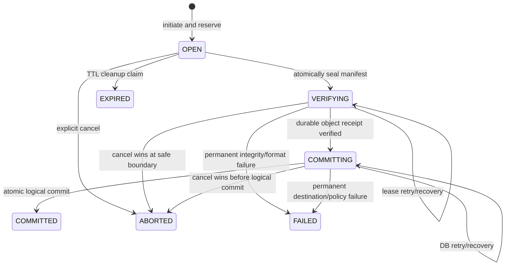
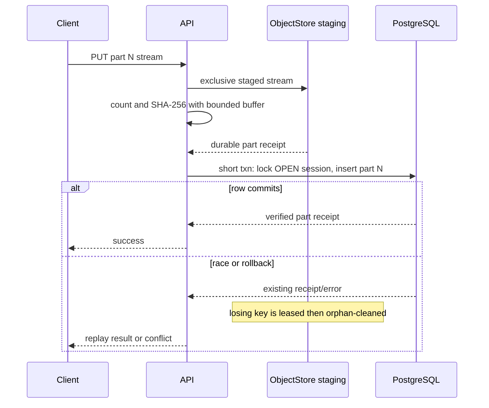

# Giao thức upload có thể tiếp tục

Trạng thái: **Blueprint quy chuẩn; subset persisted upload-session/application-service IMPLEMENTED/VALIDATED; exact-offset HTTP byte transport IMPLEMENTED**

Tài liệu này đặc tả state machine upload có thể tiếp tục do server điều phối.
Tài liệu tuân theo ADR-005, các entity chuẩn trong
[DOMAIN_MODEL.md](DOMAIN_MODEL.md) và hợp đồng object bền vững trong
[STORAGE.md](STORAGE.md). Repository hiện đã implement subset bounded session
được lưu bền vững và application service trung lập transport được mô tả bên
dưới. Subset HTTP exact-offset đã authenticate hiện đã implement và được đặc tả
trong [`api/openapi.yaml`](../../api/openapi.yaml). Protocol part-manifest lớn
hơn vẫn là blueprint; tài liệu này không tuyên bố protocol đó đã implement.

## Ranh giới implementation hiện tại của repository

Implementation hiện cung cấp:

- persistence PostgreSQL cho `upload_sessions` cùng record
  `object_replicas` verified đầu tiên, gồm owner/library/target intent, identity
  staging và object mờ đục, progress, lease, expiry, terminal error, durability
  evidence và completion outcome;
- semantic target `CREATE_FILE` và `REPLACE_CONTENT`, cùng recheck expected
  node revision ở bước finalization;
- append exact-offset, giới hạn object/chunk/session bounded, đối soát progress
  staging, status projection an toàn và state public
  `OPEN -> VERIFYING -> COMMITTING -> COMMITTED` với state terminal failure,
  expiry và abort;
- staging local bền vững, verify checksum, promotion create-only và xác nhận
  read/integrity sau promotion thông qua port `ObjectStore` trung lập backend; và
- storage application service cùng test restart/idempotency/integrity/version
  conflict tập trung; và
- route create/status/append/complete/abort cho upload session đã authenticate,
  CSRF trên mọi mutation, raw-byte append streaming có giới hạn, error ổn định
  an toàn, recovery offset có thẩm quyền và browser API helper typed.

`UploadPart`, ordered manifest, fingerprint idempotency phong phú hơn, quota
reservation và upload-specific worker scheduling vẫn là công việc về sau và
không được suy ra từ subset HTTP exact-offset này. Pipeline execution/worker GC
nội bộ đã implement được mô tả trong `STORAGE.md`; nó không phải capability của
protocol upload. Content-read application service
trung lập transport và HTTP download transport authenticate được mô tả trong
[STORAGE.md](STORAGE.md) và [API_ARCHITECTURE.md](API_ARCHITECTURE.md); upload UI
product, download UI, sync và backup vẫn được hoạch định.

## Subset HTTP exact-offset đã implement

Transport chuẩn hiện tại cố ý nhỏ hơn blueprint part-manifest tương lai:

| Method và path | Contract đã implement |
|---|---|
| `POST /api/v1/upload-sessions` | JSON tagged strict 16 KiB cho `CREATE_FILE` hoặc `REPLACE_CONTENT`; identity đã authenticate là owner và mutation cần CSRF proof hiện có. |
| `GET /api/v1/upload-sessions/{upload_session_id}` | State an toàn theo owner cùng `Upload-Offset` có thẩm quyền; cần authentication nhưng không cần CSRF. |
| `PATCH /api/v1/upload-sessions/{upload_session_id}` | `application/octet-stream` không rỗng, một `Upload-Offset` unsigned-decimal chuẩn và aggregate chunk limit do service cấu hình (mặc định 8 MiB). |
| `POST /api/v1/upload-sessions/{upload_session_id}/complete` | Chỉ gọi completion service đã validate và trả completion metadata chuẩn, ổn định khi retry. |
| `POST /api/v1/upload-sessions/{upload_session_id}/abort` | Chỉ gọi abort service đã validate; repeat an toàn và code API không trực tiếp xóa storage. |

Body PATCH được chuyển từng frame vào upload application service; HTTP handler
không aggregate toàn bộ chunk. Mọi frame được chấp nhận đều đi qua durable
exact-offset append và persistence progress. Do đó disconnect, timeout hoặc
chunked request vượt aggregate limit có thể để lại một prefix đã bền vững dù
caller không nhận success. Đây là ambiguity có thể recovery có chủ ý, không
phải quyền đoán progress:

```text
kết quả PATCH mơ hồ
    -> GET cùng upload session
    -> đọc Upload-Offset / received_bytes
    -> resume chính xác tại offset đó
```

Offset stale hoặc gap trả `409 invalid_offset`, kèm header `Upload-Offset` có
thẩm quyền và safe detail `current_offset`, đồng thời không append byte nào.
Browser helper gửi trực tiếp `Blob`/`ArrayBuffer` và làm theo offset được trả;
nó không encode content thành base64 hay implement upload UI.

Executable hiện tại chỉ wire service này khi cả `DATABASE_URL` và
`SYNVEIL_OBJECT_ROOT` tuyệt đối, tường minh được cấu hình. Khi thiếu một
dependency, route đã authenticate fail closed bằng dependency error an toàn.
Wiring này là boundary composition runtime/developer, không phải bằng chứng hỗ
trợ deployment production.

## Mục tiêu và non-goal

Giao thức phải:

- stream file lớn hơn memory qua network không ổn định;
- tiếp tục mà không truyền lại part đã verify;
- làm cho upload part, seal, verification và completion trở nên idempotent;
- sống sót khi API/worker/PostgreSQL/object store crash tại mọi ranh giới;
- verify canonical length và SHA-256 trước khi có `FileVersion` nhìn thấy được;
- tuần tự hóa completion concurrent và replay response success bị mất;
- giới hạn số session, object size, part count, memory, hashing concurrency,
  temporary storage và quota reservation;
- hỗ trợ adapter cục bộ trước và adapter S3/MinIO mà không giả định filesystem
  rename.

Giao thức ban đầu không cung cấp peer-to-peer upload, signed URL chưa verify từ
client tới bucket, deduplication cấp chunk, negotiation format streaming
compression hay upload endpoint làm lộ raw object key.

## Bất biến giao thức

1. `UploadSession` là staging intent, không phải file hay version nhìn thấy được.
2. Initiation đóng băng owner/device, library, destination operation, expected
   total length, base precondition, part policy, expiry và request identity.
3. Part chỉ trở thành `VERIFIED` sau khi server đã stream mọi byte, enforce
   length, tính checksum, stage bền vững và commit part receipt trong PostgreSQL.
4. Session ở `VERIFYING` hoặc muộn hơn không nhận part mới/replacement/deleted.
5. Chính xác một ordered manifest được seal. Gap, overlap, range trùng, overflow,
   non-final part quá nhỏ và part count quá mức phải fail trước assembly.
6. Chính xác một terminal completion outcome có thể thắng. Retry cùng semantic
   request trả về outcome đã lưu đó.
7. SHA-256 chuẩn được server verify trên complete logical byte stream; hash do
   client cung cấp là expectation, không bao giờ là bằng chứng content đã tồn
   tại.
8. Database transaction không bao giờ mở trong lúc nhận body, assemble part,
   hash file lớn, flush file hay complete S3 multipart.
9. Upload đã commit hàm ý immutable object bền vững. Byte bền vững chưa có
   committed outcome vẫn có lease/có thể recovery và về sau trở thành orphan
   candidate được grace bảo vệ.
10. Quota và staging capacity được reserve trước khi nhận work không giới hạn và
    được finalize/release trong transaction.

## Mô hình resource

### Session intent

Initiation ghi ít nhất:

- session ID, owner user, authenticated device/session, target library và dedup
  domain;
- operation `CREATE_FILE` hoặc `REPLACE_CONTENT`;
- với create: target parent ID, requested display name và expected parent
  revision/name policy context;
- với replace: target node ID và `base_version_id` bắt buộc; có thể cung cấp
  metadata ETag cho interactive precondition chặt hơn;
- conflict policy: `FAIL` cho upload interactive/API thông thường hoặc policy
  `PRESERVE_COPY` được authorize tường minh cho sync ingestion;
- expected plaintext length bắt buộc, `sha256` dự kiến tùy chọn, media type,
  client modification time và untrusted metadata có giới hạn;
- part-size/minimum/final-part rule đã negotiate, maximum part count và checksum
  algorithm;
- intent storage staging/final mờ đục được gán trước, quota reservation, expiry
  và metadata recovery lease;
- initiation và completion idempotency identity, request fingerprint và terminal
  result/error đã lưu.

Không thể đổi destination sau initiation. Caller chọn parent, node, name,
content length hoặc base khác phải tạo session mới. Điều này ngăn một tập byte
đã verify bị replay vào destination có nhiều đặc quyền hơn.

### Identity của part

Giao thức ban đầu dùng part number nguyên liên tiếp bắt đầu từ zero. Server dẫn
xuất expected logical range từ negotiated part size và total length; client
không submit arbitrary overlapping byte range. Final part có thể ngắn hơn.
Object zero-byte dùng manifest rỗng và vẫn qua whole-object verification.

Mỗi part receipt lưu:

- identity duy nhất `(upload_session_id, part_number)`;
- expected và observed logical range/length;
- checksum client khai báo khi có và SHA-256 server quan sát;
- opaque staging handle và adapter receipt;
- state/generation và timestamp;
- request fingerprint cần để phân biệt retry giống hệt với body khác dưới cùng
  part number.

SHA-256 của part không hợp thành SHA-256 toàn file. Nó chỉ cung cấp integrity cho
transfer và retry; completion vẫn hash complete byte stream theo đúng thứ tự trừ
khi capability backend tương lai được chứng minh cung cấp chính xác canonical
whole-object checksum.

## State machine

Các trạng thái bên ngoài chuẩn là những trạng thái trong `DOMAIN_MODEL.md`:



`VERIFYING` chứa các internal phase đã persist như `ASSEMBLING`, `HASHING`,
`FINALIZING` và `READBACK_VERIFY`; các phase đó là checkpoint chẩn đoán và
recovery, không phải public state bổ sung. `FAILED`, `EXPIRED`, `ABORTED` và
`COMMITTED` là terminal. Failure backend/database có thể retry không được dùng
`FAILED` quá sớm; nó giữ trạng thái có thể recovery với `next_attempt_at` và
safe error summary.

### `OPEN`

- Nhận part operation và status read.
- Có thể xóa tường minh verified part trước seal bằng ETag hoặc checksum
  precondition của part; replacement là generation/staging key mới thay vì ghi
  đè tại chỗ.
- Sở hữu logical quota reservation và staging allowance có giới hạn.
- Có thể thành `ABORTED` bởi owner hoặc `EXPIRED` bởi cleanup claim có kiểm tra
  generation khi không còn active request/lease.

### `VERIFYING`

- Ordered part manifest và fingerprint của nó được đóng băng.
- Một API process hoặc worker sở hữu lease generation có giới hạn, có thể renew.
- Nó assemble/finalize, tính total length và SHA-256, so sánh mọi expectation và
  persist immutable durability receipt.
- Completion caller khác nhận cùng status/result poll URI; không chạy assembly
  thứ hai.
- Mất lease cho phép worker khác tiếp tục từ bằng chứng đã persist. Worker cũ
  không thể ghi phase/result sau khi generation stale.

### `COMMITTING`

- Canonical byte và final key bền vững, đã verify và receipt được persist.
- Recovery chỉ thử lại short logical PostgreSQL transaction.
- Destination authorization, base state, name availability, quota, dedup
  selection và conflict policy được revalidate vì có thể đã đổi trong transfer.
- Transient DB error vẫn retryable. Permanent policy/base conflict hoặc tạo
  authorized sync conflict copy, hoặc ghi một terminal result `FAILED`. Nó
  không bao giờ âm thầm đổi destination.

### `COMMITTED`

Stored result chứa session, node, version, canonical object metadata an toàn cho
caller, strong ETag, journal correlation/cursor hint và server commit time. Mọi
complete request sau này giống nhau về ngữ nghĩa trả result này mà không tạo
object reference, version hay event mới.

### Trạng thái terminal failure/cancel

- `FAILED` giữ safe reason ổn định như `checksum_mismatch`, `version_conflict`,
  `invalid_manifest` hoặc policy rejection không thể đảo ngược. Nó không làm lộ
  backend path hay stack trace.
- `EXPIRED` nghĩa là cleanup khi expiry đã thắng generation của row `OPEN`. Part
  hoặc completion tới muộn bị từ chối với `upload_expired` và không thể mở lại.
- `ABORTED` nghĩa là explicit cancel đã thắng. Cancellation sau seal là request
  flag bền vững được xử lý tại safe phase boundary. Transaction worker/session
  check row state, lease generation và flag trước durable promotion rồi check
  lại ngay trước logical metadata commit. Nếu cancel thắng, nó persist terminal
  outcome, release reservation và enqueue cleanup idempotent. Byte đã finalize
  nhưng chưa được tham chiếu vẫn được lease/grace bảo vệ và thành orphan
  candidate để reconciliation; cleanup không bao giờ xóa object được tham
  chiếu. Nếu logical commit thắng trước, `COMMITTED` được trả và cancel không
  thể biến result đó thành deletion.

Terminal session giữ result/fingerprint đủ lâu để bảo đảm retry horizon đã ghi
tài liệu. Cleanup byte của chúng là job idempotent riêng.

## Blueprint API

Mọi route yêu cầu authenticated principal và authorization có scope tới target
library. Device credential còn cần scope upload/sync. Public object ID và storage
handle không bao giờ được chấp nhận làm destination authority.

### Initiate

```http
POST /api/v1/uploads
Idempotency-Key: <high-entropy client operation key>
```

Trách nhiệm request:

- khai báo operation/destination/base, exact total length, whole-object hash tùy
  chọn, media metadata và client capability;
- không bao giờ gửi storage key hay chọn server backend;
- với sync, bao gồm `client_mutation_id` và conflict policy được endpoint/grant
  đó cho phép.

Trách nhiệm response:

- trả session ID, state, negotiated part size/count/checksum rule, expiry,
  maximum concurrency, part/status/complete URL và reservation summary;
- trả cùng session cho key lặp lại và normalized request giống hệt;
- trả `idempotency_conflict` nếu key được tái sử dụng với fingerprint khác.

Initiation validate maximum object size, integer overflow, parent/node kind,
authorization, current base existence, policy, concurrent-session limit,
logical quota reservation và instance staging headroom trong một transaction
ngắn. Nó không tạo `Node` hay placeholder nhìn thấy được đối với sync.

### Upload một part

```http
PUT /api/v1/uploads/{upload_id}/parts/{part_number}
Content-Length: <exact negotiated length>
Digest: sha-256=<optional client digest in reviewed encoding>
If-None-Match: *
```

Handler authenticate và validate session/range trước khi đọc body, rồi stream
vào staging key duy nhất trong khi count và hash. Memory mỗi connection có giới
hạn. Khi EOF, handler verify length/digest, finalize bền vững part staging
receipt, rồi lock session trong thời gian ngắn và insert verified part row nếu
session vẫn `OPEN`.

Nếu database insert fail sau durable staging, part key đó là orphan candidate.
Nếu request khác thắng cùng part number:

- cùng observed length/checksum và request fingerprint tương thích trả existing
  part receipt;
- content khác trả `part_conflict` và để losing staging key cho delayed cleanup;
- caller cố ý muốn byte khác phải xóa part với current ETag khi session `OPEN`,
  rồi upload part generation mới.

API có thể trả verified-part ETag/checksum và không bao giờ trả physical locator.
Stream fail, bị cancel, quá dài, quá ngắn hoặc checksum mismatch không tạo
verified part row.

### Inspect/tiếp tục

```http
GET /api/v1/uploads/{upload_id}
GET /api/v1/uploads/{upload_id}/parts?cursor=<opaque-keyset-cursor>
```

Session resource gồm state, expiry, expected size, negotiated policy, count hoặc
summary hữu hạn của part/missing range, retryable safe error, phase progress,
terminal result và link tới collection part. Collection part được phân trang
mang part number/range/checksum đã verify; session resource không bao giờ embed
list không giới hạn. Phân trang part dùng stable keyset; không được bỏ sót
committed part vì backend listing eventually consistent bị trễ. PostgreSQL
receipt có thẩm quyền và known key được verify trực tiếp khi recovery cần.

### Seal và complete

```http
POST /api/v1/uploads/{upload_id}/complete
Idempotency-Key: <completion key>
```

Request chứa chính xác ordered part-number/checksum manifest và tùy chọn lặp lại
expected whole-object hash. Transaction ngắn đầu tiên lock session, validate
`OPEN`, validate mọi part và total range, lưu manifest fingerprint/completion
key, đổi state sang `VERIFYING`, tạo verification lease/job rồi commit.

Completion có thể trả:

- `201`/`200` cùng stored committed result nếu work hoàn tất trong synchronous
  budget có giới hạn;
- `202` cùng status URI trong khi assembly/verification/commit tiếp tục;
- cùng terminal success/failure cho request tương đương lặp lại;
- `completion_conflict` nếu manifest/key khác cho session đó đã được seal.

Giao thức không yêu cầu HTTP request mở trong multi-hour assembly. Ban đầu
polling có thẩm quyền; notification có thể là optional outbox consumer về sau.

### Abort

```http
DELETE /api/v1/uploads/{upload_id}
If-Match: <session-etag>
```

Ở `OPEN`, transaction đổi state sang `ABORTED`, release quota và enqueue cleanup.
Lặp abort thành công idempotently. Khi đã `COMMITTED`, abort không xóa file.
Trong `VERIFYING`/`COMMITTING`, request ghi durable cancel flag và trả stored
terminal outcome hoặc `202` trong khi lease owner tới safe boundary. Transition
row có kiểm tra generation sang `ABORTED` và logical commit cuối loại trừ lẫn
nhau; response hoặc status read sau đó báo terminal state nào thắng.

## Ranh giới transaction khi ghi part

Part upload cố ý dùng mini-saga storage-before-database:



Không part nào được suy ra chỉ từ local temp filename hay S3 multipart listing.
Recovery validate persisted staging handle và sửa thành bằng chứng missing hoặc
verified.

## Assembly và whole-object verification

### Path adapter cục bộ

Verifier mở verified part handle theo manifest order, stream chúng vào một
exclusive finalization temp trên destination filesystem rồi tính whole-object
SHA-256 và length trong một pass. Nó không map hay buffer toàn file. Nó verify
expected total, flush, promote không replacement và ghi local durability receipt
được định nghĩa trong [STORAGE.md](STORAGE.md).

Nếu crash chỉ để lại temp, successor restart hoặc xóa an toàn. Nếu promotion
thành công nhưng mất receipt update, preassigned final key của session được
inspect và reverify đầy đủ. Successor không mù quáng concatenate final object
thứ hai.

### Path tương thích S3

Adapter có thể map staged part sang native multipart upload, nhưng completion
phải tuân provider constraint và sealed ordering. Complete làm unique final key
nhìn thấy được; recovery dùng stored multipart ID và preassigned key. Provider
ETag không phải canonical checksum.

Để tương thích chung, path đúng ban đầu tính canonical SHA-256 khi byte đi qua
Synveil và/hoặc thực hiện complete verified readback của assembled logical
stream. Chỉ được bỏ pass đó sau khi declared backend checksum capability vượt
conformance cho chính xác algorithm và assembly semantics. Tối ưu performance
không thể làm yếu canonical-integrity invariant.

### Verification mismatch

Part-manifest mismatch, total-length mismatch, expected whole-hash mismatch hoặc
stored-readback mismatch chuyển session thành terminal `FAILED`, quarantine
final byte mơ hồ, release logical reservation nếu policy cho phép và enqueue
delayed cleanup/incident work. Nó không bao giờ fallback về client hash,
truncate/extend content hay commit partial version.

## Logical commit nguyên tử

Sau durable verification, session vào `COMMITTING`. Một PostgreSQL transaction
thực hiện mọi logical effect:

1. lock session và xác nhận cùng durability receipt, completion fingerprint,
   generation, principal và nonterminal state;
2. lock/authorize destination node và record quota/accounting;
3. revalidate base content version và mọi node/parent ETag chặt hơn;
4. áp dụng conflict policy mà không gây last-writer-wins loss;
5. select/create canonical `Object` và `ObjectReplica` cùng domain, dùng equality
   uniqueness để giải quyết dedup race;
6. tạo `FileVersion` bất biến và tạo/cập nhật `Node` head, hoặc tạo deterministic
   sync conflict node/version;
7. convert/release quota reservation và tạo authoritative object reference;
8. cấp library change sequence theo [SYNC.md](SYNC.md), append change fact,
   append audit event cùng outbox/job bắt buộc;
9. lưu full completion outcome và đổi session sang `COMMITTED`;
10. commit và chỉ sau đó acknowledge success.

`REPLACE_CONTENT` thông thường có base đã thay đổi ghi terminal
`version_conflict` và không retarget byte. Sync upload với policy
`PRESERVE_COPY` đã authorize tuân theo conflict-copy rule trong
[SYNC.md](SYNC.md). Nếu node bị trash khi offline sync upload đang in flight,
incoming byte được bảo toàn thành recovered conflict thay vì âm thầm hồi sinh
hoặc ghi đè Trash.

Transaction chỉ được retry cho serialization/deadlock/transient database
failure đã phân loại, dùng cùng session outcome identity. SQL retry không bao
giờ lặp lại object write.

## Idempotency và concurrency

### Request identity

- Initiation yêu cầu `Idempotency-Key`, có scope theo authenticated principal và
  route, cùng normalized request fingerprint.
- Offline sync còn cung cấp `client_mutation_id` duy nhất toàn cục, có scope theo
  device và library và được lưu cùng semantic outcome.
- Part identity là session + part number + generation và verified content
  fingerprint.
- Completion lưu một key + sealed-manifest fingerprint trên session; bản thân
  session chỉ cho phép một terminal outcome.

Tái sử dụng key với fingerprint khác là conflict, không bao giờ là attempt mới.
Idempotency record được giữ đủ lâu cho offline/retry window đã ghi tài liệu;
content completion receipt nên được giữ gọn trong suốt vòng đời version hoặc
device/library liên quan để tránh duplicate version sau retry rất muộn.

### Race

- Hai initiation với một idempotency key trả một session.
- Hai upload cùng part có thể đều ghi staging, nhưng chỉ một verified receipt
  thắng; bên thua được cleanup sau.
- Part upload đối đầu seal được tuần tự hóa bởi session row. Hoặc part row được
  đưa vào trước sealing, hoặc upload bị từ chối; nó không bao giờ âm thầm bị bỏ
  sau acknowledged success.
- Hai complete seal một manifest. Một verifier lease generation hành động;
  stale generation không thể persist phase/result.
- Completion đối đầu abort/expiry có một terminal row winner.
- Dedup race dùng object equality constraint, không dùng `SELECT`-then-assume.
- Destination mutation trong transfer được phát hiện tại final transaction,
  không bị che bởi authorization/base check sớm.

## Quota, giới hạn và kiểm soát lạm dụng

Trước khi initiation commit, validate:

- maximum file size được cấu hình và exact nonnegative length không integer
  overflow;
- logical quota của user/library bao gồm active reservation;
- open session và request rate limit theo principal/device/IP;
- staging reservation limit toàn cục và theo backend;
- negotiated part size/count nằm trong bound của server;
- allowed metadata length và cú pháp media type.

Part handler enforce chính xác `Content-Length`, transport body ceiling, idle và
absolute timeout, maximum concurrent stream theo principal/session, hashing/IO
concurrency có giới hạn và cancellation. Chunk size đủ lớn để giới hạn row/object
count và đủ nhỏ cho retry thực tế. Backend minimum như non-final multipart part
size của S3 là capability input, không phải protocol assumption bị expose thành
constant vĩnh viễn.

Accounting quota Trash, version và backup được định nghĩa trong
[STORAGE.md](STORAGE.md). Whole-object dedup có thể tiết kiệm physical byte nhưng
không hoàn lại logical quota. Disk-free precheck chỉ mang tính gợi ý; mọi write
vẫn xử lý full disk giữa stream một cách an toàn.

## Expiry và cleanup

Session `OPEN` có server expiry có thể được gia hạn qua policy heartbeat/status
có giới hạn và authenticated. Hành vi expiry worker:

1. claim candidate row trong transaction ngắn dùng row lock/skip-locked;
2. so sánh state, revision, active request/lease và server clock;
3. atomically đổi bên thắng sang `EXPIRED` và release quota;
4. enqueue một cleanup job theo generation;
5. abort/delete known staging handle ngoài transaction;
6. đánh dấu từng cleanup outcome; retry transient backend failure với backoff.

`VERIFYING`/`COMMITTING` không expire chỉ vì HTTP TTL ban đầu đã qua. Recovery
lease và attempt policy điều khiển chúng. Session bị stuck trở nên operator-
visible; quyết định terminal failure có chủ ý giữ reason trước cleanup.

Cleanup không bao giờ dựa vào prefix dựng từ client input. Final immutable key
tuân theo orphan grace dài hơn và recovery inspection trong
[STORAGE.md](STORAGE.md); part staging chỉ có thể dùng session cleanup policy sau
khi terminal state đã chắc chắn.

## Ma trận failure và recovery

| Điểm failure | Trạng thái bền vững | Hành vi retry/recovery | Kết quả client |
|---|---|---|---|
| Disconnect trước full part body | Session vẫn `OPEN`; không verified part row | Xóa/expire partial exclusive temp; gửi lại part | Retryable transport error |
| Part byte bền vững, insert DB row fail | Staging key không được tham chiếu | Cùng request có thể stage lại; reconciler xóa bên thua sau grace | Retryable database error |
| DB part row commit, response mất | Verified part receipt tồn tại | Status hoặc identical PUT trả receipt đó | Cùng part success |
| Disk đầy trong part hoặc assembly | Không visible version; phase/error được ghi | Giải phóng capacity và retry cùng session/lease nếu staging còn hợp lệ | `storage_unavailable` hoặc `quota_exceeded`, retry hint |
| Seal race final part | Session row quyết định part có commit trước không | Được đưa vào đúng một lần hoặc part request bị từ chối sau seal | Complete hoặc `upload_sealed` |
| API chết sau `OPEN -> VERIFYING` | Frozen manifest, lease hết hạn | Worker/API generation mới tiếp tục | `202` khi status/retry |
| Assembly temp tồn tại sau crash | Không final receipt trừ khi promotion đã verify | Xóa/restart temp hoặc inspect preassigned final key | `202`/retryable |
| S3 complete/local promotion thành công, mất response/update DB phase | Known final key, session vẫn `VERIFYING` | `HEAD` và full verification recovery cùng object | Không duplicate logical result |
| Whole checksum mismatch | `FAILED`, byte bị quarantine/cleanup queued | Không retry nào được diễn giải lại cùng manifest; initiate upload đã sửa | `checksum_mismatch` |
| Durable object, logical DB commit fail | `COMMITTING`, receipt và lease được giữ | Chỉ retry logical transaction; orphan sau nếu terminal | Retryable database error |
| Destination base thay đổi | Conflict copy `COMMITTED` cho sync đã authorize, nếu không thì `FAILED` | Replay cùng terminal outcome | Conflict result/current state |
| DB commit thành công, response mất | Outcome `COMMITTED` tồn tại | Cùng complete/mutation key trả chính xác ID và ETag | Success replay |
| Hai complete caller | Một sealed fingerprint/lease/outcome | Bên thua observe/poll/replay bên thắng | Cùng result hoặc `completion_conflict` |
| Worker chết sau claim cleanup | Terminal session, cleanup lease hết hạn | Generation kế tiếp abort/delete idempotently | Terminal state không đổi |
| PostgreSQL unavailable trước part | Không thể thiết lập safe receipt | Ưu tiên reject/stop; không nhận canonical work không theo dõi được | `storage_unavailable`/`internal_dependency_unavailable` |
| Object backend unavailable lúc completion | Session vẫn có thể recovery; không metadata commit | Backoff/retry; status expose safe phase | `202` hoặc retryable `storage_unavailable` |

## Thuộc tính security

- Authorize session ở mọi request; entropy session ID không cấp access. Device
  bị revoke/pause không thể tiếp tục chỉ vì biết ID.
- Bind destination, owner, library, dedup domain, base và operation lúc
  initiation. Completion không thể thay thế chúng.
- Validate mọi length trước allocation và dùng checked arithmetic cho range,
  part count, quota và offset.
- Không tin file name là path, MIME type là parser, client hash là content proof
  hay S3 ETag là canonical integrity.
- Rate-limit initiation, part stream, status polling, failed digest attempt và
  completion CPU. Enforce time và memory có giới hạn theo connection.
- Không log request body, full sensitive name/path, checksum khi policy coi nhạy
  cảm, physical key, multipart ID, token hay backend error chứa credential.
- Malware/OCR/thumbnail scanning là asynchronous và không thể chuyển uncommitted
  object thành version. Future quarantine policy cho malicious content đòi hỏi
  availability contract tường minh riêng.

## Event và job

Logical completion transaction có thể append:

- một hoặc nhiều client `ChangeEvent` fact như `NODE_CREATED`,
  `CONTENT_UPDATED` hoặc `CONFLICT_CREATED`;
- một `AuditEvent` cho outcome completion upload;
- internal outbox event `upload.completed.v1` bind với immutable version ID;
- optional job idempotent như metadata extraction, thumbnail generation,
  indexing hoặc integrity scrub về sau.

Part receipt và verification progress không phải library change event. Optional
consumer failure không đổi `COMMITTED`. Staging cleanup, verification recovery
và orphan reconciliation là durable job dùng lease-generation rule trong
[STORAGE.md](STORAGE.md).

## Test bắt buộc

### Giao thức và idempotency

- replay initiate với request giống hệt trả một session; request thay đổi dưới
  cùng key trả `idempotency_conflict`;
- upload zero-byte, one-part, short-final-part, part đến ngoài thứ tự, maximum
  allowed part count và very large streamed;
- retry cùng part/body trước và sau lost response trả một receipt;
- cùng part number với byte khác conflict; explicit remove/replacement chỉ hoạt
  động trong `OPEN` và với current generation;
- manifest duplicate/missing/overlapping/out-of-range/undersized/oversized bị từ
  chối mà không assembly;
- hai final part upload race seal có tính linearizable;
- hai complete call, manifest khác, lost complete response và retry nhiều tháng
  sau không thể tạo version/event thứ hai;
- abort đối đầu part, seal, verification và commit có đúng một terminal winner;
  abort sau commit không xóa node;
- expiry đối đầu active lease/status extension không thể xóa acknowledged work.

### Integrity và ranh giới storage

- server whole-object SHA-256 khớp known corpus bất kể part boundary/thứ tự đến;
- làm hỏng một staged part sau receipt và chứng minh final verification fail;
- client expected hash sai, length lệch một, part truncated/thừa, backend
  checksum sai và giá trị dạng S3 multipart ETag không bao giờ bypass
  verification;
- inject crash trước/sau local flush, promotion, S3 complete, persist durability
  receipt, chọn object dedup, logical DB commit và HTTP response;
- durable-object/DB-rollback không tạo visible node và chỉ được reuse hoặc orphan
  sau lease/grace;
- disk full tại mọi part/assembly boundary và tiếp tục sau capacity recovery;
- PostgreSQL/object backend unavailable độc lập; không metadata nào tham chiếu
  byte partial/missing;
- assertion bounded-memory dưới upload concurrent và slow client.

### Destination, quota và sync conflict

- create name collision sau initiation nhưng trước commit tuân failure policy
  tường minh và không bao giờ overwrite;
- interactive replace từ stale base trả current state và chỉ bảo toàn verified
  incoming byte theo terminal cleanup đã ghi tài liệu;
- hai offline sync replacement từ cùng base commit một head và một visible
  conflict copy với cả hai byte stream đã verify;
- rename/move trong content transfer giao hoán khi content base còn hợp lệ;
  delete/Trash trong transfer tuân recovered-conflict policy;
- reservation race không thể vượt logical quota; abort/expiry/failure release
  một lần; commit convert một lần; dedup không hoàn lại logical byte;
- content bằng nhau khác owner tạo accepted protocol behavior không thể phân
  biệt và không bao giờ reuse ngoài configured dedup domain.

### Recovery/property/fuzz

- command state-machine ngẫu nhiên không bao giờ transition khỏi terminal state,
  thêm part sau seal hay tạo nhiều hơn một completion outcome;
- manifest range ngẫu nhiên và checked arithmetic không thể overflow hoặc chấp
  nhận gap như content;
- lease-generation fuzz chứng minh stale verifier/cleanup worker không thể ghi
  success sau takeover;
- status/list pagination lặp dưới concurrent part completion trả mọi committed
  receipt mà không có duplicate làm đổi nghĩa;
- orphan cleanup idempotent cho local file vắng, multipart ID đã cancel và final
  key có logical commit thành công về sau.

## Observability và release gate

Metric bao phủ session theo state/age, reserved/staged byte, part throughput và
failure, duration verification/assembly/hash, bounded-worker saturation,
completion latency, duplicate request rate, lease takeover, expiry backlog,
orphan byte, checksum mismatch, disk-full/provider error và terminal error
class. Trace correlate request, session, part, verification generation, logical
mutation và worker mà không log content hay credential.

Release gate đòi hỏi conformance adapter cục bộ, tích hợp
PostgreSQL/object-store, crash injection tại mọi ranh giới trong ma trận,
streaming nhiều gigabyte với bounded memory, test quota/disk-full, fixture sync
conflict và operator runbook cho `VERIFYING`/`COMMITTING` bị stuck, staging
storage đầy, checksum incident, cleanup dead letter và orphan growth.

## Quyết định mở

OPEN DECISION OD-UPLOAD-001: part size và limit profile ban đầu
Owner: Uploads / Storage / Performance
Needed by: Gate OpenAPI và capacity Phase 2
Options: một server part size cố định; profile có giới hạn do server chọn theo object size/backend; client proposal bị server ràng buộc
Recommendation: server chọn từ một profile nhỏ có version bằng object size và backend capability, còn client coi giá trị trả về là riêng cho session và mờ đục
Decision evidence: browser/desktop retry test, giới hạn row/object-count, S3 conformance, benchmark memory và throughput

OPEN DECISION OD-UPLOAD-002: yêu cầu client part digest
Owner: Uploads / Clients / Security
Needed by: Đóng băng giao thức Phase 2
Options: yêu cầu SHA-256 cho mọi part; cho phép thiếu digest trong khi server tính; chỉ yêu cầu digest cho chế độ direct/native multipart
Recommendation: server luôn tính part digest; chấp nhận thiếu client digest để tương thích browser proxy qua API ban đầu, nhưng yêu cầu và verify nó cho mọi future direct-to-backend mode
Decision evidence: test browser streaming capability, đo retry bandwidth và phân tích corruption/threat

OPEN DECISION OD-UPLOAD-003: truyền trực tiếp S3
Owner: Storage / Uploads / Security
Needed by: Phase scale S3, không phải upload cục bộ Phase 2
Options: giữ mọi byte proxy qua API; cấp bounded signed multipart URL với checksum; deploy trusted ingest proxy chuyên dụng
Recommendation: proxy ban đầu; chỉ dùng signed direct transfer khi có proof exact length/checksum, expiry ngắn, hành vi abort/revocation, audit, quota enforcement và không có cross-domain presence oracle
Decision evidence: bộ interoperability S3/MinIO, threat review, failure recovery test và bottleneck API đo được
